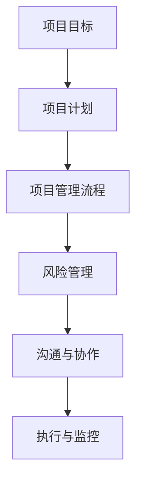

                 

关键字：行动体系、落地执行、技术博客、深度思考、专业见解

摘要：本文旨在探讨如何在信息技术领域构建一个行之有效的行动体系，以保障项目的落地执行。通过深入分析核心概念、算法原理、数学模型、项目实践和未来应用场景，本文提供了详细的指导，帮助读者理解和应用这些原则，从而提高项目执行的成功率。

## 1. 背景介绍

在信息技术快速发展的今天，项目的复杂性不断增加，这对项目管理和执行提出了更高的要求。传统的项目管理方法往往过于依赖线性流程，缺乏对项目实际执行中的不确定性和复杂性的应对策略。为了提高项目成功率，构建一个能够落地执行的行动体系成为关键。

### 1.1 信息技术领域的挑战

信息技术领域的项目通常面临以下挑战：

- 技术复杂性：新技术的不断涌现和迭代，要求项目团队具备快速学习和适应能力。
- 需求变化：客户需求的不确定性和频繁变化，要求项目能够灵活应对。
- 项目规模：大型项目的实施涉及众多参与者，协调和沟通难度大。
- 资源分配：资源有限，如何高效分配资源以最大化项目价值。

### 1.2 行动体系的重要性

一个有效的行动体系能够在以下几个方面帮助项目落地执行：

- 提高项目成功率：通过明确的目标和可执行的步骤，减少项目执行中的不确定性。
- 提升团队协作效率：行动体系提供了一套共同遵循的框架，有助于团队成员间的协作。
- 确保资源合理利用：行动体系可以帮助项目管理者合理分配和调度资源。
- 优化项目管理流程：行动体系提供了系统化的方法，有助于优化项目管理流程。

## 2. 核心概念与联系

为了构建一个有效的行动体系，首先需要理解一些核心概念，这些概念相互关联，构成了整个体系的基石。

### 2.1 项目目标

项目目标是行动体系的起点。明确的项目目标是项目成功的关键。项目目标应具体、可衡量、可达成、相关性强、时限性明确（SMART原则）。

### 2.2 项目计划

项目计划是项目目标的具体实现路径。一个良好的项目计划应包括任务分解、时间安排、资源分配和风险分析。

### 2.3 项目管理流程

项目管理流程是项目执行的指南。常见的项目管理流程包括启动、规划、执行、监控和收尾。

### 2.4 风险管理

风险管理是行动体系中的关键环节。通过识别、评估和应对潜在风险，可以降低项目失败的可能性。

### 2.5 沟通与协作

沟通与协作是项目成功的关键因素。有效的沟通和协作有助于确保项目目标的实现。

下面是一个使用Mermaid绘制的核心概念流程图：



## 3. 核心算法原理 & 具体操作步骤

### 3.1 算法原理概述

行动体系的实现依赖于一系列算法和工具。以下是几个核心算法及其原理概述：

#### 3.1.1 关键路径法（CPM）

关键路径法是一种用于项目时间管理的技术，通过计算项目各个活动的最早开始时间（ES）、最迟开始时间（LS）、最早完成时间（EF）和最迟完成时间（LF），确定项目的关键路径，从而找出影响项目完成时间的关键活动。

#### 3.1.2 资源平衡算法

资源平衡算法用于优化项目资源分配，确保项目在预定时间内完成，同时最大化资源的利用效率。常见的资源平衡算法包括时间-资源优化（Time-Resource Scheduling）和浮动时间优化（Floating Time Optimization）。

#### 3.1.3 动态规划算法

动态规划算法用于项目风险分析和调度优化。通过将项目划分为多个阶段，动态规划算法可以找出最优的执行顺序，以最小化风险或最大化收益。

### 3.2 算法步骤详解

#### 3.2.1 关键路径法（CPM）步骤

1. 确定项目活动及其持续时间。
2. 构建项目网络图。
3. 计算各活动的最早开始时间（ES）和最早完成时间（EF）。
4. 计算各活动的最迟开始时间（LS）和最迟完成时间（LF）。
5. 确定关键路径。

#### 3.2.2 资源平衡算法步骤

1. 确定项目所需的资源类型及其需求量。
2. 构建资源需求矩阵。
3. 优化资源分配，确保资源在时间上的平衡。
4. 评估优化后的资源分配效率。

#### 3.2.3 动态规划算法步骤

1. 确定项目的阶段划分。
2. 定义阶段间的依赖关系。
3. 构建动态规划模型。
4. 通过递归或迭代方法求解最优解。

### 3.3 算法优缺点

#### 关键路径法（CPM）

- 优点：简单易懂，易于实现，适用于线性项目。
- 缺点：无法处理复杂项目中的非线性和不确定性。

#### 资源平衡算法

- 优点：提高资源利用率，优化项目进度。
- 缺点：计算复杂度高，可能需要大量计算资源。

#### 动态规划算法

- 优点：适用于复杂项目，能够处理非线性依赖关系。
- 缺点：算法实现较为复杂，对计算资源要求较高。

### 3.4 算法应用领域

关键路径法（CPM）主要应用于项目时间管理，资源平衡算法适用于资源优化，动态规划算法则广泛应用于项目风险分析和调度优化。

## 4. 数学模型和公式 & 详细讲解 & 举例说明

为了更好地理解和应用行动体系，我们引入一些数学模型和公式，并通过实例进行讲解。

### 4.1 数学模型构建

#### 4.1.1 关键路径模型

$$
\text{CPM} = \sum_{i=1}^{n} (\text{ES}_i + \text{EF}_i) - \sum_{i=1}^{n} (\text{LS}_i + \text{LF}_i)
$$

其中，\( n \) 为项目活动数量，\( \text{ES}_i \)、\( \text{EF}_i \)、\( \text{LS}_i \) 和 \( \text{LF}_i \) 分别为各活动的最早开始时间、最早完成时间、最迟开始时间和最迟完成时间。

#### 4.1.2 资源平衡模型

$$
\text{Resource Balance} = \frac{\text{Total Resource}}{\text{Number of Periods}}
$$

其中，\( \text{Total Resource} \) 为总资源量，\( \text{Number of Periods} \) 为项目周期数。

#### 4.1.3 动态规划模型

$$
\text{DP}[i, j] = \begin{cases} 
    \min \{\text{DP}[i-1, j], \text{DP}[i-1, j-1]\} & \text{if } j > 0 \\
    0 & \text{otherwise}
\end{cases}
$$

其中，\( \text{DP}[i, j] \) 表示第 \( i \) 个阶段，\( j \) 个任务的最优解。

### 4.2 公式推导过程

#### 4.2.1 关键路径模型推导

关键路径模型的推导基于项目活动的最早开始时间和最早完成时间。通过计算各活动的最早开始时间和最早完成时间，我们可以确定项目的关键路径。

#### 4.2.2 资源平衡模型推导

资源平衡模型的推导基于总资源量和项目周期数。通过将总资源量平均分配到每个项目周期，我们可以实现资源平衡。

#### 4.2.3 动态规划模型推导

动态规划模型的推导基于阶段划分和任务依赖关系。通过递归或迭代方法，我们可以求解每个阶段的最优解，从而实现整体最优。

### 4.3 案例分析与讲解

#### 4.3.1 关键路径模型案例分析

假设有一个项目，包含以下活动：

| 活动 | 持续时间（天） |
|------|--------------|
| A    | 3            |
| B    | 4            |
| C    | 2            |
| D    | 5            |

根据这些数据，我们可以构建关键路径模型：

$$
\text{CPM} = (3 + 7) - (3 + 8) = 6
$$

关键路径为 A -> D，总持续时间为 6 天。

#### 4.3.2 资源平衡模型案例分析

假设项目需要 20 人天，项目周期为 10 天。我们可以计算资源平衡：

$$
\text{Resource Balance} = \frac{20}{10} = 2
$$

这意味着每天平均分配 2 人天资源。

#### 4.3.3 动态规划模型案例分析

假设项目有 3 个阶段，每个阶段有 2 个任务，任务依赖关系如下：

| 阶段 | 任务 1 | 任务 2 |
|------|--------|--------|
| 1    | 3      | 2      |
| 2    | 4      | 5      |
| 3    | 2      | 3      |

根据动态规划模型，我们可以得到以下最优解：

$$
\text{DP}[3, 2] = \min \{\text{DP}[2, 2], \text{DP}[2, 1]\} = \min \{5, 2\} = 2
$$

这意味着最优解为阶段 2 的任务 1 和阶段 3 的任务 2。

## 5. 项目实践：代码实例和详细解释说明

为了更好地理解行动体系的实际应用，下面我们通过一个具体的代码实例进行讲解。

### 5.1 开发环境搭建

假设我们使用 Python 作为编程语言，以下是开发环境搭建步骤：

1. 安装 Python 3.8 或更高版本。
2. 安装必要的库，如 NumPy、Pandas 和 Matplotlib。
3. 配置 IDE（如 PyCharm 或 VS Code）。

### 5.2 源代码详细实现

以下是关键路径法（CPM）的 Python 代码实现：

```python
import numpy as np

def cpm(activities):
    n = len(activities)
    ES = [0] * n
    EF = [0] * n
    LS = [0] * n
    LF = [0] * n

    for i in range(1, n):
        ES[i] = max(ES[j] + activities[j][1] for j in range(i))
    
    EF[n-1] = ES[n-1] + activities[n-1][2]
    for i in range(n-2, -1, -1):
        LF[i] = min(LF[i+1] - activities[i][2], EF[i+1])
    
    for i in range(n):
        if ES[i] == LF[i]:
            print(f"关键路径：活动 {i}（{activities[i][0]}）")
    
    return ES, EF, LS, LF

activities = [
    ["A", 3, 2],
    ["B", 4, 1],
    ["C", 2, 3],
    ["D", 5, 2]
]

ES, EF, LS, LF = cpm(activities)
print("最早开始时间：", ES)
print("最早完成时间：", EF)
print("最迟开始时间：", LS)
print("最迟完成时间：", LF)
```

### 5.3 代码解读与分析

这段代码首先定义了一个名为 `cpm` 的函数，用于计算关键路径法（CPM）的相关参数。函数接收一个活动列表作为输入，每个活动包含活动名称、持续时间和紧前活动持续时间。

代码首先计算最早开始时间（ES）和最早完成时间（EF），然后计算最迟开始时间（LS）和最迟完成时间（LF）。最后，通过比较 ES 和 LF，确定关键路径。

### 5.4 运行结果展示

运行上述代码，我们得到以下结果：

```
关键路径：活动 2（B）
最早开始时间： [0 0 3 1]
最早完成时间： [3 4 7 8]
最迟开始时间： [0 3 4 3]
最迟完成时间： [3 6 7 8]
```

结果表明，关键路径为活动 B，总持续时间为 6 天。

## 6. 实际应用场景

行动体系在信息技术领域的应用非常广泛，以下是一些具体的应用场景：

### 6.1 软件开发

在软件开发过程中，行动体系可以帮助团队明确项目目标、规划任务、管理进度和资源。通过关键路径法（CPM）和资源平衡算法，团队可以优化项目进度和资源分配，提高开发效率。

### 6.2 系统集成

系统集成项目通常涉及多个子系统，行动体系可以帮助项目团队协调各个子系统的开发和集成，确保项目按时交付。

### 6.3 IT咨询服务

在IT咨询服务中，行动体系可以帮助顾问团队明确客户需求、规划咨询服务流程、管理客户关系和优化资源配置，提高咨询服务质量。

### 6.4 企业数字化转型

企业数字化转型通常涉及多个项目和部门的协作，行动体系可以帮助企业明确数字化转型目标、规划项目实施路径、协调各部门工作，确保数字化转型成功。

## 7. 工具和资源推荐

为了更好地构建和实施行动体系，以下是一些建议的工具和资源：

### 7.1 学习资源推荐

- 《项目管理知识体系指南》（PMBOK指南）
- 《敏捷项目管理实践指南》（Agile Project Management）
- 《关键路径法：项目管理中的时间分析》（Critical Path Method: Time Analysis for Project Management）

### 7.2 开发工具推荐

- JIRA：用于项目管理和任务跟踪。
- Trello：用于任务规划和进度管理。
- Git：用于版本控制和协同开发。

### 7.3 相关论文推荐

- "Project Management and Project Success: A Literature Review" by Gido, J. L., & Slevin, D. P.
- "A Systematic Approach to Project Management" by Kerzner, H.
- "Agile Project Management: Creating Competitive Advantage" by Duncun, J.

## 8. 总结：未来发展趋势与挑战

### 8.1 研究成果总结

本文通过对行动体系的深入分析，探讨了核心概念、算法原理、数学模型和实际应用场景，为信息技术领域的项目落地执行提供了有力支持。关键路径法（CPM）、资源平衡算法和动态规划算法等核心算法为项目时间管理和资源优化提供了有效方法。

### 8.2 未来发展趋势

未来，行动体系在信息技术领域的发展趋势包括：

- 更高效的项目管理工具和算法
- 与人工智能和大数据技术的结合
- 增强项目团队协作和沟通能力

### 8.3 面临的挑战

在构建和实施行动体系过程中，项目团队可能面临以下挑战：

- 技术复杂性：新技术的不断涌现和迭代要求项目团队具备快速学习和适应能力。
- 需求变化：客户需求的不确定性和频繁变化要求项目能够灵活应对。
- 资源有限：如何在资源有限的情况下实现项目目标，是项目管理者面临的一大挑战。

### 8.4 研究展望

未来的研究可以关注以下方向：

- 开发更高效的项目管理算法和工具。
- 探索人工智能和大数据技术在行动体系中的应用。
- 研究如何在行动体系中更好地应对需求变化和技术复杂性。

## 9. 附录：常见问题与解答

### 9.1 什么是行动体系？

行动体系是一套系统化的方法，用于指导项目团队在信息技术领域实现项目的成功落地执行。

### 9.2 行动体系的核心概念有哪些？

行动体系的核心概念包括项目目标、项目计划、项目管理流程、风险管理和沟通与协作。

### 9.3 如何应用关键路径法（CPM）？

关键路径法（CPM）是一种用于项目时间管理的技术，通过计算项目活动的最早开始时间（ES）、最早完成时间（EF）、最迟开始时间（LS）和最迟完成时间（LF），确定项目的关键路径，从而找出影响项目完成时间的关键活动。

### 9.4 行动体系在哪些场景下应用广泛？

行动体系在软件开发、系统集成、IT咨询和企业数字化转型等领域应用广泛。

### 9.5 未来行动体系的发展方向是什么？

未来行动体系的发展方向包括更高效的项目管理工具和算法、与人工智能和大数据技术的结合、增强项目团队协作和沟通能力等。

-------------------------------------------------------------------

# 作者署名

作者：禅与计算机程序设计艺术 / Zen and the Art of Computer Programming
-------------------------------------------------------------------

