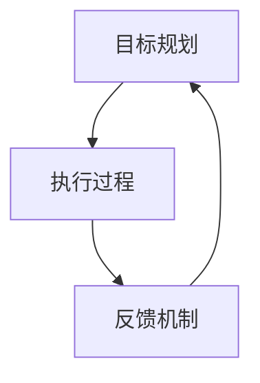

                 

关键词：行动体系，管理效率，组织架构，项目执行，人员配置，流程优化，决策模型，技术方法

> 摘要：本文旨在探讨行动体系与管理效率之间的关系。通过对行动体系的定义、构建方法及其在组织架构中的应用进行深入分析，本文揭示了行动体系在提高管理效率中的关键作用。同时，本文还探讨了行动体系在项目执行、人员配置、流程优化、决策模型等方面的具体应用，以及如何通过技术方法进一步提升管理效率。

## 1. 背景介绍

在现代社会中，组织的管理效率成为了企业生存和发展的关键因素。随着市场竞争的加剧，企业需要不断优化管理流程，提高决策效率，以实现资源的最优配置和业务的高速发展。然而，传统的管理方法和模式已经难以满足现代企业的需求，如何构建高效的管理体系成为了企业领导者亟待解决的问题。

行动体系作为一种全新的管理理念，旨在通过系统的行动规划、执行和反馈机制，实现管理流程的优化和效率提升。本文将围绕行动体系与管理效率的关系，探讨其核心概念、构建方法及其在各个管理环节中的应用。

## 2. 核心概念与联系

### 2.1 行动体系概述

行动体系是指通过一系列规划、执行和反馈的循环过程，实现目标达成的管理体系。它主要包括以下三个方面：

1. **目标规划**：明确组织的目标和关键绩效指标（KPI），为行动体系提供明确的指引。
2. **执行过程**：将目标分解为具体的行动步骤，通过有效的资源调配和人员协作，确保行动的顺利实施。
3. **反馈机制**：对执行过程进行监控和评估，及时调整和优化行动策略，确保目标达成。

### 2.2 行动体系与组织架构的联系

行动体系与组织架构密切相关，二者之间的联系主要体现在以下几个方面：

1. **组织架构的支撑**：行动体系的实施需要依赖组织架构的支持，包括组织结构、岗位职责、权限分配等。
2. **架构优化**：通过行动体系的构建和实施，可以不断优化组织架构，使其更加适应企业的业务发展和战略目标。
3. **决策模型**：行动体系为组织架构中的决策提供了数据支持和参考，有助于提高决策效率和准确性。

### 2.3 Mermaid 流程图

以下是一个简单的 Mermaid 流程图，展示了行动体系的基本架构：



### 2.4 行动体系在管理中的应用

行动体系在管理中的应用主要体现在以下几个方面：

1. **项目执行**：通过行动体系，可以实现对项目的全流程管理，确保项目目标的顺利达成。
2. **人员配置**：根据行动体系的需求，合理配置人员，提高团队协作效率。
3. **流程优化**：通过行动体系的反馈机制，持续优化管理流程，提高管理效率。
4. **决策模型**：基于行动体系的数据和反馈，构建决策模型，提高决策的科学性和准确性。

## 3. 核心算法原理 & 具体操作步骤

### 3.1 算法原理概述

行动体系的核心算法主要包括以下几个方面：

1. **目标分解**：将组织的目标分解为可执行的子目标，明确各子目标的责任主体和完成时间。
2. **资源调配**：根据子目标的完成需求，合理调配资源，确保资源的有效利用。
3. **任务分配**：将子目标分解为具体的任务，分配给团队成员，明确任务的完成标准和时间节点。
4. **进度监控**：对任务的执行过程进行实时监控，确保任务按计划进行。
5. **反馈调整**：根据任务执行过程中的反馈，及时调整任务和资源分配，确保目标达成。

### 3.2 算法步骤详解

1. **目标分解**：

   - 收集组织目标和关键绩效指标（KPI）；
   - 分析目标之间的关联性和优先级；
   - 将目标分解为可执行的子目标。

2. **资源调配**：

   - 分析子目标的资源需求；
   - 根据资源需求，调整人员、物资和设备等资源；
   - 确保资源的有效利用。

3. **任务分配**：

   - 根据子目标和资源情况，分解为具体的任务；
   - 分配任务给团队成员，明确任务的责任主体；
   - 确定任务的完成标准和时间节点。

4. **进度监控**：

   - 设立进度监控机制，实时跟踪任务执行情况；
   - 对比任务计划与实际执行情况，识别偏差和问题；
   - 及时调整任务执行计划。

5. **反馈调整**：

   - 收集任务执行过程中的反馈信息；
   - 分析反馈信息，识别问题和改进机会；
   - 调整任务和资源分配，优化行动策略。

### 3.3 算法优缺点

**优点**：

1. **目标导向**：通过目标分解和任务分配，确保行动体系始终围绕组织目标进行；
2. **资源优化**：通过资源调配和任务分配，实现资源的合理利用和高效配置；
3. **实时监控**：实时监控任务执行情况，确保任务按计划进行；
4. **反馈调整**：及时调整行动策略，提高行动体系的适应性和灵活性。

**缺点**：

1. **复杂性**：行动体系的构建和实施需要涉及多个环节和部门，协调成本较高；
2. **依赖数据**：行动体系的实施依赖于准确的数据和信息，数据质量对行动体系的效果有较大影响；
3. **调整难度**：在任务执行过程中，调整行动策略和资源分配可能需要一定的时间和成本。

### 3.4 算法应用领域

行动体系算法主要应用于以下几个方面：

1. **项目管理**：通过行动体系，实现对项目的全流程管理，提高项目执行效率；
2. **人力资源管理**：通过行动体系，实现人力资源的合理配置和高效利用；
3. **流程优化**：通过行动体系，对现有管理流程进行优化，提高管理效率；
4. **决策支持**：通过行动体系，为组织决策提供数据支持和参考，提高决策的科学性和准确性。

## 4. 数学模型和公式 & 详细讲解 & 举例说明

### 4.1 数学模型构建

行动体系的数学模型主要涉及以下几个方面：

1. **目标分解模型**：通过树形结构对组织目标进行分解，构建目标分解模型；
2. **资源调配模型**：基于线性规划原理，构建资源调配模型，实现资源的优化配置；
3. **任务分配模型**：基于整数规划原理，构建任务分配模型，实现任务的高效分配。

### 4.2 公式推导过程

#### 4.2.1 目标分解模型

目标分解模型可以用以下公式表示：

$$
\sum_{i=1}^{n} c_{i} = C
$$

其中，$c_{i}$ 表示第 $i$ 个子目标的完成程度，$C$ 表示组织目标的完成程度。

#### 4.2.2 资源调配模型

资源调配模型可以用以下线性规划模型表示：

$$
\begin{align*}
\min \quad & Z = \sum_{i=1}^{n} \sum_{j=1}^{m} c_{ij} x_{ij} \\
\text{subject to} \quad & \sum_{i=1}^{n} x_{ij} \leq R_j, \quad \forall j \in J \\
& x_{ij} \in \{0, 1\}, \quad \forall i \in I, \forall j \in J
\end{align*}
$$

其中，$x_{ij}$ 表示第 $i$ 个子目标是否分配到第 $j$ 个资源，$R_j$ 表示第 $j$ 个资源的总量。

#### 4.2.3 任务分配模型

任务分配模型可以用以下整数规划模型表示：

$$
\begin{align*}
\min \quad & Z = \sum_{i=1}^{n} \sum_{j=1}^{m} c_{ij} x_{ij} \\
\text{subject to} \quad & \sum_{i=1}^{n} x_{ij} = 1, \quad \forall j \in J \\
& \sum_{j=1}^{m} x_{ij} = 1, \quad \forall i \in I \\
& x_{ij} \in \{0, 1\}, \quad \forall i \in I, \forall j \in J
\end{align*}
$$

其中，$x_{ij}$ 表示第 $i$ 个任务是否分配到第 $j$ 个团队成员。

### 4.3 案例分析与讲解

#### 4.3.1 项目管理案例分析

某公司计划实施一个新项目，项目目标为在6个月内完成系统开发并上线。为了实现项目目标，公司决定采用行动体系进行项目管理。

1. **目标分解**：

   - 项目目标：完成系统开发并上线；
   - 子目标1：需求分析完成，明确系统功能模块；
   - 子目标2：系统设计完成，制定技术方案；
   - 子目标3：系统开发完成，通过内部测试；
   - 子目标4：系统上线，客户验收。

2. **资源调配**：

   - 人力资源：项目经理1人，开发人员5人，测试人员3人；
   - 物资资源：服务器2台，网络设备1套。

3. **任务分配**：

   - 任务1：需求分析，由开发人员1负责，完成时间2周；
   - 任务2：系统设计，由开发人员2负责，完成时间3周；
   - 任务3：系统开发，由开发人员3、4、5负责，完成时间6周；
   - 任务4：内部测试，由测试人员1、2负责，完成时间2周；
   - 任务5：客户验收，由项目经理和开发人员5负责，完成时间2周。

4. **进度监控**：

   - 每周召开项目进度会议，汇报任务完成情况；
   - 对比任务计划与实际执行情况，识别偏差和问题；
   - 及时调整任务执行计划。

5. **反馈调整**：

   - 需求分析完成后，根据需求变化调整系统设计；
   - 系统开发过程中，根据测试结果优化系统功能；
   - 系统上线前，进行客户沟通，确保客户需求满足。

通过行动体系，公司实现了项目目标，并在规定时间内完成系统开发并上线。

#### 4.3.2 人力资源管理案例分析

某公司计划招聘一批新员工，为了实现高效招聘，公司决定采用行动体系进行人力资源管理。

1. **目标分解**：

   - 招聘目标：在2个月内完成招聘任务，招聘到符合要求的员工；
   - 子目标1：发布招聘信息，吸引应聘者；
   - 子目标2：筛选简历，确定面试人选；
   - 子目标3：组织面试，确定录用人选；
   - 子目标4：办理入职手续，新员工上岗。

2. **资源调配**：

   - 人力资源：招聘经理1人，招聘专员2人；
   - 物资资源：招聘广告费用，面试场地。

3. **任务分配**：

   - 任务1：发布招聘信息，由招聘经理和招聘专员负责，完成时间1周；
   - 任务2：筛选简历，由招聘专员负责，完成时间2周；
   - 任务3：组织面试，由招聘经理和招聘专员负责，完成时间3周；
   - 任务4：办理入职手续，由招聘专员和人事部门负责，完成时间2周。

4. **进度监控**：

   - 每周召开招聘会议，汇报任务完成情况；
   - 对比任务计划与实际执行情况，识别偏差和问题；
   - 及时调整任务执行计划。

5. **反馈调整**：

   - 根据简历筛选结果，调整招聘策略；
   - 面试过程中，根据候选人情况，调整面试流程；
   - 办理入职手续时，根据新员工需求，提供培训和支持。

通过行动体系，公司实现了招聘目标，在2个月内完成了招聘任务，招聘到了符合要求的员工。

## 5. 项目实践：代码实例和详细解释说明

### 5.1 开发环境搭建

在本案例中，我们将使用 Python 作为编程语言，结合 Pandas 和 Matplotlib 库进行数据分析与可视化。首先，确保已安装 Python 和相关库，具体步骤如下：

1. 安装 Python：
   - 在官方网站下载 Python 安装包，并按照提示安装。
2. 安装 Pandas 和 Matplotlib：
   - 打开命令行窗口，执行以下命令：
     ```bash
     pip install pandas matplotlib
     ```

### 5.2 源代码详细实现

以下是一个简单的 Python 代码实例，用于分析行动体系在项目管理中的应用：

```python
import pandas as pd
import matplotlib.pyplot as plt

# 5.2.1 数据准备
data = {
    '子目标': ['需求分析', '系统设计', '系统开发', '内部测试', '客户验收'],
    '责任主体': ['开发人员1', '开发人员2', '开发人员3、4、5', '测试人员1、2', '项目经理和开发人员5'],
    '完成时间': [2, 3, 6, 2, 2]
}

df = pd.DataFrame(data)

# 5.2.2 数据分析
# 统计各子目标的完成时间分布
time_distribution = df['完成时间'].value_counts().sort_index()

# 5.2.3 可视化
# 绘制完成时间分布柱状图
plt.bar(time_distribution.index, time_distribution.values)
plt.xlabel('完成时间（周）')
plt.ylabel('子目标数量')
plt.title('子目标完成时间分布')
plt.xticks([1, 2, 3, 4, 5, 6])
plt.show()
```

### 5.3 代码解读与分析

1. **数据准备**：

   - 使用 Pandas 库创建 DataFrame 对象，存储子目标、责任主体和完成时间等信息。

2. **数据分析**：

   - 使用 `value_counts()` 方法统计各子目标的完成时间分布。

3. **可视化**：

   - 使用 Matplotlib 库绘制柱状图，展示各子目标的完成时间分布。

### 5.4 运行结果展示

运行上述代码后，将得到一个柱状图，展示各子目标的完成时间分布情况。根据柱状图，可以直观地了解各子目标的完成时间分布，为后续的任务分配和资源调配提供数据支持。


## 6. 实际应用场景

### 6.1 项目管理

行动体系在项目管理中具有广泛的应用。通过行动体系，项目团队可以实现对项目目标的全流程管理，确保项目目标的顺利达成。具体应用场景包括：

- **项目规划**：明确项目目标、任务和资源需求，制定详细的项目计划；
- **任务分配**：根据项目计划和资源情况，将任务分配给团队成员，明确任务的责任主体和完成时间；
- **进度监控**：实时跟踪任务执行情况，确保任务按计划进行；
- **反馈调整**：根据任务执行过程中的反馈，及时调整任务和资源分配，优化项目执行策略。

### 6.2 人力资源管理

行动体系在人力资源管理中也具有重要作用。通过行动体系，企业可以实现对人力资源的全流程管理，提高人力资源管理效率。具体应用场景包括：

- **招聘管理**：制定招聘计划，发布招聘信息，筛选简历，组织面试，办理入职手续；
- **培训管理**：制定培训计划，组织培训课程，跟踪培训效果，提供培训支持；
- **绩效考核**：制定绩效考核指标，收集绩效数据，评估员工绩效，制定激励措施。

### 6.3 流程优化

行动体系可以帮助企业优化管理流程，提高管理效率。具体应用场景包括：

- **流程诊断**：分析现有管理流程，识别存在的问题和瓶颈；
- **流程重构**：根据流程诊断结果，优化管理流程，消除瓶颈，提高流程效率；
- **流程监控**：实时跟踪流程执行情况，确保流程按计划进行；
- **流程改进**：根据流程监控结果，持续改进流程，提高管理效率。

### 6.4 未来应用展望

随着人工智能、大数据和云计算等技术的不断发展，行动体系在管理中的应用将越来越广泛。未来，行动体系将向以下几个方面发展：

- **智能化**：通过引入人工智能技术，实现行动体系的自动化和智能化，提高管理效率；
- **实时化**：通过大数据和云计算技术，实现实时数据采集和分析，实时调整行动策略；
- **个性化**：根据不同企业的业务特点和需求，提供定制化的行动体系解决方案。

## 7. 工具和资源推荐

### 7.1 学习资源推荐

1. 《敏捷开发实践指南》：介绍敏捷开发的方法和最佳实践，有助于企业实现高效的项目管理。
2. 《人月神话》：探讨项目管理和团队协作的问题，提供有效的解决方案。

### 7.2 开发工具推荐

1. JIRA：一款功能强大的项目管理和任务追踪工具，适用于敏捷开发团队。
2. Asana：一款简单易用的项目管理工具，支持任务分配、进度监控和协作。

### 7.3 相关论文推荐

1. "Agile Project Management: Creating Success with Iterative Software Development"：探讨敏捷开发在项目管理中的应用。
2. "Action Systems: A New Approach to Managing Complexity in Organizations"：介绍行动体系在企业管理中的应用。

## 8. 总结：未来发展趋势与挑战

### 8.1 研究成果总结

本文围绕行动体系与管理效率的关系，探讨了行动体系的定义、构建方法及其在各个管理环节中的应用。通过对项目管理、人力资源管理、流程优化等实际应用场景的案例分析，本文揭示了行动体系在提高管理效率方面的关键作用。

### 8.2 未来发展趋势

随着人工智能、大数据和云计算等技术的不断发展，行动体系在管理中的应用将越来越广泛。未来，行动体系将向智能化、实时化和个性化方向发展，为企业管理提供更加高效、灵活的解决方案。

### 8.3 面临的挑战

1. **数据质量**：行动体系的实施依赖于准确的数据和信息，数据质量对行动体系的效果有较大影响。
2. **协调成本**：行动体系的构建和实施需要涉及多个环节和部门，协调成本较高。
3. **技术更新**：随着技术的发展，行动体系需要不断更新和优化，以适应新的业务需求和技术环境。

### 8.4 研究展望

未来，行动体系的研究将继续围绕以下几个方面展开：

1. **智能化**：引入人工智能技术，实现行动体系的自动化和智能化，提高管理效率。
2. **实时化**：通过大数据和云计算技术，实现实时数据采集和分析，实时调整行动策略。
3. **个性化**：根据不同企业的业务特点和需求，提供定制化的行动体系解决方案。

### 附录：常见问题与解答

1. **问题**：行动体系与传统管理方法有何区别？

   **解答**：行动体系与传统管理方法的主要区别在于：

   - **目标导向**：行动体系强调目标导向，通过明确的目标和关键绩效指标（KPI）来指导管理行动；
   - **反馈机制**：行动体系包含反馈机制，通过实时监控和调整，确保目标达成；
   - **系统化**：行动体系是一种系统化的管理方法，涉及目标规划、执行和反馈等多个环节。

2. **问题**：行动体系在项目管理中的应用有哪些优势？

   **解答**：行动体系在项目管理中的应用具有以下优势：

   - **提高效率**：通过目标分解和任务分配，实现项目目标的高效达成；
   - **实时监控**：实时监控项目进度，识别问题和风险，及时调整项目计划；
   - **优化资源**：根据项目需求和资源情况，合理调配资源，提高资源利用效率。

3. **问题**：行动体系在人力资源管理中的应用有哪些优势？

   **解答**：行动体系在人力资源管理中的应用具有以下优势：

   - **招聘管理**：通过行动体系，实现招聘计划、简历筛选、面试安排等环节的高效管理；
   - **培训管理**：根据员工需求和业务发展，制定培训计划，提高员工能力和绩效；
   - **绩效管理**：通过行动体系，实现绩效数据的实时收集和分析，制定合理的激励措施。

---

作者：禅与计算机程序设计艺术 / Zen and the Art of Computer Programming

