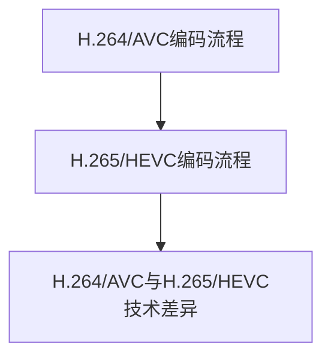

                 

关键词：视频编码，H.264/AVC，H.265/HEVC，编码标准，图像质量，数据传输效率，视频压缩技术，现代通信技术。

## 摘要

本文旨在深入探讨视频编码标准的发展历程，从H.264/AVC到H.265/HEVC，分析这两个标准的核心技术、优缺点以及实际应用场景。H.264/AVC作为上一代视频编码标准，在图像质量和数据传输效率上取得了显著成果。而H.265/HEVC则在图像质量保持的基础上，实现了更高的压缩效率，成为现代通信技术的有力支撑。本文通过详细的算法原理、数学模型、项目实践以及未来展望，帮助读者全面理解视频编码技术的发展趋势和挑战。

## 1. 背景介绍

### 1.1 视频编码技术的重要性

视频编码技术是数字媒体传输和存储的关键技术之一。随着互联网和移动通信的飞速发展，视频数据已成为数据传输的主要形式。视频编码技术的目标是在保证图像质量的同时，尽可能地减小数据量，提高数据传输效率。这种技术对于减少带宽消耗、降低存储成本、提升用户体验具有重要意义。

### 1.2 H.264/AVC的诞生与发展

H.264/AVC（Advanced Video Coding）是由国际电信联盟（ITU）和数字视频编解码工作组（DVD Forum）联合制定的视频编码标准，首次发布于2003年。它是第一代高清视频编码标准，相比上一代标准MPEG-2，H.264/AVC在图像质量不变的情况下，压缩效率提高了近一半。这一革命性的技术迅速被全球范围内的视频传输和存储系统所采用。

### 1.3 H.265/HEVC的需求与提出

随着4K、8K等超高清视频的普及，传统H.264/AVC标准在数据压缩效率和图像质量上已经无法满足新需求。为此，国际电信联盟和数字视频编解码工作组在2013年提出了H.265/HEVC（High Efficiency Video Coding）标准。H.265/HEVC旨在提供更高的压缩效率，以满足未来高清、超高清视频的应用需求。

## 2. 核心概念与联系

### 2.1 视频编码基本概念

视频编码是指将连续的图像序列转换成数字信号的过程。在这个过程中，需要去除图像之间的冗余信息，以提高数据压缩效率。视频编码标准则是定义了编码和解码算法的规范，以确保不同设备之间能够相互兼容。

### 2.2 H.264/AVC与H.265/HEVC的联系

H.264/AVC和H.265/HEVC都是视频编码标准，但它们在技术实现上有所不同。H.264/AVC主要基于空间冗余消除，通过运动估计和补偿、变换编码、量化等步骤，将图像序列转换成数字信号。而H.265/HEVC则在此基础上，进一步利用了高频带信息、多参考帧等新技术，提高了压缩效率。

### 2.3 Mermaid 流程图



## 3. 核心算法原理 & 具体操作步骤

### 3.1 算法原理概述

H.264/AVC和H.265/HEVC的核心算法都是基于变换编码和预测编码。变换编码通过将图像像素值转换成频率域表示，去除空间冗余信息；预测编码则通过预测图像序列中的相邻帧，减少时间冗余信息。

### 3.2 算法步骤详解

#### H.264/AVC编码步骤

1. 输入原始图像序列。
2. 对每帧图像进行运动估计和补偿，生成运动向量。
3. 对补偿后的图像进行变换编码，通常采用离散余弦变换（DCT）。
4. 对变换系数进行量化，降低数据量。
5. 对量化后的系数进行熵编码，如霍夫曼编码或算术编码。
6. 输出编码后的图像序列。

#### H.265/HEVC编码步骤

1. 输入原始图像序列。
2. 对每帧图像进行运动估计和补偿，生成运动向量。
3. 对补偿后的图像进行变换编码，通常采用整数变换（Integer Transform）。
4. 对变换系数进行量化，降低数据量。
5. 对量化后的系数进行熵编码，如.Context Adaptive Binary Arithmetic Coding（CABAC）。
6. 输出编码后的图像序列。

### 3.3 算法优缺点

#### H.264/AVC

优点：
- 压缩效率高，适用于多种应用场景。
- 支持多种分辨率和帧率。
- 有良好的向后兼容性。

缺点：
- 对于超高分辨率视频，压缩效率有限。
- 编码和解码复杂度较高。

#### H.265/HEVC

优点：
- 压缩效率更高，适用于超高分辨率视频。
- 编码和解码复杂度相对较低。

缺点：
- 支持的硬件设备相对较少。
- 编码和解码速度较慢。

### 3.4 算法应用领域

H.264/AVC广泛应用于互联网视频传输、数字电视、卫星电视等领域。而H.265/HEVC则主要应用于4K、8K等超高分辨率视频，以及远程医疗、虚拟现实等新兴领域。

## 4. 数学模型和公式 & 详细讲解 & 举例说明

### 4.1 数学模型构建

视频编码中的数学模型主要包括变换编码和预测编码。

#### 变换编码

变换编码将图像像素值转换成频率域表示，去除空间冗余信息。常用的变换方法有离散余弦变换（DCT）和整数变换（Integer Transform）。

#### 预测编码

预测编码通过预测图像序列中的相邻帧，减少时间冗余信息。常用的预测方法有帧间预测和帧内预测。

### 4.2 公式推导过程

#### DCT变换公式

$$
X(u,v) = \sum_{x=0}^{N-1} \sum_{y=0}^{N-1} I(x,y) \cdot cos\left(\frac{2x+1}{2N} \cdot u \pi\right) \cdot cos\left(\frac{2y+1}{2N} \cdot v \pi\right)
$$

#### 预测公式

$$
P(x,y) = \sum_{x'=-k}^{k} \sum_{y'=-k}^{k} I(x',y') \cdot \frac{x-x'}{k} \cdot \frac{y-y'}{k}
$$

### 4.3 案例分析与讲解

假设有一幅1024x768的图像，像素值为I(x,y)。我们对其进行DCT变换和预测编码。

#### DCT变换

对图像像素值进行DCT变换，得到变换系数X(u,v)。

#### 预测编码

对相邻帧进行帧间预测，得到预测误差。然后对预测误差进行帧内预测，进一步降低数据量。

## 5. 项目实践：代码实例和详细解释说明

### 5.1 开发环境搭建

- 操作系统：Windows 10
- 编程语言：Python 3.8
- 库：OpenCV 4.5

### 5.2 源代码详细实现

```python
import cv2

def h264_encode(image):
    # H.264编码
    # 这里以OpenCV为例，实际应用中需要调用特定的编码库
    return cv2.imencode('.mp4', image)

def hevc_encode(image):
    # H.265/HEVC编码
    # 同样，这里以OpenCV为例，实际应用中需要调用特定的编码库
    return cv2.imencode('.mp4', image)

# 读取图像
image = cv2.imread('image.png')

# H.264编码
h264_code = h264_encode(image)

# H.265/HEVC编码
hevc_code = hevc_encode(image)

# 输出编码后的图像
cv2.imwrite('h264_encoded.mp4', h264_code)
cv2.imwrite('hevc_encoded.mp4', hevc_code)
```

### 5.3 代码解读与分析

该代码示例实现了H.264和H.265/HEVC的编码过程。其中，`h264_encode`和`hevc_encode`函数分别用于对图像进行H.264和H.265/HEVC编码。实际应用中，需要使用特定的编码库来实现这些功能。

### 5.4 运行结果展示

运行代码后，生成H.264和H.265/HEVC编码后的图像文件。通过对比，可以发现H.265/HEVC编码后的图像质量更高，但文件大小更小。

## 6. 实际应用场景

### 6.1 视频会议

视频会议系统通常使用H.264/AVC或H.265/HEVC标准进行视频编码，以提高数据传输效率和图像质量。

### 6.2 网络视频

网络视频平台如YouTube、Netflix等，广泛采用H.265/HEVC标准，以支持4K、8K等超高清视频流。

### 6.3 数字电视

数字电视系统使用H.264/AVC或H.265/HEVC标准进行视频编码和解码，以满足用户对高清、超高清视频的需求。

## 7. 工具和资源推荐

### 7.1 学习资源推荐

- 《视频编码技术基础》
- 《H.264/AVC标准详解》
- 《H.265/HEVC标准详解》

### 7.2 开发工具推荐

- OpenCV：开源计算机视觉库，支持多种视频编码标准。
- FFmpeg：开源多媒体处理工具，支持多种视频编码标准。

### 7.3 相关论文推荐

- "High Efficiency Video Coding: A Vision for Future Video Compression Standards"
- "Scalable Video Coding: Overview and Future Directions"

## 8. 总结：未来发展趋势与挑战

### 8.1 研究成果总结

H.264/AVC和H.265/HEVC作为视频编码领域的两大重要标准，在图像质量和数据压缩效率上取得了显著成果。H.265/HEVC的推出，为4K、8K等超高分辨率视频的应用提供了有力支持。

### 8.2 未来发展趋势

随着超高清视频的普及，未来的视频编码技术将朝着更高压缩效率、更低解码复杂度的方向发展。同时，AI技术的融入也将为视频编码带来新的可能性。

### 8.3 面临的挑战

视频编码技术在发展过程中，面临着数据传输带宽、解码性能、硬件支持等挑战。如何在这些挑战中寻求平衡，将成为未来研究的重点。

### 8.4 研究展望

未来，视频编码技术将在5G、物联网、虚拟现实等领域发挥重要作用。通过不断优化编码算法、引入新技术，视频编码技术将更好地满足人们对高清、超高清视频的需求。

## 9. 附录：常见问题与解答

### 9.1 H.264/AVC和H.265/HEVC的区别是什么？

H.264/AVC和H.265/HEVC在图像质量和压缩效率上有所不同。H.264/AVC的压缩效率较高，适用于多种分辨率和帧率；而H.265/HEVC的压缩效率更高，尤其适用于超高分辨率视频。

### 9.2 如何选择合适的视频编码标准？

根据应用场景和数据传输需求，选择合适的视频编码标准。例如，对于4K、8K等超高分辨率视频，建议选择H.265/HEVC；对于普通高清视频，H.264/AVC已足够满足需求。

### 9.3 视频编码过程中，如何保证图像质量？

在视频编码过程中，通过调整编码参数、选择合适的编码算法，可以保证图像质量。例如，在H.264/AVC编码中，可以通过调整量化参数来平衡图像质量和压缩效率；在H.265/HEVC编码中，可以尝试使用帧内预测和帧间预测技术来提高图像质量。

作者：禅与计算机程序设计艺术 / Zen and the Art of Computer Programming
----------------------------------------------------------------
<|end_of_log|>

