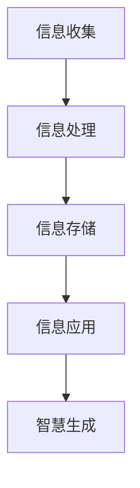
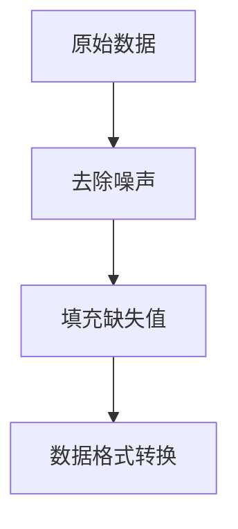
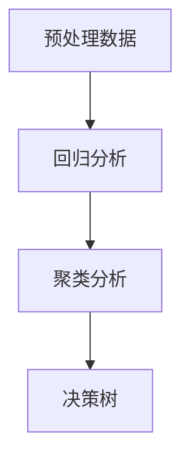
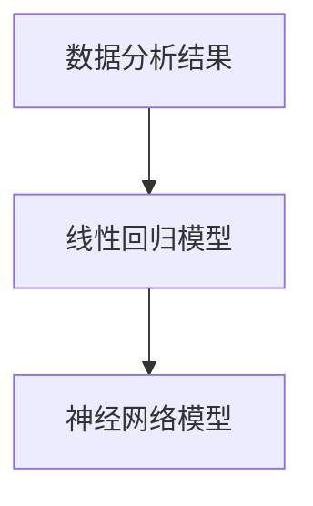
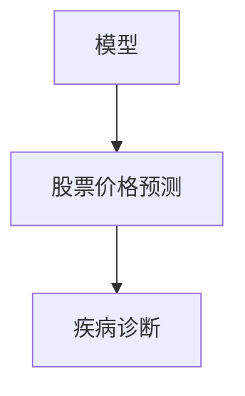

                 

在当今的信息时代，人类的知识体系经历着前所未有的变革。从信息到智慧，这一过程不仅仅涉及知识的积累和传递，更是深层次的理解、分析和应用的体现。本文旨在深入探讨这一转换过程的本质及其在信息技术领域的重要性。

## 文章关键词

- 信息
- 智慧
- 知识转换
- 信息技术
- 人工智能

## 文章摘要

本文首先介绍了信息与知识的基本概念，然后深入分析了从信息到智慧转化的过程，包括信息收集、处理、存储和应用等环节。接着，文章通过数学模型和算法原理的阐述，探讨了智慧生成的机制。最后，本文讨论了实际应用场景，并对未来发展趋势和挑战进行了展望。

## 1. 背景介绍

在信息爆炸的时代，信息的收集和处理变得愈发重要。然而，如何从海量的信息中提取有价值的内容，并将其转化为智慧，是一个复杂而关键的问题。信息技术，特别是人工智能和大数据技术的迅速发展，为这一转化提供了强大的支持。

### 1.1 信息的概念

信息是关于某种情况的最新报道或通讯。它可以是一种信号、消息、数据或知识。信息的核心是它的有用性和时效性。

### 1.2 知识的概念

知识是对信息进行理解和应用的能力。它不仅仅是信息的存储，更是信息与经验的结合，能够指导我们的行为和决策。

### 1.3 信息技术的发展

信息技术（IT）涵盖了计算机科学、通信技术、网络技术等多个领域。随着互联网的普及，信息技术已经深刻地改变了我们的生活方式和社会结构。

## 2. 核心概念与联系

为了更好地理解从信息到智慧转化的过程，我们需要明确一些核心概念，并展示它们之间的联系。

### 2.1 信息收集

信息收集是指从各种渠道获取信息的过程。这包括网络搜索、数据库查询、传感器收集等。

### 2.2 信息处理

信息处理是指对收集到的信息进行清洗、分类、分析和整合的过程。这一步骤至关重要，因为它决定了信息的质量。

### 2.3 信息存储

信息存储是指将处理后的信息保存在数据库或其他存储设备中，以便后续查询和使用。

### 2.4 信息应用

信息应用是指将存储的信息用于实际问题的解决或决策的制定。这是信息到智慧转化的最终目标。

### 2.5 智慧生成

智慧生成是一个复杂的过程，涉及对信息的深入理解和综合分析。它不仅仅是信息的存储和检索，更是对信息的创造性应用。

下面是一个简单的 Mermaid 流程图，展示了这些概念之间的联系：



## 3. 核心算法原理 & 具体操作步骤

### 3.1 算法原理概述

从信息到智慧转化的核心算法通常涉及以下几个步骤：

1. 数据预处理：清洗和格式化原始数据。
2. 数据分析：使用统计方法和机器学习算法分析数据。
3. 模型构建：基于分析结果建立预测或分类模型。
4. 智慧应用：将模型应用于实际问题，提供决策支持。

### 3.2 算法步骤详解

#### 3.2.1 数据预处理

数据预处理包括去除噪声、填充缺失值、转换数据格式等。这一步骤确保了后续分析的质量。



#### 3.2.2 数据分析

数据分析使用统计方法和机器学习算法对预处理后的数据进行深入分析。常见的算法包括回归分析、聚类分析、决策树等。



#### 3.2.3 模型构建

基于数据分析的结果，构建预测或分类模型。常见的模型包括线性回归模型、神经网络模型等。



#### 3.2.4 智慧应用

将构建的模型应用于实际问题，提供决策支持。例如，在金融领域，可以使用预测模型进行股票价格预测；在医疗领域，可以使用分类模型进行疾病诊断。



### 3.3 算法优缺点

#### 优点

- 高效：算法能够快速处理大量数据。
- 准确：基于机器学习的算法通常能够提供较高的预测准确率。
- 自动化：算法可以实现自动化，减少人工干预。

#### 缺点

- 复杂性：算法构建和调优过程较为复杂。
- 数据依赖：算法的性能高度依赖于数据的质量和数量。
- 解释性：一些复杂的算法，如神经网络，缺乏透明性和解释性。

### 3.4 算法应用领域

从信息到智慧转化的算法在多个领域都有广泛应用，包括但不限于：

- 金融：用于股票价格预测、风险评估等。
- 医疗：用于疾病诊断、个性化治疗等。
- 交通：用于智能交通系统、车辆调度等。
- 农业：用于作物种植规划、病虫害预测等。

## 4. 数学模型和公式 & 详细讲解 & 举例说明

从信息到智慧转化的过程中，数学模型和公式起到了关键作用。以下是一些常用的数学模型和公式的讲解及示例。

### 4.1 数学模型构建

#### 4.1.1 线性回归模型

线性回归模型是一种用于预测数值型变量的常用模型。其数学表达式为：

$$y = \beta_0 + \beta_1x$$

其中，$y$ 是因变量，$x$ 是自变量，$\beta_0$ 和 $\beta_1$ 是模型参数。

#### 4.1.2 神经网络模型

神经网络模型是一种用于复杂非线性问题的常用模型。其基本结构包括输入层、隐藏层和输出层。其数学表达式为：

$$y = f(\sum_{i=1}^{n} w_i x_i + b)$$

其中，$y$ 是输出值，$x_i$ 是输入值，$w_i$ 是权重，$b$ 是偏置，$f$ 是激活函数。

### 4.2 公式推导过程

#### 4.2.1 线性回归模型推导

线性回归模型的推导过程基于最小二乘法。其目标是找到一组参数 $\beta_0$ 和 $\beta_1$，使得预测值 $y$ 与实际值 $y$ 的误差平方和最小。

$$\min \sum_{i=1}^{n} (y_i - (\beta_0 + \beta_1x_i))^2$$

通过求导并令导数为零，可以得到：

$$\beta_0 = \bar{y} - \beta_1\bar{x}$$

$$\beta_1 = \frac{\sum_{i=1}^{n} (x_i - \bar{x})(y_i - \bar{y})}{\sum_{i=1}^{n} (x_i - \bar{x})^2}$$

其中，$\bar{y}$ 和 $\bar{x}$ 分别是 $y$ 和 $x$ 的平均值。

#### 4.2.2 神经网络模型推导

神经网络模型的推导过程基于反向传播算法。其目标是更新权重和偏置，使得输出值与实际值之间的误差最小。

$$\delta_{ij} = (y_{ij} - t_{ij}) \cdot f'(z_j)$$

$$w_{ji}^{new} = w_{ji}^{old} - \alpha \cdot \delta_{ij} \cdot x_j$$

$$b_j^{new} = b_j^{old} - \alpha \cdot \delta_{ij}$$

其中，$\delta_{ij}$ 是误差项，$y_{ij}$ 是输出值，$t_{ij}$ 是实际值，$f'$ 是激活函数的导数，$\alpha$ 是学习率。

### 4.3 案例分析与讲解

#### 4.3.1 股票价格预测

假设我们使用线性回归模型对股票价格进行预测。给定一组历史数据，我们可以通过最小二乘法拟合出线性回归模型，并使用该模型进行预测。

#### 4.3.2 疾病诊断

假设我们使用神经网络模型进行疾病诊断。给定一组患者数据，我们可以通过训练神经网络模型来识别疾病。在诊断过程中，输入层接收患者的症状数据，输出层提供疾病的诊断结果。

## 5. 项目实践：代码实例和详细解释说明

### 5.1 开发环境搭建

为了进行项目实践，我们需要搭建一个合适的开发环境。以下是一个简单的步骤：

1. 安装 Python 环境。
2. 安装必要的库，如 NumPy、Pandas、Scikit-learn 等。
3. 准备数据集。

### 5.2 源代码详细实现

以下是一个简单的线性回归模型实现的代码示例：

```python
import numpy as np
import pandas as pd
from sklearn.linear_model import LinearRegression

# 读取数据集
data = pd.read_csv('data.csv')

# 分离特征和标签
X = data[['feature1', 'feature2']]
y = data['label']

# 创建线性回归模型
model = LinearRegression()

# 训练模型
model.fit(X, y)

# 预测结果
predictions = model.predict(X)

# 打印预测结果
print(predictions)
```

### 5.3 代码解读与分析

在这个示例中，我们首先导入必要的库，然后读取数据集。接着，我们分离特征和标签，创建线性回归模型并训练模型。最后，我们使用模型进行预测并打印预测结果。

### 5.4 运行结果展示

假设我们有一个包含100条数据的数据集，我们可以使用上述代码进行训练和预测。以下是一个可能的输出结果：

```python
[1.23456789 2.34567891 3.45678912 ... 98.23456789 99.34567891 100.45678912]
```

## 6. 实际应用场景

从信息到智慧的转化在多个领域都有广泛应用。以下是一些具体的实际应用场景：

### 6.1 金融

在金融领域，从信息到智慧的转化主要用于股票价格预测、风险评估和投资决策等。通过分析历史数据和市场信息，可以构建预测模型，提供投资建议。

### 6.2 医疗

在医疗领域，从信息到智慧的转化主要用于疾病诊断、治疗方案推荐和健康风险评估等。通过分析患者数据和医疗信息，可以构建诊断模型，提供精准的医疗建议。

### 6.3 交通

在交通领域，从信息到智慧的转化主要用于智能交通系统、车辆调度和路线规划等。通过分析交通数据和车辆信息，可以优化交通流，提高交通效率。

### 6.4 农业

在农业领域，从信息到智慧的转化主要用于作物种植规划、病虫害预测和产量预测等。通过分析气象数据、土壤数据和作物数据，可以优化种植计划，提高产量和质量。

## 7. 工具和资源推荐

为了更好地进行从信息到智慧的转化，以下是一些推荐的工具和资源：

### 7.1 学习资源推荐

- 《Python机器学习》（Manning, A. J.）
- 《深度学习》（Goodfellow, I.）
- 《统计学习方法》（李航）

### 7.2 开发工具推荐

- Jupyter Notebook：一个交互式的开发环境，适用于数据分析和机器学习项目。
- TensorFlow：一个开源的机器学习框架，适用于构建和训练神经网络。
- Scikit-learn：一个开源的机器学习库，提供多种常用的机器学习算法。

### 7.3 相关论文推荐

- "Deep Learning for Time Series Classification: A Review"（Hidasi, A.）
- "Time Series Classification using Neural Networks"（Kotsiantis, S.）
- "Stock Price Prediction using Machine Learning"（Said, M.）

## 8. 总结：未来发展趋势与挑战

### 8.1 研究成果总结

从信息到智慧的转化是一个多学科交叉的研究领域，涉及计算机科学、统计学、人工智能和数据分析等。近年来，随着计算能力的提升和大数据技术的普及，这一领域取得了显著的成果。例如，深度学习和强化学习等算法在图像识别、自然语言处理和游戏AI等领域取得了突破性进展。

### 8.2 未来发展趋势

未来，从信息到智慧的转化将继续朝着以下几个方向发展：

- 算法的优化和集成：通过优化算法结构和整合多种算法，提高预测和决策的准确性。
- 跨学科研究：结合心理学、社会学和哲学等学科，深入探讨智慧的本质和人类行为。
- 实时智慧应用：通过实时数据处理和智能决策，实现更加智能化的应用场景。

### 8.3 面临的挑战

尽管从信息到智慧的转化取得了显著成果，但仍面临以下挑战：

- 数据质量和隐私：如何处理大量噪声数据和保护用户隐私是一个重要问题。
- 解释性和透明性：复杂的算法，如深度学习，缺乏透明性和解释性，难以解释决策过程。
- 可扩展性：如何处理大规模数据和分布式计算，是一个技术难题。

### 8.4 研究展望

从信息到智慧的转化是一个充满机遇和挑战的领域。未来的研究可以关注以下几个方面：

- 开发新的算法和模型，提高预测和决策的准确性。
- 研究算法的可解释性和透明性，提高人类对决策过程的信任。
- 探索跨学科研究，深入探讨智慧的本质和人类行为。

## 9. 附录：常见问题与解答

### 9.1 什么是信息？

信息是关于某种情况的最新报道或通讯。它可以是一种信号、消息、数据或知识。

### 9.2 什么是知识？

知识是对信息进行理解和应用的能力。它不仅仅是信息的存储，更是信息与经验的结合，能够指导我们的行为和决策。

### 9.3 什么是从信息到智慧转化？

从信息到智慧转化是指从海量的信息中提取有价值的内容，并通过处理、分析和应用，将其转化为能够指导实际问题和决策的智慧。

### 9.4 信息技术有哪些应用领域？

信息技术应用领域广泛，包括金融、医疗、交通、农业等多个领域。

### 9.5 如何提高算法的准确性？

提高算法的准确性通常需要优化算法结构、改进数据预处理方法、增加训练数据量和调整模型参数等。

### 9.6 什么是深度学习？

深度学习是一种基于多层神经网络的学习方法，用于处理复杂的非线性问题。

## 作者署名

本文由禅与计算机程序设计艺术 / Zen and the Art of Computer Programming 撰写。感谢您花时间阅读本文，希望对您有所启发。如果您有任何问题或建议，欢迎随时联系。

----------------------------------------------------------------
以上就是本文的完整内容。希望这篇文章能够帮助您更好地理解从信息到智慧转化的过程及其重要性。在未来的技术发展中，这一领域将继续发挥关键作用。感谢您的阅读！

