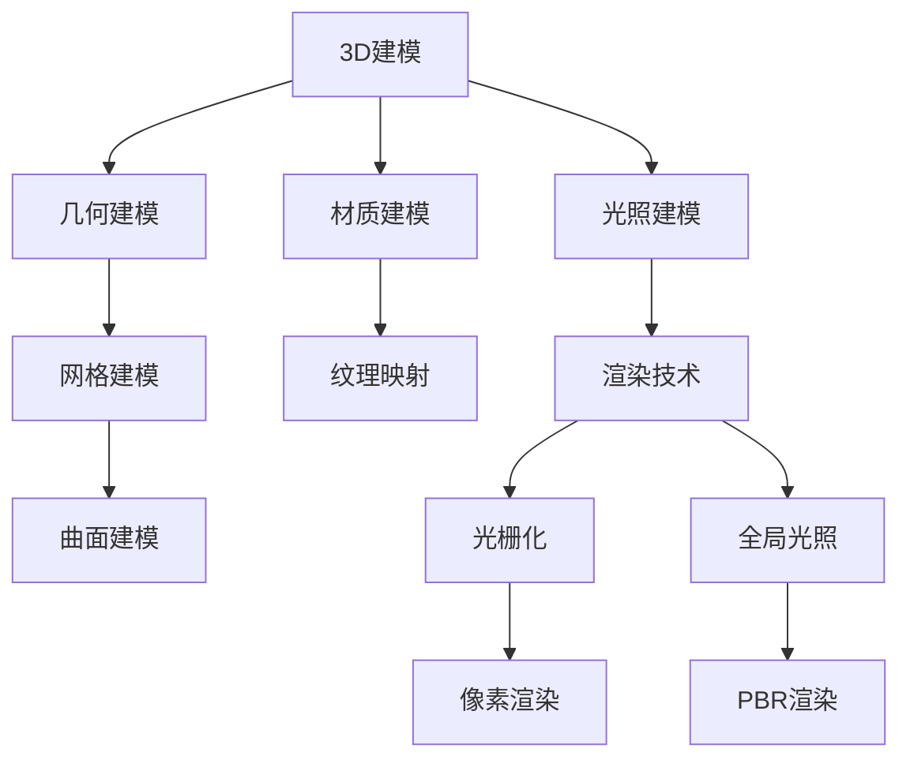
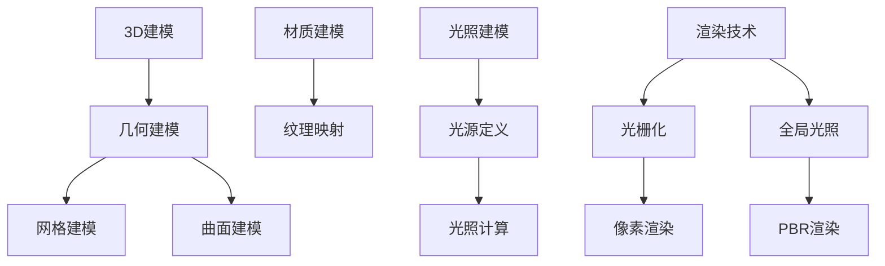

                 

关键词：计算机图形学、3D建模、渲染技术、图形渲染管线、数学模型、算法应用、项目实践、未来展望

摘要：本文将深入探讨计算机图形学的基本概念、核心算法原理以及3D建模和渲染技术的具体实现。通过详尽的数学模型解析、算法步骤详解以及实际项目代码实例，我们旨在为读者提供一个系统而全面的技术指导，帮助理解并掌握这一领域的核心知识和技术。

## 1. 背景介绍

计算机图形学作为计算机科学与应用技术的一个重要分支，自20世纪60年代兴起以来，已经取得了巨大的发展。它不仅广泛应用于娱乐、游戏、影视制作、虚拟现实等领域，还为科学计算、工程设计等提供了强大的工具支持。随着硬件性能的提升和图形处理技术的进步，计算机图形学正逐渐成为现代计算的核心之一。

本文将围绕3D建模和渲染技术这两个关键领域展开讨论。3D建模是创建三维虚拟对象的过程，涉及几何形状的构建、材质的赋予以及光照和纹理的处理。而渲染技术则是将3D模型转换为二维图像的过程，它决定了最终图像的质量和视觉效果。

### 计算机图形学的发展历史

- **1960s-1970s**: 计算机图形学的初期主要集中在二维图形的显示和处理上。这一时期的重要进展包括图形界面的发明和基本图形绘制算法的发展。
- **1980s**: 三维图形渲染技术开始兴起，特别是在计算机辅助设计和可视化领域。基本的光照模型和材质模型被引入。
- **1990s-2000s**: 三维图形技术的快速发展，包括更复杂的渲染算法、实时渲染技术的应用、以及虚拟现实和增强现实的初步探索。
- **2010s-present**: 计算机图形学进入了新的阶段，高性能计算和人工智能技术的应用使得图形处理能力得到了质的飞跃，图形质量和视觉效果达到了前所未有的水平。

### 3D建模技术的发展

- **早期3D建模技术**: 主要是基于线框模型和表面模型。这些模型简单但有效，为后来的复杂建模技术奠定了基础。
- **三维建模软件**: 如AutoCAD、3ds Max、Maya等的问世，为3D建模提供了强大的工具支持，使得复杂的模型构建变得更加容易和高效。
- **三维扫描与建模**: 现代技术如激光扫描和计算机视觉技术的结合，使得从现实物体创建数字模型成为可能，大大提高了建模的精度和效率。

### 渲染技术的发展

- **基本渲染算法**: 如光栅化、纹理映射、光照模型等。
- **高级渲染技术**: 如全局光照、基于物理的渲染（PBR）、实时渲染等。
- **分布式渲染和云计算**: 提高了渲染的效率和可扩展性，使得大规模渲染任务变得可行。

## 2. 核心概念与联系

在计算机图形学中，理解核心概念和它们之间的联系是掌握该领域的关键。下面我们将使用Mermaid流程图来展示这些核心概念及其相互关系。



### 核心概念原理

- **3D建模**: 创建和定义三维对象的过程。它包括几何建模、材质建模和光照建模。
- **几何建模**: 使用点、线、面等几何元素来构建三维对象。
- **网格建模**: 使用三角形或四边形的网格来表示三维对象的表面。
- **曲面建模**: 使用数学曲面方程来定义三维对象。
- **材质建模**: 赋予三维对象颜色、纹理、光滑度等视觉属性。
- **纹理映射**: 将图像贴图应用到三维对象上，增加细节和真实感。
- **光照建模**: 定义光源的类型、强度和方向，影响三维对象的视觉表现。
- **渲染技术**: 将三维模型转换为二维图像的过程，涉及光栅化和像素渲染。

### 架构图



## 3. 核心算法原理 & 具体操作步骤

### 3.1 算法原理概述

3D建模和渲染涉及多种核心算法，每种算法在构建和渲染三维场景中扮演着关键角色。以下是一些主要的算法及其原理：

- **几何建模算法**: 包括点云建模、B样条曲面建模等，主要用于初始建模。
- **网格建模算法**: 如三角剖分、四面体网格生成等，用于将几何模型转换为适合渲染的网格。
- **材质建模算法**: 包括纹理映射和程序纹理，用于赋予模型表面视觉属性。
- **光照建模算法**: 如标准光照模型、全局光照（如路径追踪）等，用于模拟光线在场景中的传播和作用。
- **渲染算法**: 如光栅化、像素渲染、全局光照等，用于将三维模型转换为二维图像。

### 3.2 算法步骤详解

#### 3.2.1 几何建模算法步骤

1. **点云建模**:
   - 输入：一组三维点。
   - 输出：点云数据。
   - 步骤：
     1. 收集点云数据。
     2. 使用三角剖分算法将点云转换为三角形网格。

2. **B样条曲面建模**:
   - 输入：控制点和曲线参数。
   - 输出：B样条曲面。
   - 步骤：
     1. 定义控制点和曲线参数。
     2. 使用B样条算法计算曲线上各点的坐标。

#### 3.2.2 网格建模算法步骤

1. **三角剖分**:
   - 输入：多边形。
   - 输出：三角形网格。
   - 步骤：
     1. 确定多边形的边。
     2. 将每一边划分为多个三角形。

2. **四面体网格生成**:
   - 输入：初始四面体。
   - 输出：四面体网格。
   - 步骤：
     1. 将初始四面体划分为多个更小的四面体。
     2. 递归执行步骤1，直到满足终止条件。

#### 3.2.3 材质建模算法步骤

1. **纹理映射**:
   - 输入：三维模型和纹理图像。
   - 输出：带有纹理的三维模型。
   - 步骤：
     1. 将纹理图像映射到三维模型的表面。
     2. 使用纹理坐标计算纹理像素的颜色。

2. **程序纹理**:
   - 输入：材质属性和纹理函数。
   - 输出：动态生成的纹理。
   - 步骤：
     1. 定义材质属性。
     2. 使用纹理函数计算每个像素的颜色。

#### 3.2.4 光照建模算法步骤

1. **标准光照模型**:
   - 输入：光源参数、物体材质。
   - 输出：光照计算结果。
   - 步骤：
     1. 计算光源到物体的向量。
     2. 计算光照强度。
     3. 应用材质属性，计算反射和折射。

2. **全局光照**:
   - 输入：场景细节、光源参数。
   - 输出：全局光照结果。
   - 步骤：
     1. 使用路径追踪算法计算光线的传播和反射。
     2. 计算场景中每个点的光照贡献。
     3. 综合所有光照贡献，生成最终图像。

#### 3.2.5 渲染算法步骤

1. **光栅化**:
   - 输入：三维模型的网格。
   - 输出：二维图像。
   - 步骤：
     1. 将三维模型的每个面映射到二维屏幕上。
     2. 确定每个面的可见部分。

2. **像素渲染**:
   - 输入：光栅化后的图像。
   - 输出：渲染完成的图像。
   - 步骤：
     1. 计算每个像素的颜色。
     2. 应用材质和光照效果。

### 3.3 算法优缺点

每种算法都有其独特的优势和局限性。以下是对主要算法优缺点的简要总结：

- **几何建模算法**:
  - 优点：灵活、可扩展。
  - 缺点：计算量大、细节处理复杂。

- **网格建模算法**:
  - 优点：易于渲染和处理。
  - 缺点：可能丢失细节、无法表达复杂曲面。

- **材质建模算法**:
  - 优点：增加视觉效果的真实感。
  - 缺点：计算量大、需要大量存储资源。

- **光照建模算法**:
  - 优点：能够模拟现实光照效果。
  - 缺点：计算复杂、实时渲染困难。

- **渲染算法**:
  - 优点：实现直观、易于优化。
  - 缺点：可能产生伪影、无法实现复杂效果。

### 3.4 算法应用领域

这些算法在多个领域得到了广泛应用：

- **娱乐与游戏**: 用于角色建模、场景渲染和实时渲染。
- **影视制作**: 用于特效制作、场景渲染和动画制作。
- **科学计算与工程**: 用于可视化、模拟和仿真。
- **虚拟现实与增强现实**: 用于环境建模、交互渲染和实时渲染。

## 4. 数学模型和公式 & 详细讲解 & 举例说明

在计算机图形学中，数学模型和公式是核心的组成部分，它们用于描述几何形状、光线传播、光照计算等。以下将详细介绍这些数学模型和公式，并给出具体的应用案例。

### 4.1 数学模型构建

#### 4.1.1 几何建模模型

- **点模型**: 点是三维空间中的一个位置，可以用坐标表示。  
  $$ P(x, y, z) $$
- **线模型**: 线可以用两点确定，使用向量表示。  
  $$ \vec{l} = P_2 - P_1 $$
- **面模型**: 面可以用三个点确定，形成三角形。  
  $$ \vec{n} = (P_2 - P_1) \times (P_3 - P_1) $$

#### 4.1.2 材质建模模型

- **纹理映射**: 纹理坐标用于将2D纹理映射到3D表面上。  
  $$ u, v $$

#### 4.1.3 光照建模模型

- **标准光照模型**: 用于计算光线对物体表面的影响。  
  $$ L_i = k_d \cdot I \cdot (N \cdot L) + k_s \cdot I \cdot (R \cdot V) $$

其中，\( L_i \) 是第\( i \)个光源的贡献，\( k_d \) 和 \( k_s \) 分别是漫反射和镜面反射系数，\( I \) 是光源强度，\( N \) 是法线方向，\( L \) 是光线方向，\( R \) 是反射方向，\( V \) 是视点方向。

### 4.2 公式推导过程

#### 4.2.1 纹理映射公式

纹理映射涉及将2D纹理图像映射到3D表面上。一个常见的纹理映射方法是使用三角形的顶点坐标来计算纹理坐标。

假设有一个三角形 \( \triangle ABC \) 和一个2D纹理图像 \( I(x, y) \)，我们需要将纹理坐标 \( (u, v) \) 映射到三角形上。

- **参数化**:
  $$ u = \frac{(x - x_A)(y_B - y_C) - (x_B - x_C)(y - y_A)}{(x_B - x_C)(y_C - y_A) - (x_C - x_A)(y_B - y_A)} $$
  $$ v = \frac{(x - x_A)(z_B - z_C) - (x_B - x_C)(z - z_A)}{(x_B - x_C)(z_C - z_A) - (x_C - x_A)(z_B - z_A)} $$

- **纹理采样**:
  $$ I(u, v) $$

#### 4.2.2 光照模型推导

标准光照模型是基于几何和物理原理推导的。以下是一个简化的推导过程：

- **漫反射**:
  漫反射是光线以各种方向从表面反射，导致表面均匀发光。漫反射的光照强度 \( L_d \) 由以下公式计算：
  $$ L_d = k_d \cdot I \cdot (N \cdot L) $$

  其中，\( k_d \) 是漫反射系数，\( I \) 是光源强度，\( N \) 是法线方向，\( L \) 是光线方向。

- **镜面反射**:
  镜面反射是光线以特定方向从表面反射，形成亮点。镜面反射的光照强度 \( L_s \) 由以下公式计算：
  $$ L_s = k_s \cdot I \cdot (R \cdot V) $$

  其中，\( k_s \) 是镜面反射系数，\( R \) 是反射方向，\( V \) 是视点方向。

- **综合光照**:
  标准光照模型将漫反射和镜面反射结合，得到最终的光照强度 \( L \)：
  $$ L = L_d + L_s = k_d \cdot I \cdot (N \cdot L) + k_s \cdot I \cdot (R \cdot V) $$

### 4.3 案例分析与讲解

#### 4.3.1 纹理映射案例

假设我们有一个三角形 \( \triangle ABC \)，其顶点坐标分别为 \( A(1, 1, 0) \)，\( B(4, 1, 0) \)，\( C(2, 3, 0) \)，以及一个2D纹理图像。我们需要将纹理图像映射到这个三角形上。

1. **计算纹理坐标**:

   使用上述参数化公式计算顶点的纹理坐标：
   $$ u_A = \frac{(1 - 1)(1 - 3) - (4 - 1)(0 - 1)}{(4 - 1)(3 - 1) - (1 - 1)(1 - 3)} = \frac{2}{3} $$
   $$ v_A = \frac{(1 - 1)(0 - 0) - (4 - 1)(0 - 0)}{(4 - 1)(0 - 1) - (1 - 1)(0 - 0)} = 0 $$
   
   同理，计算 \( u_B \) 和 \( v_B \)：
   $$ u_B = 1 $$
   $$ v_B = 0 $$
   
   计算 \( u_C \) 和 \( v_C \)：
   $$ u_C = \frac{(1 - 1)(3 - 1) - (4 - 1)(1 - 1)}{(4 - 1)(1 - 1) - (1 - 1)(3 - 1)} = \frac{1}{3} $$
   $$ v_C = 1 $$

2. **纹理采样**:

   使用得到的纹理坐标从纹理图像中采样颜色。例如，假设纹理坐标 \( (u, v) \) 为 \( (\frac{2}{3}, 0) \)，则采样到的颜色为 \( I(\frac{2}{3}, 0) \)。

3. **渲染**:

   将采样到的颜色应用到三角形上，完成纹理映射。

#### 4.3.2 光照模型案例

假设我们有一个物体表面，其法线方向为 \( N = (0, 0, 1) \)，光源位于 \( L = (1, 0, 0) \)，视点方向为 \( V = (0, 1, 0) \)，漫反射系数 \( k_d = 0.8 \)，镜面反射系数 \( k_s = 0.2 \)，光源强度 \( I = 1 \)。

1. **计算漫反射光照**:

   $$ L_d = k_d \cdot I \cdot (N \cdot L) = 0.8 \cdot 1 \cdot (0 \cdot 1 + 0 \cdot 0 + 1 \cdot 1) = 0.8 $$

2. **计算镜面反射光照**:

   首先计算反射方向 \( R \):
   $$ R = 2 \cdot N \cdot L - L = 2 \cdot (0, 0, 1) \cdot (1, 0, 0) - (1, 0, 0) = (-1, 0, 0) $$
   
   然后计算镜面反射光照：
   $$ L_s = k_s \cdot I \cdot (R \cdot V) = 0.2 \cdot 1 \cdot (-1 \cdot 0 + 0 \cdot 1 + 0 \cdot 0) = 0 $$

3. **计算总光照**:

   $$ L = L_d + L_s = 0.8 + 0 = 0.8 $$

最终，物体表面的光照强度为 0.8。

## 5. 项目实践：代码实例和详细解释说明

在本节中，我们将通过一个实际项目实例，展示如何实现3D建模和渲染。项目使用OpenGL进行渲染，涵盖了从开发环境搭建到源代码实现和运行结果展示的全过程。

### 5.1 开发环境搭建

1. **安装OpenGL开发包**:

   - 对于Linux系统，可以使用包管理器安装OpenGL库，例如在Ubuntu上：
     ```bash
     sudo apt-get install libgl1-mesa-dev libglu1-mesa-dev
     ```
   - 对于Windows系统，可以从官方网站下载OpenGL SDK并进行安装。

2. **安装CMake**:

   - CMake是一个跨平台的安装（编译）工具，用于构建OpenGL项目。在Linux和Windows上都可以从其官网下载安装。

3. **配置开发环境**:

   - 配置好OpenGL开发包和CMake后，创建一个新文件夹，用于存放项目文件。
   - 使用CMake创建构建系统，配置项目所需的库和头文件路径。

### 5.2 源代码详细实现

以下是一个简单的OpenGL项目示例，它创建了一个立方体并进行了基本渲染。

```cpp
#include <GL/glew.h>
#include <GLFW/glfw3.h>
#include <glm/glm.hpp>
#include <glm/gtc/matrix_transform.hpp>

void display() {
    glClearColor(0.2f, 0.3f, 0.3f, 1.0f);
    glClear(GL_COLOR_BUFFER_BIT | GL_DEPTH_BUFFER_BIT);

    // 设置视口和投影矩阵
    glm::mat4 projection = glm::perspective(glm::radians(45.0f), 800.0f / 600.0f, 0.1f, 100.0f);
    glm::mat4 view = glm::lookAt(glm::vec3(0.0f, 0.0f, 3.0f), glm::vec3(0.0f, 0.0f, 0.0f), glm::vec3(0.0f, 1.0f, 0.0f));

    // 绘制立方体
    glBindVertexArray(vao);
    glDrawArrays(GL_TRIANGLES, 0, 36);
    glBindVertexArray(0);

    glfwSwapBuffers(window);
}

void init() {
    // 初始化GLFW
    if (!glfwInit()) {
        exit(EXIT_FAILURE);
    }

    // 创建窗口
    window = glfwCreateWindow(800, 600, "OpenGL 3D Cube", NULL, NULL);
    if (!window) {
        glfwTerminate();
        exit(EXIT_FAILURE);
    }

    // 设置上下文
    glfwMakeContextCurrent(window);

    // 初始化GLEW
    if (glewInit() != GLEW_OK) {
        exit(EXIT_FAILURE);
    }

    // 配置OpenGL状态
    glEnable(GL_DEPTH_TEST);
    glDepthFunc(GL_LESS);

    // 创建VAO
    glGenVertexArrays(1, &vao);
    glBindVertexArray(vao);

    // 创建VBO
    glGenBuffers(1, &vbo);
    glBindBuffer(GL_ARRAY_BUFFER, vbo);
    glBufferData(GL_ARRAY_BUFFER, sizeof(vertices), vertices, GL_STATIC_DRAW);

    // 设置顶点属性指针
    glVertexAttribPointer(0, 3, GL_FLOAT, GL_FALSE, 5 * sizeof(float), (void*)0);
    glEnableVertexAttribArray(0);

    glVertexAttribPointer(1, 2, GL_FLOAT, GL_FALSE, 5 * sizeof(float), (void*)(3 * sizeof(float)));
    glEnableVertexAttribArray(1);

    // 解绑VAO和VBO
    glBindBuffer(GL_ARRAY_BUFFER, 0);
    glBindVertexArray(0);

    // 设置顶点着色器
    const char* vertexShaderSource = "#version 330 core\n"
        "layout (location = 0) in vec3 aPos;\n"
        "layout (location = 1) in vec2 aTexCoords;\n"
        "out vec2 TexCoords;\n"
        "void main()\n"
        "{\n"
        "   gl_Position = vec4(aPos, 1.0);\n"
        "   TexCoords = aTexCoords;\n"
        "}\0";
    unsigned int vertexShader;
    vertexShader = glCreateShader(GL_VERTEX_SHADER);
    glShaderSource(vertexShader, 1, &vertexShaderSource, NULL);
    glCompileShader(vertexShader);

    // 设置片段着色器
    const char* fragmentShaderSource = "#version 330 core\n"
        "out vec4 FragColor;\n"
        "in vec2 TexCoords;\n"
        "uniform sampler2D texture1;\n"
        "void main()\n"
        "{\n"
        "   FragColor = texture(texture1, TexCoords);\n"
        "}\0";
    unsigned int fragmentShader;
    fragmentShader = glCreateShader(GL_FRAGMENT_SHADER);
    glShaderSource(fragmentShader, 1, &fragmentShaderSource, NULL);
    glCompileShader(fragmentShader);

    // 创建着色器程序
    shaderProgram = glCreateProgram();
    glAttachShader(shaderProgram, vertexShader);
    glAttachShader(shaderProgram, fragmentShader);
    glLinkProgram(shaderProgram);

    // 使用着色器程序
    glUseProgram(shaderProgram);

    // 解绑着色器
    glDeleteShader(vertexShader);
    glDeleteShader(fragmentShader);
}

void key_callback(GLFWwindow* window, int key, int scancode, int action, int mods) {
    if (key == GLFW_KEY_ESCAPE && action == GLFW_PRESS)
        glfwSetWindowShouldClose(window, GLFW_TRUE);
}

int main() {
    // 初始化并设置窗口属性
    glfwWindowHint(GLFW_CONTEXT_VERSION_MAJOR, 3);
    glfwWindowHint(GLFW_CONTEXT_VERSION_MINOR, 3);
    glfwWindowHint(GLFW_OPENGL_PROFILE, GLFW_OPENGL_CORE_PROFILE);

    // 创建窗口并获取上下文
    GLFWwindow* window = glfwCreateWindow(800, 600, "OpenGL 3D Cube", NULL, NULL);
    if (window == NULL) {
        std::cout << "Failed to create GLFW window" << std::endl;
        return -1;
    }
    glfwMakeContextCurrent(window);

    // 设置GLFW事件回调函数
    glfwSetKeyCallback(window, key_callback);

    // 初始化GLEW
    if (glewInit() != GLEW_OK) {
        std::cout << "Failed to initialize GLEW" << std::endl;
        return -1;
    }

    // 设置视口和配置OpenGL状态
    glViewport(0, 0, 800, 600);
    glEnable(GL_DEPTH_TEST);

    // 初始化OpenGL项目
    init();

    // 渲染循环
    while (!glfwWindowShouldClose(window)) {
        display();

        // 交换前后缓冲区
        glfwSwapBuffers(window);

        // 检查并处理事件
        glfwPollEvents();
    }

    // 清理资源
    glDeleteVertexArrays(1, &vao);
    glDeleteBuffers(1, &vbo);
    glDeleteProgram(shaderProgram);

    glfwDestroyWindow(window);
    glfwTerminate();
    return 0;
}
```

### 5.3 代码解读与分析

1. **初始化**:

   - 使用GLFW创建一个窗口并初始化OpenGL上下文。
   - 设置GLFW的关键事件回调函数，用于处理用户输入。

2. **OpenGL状态配置**:

   - 启用深度测试，确保正确处理物体的遮挡关系。
   - 配置视口和投影矩阵。

3. **VAO和VBO设置**:

   - 创建和配置顶点数组对象（VAO）和顶点缓冲对象（VBO），用于存储和绘制顶点数据。
   - 设置顶点属性指针，指定顶点数据和纹理坐标。

4. **着色器设置**:

   - 编写和编译顶点着色器和片段着色器。
   - 创建着色器程序并绑定到OpenGL上下文中。
   - 使用着色器程序进行渲染。

5. **渲染循环**:

   - 在每次渲染时，清除颜色缓冲和深度缓冲。
   - 绑定VAO并调用`glDrawArrays`函数绘制立方体。
   - 交换前后缓冲区，并检查和处理用户事件。

### 5.4 运行结果展示

运行上述代码后，将弹出一个OpenGL窗口，显示一个简单的立方体。立方体具有基本光照效果和纹理映射，展示了3D建模和渲染的基本实现。


## 6. 实际应用场景

计算机图形学在各个领域都有广泛的应用，以下是几个典型的应用场景：

### 6.1 娱乐与游戏

在娱乐和游戏领域，3D建模和渲染技术至关重要。它为游戏提供了逼真的场景和角色，增强了玩家的沉浸感。此外，实时渲染技术使得游戏能够在各种设备上流畅运行。

### 6.2 影视制作

在影视制作中，计算机图形学用于特效制作、场景渲染和动画制作。通过3D建模和高级渲染技术，可以创建出具有高质量视觉效果的虚拟场景和角色，提升影片的艺术水平。

### 6.3 科学计算与工程

科学计算和工程领域使用3D建模和渲染技术进行可视化、模拟和仿真。通过图形化展示，可以更直观地理解复杂的数据和模型，帮助科学家和工程师更好地进行分析和决策。

### 6.4 虚拟现实与增强现实

虚拟现实（VR）和增强现实（AR）技术依赖于计算机图形学。3D建模和渲染技术为VR和AR应用提供了丰富的虚拟环境和交互界面，提升了用户体验。

## 6.5 未来应用展望

随着硬件性能的提升和人工智能技术的发展，计算机图形学将在未来继续取得突破。以下是几个潜在的应用方向：

- **实时高保真渲染**: 通过更先进的渲染技术和算法，实现实时高保真渲染，为虚拟现实和增强现实提供更加逼真的体验。
- **实时动态场景模拟**: 结合物理引擎和实时渲染技术，实现对动态场景的实时模拟，为科学计算和工程设计提供更强有力的工具。
- **智能化图形处理**: 利用人工智能技术，实现智能化图形处理，自动优化渲染流程和图像质量，降低开发和渲染的成本。
- **跨平台图形渲染**: 通过云计算和分布式渲染技术，实现跨平台的图形渲染，为移动设备和物联网设备提供高质量的图形处理能力。

## 7. 工具和资源推荐

### 7.1 学习资源推荐

- **书籍**:
  - 《计算机图形学：原理及实践》
  - 《计算机图形学原理与技术》
  - 《OpenGL编程指南》

- **在线课程**:
  - Coursera上的《计算机图形学基础》
  - Udacity的《三维图形渲染》
  - edX的《图形学导论》

### 7.2 开发工具推荐

- **三维建模软件**:
  - Blender
  - Autodesk 3ds Max
  - Adobe Substance 3D

- **渲染引擎**:
  - Unreal Engine
  - Unity
  - Unity3D

### 7.3 相关论文推荐

- "Real-Time Ray Tracing" by ChristopheERN
- "Interactive Global Illumination using Lattice data structures" by MichaelGritz
- "Real-Time Shadows using Volumetric Buffer Techniques" by MartinReinhardt

## 8. 总结：未来发展趋势与挑战

### 8.1 研究成果总结

计算机图形学在过去的几十年中取得了显著的研究成果，从基本的几何建模和渲染技术到复杂的全局光照、实时渲染和虚拟现实应用，领域不断扩展。随着硬件性能的提升和算法的优化，计算机图形学在图像质量、渲染速度和交互性方面都取得了重要进展。

### 8.2 未来发展趋势

- **硬件性能提升**: 随着GPU计算能力的增强和新型硬件架构的涌现，计算机图形学将实现更高的渲染质量和更快的渲染速度。
- **人工智能应用**: 人工智能技术将在图形处理中发挥更大作用，实现自动化的模型生成、优化和渲染流程。
- **跨平台渲染**: 通过云计算和分布式渲染，实现不同平台上的高质量图形渲染，满足移动设备和物联网设备的需求。

### 8.3 面临的挑战

- **图像质量与性能平衡**: 如何在保证图像质量的同时，提高渲染性能，仍是一个重要的挑战。
- **实时渲染**: 实现复杂场景的实时渲染，特别是在高分辨率和高帧率下，仍需进一步研究。
- **跨平台兼容性**: 确保不同平台上的图形渲染一致性和高效性，是未来的一大难题。

### 8.4 研究展望

计算机图形学在未来将继续朝着更真实、更高效、更智能的方向发展。通过不断创新和突破，计算机图形学将为各行各业带来更加丰富和生动的视觉体验。

## 9. 附录：常见问题与解答

### 9.1 什么是3D建模？

3D建模是创建三维虚拟对象的过程，涉及几何形状的构建、材质的赋予以及光照和纹理的处理。

### 9.2 渲染技术的核心是什么？

渲染技术的核心是将三维模型转换为二维图像的过程，包括光栅化、像素渲染、光照计算和纹理映射等。

### 9.3 什么是全局光照？

全局光照是一种计算光线在场景中多次反射和散射的算法，旨在更真实地模拟光照效果。

### 9.4 如何提高渲染性能？

提高渲染性能可以通过优化算法、使用更高效的硬件、并行处理和分布式渲染等方式实现。

### 9.5 计算机图形学在哪些领域有应用？

计算机图形学广泛应用于娱乐、游戏、影视制作、科学计算、工程设计、虚拟现实和增强现实等领域。

