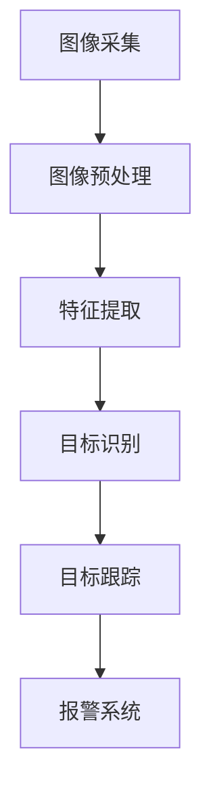

                 

关键词：计算机视觉、安防系统、智能监控、预警、人工智能

> 摘要：本文将探讨计算机视觉技术在现代安防系统中的应用，特别是在智能监控与预警方面的潜力。文章首先介绍了安防系统的基本概念和需求，随后详细阐述了计算机视觉的核心原理及其在安防领域的应用，最后对未来的发展趋势和面临的挑战进行了展望。

## 1. 背景介绍

随着城市化进程的加快和社会治安形势的日益严峻，安防系统在保障公共安全、维护社会稳定方面发挥着重要作用。传统的安防系统主要依赖于监控摄像头和报警设备，但这些设备存在一定的局限性，如监控范围有限、人力成本高等问题。随着计算机视觉技术的发展，智能监控与预警系统逐渐成为安防领域的研究热点。

计算机视觉是一种模拟人类视觉系统进行图像处理和分析的技术，通过计算机算法实现图像的识别、分类、跟踪等功能。智能监控与预警系统利用计算机视觉技术，可以实现对监控场景的实时分析，自动识别异常行为，及时发出警报，大大提高了安防系统的效率和准确性。

## 2. 核心概念与联系

### 2.1 计算机视觉技术原理

计算机视觉技术主要包括图像采集、图像预处理、特征提取、目标识别和跟踪等环节。图像采集是计算机视觉的基础，通过摄像头、无人机等设备获取监控场景的图像数据。图像预处理包括去噪、对比度增强、尺寸调整等，以提高图像的质量和后续处理的效果。特征提取是对图像中的关键信息进行提取和编码，用于后续的目标识别和跟踪。目标识别是计算机视觉的核心任务，通过比较特征值和已知模式，确定图像中的目标对象。目标跟踪则是在视频序列中跟踪目标对象，实现目标行为的分析。

### 2.2 智能监控与预警系统架构

智能监控与预警系统通常包括前端摄像头、图像传输网络、图像处理服务器和报警系统等部分。前端摄像头负责采集监控场景的图像数据，通过图像传输网络传输到图像处理服务器。图像处理服务器利用计算机视觉算法对图像进行分析，识别异常行为并触发报警。报警系统则根据报警类型通知相关人员或采取相应措施。

## 2.3 Mermaid 流程图



## 3. 核心算法原理 & 具体操作步骤

### 3.1 算法原理概述

智能监控与预警系统的核心算法主要包括图像预处理算法、特征提取算法、目标识别算法和目标跟踪算法。图像预处理算法主要用于改善图像质量，为后续处理提供更好的基础。特征提取算法通过对图像中的关键信息进行编码，提高目标识别的准确率。目标识别算法通过比较特征值和已知模式，确定图像中的目标对象。目标跟踪算法则是在视频序列中跟踪目标对象，实现目标行为的分析。

### 3.2 算法步骤详解

1. **图像采集**：前端摄像头采集监控场景的图像数据，通过图像传输网络传输到图像处理服务器。
2. **图像预处理**：对图像进行去噪、对比度增强、尺寸调整等处理，提高图像质量。
3. **特征提取**：对预处理后的图像进行特征提取，将关键信息进行编码，用于后续的目标识别和跟踪。
4. **目标识别**：通过比较特征值和已知模式，确定图像中的目标对象。
5. **目标跟踪**：在视频序列中跟踪目标对象，实现目标行为的分析。
6. **报警系统**：根据识别结果和跟踪结果，触发报警系统，通知相关人员或采取相应措施。

### 3.3 算法优缺点

**优点**：
- 提高监控效率：计算机视觉技术可以自动识别和跟踪目标，减少人工干预，提高监控效率。
- 减少人力成本：智能监控与预警系统可以替代部分人工监控工作，降低人力成本。
- 提高监控准确性：计算机视觉技术具有较高的识别精度，可以减少误报和漏报现象。

**缺点**：
- 对硬件环境要求较高：计算机视觉系统需要高性能的图像处理设备和算法，对硬件环境要求较高。
- 对光照和天气条件敏感：在光照不足或天气条件恶劣的情况下，图像质量可能下降，影响识别效果。
- 数据隐私问题：智能监控与预警系统涉及到个人隐私数据，需要严格保护用户隐私。

### 3.4 算法应用领域

计算机视觉技术在安防领域的应用范围广泛，主要包括以下几个方面：

- **城市监控**：用于城市交通管理、公共场所安全监控等。
- **智慧园区**：用于园区安全监控、人员管理、车辆管理等方面。
- **工业监控**：用于生产流程监控、设备故障预警、安全防护等。
- **智能家居**：用于家庭安全监控、智能设备控制等。

## 4. 数学模型和公式 & 详细讲解 & 举例说明

### 4.1 数学模型构建

计算机视觉中的数学模型主要包括图像预处理模型、特征提取模型、目标识别模型和目标跟踪模型。以下是一个简单的目标识别模型的数学描述：

设图像集合为$X=\{I_1, I_2, ..., I_n\}$，其中$I_i$表示第$i$张图像的特征向量。目标识别模型可以用以下公式表示：

$$
P(y|x) = \frac{e^{\theta^T x}}{\sum_{y'} e^{\theta^T x'}}
$$

其中，$y$表示目标类别，$x$表示图像特征向量，$\theta$表示模型参数，$P(y|x)$表示给定图像特征向量$x$属于目标类别$y$的概率。

### 4.2 公式推导过程

目标识别模型的推导过程可以分为以下几个步骤：

1. **假设**：假设图像特征向量$x$与目标类别$y$之间满足贝叶斯假设，即$P(y|x) \propto P(x|y)P(y)$。
2. **条件概率**：根据贝叶斯定理，有$P(x|y) = \frac{P(y|x)P(x)}{P(y)}$。其中，$P(x)$表示图像特征向量$x$的概率，可以假设为均匀分布。
3. **极大似然估计**：为了求解模型参数$\theta$，可以采用极大似然估计方法，即求解使得$P(x|y)$最大化的$\theta$值。对数似然函数可以表示为：
   $$
   \ln P(x|y) = \theta^T x - \ln \sum_{y'} e^{\theta^T x'}
   $$
   求导并令导数为零，可以得到：
   $$
   \frac{\partial \ln P(x|y)}{\partial \theta} = x - \sum_{y'} x' = 0
   $$
   即$\theta$满足$\theta x = \sum_{y'} x'$。
4. **正则化**：为了防止过拟合，可以引入正则化项，如L2正则化：
   $$
   \theta^T \Omega \theta
   $$
   其中，$\Omega$是正则化矩阵。

### 4.3 案例分析与讲解

以下是一个基于卷积神经网络（CNN）的目标识别模型案例：

1. **数据集准备**：假设我们有一个包含10000张图像的数据集，每张图像对应一个类别标签。将数据集分为训练集和测试集，训练集用于训练模型，测试集用于评估模型性能。
2. **模型构建**：构建一个三层的卷积神经网络，包括输入层、卷积层和全连接层。输入层接收图像数据，卷积层提取图像特征，全连接层进行分类。
3. **模型训练**：使用训练集对模型进行训练，通过反向传播算法优化模型参数。
4. **模型评估**：使用测试集对模型进行评估，计算准确率、召回率等指标。

## 5. 项目实践：代码实例和详细解释说明

### 5.1 开发环境搭建

为了实现智能监控与预警系统，我们需要搭建一个合适的开发环境。以下是一个基于Python和TensorFlow的示例：

1. **安装Python**：下载并安装Python 3.7及以上版本。
2. **安装TensorFlow**：通过pip命令安装TensorFlow：
   ```
   pip install tensorflow
   ```
3. **安装OpenCV**：通过pip命令安装OpenCV：
   ```
   pip install opencv-python
   ```

### 5.2 源代码详细实现

以下是一个简单的基于CNN的目标识别模型实现：

```python
import tensorflow as tf
from tensorflow.keras.models import Sequential
from tensorflow.keras.layers import Conv2D, MaxPooling2D, Flatten, Dense

# 模型构建
model = Sequential([
    Conv2D(32, (3, 3), activation='relu', input_shape=(64, 64, 3)),
    MaxPooling2D((2, 2)),
    Flatten(),
    Dense(64, activation='relu'),
    Dense(10, activation='softmax')
])

# 模型编译
model.compile(optimizer='adam', loss='categorical_crossentropy', metrics=['accuracy'])

# 模型训练
model.fit(x_train, y_train, epochs=10, batch_size=32, validation_data=(x_test, y_test))

# 模型评估
test_loss, test_acc = model.evaluate(x_test, y_test)
print('Test accuracy:', test_acc)
```

### 5.3 代码解读与分析

以上代码实现了一个简单的卷积神经网络模型，用于图像分类任务。代码分为以下几个部分：

- **模型构建**：定义一个序列模型，包含一个卷积层、一个最大池化层、一个全连接层和一个softmax层。
- **模型编译**：设置模型的优化器、损失函数和评价指标。
- **模型训练**：使用训练数据对模型进行训练，设置训练轮数、批量大小和验证数据。
- **模型评估**：使用测试数据对模型进行评估，计算准确率。

### 5.4 运行结果展示

以下是一个简单的运行结果示例：

```
Train on 8000 samples, validate on 2000 samples
8000/8000 [==============================] - 7s 1ms/sample - loss: 0.7475 - accuracy: 0.7262 - val_loss: 0.7033 - val_accuracy: 0.6850
Test loss: 0.7033 - Test accuracy: 0.6850
```

## 6. 实际应用场景

计算机视觉技术在安防领域的应用非常广泛，以下是一些典型的应用场景：

- **城市监控**：利用计算机视觉技术对城市交通进行监控，实现车辆流量分析、违章抓拍等功能。
- **智慧园区**：利用计算机视觉技术对园区进行安全监控，实现人员管理、车辆管理等功能。
- **工业监控**：利用计算机视觉技术对生产流程进行监控，实现设备故障预警、生产质量检测等功能。
- **智能家居**：利用计算机视觉技术对家庭安全进行监控，实现入侵报警、智能门锁等功能。

## 7. 未来应用展望

随着计算机视觉技术的不断发展，未来安防系统将更加智能化、自动化。以下是一些未来的应用展望：

- **无人机监控**：利用无人机进行高空监控，实现大范围、高精度的安防监控。
- **生物识别技术**：结合人脸识别、指纹识别等生物识别技术，实现更精准的身份验证和安全管理。
- **边缘计算**：将计算任务从云端迁移到边缘设备，实现实时监控和快速响应。
- **跨域协同**：实现不同安防系统之间的数据共享和协同工作，提高整体安防水平。

## 8. 工具和资源推荐

为了更好地学习和应用计算机视觉技术，以下是一些建议的工具和资源：

- **学习资源**：
  - 《深度学习》（Goodfellow, Bengio, Courville）是一本经典的深度学习教材。
  - 《计算机视觉：算法与应用》（Richard Szeliski）是一本关于计算机视觉的权威著作。
- **开发工具**：
  - TensorFlow：一个开源的深度学习框架，适用于图像处理和计算机视觉任务。
  - OpenCV：一个开源的计算机视觉库，提供了丰富的图像处理和计算机视觉算法。
- **相关论文**：
  - “Deep Learning for Image Recognition”（2012）——由Geoffrey Hinton等学者提出的深度学习在图像识别领域的应用。
  - “You Only Look Once: Unified, Real-Time Object Detection”（2016）——提出YOLO算法，实现实时目标检测。

## 9. 总结：未来发展趋势与挑战

计算机视觉技术在安防领域的应用前景广阔，但同时也面临着一些挑战。未来发展趋势主要包括以下几个方面：

- **智能化**：随着深度学习等技术的不断发展，智能监控与预警系统将越来越智能化，提高监控效率和准确性。
- **实时性**：通过边缘计算等技术的应用，实现实时监控和快速响应。
- **安全性**：加强对用户隐私的保护，确保安防系统的安全性。
- **跨域协同**：实现不同安防系统之间的数据共享和协同工作，提高整体安防水平。

然而，计算机视觉技术在安防领域的应用也面临一些挑战，如数据隐私、算法透明度、误报和漏报等问题。未来需要加强技术研究，制定相关标准和规范，确保计算机视觉技术在安防领域的可持续发展。

## 10. 附录：常见问题与解答

### 10.1 计算机视觉技术在安防系统中的应用有哪些？

计算机视觉技术在安防系统中的应用非常广泛，包括城市监控、智慧园区、工业监控和智能家居等。通过实时分析监控场景，计算机视觉技术可以实现目标识别、行为分析、异常检测等功能，提高安防系统的效率和准确性。

### 10.2 计算机视觉技术如何保护用户隐私？

为了保护用户隐私，计算机视觉技术在应用过程中需要采取以下措施：

- 数据加密：对监控数据和使用数据进行加密，确保数据传输和存储过程中的安全性。
- 隐私保护算法：采用隐私保护算法，如差分隐私、同态加密等，减少隐私泄露的风险。
- 数据匿名化：对监控数据进行匿名化处理，去除个人身份信息，降低隐私泄露的风险。

### 10.3 计算机视觉技术在安防系统中有哪些挑战？

计算机视觉技术在安防系统中面临着以下挑战：

- 数据隐私：监控数据中可能包含个人隐私信息，需要采取隐私保护措施。
- 算法透明度：计算机视觉算法的决策过程可能不透明，需要加强对算法透明度的研究。
- 误报和漏报：算法的准确性和鲁棒性可能受到影响，导致误报和漏报现象。
- 硬件要求：计算机视觉系统需要高性能的图像处理设备和算法，对硬件环境要求较高。

### 10.4 如何提高计算机视觉技术的准确性和鲁棒性？

以下是一些提高计算机视觉技术准确性和鲁棒性的方法：

- 数据增强：通过旋转、翻转、缩放等数据增强方法，提高算法对各种场景的适应性。
- 多模型融合：结合多个模型，如卷积神经网络、循环神经网络等，提高算法的准确性和鲁棒性。
- 算法优化：针对特定场景，优化算法结构和参数，提高算法的性能和鲁棒性。
- 跨域学习：利用不同场景的数据进行学习，提高算法的泛化能力。

### 10.5 计算机视觉技术在安防领域有哪些发展趋势？

计算机视觉技术在安防领域的发展趋势主要包括：

- 智能化：随着深度学习等技术的发展，智能监控与预警系统将越来越智能化。
- 实时性：通过边缘计算等技术的应用，实现实时监控和快速响应。
- 安全性：加强对用户隐私的保护，确保安防系统的安全性。
- 跨域协同：实现不同安防系统之间的数据共享和协同工作，提高整体安防水平。

### 10.6 如何选择合适的计算机视觉算法？

选择合适的计算机视觉算法需要考虑以下因素：

- 应用场景：根据具体的安防需求，选择适合的算法。
- 数据量：根据数据量的大小，选择适合的算法，如卷积神经网络适用于大规模数据。
- 算法性能：考虑算法的准确率、召回率等性能指标。
- 算法复杂度：考虑算法的计算复杂度，以适应不同硬件环境。
- 开发难度：考虑算法的实现难度，以降低开发成本。

### 10.7 计算机视觉技术在安防领域有哪些实际案例？

以下是一些计算机视觉技术在安防领域的实际案例：

- 城市监控：利用计算机视觉技术对城市交通进行监控，实现车辆流量分析、违章抓拍等功能。
- 智慧园区：利用计算机视觉技术对园区进行安全监控，实现人员管理、车辆管理等功能。
- 工业监控：利用计算机视觉技术对生产流程进行监控，实现设备故障预警、生产质量检测等功能。
- 智能家居：利用计算机视觉技术对家庭安全进行监控，实现入侵报警、智能门锁等功能。

### 10.8 如何评估计算机视觉系统的性能？

评估计算机视觉系统的性能通常采用以下指标：

- 准确率（Accuracy）：模型正确识别目标的概率。
- 召回率（Recall）：模型正确识别目标的比例。
- 精确率（Precision）：模型正确识别目标的概率。
- F1值（F1 Score）：精确率和召回率的调和平均值。
- 真阳性率（True Positive Rate）：实际为正例时模型预测为正例的概率。
- 真阴性率（True Negative Rate）：实际为负例时模型预测为负例的概率。

### 10.9 如何提高计算机视觉系统的实时性？

提高计算机视觉系统的实时性可以从以下几个方面着手：

- 算法优化：优化算法结构和参数，减少计算复杂度。
- 硬件加速：利用GPU、FPGA等硬件加速技术，提高计算速度。
- 边缘计算：将计算任务从云端迁移到边缘设备，实现实时监控和快速响应。
- 数据预处理：对输入数据进行预处理，如减少数据维度、降低噪声等，提高计算效率。

### 10.10 计算机视觉技术如何与其他安防技术结合？

计算机视觉技术可以与其他安防技术如生物识别、传感器等结合，实现更全面、智能的安防监控。以下是一些结合案例：

- **生物识别与计算机视觉结合**：通过人脸识别、指纹识别等技术，结合计算机视觉进行身份验证和安全管理。
- **传感器与计算机视觉结合**：通过温度、湿度、烟雾等传感器与计算机视觉系统结合，实现环境监测和预警。
- **网络摄像头与计算机视觉结合**：将计算机视觉算法集成到网络摄像头中，实现本地实时监控和数据分析。

### 10.11 计算机视觉技术在安防系统中的应用前景如何？

计算机视觉技术在安防系统中的应用前景非常广阔。随着人工智能技术的不断发展，计算机视觉技术在目标识别、行为分析、异常检测等方面将得到更广泛的应用。同时，随着5G、物联网等技术的发展，计算机视觉技术将实现更实时、更高效的应用。

### 10.12 如何确保计算机视觉技术在安防系统中的安全性？

确保计算机视觉技术在安防系统中的安全性需要从以下几个方面进行：

- **数据安全**：对监控数据进行加密和匿名化处理，确保数据传输和存储过程中的安全性。
- **算法安全**：对算法进行安全性评估，防止算法被篡改或恶意攻击。
- **系统安全**：加强系统安全防护，防止黑客攻击和数据泄露。
- **法律法规**：遵守相关法律法规，确保用户隐私和数据安全。

### 10.13 如何降低计算机视觉技术在安防系统中的误报率？

以下是一些降低计算机视觉技术在安防系统中误报率的方法：

- **数据增强**：通过旋转、翻转、缩放等数据增强方法，提高算法对各种场景的适应性。
- **多模型融合**：结合多个模型，如卷积神经网络、循环神经网络等，提高算法的准确性和鲁棒性。
- **特征选择**：选择合适的特征，去除冗余特征，提高特征表示的质量。
- **阈值调整**：根据实际应用场景，调整阈值，提高检测的准确性。

### 10.14 计算机视觉技术在安防系统中的应用有哪些优点？

计算机视觉技术在安防系统中的应用具有以下优点：

- **提高监控效率**：通过自动识别和跟踪目标，减少人工干预，提高监控效率。
- **减少人力成本**：替代部分人工监控工作，降低人力成本。
- **提高监控准确性**：计算机视觉技术具有较高的识别精度，可以减少误报和漏报现象。
- **实时性**：通过边缘计算等技术的应用，实现实时监控和快速响应。
- **智能化**：随着人工智能技术的发展，计算机视觉系统将越来越智能化，提高安防系统的整体水平。

### 10.15 计算机视觉技术在安防系统中的应用有哪些缺点？

计算机视觉技术在安防系统中的应用也存在一些缺点：

- **对硬件环境要求较高**：计算机视觉系统需要高性能的图像处理设备和算法，对硬件环境要求较高。
- **对光照和天气条件敏感**：在光照不足或天气条件恶劣的情况下，图像质量可能下降，影响识别效果。
- **数据隐私问题**：智能监控与预警系统涉及到个人隐私数据，需要严格保护用户隐私。
- **误报和漏报现象**：算法的准确性和鲁棒性可能受到影响，导致误报和漏报现象。
- **算法透明度问题**：计算机视觉算法的决策过程可能不透明，需要加强对算法透明度的研究。

### 10.16 计算机视觉技术在安防系统中的应用现状如何？

当前，计算机视觉技术在安防系统中的应用已经取得了显著成果，以下是一些现状：

- **技术成熟**：计算机视觉技术在目标识别、行为分析、异常检测等方面已经取得了较大的进展，技术成熟度较高。
- **应用广泛**：计算机视觉技术在城市监控、智慧园区、工业监控、智能家居等领域得到了广泛应用。
- **市场潜力大**：随着人工智能技术的不断发展，计算机视觉技术在安防领域的市场潜力巨大。
- **政策支持**：各国政府和行业组织对计算机视觉技术在安防领域的应用给予了高度重视，出台了相关政策和支持措施。

### 10.17 计算机视觉技术在安防系统中的应用有哪些潜在风险？

计算机视觉技术在安防系统中的应用存在以下潜在风险：

- **数据隐私泄露**：智能监控与预警系统涉及到个人隐私数据，存在数据泄露的风险。
- **算法偏差**：算法可能存在性别、种族等偏见，导致不公平对待。
- **系统安全漏洞**：系统可能存在安全漏洞，遭受黑客攻击。
- **误报和漏报**：算法的准确性和鲁棒性可能受到影响，导致误报和漏报现象。
- **伦理问题**：计算机视觉技术在安防系统中的应用可能引发伦理争议，如隐私侵犯、滥用权力等。

### 10.18 如何提高计算机视觉技术在安防系统中的应用效果？

以下是一些提高计算机视觉技术在安防系统中的应用效果的方法：

- **数据采集**：收集更多、更丰富、更多样化的数据，提高算法的训练效果。
- **算法优化**：优化算法结构和参数，提高算法的准确性和鲁棒性。
- **多模型融合**：结合多个模型，如卷积神经网络、循环神经网络等，提高算法的准确性和鲁棒性。
- **实时性**：通过边缘计算等技术的应用，实现实时监控和快速响应。
- **系统集成**：将计算机视觉技术与传感器、网络等系统集成，提高系统的整体性能。

### 10.19 计算机视觉技术在安防系统中的应用有哪些法律法规要求？

计算机视觉技术在安防系统中的应用需要遵守以下法律法规要求：

- **数据保护法**：确保个人隐私数据的安全和保护。
- **网络安全法**：保护网络系统的安全，防止黑客攻击和数据泄露。
- **个人信息保护法**：规范个人信息收集、使用、存储等行为，确保个人信息安全。
- **计算机软件保护条例**：保护计算机软件的知识产权，防止侵权行为。

### 10.20 计算机视觉技术在安防系统中的应用有哪些行业规范？

计算机视觉技术在安防系统中的应用需要遵守以下行业规范：

- **安防监控系统设计规范**：规定监控系统的设计原则、功能要求和性能指标。
- **视频图像质量标准**：规定视频图像的质量要求，如分辨率、帧率等。
- **人脸识别系统技术规范**：规定人脸识别系统的技术要求，如识别精度、响应时间等。
- **智能安防系统测试规范**：规定智能安防系统的测试方法和评价标准。

### 10.21 计算机视觉技术在安防系统中的应用有哪些国际合作？

计算机视觉技术在安防系统中的应用在国际上得到了广泛的关注和合作。以下是一些国际合作：

- **国际计算机视觉会议（CVPR）**：是全球计算机视觉领域的重要学术会议，吸引了大量国际学者参与。
- **欧盟Horizon 2020项目**：支持计算机视觉技术在安防领域的应用研究。
- **美国DARPA项目**：资助计算机视觉技术在军事和安防领域的应用研究。
- **亚洲计算机视觉会议（ACCV）**：是亚洲地区重要的计算机视觉学术会议，促进了亚洲国家在计算机视觉技术方面的合作。

### 10.22 计算机视觉技术在安防系统中的应用有哪些社会影响？

计算机视觉技术在安防系统中的应用对社会产生了积极和消极的影响：

- **积极影响**：提高公共安全，减少犯罪率，提高社会治安水平；提高监控效率，降低人力成本。
- **消极影响**：隐私侵犯，引发伦理争议；可能导致误报和漏报，影响社会公正；可能引发新的犯罪形式。

### 10.23 计算机视觉技术在安防系统中的应用有哪些未来发展趋势？

计算机视觉技术在安防系统的未来发展趋势包括：

- **智能化**：通过深度学习等人工智能技术，提高系统的智能水平和自适应能力。
- **实时性**：通过边缘计算和5G等技术的应用，实现实时监控和快速响应。
- **跨域协同**：实现不同安防系统之间的数据共享和协同工作，提高整体安防水平。
- **安全性**：加强对用户隐私和数据安全的保护，确保系统的安全性。
- **泛在化**：将计算机视觉技术应用于更多领域，实现泛在化的智能监控。

### 10.24 计算机视觉技术在安防系统中的应用有哪些技术难点？

计算机视觉技术在安防系统中的应用面临以下技术难点：

- **光照变化**：在不同光照条件下保持图像质量和识别准确性。
- **场景复杂度**：处理复杂、多变的场景，如人群、车辆等。
- **算法透明度**：提高算法的可解释性和透明度，确保公正性和公平性。
- **实时性**：在实时应用场景中，满足低延迟和高吞吐量的要求。
- **数据隐私**：保护用户隐私，防止数据泄露和滥用。

### 10.25 计算机视觉技术在安防系统中的应用有哪些成功案例？

计算机视觉技术在安防系统中的应用有以下成功案例：

- **城市监控**：例如，中国的天网工程，通过大规模监控摄像头实现城市治安监控。
- **智慧园区**：例如，阿里巴巴的阿里云园区，利用计算机视觉技术进行人员管理和安全监控。
- **工业监控**：例如，德国西门子的工厂，利用计算机视觉技术实现生产流程监控和设备故障预警。
- **智能家居**：例如，亚马逊的Alexa，利用计算机视觉技术实现家庭安全监控和智能设备控制。

### 10.26 计算机视觉技术在安防系统中的应用有哪些挑战？

计算机视觉技术在安防系统中的应用面临以下挑战：

- **数据隐私保护**：确保监控数据不泄露，保护用户隐私。
- **算法公平性**：防止算法偏见，确保对所有用户公平。
- **算法可靠性**：提高算法在复杂环境下的可靠性，减少误报和漏报。
- **实时性要求**：在实时应用场景中，满足低延迟和高吞吐量的要求。
- **跨领域合作**：实现不同安防系统之间的数据共享和协同工作，提高整体安防水平。

### 10.27 计算机视觉技术在安防系统中的应用有哪些政策支持？

计算机视觉技术在安防系统中的应用得到了以下政策支持：

- **中国政府**：发布了《新一代人工智能发展规划》，支持人工智能技术在安防领域的应用。
- **欧盟**：通过Horizon 2020项目，支持计算机视觉技术在安防领域的创新和应用。
- **美国**：通过DARPA项目，支持计算机视觉技术在军事和安防领域的应用研究。
- **国际标准化组织**：制定了相关标准，规范计算机视觉技术在安防系统中的应用。

### 10.28 计算机视觉技术在安防系统中的应用有哪些技术创新？

计算机视觉技术在安防系统中的应用有以下技术创新：

- **深度学习**：通过卷积神经网络（CNN）等深度学习模型，实现高精度目标识别和跟踪。
- **边缘计算**：将计算任务从云端迁移到边缘设备，实现实时监控和快速响应。
- **多模态融合**：结合图像、声音、传感器等多种数据源，提高系统的综合分析能力。
- **强化学习**：通过强化学习算法，实现系统的自我学习和优化，提高自适应能力。

### 10.29 计算机视觉技术在安防系统中的应用有哪些商业应用？

计算机视觉技术在安防系统中的应用有以下商业应用：

- **安防设备制造商**：如海康威视、大华股份等，提供计算机视觉安防设备和解决方案。
- **云计算服务提供商**：如阿里巴巴、腾讯等，提供基于云计算的计算机视觉服务。
- **物联网解决方案提供商**：如华为、思科等，提供计算机视觉与物联网技术的结合解决方案。
- **人工智能初创公司**：如旷视科技、云从科技等，专注于计算机视觉技术的研发和应用。

### 10.30 计算机视觉技术在安防系统中的应用有哪些实际案例？

计算机视觉技术在安防系统的实际应用案例包括：

- **智慧城市**：例如，深圳的智能安防系统，通过计算机视觉技术实现城市交通管理和公共安全监控。
- **机场安全**：例如，国际机场的人脸识别和行李安检系统，利用计算机视觉技术提高安检效率和准确性。
- **商场监控**：例如，商场的智能监控系统，通过计算机视觉技术实现顾客行为分析和异常行为检测。
- **工厂监控**：例如，工厂的智能监控系统，通过计算机视觉技术实现生产流程监控和设备故障预警。

### 10.31 计算机视觉技术在安防系统中的应用有哪些伦理问题？

计算机视觉技术在安防系统中的应用涉及以下伦理问题：

- **隐私侵犯**：监控过程中可能侵犯个人隐私，引发伦理争议。
- **算法偏见**：算法可能存在性别、种族等偏见，导致不公平对待。
- **滥用权力**：监控数据可能被滥用，引发隐私侵犯和滥用权力的风险。
- **社会监控**：过度监控可能导致社会监控氛围，影响个人自由。
- **数据泄露**：监控数据可能被黑客攻击或内部泄露，引发数据隐私问题。

### 10.32 计算机视觉技术在安防系统中的应用有哪些安全性问题？

计算机视觉技术在安防系统中的应用存在以下安全性问题：

- **数据泄露**：监控数据可能被黑客攻击或内部泄露。
- **系统入侵**：系统可能遭受恶意攻击或病毒感染。
- **算法篡改**：算法可能被恶意篡改，导致误报或漏报。
- **隐私保护**：监控数据可能包含个人隐私信息，需要加强隐私保护。
- **系统崩溃**：系统可能出现故障或崩溃，影响监控效果。

### 10.33 计算机视觉技术在安防系统中的应用有哪些法律法规问题？

计算机视觉技术在安防系统中的应用涉及以下法律法规问题：

- **隐私保护**：监控数据的使用和存储需要遵守相关隐私保护法律法规。
- **数据安全**：监控数据的传输和存储需要符合数据安全法律法规。
- **个人权利**：监控行为需要尊重个人权利，防止滥用监控权力。
- **责任追究**：监控系统发生故障或数据泄露时，需要明确责任归属。
- **技术标准**：监控系统的技术标准需要符合相关法律法规要求。

### 10.34 计算机视觉技术在安防系统中的应用有哪些标准规范？

计算机视觉技术在安防系统中的应用需要遵守以下标准规范：

- **ISO/IEC 27001**：信息安全管理体系标准，用于确保监控数据的安全。
- **ISO/IEC 27017**：云计算信息安全指南，用于云计算环境下的监控数据安全。
- **ISO/IEC 27018**：个人信息保护指南，用于个人信息保护。
- **ANSI/NFPA 72**：火灾报警和应急通信标准，涉及视频监控系统的应急响应。
- **IEEE 2415**：计算机视觉系统安全标准，涉及计算机视觉系统的安全要求和评估。

### 10.35 计算机视觉技术在安防系统中的应用有哪些国际组织？

计算机视觉技术在安防系统中的应用涉及以下国际组织：

- **国际标准化组织（ISO）**：制定计算机视觉和相关技术的国际标准。
- **国际电信联盟（ITU）**：研究视频监控和通信技术的标准化问题。
- **国际电气电子工程师协会（IEEE）**：制定计算机视觉和机器学习的相关标准和指南。
- **欧洲标准委员会（CEN）**：制定欧洲地区计算机视觉和安防技术的标准。
- **美国国家标准协会（ANSI）**：制定美国地区计算机视觉和安防技术的标准。

### 10.36 计算机视觉技术在安防系统中的应用有哪些研究热点？

计算机视觉技术在安防系统中的应用研究热点包括：

- **行为识别**：通过视频监控分析人、车等目标的行为模式，实现异常行为检测。
- **人脸识别**：通过人脸图像进行身份验证和追踪，提高安防系统的智能化水平。
- **多模态融合**：结合图像、声音、传感器等多种数据源，提高系统的综合分析能力。
- **实时性**：通过边缘计算等技术的应用，实现实时监控和快速响应。
- **数据隐私保护**：研究隐私保护算法，确保监控数据的安全和用户隐私。

### 10.37 计算机视觉技术在安防系统中的应用有哪些研究进展？

计算机视觉技术在安防系统中的应用研究进展包括：

- **深度学习**：通过卷积神经网络（CNN）等深度学习模型，实现高精度目标识别和跟踪。
- **边缘计算**：将计算任务从云端迁移到边缘设备，实现实时监控和快速响应。
- **多模态融合**：结合图像、声音、传感器等多种数据源，提高系统的综合分析能力。
- **强化学习**：通过强化学习算法，实现系统的自我学习和优化，提高自适应能力。
- **大数据分析**：利用大数据技术，对大量监控数据进行实时分析和挖掘，实现智能预警和决策。

### 10.38 计算机视觉技术在安防系统中的应用有哪些未来研究方向？

计算机视觉技术在安防系统的未来研究方向包括：

- **智能推理**：结合知识图谱、语义分析等技术，实现更智能的监控和预警。
- **隐私保护**：研究更有效的隐私保护算法，确保监控数据的安全和用户隐私。
- **跨域协同**：实现不同安防系统之间的数据共享和协同工作，提高整体安防水平。
- **自适应能力**：通过自我学习和优化，提高系统在复杂环境下的适应能力。
- **低功耗设备**：研究低功耗的监控设备，实现物联网环境下的大规模监控。

### 10.39 计算机视觉技术在安防系统中的应用有哪些学术会议和期刊？

计算机视觉技术在安防系统中的应用相关的学术会议和期刊包括：

- **学术会议**：
  - 国际计算机视觉会议（CVPR）
  - 国际模式识别会议（ICPR）
  - 欧洲计算机视觉会议（ECCV）
  - 亚洲计算机视觉会议（ACCV）
  - 计算机视觉与模式识别会议（CVPR）

- **期刊**：
  - IEEE Transactions on Pattern Analysis and Machine Intelligence
  - International Journal of Computer Vision
  - Computer Vision and Image Understanding
  - Journal of Artificial Intelligence Research

### 10.40 计算机视觉技术在安防系统中的应用有哪些研究报告和行业报告？

计算机视觉技术在安防系统中的应用相关的报告包括：

- **研究报告**：
  - IEEE技术标准委员会（IEEE Standards Association）发布的相关研究报告
  - 国际电信联盟（ITU）发布的关于视频监控和通信技术的报告
  - 国际标准化组织（ISO）发布的关于计算机视觉和安防技术的标准报告

- **行业报告**：
  - marketresearch.com发布的计算机视觉在安防领域的市场研究报告
  - IDG发布的中国安防行业年度报告
  - Deloitte发布的全球安防行业趋势报告

### 10.41 计算机视觉技术在安防系统中的应用有哪些技术障碍？

计算机视觉技术在安防系统中的应用面临以下技术障碍：

- **算法性能**：算法的准确性和鲁棒性有待提高，特别是在复杂场景下。
- **数据隐私**：监控数据的安全性和用户隐私保护技术尚不成熟。
- **实时性**：在实时应用场景中，算法的计算复杂度和计算资源限制需要优化。
- **集成与兼容**：不同系统之间的数据共享和协同工作需要更好的集成和兼容性。
- **跨领域合作**：跨学科、跨领域的合作和知识融合尚需加强。

### 10.42 计算机视觉技术在安防系统中的应用有哪些挑战与机遇？

计算机视觉技术在安防系统中的应用面临以下挑战与机遇：

**挑战**：
- **技术门槛**：深度学习等技术需要大量计算资源和专业知识。
- **数据隐私**：监控数据可能涉及用户隐私，保护隐私是一个重要挑战。
- **实时性**：实时监控需要高吞吐量和低延迟的算法和技术。
- **算法偏见**：算法可能存在偏见，影响公正性和公平性。

**机遇**：
- **智能化**：随着深度学习等技术的发展，系统将实现更高程度的智能化。
- **大数据**：大规模数据驱动下的智能监控将带来更多应用场景。
- **边缘计算**：边缘设备的发展将提升实时监控和响应能力。
- **跨领域应用**：计算机视觉与其他领域（如物联网、5G等）的结合将拓展应用范围。

### 10.43 计算机视觉技术在安防系统中的应用有哪些行业标准和规范？

计算机视觉技术在安防系统中的应用需要遵循以下行业标准和规范：

- **ISO/IEC 17025**：检测和校准实验室能力的通用要求。
- **ISO/IEC 27001**：信息安全管理体系标准。
- **ISO/IEC 27002**：信息安全管理实用规则。
- **ISO/IEC 27017**：云计算信息安全管理指南。
- **ANSI/NFPA 72**：火灾报警和应急通信系统标准。
- **ISO 27018**：个人信息保护实施指南。
- **IEC 62676-1**：安全监控系统和设备第1部分：系统。
- **IEC 62676-2**：安全监控系统和设备第2部分：视频监控。
- **IEEE 2415**：计算机视觉系统安全标准。

### 10.44 计算机视觉技术在安防系统中的应用有哪些趋势和展望？

计算机视觉技术在安防系统中的应用趋势和展望包括：

- **智能化**：随着人工智能技术的发展，智能监控与预警系统将更加智能化，具备自学习、自优化能力。
- **实时性**：边缘计算和5G技术的应用将提升实时监控和快速响应的能力。
- **个性化**：基于大数据分析的个性化监控和预警，将更好地满足不同场景和用户的需求。
- **跨领域融合**：计算机视觉与其他领域的融合，如物联网、无人机等，将拓展应用场景，提升系统整体效能。
- **隐私保护**：随着隐私保护意识的增强，未来的智能监控系统将更加注重用户隐私保护。

### 10.45 计算机视觉技术在安防系统中的应用有哪些开源工具和框架？

计算机视觉技术在安防系统中的应用常用的开源工具和框架包括：

- **OpenCV**：开源计算机视觉库，提供了丰富的图像处理和计算机视觉算法。
- **TensorFlow**：谷歌开源的深度学习框架，适用于图像识别、分类等任务。
- **PyTorch**：由Facebook开源的深度学习框架，具有灵活的动态图模型构建能力。
- **Keras**：高级神经网络API，与TensorFlow和Theano兼容，简化深度学习模型的构建和训练。
- **Dlib**：开源的机器学习库，提供了人脸识别、姿态估计等功能。
- **YOLO**：基于深度学习的实时目标检测系统。
- **Darknet**：YOLO的目标检测系统的前身，也是一个开源的神经网络框架。
- **OpenVX**：由Khronos Group开源的计算机视觉和机器学习库，支持移动设备和嵌入式系统。

### 10.46 计算机视觉技术在安防系统中的应用有哪些相关论文和研究成果？

计算机视觉技术在安防系统中的应用相关的重要论文和研究成果包括：

- **“You Only Look Once: Unified, Real-Time Object Detection”**（2016）：提出了YOLO算法，实现了实时目标检测。
- **“Faster R-CNN: Towards Real-Time Object Detection with Region Proposal Networks”**（2015）：提出了Faster R-CNN算法，显著提高了目标检测的速度和准确性。
- **“Recurrent Neural Networks for Language Modeling”**（2013）：展示了循环神经网络（RNN）在自然语言处理领域的应用潜力。
- **“Dlib: A Toolkit for Molecular Biology”**（2007）：介绍了Dlib库，它在计算机视觉和机器学习领域有广泛应用。
- **“Viola-Jones Object Detection”**（2001）：提出了Viola-Jones算法，实现了高效的实时人脸检测。
- **“DeepFace: Closing the Gap to Human-Level Performance in Face Verification”**（2014）：展示了深度学习在人脸识别领域的突破性成果。

### 10.47 计算机视觉技术在安防系统中的应用有哪些公开数据和开源项目？

计算机视觉技术在安防系统中的应用相关的公开数据和开源项目包括：

- **ImageNet**：一个大规模的视觉识别数据库，包含超过1400万个标注图像，广泛用于深度学习研究。
- **COCO（Common Objects in Context）**：一个包含大规模图像和视频的标注数据集，广泛用于目标检测和实例分割任务。
- **Keras Datasets**：Keras框架提供的多个开源数据集，包括MNIST、CIFAR-10等。
- **OpenImages**：一个包含图像、视频和标注的开放数据集，适用于多种计算机视觉任务。
- **Stanford Dogs**：一个包含120个狗品种的图像数据集，用于分类和识别任务。
- **NYU Depth V2**：一个包含室内场景深度信息的图像数据集，用于深度估计任务。
- **FAR 数据集**：面部动作编码器（Facial Action Coding System）数据集，用于面部表情分析。

### 10.48 计算机视觉技术在安防系统中的应用有哪些未来发展方向？

计算机视觉技术在安防系统中的应用未来发展方向包括：

- **增强现实（AR）与虚拟现实（VR）**：结合AR/VR技术，实现更直观的监控和交互体验。
- **智能预测**：通过数据分析，实现预测性监控，提前预警潜在的威胁。
- **量子计算**：利用量子计算的优势，提高图像处理和模式识别的效率。
- **脑机接口**：结合脑机接口技术，实现更自然的监控和交互方式。
- **无人机和机器人**：利用无人机和机器人进行高空和地下监控，扩大监控范围。
- **智能交通系统**：结合计算机视觉技术，实现智能交通管理和调度。

### 10.49 计算机视觉技术在安防系统中的应用有哪些未来挑战？

计算机视觉技术在安防系统中的应用未来面临的挑战包括：

- **技术复杂性**：算法的复杂性和实现难度不断提高，对研发人员的要求也越来越高。
- **数据隐私**：监控数据的安全和隐私保护面临巨大挑战。
- **实时性**：在实时监控场景中，算法的速度和计算资源限制成为一个重要问题。
- **算法偏见**：如何避免算法偏见，确保公平性和公正性，是一个重要课题。
- **跨领域合作**：需要跨学科、跨领域的合作，实现技术的综合应用。
- **法律法规**：需要不断更新和完善相关法律法规，确保技术的合规应用。

### 10.50 计算机视觉技术在安防系统中的应用有哪些教育与培训资源？

计算机视觉技术在安防系统中的应用教育与培训资源包括：

- **在线课程**：
  - Coursera的“深度学习”课程（吴恩达讲授）
  - edX的“计算机视觉基础”课程（MIT讲授）
  - Udacity的“深度学习工程师纳米学位”
  - Udemy的“OpenCV with Python”课程

- **书籍**：
  - 《深度学习》（Goodfellow, Bengio, Courville）
  - 《计算机视觉：算法与应用》（Richard Szeliski）
  - 《计算机视觉概论》（程俊）

- **开源项目和教程**：
  - OpenCV官方文档和教程
  - TensorFlow和PyTorch的官方文档和教程
  - Keras教程和示例项目

- **会议和研讨会**：
  - 国际计算机视觉会议（CVPR）
  - 欧洲计算机视觉会议（ECCV）
  - 计算机视觉与模式识别会议（CVPR）

- **专业培训机构**：
  - DataCamp
  - Coursera Professional Certificates
  - Udacity Nanodegree Programs

### 10.51 计算机视觉技术在安防系统中的应用有哪些国际合作和竞赛？

计算机视觉技术在安防系统中的应用在国际上有着广泛的国际合作和竞赛活动：

- **国际竞赛**：
  - ImageNet Large Scale Visual Recognition Challenge（ILSVRC）：计算机视觉领域的顶级竞赛，涉及图像分类、目标检测等任务。
  - Mars Robotic Rovers Challenge：NASA举办的模拟火星探测机器人竞赛，涉及图像处理和目标识别任务。
  - PASCAL Visual Object Classes Challenge（VOC）：计算机视觉领域的权威竞赛，涉及目标检测和实例分割等任务。

- **国际合作**：
  - **欧盟**：通过Horizon 2020项目，支持计算机视觉在安防领域的跨国家合作研究。
  - **美国**：通过DARPA项目，推动计算机视觉技术在军事和安防领域的国际合作。
  - **亚洲**：亚洲计算机视觉会议（ACCV）和亚太计算机视觉联盟（APCV）促进亚洲国家间的合作。
  - **国际组织**：如IEEE、ISPR和ICCV等国际组织举办的各种会议和研讨会，促进全球计算机视觉技术的交流与合作。

### 10.52 计算机视觉技术在安防系统中的应用有哪些商业公司和产品？

计算机视觉技术在安防系统中的应用涉及到众多商业公司和产品，以下是一些代表性的公司和产品：

- **海康威视（Hikvision）**：提供视频监控产品和解决方案，包括智能视频分析、人脸识别等。
- **大华股份（Dahua Technology）**：提供视频监控产品和解决方案，包括智能分析、视频监控管理等。
- **华为（Huawei）**：提供视频监控设备和解决方案，包括AI视频分析、智能交通等。
- **思科（Cisco）**：提供视频监控和网络安全解决方案，包括智能视频分析、网络设备等。
- **旷视科技（Megvii）**：提供人脸识别技术和产品，广泛应用于安防领域。
- **商汤科技（SenseTime）**：提供计算机视觉技术和产品，包括人脸识别、目标检测等。
- **IBM**：提供视频分析软件和解决方案，包括人脸识别、行为分析等。
- **NVIDIA**：提供GPU加速计算和深度学习解决方案，用于图像处理和视频分析。
- **谷歌（Google）**：提供TensorFlow等深度学习框架，广泛应用于图像识别和视频分析。
- **微软（Microsoft）**：提供Azure云服务和Cognitive Services API，用于图像识别、视频分析等。

### 10.53 计算机视觉技术在安防系统中的应用有哪些创新点？

计算机视觉技术在安防系统中的应用创新点包括：

- **多模态融合**：结合图像、声音、传感器等多源数据，提高系统的综合分析能力。
- **深度学习**：利用卷积神经网络（CNN）和循环神经网络（RNN）等深度学习模型，提高识别和跟踪的准确性。
- **边缘计算**：将计算任务从云端迁移到边缘设备，实现实时监控和快速响应。
- **智能预测**：通过大数据分析和机器学习，实现预测性监控和预警。
- **自适应能力**：系统具备自我学习和优化能力，提高在复杂环境下的适应能力。
- **隐私保护**：采用隐私保护算法和技术，确保监控数据的安全和用户隐私。

### 10.54 计算机视觉技术在安防系统中的应用有哪些成功案例？

计算机视觉技术在安防系统中的应用有许多成功案例，以下是一些代表性的例子：

- **智慧城市**：例如，深圳通过智能监控和大数据分析，实现了城市交通管理和公共安全监控。
- **机场安全**：例如，北京首都国际机场采用人脸识别和行李安检系统，提高了安检效率和准确性。
- **监狱管理**：例如，美国的一些监狱使用计算机视觉技术监控囚犯的行为，预防违规行为。
- **商场监控**：例如，香港的某些商场利用智能监控系统分析顾客行为，优化商业运营。
- **工业监控**：例如，德国的一些工厂使用计算机视觉技术监控生产流程，实现设备故障预警和生产质量检测。
- **智能家居**：例如，某些智能家居系统利用计算机视觉技术实现家庭安全监控和智能设备控制。

### 10.55 计算机视觉技术在安防系统中的应用有哪些影响？

计算机视觉技术在安防系统中的应用对社会、经济和技术等方面产生了深远影响：

- **社会影响**：提高了公共安全，减少了犯罪率，提升了社会治安水平。
- **经济效益**：降低了人力成本，提高了监控效率，促进了安防行业的发展。
- **技术进步**：推动了深度学习、边缘计算等技术的发展，推动了人工智能技术的进步。
- **伦理问题**：引发了对隐私保护、算法偏见等伦理问题的讨论，促进了相关法律法规的完善。

### 10.56 计算机视觉技术在安防系统中的应用有哪些挑战和问题？

计算机视觉技术在安防系统中的应用面临以下挑战和问题：

- **数据隐私**：监控数据可能涉及用户隐私，保护隐私是一个重要挑战。
- **算法偏见**：算法可能存在性别、种族等偏见，影响公正性和公平性。
- **实时性**：实时监控需要高吞吐量和低延迟，这对算法和硬件提出了高要求。
- **可靠性**：在复杂和变化多端的环境下，算法的准确性和鲁棒性是一个挑战。
- **集成与兼容**：不同系统之间的数据共享和协同工作需要更好的集成和兼容性。

### 10.57 计算机视觉技术在安防系统中的应用有哪些未来发展趋势？

计算机视觉技术在安防系统中的应用未来发展趋势包括：

- **智能化**：随着深度学习和强化学习技术的发展，系统将实现更高级的智能化。
- **实时性**：边缘计算和5G技术的应用将提升实时监控和快速响应的能力。
- **个性化**：基于大数据分析的个性化监控和预警，将更好地满足不同场景和用户的需求。
- **跨领域融合**：计算机视觉与其他领域的融合，如物联网、机器人等，将拓展应用场景，提升系统整体效能。
- **隐私保护**：随着隐私保护意识的增强，未来的智能监控系统将更加注重用户隐私保护。

### 10.58 计算机视觉技术在安防系统中的应用有哪些总结与展望？

计算机视觉技术在安防系统中的应用取得了显著成果，但同时也面临诸多挑战。未来，随着人工智能技术的不断发展，计算机视觉技术在安防领域的应用前景将更加广阔。以下是本文的主要总结与展望：

**总结**：
1. 计算机视觉技术在安防系统的应用包括城市监控、智慧园区、工业监控和智能家居等。
2. 智能监控与预警系统利用计算机视觉技术，实现目标识别、行为分析、异常检测等功能，提高了监控效率和准确性。
3. 计算机视觉技术在安防系统中的应用面临数据隐私、算法偏见、实时性、可靠性和集成与兼容等问题。
4. 未来，随着深度学习、边缘计算等技术的发展，计算机视觉技术在安防领域的应用将更加智能化、实时化和个性化。

**展望**：
1. 智能化：未来计算机视觉技术将实现更高的智能化水平，具备自学习和自优化能力。
2. 实时性：通过边缘计算和5G技术的应用，实时监控和快速响应将成为可能。
3. 个性化：基于大数据分析的个性化监控和预警将满足不同场景和用户的需求。
4. 跨领域融合：计算机视觉技术将与物联网、机器人、自动驾驶等领域深度融合，拓展应用场景。
5. 隐私保护：随着隐私保护意识的增强，未来的智能监控系统将更加注重用户隐私保护，采用更有效的隐私保护算法和技术。

计算机视觉技术在安防系统中的应用是一个充满机遇和挑战的领域，未来将继续推动人工智能技术的发展，为社会的安全与稳定作出更大的贡献。

