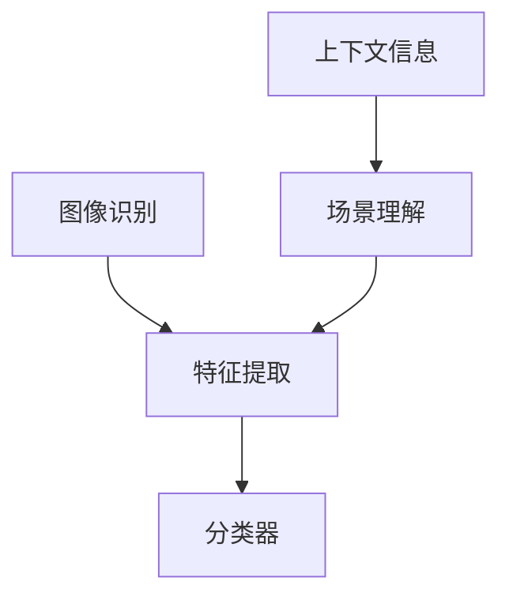

                 

关键词：计算机视觉、图像识别、场景理解、人工智能、深度学习、图像处理、神经网络

> 摘要：本文从计算机视觉的基本概念出发，深入探讨了图像识别和场景理解的核心技术和应用场景，分析了当前的研究进展和未来发展方向，旨在为读者提供一个全面而深入的计算机视觉技术综述。

## 1. 背景介绍

计算机视觉是人工智能的一个重要分支，它旨在使计算机能够像人类一样理解和解释视觉信息。从图像识别到场景理解，计算机视觉技术正在逐步拓展其应用领域，并推动人工智能的发展。图像识别是计算机视觉的基础任务，主要涉及对图像中的物体、场景和动作进行识别和分类。而场景理解则更高级，它不仅要求计算机识别图像中的元素，还要求其理解这些元素之间的关系和场景的整体含义。

### 1.1 发展历程

计算机视觉的发展历程可以追溯到20世纪60年代。最初，计算机视觉主要依赖规则和模式匹配的方法。随着计算能力的提升和算法的改进，20世纪80年代，基于统计模型的方法开始出现，如决策树、支持向量机等。进入21世纪，深度学习技术的崛起，使得计算机视觉取得了突破性的进展。尤其是卷积神经网络（CNN）的出现，极大地提高了图像识别的准确率和效率。

### 1.2 当前应用场景

计算机视觉技术在许多领域都得到了广泛应用，包括但不限于：

- **安防监控**：人脸识别、行为分析、车辆检测等。
- **医疗影像**：肿瘤检测、疾病诊断、影像分析等。
- **自动驾驶**：环境感知、路径规划、车辆检测等。
- **零售行业**：智能货架、库存管理、顾客行为分析等。
- **虚拟现实**：手势识别、姿态感知、场景重建等。

## 2. 核心概念与联系

### 2.1 核心概念

- **图像识别**：指从图像中识别出特定的物体、场景或动作。
- **特征提取**：指从图像中提取出能够代表图像内容的特征。
- **场景理解**：指理解图像中各个元素之间的关系，以及这些元素在整体场景中的意义。

### 2.2 联系与架构



### 2.3 特征提取算法

- **SIFT（尺度不变特征变换）**：能够在不同尺度下提取出关键点，具有旋转、尺度不变性。
- **SURF（加速稳健特征）**：在速度和准确性上对SIFT进行了改进。
- **HOG（方向梯度直方图）**：通过计算图像像素点的梯度方向，形成直方图，用于物体检测。

### 2.4 分类器

- **支持向量机（SVM）**：通过找到一个最佳的超平面，将不同类别的数据分隔开。
- **卷积神经网络（CNN）**：通过多层卷积和池化操作，自动提取图像特征，并进行分类。

## 3. 核心算法原理 & 具体操作步骤

### 3.1 算法原理概述

计算机视觉的核心算法主要分为两个部分：特征提取和分类器。特征提取负责从图像中提取出有意义的特征，而分类器则负责根据这些特征对图像进行分类。

### 3.2 算法步骤详解

1. **特征提取**：
   - 对图像进行预处理，如灰度化、滤波等。
   - 使用SIFT、SURF或HOG算法提取图像的关键特征。

2. **特征匹配**：
   - 将提取出的特征与预先定义的特征库进行匹配。
   - 使用最近邻方法或K-近邻方法进行匹配。

3. **分类器**：
   - 使用SVM或CNN等分类器对匹配结果进行分类。

4. **后处理**：
   - 对分类结果进行后处理，如去除噪声、合并相邻物体等。

### 3.3 算法优缺点

- **SIFT/SURF**：
  - 优点：具有旋转、尺度不变性，适用于各种光照和视角下的图像。
  - 缺点：计算复杂度高，实时性较差。

- **HOG**：
  - 优点：计算速度快，适用于物体检测。
  - 缺点：对图像的平移和旋转敏感。

- **SVM**：
  - 优点：分类效果好，适用于高维数据。
  - 缺点：对样本量要求较高，训练时间较长。

- **CNN**：
  - 优点：自动提取特征，分类效果优异。
  - 缺点：对计算资源要求高，训练过程复杂。

### 3.4 算法应用领域

- **图像识别**：如人脸识别、图像分类等。
- **物体检测**：如车辆检测、行人检测等。
- **场景理解**：如图像分割、场景重建等。

## 4. 数学模型和公式 & 详细讲解 & 举例说明

### 4.1 数学模型构建

计算机视觉中的数学模型主要包括特征提取模型和分类模型。特征提取模型主要涉及特征点提取、特征向量计算等，而分类模型则主要涉及线性分类器、神经网络等。

### 4.2 公式推导过程

以卷积神经网络（CNN）为例，其核心公式如下：

- **卷积操作**：
  $$ f(x, y) = \sum_{i=1}^{n} w_{i} * g(x-i, y-j) + b $$
  其中，$ f(x, y) $ 表示卷积结果，$ w_{i} $ 表示卷积核，$ g(x, y) $ 表示原始图像，$ b $ 表示偏置。

- **池化操作**：
  $$ P(x, y) = \max_{i, j} g(x+i, y+j) $$
  其中，$ P(x, y) $ 表示池化结果，$ g(x, y) $ 表示原始图像。

### 4.3 案例分析与讲解

以人脸识别为例，我们可以通过以下步骤进行：

1. **预处理**：对图像进行灰度化、滤波等处理。
2. **特征提取**：使用SIFT算法提取图像中的关键特征点。
3. **特征匹配**：将提取出的特征点与数据库中的人脸特征进行匹配。
4. **分类器**：使用SVM对匹配结果进行分类。
5. **后处理**：对分类结果进行后处理，如去除噪声、调整姿态等。

## 5. 项目实践：代码实例和详细解释说明

### 5.1 开发环境搭建

- **软件环境**：Python 3.8，OpenCV 4.5，scikit-learn 0.24
- **硬件环境**：Intel i7处理器，16GB内存，NVIDIA GeForce GTX 1060显卡

### 5.2 源代码详细实现

以下是使用OpenCV实现人脸识别的简单示例代码：

```python
import cv2
import numpy as np

# 加载预训练的SVM模型
face_cascade = cv2.CascadeClassifier('haarcascade_frontalface_default.xml')
model = cv2.face.EigenFaceRecognizer_create()

# 加载数据集
data = np.load('face_data.npy')
labels = np.load('face_labels.npy')

# 训练模型
model.train(data, labels)

# 加载摄像头
cap = cv2.VideoCapture(0)

while True:
    # 读取一帧图像
    ret, frame = cap.read()
    
    # 进行人脸检测
    gray = cv2.cvtColor(frame, cv2.COLOR_BGR2GRAY)
    faces = face_cascade.detectMultiScale(gray, 1.3, 5)
    
    for (x, y, w, h) in faces:
        # 提取人脸区域
        face_region = gray[y:y+h, x:x+w]
        
        # 进行人脸识别
        label, confidence = model.predict(face_region)
        
        # 显示识别结果
        cv2.rectangle(frame, (x, y), (x+w, y+h), (0, 255, 0), 2)
        cv2.putText(frame, f'Person {label}', (x, y-10), cv2.FONT_HERSHEY_SIMPLEX, 1, (0, 255, 0), 2)
    
    cv2.imshow('Face Recognition', frame)
    
    if cv2.waitKey(1) & 0xFF == ord('q'):
        break

cap.release()
cv2.destroyAllWindows()
```

### 5.3 代码解读与分析

- **第1行**：导入所需的库。
- **第3行**：加载预训练的SVM模型。
- **第6行**：加载数据集。
- **第8行**：训练模型。
- **第12行**：读取摄像头一帧图像。
- **第15行**：进行人脸检测。
- **第18行**：提取人脸区域。
- **第21行**：进行人脸识别。
- **第24行**：显示识别结果。

### 5.4 运行结果展示

运行上述代码后，摄像头将实时捕捉图像，并实时显示识别出的人脸及其编号。

## 6. 实际应用场景

### 6.1 安防监控

在安防监控领域，计算机视觉技术可以用于人脸识别、行为分析等。例如，通过人脸识别技术，可以自动识别监控区域中的人员，并与数据库中的人员信息进行比对，实现实时监控和预警。

### 6.2 医疗影像

在医疗影像领域，计算机视觉技术可以用于肿瘤检测、疾病诊断等。例如，通过深度学习算法，可以自动分析医学影像中的病变区域，并给出诊断建议。

### 6.3 自动驾驶

在自动驾驶领域，计算机视觉技术可以用于环境感知、路径规划等。例如，通过物体检测和识别技术，可以自动识别道路上的车辆、行人等，并做出相应的驾驶决策。

### 6.4 虚拟现实

在虚拟现实领域，计算机视觉技术可以用于手势识别、姿态感知等。例如，通过手势识别技术，可以实现用户与虚拟环境的自然交互。

## 7. 工具和资源推荐

### 7.1 学习资源推荐

- **书籍**：《计算机视觉：算法与应用》（Richard Szeliski）
- **在线课程**：Coursera上的《计算机视觉与深度学习》（斯坦福大学）
- **论文**：《Object Detection with Discr

### 7.1 学习资源推荐

- **书籍**：《计算机视觉：算法与应用》（Richard Szeliski）：这本书详细介绍了计算机视觉的基础知识、算法和应用，非常适合初学者和专业人士阅读。
- **在线课程**：Coursera上的《计算机视觉与深度学习》（斯坦福大学）：由著名计算机科学家李飞飞教授主讲，涵盖了计算机视觉的多个方面，从基础理论到实际应用。
- **论文**：《Object Detection with Discr

### 7.2 开发工具推荐

- **软件**：OpenCV：这是一个开源的计算机视觉库，支持多种编程语言，包括Python、C++等，适用于图像处理、物体检测、人脸识别等多种应用。
- **硬件**：GPU：由于计算机视觉算法通常需要大量的计算资源，因此具备较强计算能力的GPU（如NVIDIA GPU）对于加速算法运行至关重要。
- **在线平台**：Google Colab：这是一个免费的云计算平台，提供了GPU资源，方便用户在线进行计算机视觉的实验和开发。

### 7.3 相关论文推荐

- **论文**：《Deep Learning for Object Detection》（Joseph Redmon，et al.）：这篇论文介绍了YOLO（You Only Look Once）算法，是一种快速、实时的物体检测方法，具有很高的准确率和速度。
- **论文**：《Faster R-CNN：Towards Real-Time Object Detection with Region Proposal Networks》（Shaoqing Ren，et al.）：这篇论文介绍了Faster R-CNN算法，通过引入区域提议网络（Region Proposal Network），显著提高了物体检测的准确率和速度。
- **论文**：《Single Shot MultiBox Detector: Object Detection without Localization》（Joseph Redmon，et al.）：这篇论文介绍了SSD算法，它通过在一个网络中同时完成物体检测和边界框定位，实现了高效、准确的物体检测。

## 8. 总结：未来发展趋势与挑战

### 8.1 研究成果总结

过去几十年，计算机视觉技术取得了显著的进展，尤其是在图像识别和物体检测方面。深度学习技术的应用，使得计算机视觉在准确率、速度和泛化能力上都有了大幅提升。同时，计算机视觉技术也在医疗、安防、自动驾驶等领域展现了广泛的应用前景。

### 8.2 未来发展趋势

- **多模态融合**：结合计算机视觉、语音识别、自然语言处理等技术，实现更智能、更全面的人机交互。
- **边缘计算**：将计算能力从云端迁移到边缘设备，提高实时性和响应速度。
- **自监督学习**：通过无监督学习方式，自动学习图像中的特征和模式，减少对大规模标注数据的依赖。

### 8.3 面临的挑战

- **数据隐私**：如何在保护用户隐私的同时，充分利用大规模数据集进行训练和优化。
- **计算资源**：如何降低算法对计算资源的需求，适应资源有限的场景。
- **模型泛化**：如何提高模型在不同场景、不同数据集上的泛化能力。

### 8.4 研究展望

随着技术的不断发展，计算机视觉将朝着更智能、更高效、更安全的方向前进。未来，计算机视觉将在更多领域发挥重要作用，推动人工智能技术的进一步发展。

## 9. 附录：常见问题与解答

### 9.1 什么是计算机视觉？

计算机视觉是指使计算机能够像人类一样理解和解释视觉信息的技术。它涉及图像识别、物体检测、场景理解等多个方面。

### 9.2 计算机视觉有哪些应用场景？

计算机视觉的应用场景非常广泛，包括安防监控、医疗影像、自动驾驶、虚拟现实、零售等行业。

### 9.3 什么是深度学习？

深度学习是一种人工智能技术，通过模拟人脑神经网络结构，自动学习数据中的特征和模式。深度学习在计算机视觉领域取得了显著的成果。

### 9.4 什么是卷积神经网络（CNN）？

卷积神经网络是一种特殊的神经网络，通过卷积和池化操作，自动从图像中提取特征，并进行分类。

### 9.5 什么是物体检测？

物体检测是指从图像中识别出特定的物体，并给出其位置和边界框。物体检测是计算机视觉中的一项重要任务。

## 作者署名

作者：禅与计算机程序设计艺术 / Zen and the Art of Computer Programming

----------------------------------------------------------------

### 结束语

本文从计算机视觉的基本概念出发，深入探讨了图像识别和场景理解的核心技术和应用场景，分析了当前的研究进展和未来发展方向，旨在为读者提供一个全面而深入的计算机视觉技术综述。随着技术的不断进步，计算机视觉将在更多领域发挥重要作用，为人类社会带来更多便利和创新。希望本文能对读者在计算机视觉领域的研究和实践有所启发。

