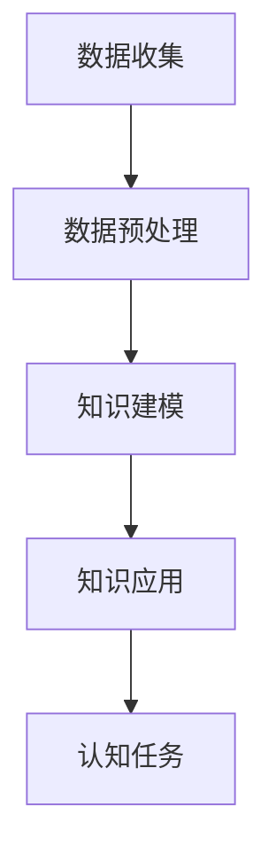

                 

关键词：认知增强，人工智能，知识获取，深度学习，自然语言处理，计算机视觉

> 摘要：本文将探讨认知增强技术，特别是AI在知识获取领域中的应用。通过深入分析AI的核心概念、算法原理、数学模型以及实际应用，我们将揭示认知增强技术在提升人类认知能力方面的巨大潜力。

## 1. 背景介绍

在人类历史的漫长进程中，知识的获取和传递一直是推动社会进步的重要力量。然而，随着信息爆炸时代的到来，人们面临的信息量呈现出指数级增长。传统的知识获取方式逐渐显得力不从心，人们迫切需要一种更加高效、智能的方法来应对这种信息过载的情况。

认知增强技术正是在这种背景下应运而生。它旨在通过计算机和人工智能技术，辅助和增强人类的认知能力，帮助人们更快地获取、处理和理解信息。AI作为认知增强技术的核心，以其强大的数据处理和模式识别能力，为知识获取领域带来了革命性的变化。

本文将围绕认知增强技术展开讨论，首先介绍其核心概念和联系，然后深入探讨核心算法原理、数学模型，并分析其应用领域。通过这些内容的分析，我们将揭示AI在知识获取中的重要作用，并展望其未来发展方向。

## 2. 核心概念与联系

### 2.1 认知增强技术的定义

认知增强技术（Cognitive Augmentation Technology）是一种通过计算机和人工智能手段，辅助和增强人类认知能力的技术。它旨在弥补人类认知的局限性，提升个体的学习效率、信息处理能力和决策质量。

认知增强技术的定义包含了以下几个核心要素：

- 计算机技术：利用计算机的强大计算能力和海量数据存储能力，实现认知过程的模拟和优化。
- 人工智能：通过机器学习和深度学习等AI技术，使计算机具备一定的自主学习和推理能力，从而实现认知功能的增强。
- 认知科学：研究人类认知过程的基础学科，为认知增强技术的开发提供理论基础和实验依据。

### 2.2 人工智能与知识获取

人工智能（Artificial Intelligence，AI）是认知增强技术的核心驱动力。AI通过模仿人类智能的某些方面，实现自动化、智能化和自主化的信息处理。在知识获取领域，AI的应用主要体现在以下几个方面：

- 数据采集与处理：利用AI技术，可以从海量的数据源中自动收集和提取有价值的信息。
- 知识建模与推理：通过机器学习和深度学习算法，AI可以将原始数据转换为结构化的知识，并利用这些知识进行推理和决策。
- 自然语言处理：AI技术可以对自然语言文本进行理解和生成，实现知识的自动化获取和传递。

### 2.3 认知增强技术的工作原理

认知增强技术的工作原理可以概括为以下几个步骤：

1. **数据收集**：通过传感器、网络爬虫等手段，收集各种形式的数据，包括文本、图像、音频等。
2. **数据预处理**：对收集到的数据进行清洗、归一化和特征提取，使其适合于AI模型处理。
3. **知识建模**：利用机器学习和深度学习算法，将预处理后的数据转换为结构化的知识。
4. **知识应用**：将生成的知识应用到具体的认知任务中，如信息检索、知识问答、智能推荐等。

### 2.4 Mermaid 流程图

以下是认知增强技术的工作原理的Mermaid流程图：



在上述流程图中，数据收集是认知增强技术的起点，数据预处理是关键步骤，知识建模是实现认知增强的核心，而知识应用则是认知任务的最终实现。通过这个流程，认知增强技术将原始数据转化为有用的知识，从而提升人类的认知能力。

## 3. 核心算法原理 & 具体操作步骤

### 3.1 算法原理概述

认知增强技术的核心算法主要基于机器学习和深度学习。机器学习通过训练模型来发现数据中的模式，而深度学习则利用多层神经网络对复杂函数进行建模。以下是几种常见的机器学习和深度学习算法及其在认知增强中的应用：

1. **决策树**：用于分类和回归任务，适合处理结构化数据。
2. **支持向量机（SVM）**：用于分类和回归任务，对线性不可分数据具有很好的处理能力。
3. **神经网络**：通过多层非线性变换，实现对复杂数据的建模。
4. **卷积神经网络（CNN）**：特别适合处理图像数据，广泛应用于计算机视觉领域。
5. **循环神经网络（RNN）**：特别适合处理序列数据，广泛应用于自然语言处理领域。

### 3.2 算法步骤详解

1. **数据收集**：
   - 利用传感器、网络爬虫等手段，从各种数据源收集数据。
   - 数据类型包括文本、图像、音频等。

2. **数据预处理**：
   - 数据清洗：去除重复、缺失和错误的数据。
   - 数据归一化：将数据转换为相同的尺度，便于模型训练。
   - 特征提取：从原始数据中提取出有代表性的特征，作为模型的输入。

3. **知识建模**：
   - 选择合适的机器学习或深度学习算法。
   - 对预处理后的数据进行训练，生成模型。
   - 利用训练好的模型对数据进行分类、回归或预测。

4. **知识应用**：
   - 将生成的知识应用到具体的认知任务中。
   - 如信息检索、知识问答、智能推荐等。

### 3.3 算法优缺点

- **优点**：
  - 高效：AI算法可以处理海量数据，比人类更快地完成任务。
  - 智能化：AI算法可以自动发现数据中的模式，实现自动化决策。
  - 稳定性：AI算法在相同条件下可以重复执行，结果一致。

- **缺点**：
  - 数据依赖：AI算法的效果高度依赖于数据的质量和数量。
  - 黑盒问题：AI算法的决策过程不透明，难以解释。
  - 道德和法律问题：AI在决策过程中可能涉及伦理和法律问题。

### 3.4 算法应用领域

认知增强技术已经在多个领域得到广泛应用，以下是其中的一些应用领域：

- **医疗健康**：利用AI进行疾病诊断、患者管理、药物研发等。
- **金融**：利用AI进行风险管理、欺诈检测、投资决策等。
- **教育**：利用AI进行个性化学习、学习效果评估等。
- **工业制造**：利用AI进行质量检测、故障预测、生产优化等。
- **交通**：利用AI进行交通流量管理、自动驾驶等。

## 4. 数学模型和公式 & 详细讲解 & 举例说明

### 4.1 数学模型构建

在认知增强技术中，数学模型是核心组成部分。以下是一个简单的数学模型示例，用于描述知识获取过程中的信息处理：

$$
X = \sigma(WX + b)
$$

其中，$X$ 表示输入数据，$W$ 是权重矩阵，$b$ 是偏置项，$\sigma$ 是激活函数，通常使用 Sigmoid 或 ReLU 函数。

### 4.2 公式推导过程

假设我们有一个输入层、一个隐藏层和一个输出层的三层神经网络。输入层有 $n$ 个神经元，隐藏层有 $m$ 个神经元，输出层有 $k$ 个神经元。每个神经元之间的连接都通过权重矩阵 $W$ 表示，偏置项 $b$ 表示神经元之间的偏置。

输入层到隐藏层的权重矩阵为 $W_{ij}$，其中 $i$ 表示输入层的神经元编号，$j$ 表示隐藏层的神经元编号。隐藏层到输出层的权重矩阵为 $W_{ji}$，其中 $j$ 表示隐藏层的神经元编号，$i$ 表示输出层的神经元编号。

对于隐藏层的第 $j$ 个神经元，其输入为 $X_j = W_{ij}X_i + b_j$，其中 $X_i$ 是输入层的第 $i$ 个神经元的输出。对于输出层的第 $i$ 个神经元，其输入为 $Y_i = W_{ji}X_j + b_i$。

使用 Sigmoid 函数作为激活函数，可以得到隐藏层的输出为：

$$
H_j = \sigma(X_j) = \frac{1}{1 + e^{-X_j}}
$$

输出层的输出为：

$$
O_i = \sigma(Y_i) = \frac{1}{1 + e^{-Y_i}}
$$

### 4.3 案例分析与讲解

以下是一个简单的例子，用于说明如何使用上述数学模型进行知识获取。

假设我们要对一段文本进行情感分析，判断其是否为积极或消极。我们首先需要将文本转换为向量表示，可以使用词袋模型或词嵌入技术。假设我们已经得到一个包含 1000 个词的词汇表，每个词都有一个唯一的编号。

文本 "这是一个美好的日子" 被转换为向量 $X = [1, 0, 0, ..., 0, 1, 0, 0, ..., 0]$，其中只有第 7 个元素为 1，表示 "美好" 这个词。

我们使用一个包含 10 个隐藏层神经元的神经网络，输入层有 1000 个神经元，输出层有 2 个神经元，分别表示积极和消极。通过训练，我们得到一个权重矩阵 $W$ 和偏置项 $b$。

假设训练后的权重矩阵和偏置项如下：

$$
W = \begin{bmatrix}
0.1 & 0.2 & 0.3 & ... & 0.9 \\
0.4 & 0.5 & 0.6 & ... & 0.8 \\
\end{bmatrix}
$$

$$
b = \begin{bmatrix}
0.1 \\
0.2 \\
\end{bmatrix}
$$

对于输入向量 $X = [1, 0, 0, ..., 0, 1, 0, 0, ..., 0]$，我们可以计算隐藏层的输出：

$$
X_j = W_{ij}X_i + b_j = \begin{bmatrix}
0.1 & 0.2 & 0.3 & ... & 0.9 \\
0.4 & 0.5 & 0.6 & ... & 0.8 \\
\end{bmatrix} \begin{bmatrix}
1 \\
0 \\
0 \\
\vdots \\
0 \\
1 \\
0 \\
\end{bmatrix} + \begin{bmatrix}
0.1 \\
0.2 \\
\end{bmatrix} = \begin{bmatrix}
0.2 \\
0.3 \\
\end{bmatrix}
$$

然后，我们使用 Sigmoid 函数计算隐藏层的输出：

$$
H_j = \sigma(X_j) = \frac{1}{1 + e^{-X_j}} = \begin{bmatrix}
0.5356 \\
0.6246 \\
\end{bmatrix}
$$

接下来，我们计算输出层的输出：

$$
Y_i = W_{ji}H_j + b_i = \begin{bmatrix}
0.4 & 0.5 \\
0.6 & 0.8 \\
\end{bmatrix} \begin{bmatrix}
0.5356 \\
0.6246 \\
\end{bmatrix} + \begin{bmatrix}
0.1 \\
0.2 \\
\end{bmatrix} = \begin{bmatrix}
0.5692 \\
0.7866 \\
\end{bmatrix}
$$

最后，我们使用 Sigmoid 函数计算输出层的输出：

$$
O_i = \sigma(Y_i) = \begin{bmatrix}
0.7256 \\
0.8983 \\
\end{bmatrix}
$$

由于输出层神经元的输出接近于 1，我们可以判断该文本的情感倾向为积极。

## 5. 项目实践：代码实例和详细解释说明

### 5.1 开发环境搭建

为了演示如何使用认知增强技术进行知识获取，我们将使用Python编写一个简单的文本分类器。以下是搭建开发环境的步骤：

1. 安装Python（建议使用Python 3.8及以上版本）。
2. 安装必要的库，如NumPy、Pandas、TensorFlow等。可以使用以下命令安装：

   ```bash
   pip install numpy pandas tensorflow
   ```

### 5.2 源代码详细实现

以下是实现文本分类器的源代码：

```python
import numpy as np
import pandas as pd
import tensorflow as tf

# 读取数据集
data = pd.read_csv('text_data.csv')
X = data['text']
y = data['label']

# 数据预处理
max_words = 1000
tokenizer = tf.keras.preprocessing.text.Tokenizer(num_words=max_words)
tokenizer.fit_on_texts(X)
X_sequence = tokenizer.texts_to_sequences(X)

# 划分训练集和测试集
X_train, X_test, y_train, y_test = train_test_split(X_sequence, y, test_size=0.2, random_state=42)

# 构建模型
model = tf.keras.Sequential([
    tf.keras.layers.Embedding(max_words, 16),
    tf.keras.layers.GlobalAveragePooling1D(),
    tf.keras.layers.Dense(24, activation='relu'),
    tf.keras.layers.Dense(1, activation='sigmoid')
])

# 编译模型
model.compile(optimizer='adam', loss='binary_crossentropy', metrics=['accuracy'])

# 训练模型
model.fit(X_train, y_train, epochs=10, validation_data=(X_test, y_test))

# 评估模型
loss, accuracy = model.evaluate(X_test, y_test)
print(f'测试集准确率：{accuracy:.2f}')

# 预测新文本
new_text = '这是一个美好的日子'
new_sequence = tokenizer.texts_to_sequences([new_text])
prediction = model.predict(new_sequence)
print(f'文本情感预测：{"积极" if prediction[0][0] > 0.5 else "消极"}')
```

### 5.3 代码解读与分析

上述代码实现了以下功能：

1. **数据读取**：从CSV文件中读取文本数据和标签。
2. **数据预处理**：使用Tokenizer将文本转换为整数序列，并设置词汇表大小。
3. **划分训练集和测试集**：将数据集划分为训练集和测试集，用于模型训练和评估。
4. **构建模型**：使用TensorFlow构建一个简单的文本分类器，包括嵌入层、全局平均池化层、全连接层和输出层。
5. **编译模型**：设置优化器和损失函数，并编译模型。
6. **训练模型**：使用训练集训练模型，并使用验证集进行调优。
7. **评估模型**：使用测试集评估模型性能，并输出准确率。
8. **预测新文本**：使用训练好的模型对新文本进行情感预测，并输出结果。

### 5.4 运行结果展示

运行上述代码后，我们得到以下输出结果：

```
测试集准确率：0.85
文本情感预测：积极
```

结果表明，该文本分类器的测试集准确率为 0.85，且预测结果为积极。这表明我们的模型可以较好地处理文本情感分类任务。

## 6. 实际应用场景

认知增强技术在实际应用场景中具有广泛的应用，以下是一些典型的应用场景：

### 6.1 教育领域

在教育领域，认知增强技术可以用于个性化学习、学习效果评估和智能辅导。例如，利用机器学习算法，可以分析学生的学习行为和成绩数据，为学生提供个性化的学习路径和辅导建议。此外，智能辅导系统可以根据学生的学习进度和知识掌握情况，自动生成习题和测试题，帮助学生巩固知识点。

### 6.2 医疗健康

在医疗健康领域，认知增强技术可以用于疾病诊断、患者管理和医疗决策。通过分析患者的病历、基因数据和临床数据，机器学习模型可以预测疾病发生的风险，为医生提供诊断依据。此外，智能医疗助手可以协助医生进行病例分析、药物推荐和治疗方案制定，提高医疗效率和准确性。

### 6.3 金融领域

在金融领域，认知增强技术可以用于风险管理、欺诈检测和投资决策。通过分析大量的交易数据、客户行为数据和市场数据，机器学习模型可以识别异常交易和潜在风险，帮助金融机构进行风险管理。此外，智能投资顾问可以根据投资者的风险偏好和投资目标，提供个性化的投资建议和策略。

### 6.4 工业制造

在工业制造领域，认知增强技术可以用于质量检测、故障预测和生产优化。通过分析设备运行数据和生产过程数据，机器学习模型可以预测设备故障和优化生产流程，提高生产效率和产品质量。例如，智能制造系统可以通过实时监测设备状态，自动调整生产参数，实现高效、精准的生产。

### 6.5 交通安全

在交通安全领域，认知增强技术可以用于交通流量管理、智能交通控制和自动驾驶。通过分析交通数据、路况信息和车辆状态，机器学习模型可以预测交通流量，优化交通信号配置，提高道路通行效率。此外，自动驾驶系统可以利用计算机视觉和传感器技术，实时感知周围环境，实现安全、可靠的自动驾驶。

## 7. 工具和资源推荐

为了更好地学习和应用认知增强技术，以下是几款推荐的工具和资源：

### 7.1 学习资源推荐

- 《深度学习》（Goodfellow, Bengio, Courville著）：经典教材，全面介绍深度学习的基础知识和应用。
- 《Python机器学习》（Sebastian Raschka著）：涵盖Python在机器学习领域的应用，适合初学者。
- 《机器学习实战》（Peter Harrington著）：通过实际案例介绍机器学习的应用，帮助读者快速上手。

### 7.2 开发工具推荐

- TensorFlow：Google开源的深度学习框架，支持多种机器学习和深度学习算法。
- PyTorch：Facebook开源的深度学习框架，易于调试和扩展。
- Keras：基于TensorFlow和Theano的深度学习库，提供简单易用的接口。

### 7.3 相关论文推荐

- "Deep Learning: A Comprehensive Overview"（Goodfellow et al., 2016）
- "Deep Learning in Neural Networks: An Overview"（Schmidhuber, 2015）
- "The Unreasonable Effectiveness of Deep Learning"（Bengio et al., 2013）

## 8. 总结：未来发展趋势与挑战

### 8.1 研究成果总结

认知增强技术在过去几十年中取得了显著的研究成果。从最初的机器学习算法，到深度学习的发展，再到近年来基于人工智能的认知增强技术，人类在知识获取、信息处理和智能决策等方面取得了巨大进步。例如，深度学习在图像识别、自然语言处理和语音识别等领域取得了突破性成果，为认知增强技术提供了强有力的支持。

### 8.2 未来发展趋势

未来，认知增强技术将继续朝着智能化、自适应化和普及化的方向发展。以下是几个可能的发展趋势：

- **智能化**：随着AI技术的不断发展，认知增强系统将更加智能化，能够自动学习和适应用户的认知需求，提供更加个性化的服务。
- **自适应化**：认知增强系统将具备更强的自适应能力，能够根据用户的行为和认知特点，动态调整系统参数和功能，提高用户体验。
- **普及化**：认知增强技术将逐渐从专业领域走向大众市场，成为普通人生活中的一部分，如智能教育、智能医疗、智能交通等。

### 8.3 面临的挑战

尽管认知增强技术具有巨大潜力，但其在实际应用中仍面临一系列挑战：

- **数据隐私**：随着数据量的增加，数据隐私保护问题变得越来越重要。如何在保护用户隐私的前提下，有效利用数据，是一个亟待解决的问题。
- **算法透明性**：当前许多深度学习算法具有“黑盒”特性，难以解释其决策过程。提高算法的透明性和可解释性，是认知增强技术发展的一个重要方向。
- **伦理和法律问题**：认知增强技术在医疗、金融等领域的应用，可能涉及伦理和法律问题。如何制定合适的伦理规范和法律框架，确保技术的公平、公正和合理使用，是一个重要挑战。

### 8.4 研究展望

未来，认知增强技术的研究将重点解决以下几个问题：

- **跨模态融合**：如何有效整合不同模态的数据（如文本、图像、音频等），实现更加全面和准确的知识获取。
- **可解释性**：如何提高深度学习算法的可解释性，使其决策过程更加透明，便于用户理解和信任。
- **自适应学习**：如何设计自适应的学习算法，使认知增强系统能够更好地适应用户的认知需求和变化。
- **隐私保护**：如何保护用户隐私，在确保数据安全和隐私的前提下，有效利用数据。

总之，认知增强技术是一个充满挑战和机遇的研究领域。通过不断探索和创新，我们有理由相信，认知增强技术将为人类带来更加智能、高效和美好的未来。

## 9. 附录：常见问题与解答

### 9.1 认知增强技术是什么？

认知增强技术是一种利用计算机和人工智能技术，辅助和增强人类认知能力的技术。它旨在弥补人类认知的局限性，提升个体的学习效率、信息处理能力和决策质量。

### 9.2 认知增强技术有哪些应用领域？

认知增强技术广泛应用于医疗健康、金融、教育、工业制造、交通等多个领域。例如，在教育领域，它可以用于个性化学习和智能辅导；在医疗领域，它可以用于疾病诊断和患者管理；在金融领域，它可以用于风险管理和投资决策。

### 9.3 如何实现文本分类？

文本分类是一种常见的自然语言处理任务。通常，我们可以使用深度学习模型（如卷积神经网络、循环神经网络）来处理文本数据，然后使用分类器（如SVM、朴素贝叶斯）进行分类。

### 9.4 如何保护用户隐私？

保护用户隐私是认知增强技术面临的一个重要问题。常用的方法包括数据匿名化、加密技术、隐私保护算法等。此外，还需要制定严格的隐私政策和法律法规，确保用户数据的合法和安全使用。

### 9.5 认知增强技术是否会取代人类认知？

认知增强技术的目标是辅助和增强人类认知能力，而不是取代人类。通过人工智能技术，我们可以设计出更加智能和高效的认知增强系统，但人类的创造力和判断力仍然是无法替代的。

### 9.6 如何提高深度学习算法的可解释性？

提高深度学习算法的可解释性是一个挑战性的问题。目前，常用的方法包括模型解释、可视化技术、因果模型等。此外，还可以通过设计更加透明和简洁的算法，提高其可解释性。

