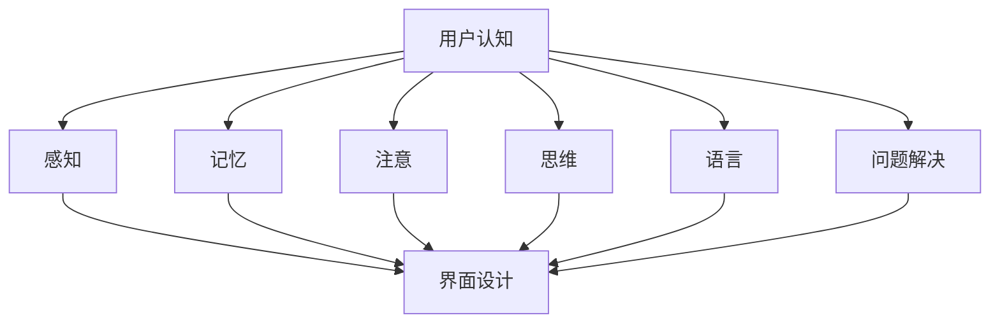

                 

关键词：认知科学、用户体验、界面设计、直观性、技术语言

> 摘要：本文旨在探讨认知科学与用户体验在界面设计中的重要性，通过深入分析认知科学的理论基础和用户体验的核心要素，揭示设计直观界面的关键原则。文章将结合具体案例，提供实用的技术和方法，以帮助设计师和开发者创建更加符合用户认知习惯的界面，从而提升产品的使用体验。

## 1. 背景介绍

在当今数字化时代，用户体验（User Experience, UX）已经成为产品设计和开发中的核心要素。一个直观、易于使用的界面不仅能够提升用户的满意度，还能显著提高产品的市场竞争力和用户留存率。然而，如何设计出真正符合用户需求的界面，并非易事。

认知科学（Cognitive Science）作为一门跨学科领域，涵盖了心理学、神经科学、计算机科学等多个学科，旨在研究人类认知过程和智能行为。将认知科学的理论应用到界面设计中，有助于理解用户的思维方式和行为模式，从而设计出更加符合用户预期的界面。

本文将探讨认知科学与用户体验在界面设计中的关系，分析影响用户认知和体验的关键因素，并提供实用的设计和开发方法，以帮助设计师和开发者构建直观、易用的界面。

## 2. 核心概念与联系

### 2.1 认知科学的基本概念

认知科学的核心概念包括感知、记忆、注意、思维、语言和问题解决等。以下是这些概念的基本定义和它们在界面设计中的应用：

- **感知（Perception）**：感知是用户通过感官接收外部信息的过程。在界面设计中，需要确保信息的呈现方式符合用户的感知习惯，如使用直观的图标和颜色。

- **记忆（Memory）**：记忆是用户在认知过程中存储和提取信息的能力。界面设计应考虑如何帮助用户建立记忆连接，例如通过一致的导航结构和清晰的信息层级。

- **注意（Attention）**：注意是指用户在特定时刻关注的信息范围。界面设计应突出关键信息，避免过度复杂，以免分散用户的注意力。

- **思维（Cognition）**：思维是指用户在解决问题和做出决策时的认知过程。界面设计应支持用户的思维活动，如提供清晰的反馈和指导。

- **语言（Language）**：语言是用户理解和表达信息的方式。界面设计应使用简洁明了的语言，避免专业术语，确保用户能够轻松理解。

- **问题解决（Problem Solving）**：问题解决是用户在遇到问题时采取的应对策略。界面设计应简化问题解决过程，提供明确的解决方案和提示。

### 2.2 用户体验的核心要素

用户体验包括多个维度，如易用性、可用性、吸引力和满意度。以下是这些要素的基本定义和它们在界面设计中的应用：

- **易用性（Usability）**：易用性是指用户能够轻松完成任务的界面特性。界面设计应简化用户操作，减少错误，提供直观的交互方式。

- **可用性（Accessibility）**：可用性是指所有用户，包括有特殊需求的人群，都能够使用产品的能力。界面设计应考虑无障碍设计，如提供语音导航和屏幕阅读器支持。

- **吸引力（Engagement）**：吸引力是指用户对产品的兴趣和投入程度。界面设计应通过视觉设计和互动元素来吸引用户，提高用户黏性。

- **满意度（Satisfaction）**：满意度是指用户对产品整体体验的感受。界面设计应考虑用户反馈，持续优化，提高用户满意度。

### 2.3 认知科学与用户体验的联系

认知科学与用户体验紧密相连。认知科学的理论和研究成果为理解用户行为提供了科学依据，有助于设计师更好地预测用户需求，设计出符合用户认知习惯的界面。例如，认知科学中的感知和记忆理论指导设计师如何优化信息呈现和导航结构，以提高界面的易用性和可用性。

以下是一个Mermaid流程图，展示了认知科学与用户体验在界面设计中的应用：



## 3. 核心算法原理 & 具体操作步骤

### 3.1 算法原理概述

界面设计的核心算法可以概括为以下几个步骤：

1. **需求分析**：通过用户研究和市场分析，了解用户需求和行为模式。
2. **信息架构**：构建清晰的信息层级和导航结构，确保用户能够快速找到所需信息。
3. **交互设计**：设计直观、易用的交互元素，如按钮、菜单和表单。
4. **视觉设计**：使用合适的视觉元素，如颜色、字体和图标，提高界面的吸引力和可读性。
5. **用户测试**：通过实际用户测试，收集反馈，持续优化设计。

### 3.2 算法步骤详解

#### 步骤1：需求分析

- **用户研究**：通过访谈、问卷调查和用户观察，收集用户需求和行为数据。
- **市场分析**：分析竞争对手的产品特点和市场定位，找出差异化点。

#### 步骤2：信息架构

- **内容规划**：根据用户需求，梳理主要内容和功能，构建信息架构。
- **导航设计**：设计直观、易用的导航结构，如面包屑、搜索和侧边栏。

#### 步骤3：交互设计

- **交互元素设计**：设计符合用户习惯的交互元素，如按钮、图标和菜单。
- **反馈机制**：提供清晰的反馈，如成功提示和错误消息。

#### 步骤4：视觉设计

- **色彩选择**：使用合适的颜色搭配，提高界面的吸引力和可读性。
- **字体选择**：选择易读的字体，确保用户能够轻松阅读。
- **图标设计**：设计简洁、直观的图标，帮助用户快速理解功能。

#### 步骤5：用户测试

- **可用性测试**：邀请实际用户测试界面，观察用户的行为和反应。
- **反馈收集**：收集用户反馈，分析用户在操作过程中遇到的问题。

### 3.3 算法优缺点

**优点**：

- **提高易用性**：通过深入分析用户需求和行为，设计出符合用户预期的界面，提高产品的易用性。
- **降低学习成本**：直观的界面设计降低用户的学习成本，使新用户能够快速上手。
- **提高用户满意度**：优化用户界面，提高用户的满意度，增加用户黏性。

**缺点**：

- **设计复杂度**：界面设计需要综合考虑多个因素，如用户需求、市场定位和视觉设计，可能导致设计复杂度增加。
- **测试成本**：用户测试需要投入大量时间和资源，可能增加项目成本。

### 3.4 算法应用领域

界面设计的核心算法广泛应用于多个领域，如Web应用、移动应用和桌面软件。以下是一些具体的应用案例：

- **电子商务网站**：通过优化导航和搜索功能，提高用户的购物体验。
- **医疗软件**：设计直观的界面，帮助医护人员快速找到所需信息。
- **教育软件**：设计易于操作的学习工具，提高学生的学习效果。
- **企业管理软件**：设计简洁的界面，提高工作效率和管理效果。

## 4. 数学模型和公式 & 详细讲解 & 举例说明

### 4.1 数学模型构建

界面设计的数学模型可以基于用户行为数据，通过统计分析和机器学习算法，预测用户在界面上的行为和偏好。以下是一个基本的数学模型：

$$
\text{User Behavior Model} = f(\text{User Attributes}, \text{Interface Features}, \text{Context})
$$

其中，$f$ 代表函数，$\text{User Attributes}$ 包括用户的基本信息、行为历史等，$\text{Interface Features}$ 包括界面的布局、交互元素等，$\text{Context}$ 包括用户当前的环境、需求等。

### 4.2 公式推导过程

为了推导上述数学模型，我们可以采用以下步骤：

1. **用户属性分析**：收集用户的基本信息和行为数据，如年龄、性别、兴趣爱好、使用习惯等。
2. **界面特征分析**：分析界面的各个组成部分，如布局、颜色、交互元素等。
3. **行为预测**：通过机器学习算法，如决策树、神经网络等，建立用户行为模型。
4. **模型优化**：通过不断迭代和调整模型参数，提高预测准确度。

### 4.3 案例分析与讲解

以下是一个具体的案例分析：

**案例：某电子商务网站的用户行为预测**

- **用户属性**：用户年龄、性别、购买历史等。
- **界面特征**：产品分类、推荐系统、购物车、支付流程等。
- **行为预测**：预测用户在网站上的购买行为。

通过收集用户数据，我们可以建立以下用户行为模型：

$$
\text{Purchase Probability} = \text{sigmoid}(\text{User Score} + \text{Interface Score})
$$

其中，$\text{User Score}$ 和 $\text{Interface Score}$ 分别是用户属性和界面特征的得分，$\text{sigmoid}$ 函数是一个常见的激活函数，用于将输入映射到0和1之间。

通过这个模型，我们可以预测用户在网站上的购买概率。例如，一个用户在浏览产品详情页时，如果模型预测的购买概率接近1，那么可以认为这个用户有较高的购买意愿，界面设计可以进一步优化，提高购买转化率。

## 5. 项目实践：代码实例和详细解释说明

### 5.1 开发环境搭建

在本项目中，我们将使用Python作为主要编程语言，结合多个开源库进行界面设计和用户行为分析。以下是开发环境搭建的步骤：

1. **安装Python**：确保安装了Python 3.x版本。
2. **安装相关库**：使用pip命令安装必要的库，如Pandas、NumPy、Matplotlib、Scikit-learn等。

```shell
pip install pandas numpy matplotlib scikit-learn
```

### 5.2 源代码详细实现

以下是一个简单的用户行为预测代码实例：

```python
import pandas as pd
from sklearn.model_selection import train_test_split
from sklearn.ensemble import RandomForestClassifier
from sklearn.metrics import accuracy_score

# 读取用户数据
data = pd.read_csv('user_data.csv')

# 特征工程
X = data[['age', 'gender', 'interests', 'buying_history']]
y = data['purchase']

# 数据预处理
X = pd.get_dummies(X)

# 划分训练集和测试集
X_train, X_test, y_train, y_test = train_test_split(X, y, test_size=0.2, random_state=42)

# 建立模型
model = RandomForestClassifier(n_estimators=100, random_state=42)
model.fit(X_train, y_train)

# 预测
y_pred = model.predict(X_test)

# 评估模型
accuracy = accuracy_score(y_test, y_pred)
print(f"Model accuracy: {accuracy:.2f}")
```

### 5.3 代码解读与分析

1. **数据读取**：使用Pandas库读取用户数据，包括用户属性和购买行为。
2. **特征工程**：将用户属性转换为哑变量，用于机器学习模型。
3. **数据划分**：将数据集划分为训练集和测试集，用于训练和评估模型。
4. **模型建立**：使用随机森林分类器（RandomForestClassifier）建立模型。
5. **模型训练**：使用训练集数据训练模型。
6. **模型预测**：使用测试集数据预测用户购买行为。
7. **模型评估**：计算模型准确率，评估模型性能。

### 5.4 运行结果展示

运行上述代码，我们可以得到模型在测试集上的准确率。例如，如果模型的准确率为90%，则说明模型在预测用户购买行为方面具有较高的准确性。

## 6. 实际应用场景

界面设计在各个领域都有广泛的应用，以下是一些具体的实际应用场景：

### 6.1 电子商务

电子商务平台通过优化导航、搜索和推荐系统，提高用户的购物体验。例如，Amazon使用复杂的算法分析用户行为，为用户提供个性化的商品推荐，提高购买转化率。

### 6.2 医疗保健

医疗保健系统通过设计直观的界面，帮助医护人员快速找到所需信息。例如，电子病历系统（Electronic Health Records, EHR）提供清晰的导航和搜索功能，提高工作效率。

### 6.3 教育科技

教育科技平台通过设计易于操作的学习工具，提高学生的学习效果。例如，Khan Academy使用简单的界面和互动元素，帮助学生自主学习和练习。

### 6.4 企业管理

企业管理软件通过设计简洁的界面，提高工作效率和管理效果。例如，Salesforce提供直观的CRM界面，帮助企业销售人员快速访问客户信息和销售数据。

### 6.5 未来应用展望

随着人工智能和大数据技术的发展，界面设计将继续演变。未来，界面设计将更加注重个性化、智能化和自适应化。例如，通过机器学习算法，界面可以根据用户行为和偏好自动调整，提供个性化的交互体验。

## 7. 工具和资源推荐

### 7.1 学习资源推荐

- **《认知心理学及其启示：用户体验设计与技术》**：深入探讨认知心理学在用户体验设计中的应用。
- **《用户体验要素》**：经典的用户体验设计书籍，详细介绍了设计用户体验的五个层次。
- **《界面设计指南》**：提供实用的界面设计技巧和最佳实践。

### 7.2 开发工具推荐

- **Sketch**：流行的界面设计工具，支持矢量绘图和原型设计。
- **Figma**：基于浏览器的界面设计工具，支持团队协作和实时预览。
- **Adobe XD**：专业的界面设计工具，提供丰富的交互设计和原型功能。

### 7.3 相关论文推荐

- **“Cognitive Engineering Principles for System Design”**：探讨了认知工程原理在系统设计中的应用。
- **“The Design of Everyday Things”**：经典的界面设计理论书籍，详细介绍了设计原则和实践方法。
- **“User Experience Design and Evaluation: A Methodology”**：介绍了用户体验设计和评估的方法论。

## 8. 总结：未来发展趋势与挑战

### 8.1 研究成果总结

本文从认知科学和用户体验的角度，探讨了界面设计的核心原则和方法。通过分析用户行为和认知过程，揭示了设计直观、易用界面的关键要素。研究表明，结合认知科学理论和用户体验研究，可以有效提升界面设计的质量和用户满意度。

### 8.2 未来发展趋势

随着人工智能和大数据技术的发展，界面设计将更加注重智能化和个性化。未来，界面设计将更加自适应、智能，能够根据用户行为和偏好进行实时调整。此外，无障碍设计和隐私保护也将成为界面设计的重要方向。

### 8.3 面临的挑战

界面设计面临着众多挑战，包括如何平衡设计复杂度和用户体验、如何确保无障碍设计、如何保护用户隐私等。此外，随着用户需求的不断变化，界面设计需要持续迭代和优化，以满足不断变化的市场需求。

### 8.4 研究展望

未来的研究可以进一步探讨认知科学和用户体验在界面设计中的应用，开发更加智能和自适应的界面设计工具。同时，研究如何将无障碍设计和隐私保护融入界面设计过程中，为用户提供更好的使用体验。

## 9. 附录：常见问题与解答

### 9.1 如何确保界面设计符合用户需求？

- **用户研究**：通过访谈、问卷调查和用户观察，了解用户需求和行为模式。
- **原型测试**：设计原型，邀请用户进行测试，收集反馈，持续优化设计。

### 9.2 如何平衡设计复杂度和用户体验？

- **简化功能**：去除不必要的功能，确保界面简洁明了。
- **逐步引导**：通过分步引导和提示，帮助用户逐步熟悉复杂界面。

### 9.3 如何设计无障碍界面？

- **遵循无障碍设计标准**：如WCAG（Web内容可访问性指南）。
- **提供多种交互方式**：如语音导航、屏幕阅读器支持等。

### 9.4 如何保护用户隐私？

- **透明化数据使用**：明确告知用户数据收集和使用目的。
- **数据加密**：确保用户数据在传输和存储过程中的安全。

# 作者署名

作者：禅与计算机程序设计艺术 / Zen and the Art of Computer Programming
```

