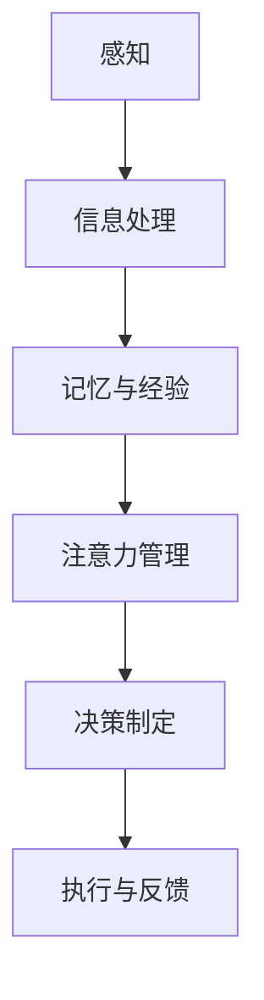

                 

关键词：认知科学，商业决策，优化算法，数据分析，神经经济学

> 摘要：本文探讨了认知科学在商业决策优化中的应用，通过介绍认知科学的核心概念和理论，结合商业环境中的实际案例，分析如何利用认知科学的原理提升商业决策的质量和效率。文章还讨论了相关算法和数学模型，以及它们在实际商业决策中的应用和效果。

## 1. 背景介绍

认知科学是一门跨学科的研究领域，旨在理解人类思维、感知、记忆、学习和决策等认知过程的本质。商业决策优化是商业管理中至关重要的环节，它涉及到如何在复杂的市场环境中做出最优的选择，以实现企业的目标。认知科学的不断发展为商业决策优化提供了新的理论和方法，使得企业在制定决策时能够更加科学和高效。

### 1.1 认知科学的核心概念

认知科学的核心概念包括感知、记忆、注意力、思维和决策等。这些概念从不同的角度揭示了人类认知过程的机制，为理解和优化商业决策提供了理论基础。

1. **感知**：人类如何感知和理解外界信息，包括视觉、听觉、触觉等感官信息的处理和解释。
2. **记忆**：人类如何存储、检索和使用信息，涉及短期记忆和长期记忆的机制。
3. **注意力**：人类如何集中精力处理特定信息，而忽略其他无关信息。
4. **思维**：人类如何运用逻辑、推理和判断能力进行思考，解决复杂问题。
5. **决策**：人类在面临选择时如何权衡各种因素，做出最优决策。

### 1.2 商业决策优化的挑战

商业决策优化面临着诸多挑战，包括信息复杂性、不确定性、时间限制和资源约束等。传统的决策方法往往依赖于经验和直觉，难以应对现代商业环境中日益复杂的问题。认知科学提供了新的视角和方法，帮助企业在不确定性环境中做出更加科学的决策。

## 2. 核心概念与联系

### 2.1 认知科学与商业决策的联系

认知科学的核心概念与商业决策密切相关。以下是一个简化的 Mermaid 流程图，展示了认知科学如何与商业决策优化相关联：



### 2.2 商业决策优化的流程

商业决策优化通常包括以下几个步骤：

1. **问题定义**：明确决策目标，分析决策问题。
2. **信息收集**：收集与决策相关的各种数据和信息。
3. **方案生成**：基于收集到的信息，生成多种可能的解决方案。
4. **评估与选择**：利用认知科学原理，对各个方案进行评估和选择。
5. **执行与反馈**：实施决策方案，并根据反馈进行调整和优化。

## 3. 核心算法原理 & 具体操作步骤

### 3.1 算法原理概述

认知科学在商业决策优化中的应用，可以归结为以下几个核心算法原理：

1. **行为经济学**：研究人类在不确定环境下的行为模式，提供对商业决策的洞察。
2. **决策树**：通过构建决策树模型，帮助决策者在不同情境下做出最优选择。
3. **神经网络**：模拟人脑神经元的工作方式，进行复杂数据的分析和预测。
4. **强化学习**：通过不断试错和反馈，优化决策过程，提高决策效率。

### 3.2 算法步骤详解

1. **行为经济学**

   - **步骤1**：收集市场数据，包括消费者行为、市场趋势和竞争对手行为。
   - **步骤2**：分析数据，识别消费者行为模式和市场需求。
   - **步骤3**：基于行为经济学理论，制定相应的营销策略和定价策略。
   - **步骤4**：实施策略，收集市场反馈，评估策略效果。

2. **决策树**

   - **步骤1**：确定决策变量和目标函数。
   - **步骤2**：收集数据，构建决策树模型。
   - **步骤3**：通过决策树模型进行情景分析和决策。
   - **步骤4**：评估决策结果，调整模型参数。

3. **神经网络**

   - **步骤1**：设计神经网络结构，包括输入层、隐藏层和输出层。
   - **步骤2**：收集训练数据，用于训练神经网络。
   - **步骤3**：利用训练数据进行网络训练，优化网络参数。
   - **步骤4**：对训练好的神经网络进行预测和决策。

4. **强化学习**

   - **步骤1**：定义环境，确定状态和动作空间。
   - **步骤2**：选择强化学习算法，如 Q-Learning 或 Deep Q-Networks。
   - **步骤3**：通过模拟或真实环境进行训练，调整策略。
   - **步骤4**：评估策略效果，进行优化。

### 3.3 算法优缺点

1. **行为经济学**

   - **优点**：能够提供对消费者行为的深刻理解，有助于制定更加有效的营销策略。
   - **缺点**：数据收集和分析过程较为复杂，且结果可能受到主观因素的影响。

2. **决策树**

   - **优点**：简单易懂，易于实现和解释。
   - **缺点**：模型复杂度较低，可能无法应对高度非线性问题。

3. **神经网络**

   - **优点**：能够处理复杂的数据和非线性问题，具有很好的泛化能力。
   - **缺点**：模型训练过程较慢，且结果难以解释。

4. **强化学习**

   - **优点**：能够通过不断试错和反馈，自适应地优化决策过程。
   - **缺点**：模型训练过程复杂，且结果可能受到探索与利用平衡的影响。

### 3.4 算法应用领域

认知科学算法在商业决策优化中的应用非常广泛，包括但不限于以下领域：

- **市场营销**：通过行为经济学原理，优化产品定价、广告策略和促销活动。
- **供应链管理**：利用决策树和神经网络进行库存优化、运输调度和风险控制。
- **人力资源管理**：通过强化学习优化员工招聘、培训和绩效评估策略。
- **金融投资**：利用神经网络和强化学习进行投资组合优化、风险管理。

## 4. 数学模型和公式 & 详细讲解 & 举例说明

### 4.1 数学模型构建

在商业决策优化中，常见的数学模型包括线性规划、整数规划、动态规划和贝叶斯网络等。以下是一个简单的线性规划模型构建过程：

$$
\begin{aligned}
\min_{x} \quad & c^T x \\
\text{s.t.} \quad & Ax \leq b \\
& x \geq 0
\end{aligned}
$$

其中，$x$ 是决策变量，$c$ 是目标函数系数，$A$ 和 $b$ 是约束条件。

### 4.2 公式推导过程

线性规划模型的推导过程基于以下假设：

1. **目标函数**：最大化或最小化某个线性目标函数。
2. **约束条件**：约束条件为线性不等式。
3. **可行解**：决策变量必须满足所有约束条件。

线性规划模型的推导通常分为以下几个步骤：

1. **问题转化**：将原始问题转化为标准形式，确保所有约束条件均为线性不等式。
2. **引入松弛变量**：为每个不等式约束引入松弛变量，将不等式转化为等式。
3. **建立目标函数**：根据原始问题的目标函数，建立新的目标函数。
4. **求解最优化问题**：利用单纯形法或其他求解方法，求解最优化问题。

### 4.3 案例分析与讲解

以下是一个简单的线性规划案例，用于优化一家公司的生产计划：

### 案例背景

一家公司生产两种产品A和B，每个产品的生产成本分别为100元和200元，生产一台产品A需要2小时，生产一台产品B需要3小时。公司每天有12小时的生产时间。目标是最小化总生产成本。

### 案例分析

1. **问题转化**：设$x_1$为产品A的生产数量，$x_2$为产品B的生产数量。目标函数为$min z = 100x_1 + 200x_2$。
2. **约束条件**：生产时间约束$2x_1 + 3x_2 \leq 12$，且$x_1, x_2 \geq 0$。
3. **建立线性规划模型**：

$$
\begin{aligned}
\min_{x} \quad & 100x_1 + 200x_2 \\
\text{s.t.} \quad & 2x_1 + 3x_2 \leq 12 \\
& x_1, x_2 \geq 0
\end{aligned}
$$

4. **求解最优化问题**：利用单纯形法求解线性规划模型，得到最优解$x_1 = 3, x_2 = 2$，总生产成本为700元。

## 5. 项目实践：代码实例和详细解释说明

### 5.1 开发环境搭建

为了演示如何在实际项目中应用认知科学算法，我们选择Python作为编程语言，并使用Scikit-learn库进行线性规划模型的求解。以下是一个简单的开发环境搭建步骤：

1. 安装Python：在命令行中运行`pip install python`，安装Python 3.8或更高版本。
2. 安装Scikit-learn：在命令行中运行`pip install scikit-learn`，安装Scikit-learn库。

### 5.2 源代码详细实现

以下是一个简单的线性规划案例，用于优化一家公司的生产计划。源代码如下：

```python
from scipy.optimize import linprog

# 定义目标函数系数
c = [-100, -200]

# 定义约束条件系数
A = [[2, 3], [-1, 0], [0, -1]]

# 定义约束条件常数项
b = [12, 0, 0]

# 求解线性规划问题
result = linprog(c, A_ub=A, b_ub=b, bounds=(0, None), method='highs')

# 输出最优解
print("最优解：x1 =", result.x[0], "x2 =", result.x[1])
print("最小成本：", -result.fun)
```

### 5.3 代码解读与分析

1. **导入库**：导入Scikit-learn库中的linprog函数，用于求解线性规划问题。
2. **定义目标函数系数**：目标函数系数$c$表示每个决策变量的权重，这里是[-100, -200]，分别表示产品A和产品B的生产成本。
3. **定义约束条件系数**：约束条件系数$A$表示每个约束条件的系数矩阵，这里是[[2, 3], [-1, 0], [0, -1]]，分别对应生产时间约束和决策变量的非负约束。
4. **定义约束条件常数项**：约束条件常数项$b$表示每个约束条件的常数项，这里是[12, 0, 0]。
5. **求解线性规划问题**：利用linprog函数求解线性规划问题，得到最优解。
6. **输出最优解**：输出最优解，包括产品A和产品B的生产数量，以及最小成本。

### 5.4 运行结果展示

在Python环境中运行上述代码，得到最优解为$x_1 = 3, x_2 = 2$，最小成本为700元。这表明，在给定的生产时间和成本约束下，公司应生产3台产品A和2台产品B，以实现最低成本。

## 6. 实际应用场景

### 6.1 市场营销

在市场营销领域，认知科学算法可以用于优化广告投放、定价策略和促销活动。例如，通过分析消费者的行为数据和购买历史，利用行为经济学原理制定个性化的营销策略，提高广告的投放效果和转化率。

### 6.2 供应链管理

在供应链管理中，认知科学算法可以用于优化库存管理、运输调度和风险控制。例如，通过分析供应链中的数据，利用神经网络模型预测市场需求，优化库存水平和采购策略，减少库存成本和缺货风险。

### 6.3 人力资源管理

在人力资源管理领域，认知科学算法可以用于优化员工招聘、培训和绩效评估。例如，通过分析员工的绩效数据和职业发展路径，利用强化学习算法制定个性化的培训和发展计划，提高员工的绩效和工作满意度。

### 6.4 未来应用展望

随着认知科学的不断发展，其在商业决策优化中的应用前景十分广阔。未来，认知科学算法将更加成熟和智能化，能够应对更加复杂和动态的商业环境。同时，认知科学与其他领域的交叉融合，如神经经济学、心理学等，将为商业决策优化提供更多的理论和实践支持。

## 7. 工具和资源推荐

### 7.1 学习资源推荐

- 《认知科学：探索心智的生物学基础》（作者：Michael S. Gazzaniga）
- 《行为经济学：决策与市场》（作者：Richard L. Thaler）
- 《机器学习：概率视角》（作者：Kevin P. Murphy）

### 7.2 开发工具推荐

- Python：强大的编程语言，适用于数据分析和机器学习应用。
- Jupyter Notebook：便捷的交互式开发环境，适合编写和运行代码。
- Scikit-learn：开源机器学习库，适用于各种机器学习算法的实现和测试。

### 7.3 相关论文推荐

- Thaler, R. H., & Sunstein, C. R. (2008). Nudge: Improving decisions about health, wealth, and happiness. Yale University Press.
- Tversky, A., & Kahneman, D. (1974). Judgment under uncertainty: Heuristics and biases. Science, 185(4157), 1124-1131.
- Busemeyer, J. R., & Townsend, J. T. (1993). Decision field theory: A dynamic cognitive model of choice. Psychological Review, 100(4), 432-457.

## 8. 总结：未来发展趋势与挑战

### 8.1 研究成果总结

认知科学在商业决策优化中的应用已经取得了一系列重要成果。行为经济学、决策树、神经网络和强化学习等算法在实际商业环境中得到了广泛应用，提高了商业决策的质量和效率。同时，认知科学与其他领域的交叉融合，如神经经济学、心理学等，为商业决策优化提供了新的理论和方法。

### 8.2 未来发展趋势

未来，认知科学在商业决策优化中的应用将呈现以下几个发展趋势：

1. **算法的智能化和自动化**：随着人工智能技术的不断发展，认知科学算法将更加智能化和自动化，能够更好地应对复杂和动态的商业环境。
2. **跨学科融合**：认知科学与其他领域的交叉融合将进一步深化，如神经经济学、心理学等，为商业决策优化提供更多的理论支持和实践指导。
3. **大数据和云计算**：大数据和云计算技术的发展将极大地促进认知科学算法在商业决策优化中的应用，实现更加高效和准确的数据分析和预测。

### 8.3 面临的挑战

尽管认知科学在商业决策优化中具有巨大的潜力，但仍然面临以下挑战：

1. **数据质量和完整性**：商业决策优化依赖于大量的高质量数据，数据质量和完整性直接影响到算法的性能和效果。
2. **算法可解释性**：许多认知科学算法，如神经网络和强化学习，具有较高的预测能力，但其内部机制较为复杂，缺乏可解释性，这限制了其在商业决策中的应用。
3. **隐私和安全**：在应用认知科学算法进行商业决策优化时，涉及大量的个人和企业数据，如何保护数据隐私和安全成为一大挑战。

### 8.4 研究展望

为了应对上述挑战，未来的研究可以从以下几个方面展开：

1. **数据质量提升**：通过改进数据采集、处理和分析技术，提高数据的准确性和完整性。
2. **算法可解释性研究**：开发可解释性更好的认知科学算法，提高算法在商业决策中的应用效果。
3. **隐私保护和安全机制**：研究并实施有效的隐私保护和安全机制，确保数据在应用中的安全和合规性。
4. **跨学科合作**：加强认知科学与其他领域的合作，推动认知科学在商业决策优化中的理论创新和应用实践。

## 9. 附录：常见问题与解答

### 9.1 什么是认知科学？

认知科学是一门跨学科的研究领域，旨在理解人类思维、感知、记忆、学习和决策等认知过程的本质。它涵盖了心理学、神经科学、计算机科学、人工智能等多个学科。

### 9.2 认知科学如何应用于商业决策优化？

认知科学为商业决策优化提供了新的理论和方法。通过分析消费者的行为模式、市场趋势和竞争对手行为，认知科学算法可以优化营销策略、定价策略和供应链管理，提高商业决策的质量和效率。

### 9.3 常见的认知科学算法有哪些？

常见的认知科学算法包括行为经济学、决策树、神经网络和强化学习等。这些算法广泛应用于市场营销、供应链管理、人力资源管理和金融投资等领域。

### 9.4 如何保证商业决策优化的数据质量？

为了确保商业决策优化的数据质量，可以采取以下措施：

1. **数据采集**：采用可靠的数据源，确保数据的真实性和准确性。
2. **数据处理**：利用数据清洗和预处理技术，去除数据中的噪声和异常值。
3. **数据分析**：运用统计学和机器学习技术，对数据进行深入分析和挖掘，提取有价值的信息。

----------------------------------------------------------------

作者：禅与计算机程序设计艺术 / Zen and the Art of Computer Programming


