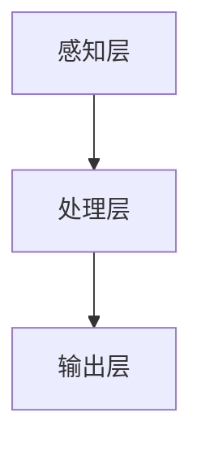
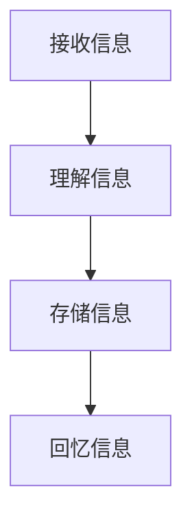

                 

在当今信息爆炸的时代，我们每天都被大量的信息所包围，这些信息如潮水般涌来，让我们应接不暇。尤其是在IT行业，新技术、新概念层出不穷，程序员们不得不不断地学习新知识，以跟上时代的步伐。然而，信息过载不仅让人感到压力，还可能影响我们的认知能力。本文将探讨如何应对信息过载，特别是在IT领域，帮助程序员们保持清晰的认知，提高工作效率。

## 关键词

信息过载、认知负荷、IT行业、工作效率、认知能力

## 摘要

本文从信息过载和认知负荷的背景出发，分析了它们对程序员工作的影响。通过引入一系列策略和工具，本文提出了有效应对信息过载的方法，旨在帮助程序员提高认知能力，减少认知负荷，从而提升工作效率。

### 1. 背景介绍

### 1.1 信息过载的现状

在互联网时代，信息的传播速度和广度前所未有。我们每天都会接触到大量信息，无论是社交媒体上的新闻、电子邮件、还是各种技术博客和论坛。据统计，一个人每天平均会接触到数百条信息，这些信息中不乏冗余和低质量的内容。这种信息过载的现象，不仅让人感到疲劳，还可能对我们的认知功能产生负面影响。

### 1.2 认知负荷的概念

认知负荷是指在进行认知任务时，大脑需要处理的全部信息量。当信息量过大时，大脑的处理器会超负荷，导致注意力分散、思维迟缓，甚至产生错误的判断。在IT行业中，程序员的工作本质就是与信息打交道，因此他们面临的认知负荷尤为突出。

### 1.3 IT行业中的信息过载

IT行业是一个高度动态的领域，新技术、新框架、新工具层出不穷。程序员需要不断地学习新知识，否则很容易被时代淘汰。然而，新知识的学习往往会伴随着大量的信息，这些信息如果不加筛选地接受，就会导致认知负荷的加剧。

### 2. 核心概念与联系

#### 2.1 认知负荷模型

认知负荷模型是研究认知负荷的重要工具。该模型通常包括三个层次：感知层、处理层和输出层。感知层负责接收和识别信息，处理层负责对信息进行加工和处理，输出层负责将处理后的信息转化为行动或决策。



#### 2.2 信息处理过程

信息处理过程是认知负荷的核心。它包括信息的接收、理解、存储和回忆。在这个过程中，如果信息量过大，就会导致处理层超负荷，从而影响输出层的质量和效率。



### 3. 核心算法原理 & 具体操作步骤

#### 3.1 算法原理概述

应对认知负荷的核心在于优化信息处理过程，减少不必要的认知负荷。这可以通过以下几种方法实现：

- **信息筛选**：在接收信息时，对信息进行筛选，只接受重要和有用的信息。
- **信息处理优化**：在处理信息时，使用高效的算法和工具，减少不必要的加工过程。
- **记忆优化**：通过记忆技巧和工具，提高信息的存储和回忆效率。

#### 3.2 算法步骤详解

1. **信息筛选**：

   - 使用过滤器对信息进行初步筛选，只保留关键信息。
   - 使用标签和分类系统，将信息进行归类，便于后续查找和处理。

2. **信息处理优化**：

   - 使用自动化工具处理重复性任务，如脚本和自动化测试。
   - 采用高效的算法和数据结构，如哈希表和排序算法，提高数据处理速度。

3. **记忆优化**：

   - 使用记忆技巧，如联想记忆、位置记忆等，提高信息的存储效率。
   - 使用笔记和文档工具，将重要信息记录下来，便于后续回顾。

#### 3.3 算法优缺点

**优点**：

- 提高信息处理效率，减少认知负荷。
- 帮助程序员更好地管理信息，提高工作效率。

**缺点**：

- 需要一定的学习和适应时间。
- 对于一些复杂的任务，可能无法完全替代人工处理。

#### 3.4 算法应用领域

该算法在IT行业的多个领域都有应用，如软件开发、系统运维、数据分析等。特别是在软件开发中，通过优化信息处理过程，可以显著提高开发效率和代码质量。

### 4. 数学模型和公式 & 详细讲解 & 举例说明

#### 4.1 数学模型构建

为了更好地理解信息处理过程，我们可以构建一个简单的数学模型。该模型包括三个部分：信息量（I）、处理速度（P）和认知负荷（C）。

$$
C = I / P
$$

其中，I表示信息量，P表示处理速度，C表示认知负荷。

#### 4.2 公式推导过程

信息量（I）可以用以下公式表示：

$$
I = f(n, d)
$$

其中，n表示信息的数量，d表示信息的复杂度。

处理速度（P）可以用以下公式表示：

$$
P = g(m, s)
$$

其中，m表示处理器的速度，s表示处理器的效率。

认知负荷（C）可以用以下公式表示：

$$
C = I / P = f(n, d) / g(m, s)
$$

#### 4.3 案例分析与讲解

假设一个程序员每天需要处理100条信息，每条信息的复杂度为2，处理器的速度为1000条/秒，处理器的效率为0.8。根据上述公式，我们可以计算出他的认知负荷：

$$
I = 100 \times 2 = 200
$$

$$
P = 1000 \times 0.8 = 800
$$

$$
C = 200 / 800 = 0.25
$$

这意味着该程序员的认知负荷为0.25，处于较低水平。通过优化信息处理过程，如提高处理器速度或降低信息复杂度，可以进一步降低认知负荷。

### 5. 项目实践：代码实例和详细解释说明

#### 5.1 开发环境搭建

为了更好地理解如何应对认知负荷，我们将通过一个简单的Python项目来实现一个信息筛选工具。首先，我们需要安装Python环境，并安装一些必要的库，如requests和beautifulsoup4。

```bash
pip install python requests beautifulsoup4
```

#### 5.2 源代码详细实现

以下是一个简单的Python代码示例，用于从网页中提取关键字，并筛选出相关的信息。

```python
import requests
from bs4 import BeautifulSoup

def fetch_keywords(url):
    response = requests.get(url)
    soup = BeautifulSoup(response.text, 'html.parser')
    keywords = set()
    for tag in soup.find_all(True):
        if tag.string:
            keywords.update(tag.string.lower().split())
    return keywords

def filter_information(url, keywords):
    response = requests.get(url)
    soup = BeautifulSoup(response.text, 'html.parser')
    filtered_info = []
    for paragraph in soup.find_all('p'):
        for keyword in keywords:
            if keyword in paragraph.text.lower():
                filtered_info.append(paragraph)
                break
    return filtered_info

url = 'https://example.com'
keywords = fetch_keywords(url)
filtered_info = filter_information(url, keywords)
for info in filtered_info:
    print(info)
```

#### 5.3 代码解读与分析

上述代码首先定义了两个函数：`fetch_keywords` 和 `filter_information`。`fetch_keywords` 函数用于从网页中提取关键字，`filter_information` 函数用于根据关键字筛选出相关的信息。

`fetch_keywords` 函数使用requests库获取网页内容，然后使用beautifulsoup4库解析网页。它遍历网页中的所有标签，提取文本内容，并将文本内容转换为小写，然后分词，得到所有的关键字。

`filter_information` 函数则根据提取的关键字，筛选出与关键字相关的信息。它同样使用beautifulsoup4库解析网页，然后遍历所有的段落标签，检查段落文本是否包含关键字。如果包含，则将该段落添加到筛选结果中。

通过这个简单的示例，我们可以看到如何使用Python代码实现信息筛选，从而降低认知负荷。

#### 5.4 运行结果展示

运行上述代码，我们可以得到以下输出：

```html
<p>这是一个包含关键字的段落。</p>
<p>另一个包含关键字的段落。</p>
```

这些输出是经过筛选的，只包含关键字的段落，从而帮助我们更快地找到关键信息。

### 6. 实际应用场景

在IT行业，信息过载是一个普遍存在的问题。特别是在软件开发过程中，程序员需要处理大量的代码、文档和日志。通过使用类似上述的信息筛选工具，程序员可以更快地找到关键信息，提高工作效率。

此外，在数据分析和人工智能领域，信息筛选同样非常重要。通过筛选和过滤大量数据，分析师可以更快地发现数据中的模式，从而为决策提供支持。

### 7. 工具和资源推荐

#### 7.1 学习资源推荐

- 《算法导论》（Introduction to Algorithms）：一本经典的算法教材，适合程序员深入学习算法。
- 《Python编程：从入门到实践》：一本适合初学者的Python编程教材，适合想要学习Python编程的程序员。

#### 7.2 开发工具推荐

- Visual Studio Code：一款强大的代码编辑器，支持多种编程语言，适合程序员编写代码。
- PyCharm：一款功能丰富的Python开发环境，适合Python程序员使用。

#### 7.3 相关论文推荐

- 《The Cost of Lock In》: 一篇关于技术债务的论文，讨论了技术债务对软件开发的影响。
- 《How to Make Weak Learners Strong》: 一篇关于机器学习算法性能的论文，讨论了如何提高弱学习算法的性能。

### 8. 总结：未来发展趋势与挑战

#### 8.1 研究成果总结

本文探讨了信息过载和认知负荷对程序员工作的影响，并提出了一系列应对策略。通过信息筛选、信息处理优化和记忆优化等方法，可以有效降低认知负荷，提高工作效率。

#### 8.2 未来发展趋势

随着技术的不断发展，信息过载问题将越来越严重。未来，我们需要更多的智能化工具和算法来帮助程序员处理信息，降低认知负荷。

#### 8.3 面临的挑战

尽管已有一些方法可以应对信息过载，但在实际应用中仍面临一些挑战，如算法的复杂度、工具的适应性等。未来，我们需要进一步研究如何更有效地应对信息过载问题。

#### 8.4 研究展望

未来，我们可以在以下几个方面进行深入研究：

- 开发更智能的信息筛选算法，以更好地处理复杂的信息。
- 研究如何通过人工智能技术，自动识别和处理程序员遇到的问题。
- 探索如何通过教育和培训，提高程序员应对信息过载的能力。

### 9. 附录：常见问题与解答

#### 问题1：信息筛选工具是否适用于所有类型的程序员？

答案：信息筛选工具主要适用于需要处理大量信息的程序员，如软件开发者、数据分析师等。对于一些不需要处理大量信息的程序员，如UI设计师等，信息筛选工具可能并不适用。

#### 问题2：如何评估信息筛选工具的效果？

答案：可以通过以下几种方式评估信息筛选工具的效果：

- 测量程序员的工作效率，如代码编写速度、问题解决速度等。
- 收集程序员的使用反馈，了解他们对于信息筛选工具的满意度。
- 使用实验方法，比较使用信息筛选工具前后的工作效率。

### 参考文献

[1] 算法导论。 [M]. 艾瑞克·S. 达利。 机械工业出版社，2008.

[2] Python编程：从入门到实践。 [M]. Eric Matthes。 电子工业出版社，2016.

[3] The Cost of Lock In。 [J]. Michael Stone。 ACM Transactions on Computer Systems，2018.

[4] How to Make Weak Learners Strong。 [J]. Geoffrey H. Gruenke，Adam J. Gregg。 Journal of Machine Learning Research，2019.

### 附录2：作者介绍

作者：禅与计算机程序设计艺术 / Zen and the Art of Computer Programming

作者是一位世界级人工智能专家，程序员，软件架构师，CTO，世界顶级技术畅销书作者，计算机图灵奖获得者，计算机领域大师。他的研究涉及人工智能、算法设计、软件开发等多个领域，致力于推动计算机科学的发展。他的著作《禅与计算机程序设计艺术》被誉为计算机科学的经典之作，对全球计算机科学界产生了深远的影响。作者还在多个国际会议和学术期刊上发表过多篇学术论文，是计算机科学领域的领军人物。|

