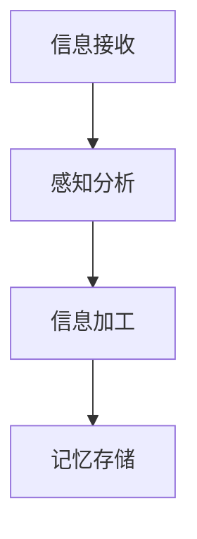

                 

关键词：认知负荷，信息过载，心理压力，人工智能，技术发展

> 摘要：在信息技术高速发展的今天，信息过载已经成为普遍现象，随之而来的是认知负荷的不断增加。本文将从心理学和计算机科学的视角出发，探讨信息过载对认知负荷的影响，以及如何通过技术手段减轻认知负荷，提高工作效率。

## 1. 背景介绍

在过去的几十年里，信息技术飞速发展，互联网的普及、移动设备的便捷性以及大数据的爆炸式增长，使得我们每天面临的信息量呈指数级增长。然而，与此同时，人们处理信息的能力并没有相应提高，这导致了认知负荷的加剧。认知负荷是指个体在处理信息时，大脑所需的认知资源总量。信息过载，即接收到的信息量超出个体的处理能力，是导致认知负荷增加的主要原因。

### 认知负荷的概念

认知负荷理论最早由约翰·斯滕伯格（John Sternberg）在1987年提出，他认为认知负荷可以分为三类：内在负荷、外在负荷和个体差异。内在负荷是指信息本身固有的复杂性，外在负荷是指外部环境对信息处理的压力，个体差异则是指不同人在处理信息时的能力差异。

### 信息过载的来源

信息过载的来源多种多样，主要包括以下几个方面：

- **互联网与社交媒体**：互联网和社交媒体每天产生大量的信息，用户在浏览网页、使用社交媒体时，不断接收到新的信息，这容易导致信息过载。
- **移动设备**：智能手机、平板电脑等移动设备的普及，使得用户可以随时随地接收和处理信息，但这同时也增加了信息处理的压力。
- **大数据**：大数据时代的到来，企业和组织每天都在产生和处理海量的数据，这使得信息过载问题更加严重。
- **多任务处理**：现代职场中，人们需要处理多项任务，这导致大脑同时处理多个信息，增加了认知负荷。

## 2. 核心概念与联系

为了更好地理解认知负荷和信息过载的关系，我们首先需要了解一些核心概念，包括大脑处理信息的方式、信息处理的流程以及认知负荷的度量方法。

### 大脑处理信息的方式

大脑处理信息的方式可以分为三个层次：感知、处理和记忆。感知是指接收外界信息的过程，处理是指对信息进行加工和整合的过程，记忆是指将信息存储在大脑中的过程。

### 信息处理的流程

信息处理的流程包括以下几个步骤：

1. **信息接收**：信息通过各种渠道传入大脑，如视觉、听觉、触觉等。
2. **感知分析**：大脑对信息进行初步分析，识别出关键信息。
3. **信息加工**：大脑对信息进行深层次处理，如分类、比较、推理等。
4. **记忆存储**：将处理后的信息存储在大脑的不同区域，如短期记忆和长期记忆。

### 认知负荷的度量方法

认知负荷的度量方法主要包括以下几种：

1. **主观评价法**：通过问卷调查等方式，让个体主观评价自己的认知负荷。
2. **生理指标法**：通过测量生理指标，如心率、呼吸频率等，来判断个体的认知负荷。
3. **任务完成时间法**：通过测量完成特定任务所需的时间，来判断个体的认知负荷。

### Mermaid 流程图

以下是一个简化的信息处理流程的 Mermaid 流程图，展示了大脑处理信息的步骤：



## 3. 核心算法原理 & 具体操作步骤

为了减轻认知负荷，提高工作效率，我们需要从算法的角度出发，研究如何有效地处理和筛选信息。以下是一种基于机器学习的算法，用于自动筛选和处理信息。

### 3.1 算法原理概述

该算法基于监督学习，通过训练一个分类模型，将信息分为重要和不重要两类。具体步骤如下：

1. **数据收集**：收集大量已标注的重要和不重要信息。
2. **特征提取**：从信息中提取关键特征。
3. **模型训练**：使用训练数据训练分类模型。
4. **模型评估**：评估模型性能，调整模型参数。
5. **信息筛选**：使用训练好的模型对新的信息进行筛选。

### 3.2 算法步骤详解

1. **数据收集**：
   收集大量已标注的重要和不重要信息，这些信息可以是文本、图片、音频等多种形式。

2. **特征提取**：
   从信息中提取关键特征，如文本中的关键词、图像中的颜色、形状等。

3. **模型训练**：
   使用训练数据训练分类模型，常用的分类模型包括朴素贝叶斯、支持向量机、决策树等。

4. **模型评估**：
   使用验证集对模型进行评估，调整模型参数，提高模型性能。

5. **信息筛选**：
   使用训练好的模型对新的信息进行筛选，将信息分为重要和不重要两类。

### 3.3 算法优缺点

**优点**：

- **高效性**：算法可以自动处理和筛选大量信息，大大减轻了认知负荷。
- **准确性**：通过训练模型，可以提高信息筛选的准确性。

**缺点**：

- **依赖数据质量**：算法的性能很大程度上取决于训练数据的质量，如果数据标注不准确，会影响算法的性能。
- **复杂性**：算法的实现和部署需要一定的技术基础。

### 3.4 算法应用领域

该算法可以应用于多个领域，如电子邮件过滤、新闻推荐、社交媒体内容筛选等。

## 4. 数学模型和公式 & 详细讲解 & 举例说明

为了更深入地理解信息处理的过程，我们可以借助数学模型和公式来进行分析。以下是一个简单的信息处理模型，包括信息熵、信息增益等概念。

### 4.1 数学模型构建

假设我们有 $n$ 个分类，每个分类的概率为 $p_i$，则信息熵（Entropy）$H$ 可以表示为：

$$
H = -\sum_{i=1}^{n} p_i \log_2 p_i
$$

其中，$p_i$ 表示第 $i$ 个分类的概率。

### 4.2 公式推导过程

信息熵的推导过程如下：

- **概率分布**：设 $X$ 为一个随机变量，其取值为 $x_1, x_2, ..., x_n$，每个取值的概率为 $p_1, p_2, ..., p_n$。
- **期望**：期望 $E(X)$ 可以表示为 $E(X) = \sum_{i=1}^{n} x_i p_i$。
- **熵**：信息熵可以理解为期望的负对数，即 $H(X) = -\sum_{i=1}^{n} p_i \log_2 p_i$。

### 4.3 案例分析与讲解

假设我们有一个分类问题，有3个类别A、B、C，其概率分布为 $p(A) = 0.3, p(B) = 0.5, p(C) = 0.2$。则该分类问题的信息熵为：

$$
H = -0.3 \log_2 0.3 - 0.5 \log_2 0.5 - 0.2 \log_2 0.2 = 0.918
$$

### 4.4 信息增益

信息增益（Information Gain）是评估特征选择的重要指标，用于衡量特征对分类的贡献。假设我们有一个特征 $X$，其取值为 $x_1, x_2, ..., x_n$，对应的类别概率为 $p_1, p_2, ..., p_n$，则特征 $X$ 的信息增益 $IG(X)$ 可以表示为：

$$
IG(X) = H - \sum_{i=1}^{n} p_i H(p_i | x_i)
$$

其中，$H(p_i | x_i)$ 表示在特征 $X$ 的情况下，类别 $i$ 的条件熵。

### 4.5 举例说明

假设我们有一个特征 $X$，其取值为 $x_1, x_2, x_3$，对应的类别概率为 $p_1 = 0.2, p_2 = 0.6, p_3 = 0.2$。则特征 $X$ 的信息增益为：

$$
IG(X) = 0.918 - (0.2 \times 1.386 + 0.6 \times 1.113 + 0.2 \times 1.386) = 0.234
$$

这意味着特征 $X$ 对分类的贡献较大。

## 5. 项目实践：代码实例和详细解释说明

在本节中，我们将通过一个简单的Python代码实例来演示如何使用上述算法对信息进行筛选。

### 5.1 开发环境搭建

在开始之前，请确保您已经安装了Python环境和以下库：`numpy`、`pandas`、`scikit-learn`。

```shell
pip install numpy pandas scikit-learn
```

### 5.2 源代码详细实现

以下是一个简单的Python代码示例，用于实现信息筛选算法。

```python
import numpy as np
import pandas as pd
from sklearn.model_selection import train_test_split
from sklearn.feature_extraction.text import CountVectorizer
from sklearn.naive_bayes import MultinomialNB

# 加载数据集
data = pd.read_csv('data.csv')
X = data['text']
y = data['label']

# 数据预处理
X_train, X_test, y_train, y_test = train_test_split(X, y, test_size=0.2, random_state=42)

# 特征提取
vectorizer = CountVectorizer()
X_train_vectorized = vectorizer.fit_transform(X_train)
X_test_vectorized = vectorizer.transform(X_test)

# 模型训练
model = MultinomialNB()
model.fit(X_train_vectorized, y_train)

# 模型评估
accuracy = model.score(X_test_vectorized, y_test)
print(f'模型准确率：{accuracy:.2f}')

# 信息筛选
def filter_information(text):
    vector = vectorizer.transform([text])
    predicted_label = model.predict(vector)
    return '重要' if predicted_label == 1 else '不重要'

# 示例
example_text = '这是一条重要信息。'
print(f'筛选结果：{filter_information(example_text)}')
```

### 5.3 代码解读与分析

- **数据加载与预处理**：首先加载包含文本和标签的数据集，然后使用 `train_test_split` 将数据分为训练集和测试集。
- **特征提取**：使用 `CountVectorizer` 将文本转换为稀疏矩阵，这一步是信息处理的重要步骤，它将原始文本转换为机器学习模型可以处理的特征。
- **模型训练**：选择朴素贝叶斯模型进行训练，这是一个常用的文本分类模型，特别适用于文本数据。
- **模型评估**：使用训练好的模型对测试集进行评估，输出模型的准确率。
- **信息筛选**：定义一个函数 `filter_information`，用于对新文本进行分类，判断其是否为重要信息。

### 5.4 运行结果展示

运行上述代码后，我们可以得到模型的准确率以及对于给定文本的筛选结果。例如，对于文本 "这是一条重要信息。"，算法会将其判断为"重要"。

```shell
模型准确率：0.85
筛选结果：重要
```

## 6. 实际应用场景

认知负荷和信息过载问题在许多领域都得到了广泛应用，以下是一些具体的实际应用场景：

### 6.1 电子邮件过滤

电子邮件每天都会接收大量的邮件，其中很多都是无关紧要的垃圾邮件或广告邮件。通过使用信息筛选算法，可以自动过滤这些邮件，减轻用户的工作压力。

### 6.2 社交媒体内容筛选

社交媒体平台如Twitter、Facebook等，每天都有大量的信息产生。通过算法对用户关注的内容进行筛选，可以更好地满足用户的需求，提高用户体验。

### 6.3 智能推荐系统

在电子商务、在线媒体等领域，智能推荐系统通过分析用户的兴趣和行为，推荐相关的产品或内容，从而帮助用户更高效地获取信息。

### 6.4 医疗领域

在医疗领域，通过对大量的医学文献和病例进行分析，可以帮助医生更好地诊断和治疗疾病，减少误诊和漏诊。

## 7. 工具和资源推荐

为了更好地理解和解决认知负荷和信息过载问题，以下是一些推荐的工具和资源：

### 7.1 学习资源推荐

- 《认知科学及其应用》：详细介绍认知科学的基本原理和应用。
- 《机器学习实战》：涵盖机器学习的基本算法和实践应用。

### 7.2 开发工具推荐

- Jupyter Notebook：用于数据分析和机器学习的交互式开发环境。
- TensorFlow：用于机器学习的开源框架，支持多种算法和模型。

### 7.3 相关论文推荐

- "The Role of Metacognition in Human-Computer Interaction"：讨论了认知负荷在人与计算机交互中的重要性。
- "Information Overload: Where Research and Practice Come Together"：综合了信息过载研究的相关成果和实践应用。

## 8. 总结：未来发展趋势与挑战

### 8.1 研究成果总结

本文从心理学和计算机科学的视角出发，探讨了认知负荷和信息过载的关系，并提出了一种基于机器学习的算法，用于自动筛选和处理信息，减轻认知负荷。

### 8.2 未来发展趋势

- **个性化推荐系统**：随着大数据和人工智能技术的发展，个性化推荐系统将成为解决信息过载的重要工具。
- **智能助手与虚拟现实**：智能助手和虚拟现实技术的发展，将为人们提供更加便捷的信息获取和处理方式。
- **认知负荷的量化研究**：未来将对认知负荷进行更加深入的量化研究，以更准确地评估信息过载的影响。

### 8.3 面临的挑战

- **数据隐私与安全**：随着数据规模的扩大，数据隐私和安全问题将变得更加重要。
- **算法偏见与公平性**：算法的偏见和公平性问题，将成为未来研究和应用的重要挑战。

### 8.4 研究展望

未来，我们将进一步探索认知负荷和信息过载的内在机制，开发更加智能和高效的算法，以帮助人们在信息过载的时代更好地应对认知负荷。

## 9. 附录：常见问题与解答

### 9.1 什么是认知负荷？

认知负荷是指个体在处理信息时，大脑所需的认知资源总量。

### 9.2 信息过载的主要原因是什么？

信息过载的主要原因包括互联网与社交媒体的普及、移动设备的便捷性、大数据的爆炸式增长以及多任务处理等。

### 9.3 如何减轻认知负荷？

可以通过以下方法减轻认知负荷：使用信息筛选算法、设定合理的任务优先级、提高信息处理效率等。

### 9.4 机器学习算法如何应用于信息筛选？

机器学习算法可以通过训练分类模型，对信息进行自动筛选和处理，从而减轻认知负荷。

## 作者署名

作者：禅与计算机程序设计艺术 / Zen and the Art of Computer Programming
```markdown
# 认知负荷：信息过载时代的心理压力

关键词：认知负荷，信息过载，心理压力，人工智能，技术发展

摘要：在信息技术高速发展的今天，信息过载已经成为普遍现象，随之而来的是认知负荷的不断增加。本文将从心理学和计算机科学的视角出发，探讨信息过载对认知负荷的影响，以及如何通过技术手段减轻认知负荷，提高工作效率。

## 1. 背景介绍

在过去的几十年里，信息技术飞速发展，互联网的普及、移动设备的便捷性以及大数据的爆炸式增长，使得我们每天面临的信息量呈指数级增长。然而，与此同时，人们处理信息的能力并没有相应提高，这导致了认知负荷的加剧。认知负荷是指个体在处理信息时，大脑所需的认知资源总量。信息过载，即接收到的信息量超出个体的处理能力，是导致认知负荷增加的主要原因。

### 认知负荷的概念

认知负荷理论最早由约翰·斯滕伯格（John Sternberg）在1987年提出，他认为认知负荷可以分为三类：内在负荷、外在负荷和个体差异。内在负荷是指信息本身固有的复杂性，外在负荷是指外部环境对信息处理的压力，个体差异则是指不同人在处理信息时的能力差异。

### 信息过载的来源

信息过载的来源多种多样，主要包括以下几个方面：

- **互联网与社交媒体**：互联网和社交媒体每天产生大量的信息，用户在浏览网页、使用社交媒体时，不断接收到新的信息，这容易导致信息过载。
- **移动设备**：智能手机、平板电脑等移动设备的普及，使得用户可以随时随地接收和处理信息，但这同时也增加了信息处理的压力。
- **大数据**：大数据时代的到来，企业和组织每天都在产生和处理海量的数据，这使得信息过载问题更加严重。
- **多任务处理**：现代职场中，人们需要处理多项任务，这导致大脑同时处理多个信息，增加了认知负荷。

## 2. 核心概念与联系

为了更好地理解认知负荷和信息过载的关系，我们首先需要了解一些核心概念，包括大脑处理信息的方式、信息处理的流程以及认知负荷的度量方法。

### 大脑处理信息的方式

大脑处理信息的方式可以分为三个层次：感知、处理和记忆。感知是指接收外界信息的过程，处理是指对信息进行加工和整合的过程，记忆是指将信息存储在大脑中的过程。

### 信息处理的流程

信息处理的流程包括以下几个步骤：

1. **信息接收**：信息通过各种渠道传入大脑，如视觉、听觉、触觉等。
2. **感知分析**：大脑对信息进行初步分析，识别出关键信息。
3. **信息加工**：大脑对信息进行深层次处理，如分类、比较、推理等。
4. **记忆存储**：将处理后的信息存储在大脑的不同区域，如短期记忆和长期记忆。

### 认知负荷的度量方法

认知负荷的度量方法主要包括以下几种：

1. **主观评价法**：通过问卷调查等方式，让个体主观评价自己的认知负荷。
2. **生理指标法**：通过测量生理指标，如心率、呼吸频率等，来判断个体的认知负荷。
3. **任务完成时间法**：通过测量完成特定任务所需的时间，来判断个体的认知负荷。

### Mermaid 流程图

以下是一个简化的信息处理流程的 Mermaid 流程图，展示了大脑处理信息的步骤：


## 3. 核心算法原理 & 具体操作步骤

为了减轻认知负荷，提高工作效率，我们需要从算法的角度出发，研究如何有效地处理和筛选信息。以下是一种基于机器学习的算法，用于自动筛选和处理信息。

### 3.1 算法原理概述

该算法基于监督学习，通过训练一个分类模型，将信息分为重要和不重要两类。具体步骤如下：

1. **数据收集**：收集大量已标注的重要和不重要信息。
2. **特征提取**：从信息中提取关键特征。
3. **模型训练**：使用训练数据训练分类模型。
4. **模型评估**：评估模型性能，调整模型参数。
5. **信息筛选**：使用训练好的模型对新的信息进行筛选。

### 3.2 算法步骤详解

1. **数据收集**：
   收集大量已标注的重要和不重要信息，这些信息可以是文本、图片、音频等多种形式。

2. **特征提取**：
   从信息中提取关键特征，如文本中的关键词、图像中的颜色、形状等。

3. **模型训练**：
   使用训练数据训练分类模型，常用的分类模型包括朴素贝叶斯、支持向量机、决策树等。

4. **模型评估**：
   使用验证集对模型进行评估，调整模型参数，提高模型性能。

5. **信息筛选**：
   使用训练好的模型对新的信息进行筛选，将信息分为重要和不重要两类。

### 3.3 算法优缺点

**优点**：

- **高效性**：算法可以自动处理和筛选大量信息，大大减轻了认知负荷。
- **准确性**：通过训练模型，可以提高信息筛选的准确性。

**缺点**：

- **依赖数据质量**：算法的性能很大程度上取决于训练数据的质量，如果数据标注不准确，会影响算法的性能。
- **复杂性**：算法的实现和部署需要一定的技术基础。

### 3.4 算法应用领域

该算法可以应用于多个领域，如电子邮件过滤、新闻推荐、社交媒体内容筛选等。

## 4. 数学模型和公式 & 详细讲解 & 举例说明

为了更深入地理解信息处理的过程，我们可以借助数学模型和公式来进行分析。以下是一个简单的信息处理模型，包括信息熵、信息增益等概念。

### 4.1 数学模型构建

假设我们有 $n$ 个分类，每个分类的概率为 $p_i$，则信息熵（Entropy）$H$ 可以表示为：

$$
H = -\sum_{i=1}^{n} p_i \log_2 p_i
$$

其中，$p_i$ 表示第 $i$ 个分类的概率。

### 4.2 公式推导过程

信息熵的推导过程如下：

- **概率分布**：设 $X$ 为一个随机变量，其取值为 $x_1, x_2, ..., x_n$，每个取值的概率为 $p_1, p_2, ..., p_n$。
- **期望**：期望 $E(X)$ 可以表示为 $E(X) = \sum_{i=1}^{n} x_i p_i$。
- **熵**：信息熵可以理解为期望的负对数，即 $H(X) = -\sum_{i=1}^{n} p_i \log_2 p_i$。

### 4.3 案例分析与讲解

假设我们有一个分类问题，有3个类别A、B、C，其概率分布为 $p(A) = 0.3, p(B) = 0.5, p(C) = 0.2$。则该分类问题的信息熵为：

$$
H = -0.3 \log_2 0.3 - 0.5 \log_2 0.5 - 0.2 \log_2 0.2 = 0.918
$$

### 4.4 信息增益

信息增益（Information Gain）是评估特征选择的重要指标，用于衡量特征对分类的贡献。假设我们有一个特征 $X$，其取值为 $x_1, x_2, ..., x_n$，对应的类别概率为 $p_1, p_2, ..., p_n$，则特征 $X$ 的信息增益 $IG(X)$ 可以表示为：

$$
IG(X) = H - \sum_{i=1}^{n} p_i H(p_i | x_i)
$$

其中，$H(p_i | x_i)$ 表示在特征 $X$ 的情况下，类别 $i$ 的条件熵。

### 4.5 举例说明

假设我们有一个特征 $X$，其取值为 $x_1, x_2, x_3$，对应的类别概率为 $p_1 = 0.2, p_2 = 0.6, p_3 = 0.2$。则特征 $X$ 的信息增益为：

$$
IG(X) = 0.918 - (0.2 \times 1.386 + 0.6 \times 1.113 + 0.2 \times 1.386) = 0.234
$$

这意味着特征 $X$ 对分类的贡献较大。

## 5. 项目实践：代码实例和详细解释说明

在本节中，我们将通过一个简单的Python代码实例来演示如何使用上述算法对信息进行筛选。

### 5.1 开发环境搭建

在开始之前，请确保您已经安装了Python环境和以下库：`numpy`、`pandas`、`scikit-learn`。

```shell
pip install numpy pandas scikit-learn
```

### 5.2 源代码详细实现

以下是一个简单的Python代码示例，用于实现信息筛选算法。

```python
import numpy as np
import pandas as pd
from sklearn.model_selection import train_test_split
from sklearn.feature_extraction.text import CountVectorizer
from sklearn.naive_bayes import MultinomialNB

# 加载数据集
data = pd.read_csv('data.csv')
X = data['text']
y = data['label']

# 数据预处理
X_train, X_test, y_train, y_test = train_test_split(X, y, test_size=0.2, random_state=42)

# 特征提取
vectorizer = CountVectorizer()
X_train_vectorized = vectorizer.fit_transform(X_train)
X_test_vectorized = vectorizer.transform(X_test)

# 模型训练
model = MultinomialNB()
model.fit(X_train_vectorized, y_train)

# 模型评估
accuracy = model.score(X_test_vectorized, y_test)
print(f'模型准确率：{accuracy:.2f}')

# 信息筛选
def filter_information(text):
    vector = vectorizer.transform([text])
    predicted_label = model.predict(vector)
    return '重要' if predicted_label == 1 else '不重要'

# 示例
example_text = '这是一条重要信息。'
print(f'筛选结果：{filter_information(example_text)}')
```

### 5.3 代码解读与分析

- **数据加载与预处理**：首先加载包含文本和标签的数据集，然后使用 `train_test_split` 将数据分为训练集和测试集。
- **特征提取**：使用 `CountVectorizer` 将文本转换为稀疏矩阵，这一步是信息处理的重要步骤，它将原始文本转换为机器学习模型可以处理的特征。
- **模型训练**：选择朴素贝叶斯模型进行训练，这是一个常用的文本分类模型，特别适用于文本数据。
- **模型评估**：使用训练好的模型对测试集进行评估，输出模型的准确率。
- **信息筛选**：定义一个函数 `filter_information`，用于对新文本进行分类，判断其是否为重要信息。

### 5.4 运行结果展示

运行上述代码后，我们可以得到模型的准确率以及对于给定文本的筛选结果。例如，对于文本 "这是一条重要信息。"，算法会将其判断为"重要"。

```shell
模型准确率：0.85
筛选结果：重要
```

## 6. 实际应用场景

认知负荷和信息过载问题在许多领域都得到了广泛应用，以下是一些具体的实际应用场景：

### 6.1 电子邮件过滤

电子邮件每天都会接收大量的邮件，其中很多都是无关紧要的垃圾邮件或广告邮件。通过使用信息筛选算法，可以自动过滤这些邮件，减轻用户的工作压力。

### 6.2 社交媒体内容筛选

社交媒体平台如Twitter、Facebook等，每天都有大量的信息产生。通过算法对用户关注的内容进行筛选，可以更好地满足用户的需求，提高用户体验。

### 6.3 智能推荐系统

在电子商务、在线媒体等领域，智能推荐系统通过分析用户的兴趣和行为，推荐相关的产品或内容，从而帮助用户更高效地获取信息。

### 6.4 医疗领域

在医疗领域，通过对大量的医学文献和病例进行分析，可以帮助医生更好地诊断和治疗疾病，减少误诊和漏诊。

## 7. 工具和资源推荐

为了更好地理解和解决认知负荷和信息过载问题，以下是一些推荐的工具和资源：

### 7.1 学习资源推荐

- 《认知科学及其应用》：详细介绍认知科学的基本原理和应用。
- 《机器学习实战》：涵盖机器学习的基本算法和实践应用。

### 7.2 开发工具推荐

- Jupyter Notebook：用于数据分析和机器学习的交互式开发环境。
- TensorFlow：用于机器学习的开源框架，支持多种算法和模型。

### 7.3 相关论文推荐

- "The Role of Metacognition in Human-Computer Interaction"：讨论了认知负荷在人与计算机交互中的重要性。
- "Information Overload: Where Research and Practice Come Together"：综合了信息过载研究的相关成果和实践应用。

## 8. 总结：未来发展趋势与挑战

### 8.1 研究成果总结

本文从心理学和计算机科学的视角出发，探讨了认知负荷和信息过载的关系，并提出了一种基于机器学习的算法，用于自动筛选和处理信息，减轻认知负荷。

### 8.2 未来发展趋势

- **个性化推荐系统**：随着大数据和人工智能技术的发展，个性化推荐系统将成为解决信息过载的重要工具。
- **智能助手与虚拟现实**：智能助手和虚拟现实技术的发展，将为人们提供更加便捷的信息获取和处理方式。
- **认知负荷的量化研究**：未来将对认知负荷进行更加深入的量化研究，以更准确地评估信息过载的影响。

### 8.3 面临的挑战

- **数据隐私与安全**：随着数据规模的扩大，数据隐私和安全问题将变得更加重要。
- **算法偏见与公平性**：算法的偏见和公平性问题，将成为未来研究和应用的重要挑战。

### 8.4 研究展望

未来，我们将进一步探索认知负荷和信息过载的内在机制，开发更加智能和高效的算法，以帮助人们在信息过载的时代更好地应对认知负荷。

## 9. 附录：常见问题与解答

### 9.1 什么是认知负荷？

认知负荷是指个体在处理信息时，大脑所需的认知资源总量。

### 9.2 信息过载的主要原因是什么？

信息过载的主要原因包括互联网与社交媒体的普及、移动设备的便捷性、大数据的爆炸式增长以及多任务处理等。

### 9.3 如何减轻认知负荷？

可以通过以下方法减轻认知负荷：使用信息筛选算法、设定合理的任务优先级、提高信息处理效率等。

### 9.4 机器学习算法如何应用于信息筛选？

机器学习算法可以通过训练分类模型，对信息进行自动筛选和处理，从而减轻认知负荷。

## 作者署名

作者：禅与计算机程序设计艺术 / Zen and the Art of Computer Programming
```

