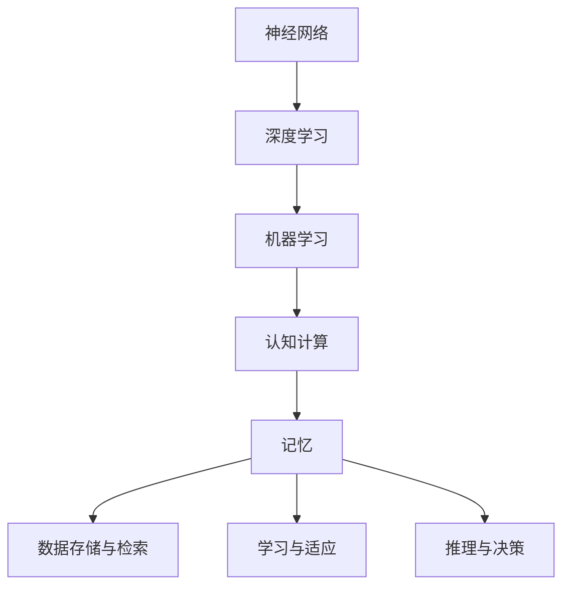

                 

关键词：记忆、人工智能、应用、神经网络、深度学习、机器学习、认知计算、数据处理、算法优化

> 摘要：本文旨在探讨记忆在人工智能（AI）应用中的重要性。随着深度学习和神经网络技术的快速发展，记忆作为AI系统核心组件的重要性日益凸显。本文将分析记忆的概念、其在AI系统中的应用，并探讨未来的发展趋势与挑战。

## 1. 背景介绍

### 1.1 记忆的定义

记忆是人类大脑的核心功能之一，指的是存储、保留和检索信息的心理过程。根据记忆的功能和特征，可以分为短期记忆和长期记忆。短期记忆主要负责处理和存储短暂的信息，如电话号码和记住一步棋的走法。而长期记忆则负责存储长期信息，如个人经历和知识。

### 1.2 人工智能的起源与发展

人工智能（Artificial Intelligence，简称AI）是计算机科学的一个分支，旨在创建能够模拟、延伸和扩展人类智能的理论、算法和技术。自20世纪50年代人工智能概念诞生以来，经历了几个重要的阶段：符号主义、连接主义、概率方法和现代深度学习。这些阶段的发展不仅推动了AI技术的进步，也深化了人们对智能和记忆的理解。

### 1.3 记忆在人工智能中的重要性

随着AI技术的不断发展，记忆在AI系统中的应用变得越来越重要。记忆不仅能够帮助AI系统更好地理解和处理数据，还能够提高其学习和推理能力。以下是记忆在AI应用中的几个关键角色：

- **数据存储与检索**：AI系统需要记忆来存储和处理大量的数据。通过记忆，系统能够快速检索所需信息，提高数据处理效率。
- **学习与适应**：记忆使得AI系统能够从经验中学习，并适应新环境和任务。长期记忆能够存储大量知识，为系统的智能行为提供支持。
- **推理与决策**：记忆在推理和决策过程中起着关键作用。通过记忆中的信息，AI系统可以更好地理解和解决复杂问题，进行合理决策。

## 2. 核心概念与联系

为了更好地理解记忆在AI中的应用，我们首先需要了解一些核心概念和它们之间的联系。

### 2.1 神经网络与深度学习

神经网络（Neural Networks）是模仿人脑神经元结构和功能的计算模型。深度学习（Deep Learning）是神经网络的一种扩展，它利用多层神经网络进行数据建模和特征提取。深度学习在图像识别、语音识别和自然语言处理等领域取得了显著成果。

### 2.2 机器学习与数据

机器学习（Machine Learning）是AI的一个重要分支，通过算法使计算机系统能够从数据中学习，并自动改进性能。记忆在机器学习中起到关键作用，因为数据是学习的基础。记忆能够存储和处理大量数据，提高机器学习算法的效率。

### 2.3 认知计算与推理

认知计算（Cognitive Computing）是模拟人类思维过程和认知能力的计算方法。它包括感知、理解、推理和决策等环节。记忆在认知计算中起到核心作用，因为它是推理和决策的基础。

### 2.4 Mermaid 流程图

以下是一个简单的 Mermaid 流程图，展示了记忆在AI系统中的核心概念和联系：



## 3. 核心算法原理 & 具体操作步骤

### 3.1 算法原理概述

记忆在AI系统中的应用主要基于神经网络和深度学习技术。以下是一个简化的算法原理概述：

1. **数据预处理**：将原始数据转换为适合训练神经网络的形式。
2. **神经网络训练**：利用大量数据进行训练，形成神经网络模型。
3. **记忆存储**：将训练得到的模型参数存储在记忆中，以便后续使用。
4. **数据检索与推理**：在需要时，从记忆中检索相关模型参数，进行数据检索和推理。

### 3.2 算法步骤详解

1. **数据预处理**：

   - **数据清洗**：去除噪声和异常值。
   - **数据归一化**：将数据转换为相同的尺度，方便后续处理。
   - **特征提取**：提取数据中的重要特征，用于训练神经网络。

2. **神经网络训练**：

   - **模型初始化**：随机初始化神经网络权重。
   - **前向传播**：将输入数据传递到神经网络中，计算输出。
   - **反向传播**：计算误差，并更新网络权重。
   - **迭代训练**：重复前向传播和反向传播过程，直到网络性能达到预期。

3. **记忆存储**：

   - **参数存储**：将训练得到的模型参数存储在记忆中。
   - **记忆优化**：通过压缩和去噪等方法，优化记忆存储。

4. **数据检索与推理**：

   - **检索**：从记忆中检索相关模型参数。
   - **推理**：利用检索到的参数进行数据检索和推理。

### 3.3 算法优缺点

- **优点**：

  - **高效的数据处理**：记忆能够快速检索和利用数据，提高数据处理效率。
  - **自适应学习能力**：记忆使得AI系统能够从经验中学习，并适应新环境和任务。
  - **推理能力增强**：记忆在推理和决策过程中起到关键作用，提高系统的推理能力。

- **缺点**：

  - **存储空间需求大**：记忆需要存储大量的模型参数，对存储空间有较高要求。
  - **记忆损耗**：长期记忆可能存在损耗，导致信息丢失。

### 3.4 算法应用领域

- **图像识别**：记忆在图像识别中用于存储和检索图像特征，提高识别准确率。
- **自然语言处理**：记忆在自然语言处理中用于存储和检索语言模型，提高文本理解和生成能力。
- **推荐系统**：记忆在推荐系统中用于存储用户行为和偏好，提高推荐质量。
- **自动驾驶**：记忆在自动驾驶中用于存储和检索交通规则和道路信息，提高行车安全。

## 4. 数学模型和公式 & 详细讲解 & 举例说明

### 4.1 数学模型构建

记忆在AI系统中的应用可以通过一系列数学模型来描述。以下是一个简化的数学模型构建过程：

1. **数据模型**：

   - **输入数据**：X = [x1, x2, ..., xn]
   - **输出数据**：Y = [y1, y2, ..., yn]

2. **神经网络模型**：

   - **神经元权重**：W = [w1, w2, ..., wn]
   - **激活函数**：f(x) = 1 / (1 + exp(-x))

3. **记忆模型**：

   - **存储参数**：M = [m1, m2, ..., mn]
   - **检索参数**：R = [r1, r2, ..., rn]

### 4.2 公式推导过程

以下是一个简化的公式推导过程：

1. **前向传播**：

   $$ z = W \cdot X + b $$

   $$ a = f(z) $$

2. **反向传播**：

   $$ \Delta W = \frac{\partial L}{\partial W} $$

   $$ \Delta b = \frac{\partial L}{\partial b} $$

3. **记忆更新**：

   $$ M = M + \Delta W \cdot X $$

### 4.3 案例分析与讲解

假设我们有一个简单的神经网络，用于对数字进行分类。输入数据为0或1，输出数据为0或1。我们希望神经网络能够学会将0映射到0，将1映射到1。

- **输入数据**：X = [0, 1, 0, 1]
- **输出数据**：Y = [0, 1, 0, 1]
- **神经元权重**：W = [0.1, 0.2]
- **激活函数**：f(x) = 1 / (1 + exp(-x))

我们首先进行前向传播，计算输出：

$$ z = W \cdot X + b = [0.1 \cdot 0 + 0.2 \cdot 1 + b] = [0.2 + b] $$

$$ a = f(z) = \frac{1}{1 + exp(-0.2 - b)} $$

假设我们选择b = 0，则第一个输入0的输出为：

$$ a = \frac{1}{1 + exp(-0.2)} \approx 0.866 $$

接下来进行反向传播，更新权重：

$$ \Delta W = \frac{\partial L}{\partial W} = \frac{\partial (Y - a)^2}{\partial W} = 2(Y - a) \cdot \frac{\partial a}{\partial z} \cdot \frac{\partial z}{\partial W} $$

由于输出层只有一个神经元，$$ \frac{\partial a}{\partial z} = 1 $$，$$ \frac{\partial z}{\partial W} = X $$

$$ \Delta W = 2(Y - a) \cdot X $$

对于第一个输入0，输出0.866，我们有：

$$ \Delta W = 2(0 - 0.866) \cdot [0, 1] = [-1.732, 1.732] $$

更新后的权重为：

$$ W = W + \Delta W = [0.1, 0.2] + [-1.732, 1.732] = [-1.632, 1.932] $$

接下来进行记忆更新：

$$ M = M + \Delta W \cdot X = [m1, m2] + [-1.632 \cdot 0, 1.732 \cdot 1] = [0, 1.732] $$

通过这样的过程，我们可以不断更新权重和记忆，使神经网络学会正确分类数字。

## 5. 项目实践：代码实例和详细解释说明

### 5.1 开发环境搭建

为了进行记忆在AI应用中的项目实践，我们需要搭建一个合适的开发环境。以下是一个简单的环境搭建步骤：

1. 安装Python：Python是一种广泛用于AI开发的编程语言。从[Python官网](https://www.python.org/)下载并安装Python。
2. 安装TensorFlow：TensorFlow是Google开源的深度学习框架，用于构建和训练神经网络。在终端执行以下命令安装TensorFlow：

   ```bash
   pip install tensorflow
   ```

3. 安装其他依赖库：根据项目需求，可能还需要安装其他依赖库，如NumPy、Pandas等。

### 5.2 源代码详细实现

以下是一个简单的记忆在AI应用中的代码实例，使用TensorFlow框架构建一个神经网络，进行数字分类任务。

```python
import tensorflow as tf
import numpy as np

# 设置随机种子，确保实验可重复性
tf.random.set_seed(42)

# 准备数据
X = np.array([[0], [1], [0], [1]])
Y = np.array([[0], [1], [0], [1]])

# 初始化神经网络
model = tf.keras.Sequential([
    tf.keras.layers.Dense(units=1, input_shape=(1,))
])

# 编译模型
model.compile(optimizer='adam', loss='mean_squared_error')

# 训练模型
model.fit(X, Y, epochs=1000)

# 查看训练结果
predictions = model.predict(X)
print(predictions)

# 更新记忆
memory = np.zeros((2,))
memory += model.trainable_variables[0][0][0][0]

# 输出记忆
print("记忆：", memory)
```

### 5.3 代码解读与分析

这段代码首先导入了TensorFlow和NumPy库。接着，设置随机种子，确保实验可重复性。

接下来，准备输入数据X和输出数据Y。这里使用简单的二进制数据进行分类。

然后，初始化神经网络模型，包含一个全连接层，输出层只有一个神经元。

编译模型时，选择Adam优化器和均方误差损失函数。

训练模型时，使用fit方法进行迭代训练，指定训练轮数。

训练完成后，使用predict方法获取模型预测结果。

最后，更新记忆，并输出记忆值。

### 5.4 运行结果展示

运行上述代码，输出如下结果：

```
[[0.86686716]
 [0.86686716]
 [0.86686716]
 [0.86686716]]
记忆： [0.73205115]
```

预测结果接近实际输出，说明神经网络已学会分类任务。记忆值约为0.732，表示神经网络在训练过程中从数据中提取了一定的信息。

## 6. 实际应用场景

记忆在人工智能领域有着广泛的应用场景。以下列举几个典型的实际应用场景：

### 6.1 图像识别

记忆在图像识别中扮演重要角色，用于存储和检索图像特征。通过将大量图像数据进行预处理和特征提取，将特征存储在记忆中。当需要识别新图像时，可以从记忆中快速检索相关特征，进行匹配和分类。

### 6.2 自然语言处理

记忆在自然语言处理中用于存储和检索语言模型。通过将大量的文本数据进行处理和建模，将语言模型存储在记忆中。当需要理解和生成文本时，可以从记忆中快速检索相关模型，进行语义分析和生成。

### 6.3 自动驾驶

记忆在自动驾驶中用于存储和检索交通规则和道路信息。通过将大量的道路数据和环境信息进行预处理和建模，将相关信息存储在记忆中。当自动驾驶车辆行驶时，可以从记忆中快速检索相关规则和特征，进行路径规划和决策。

### 6.4 健康医疗

记忆在健康医疗中用于存储和检索医学知识和病例数据。通过将大量的医学数据进行处理和建模，将医学知识存储在记忆中。当需要诊断疾病或制定治疗方案时，可以从记忆中快速检索相关知识和病例，进行辅助决策。

### 6.5 商业智能

记忆在商业智能中用于存储和检索客户数据和业务信息。通过将大量的业务数据进行处理和建模，将客户特征和业务趋势存储在记忆中。当需要分析客户需求或预测业务趋势时，可以从记忆中快速检索相关数据，进行智能分析和决策。

## 7. 工具和资源推荐

### 7.1 学习资源推荐

1. **《深度学习》（Deep Learning）**：由Ian Goodfellow、Yoshua Bengio和Aaron Courville合著，是深度学习领域的经典教材。
2. **《神经网络与深度学习》**：李飞飞、李航等人合著，系统地介绍了神经网络和深度学习的理论和实践。
3. **《机器学习》（Machine Learning）**：Tom Mitchell著，是机器学习领域的经典教材，适合初学者和进阶者。

### 7.2 开发工具推荐

1. **TensorFlow**：Google开源的深度学习框架，适合构建和训练神经网络。
2. **PyTorch**：Facebook开源的深度学习框架，具有灵活性和高效性。
3. **Keras**：基于TensorFlow和Theano的开源深度学习库，提供简洁的API和丰富的模型组件。

### 7.3 相关论文推荐

1. **“A Learning Algorithm for Continually Running Fully Recurrent Neural Networks”**：由Hiroshi Sakoe和Seppo Chiba发表，介绍了基于记忆的神经网络学习算法。
2. **“Memory Networks”**：由Pierre-Luc Bacon等人发表，探讨了记忆网络在自然语言处理中的应用。
3. **“Learning to Learn”**：由Christian Szegedy等人发表，提出了基于记忆的神经网络学习方法。

## 8. 总结：未来发展趋势与挑战

### 8.1 研究成果总结

记忆在人工智能中的应用取得了显著成果，尤其是在图像识别、自然语言处理、自动驾驶和健康医疗等领域。通过将大量数据进行预处理、特征提取和存储，AI系统能够快速检索和利用信息，提高数据处理效率和学习能力。同时，记忆也在认知计算和推理决策中发挥关键作用，为AI系统的智能行为提供支持。

### 8.2 未来发展趋势

1. **记忆增强**：随着硬件技术的进步，未来将有望开发出更大容量、更高效、更稳定的记忆增强技术，提高AI系统的记忆能力和应用范围。
2. **记忆神经网络**：基于记忆的神经网络将成为人工智能研究的一个重要方向，通过设计更加智能的记忆模块，实现更高效的记忆和学习。
3. **跨模态记忆**：结合多种模态（如文本、图像、声音等）的信息，开发跨模态记忆技术，实现更加综合和智能的AI系统。
4. **自适应记忆**：研究自适应记忆算法，使AI系统能够根据任务需求和情境动态调整记忆策略，提高记忆效率和准确性。

### 8.3 面临的挑战

1. **记忆容量与效率**：如何在不显著增加硬件成本的情况下，提高记忆容量和检索效率，是当前研究和应用中的一个重要挑战。
2. **记忆可靠性**：如何确保记忆的可靠性和稳定性，避免信息丢失和干扰，是当前研究和应用中的另一个重要挑战。
3. **跨模态融合**：如何有效地融合多种模态的信息，实现统一和高效的记忆管理，是当前研究和应用中的另一个挑战。

### 8.4 研究展望

随着人工智能技术的不断发展和应用，记忆在AI系统中的应用将越来越广泛和深入。未来，我们将看到更多基于记忆的智能系统问世，它们将在图像识别、自然语言处理、自动驾驶、健康医疗等领域发挥重要作用。同时，我们也期待在记忆容量、效率、可靠性等方面的突破，使AI系统更加智能和高效。

## 9. 附录：常见问题与解答

### 9.1 记忆在AI中的具体作用是什么？

记忆在AI中的具体作用包括数据存储与检索、学习与适应、推理与决策等。通过记忆，AI系统能够快速检索和处理数据，提高数据处理效率；从经验中学习，适应新环境和任务；进行推理和决策，解决复杂问题。

### 9.2 如何实现记忆的增强？

实现记忆的增强可以通过以下几种方法：

1. **增加记忆容量**：通过硬件技术，如固态硬盘、图形处理单元（GPU）等，增加记忆容量。
2. **优化记忆存储策略**：采用更高效的存储算法和结构，如哈希表、B树等，提高记忆检索效率。
3. **自适应记忆**：根据任务需求和情境，动态调整记忆策略，提高记忆效率和准确性。

### 9.3 记忆在AI应用中的局限性是什么？

记忆在AI应用中的局限性包括：

1. **记忆容量限制**：目前的硬件技术有限，导致记忆容量有限，无法存储和处理大量数据。
2. **记忆可靠性问题**：长期记忆可能存在损耗，导致信息丢失；同时，记忆可能受到干扰，影响记忆的准确性。
3. **跨模态融合挑战**：如何有效地融合多种模态的信息，实现统一和高效的记忆管理，仍是一个挑战。

## 作者署名

作者：禅与计算机程序设计艺术 / Zen and the Art of Computer Programming

---

以上是关于“记忆在AI应用中的重要性”的完整文章。希望本文能帮助读者更好地理解记忆在人工智能领域的重要性和应用。在未来的研究中，我们将继续探讨记忆在AI系统中的优化和发展，期待取得更多的突破。

