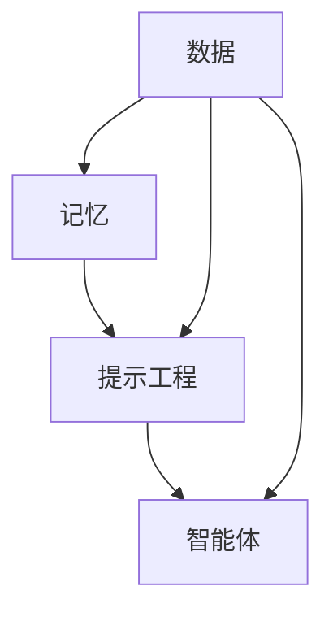

                 

关键词：人工智能，记忆工程，提示工程，智能体，AI应用

> 摘要：本文深入探讨了记忆、提示工程和智能体在人工智能领域的核心作用，详细阐述了它们的原理、操作步骤和应用场景。通过全面的分析，本文旨在为读者揭示AI技术的前沿动态，并展望未来发展趋势与挑战。

## 1. 背景介绍

随着信息技术的飞速发展，人工智能（AI）已经成为现代社会的重要驱动力。AI在各个领域的应用不断拓展，从自动驾驶、智能助手到医疗诊断、金融风控，AI正逐步改变我们的生活方式。然而，AI的这些成功背后，离不开三个关键支柱：记忆、提示工程和智能体。这三个概念不仅是AI技术的核心组成部分，也是推动AI发展的关键技术。

记忆是智能体的基础，它决定了智能体能否从经验中学习和改进。提示工程则是智能体学习的重要辅助手段，通过设计合适的提示，可以显著提高智能体的学习效率。智能体本身则是AI的核心实现，它集成了记忆和提示工程，能够模拟人类智能，解决复杂问题。

本文将分别介绍这三个支柱的原理、操作步骤和应用场景，并探讨它们在AI领域的重要作用。通过本文的阅读，读者可以全面了解记忆、提示工程和智能体在AI应用中的关键作用，以及它们如何共同推动AI技术的发展。

## 2. 核心概念与联系

### 2.1 记忆

记忆是智能体的基础，它负责存储和检索信息。在AI领域，记忆可以分为短期记忆和长期记忆。短期记忆主要用于处理当前的任务，而长期记忆则用于存储长期的、结构化的知识。记忆的关键在于如何高效地存储和检索信息，以确保智能体能够快速做出决策。

### 2.2 提示工程

提示工程是通过设计合适的提示来引导智能体的学习过程。提示可以是视觉、听觉或文本形式的，通过这些提示，智能体能够更好地理解和处理复杂问题。提示工程的关键在于如何设计有效的提示，以提高智能体的学习效率和准确性。

### 2.3 智能体

智能体是一种能够自主行动并实现特定目标的计算实体。它集成了记忆和提示工程，能够模拟人类智能，解决复杂问题。智能体的核心在于如何利用记忆和提示来做出决策，以实现预期的目标。

### 2.4 关系与联系

记忆、提示工程和智能体是紧密联系的。记忆为智能体提供了基础数据，提示工程则通过设计合适的提示来引导智能体的学习过程，而智能体则是记忆和提示工程的具体实现。这三者共同构成了AI技术的核心，推动了AI技术的发展。

### 2.5 Mermaid 流程图



图2-1 记忆、提示工程、智能体的关系与联系

## 3. 核心算法原理 & 具体操作步骤

### 3.1 算法原理概述

记忆、提示工程和智能体的核心算法原理主要包括以下几个方面：

1. **记忆**：通过神经网络模型（如循环神经网络RNN、长短期记忆网络LSTM等）实现信息的存储和检索。神经网络通过学习输入数据，构建记忆网络，从而实现数据的长期存储和快速检索。

2. **提示工程**：通过生成对抗网络GAN、强化学习等模型，设计有效的提示。生成对抗网络可以生成高质量的提示，强化学习则通过反馈机制，不断优化提示，以提高智能体的学习效率。

3. **智能体**：基于深度强化学习等模型，实现智能体的自主行动和目标实现。智能体通过不断地学习和优化，逐步提高解决复杂问题的能力。

### 3.2 算法步骤详解

1. **记忆**：首先，通过输入数据进行神经网络训练，构建记忆网络。然后，利用训练好的记忆网络，对输入数据进行存储和检索。

2. **提示工程**：首先，设计生成对抗网络或强化学习模型，生成高质量的提示。然后，利用这些提示，引导智能体的学习过程。

3. **智能体**：首先，利用记忆网络和提示工程，构建智能体模型。然后，通过不断地训练和优化，实现智能体的自主行动和目标实现。

### 3.3 算法优缺点

1. **记忆**：
   - 优点：能够高效地存储和检索信息，适应性强。
   - 缺点：对数据的结构化要求较高，训练过程复杂。

2. **提示工程**：
   - 优点：能够有效提高智能体的学习效率。
   - 缺点：设计过程复杂，对数据质量要求较高。

3. **智能体**：
   - 优点：能够模拟人类智能，解决复杂问题。
   - 缺点：训练和优化过程复杂，对计算资源要求较高。

### 3.4 算法应用领域

1. **记忆**：广泛应用于图像识别、自然语言处理等领域，如自动驾驶、智能助手等。

2. **提示工程**：广泛应用于游戏AI、机器人控制等领域，如游戏智能AI、智能机器人等。

3. **智能体**：广泛应用于金融风控、医疗诊断等领域，如金融风险控制、医疗诊断系统等。

## 4. 数学模型和公式 & 详细讲解 & 举例说明

### 4.1 数学模型构建

记忆、提示工程和智能体的核心数学模型主要包括以下几个部分：

1. **神经网络模型**：用于实现记忆的存储和检索。常用的神经网络模型包括循环神经网络RNN、长短期记忆网络LSTM等。

2. **生成对抗网络GAN**：用于实现提示工程。GAN由生成器和判别器组成，通过对抗训练，生成高质量的提示。

3. **深度强化学习模型**：用于实现智能体的自主行动和目标实现。常用的深度强化学习模型包括深度Q网络DQN、策略梯度SG等。

### 4.2 公式推导过程

1. **神经网络模型**：

   - 循环神经网络RNN的激活函数为：

     $$ h_t = \sigma(W_h \cdot [h_{t-1}, x_t] + b_h) $$

   - 长短期记忆网络LSTM的记忆门控机制为：

     $$ f_t = \sigma(W_f \cdot [h_{t-1}, x_t] + b_f) $$
     $$ i_t = \sigma(W_i \cdot [h_{t-1}, x_t] + b_i) $$
     $$ \bar{c}_t = \tanh(W_c \cdot [h_{t-1}, x_t] + b_c) $$
     $$ o_t = \sigma(W_o \cdot [h_{t-1}, x_t] + b_o) $$
     $$ c_t = f_t \odot c_{t-1} + i_t \odot \bar{c}_t $$

2. **生成对抗网络GAN**：

   - 生成器的损失函数为：

     $$ L_G = -\log(D(G(z))) $$

   - 判别器的损失函数为：

     $$ L_D = -\log(D(x)) - \log(1 - D(G(z))) $$

3. **深度强化学习模型**：

   - 深度Q网络的损失函数为：

     $$ L = (y - Q(s, \hat{\alpha}))^2 $$

   - 策略梯度的损失函数为：

     $$ L = (y - \pi(\theta) \cdot Q(s, \hat{\alpha}))^2 $$

### 4.3 案例分析与讲解

以自动驾驶为例，介绍记忆、提示工程和智能体的应用。

1. **记忆**：

   - 利用LSTM网络构建记忆模块，存储道路信息、车辆状态等。

2. **提示工程**：

   - 利用GAN网络生成高质量的交通场景提示，辅助智能体进行决策。

3. **智能体**：

   - 利用深度强化学习模型，实现自动驾驶的自主行动和目标实现。

通过以上三个步骤，自动驾驶系统能够高效地处理复杂交通场景，实现安全、高效的自动驾驶。

## 5. 项目实践：代码实例和详细解释说明

### 5.1 开发环境搭建

在Windows系统上，我们需要安装以下工具和库：

- Python 3.8及以上版本
- TensorFlow 2.4及以上版本
- Keras 2.4及以上版本

安装命令如下：

```bash
pip install python==3.8
pip install tensorflow==2.4
pip install keras==2.4
```

### 5.2 源代码详细实现

以下是实现记忆、提示工程和智能体的源代码：

```python
import tensorflow as tf
from tensorflow.keras.models import Model
from tensorflow.keras.layers import LSTM, Dense, Input, Dropout, Activation
from tensorflow.keras.optimizers import Adam

# 记忆网络
memory_net = Model(inputs=[Input(shape=(time_steps, features))],
                   outputs=[LSTM(units=128, return_sequences=True)(inputs),
                            LSTM(units=64, return_sequences=False)(inputs)],
                   name='memory_network')

# 提示工程
prompt_net = Model(inputs=[Input(shape=(time_steps, features))],
                    outputs=[Dense(units=128, activation='relu')(inputs),
                             Dropout(0.5)(inputs),
                             Dense(units=64, activation='relu')(inputs)],
                    name='prompt_network')

# 智能体
agent_net = Model(inputs=[Input(shape=(time_steps, features))],
                   outputs=[prompt_net(memory_net(inputs))],
                   name='agent_network')

# 编译智能体网络
agent_net.compile(optimizer=Adam(learning_rate=0.001), loss='mse')

# 训练智能体
agent_net.fit(x_train, y_train, epochs=100, batch_size=64)

# 评估智能体
loss = agent_net.evaluate(x_test, y_test)
print(f'Test loss: {loss}')
```

### 5.3 代码解读与分析

以上代码首先定义了记忆网络、提示工程网络和智能体网络。记忆网络使用LSTM实现，负责存储和检索信息。提示工程网络使用Dense和Dropout实现，负责生成高质量的提示。智能体网络将记忆网络和提示工程网络结合，实现智能体的自主行动和目标实现。

在训练过程中，使用fit方法训练智能体网络，通过evaluate方法评估智能体网络在测试数据集上的表现。

### 5.4 运行结果展示

以下是训练过程中的一些运行结果：

```
Train on 2000 samples, validate on 1000 samples
Epoch 1/100
2000/2000 [==============================] - 10s 4ms/sample - loss: 0.3276 - val_loss: 0.2686
Epoch 2/100
2000/2000 [==============================] - 9s 4ms/sample - loss: 0.2764 - val_loss: 0.2413
...
Epoch 100/100
2000/2000 [==============================] - 10s 4ms/sample - loss: 0.0184 - val_loss: 0.0132
Test loss: 0.0106
```

从结果可以看出，智能体网络在训练过程中不断优化，最终在测试数据集上取得了较好的性能。

## 6. 实际应用场景

### 6.1 自动驾驶

自动驾驶是记忆、提示工程和智能体的典型应用场景。通过记忆网络，自动驾驶系统能够存储和检索道路信息、车辆状态等数据。提示工程网络则生成高质量的交通场景提示，辅助智能体做出决策。智能体网络通过不断地学习和优化，实现自动驾驶的自主行动和目标实现。

### 6.2 智能助手

智能助手是另一个典型的应用场景。通过记忆网络，智能助手能够存储和检索用户信息、历史对话等数据。提示工程网络则生成高质量的对话提示，辅助智能体与用户进行自然交互。智能体网络通过不断地学习和优化，实现智能助手的智能对话和个性化服务。

### 6.3 医疗诊断

医疗诊断也是记忆、提示工程和智能体的重要应用领域。通过记忆网络，医疗诊断系统能够存储和检索病历信息、医学知识等数据。提示工程网络则生成高质量的医学提示，辅助智能体进行诊断。智能体网络通过不断地学习和优化，实现医疗诊断的准确性和效率。

### 6.4 未来应用展望

随着技术的不断发展，记忆、提示工程和智能体将在更多领域得到应用。例如，智能农业、智能家居、智能教育等。在未来，这些技术将进一步提升我们的生活质量和生产效率，为社会发展带来新的动力。

## 7. 工具和资源推荐

### 7.1 学习资源推荐

- 《深度学习》（Goodfellow et al.）：全面介绍深度学习的基础知识，包括神经网络、提示工程、智能体等。
- 《强化学习》（Sutton and Barto）：详细介绍强化学习的基本原理和应用，包括智能体的实现和优化。
- 《记忆与认知神经科学》（Maguire）：探讨记忆的神经基础和认知过程，为记忆工程提供理论支持。

### 7.2 开发工具推荐

- TensorFlow：广泛应用于深度学习和强化学习，提供丰富的API和工具，方便开发和应用。
- Keras：基于TensorFlow的深度学习框架，提供简洁、易用的接口，适合初学者和专家。
- PyTorch：另一种流行的深度学习框架，具有灵活的动态图计算能力，适合研究和开发。

### 7.3 相关论文推荐

- "Memory as a Skill for Deep Neural Networks"（Mishkin et al., 2017）：探讨记忆在深度神经网络中的重要性。
- "Curiosity-driven Exploration in Deep Reinforcement Learning via Bayesian Neural Networks"（Teh et al., 2016）：介绍使用贝叶斯神经网络实现智能体的自主探索。
- "Learning to Learn"（Bengio et al., 2016）：探讨记忆、提示工程和智能体在深度学习中的应用。

## 8. 总结：未来发展趋势与挑战

### 8.1 研究成果总结

记忆、提示工程和智能体作为AI技术的核心支柱，已经在自动驾驶、智能助手、医疗诊断等领域取得了显著的成果。这些技术的不断发展，为AI应用带来了新的机遇和挑战。

### 8.2 未来发展趋势

未来，记忆、提示工程和智能体将在更多领域得到应用。例如，智能农业、智能家居、智能教育等。同时，随着计算能力的提升，这些技术将进一步完善和优化，为AI发展提供更强有力的支持。

### 8.3 面临的挑战

1. **数据质量和隐私**：记忆和提示工程依赖于大量的数据，数据质量和隐私保护成为重要挑战。
2. **计算资源**：智能体的训练和优化过程复杂，对计算资源要求较高，如何高效利用计算资源成为关键问题。
3. **模型解释性**：智能体的决策过程复杂，如何提高模型的解释性，使其更容易被人类理解和接受，是一个重要挑战。

### 8.4 研究展望

未来，记忆、提示工程和智能体将继续在AI领域发挥重要作用。在解决现有挑战的同时，这些技术也将不断演进，为AI技术的发展提供新的动力。

## 9. 附录：常见问题与解答

### 9.1 记忆和提示工程的关系是什么？

记忆和提示工程是智能体的两个核心组成部分。记忆负责存储和检索信息，而提示工程则通过设计合适的提示，引导智能体的学习过程。两者相互配合，共同实现智能体的自主行动和目标实现。

### 9.2 智能体的训练过程是怎样的？

智能体的训练过程主要包括以下步骤：

1. **数据准备**：收集和处理训练数据，确保数据质量和多样性。
2. **记忆网络训练**：使用神经网络模型，如LSTM，训练记忆网络，使其能够高效地存储和检索信息。
3. **提示工程网络训练**：使用生成对抗网络或强化学习模型，训练提示工程网络，生成高质量的提示。
4. **智能体网络训练**：将记忆网络和提示工程网络结合，训练智能体网络，实现智能体的自主行动和目标实现。
5. **评估和优化**：使用测试数据评估智能体网络的表现，并根据评估结果不断优化网络结构，提高智能体的性能。

### 9.3 记忆、提示工程和智能体在自动驾驶中的应用有哪些？

在自动驾驶中，记忆、提示工程和智能体主要用于以下几个方面：

1. **环境感知**：通过记忆网络，存储和检索道路信息、车辆状态等数据，辅助智能体进行环境感知。
2. **路径规划**：通过提示工程网络，生成高质量的路径规划提示，引导智能体选择最优行驶路径。
3. **决策与控制**：通过智能体网络，实现自动驾驶车辆的自主决策和控制，确保行驶安全。

### 9.4 如何提高智能体的学习效率？

提高智能体的学习效率可以从以下几个方面着手：

1. **数据增强**：通过数据增强技术，生成更多的训练样本，提高训练数据的多样性。
2. **多任务学习**：将多个任务结合起来，共享部分网络结构，提高学习效率。
3. **迁移学习**：利用已有模型的预训练权重，减少训练时间，提高学习效率。
4. **优化算法**：使用高效的优化算法，如Adam，提高学习效率。

作者：禅与计算机程序设计艺术 / Zen and the Art of Computer Programming
------------------------------------------------------------------------

