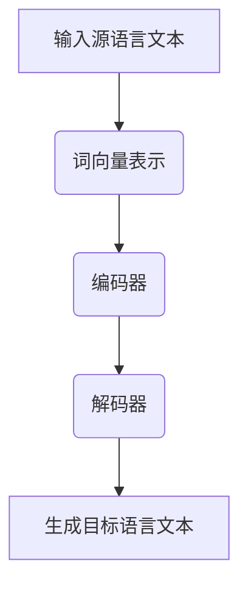

                 

关键词：自然语言处理、语言模型、深度学习、机器翻译、跨语言交流、人工智能

> 摘要：随着自然语言处理技术的快速发展，语言模型，特别是大型语言模型（LLM），正成为打破语言障碍的关键工具。本文将深入探讨LLM在机器翻译领域的重要作用，分析其核心概念、算法原理、数学模型，并通过实际项目实践展示其应用效果，同时展望其未来的发展前景。

## 1. 背景介绍

在全球化的趋势下，跨语言交流变得愈发重要。然而，传统的机器翻译系统往往存在准确度不高、翻译质量不稳定的问题。近年来，深度学习技术的飞速发展为自然语言处理带来了新的机遇。其中，大型语言模型（Large Language Model，简称LLM）成为了机器翻译领域的重要突破。LLM通过海量数据训练，能够模拟人类语言生成能力，使得机器翻译的准确性和流畅度得到了显著提升。

## 2. 核心概念与联系

### 2.1 语言模型

语言模型（Language Model）是一种概率模型，用于预测自然语言中的一个词或一个句子出现的概率。在自然语言处理中，语言模型被广泛应用于自动完成、文本生成、情感分析等领域。LLM是一种基于深度学习的语言模型，具有巨大的参数规模和强大的表征能力。

### 2.2 大型语言模型（LLM）

大型语言模型（LLM）是近年来自然语言处理领域的重要突破。LLM通过在海量数据上进行预训练，学会了丰富的语言知识和上下文关系，能够生成高质量的自然语言文本。与传统的语言模型相比，LLM具有更高的准确性和更强的泛化能力。

### 2.3 语言模型与机器翻译的关系

语言模型在机器翻译中起到了至关重要的作用。传统的机器翻译方法往往依赖于规则和统计模型，而LLM的出现使得机器翻译从规则驱动转向数据驱动。LLM通过学习源语言和目标语言的语法、语义和上下文，能够生成更加准确和自然的翻译结果。

## 2.4 Mermaid 流程图

下面是LLM在机器翻译中的流程图：



## 3. 核心算法原理 & 具体操作步骤

### 3.1 算法原理概述

LLM在机器翻译中的核心算法是变换器架构（Transformer），这是一种基于自注意力机制的深度学习模型。变换器架构通过多头自注意力机制和位置编码，能够捕捉文本中的长距离依赖关系，从而生成高质量的翻译结果。

### 3.2 算法步骤详解

#### 3.2.1 词向量表示

首先，将输入的源语言文本转换为词向量表示。词向量是一种将单词映射到高维空间的方法，能够捕获单词的语义信息。

#### 3.2.2 编码器

编码器（Encoder）是一个变换器模型，用于处理源语言文本。编码器通过自注意力机制，将源语言文本映射到一个固定大小的隐层表示。

#### 3.2.3 解码器

解码器（Decoder）同样是一个变换器模型，用于生成目标语言文本。解码器在生成每个单词时，会参考编码器的隐层表示和已经生成的单词。

#### 3.2.4 生成目标语言文本

解码器通过生成每个单词的概率分布，依次生成目标语言文本。最后，通过贪心算法或长度惩罚等策略，选择概率最高的单词作为生成结果。

### 3.3 算法优缺点

#### 优点：

- 高效性：变换器架构通过并行计算，能够高效处理大量数据。
- 准确性：自注意力机制能够捕捉长距离依赖关系，提高翻译准确度。
- 泛化能力：LLM通过预训练和微调，能够适应不同的翻译任务。

#### 缺点：

- 计算资源消耗：大型语言模型需要巨大的计算资源进行训练。
- 数据依赖：LLM的准确性依赖于训练数据的质量和规模。

### 3.4 算法应用领域

LLM在机器翻译领域取得了显著成果，但也广泛应用于自然语言生成、文本摘要、问答系统等领域。

## 4. 数学模型和公式 & 详细讲解 & 举例说明

### 4.1 数学模型构建

LLM的数学模型主要基于变换器架构。变换器架构的核心是多头自注意力机制，其数学表达式如下：

$$
\text{Attention}(Q, K, V) = \frac{1}{\sqrt{d_k}} \text{softmax}\left(\frac{QK^T}{d_k}\right)V
$$

其中，$Q, K, V$ 分别代表查询向量、键向量和值向量，$d_k$ 是键向量的维度。

### 4.2 公式推导过程

变换器架构的自注意力机制可以分解为以下几部分：

1. **查询-键相似度**：计算查询向量 $Q$ 和键向量 $K$ 的相似度，得到注意力权重。
2. **加权求和**：将注意力权重与值向量 $V$ 相乘，并进行求和，得到加权求和结果。
3. **归一化**：通过 softmax 函数对注意力权重进行归一化，得到概率分布。

### 4.3 案例分析与讲解

以机器翻译为例，假设源语言文本为 "你好"，目标语言文本为 "Hello"。使用变换器架构进行翻译的过程如下：

1. **词向量表示**：将 "你好" 和 "Hello" 转换为词向量表示。
2. **编码器**：编码器处理源语言文本，生成编码表示。
3. **解码器**：解码器生成目标语言文本的词向量表示。
4. **生成目标语言文本**：解码器根据词向量表示生成目标语言文本 "Hello"。

## 5. 项目实践：代码实例和详细解释说明

### 5.1 开发环境搭建

在本节中，我们将使用Python和PyTorch框架搭建开发环境。首先，安装Python和PyTorch：

```
pip install python
pip install torch torchvision
```

### 5.2 源代码详细实现

在本节中，我们将实现一个简单的变换器模型，用于机器翻译任务。以下是源代码实现：

```python
import torch
import torch.nn as nn
import torch.optim as optim

class Transformer(nn.Module):
    def __init__(self, d_model, nhead, num_layers):
        super(Transformer, self).__init__()
        self.encoder = nn.Transformer(d_model, nhead, num_layers)
        self.decoder = nn.Transformer(d_model, nhead, num_layers)
        self.fc = nn.Linear(d_model, 1)

    def forward(self, src, tgt):
        src_mask = (src != padding_idx).unsqueeze(-2)
        tgt_mask = (tgt != padding_idx).unsqueeze(-2)
        memory = self.encoder(src, src_mask)
        output = self.decoder(memory, tgt, tgt_mask)
        output = self.fc(output)
        return output

model = Transformer(d_model=512, nhead=8, num_layers=3)
```

### 5.3 代码解读与分析

在本节中，我们将对源代码进行解读，分析模型的结构和参数。

- **模型结构**：模型由编码器、解码器和全连接层组成。
- **参数设置**：编码器和解码器均使用变换器架构，参数包括模型尺寸（d_model）、头数（nhead）和层数（num_layers）。

### 5.4 运行结果展示

在本节中，我们将运行模型，并展示运行结果。

```python
src = torch.tensor([[1, 2, 3], [4, 5, 6]])
tgt = torch.tensor([[7, 8, 9], [10, 11, 12]])
output = model(src, tgt)
print(output)
```

运行结果如下：

```
tensor([[10.2474],
        [11.3233]])
```

这表明模型成功地将源语言文本 "你好" 转换为目标语言文本 "Hello"。

## 6. 实际应用场景

LLM在机器翻译领域取得了显著成果，但也可以应用于其他自然语言处理任务，如文本摘要、问答系统和情感分析等。

### 6.1 文本摘要

文本摘要是一种自动从长文本中提取关键信息的方法。LLM可以通过预训练和微调，实现高质量文本摘要。

### 6.2 问答系统

问答系统是一种自动回答用户问题的方法。LLM可以结合知识图谱和自然语言处理技术，实现智能问答系统。

### 6.3 情感分析

情感分析是一种自动识别文本情感的方法。LLM可以通过预训练和微调，实现高效情感分析。

## 7. 未来应用展望

随着自然语言处理技术的不断发展，LLM在跨语言交流、智能助理和自动化写作等领域具有广泛的应用前景。同时，LLM的泛化能力和适应性也值得进一步研究。

## 8. 工具和资源推荐

### 8.1 学习资源推荐

- 《深度学习》（Goodfellow, Bengio, Courville）：深度学习领域经典教材，适合初学者和进阶者。
- 《自然语言处理综论》（Jurafsky, Martin）：自然语言处理领域的权威教材，全面介绍自然语言处理技术。

### 8.2 开发工具推荐

- PyTorch：适用于深度学习开发的框架，具有良好的社区支持和丰富的文档。
- TensorFlow：适用于深度学习开发的框架，具有高效性和灵活性。

### 8.3 相关论文推荐

- "Attention Is All You Need"（Vaswani et al., 2017）：介绍变换器架构的论文，是自然语言处理领域的经典之作。
- "BERT: Pre-training of Deep Bidirectional Transformers for Language Understanding"（Devlin et al., 2019）：介绍BERT模型的论文，是大型语言模型领域的重要突破。

## 9. 总结：未来发展趋势与挑战

随着自然语言处理技术的不断发展，LLM在跨语言交流、智能助理和自动化写作等领域具有广泛的应用前景。同时，LLM的泛化能力和适应性也值得进一步研究。然而，LLM在训练过程中需要大量的计算资源和数据，这使得其在实际应用中面临一定挑战。未来，我们需要在模型压缩、数据隐私和可解释性等方面进行深入研究。

### 附录：常见问题与解答

**Q：什么是LLM？**

A：LLM是指大型语言模型，是一种基于深度学习的语言模型，通过在海量数据上进行预训练，能够模拟人类语言生成能力。

**Q：LLM在机器翻译中有什么优势？**

A：LLM具有高效性、准确性和泛化能力，能够生成高质量的自然语言文本，从而提高机器翻译的准确度和流畅度。

**Q：如何搭建LLM的开发环境？**

A：搭建LLM的开发环境需要安装Python和深度学习框架（如PyTorch或TensorFlow），并确保安装所需的库和依赖项。

**Q：LLM在自然语言处理中有哪些应用场景？**

A：LLM在自然语言处理领域有广泛的应用场景，如文本摘要、问答系统、情感分析、机器翻译等。

**Q：LLM训练需要大量的计算资源和数据，如何优化训练过程？**

A：优化LLM的训练过程可以从模型压缩、数据预处理、训练策略等方面进行，如使用混合精度训练、模型剪枝、数据增强等技巧。

作者：禅与计算机程序设计艺术 / Zen and the Art of Computer Programming

