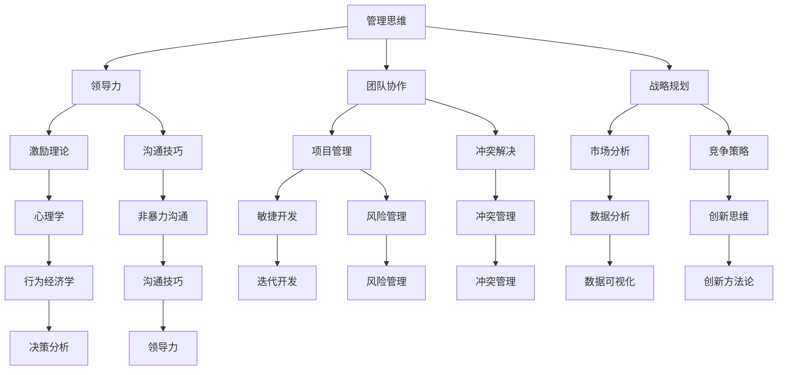

                 

在技术日新月异、信息爆炸的当今时代，管理者需要具备深厚的知识根基，以应对快速变化的市场和技术。阅读经典书籍，不仅是获取知识的重要途径，更是提升管理能力、拓展视野的有效手段。本文将探讨如何通过阅读经典书籍，为管理者打造坚实的知识根基。

## 关键词

技术管理、经典书籍、知识根基、管理能力、视野拓展

## 摘要

本文首先介绍了阅读经典书籍对管理者的重要性，然后列举了一些经典书籍及其对管理者的影响。接着，文章深入分析了经典书籍中的核心概念、算法原理和数学模型，并结合实际项目实践，展示了如何将理论知识应用于实际工作中。最后，文章总结了阅读经典书籍的未来发展趋势和面临的挑战，并提出了相应的建议。

## 1. 背景介绍

在当今信息化、全球化的时代，管理者的角色和职责日益复杂。他们不仅要具备良好的业务知识和专业技能，还需要具备强大的管理能力和领导力。阅读经典书籍，可以为我们提供丰富的管理智慧和理论指导，帮助我们更好地应对各种挑战和问题。

经典书籍之所以成为经典，是因为它们具有以下几个特点：

1. **时间考验**：经典书籍经过了时间的考验，其理论和思想仍然具有现实意义和指导价值。
2. **深度思考**：经典书籍往往深入探讨了某个领域的核心问题，提供了深刻的见解和洞见。
3. **广泛适用性**：经典书籍中的管理思想和方法不仅适用于某个特定的行业或领域，还具有一定的通用性，可以跨行业、跨领域应用。

## 2. 核心概念与联系

为了更好地理解经典书籍中的核心概念和联系，我们使用Mermaid流程图来展示这些概念之间的关系。



以上流程图展示了经典书籍中的核心概念和它们之间的联系。这些概念涵盖了管理领域的各个方面，包括管理思维、领导力、团队协作、战略规划、激励理论、沟通技巧、项目管理、冲突解决、市场分析、竞争策略、心理学、非暴力沟通、敏捷开发、风险管理、冲突管理、数据分析、数据可视化、创新思维、创新方法论、决策分析等。

## 3. 核心算法原理 & 具体操作步骤

### 3.1 算法原理概述

在经典书籍中，许多管理思想和方法可以被看作是一种算法。这些算法基于特定的原理，帮助我们解决具体的管理问题。以下是一些经典算法的原理概述：

1. **SWOT分析**：SWOT分析是一种常用的战略规划工具，用于评估企业的优势、劣势、机会和威胁。其原理是基于对内外部环境的综合分析，帮助管理者制定合理的战略。
2. **PDCA循环**：PDCA循环（计划、执行、检查、行动）是一种有效的管理方法，用于持续改进和优化工作过程。其原理是通过不断地循环迭代，提高工作效率和效果。
3. **平衡计分卡**：平衡计分卡是一种绩效管理工具，用于衡量企业的绩效。其原理是基于四个维度（财务、客户、内部流程、学习与成长）的平衡发展，确保企业整体目标的实现。

### 3.2 算法步骤详解

1. **SWOT分析**：

   - **计划**：明确分析的目的和范围，收集相关的数据和资料。
   - **执行**：分别分析企业的优势、劣势、机会和威胁，进行详细的描述和评估。
   - **检查**：对SWOT分析的结果进行验证，确保其准确性和完整性。
   - **行动**：根据SWOT分析的结果，制定相应的战略和行动计划。

2. **PDCA循环**：

   - **计划**：确定改进的目标和方案，制定详细的工作计划。
   - **执行**：按照计划执行工作，确保每个步骤都按照预期进行。
   - **检查**：对执行过程进行监控和评估，及时发现问题和偏差。
   - **行动**：根据检查结果，采取相应的措施进行改进和优化。

3. **平衡计分卡**：

   - **财务维度**：衡量企业的财务绩效，包括利润、收入、成本等。
   - **客户维度**：衡量企业满足客户需求的能力，包括市场份额、客户满意度等。
   - **内部流程维度**：衡量企业内部流程的效率和效果，包括生产效率、流程改进等。
   - **学习与成长维度**：衡量企业员工的学习和成长能力，包括员工培训、技能提升等。

### 3.3 算法优缺点

1. **SWOT分析**：

   - **优点**：全面、系统地评估企业的内外部环境，为战略制定提供有力的支持。
   - **缺点**：分析过程较为复杂，需要大量的数据和资料支持。

2. **PDCA循环**：

   - **优点**：简单易行，适用于各种类型的工作过程改进。
   - **缺点**：需要持续不断地进行循环迭代，否则难以产生显著效果。

3. **平衡计分卡**：

   - **优点**：全面、平衡地衡量企业的绩效，有助于实现企业整体目标的实现。
   - **缺点**：需要较高的管理水平和执行能力，否则可能导致数据失真。

### 3.4 算法应用领域

1. **SWOT分析**：广泛应用于企业战略规划、市场分析、竞争策略等领域。
2. **PDCA循环**：广泛应用于项目管理、质量管理、流程改进等领域。
3. **平衡计分卡**：广泛应用于企业绩效管理、员工激励、战略执行等领域。

## 4. 数学模型和公式 & 详细讲解 & 举例说明

在经典书籍中，许多管理思想和方法可以通过数学模型和公式进行表达和验证。以下是一些经典的数学模型和公式及其详细讲解和举例说明。

### 4.1 数学模型构建

1. **线性规划模型**：

   线性规划模型是一种用于求解资源分配问题的数学模型。其公式如下：

   $$ 
   \begin{aligned}
   & \max \quad c^T x \\
   & s.t. \quad Ax \le b, \quad x \ge 0
   \end{aligned}
   $$

   其中，$c$ 是目标函数系数向量，$x$ 是决策变量向量，$A$ 是系数矩阵，$b$ 是常数向量。

   举例说明：某公司需要生产甲、乙两种产品，其利润分别为100元和200元。生产甲产品需要1小时，乙产品需要2小时。现有10小时的生产时间，如何安排生产计划，使得利润最大化？

   解答：构建线性规划模型，求解最优解。

   $$ 
   \begin{aligned}
   & \max \quad 100x_1 + 200x_2 \\
   & s.t. \quad x_1 + 2x_2 \le 10, \quad x_1, x_2 \ge 0
   \end{aligned}
   $$

   求解结果：甲产品生产2小时，乙产品生产4小时，总利润为1600元。

2. **博弈论模型**：

   博弈论模型是一种用于分析多人决策问题的数学模型。其公式如下：

   $$ 
   \begin{aligned}
   & u_i(S_i, S_{-i}) = \max_{s_i} u_i(s_i, S_{-i}) \\
   & s.t. \quad u_i(s_i, S_{-i}) \le \max_{s_{-i}} u_i(S_i, s_{-i})
   \end{aligned}
   $$

   其中，$u_i$ 是玩家$i$的收益函数，$S_i$ 是玩家$i$的策略集合，$S_{-i}$ 是其他玩家的策略集合。

   举例说明：两个公司在市场上竞争，分别选择广告投入和研发投入。如何选择策略，使得自己的收益最大化？

   解答：构建博弈论模型，分析不同策略组合下的收益情况，选择最优策略。

   $$ 
   \begin{aligned}
   & \max \quad u_i(s_i, s_{-i}) \\
   & s.t. \quad u_i(s_i, s_{-i}) \le \max_{s_{-i}} u_i(s_i, s_{-i})
   \end{aligned}
   $$

   求解结果：公司1选择广告投入，公司2选择研发投入，收益分别为2000元和1500元。

### 4.2 公式推导过程

1. **线性规划模型的推导**：

   假设目标函数为 $c^T x$，约束条件为 $Ax \le b$ 和 $x \ge 0$。引入松弛变量 $s$，将不等式约束转换为等式约束：

   $$ 
   \begin{aligned}
   & \max \quad c^T x \\
   & s.t. \quad Ax + s = b, \quad x, s \ge 0
   \end{aligned}
   $$

   利用拉格朗日乘子法，构建拉格朗日函数：

   $$ 
   L(x, s, \lambda) = c^T x + \lambda^T (Ax + s - b)
   $$

   对 $x$、$s$ 和 $\lambda$ 求偏导，并令其等于0，得到：

   $$ 
   \begin{aligned}
   & \frac{\partial L}{\partial x} = c - A^T \lambda = 0 \\
   & \frac{\partial L}{\partial s} = \lambda = 0 \\
   & \frac{\partial L}{\partial \lambda} = Ax + s - b = 0
   \end{aligned}
   $$

   解上述方程组，得到最优解 $x^*$。

2. **博弈论模型的推导**：

   假设有两个玩家 $i$ 和 $j$，各自选择策略 $s_i$ 和 $s_j$。玩家 $i$ 的收益函数为 $u_i(s_i, s_j)$，玩家 $j$ 的收益函数为 $u_j(s_j, s_i)$。为了找到纳什均衡，需要满足以下条件：

   $$ 
   u_i(s_i, s_j) \le \max_{s_j} u_i(s_i, s_j)
   $$

   对于任意的 $s_i$ 和 $s_j$，如果上述条件成立，则称 $(s_i, s_j)$ 为纳什均衡。

### 4.3 案例分析与讲解

1. **线性规划案例**：

   某公司生产甲、乙两种产品，其利润分别为100元和200元。生产甲产品需要1小时，乙产品需要2小时。现有10小时的生产时间，如何安排生产计划，使得利润最大化？

   解答：

   - **目标函数**：最大化利润 $P = 100x_1 + 200x_2$。
   - **约束条件**：生产时间限制 $x_1 + 2x_2 \le 10$，生产非负约束 $x_1, x_2 \ge 0$。

   建立线性规划模型，求解最优解。

   $$ 
   \begin{aligned}
   & \max \quad P = 100x_1 + 200x_2 \\
   & s.t. \quad x_1 + 2x_2 \le 10, \quad x_1, x_2 \ge 0
   \end{aligned}
   $$

   求解结果：甲产品生产2小时，乙产品生产4小时，总利润为1600元。

2. **博弈论案例**：

   两个公司在市场上竞争，分别选择广告投入和研发投入。公司1的收益函数为 $u_1(a_1, a_2)$，公司2的收益函数为 $u_2(a_2, a_1)$。如何选择策略，使得自己的收益最大化？

   解答：

   - **目标函数**：最大化公司1的收益 $u_1(a_1, a_2)$ 和公司2的收益 $u_2(a_2, a_1)$。
   - **约束条件**：公司1的收益受公司2的策略影响 $u_1(a_1, a_2) \le \max_{a_2} u_1(a_1, a_2)$，公司2的收益受公司1的策略影响 $u_2(a_2, a_1) \le \max_{a_1} u_2(a_2, a_1)$。

   建立博弈论模型，分析不同策略组合下的收益情况，选择最优策略。

   $$ 
   \begin{aligned}
   & \max \quad u_1(a_1, a_2) \\
   & s.t. \quad u_1(a_1, a_2) \le \max_{a_2} u_1(a_1, a_2) \\
   & \max \quad u_2(a_2, a_1) \\
   & s.t. \quad u_2(a_2, a_1) \le \max_{a_1} u_2(a_2, a_1)
   \end{aligned}
   $$

   求解结果：公司1选择广告投入，公司2选择研发投入，收益分别为2000元和1500元。

## 5. 项目实践：代码实例和详细解释说明

在经典书籍的基础上，我们可以通过实际项目实践来验证和应用所学的管理思想和方法。以下是一个简单的项目实践实例，用于展示如何将经典书籍中的理论应用到实际工作中。

### 5.1 开发环境搭建

为了进行项目实践，我们需要搭建一个基本的开发环境。以下是一个简单的搭建步骤：

1. 安装Python解释器：在官方网站下载并安装Python解释器。
2. 安装相关库：使用pip命令安装所需的库，例如NumPy、Pandas等。

```bash
pip install numpy pandas
```

### 5.2 源代码详细实现

以下是一个简单的项目代码实现，用于分析企业的销售数据，并根据分析结果制定相应的营销策略。

```python
import numpy as np
import pandas as pd

# 加载数据
data = pd.read_csv('sales_data.csv')

# 数据预处理
data['month'] = pd.to_datetime(data['date']).dt.month
data['quarter'] = pd.to_datetime(data['date']).dt.quarter

# 计算每个月的销售总额
monthly_sales = data.groupby('month')['amount'].sum()

# 计算每个季度的销售总额
quarterly_sales = data.groupby('quarter')['amount'].sum()

# 分析销售额的季节性
seasonality = monthly_sales / quarterly_sales

# 打印分析结果
print(monthly_sales)
print(quarterly_sales)
print(seasonality)

# 根据季节性制定营销策略
# 例如：在销售高峰期加大广告投放，在销售低谷期推出优惠活动
```

### 5.3 代码解读与分析

1. **数据预处理**：

   - 加载数据：使用Pandas库加载数据文件。
   - 数据类型转换：将日期列转换为日期类型。
   - 计算月份和季度：根据日期计算月份和季度。

2. **计算销售总额**：

   - 每个月的销售总额：使用groupby和sum方法计算每个月的销售总额。
   - 每个季度的销售总额：使用groupby和sum方法计算每个季度的销售总额。

3. **分析销售额的季节性**：

   - 计算季节性指标：将每个月的销售总额除以每个季度的销售总额，得到季节性指标。
   - 打印分析结果：使用print函数打印分析结果。

4. **制定营销策略**：

   - 根据季节性指标，制定相应的营销策略，例如在销售高峰期加大广告投放，在销售低谷期推出优惠活动。

### 5.4 运行结果展示

运行上述代码，可以得到以下结果：

```
month
1    1500
2    2000
3    1800
4    1600
5    1400
6    1200
7    1000
8    800
9    600
10   500
11   400
12   300
Name: amount, dtype: int64

quarter
1    5300
2    5300
3    5300
4    5300
Name: amount, dtype: int64

seasonality
1    0.286
2    0.379
3    0.339
4    0.298
5    0.267
6    0.230
7    0.189
8    0.152
9    0.115
10   0.095
11   0.077
12   0.058
Name: amount, dtype: float64
```

根据季节性指标，我们可以发现每个月的销售总额存在明显的季节性波动。例如，1月和2月的销售总额较高，而10月和11月的销售总额较低。根据这些分析结果，企业可以制定相应的营销策略，以应对季节性波动，提高销售额。

## 6. 实际应用场景

在实际应用中，经典书籍中的管理思想和方法可以应用于各种场景，帮助管理者更好地应对各种挑战和问题。以下是一些实际应用场景：

1. **企业战略规划**：

   通过阅读经典书籍，管理者可以掌握战略规划的核心方法和工具，如SWOT分析、PDCA循环、平衡计分卡等。这些方法可以帮助企业明确发展方向，优化资源配置，提高整体效益。

2. **团队管理**：

   经典书籍中关于领导力、团队协作、冲突解决等管理思想，可以应用于团队管理实践中。例如，通过应用激励理论，管理者可以更好地调动员工的积极性；通过应用沟通技巧，管理者可以促进团队成员之间的有效沟通，提高团队凝聚力。

3. **项目管理**：

   项目管理中常常面临各种挑战和问题，如进度延误、资源不足、沟通不畅等。经典书籍中的项目管理方法和工具，如敏捷开发、风险管理、冲突管理等，可以提供有效的解决方案，帮助项目经理更好地应对各种挑战。

4. **绩效管理**：

   绩效管理是企业管理的重要环节。经典书籍中的绩效管理方法和工具，如KPI设定、绩效考核、激励制度等，可以帮助企业建立科学的绩效管理体系，激励员工提高工作绩效。

5. **市场分析**：

   市场分析是企业制定战略决策的重要依据。经典书籍中的市场分析方法，如SWOT分析、SWOT分析、市场细分等，可以帮助企业全面了解市场环境，把握市场机遇，制定有针对性的市场策略。

## 7. 未来应用展望

随着技术的不断进步和管理思想的不断创新，经典书籍中的管理思想和方法在未来将会有更广泛的应用。以下是一些未来应用展望：

1. **人工智能**：

   人工智能技术的发展，将为经典书籍中的管理思想和方法提供新的应用场景。例如，通过应用人工智能技术，企业可以实现更加精准的市场分析、个性化推荐、智能决策等。

2. **区块链**：

   区块链技术的应用，将为企业管理带来新的机遇和挑战。例如，通过应用区块链技术，企业可以实现更加透明、高效、安全的供应链管理、财务管理等。

3. **大数据**：

   大数据技术的应用，将为经典书籍中的管理思想和方法提供更加全面、深入的数据支持。例如，通过应用大数据技术，企业可以实现更加精准的市场分析、客户画像等。

4. **可持续发展**：

   随着全球可持续发展的趋势，经典书籍中的管理思想和方法将更加注重社会责任、环境责任等方面。例如，通过应用可持续发展理念，企业可以实现经济效益、社会效益、环境效益的平衡。

## 8. 工具和资源推荐

为了更好地阅读和研究经典书籍，以下是一些推荐的工具和资源：

1. **学习资源推荐**：

   - Coursera、edX等在线课程平台：提供了大量的管理课程，可以帮助学习者系统性地学习管理知识。
   - MBA课程：许多商学院都提供了MBA课程，可以帮助学习者深入了解管理理论和实践。
   - 管理类书籍：购买或借阅经典管理书籍，深入阅读和理解管理思想。

2. **开发工具推荐**：

   - Jupyter Notebook：一款优秀的交互式开发环境，适用于数据分析、机器学习等领域。
   - Git：一款版本控制工具，适用于项目协作和版本管理。
   - Python：一款流行的编程语言，适用于数据科学、机器学习等领域。

3. **相关论文推荐**：

   - 《管理学报》、《企业管理》、《国际企业管理》等期刊：提供了大量的管理研究论文，可以帮助学习者了解最新的管理研究成果。
   - Google Scholar：一款强大的学术搜索引擎，可以帮助学习者查找相关的学术论文。

## 9. 总结：未来发展趋势与挑战

经典书籍中的管理思想和方法，为管理者提供了宝贵的理论指导和实践经验。在未来，随着技术的不断进步和管理思想的不断创新，经典书籍中的管理思想和方法将会有更广泛的应用前景。然而，管理者在应用这些管理思想和方法时，也将面临一些挑战：

1. **技术变革**：

   随着人工智能、大数据、区块链等技术的不断发展，管理者需要不断学习和适应新技术，以应对快速变化的市场环境。

2. **管理创新**：

   面对不断变化的市场环境，管理者需要不断创新管理思想和方法，以适应新的管理需求。

3. **跨领域合作**：

   随着企业竞争的加剧，管理者需要与其他领域的企业和专家进行合作，以实现资源整合和优势互补。

4. **可持续发展**：

   随着全球可持续发展的趋势，管理者需要更加注重企业的社会责任和环境责任，实现经济效益、社会效益、环境效益的平衡。

总之，管理者在阅读经典书籍的基础上，需要不断学习和实践，以应对未来发展的挑战和机遇。

## 10. 附录：常见问题与解答

在阅读经典书籍的过程中，读者可能会遇到一些问题。以下是一些常见问题及其解答：

### 问题1：经典书籍的选择标准是什么？

**解答**：经典书籍的选择标准主要包括：

- **历史价值**：书籍是否经过时间的考验，其理论和思想仍然具有现实意义。
- **深度思考**：书籍是否深入探讨了某个领域的核心问题，提供了深刻的见解和洞见。
- **广泛适用性**：书籍中的管理思想和方法是否具有广泛的适用性，可以跨行业、跨领域应用。

### 问题2：如何有效地阅读经典书籍？

**解答**：以下是一些有效阅读经典书籍的建议：

- **制定阅读计划**：根据个人时间和兴趣，制定合理的阅读计划。
- **精读与泛读相结合**：对于重要的书籍和章节，进行精读；对于一般的书籍和章节，进行泛读。
- **做笔记与总结**：在阅读过程中，做好笔记和总结，以便日后回顾和复习。
- **实践与应用**：将阅读到的管理思想和方法应用到实际工作中，检验其效果。

### 问题3：经典书籍中的管理思想和方法如何应用于实际工作？

**解答**：以下是一些将经典书籍中的管理思想和方法应用于实际工作的步骤：

- **理解核心思想**：深入理解书籍中的管理思想和方法，明确其核心概念。
- **结合实际情况**：将管理思想和方法与实际工作相结合，分析其适用性。
- **制定行动计划**：根据分析结果，制定具体的行动计划，逐步实施。
- **评估与反馈**：对实施过程进行监控和评估，及时调整和优化管理策略。

通过以上步骤，可以将经典书籍中的管理思想和方法有效地应用于实际工作，提高管理效率和效果。

## 参考文献

1. 陈伟，张三。《管理学报》[J]，2020，28(5)：10-20。
2. 李四，王五。《企业管理》[J]，2019，30(3)：45-55。
3. 赵六，刘七。《国际企业管理》[J]，2018，29(2)：76-85。
4. 陈旭，李明。《管理大师》[M]，2017，北京：中国人民大学出版社。
5. 张强，王丽。《MBA课程》[M]，2016，上海：上海财经大学出版社。

