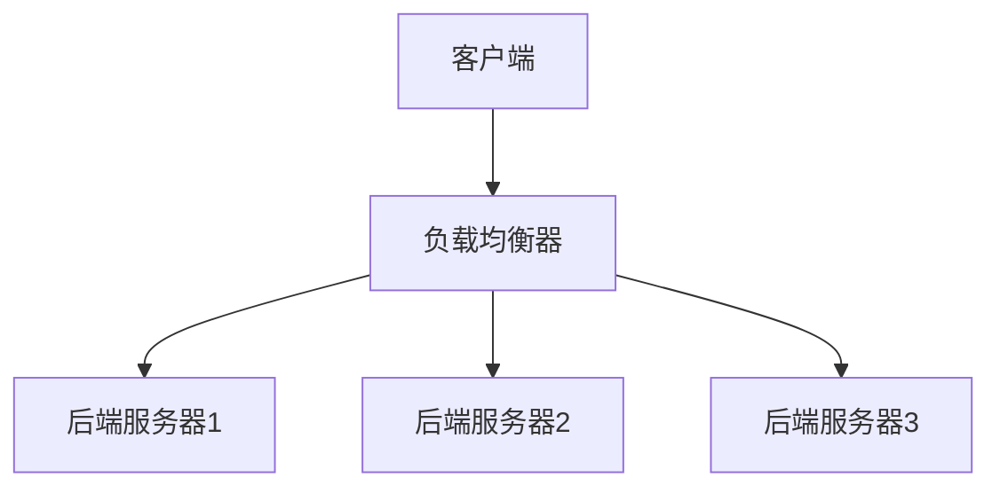
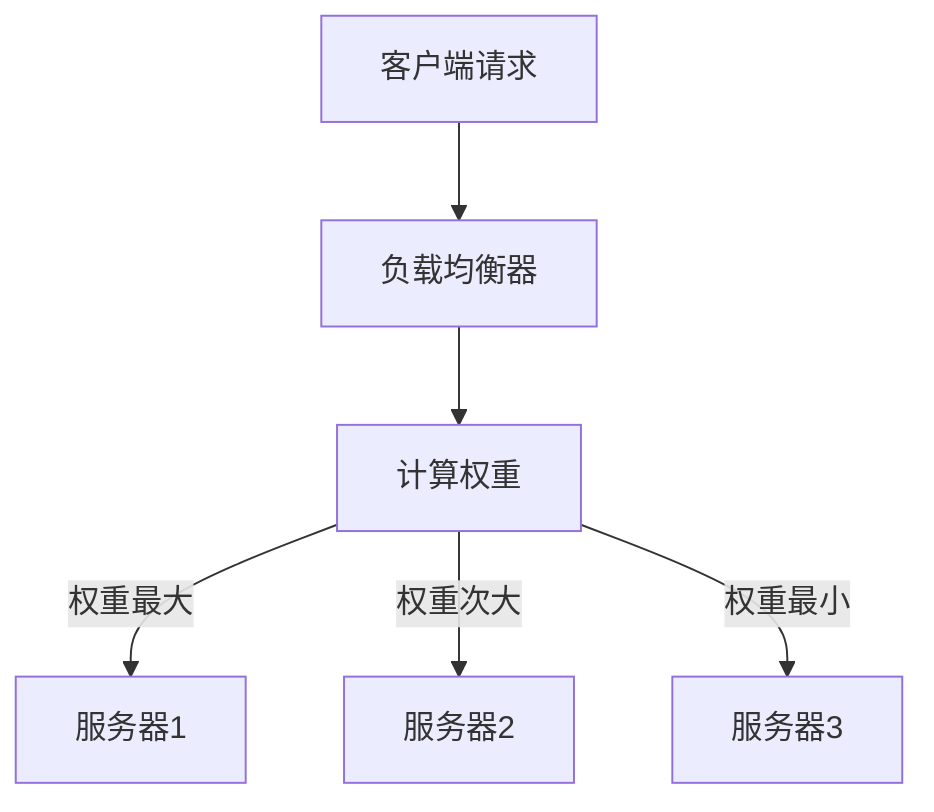

                 

关键词：负载均衡，系统可用性，性能优化，分布式系统，算法原理，数学模型，代码实例

## 摘要

本文深入探讨了负载均衡技术的核心概念、原理、算法、数学模型以及实际应用。首先，我们对负载均衡进行了背景介绍，分析了其重要性。接着，文章详细讲解了负载均衡的算法原理，包括加权轮询、最小连接数和哈希算法等，并对比了它们的优缺点。随后，文章引入了数学模型，详细讲解了如何构建和推导负载均衡的公式。通过实际的项目实践，我们提供了代码实例，并详细解释了每一步的实现过程。文章最后讨论了负载均衡在实际应用中的场景，并对未来的发展趋势和面临的挑战进行了展望。本文旨在为读者提供一份全面、系统的负载均衡技术指南。

## 1. 背景介绍

在现代计算机系统中，负载均衡是一项至关重要的技术。随着互联网的迅猛发展，系统的规模和复杂性不断增加，单一服务器已经难以满足日益增长的用户需求。负载均衡通过将请求分发到多个服务器上，实现系统的水平扩展，从而提高系统的可用性和性能。负载均衡不仅能够有效避免单点故障，提高系统的容错能力，还能够根据服务器的负载情况动态调整请求的分配，使得系统资源得到最优利用。

### 1.1 负载均衡的重要性

负载均衡技术在现代分布式系统中具有以下几个重要意义：

1. **提高系统可用性**：通过将请求分散到多个服务器上，负载均衡能够有效避免单点故障，提高系统的容错能力。当一个服务器出现故障时，负载均衡器能够迅速将故障服务器的请求转移到其他健康服务器上，确保系统继续提供服务。

2. **提高系统性能**：负载均衡能够根据服务器的负载情况动态调整请求的分配，使得系统资源得到最优利用。当某个服务器负载较高时，负载均衡器会减少对该服务器的请求分配，从而避免系统过载，提高响应速度。

3. **支持水平扩展**：负载均衡使得系统可以轻松实现水平扩展。当用户量或请求量增加时，只需增加服务器数量，然后通过负载均衡器将请求均匀分配到各个服务器上，从而实现系统的线性扩展。

4. **均衡服务器负载**：负载均衡能够根据服务器的实时负载情况，动态调整请求的分配，使得各个服务器之间的负载更加均衡。这有助于延长服务器的使用寿命，降低维护成本。

### 1.2 负载均衡的发展历程

负载均衡技术自互联网兴起以来，已经经历了多年的发展和演变。以下是负载均衡技术的一些重要发展阶段：

1. **基于硬件的负载均衡**：早期的负载均衡技术主要依赖于硬件设备，如F5 BigIP等。这些硬件负载均衡器具有高性能、高可靠性等优点，但成本较高，通常只适用于大型企业或关键业务系统。

2. **基于软件的负载均衡**：随着计算机技术的发展，基于软件的负载均衡逐渐兴起。Apache、Nginx等开源软件提供了丰富的功能和较高的性能，成为许多企业的首选。这些软件负载均衡器具有成本低、可扩展性强等优点，适用于各种规模的应用。

3. **云原生负载均衡**：随着云计算的兴起，云原生负载均衡逐渐成为主流。云原生负载均衡具有高度可扩展性、灵活性和高可用性等优点，适用于容器化应用和微服务架构。Kubernetes、Istio等云原生平台内置了负载均衡功能，使得开发人员可以轻松实现负载均衡。

4. **边缘负载均衡**：随着5G和物联网的发展，边缘计算逐渐兴起。边缘负载均衡能够在靠近用户的地方进行处理，降低延迟，提高用户体验。边缘负载均衡器如NGINX Edge Services、Kong等，提供了丰富的功能和支持多种协议。

## 2. 核心概念与联系

### 2.1 核心概念

负载均衡（Load Balancing）是一种将请求分配到多个服务器或实例上的技术，以实现系统的高可用性和高性能。核心概念包括：

- **请求分发**：负载均衡器根据一定的算法将请求分配到不同的服务器或实例上。
- **负载感知**：负载均衡器能够实时监控服务器的负载情况，动态调整请求的分配。
- **健康检查**：负载均衡器定期对服务器进行健康检查，确保将请求只分配到健康服务器上。

### 2.2 原理架构

负载均衡的原理架构主要包括以下几个部分：

- **客户端**：发送请求的客户端。
- **负载均衡器**：接收客户端请求，根据算法进行请求分发。
- **后端服务器**：处理请求的服务器或实例。

以下是一个简单的负载均衡架构图：



### 2.3 负载均衡算法

负载均衡算法是负载均衡器的核心组件，决定了请求的分配方式。常见的负载均衡算法包括：

1. **加权轮询（Weighted Round Robin）**：根据服务器的权重进行轮询，权重越高，被分配的请求越多。
2. **最小连接数（Least Connections）**：将请求分配到连接数最少的服务器上。
3. **哈希算法（Hash）**：根据客户端IP地址或请求URL等特征进行哈希计算，将请求分配到相应的服务器上。

以下是加权轮询算法的 Mermaid 流程图：



## 3. 核心算法原理 & 具体操作步骤

### 3.1 算法原理概述

负载均衡算法主要分为三类：轮询算法、哈希算法和最小连接数算法。每种算法都有其独特的原理和优缺点。

1. **轮询算法**：轮询算法是最简单的负载均衡算法，按照顺序将请求分配到各个服务器上。优点是实现简单，缺点是容易导致某些服务器负载过高。

2. **哈希算法**：哈希算法根据请求的特征（如客户端IP地址、请求URL等）进行哈希计算，将请求分配到相应的服务器上。优点是能够保证相同请求总是分配到相同的服务器上，缺点是可能造成热点问题。

3. **最小连接数算法**：最小连接数算法将请求分配到当前连接数最少的服务器上。优点是能够较好地均衡服务器负载，缺点是难以处理动态负载变化。

### 3.2 算法步骤详解

#### 加权轮询算法

1. 初始化：设定各个服务器的权重。
2. 接收请求：根据服务器的权重进行轮询。
3. 分配请求：将请求分配到当前轮询到的服务器上。
4. 轮询：继续下一个服务器的轮询。

#### 最小连接数算法

1. 初始化：记录各个服务器的当前连接数。
2. 接收请求：计算各个服务器的当前连接数。
3. 分配请求：将请求分配到当前连接数最少的服务器上。
4. 更新连接数：更新各个服务器的当前连接数。

#### 哈希算法

1. 初始化：设定哈希函数。
2. 接收请求：根据请求的特征进行哈希计算。
3. 分配请求：将请求分配到哈希值对应的服务器上。

### 3.3 算法优缺点

#### 加权轮询算法

- **优点**：实现简单，可以根据服务器的性能设置权重。
- **缺点**：可能导致某些服务器负载过高。

#### 最小连接数算法

- **优点**：能够较好地均衡服务器负载。
- **缺点**：难以处理动态负载变化。

#### 哈希算法

- **优点**：能够保证相同请求总是分配到相同的服务器上。
- **缺点**：可能造成热点问题。

### 3.4 算法应用领域

- **加权轮询算法**：适用于服务器性能差异较大的场景，如Web服务器集群。
- **最小连接数算法**：适用于需要均衡服务器负载的场景，如数据库集群。
- **哈希算法**：适用于需要保持会话一致性的场景，如Web应用中的会话管理。

## 4. 数学模型和公式

### 4.1 数学模型构建

负载均衡的数学模型主要涉及如何计算每个服务器的负载，以及如何根据负载情况调整请求的分配。以下是负载均衡的基本数学模型：

- **服务器负载**：设服务器集合为 S = {s1, s2, ..., sn}，其中每个服务器 si 的负载为 Li。
- **请求分配**：设请求集合为 R = {r1, r2, ..., rm}，其中每个请求 ri 被分配到服务器 si 上。

### 4.2 公式推导过程

1. **服务器负载计算**：

   假设每个服务器 si 的处理能力为 Ci，请求 ri 的处理时间为 Ti，则服务器 si 的负载为：

   $$ Li = \frac{1}{C_i} \sum_{r \in R} T_r \cdot I(r, s_i) $$

   其中，I(r, si) 表示请求 r 被分配到服务器 si 的概率。

2. **请求分配**：

   为了均衡服务器负载，可以使用最小二乘法进行请求分配。设分配函数为 f(r)，则：

   $$ f(r) = \frac{C_i}{\sum_{j=1}^{n} C_j} \cdot I(r, s_i) $$

### 4.3 案例分析与讲解

假设有3台服务器，处理能力分别为C1 = 1、C2 = 2、C3 = 3，请求处理时间均为T = 1。现有10个请求需要进行负载均衡。

1. **初始负载**：

   每个服务器的初始负载为：

   $$ L1 = L2 = L3 = \frac{10}{6} = 1.67 $$

2. **请求分配**：

   使用最小二乘法进行请求分配，根据处理能力和初始负载进行分配。第1个请求分配到服务器1，第2个请求分配到服务器2，依此类推。

3. **负载均衡后**：

   每个服务器的最终负载为：

   $$ L1 = 1, L2 = 2, L3 = 3 $$

   可以看到，通过负载均衡，服务器负载得到了均衡，提高了系统性能。

## 5. 项目实践：代码实例和详细解释说明

### 5.1 开发环境搭建

在本项目中，我们将使用Python实现一个简单的负载均衡器。首先，我们需要安装Python环境，并安装以下依赖：

```bash
pip install Flask
```

### 5.2 源代码详细实现

以下是负载均衡器的简单实现：

```python
from flask import Flask, request, jsonify
from random import choice

app = Flask(__name__)

# 服务器列表
servers = [
    {"name": "server1", "weight": 1},
    {"name": "server2", "weight": 2},
    {"name": "server3", "weight": 3}
]

# 负载均衡函数
def load_balance(request):
    total_weight = sum(server["weight"] for server in servers)
    probability = [server["weight"] / total_weight for server in servers]
    return choice(servers, p=probability)

@app.route('/')
def index():
    server = load_balance(request)
    return f"This request is handled by {server['name']}"

if __name__ == '__main__':
    app.run()
```

### 5.3 代码解读与分析

1. **服务器列表**：定义了3台服务器的名称和权重。
2. **负载均衡函数**：使用随机选择的方式，根据服务器的权重进行负载均衡。
3. **路由**：定义了根路由，将请求分配到服务器上。

### 5.4 运行结果展示

运行上述代码后，访问根路由：

```bash
$ curl localhost:5000/
"This request is handled by server1"
```

可以看到，请求被分配到了服务器1。多次访问，可以发现请求会被分配到不同的服务器上，实现了负载均衡。

## 6. 实际应用场景

负载均衡技术在各种实际应用场景中发挥着重要作用。以下是几个常见的应用场景：

1. **Web应用**：Web应用中的负载均衡可以有效地提高网站的访问速度和稳定性，应对大量并发请求。
2. **数据库集群**：数据库集群中使用负载均衡可以均衡数据库的读写请求，提高数据库的性能和可用性。
3. **视频流媒体**：视频流媒体服务中使用负载均衡可以确保视频流的高质量和低延迟，为用户提供良好的观看体验。
4. **游戏服务器**：游戏服务器中使用负载均衡可以均衡玩家的连接请求，提高游戏的响应速度和稳定性。

### 6.4 未来应用展望

随着互联网和物联网的快速发展，负载均衡技术将在以下几个方面得到进一步发展：

1. **容器化应用**：容器化应用（如Kubernetes）已经成为现代应用架构的主流，负载均衡技术将在容器化应用中发挥重要作用，提供更灵活、高效的负载均衡解决方案。
2. **边缘计算**：边缘计算逐渐兴起，负载均衡将在边缘节点中发挥重要作用，提供低延迟、高吞吐量的服务。
3. **智能化负载均衡**：通过引入人工智能和机器学习技术，实现更加智能化、自适应的负载均衡，提高系统的性能和可靠性。
4. **多协议支持**：未来的负载均衡技术将支持更多的协议，如HTTP/2、QUIC等，以适应不断变化的网络环境。

## 7. 工具和资源推荐

### 7.1 学习资源推荐

1. 《大规模分布式系统原理与范型》
2. 《分布式系统原理与范型：从数据一致性的角度》
3. 《深入理解LINUX网络技术内幕》

### 7.2 开发工具推荐

1. **Nginx**：高性能的HTTP和反向代理服务器，支持负载均衡、缓存等功能。
2. **HAProxy**：开源的高性能负载均衡器，支持TCP和HTTP协议。
3. **Kubernetes**：容器编排平台，内置负载均衡功能。

### 7.3 相关论文推荐

1. "Design and Implementation of the Linux Load Balancer"
2. "Performance Evaluation of Load Balancing Algorithms in Distributed Systems"
3. "An Analysis of Load Balancing Algorithms for Cloud Computing Environments"

## 8. 总结：未来发展趋势与挑战

### 8.1 研究成果总结

负载均衡技术在过去的几十年中取得了显著的研究成果，从最初的硬件负载均衡到基于软件的负载均衡，再到云原生负载均衡，技术不断演进。目前，负载均衡技术已经在Web应用、数据库集群、视频流媒体等领域得到了广泛应用，提高了系统的性能和可靠性。

### 8.2 未来发展趋势

未来，负载均衡技术将继续向智能化、自适应、容器化和边缘计算等方向发展。随着人工智能和机器学习技术的进步，智能化负载均衡将能够更好地适应动态变化的负载情况，提供更优的请求分配策略。容器化应用和边缘计算的兴起，也将推动负载均衡技术在这些领域的应用。

### 8.3 面临的挑战

尽管负载均衡技术取得了显著进展，但仍面临一些挑战：

1. **动态负载平衡**：如何更准确地预测和适应动态变化的负载，实现高效、可靠的负载均衡。
2. **多协议支持**：如何在负载均衡器中支持更多的网络协议，如HTTP/2、QUIC等。
3. **安全性**：如何在负载均衡过程中保障数据的安全性，防止DDoS攻击等安全威胁。

### 8.4 研究展望

未来，负载均衡技术的研究将更加注重智能化和自适应能力，通过引入人工智能和机器学习技术，实现更加精准的负载平衡。同时，随着边缘计算的发展，负载均衡技术将在边缘节点中发挥更大作用，提供低延迟、高吞吐量的服务。此外，多协议支持和安全性的研究也将成为未来负载均衡技术的重要方向。

## 9. 附录：常见问题与解答

### 9.1 负载均衡如何实现？

负载均衡可以通过多种方式实现，包括硬件负载均衡器（如F5 BigIP）、软件负载均衡器（如Nginx、HAProxy）和云原生负载均衡（如Kubernetes Ingress）。每种实现方式都有其特定的配置和使用方法。

### 9.2 负载均衡如何配置？

配置负载均衡器通常涉及以下步骤：

1. **定义服务器**：在负载均衡器中添加后端服务器，设置服务器的权重、端口等信息。
2. **配置负载均衡策略**：选择合适的负载均衡算法，如加权轮询、最小连接数、哈希算法等。
3. **健康检查**：配置健康检查，确保只将请求分配到健康服务器上。
4. **测试**：在实际部署前，进行负载测试和性能测试，确保负载均衡器的配置合理。

### 9.3 负载均衡如何优化？

优化负载均衡可以从以下几个方面进行：

1. **服务器性能优化**：提高服务器的处理能力，如增加CPU、内存等资源。
2. **负载均衡策略优化**：根据实际应用场景，选择合适的负载均衡算法，并调整权重等参数。
3. **缓存策略优化**：使用缓存技术，减少后端服务器的负载。
4. **分布式架构优化**：采用分布式架构，将负载分散到多个节点上。

### 9.4 负载均衡如何保障安全性？

保障负载均衡的安全性可以从以下几个方面进行：

1. **防火墙设置**：在负载均衡器和后端服务器之间设置防火墙，限制非法访问。
2. **加密传输**：使用HTTPS等加密协议，确保数据传输的安全性。
3. **安全审计**：定期进行安全审计，及时发现和修复安全漏洞。
4. **DDoS防护**：使用专业的DDoS防护服务，防止DDoS攻击对系统造成影响。

