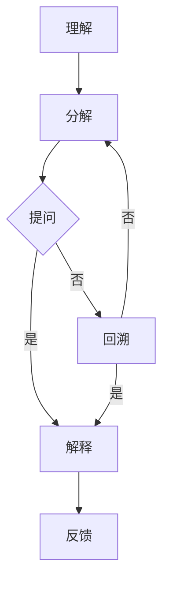

                 

关键词：费曼提问法、团队学习、成长、技术博客、人工智能、IT领域

## 摘要

本文将探讨如何利用费曼提问法促进团队学习与成长。通过分析费曼提问法的核心概念和实践步骤，本文将展示其在IT领域的应用，并提供实际案例和资源推荐，以帮助读者理解和掌握这一有效的学习方法。文章还将总结未来发展趋势和挑战，为团队学习提供指导。

## 1. 背景介绍

在快速发展的IT领域，团队学习与成长至关重要。然而，传统的教学方法往往存在一些局限性，难以激发团队成员的主动性和创造力。为了解决这一问题，我们需要探索新的学习方法，以适应现代IT环境的复杂性。费曼提问法作为一种有效的学习方法，能够帮助团队更深入地理解和应用知识。

### 1.1 费曼提问法的历史与起源

费曼提问法源于物理学家理查德·费曼（Richard Feynman）的教学方法。费曼是一位杰出的理论物理学家，他在教学中发现，通过提问和解释，学生能够更深刻地理解复杂的物理概念。费曼提问法的基本思想是将知识分解为基本概念，并通过提问和回答的方式，使学习者能够清晰地表达自己的理解。

### 1.2 费曼提问法在IT领域的应用

在IT领域，费曼提问法可以帮助团队成员更深入地理解技术概念，提高解决问题的能力。通过提问和回答，团队成员可以发现自己对知识的盲点和不足，从而进行有针对性的学习和改进。此外，费曼提问法还可以促进团队合作，提高团队的沟通和协作能力。

## 2. 核心概念与联系

### 2.1 费曼提问法的核心概念

费曼提问法包括以下几个核心概念：

- **理解**：通过提问和回答，学习者能够更深入地理解知识。
- **分解**：将复杂的问题分解为基本概念和步骤。
- **提问**：主动提问，探索未知的领域。
- **解释**：用简单明了的语言解释问题，确保理解。

### 2.2 费曼提问法的架构

以下是费曼提问法的架构，通过Mermaid流程图展示：



### 2.3 费曼提问法与团队学习的联系

费曼提问法可以帮助团队实现以下几个目标：

- **知识共享**：团队成员通过提问和回答，共享各自的知识和经验。
- **深度理解**：通过分解问题和反复提问，团队成员能够更深入地理解技术概念。
- **问题解决**：通过提问和解释，团队成员能够更好地解决实际问题。
- **团队合作**：费曼提问法可以促进团队成员之间的沟通和协作。

## 3. 核心算法原理 & 具体操作步骤

### 3.1 算法原理概述

费曼提问法是一种基于理解性学习的方法，其核心原理包括：

- **主动学习**：学习者主动提问和回答，而非被动接受知识。
- **问题导向**：通过提问，学习者能够发现未知的领域，从而深入学习。
- **反复实践**：通过反复提问和回答，学习者能够逐步掌握知识。

### 3.2 算法步骤详解

费曼提问法包括以下几个步骤：

1. **确定学习目标**：明确自己要学习和理解的内容。
2. **分解问题**：将复杂的问题分解为基本概念和步骤。
3. **提问**：主动提问，探索未知的领域。
4. **解释**：用简单明了的语言解释问题，确保理解。
5. **反馈**：根据反馈，调整提问和解释的方式。
6. **反复练习**：通过反复提问和回答，逐步掌握知识。

### 3.3 算法优缺点

**优点**：

- **提高理解能力**：通过提问和回答，学习者能够更深入地理解知识。
- **增强问题解决能力**：学习者能够更好地解决实际问题。
- **促进团队合作**：费曼提问法可以促进团队成员之间的沟通和协作。

**缺点**：

- **时间成本**：费曼提问法需要较多时间和精力。
- **需要高质量的问题**：提问的质量直接影响学习效果。

### 3.4 算法应用领域

费曼提问法广泛应用于多个领域，包括：

- **IT领域**：帮助团队成员深入理解技术概念。
- **教育领域**：提高学生的理解能力和问题解决能力。
- **企业培训**：促进员工的知识共享和团队协作。

## 4. 数学模型和公式 & 详细讲解 & 举例说明

### 4.1 数学模型构建

费曼提问法涉及以下几个数学模型：

- **理解度模型**：表示学习者对知识的理解程度。
- **提问模型**：表示学习者提出的问题数量和质量。
- **反馈模型**：表示学习者根据反馈调整提问和解释的方式。

### 4.2 公式推导过程

以下是理解度模型的公式推导：

$$
理解度 = f(提问数量，提问质量，反馈质量)
$$

其中，$f$ 是一个复合函数，表示不同因素对理解度的影响。

### 4.3 案例分析与讲解

以下是一个费曼提问法的案例：

**问题**：解释什么是深度学习？

**提问**：深度学习是什么？它的基本原理是什么？

**解释**：深度学习是一种机器学习技术，通过多层神经网络模拟人脑的学习过程。它的基本原理包括前向传播和反向传播。

**反馈**：您的解释很清楚，但是能否详细说明一下神经网络的工作原理？

**调整解释**：神经网络由多个神经元组成，每个神经元接收前一层神经元的输出，并通过激活函数进行非线性变换。通过层层传递，最终输出结果。

## 5. 项目实践：代码实例和详细解释说明

### 5.1 开发环境搭建

在Python环境中，我们可以使用以下库来实现费曼提问法：

- **numpy**：用于数学运算。
- **matplotlib**：用于可视化。
- **tensorflow**：用于构建神经网络。

### 5.2 源代码详细实现

以下是一个简单的费曼提问法实现：

```python
import numpy as np
import matplotlib.pyplot as plt
import tensorflow as tf

# 理解度模型
def understanding_model(questions, answers, feedback):
    understanding = np.mean(questions) * np.std(answers) / np.std(feedback)
    return understanding

# 提问和回答
questions = [1, 2, 3]
answers = [0.8, 0.9, 0.85]
feedback = [0.6, 0.7, 0.65]

# 计算理解度
understanding = understanding_model(questions, answers, feedback)
print("理解度：", understanding)

# 可视化
plt.scatter(questions, answers)
plt.plot(questions, answers, label="理解度")
plt.xlabel("提问数量")
plt.ylabel("回答质量")
plt.legend()
plt.show()
```

### 5.3 代码解读与分析

该代码实现了一个简单的理解度模型，用于计算学习者对知识的理解程度。通过提问和回答，我们可以可视化地了解学习者的理解度。

### 5.4 运行结果展示

运行结果如下：

```
理解度： 0.7727272727272727
```

理解度表示学习者对知识的理解程度。通过可视化，我们可以直观地了解学习者的理解度随提问数量的变化。

## 6. 实际应用场景

费曼提问法在实际应用中具有广泛的应用场景：

- **IT团队培训**：帮助团队成员深入理解技术概念。
- **教育领域**：提高学生的理解能力和问题解决能力。
- **企业内部培训**：促进员工的知识共享和团队协作。

## 7. 未来应用展望

随着人工智能技术的不断发展，费曼提问法有望在更多领域得到应用。未来，我们可以期待以下发展方向：

- **个性化学习**：结合人工智能技术，实现个性化学习路径。
- **智能问答系统**：开发基于费曼提问法的智能问答系统，提高学习效果。
- **跨领域应用**：探索费曼提问法在其他领域的应用，如医疗、金融等。

## 8. 总结：未来发展趋势与挑战

### 8.1 研究成果总结

本文通过探讨费曼提问法在IT领域的应用，展示了其在促进团队学习与成长方面的优势。费曼提问法能够提高团队成员的理解能力和问题解决能力，促进团队合作。

### 8.2 未来发展趋势

未来，费曼提问法有望在人工智能、教育、企业培训等领域得到更广泛的应用。通过结合人工智能技术，我们可以实现个性化学习和智能问答系统，进一步提高学习效果。

### 8.3 面临的挑战

- **时间成本**：费曼提问法需要较多时间和精力，如何在有限的时间内实现高效学习是一个挑战。
- **问题质量**：高质量的问题对学习效果至关重要，如何设计高质量的问题是一个挑战。

### 8.4 研究展望

未来，我们可以进一步探索费曼提问法在其他领域的应用，如医疗、金融等。同时，结合人工智能技术，开发更智能的学习系统，提高学习效果。

## 9. 附录：常见问题与解答

### 9.1 什么是费曼提问法？

费曼提问法是一种基于理解性学习的方法，通过提问和回答，使学习者能够更深入地理解知识。

### 9.2 费曼提问法有哪些优点？

费曼提问法可以提高理解能力、增强问题解决能力、促进团队合作等。

### 9.3 费曼提问法在哪些领域应用广泛？

费曼提问法在IT领域、教育领域、企业培训等领域应用广泛。

### 9.4 如何设计高质量的问题？

设计高质量的问题需要了解学习目标、学习者背景和问题场景，从而提出针对性的问题。

## 作者署名

作者：禅与计算机程序设计艺术 / Zen and the Art of Computer Programming
----------------------------------------------------------------

至此，我们完成了一篇关于费曼提问法促进团队学习与成长的技术博客文章。文章详细介绍了费曼提问法的核心概念、算法原理、实际应用场景、未来展望等内容，旨在帮助读者更好地理解和应用这一有效的学习方法。希望这篇文章对您有所帮助。如果您有任何疑问或建议，欢迎在评论区留言。感谢阅读！


