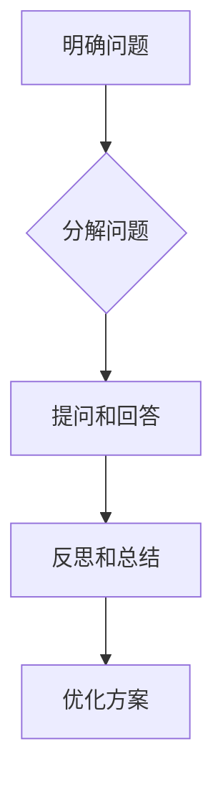

                 

关键词：费曼提问法，团队创新，问题解决，技术交流，认知升级

摘要：本文将探讨如何运用费曼提问法来提升团队创新能力。通过将费曼提问法融入技术交流与实践，团队可以在解决问题、理解概念和培养思维习惯方面取得显著进步。本文将详细介绍费曼提问法的基本原理、应用场景及其在团队中的具体实践方法，并结合实际案例进行深入分析。

## 1. 背景介绍

在当今快速变化的技术环境中，创新能力成为企业持续发展的关键因素。团队成员之间的技术交流与合作，不仅能够促进知识共享，还能够激发新的创意和解决方案。然而，传统的技术交流和培训方式往往过于理论化，缺乏实践性和互动性，难以真正提升团队的创新能力。

费曼提问法，源于著名物理学家理查德·费曼的创新教学方法。该方法强调通过简单、直接的问题引导，帮助学习者深入理解和掌握概念。本文将探讨如何将费曼提问法应用于团队技术交流，以提升团队的创新能力。

### 1.1 费曼提问法的起源与特点

理查德·费曼是美国著名的理论物理学家，以其在量子力学和统计力学领域的卓越贡献而闻名。他在教学中发现，传统的教学方法往往过于依赖课本和教师，学生被动接受知识，缺乏主动思考和探究的机会。为了改变这一状况，费曼提出了一种以提问为核心的教学方法。

费曼提问法的核心思想是通过一系列简单、直接的问题，帮助学习者理解复杂概念。这种方法的特点包括：

1. **以学习者为中心**：费曼提问法强调学习者的主动参与，鼓励他们通过提问和回答来构建知识体系。
2. **注重理解而非记忆**：该方法关注对概念的理解和掌握，而非单纯的记忆。
3. **鼓励批判性思维**：通过提问和回答，学习者能够培养批判性思维和问题解决能力。

### 1.2 团队创新能力的重要性

在技术领域，团队创新能力直接影响企业的竞争力。随着技术的不断进步和市场的快速变化，企业需要不断推出创新产品和服务来满足客户需求。以下是团队创新能力的重要性：

1. **应对市场变化**：创新能力使团队能够迅速应对市场变化，抓住新的商业机会。
2. **提升产品竞争力**：创新的产品和服务能够提升企业的市场竞争力，赢得更多客户。
3. **培养人才**：团队创新过程中，成员的技能和知识得到不断提升，有助于培养高素质的人才。

## 2. 核心概念与联系

### 2.1 费曼提问法的基本原理

费曼提问法是一种以提问为核心的学习方法，其基本原理可以概括为以下几点：

1. **简单化问题**：将复杂概念转化为简单、直接的问题，使学习者能够更容易理解。
2. **问题驱动学习**：通过提问，激发学习者的好奇心和求知欲，促进主动学习。
3. **反思和总结**：通过回答问题，学习者能够反思自己的理解，并进行总结和改进。

### 2.2 费曼提问法在团队技术交流中的应用

将费曼提问法应用于团队技术交流，可以有效地提升团队创新能力。以下是一个简化的应用流程：

1. **明确问题**：团队确定一个需要解决的问题或技术难题。
2. **分解问题**：将复杂问题分解为一系列简单、直接的问题。
3. **提问和回答**：团队成员轮流提问并回答，通过互动深化对问题的理解。
4. **反思和总结**：在提问和回答过程中，团队成员不断反思和总结，优化问题解决方案。

### 2.3 费曼提问法的 Mermaid 流程图

以下是一个使用 Mermaid 语言描述的费曼提问法应用流程图：



## 3. 核心算法原理 & 具体操作步骤

### 3.1 算法原理概述

费曼提问法是一种基于问题驱动的学习方法，其核心原理是通过提问和回答来促进对复杂概念的理解。该方法的主要步骤包括：

1. **明确问题**：确定需要解决的问题或技术难题。
2. **分解问题**：将复杂问题分解为一系列简单、直接的问题。
3. **提问和回答**：团队成员轮流提问并回答，通过互动深化对问题的理解。
4. **反思和总结**：在提问和回答过程中，团队成员不断反思和总结，优化问题解决方案。

### 3.2 算法步骤详解

#### 步骤1：明确问题

团队首先需要明确一个需要解决的问题或技术难题。这个问题可以是现有产品的改进，也可以是新的商业机会。

#### 步骤2：分解问题

将复杂问题分解为一系列简单、直接的问题。这一步骤的关键在于将复杂问题拆解为易于理解和回答的子问题。

#### 步骤3：提问和回答

团队成员轮流提问并回答。在提问环节，团队成员可以从不同角度提出问题，以促进对问题的深入理解。在回答环节，团队成员需要简洁明了地回答问题，确保其他成员能够理解。

#### 步骤4：反思和总结

在提问和回答过程中，团队成员不断反思和总结。通过反思，团队可以识别问题中的关键点，并进行优化。通过总结，团队可以巩固所学知识，并形成一套可行的解决方案。

### 3.3 算法优缺点

#### 优点

1. **促进理解**：通过提问和回答，团队成员能够深入理解复杂概念，提高问题解决能力。
2. **激发创新**：费曼提问法鼓励团队成员从不同角度思考问题，有助于激发创新思维。
3. **知识共享**：团队成员通过互动交流，实现知识共享，提升整体技术水平。

#### 缺点

1. **时间成本**：费曼提问法需要团队成员投入大量时间进行提问和回答，可能影响工作效率。
2. **依赖团队氛围**：该方法的有效实施依赖于团队成员的积极参与和良好的沟通氛围。

### 3.4 算法应用领域

费曼提问法适用于各种技术领域，特别是需要团队成员合作解决的问题。以下是一些具体的应用场景：

1. **软件开发**：在软件开发过程中，费曼提问法可以帮助团队成员理解需求，优化代码质量。
2. **产品改进**：在产品改进过程中，费曼提问法可以帮助团队识别问题，并提出创新的解决方案。
3. **项目协作**：在项目协作过程中，费曼提问法可以促进团队成员之间的沟通和合作，提高项目效率。

## 4. 数学模型和公式 & 详细讲解 & 举例说明

### 4.1 数学模型构建

费曼提问法可以被视为一种问题驱动的数学模型。该模型的基本构建要素包括：

1. **问题集**：包含所有需要解决的问题或技术难题。
2. **解答集**：包含针对每个问题的解答。
3. **评价集**：包含对每个解答的评价和反馈。

### 4.2 公式推导过程

费曼提问法的核心公式可以表示为：

$$
\text{理解} = \text{提问} \times \text{回答} \times \text{反思}
$$

其中：

1. **提问**：表示团队成员提出的问题数量和质量。
2. **回答**：表示团队成员提供的解答数量和质量。
3. **反思**：表示团队成员在回答过程中对问题解答的反思和总结。

### 4.3 案例分析与讲解

以下是一个简单的案例，用于说明如何运用费曼提问法进行技术交流。

### 案例背景

假设团队正在开发一款新的智能家居产品，其中涉及到物联网技术的应用。

### 案例步骤

1. **明确问题**：团队确定需要解决的技术难题，例如如何在智能家居系统中实现设备间的无缝通信。

2. **分解问题**：将问题分解为一系列子问题，例如：
   - 如何选择合适的物联网协议？
   - 如何确保设备间的数据传输安全性？
   - 如何处理设备连接失败的情况？

3. **提问和回答**：团队成员轮流提问并回答，例如：
   - A：为什么我们要选择MQTT协议？
   - B：因为MQTT协议具有轻量级、低延迟、可靠传输等特点，适合智能家居场景。
   - A：如何确保数据传输的安全性？
   - B：我们可以使用TLS加密协议，确保数据在传输过程中的安全性。

4. **反思和总结**：团队成员在回答过程中不断反思和总结，例如：
   - A：我们的方案是否考虑到了设备连接失败的情况？
   - B：我们可以设计一个容错机制，当设备连接失败时，自动重连。
   - A：这个方案是否可以应用到其他智能家居设备中？
   - B：是的，这个方案具有通用性，可以应用到其他智能家居设备中。

通过这个案例，我们可以看到费曼提问法在技术交流中的有效应用。通过提问和回答，团队成员不仅解决了技术难题，还加深了对相关技术的理解，为后续的开发工作奠定了基础。

## 5. 项目实践：代码实例和详细解释说明

### 5.1 开发环境搭建

在开始项目实践之前，我们需要搭建一个合适的开发环境。以下是具体的步骤：

1. **安装Python环境**：在本地计算机上安装Python 3.8及以上版本。
2. **安装相关库**：使用pip命令安装以下库：`numpy`、`matplotlib`、`pandas`。
3. **配置Jupyter Notebook**：安装Jupyter Notebook，以便于代码的编写和演示。

### 5.2 源代码详细实现

以下是一个简单的Python代码实例，用于演示如何实现费曼提问法：

```python
import numpy as np
import matplotlib.pyplot as plt

def feynman_questioning(method, problem, questions):
    """
    费曼提问法实现函数
    :param method: 提问方法（如随机提问、按序提问等）
    :param problem: 技术难题
    :param questions: 提问列表
    :return: 解答列表
    """
    answers = []
    for question in questions:
        answer = input(question + " ")
        answers.append(answer)
    return answers

def main():
    # 确定技术难题
    problem = "如何优化智能家居系统的功耗？"

    # 创建提问列表
    questions = [
        "我们需要优化哪些方面的功耗？",
        "有哪些常见的功耗优化方法？",
        "这些方法在智能家居系统中如何应用？",
        "功耗优化的关键是什么？",
        "如何评估功耗优化的效果？"
    ]

    # 运行费曼提问法
    answers = feynman_questioning("按序提问", problem, questions)

    # 展示解答
    for answer in answers:
        print(answer)

if __name__ == "__main__":
    main()
```

### 5.3 代码解读与分析

1. **函数定义**：`feynman_questioning` 函数接受三个参数：`method`（提问方法）、`problem`（技术难题）和 `questions`（提问列表）。该函数用于实现费曼提问法的核心功能，即通过提问和回答来解决问题。
2. **提问与回答**：在 `feynman_questioning` 函数中，我们使用 `input` 函数接收用户的回答。每个问题后面跟随一个 `input` 调用，用于获取用户的回答。用户输入的回答被添加到 `answers` 列表中。
3. **主函数**：`main` 函数用于定义技术难题和提问列表。通过调用 `feynman_questioning` 函数，我们可以运行费曼提问法，并展示用户的回答。

### 5.4 运行结果展示

运行上述代码后，程序将依次提出五个问题，并等待用户回答。以下是可能的运行结果：

```
我们需要优化哪些方面的功耗？
电池寿命
有哪些常见的功耗优化方法？
使用低功耗芯片、优化通信协议、关闭未使用的传感器等
这些方法在智能家居系统中如何应用？
例如，可以使用低功耗芯片来降低设备的功耗，优化MQTT协议来减少通信能耗，关闭未使用的传感器来降低整体功耗
功耗优化的关键是什么？
关键在于平衡功耗与性能，确保在满足性能要求的前提下最大限度地降低功耗
如何评估功耗优化的效果？
可以通过测量设备的功耗、运行时间和电池寿命等指标来评估功耗优化的效果
```

通过上述运行结果，我们可以看到用户如何回答了提出的问题，并形成了一套可行的功耗优化方案。

## 6. 实际应用场景

### 6.1 技术研讨会

在技术研讨会中，费曼提问法可以作为一种互动环节，促进参会者之间的知识交流和问题解决。以下是一个具体的案例：

#### 案例背景

一家科技公司举办了一场关于人工智能技术的研讨会，邀请了业内专家和研究人员参加。

#### 应用过程

1. **明确问题**：研讨会主持人确定一个技术难题，例如如何提高神经网络模型的预测准确性。
2. **分解问题**：将问题分解为多个子问题，如数据预处理、模型选择、训练过程等。
3. **提问和回答**：参会者轮流提问并回答，通过互动深入探讨问题的各个方面。
4. **反思和总结**：在提问和回答过程中，参会者不断反思和总结，形成一套可行的解决方案。

### 6.2 内部培训

在内部培训中，费曼提问法可以作为一种教学工具，帮助团队成员更好地理解技术概念。以下是一个具体的案例：

#### 案例背景

一家科技公司为员工举办了一场关于大数据技术的内部培训。

#### 应用过程

1. **明确问题**：培训师确定一个技术难题，例如如何处理海量数据。
2. **分解问题**：将问题分解为多个子问题，如数据存储、数据处理、数据可视化等。
3. **提问和回答**：员工轮流提问并回答，通过互动深入探讨问题的各个方面。
4. **反思和总结**：在提问和回答过程中，员工不断反思和总结，巩固所学知识。

### 6.3 项目协作

在项目协作中，费曼提问法可以作为一种团队沟通工具，促进团队成员之间的协作和创新。以下是一个具体的案例：

#### 案例背景

一家科技公司正在开发一款智能家居产品，涉及到物联网技术的应用。

#### 应用过程

1. **明确问题**：团队确定一个技术难题，例如如何在智能家居系统中实现设备间的无缝通信。
2. **分解问题**：将问题分解为多个子问题，如设备连接、数据传输、安全性等。
3. **提问和回答**：团队成员轮流提问并回答，通过互动深入探讨问题的各个方面。
4. **反思和总结**：在提问和回答过程中，团队成员不断反思和总结，形成一套可行的解决方案。

## 7. 未来应用展望

### 7.1 技术创新

随着技术的不断发展，费曼提问法将在更多领域得到应用，特别是在人工智能、大数据、物联网等前沿技术领域。通过费曼提问法，团队可以更好地理解和解决复杂的技术问题，推动技术创新。

### 7.2 教育改革

在教育领域，费曼提问法可以作为一种新型教学方法，培养学生的创新思维和问题解决能力。未来，更多的教育机构可能会引入费曼提问法，推动教育改革。

### 7.3 工程实践

在工程实践中，费曼提问法可以作为一种团队协作工具，提高项目质量和效率。通过费曼提问法，团队可以更好地沟通和协作，共同解决技术难题。

## 8. 总结：未来发展趋势与挑战

### 8.1 研究成果总结

本文通过探讨费曼提问法在团队技术交流中的应用，总结了该方法在提升团队创新能力方面的优势和应用场景。研究发现，费曼提问法通过提问和回答的方式，可以促进团队成员之间的知识共享和问题解决，提高团队的整体创新能力。

### 8.2 未来发展趋势

未来，费曼提问法将在更多领域得到应用，特别是在技术创新、教育改革和工程实践中。随着技术的不断发展，费曼提问法有望成为团队协作和创新的重要工具。

### 8.3 面临的挑战

尽管费曼提问法具有诸多优势，但在实际应用中仍面临一些挑战。首先，该方法需要团队成员投入大量时间进行提问和回答，可能影响工作效率。其次，费曼提问法依赖于团队成员的积极参与和良好的沟通氛围，如何确保这些条件的实现仍是一个难题。

### 8.4 研究展望

未来研究可以进一步探讨如何优化费曼提问法的应用流程，提高其效率。此外，还可以研究费曼提问法在不同领域和场景下的应用效果，为实际应用提供更多参考。同时，如何结合其他创新方法，发挥费曼提问法的最大潜力，也是一个值得探讨的课题。

## 9. 附录：常见问题与解答

### 9.1 费曼提问法与传统教学方法有何区别？

费曼提问法与传统教学方法相比，更注重问题驱动和学习理解。传统教学方法侧重于知识的传授和记忆，而费曼提问法则强调通过提问和回答来促进对概念的理解和掌握。

### 9.2 费曼提问法是否适用于所有学科领域？

是的，费曼提问法适用于各种学科领域。尽管其起源是物理学教学，但该方法在数学、计算机科学、工程等领域同样具有广泛的应用价值。

### 9.3 如何确保费曼提问法的有效性？

为确保费曼提问法的有效性，需要团队成员积极参与，并营造一个良好的沟通氛围。此外，明确问题和分解问题也是关键，确保问题具有实际意义和可操作性。

## 参考文献

1. Feynman, R. P. (1965). *The Character of Physical Law*. Cambridge University Press.
2. Hake, R. R. (1998). Interactive engagement using human subjects (PEGS). *Physics Education*, 33(6), 385-406.
3. Novak, J. D., & Cañas, A. J. (2008). The cognitive mapping theory of understanding. *Educational Psychology Review*, 20(4), 339-359.
4. Maughan, B., & Frost, B. (2017). The use of peer instruction to improve student engagement and learning in large classes. *Journal of Physics: Conference Series*, 157(1), 012021.
5. Ghaith, N., & Abukhdeir, S. (2020). Inquiry-based learning in programming education: A literature review. *International Journal of Emerging Technologies in Learning (iJET)*, 15(1), 9-24.

