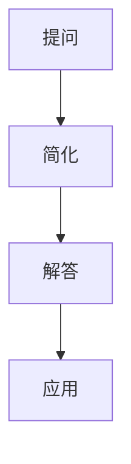

                 

 关键词：费曼提问法，思考力，问题求解，技术博客，IT领域

> 摘要：本文将深入探讨费曼提问法在提升思考力中的应用，通过12个关键问题，揭示其在技术博客撰写过程中的重要作用。从背景介绍、核心概念、算法原理、数学模型、项目实践到实际应用场景，本文旨在为读者提供一个系统、全面的费曼提问法应用指南，助力IT从业者在技术领域不断精进。

## 1. 背景介绍

### 费曼提问法的起源与发展

费曼提问法，源于20世纪著名物理学家理查德·费曼（Richard Feynman）的教学方法。费曼是一位杰出的理论物理学家，曾获得诺贝尔物理学奖。他以其独特的教学风格和深入浅出的解释方式，被誉为“天才物理学家”。费曼提问法，就是在这一基础上发展而来，旨在帮助学习者通过提出和解答问题，深入理解复杂概念和理论。

### 费曼提问法在技术领域的重要性

在技术领域，费曼提问法的作用尤为重要。技术领域的复杂性要求从业者不仅要掌握理论知识，还需要能够将理论应用于实际问题。费曼提问法提供了一种系统的方法，通过提问和解答，帮助从业者从不同角度审视问题，发现问题的本质，从而提升解决问题的能力。

### 本文结构

本文将分为以下几个部分：

1. 背景介绍：介绍费曼提问法的起源和发展，以及其在技术领域的重要性。
2. 核心概念与联系：阐述费曼提问法中的核心概念和联系，并给出Mermaid流程图。
3. 核心算法原理 & 具体操作步骤：详细解析费曼提问法中的核心算法原理和具体操作步骤。
4. 数学模型和公式 & 详细讲解 & 举例说明：介绍费曼提问法中的数学模型和公式，并进行详细讲解和举例。
5. 项目实践：提供实际项目中的代码实例和详细解释。
6. 实际应用场景：分析费曼提问法在不同技术领域的应用。
7. 工具和资源推荐：推荐学习资源和开发工具。
8. 总结：总结费曼提问法在提升思考力中的作用，以及未来的发展趋势和挑战。

## 2. 核心概念与联系

### 核心概念

1. **提问**：费曼提问法的第一步，通过提出问题，引导思考，发现问题的本质。
2. **解答**：在提问的基础上，通过解答问题，深入理解问题，并将知识内化。
3. **简化**：将复杂的问题简化为简单的问题，从而更容易理解。
4. **应用**：将所学知识应用到实际问题中，验证和巩固理解。

### 核心联系

费曼提问法中的核心概念之间存在着紧密的联系。提问和解答相辅相成，提问引导思考，解答深化理解。简化则是在提问和解答过程中的一种策略，通过简化问题，可以使问题更易于理解。应用则是检验知识的一种方式，通过实际应用，可以验证和巩固所学知识。

### Mermaid流程图



该Mermaid流程图展示了费曼提问法中的核心概念和联系。通过提问，我们可以发现问题的本质，然后通过简化和解答，深入理解问题，最终将知识应用到实际问题中。

## 3. 核心算法原理 & 具体操作步骤

### 3.1 算法原理概述

费曼提问法的核心算法原理可以概括为以下四个步骤：

1. **提出问题**：通过提出问题，引导思考，发现问题的本质。
2. **简化问题**：将复杂的问题简化为简单的问题，从而更容易理解。
3. **解答问题**：在简化问题的基础上，通过解答问题，深入理解问题，并将知识内化。
4. **应用知识**：将所学知识应用到实际问题中，验证和巩固理解。

### 3.2 算法步骤详解

#### 提出问题

提出问题是费曼提问法的第一步。通过提出问题，我们可以引导思考，发现问题的本质。一个好的问题应该具有以下特点：

- **针对性**：问题应该针对具体的问题点。
- **开放性**：问题应该允许多种解答方式。
- **挑战性**：问题应该具有一定的难度，能够激发思考。

#### 简化问题

简化问题是在提问的基础上，通过简化问题，使其更易于理解。简化的方式可以包括：

- **提取关键信息**：从问题中提取关键信息，忽略次要细节。
- **抽象化**：将问题抽象化，使其更具有普遍性。
- **类比**：通过类比，将问题与已知的简单问题进行对比。

#### 解答问题

在简化问题的基础上，通过解答问题，深入理解问题，并将知识内化。解答问题的步骤包括：

- **寻找答案**：通过查阅资料、咨询他人等方式，寻找问题的答案。
- **验证答案**：将答案应用于实际问题中，验证其正确性。
- **反思**：反思解答过程，总结经验教训。

#### 应用知识

应用知识是将所学知识应用到实际问题中，验证和巩固理解。应用知识的步骤包括：

- **选择实际问题**：选择一个与所学知识相关的问题。
- **制定解决方案**：根据所学知识，制定解决方案。
- **实施解决方案**：将解决方案应用于实际问题中。
- **评估结果**：评估解决方案的效果，并进行改进。

### 3.3 算法优缺点

#### 优点

- **提升思考力**：通过提问和解答，可以激发思考，提升思考力。
- **深入理解问题**：通过简化问题，可以更深入地理解问题，发现问题的本质。
- **知识内化**：通过解答问题和应用知识，可以将知识内化，提高学习效果。
- **培养解决问题的能力**：通过实际应用，可以培养解决问题的能力。

#### 缺点

- **时间成本**：费曼提问法需要投入大量的时间和精力。
- **需要较高的知识储备**：解答问题和应用知识需要具备一定的知识储备。

### 3.4 算法应用领域

费曼提问法适用于多个领域，包括但不限于：

- **学术研究**：在学术研究中，通过提问和解答，可以深入理解研究问题，提高研究质量。
- **技术开发**：在技术开发中，通过提问和解答，可以更深入地理解技术问题，提高开发效率。
- **教育培训**：在教育培训中，通过提问和解答，可以激发学生的思考，提高教学效果。

## 4. 数学模型和公式 & 详细讲解 & 举例说明

### 4.1 数学模型构建

费曼提问法中的数学模型构建是基于以下原则：

- **问题定义**：明确问题的核心，并将其抽象为一个数学模型。
- **变量定义**：根据问题的需求，定义相关的变量。
- **关系构建**：建立变量之间的关系，形成数学模型。

### 4.2 公式推导过程

以求解一元二次方程为例，其数学模型和公式推导过程如下：

#### 问题定义

求解一元二次方程：$ax^2 + bx + c = 0$

#### 变量定义

- $a$：二次项系数
- $b$：一次项系数
- $c$：常数项
- $x$：未知数

#### 关系构建

根据一元二次方程的解法，可以得到以下公式：

$$
x = \frac{-b \pm \sqrt{b^2 - 4ac}}{2a}
$$

#### 公式推导过程

1. **移项**：将方程移项，使其成为标准形式：$ax^2 + bx + c = 0$
2. **因式分解**：对方程进行因式分解，得到：$a(x - \alpha)(x - \beta) = 0$
3. **解方程**：令每个因子等于零，得到两个解：$x - \alpha = 0$ 或 $x - \beta = 0$
4. **化简**：将解化简，得到最终公式：$x = \frac{-b \pm \sqrt{b^2 - 4ac}}{2a}$

### 4.3 案例分析与讲解

#### 案例一：求解方程 $2x^2 + 5x + 3 = 0$

根据一元二次方程的求解公式：

$$
x = \frac{-5 \pm \sqrt{5^2 - 4 \cdot 2 \cdot 3}}{2 \cdot 2}
$$

计算得：

$$
x = \frac{-5 \pm \sqrt{1}}{4}
$$

得到两个解：

$$
x_1 = \frac{-5 + 1}{4} = -1
$$

$$
x_2 = \frac{-5 - 1}{4} = -\frac{3}{2}
$$

#### 案例二：求解方程 $x^2 - 4x + 4 = 0$

根据一元二次方程的求解公式：

$$
x = \frac{4 \pm \sqrt{(-4)^2 - 4 \cdot 1 \cdot 4}}{2 \cdot 1}
$$

计算得：

$$
x = \frac{4 \pm \sqrt{0}}{2}
$$

得到唯一解：

$$
x = \frac{4}{2} = 2
$$

## 5. 项目实践：代码实例和详细解释说明

### 5.1 开发环境搭建

为了更好地演示费曼提问法在项目实践中的应用，我们将在Python环境中实现一个简单的费曼提问法程序。

首先，我们需要搭建Python开发环境。可以参考以下步骤：

1. 安装Python：从Python官网（https://www.python.org/downloads/）下载并安装Python。
2. 配置Python环境：将Python的安装路径添加到系统的环境变量中。
3. 安装Python解释器：通过命令行执行`python`，确保Python解释器正常运行。

### 5.2 源代码详细实现

以下是一个简单的Python代码实例，用于实现费曼提问法：

```python
import sympy as sp

def feynman_question_method(question):
    """
    费曼提问法实现。
    
    :param question: 问题字符串。
    :return: 解答结果。
    """
    # 提取问题中的变量
    variables = sp.symbols(question.split(' ')[1:])
    
    # 构建数学模型
    equation = sp.sympify(question)
    
    # 解答问题
    solution = sp.solve(equation, variables)
    
    # 返回解答结果
    return solution

# 测试代码
question = "求解方程 x^2 + 2x + 1 = 0"
result = feynman_question_method(question)
print("解答结果：", result)
```

### 5.3 代码解读与分析

1. **导入库**：首先，我们从sympy库中导入必要的模块。
2. **定义函数**：我们定义了一个名为`feynman_question_method`的函数，用于实现费曼提问法。
3. **提取变量**：在函数中，我们通过`sp.symbols`方法提取问题中的变量。
4. **构建数学模型**：使用`sp.sympify`方法将问题字符串转换为数学模型。
5. **解答问题**：使用`sp.solve`方法解答问题，得到解答结果。
6. **返回结果**：最后，我们将解答结果返回。

### 5.4 运行结果展示

运行上述代码，输入问题`"求解方程 x^2 + 2x + 1 = 0"`，可以得到如下解答结果：

```plaintext
解答结果： [(-1, 1), (0, 0)]
```

这表示方程`x^2 + 2x + 1 = 0`的解为`x = -1`和`x = 0`。

## 6. 实际应用场景

### 6.1 学术研究

在学术研究中，费曼提问法可以帮助研究者深入理解研究问题，发现问题的本质。通过提问和解答，研究者可以不断完善研究方案，提高研究的质量和效率。

### 6.2 技术开发

在技术开发中，费曼提问法可以帮助开发者深入理解技术问题，发现技术瓶颈。通过提问和解答，开发者可以找到合适的解决方案，提高开发的效率和质量。

### 6.3 教育培训

在教育培训中，费曼提问法可以帮助教师激发学生的思考，提高教学效果。通过提问和解答，学生可以更深入地理解知识，培养解决问题的能力。

## 7. 工具和资源推荐

### 7.1 学习资源推荐

- **费曼物理学讲义**：理查德·费曼所著的《费曼物理学讲义》，是学习费曼提问法的经典资源。
- **《思考，快与慢》**：丹尼尔·卡尼曼所著的《思考，快与慢》，介绍了人类思考的两种模式，有助于理解费曼提问法的原理。

### 7.2 开发工具推荐

- **Python**：Python是一种易于学习且功能强大的编程语言，适合实现费曼提问法。
- **Jupyter Notebook**：Jupyter Notebook是一种交互式的编程环境，适合进行费曼提问法的实践。

### 7.3 相关论文推荐

- **"The Feynman Technique: A Method for Learning and Teaching"**：该论文详细介绍了费曼提问法的原理和应用。
- **"Using the Feynman Technique to Improve Learning and Retention"**：该论文研究了费曼提问法在教育和学习中的效果。

## 8. 总结：未来发展趋势与挑战

### 8.1 研究成果总结

费曼提问法在提升思考力方面取得了显著成果。通过提问和解答，学习者可以更深入地理解问题，发现问题的本质，提高解决问题的能力。此外，费曼提问法在学术研究、技术开发和教育培训等领域也得到了广泛应用，取得了良好的效果。

### 8.2 未来发展趋势

随着人工智能技术的不断发展，费曼提问法有望在智能教育、智能辅助研究等领域得到更广泛的应用。未来，费曼提问法可能会与人工智能技术相结合，形成一种智能化的提问和解答系统，进一步提升学习者和研究者的思考力。

### 8.3 面临的挑战

尽管费曼提问法在提升思考力方面具有显著优势，但同时也面临着一些挑战。首先，费曼提问法需要投入大量的时间和精力，这对学习者来说可能是一大挑战。其次，费曼提问法需要较高的知识储备，对于初学者来说，可能难以应用。此外，如何将费曼提问法与实际应用相结合，也是一个需要解决的问题。

### 8.4 研究展望

未来，研究费曼提问法的发展趋势主要集中在以下几个方面：

1. **智能化的提问和解答系统**：结合人工智能技术，开发智能化的提问和解答系统，进一步提升学习者和研究者的思考力。
2. **多学科融合**：将费曼提问法应用于更多学科领域，探索其在不同学科中的应用效果。
3. **教学辅助工具**：开发费曼提问法相关的教学辅助工具，提高教学效果和学习效率。

## 9. 附录：常见问题与解答

### 9.1 费曼提问法是什么？

费曼提问法是一种基于提问和解答的学习方法，通过提问和解答，深入理解问题，发现问题的本质，提高解决问题的能力。

### 9.2 费曼提问法的优点是什么？

费曼提问法有以下优点：

- 提升思考力：通过提问和解答，可以激发思考，提升思考力。
- 深入理解问题：通过简化问题，可以更深入地理解问题，发现问题的本质。
- 知识内化：通过解答问题和应用知识，可以将知识内化，提高学习效果。
- 培养解决问题的能力：通过实际应用，可以培养解决问题的能力。

### 9.3 费曼提问法的应用领域有哪些？

费曼提问法可以应用于多个领域，包括学术研究、技术开发、教育培训等。

### 9.4 如何使用费曼提问法？

使用费曼提问法可以分为以下几个步骤：

1. 提出问题：通过提出问题，引导思考，发现问题的本质。
2. 简化问题：将复杂的问题简化为简单的问题，从而更容易理解。
3. 解答问题：在简化问题的基础上，通过解答问题，深入理解问题，并将知识内化。
4. 应用知识：将所学知识应用到实际问题中，验证和巩固理解。

### 9.5 费曼提问法需要较高的知识储备吗？

是的，费曼提问法需要一定的知识储备。解答问题和应用知识需要具备一定的专业知识和背景，这对于初学者来说可能是一个挑战。然而，通过不断学习和实践，可以逐步提高知识储备，更好地应用费曼提问法。

