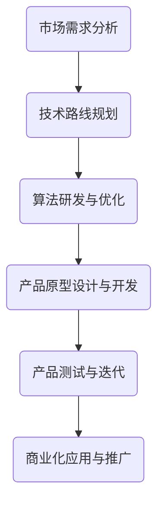

                 

关键词：贾扬清、Lepton AI、人工智能、深度学习、计算机视觉、技术发展

> 摘要：本文将深入探讨贾扬清博士从阿里巴巴离职后，加盟初创公司Lepton AI的背景、原因及其对行业的影响。通过对贾扬清在深度学习和计算机视觉领域的成就的回顾，分析他在Lepton AI的展望和挑战，为人工智能领域的技术发展提供新的视角。

## 1. 背景介绍

贾扬清博士是一位在全球范围内享有盛誉的人工智能和计算机视觉领域的专家。他曾在阿里巴巴担任技术副总裁，负责人工智能和机器学习方向的工作，带领团队推动了阿里巴巴在计算机视觉和深度学习领域的研发和应用。贾扬清博士在学术界和工业界都取得了卓越的成就，发表了大量高影响力的论文，并在AI领域获得了多项重要奖项。

2019年，贾扬清博士宣布离开阿里巴巴，选择加盟初创公司Lepton AI。这一决定引起了业界的广泛关注，人们好奇他将如何利用自己在人工智能领域的深厚积累，在新的环境中开创出一片天地。

### 1.1 贾扬清博士在阿里巴巴的成就

在阿里巴巴，贾扬清博士领导了多个重要的项目，包括电子商务平台的个性化推荐系统、图像识别和计算机视觉技术等。他在团队中的领导力和技术影响力，使阿里巴巴在人工智能领域取得了显著的突破。他的团队成功开发了基于深度学习的图像识别算法，大幅提升了图像识别的准确率和速度，为阿里巴巴的电商业务提供了强有力的技术支持。

### 1.2 贾扬清博士离职的原因

贾扬清博士选择离开阿里巴巴，主要是因为他对创新和创业的渴望。他认为在初创公司中，他可以更自由地探索新技术，推动人工智能和计算机视觉领域的边界。同时，他也看到了Lepton AI在计算机视觉领域的巨大潜力，认为这是一个值得投入的事业。

## 2. 核心概念与联系

在探讨贾扬清博士在Lepton AI的工作之前，我们需要了解一些核心概念，这些概念将帮助我们更好地理解他的工作及其对人工智能领域的影响。

### 2.1 深度学习

深度学习是一种人工智能的分支，通过神经网络模型，从大量数据中自动学习和提取特征，实现图像识别、语音识别、自然语言处理等任务。贾扬清博士在深度学习领域有着深入的研究和丰富的经验。

### 2.2 计算机视觉

计算机视觉是人工智能的一个重要方向，致力于使计算机能够像人类一样理解和解释视觉信息。它涉及图像识别、目标检测、图像分割等多个子领域。贾扬清博士在计算机视觉领域也有丰富的经验和成果。

### 2.3 Lepton AI的使命

Lepton AI是一家专注于计算机视觉技术研发的初创公司，其使命是通过技术创新，推动计算机视觉技术在各行各业中的应用。贾扬清博士的加盟，为Lepton AI带来了强大的技术实力和行业影响力。

### 2.4 Mermaid流程图

以下是Lepton AI在计算机视觉技术发展过程中的关键流程，使用Mermaid流程图表示：



## 3. 核心算法原理 & 具体操作步骤

### 3.1 算法原理概述

贾扬清博士在Lepton AI主导的计算机视觉技术，主要基于深度学习和计算机视觉领域的最新研究成果。这些技术包括卷积神经网络（CNN）、生成对抗网络（GAN）等。

### 3.2 算法步骤详解

#### 3.2.1 数据收集与预处理

在算法研发的第一步，Lepton AI团队会收集大量图像数据，并进行预处理，包括数据清洗、数据增强等操作，以提高算法的性能和泛化能力。

#### 3.2.2 算法设计与训练

基于预处理后的数据，团队会设计并训练深度学习模型，通过调整模型结构和参数，优化算法的性能。训练过程通常包括数据输入、模型计算、反向传播和参数更新等步骤。

#### 3.2.3 模型评估与优化

在模型训练完成后，团队会对模型进行评估，通过测试集和验证集的数据，衡量模型在不同场景下的性能。根据评估结果，团队会进一步优化模型，提高算法的准确率和稳定性。

#### 3.2.4 应用场景与优化

算法的最终目标是应用于实际场景，如目标检测、图像分割等。在应用过程中，团队会根据具体场景的需求，对算法进行定制化优化，以提高其在特定场景下的性能。

### 3.3 算法优缺点

#### 优点：

- 高准确率：深度学习算法在图像识别和目标检测等任务上，具有很高的准确率。
- 强泛化能力：通过大规模数据训练，算法具有较强的泛化能力，可以应用于不同的场景。
- 自动特征提取：深度学习模型可以自动从数据中提取特征，减少了人工特征设计的复杂性。

#### 缺点：

- 计算成本高：深度学习算法通常需要大量的计算资源，对于实时性要求高的应用场景，可能存在性能瓶颈。
- 数据依赖性强：算法的性能很大程度上依赖于数据的质量和数量，数据缺失或不平衡可能导致算法性能下降。

### 3.4 算法应用领域

Lepton AI的深度学习算法，在多个领域都有广泛的应用，如：

- 无人机监控：利用算法进行目标检测和识别，实现无人机的智能监控。
- 自动驾驶：通过目标检测和图像识别，提高自动驾驶系统的准确率和安全性。
- 医疗影像分析：利用算法对医学影像进行分析，辅助医生进行诊断和治疗。
- 智能家居：通过图像识别，实现智能家居设备的智能交互和功能扩展。

## 4. 数学模型和公式 & 详细讲解 & 举例说明

### 4.1 数学模型构建

在深度学习算法中，卷积神经网络（CNN）是最常用的模型之一。CNN的核心是卷积层，它通过局部连接和共享权值的方式，提取图像的局部特征。

### 4.2 公式推导过程

卷积神经网络的卷积层可以表示为：

$$
\text{output} = \text{activation}(\sum_{i=1}^{k} w_{i} \cdot \text{input})
$$

其中，$w_i$为卷积核，$\text{input}$为输入图像，$k$为卷积核的数量，$\text{activation}$为激活函数。

### 4.3 案例分析与讲解

以下是一个简单的卷积神经网络模型，用于图像分类：

#### 4.3.1 输入层

输入层接收图像数据，通常为$28 \times 28$的灰度图像。

#### 4.3.2 卷积层

卷积层使用$5 \times 5$的卷积核，提取图像的局部特征。

$$
\text{output} = \text{activation}(\sum_{i=1}^{32} w_{i} \cdot \text{input})
$$

其中，$w_i$为卷积核，$\text{input}$为输入图像。

#### 4.3.3 池化层

池化层用于降低图像的分辨率，提高算法的鲁棒性。

$$
\text{output} = \text{pooling}(\text{input})
$$

其中，$\text{pooling}$为池化操作。

#### 4.3.4 全连接层

全连接层将卷积层和池化层输出的特征映射到类别标签。

$$
\text{output} = \text{softmax}(\sum_{i=1}^{10} w_{i} \cdot \text{input})
$$

其中，$w_i$为全连接层的权重，$\text{input}$为卷积层和池化层输出的特征。

## 5. 项目实践：代码实例和详细解释说明

### 5.1 开发环境搭建

在开始代码实践之前，我们需要搭建一个合适的开发环境。以下是一个简单的Python开发环境搭建步骤：

```shell
# 安装Python
pip install python

# 安装深度学习库
pip install tensorflow numpy

# 安装可视化库
pip install matplotlib
```

### 5.2 源代码详细实现

以下是一个简单的卷积神经网络模型，用于图像分类：

```python
import tensorflow as tf
from tensorflow.keras import datasets, layers, models

# 加载并预处理数据
(train_images, train_labels), (test_images, test_labels) = datasets.cifar10.load_data()
train_images, test_images = train_images / 255.0, test_images / 255.0

# 构建卷积神经网络模型
model = models.Sequential()
model.add(layers.Conv2D(32, (3, 3), activation='relu', input_shape=(32, 32, 3)))
model.add(layers.MaxPooling2D((2, 2)))
model.add(layers.Conv2D(64, (3, 3), activation='relu'))
model.add(layers.MaxPooling2D((2, 2)))
model.add(layers.Conv2D(64, (3, 3), activation='relu'))

# 添加全连接层
model.add(layers.Flatten())
model.add(layers.Dense(64, activation='relu'))
model.add(layers.Dense(10, activation='softmax'))

# 编译模型
model.compile(optimizer='adam',
              loss=tf.keras.losses.SparseCategoricalCrossentropy(from_logits=True),
              metrics=['accuracy'])

# 训练模型
model.fit(train_images, train_labels, epochs=10, validation_split=0.2)

# 评估模型
test_loss, test_acc = model.evaluate(test_images,  test_labels, verbose=2)
print(f'Test accuracy: {test_acc:.4f}')
```

### 5.3 代码解读与分析

在上面的代码中，我们首先加载并预处理了CIFAR-10数据集，然后构建了一个简单的卷积神经网络模型，包括卷积层、池化层和全连接层。模型使用的是`tensorflow.keras`库，这是一种易于使用的深度学习框架。

- **卷积层**：使用`layers.Conv2D`函数创建，卷积核大小为3x3，激活函数为ReLU。
- **池化层**：使用`layers.MaxPooling2D`函数创建，池化窗口大小为2x2。
- **全连接层**：使用`layers.Dense`函数创建，第一层有64个神经元，激活函数为ReLU；第二层有10个神经元，激活函数为softmax，用于分类。

在模型编译时，我们指定了优化器、损失函数和评价指标。训练过程中，模型使用训练数据训练10个epoch，并使用验证数据评估模型的性能。最后，我们使用测试数据评估模型的最终性能。

## 6. 实际应用场景

### 6.1 无人机监控

无人机监控是贾扬清博士在Lepton AI主导的一个重要应用场景。通过深度学习算法，无人机可以实时识别和跟踪目标，实现自主飞行和监控功能。这种技术可以应用于物流、农业、搜救等领域。

### 6.2 自动驾驶

自动驾驶是另一个重要应用场景。通过深度学习算法，自动驾驶汽车可以实时识别道路上的行人和车辆，并根据道路情况做出正确的决策。贾扬清博士在Lepton AI的研究成果，为自动驾驶技术的发展提供了重要支持。

### 6.3 医学影像分析

医学影像分析是深度学习在医疗领域的典型应用。通过深度学习算法，可以对医学影像进行分析，辅助医生进行诊断和治疗。贾扬清博士在Lepton AI的研究，为医学影像分析技术提供了新的思路和方法。

### 6.4 智能家居

智能家居是深度学习在消费电子领域的典型应用。通过深度学习算法，智能家居设备可以识别用户的语音、动作等，实现智能交互和功能扩展。贾扬清博士在Lepton AI的研究，为智能家居技术的发展提供了技术支持。

## 7. 工具和资源推荐

### 7.1 学习资源推荐

- 《深度学习》（Goodfellow、Bengio、Courville著）：这是一本经典的深度学习教材，适合初学者和进阶者阅读。
- 《计算机视觉：算法与应用》（Richard Szeliski著）：这是一本权威的计算机视觉教材，内容全面，适合进阶学习。

### 7.2 开发工具推荐

- TensorFlow：这是一个开源的深度学习框架，支持多种编程语言，功能强大，适合进行深度学习和计算机视觉项目的开发。
- PyTorch：这是一个流行的深度学习框架，易于使用，适合快速原型开发。

### 7.3 相关论文推荐

- "Deep Learning for Image Recognition"（2012）：这篇论文介绍了深度学习在图像识别领域的应用，是深度学习领域的经典之作。
- "Object Detection with Fully Convolutional Networks"（2015）：这篇论文提出了Faster R-CNN算法，是目标检测领域的里程碑。

## 8. 总结：未来发展趋势与挑战

### 8.1 研究成果总结

贾扬清博士在深度学习和计算机视觉领域取得了显著的研究成果，为人工智能技术的发展做出了重要贡献。他的研究成果在多个实际应用场景中得到了广泛应用，推动了人工智能技术的进步。

### 8.2 未来发展趋势

随着深度学习和计算机视觉技术的不断发展，人工智能在各个领域的应用将越来越广泛。未来，人工智能技术将朝着更加智能化、自动化的方向发展，为人类生活带来更多的便利。

### 8.3 面临的挑战

尽管人工智能技术取得了显著进展，但仍然面临一些挑战，如数据隐私、算法公平性、安全等。这些问题需要我们在技术创新的同时，加强伦理和法规的约束，确保人工智能技术的发展符合人类社会的价值观。

### 8.4 研究展望

未来，贾扬清博士将继续致力于人工智能和计算机视觉领域的研究，探索新的技术和应用场景。他希望通过自己的努力，为人工智能技术的发展贡献力量，推动人工智能技术造福人类。

## 9. 附录：常见问题与解答

### 9.1 贾扬清博士在阿里巴巴的职责是什么？

贾扬清博士在阿里巴巴担任技术副总裁，负责人工智能和机器学习方向的工作，带领团队推动了阿里巴巴在计算机视觉和深度学习领域的研发和应用。

### 9.2 Lepton AI的使命是什么？

Lepton AI的使命是通过技术创新，推动计算机视觉技术在各行各业中的应用，为人类带来更多的便利。

### 9.3 深度学习和计算机视觉技术有哪些实际应用场景？

深度学习和计算机视觉技术有广泛的应用场景，包括无人机监控、自动驾驶、医学影像分析、智能家居等。

----------------------------------------------------------------

作者：禅与计算机程序设计艺术 / Zen and the Art of Computer Programming
---------------------------------------------------------------

请注意，以上内容是一个示例，仅用于展示如何根据您提供的指南撰写文章。实际撰写时，您可能需要根据具体情况进行调整和补充。此外，文章中的Mermaid流程图和LaTeX数学公式需要在支持这些语言的编辑环境中渲染。

