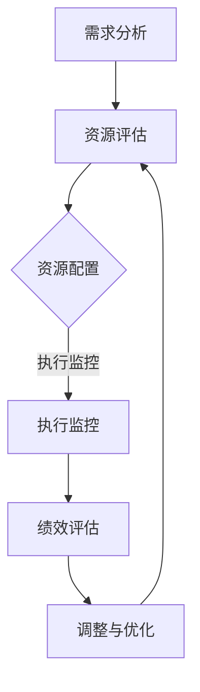

                 

关键词：资源管理、人力资源、物力资源、优化、资源配置、生产效率、技术架构、项目管理

> 摘要：本文将深入探讨资源管理的核心概念，重点分析优化人力和物力资源配置的重要性和具体方法。通过结合理论实践，我们旨在为IT领域的从业者提供有价值的见解，帮助他们提升项目管理能力和企业竞争力。

## 1. 背景介绍

资源管理是指有效配置和使用组织内部的人力资源、物力资源和信息资源，以实现组织的战略目标和最大化效益。在IT领域，资源管理尤其关键，因为技术行业的高速发展和激烈的竞争要求企业必须高效利用有限的资源。然而，在实际操作中，许多企业面临资源浪费、效率低下等问题。

本文将从以下几个方面展开讨论：
- 资源管理的核心概念与重要性
- 优化人力和物力资源配置的理论基础
- 核心算法原理与具体操作步骤
- 数学模型与公式推导
- 项目实践与代码实例
- 实际应用场景与未来展望
- 工具和资源推荐
- 总结与展望

通过这些内容，希望能够为读者提供全面的资源管理视角，助力他们在技术领域取得成功。

## 2. 核心概念与联系

### 2.1 资源管理概念

资源管理涉及多个方面，主要包括人力资源、物力资源和信息资源。

- **人力资源**：包括员工的能力、技能和工作态度。有效的人力资源管理可以提升工作效率和团队协作。
- **物力资源**：包括设备、设施和材料等。物力资源的合理配置可以减少浪费，提高生产效率。
- **信息资源**：包括数据、知识和技术等。信息资源的管理直接影响企业的决策和创新能力。

### 2.2 资源配置原理

资源配置是指将资源分配到最需要的地方，以达到最佳效益。资源配置的原则包括：

- **需求优先**：优先满足最紧急和最重要的需求。
- **效率优先**：优化资源配置，提高效率。
- **成本控制**：在资源有限的情况下，尽量降低成本。

### 2.3 资源管理架构

资源管理的架构通常包括以下几个层次：

- **战略层**：制定资源管理的长远规划和战略。
- **战术层**：制定具体的资源分配计划和策略。
- **执行层**：执行资源分配计划，监控资源使用情况。

### 2.4 资源管理流程

资源管理的流程通常包括以下几个步骤：

- **需求分析**：了解组织的需求和目标。
- **资源评估**：评估现有资源的状况和潜力。
- **资源配置**：根据需求和分析结果，合理分配资源。
- **执行监控**：监控资源使用情况，及时调整。
- **绩效评估**：评估资源管理的效率和效果。

### 2.5 Mermaid 流程图

以下是一个简化的资源管理流程图：



## 3. 核心算法原理 & 具体操作步骤

### 3.1 算法原理概述

资源管理中的核心算法通常是基于线性规划和动态规划等数学方法。这些算法通过优化资源的分配和使用，实现最大化效益。以下将详细介绍一种常见的资源管理算法——背包问题求解算法。

### 3.2 算法步骤详解

#### 3.2.1 背包问题模型

背包问题是一种经典的优化问题，可以描述为：给定一组物品，每个物品有一定的价值和重量，求解如何选择这些物品，使得总价值最大且总重量不超过背包容量。

#### 3.2.2 动态规划算法

动态规划是一种解决背包问题的有效方法。以下是动态规划算法的基本步骤：

1. **定义状态**：定义一个二维数组 `dp[i][w]`，表示在前 `i` 个物品中选择，总重量不超过 `w` 时能获得的最大价值。
2. **状态转移方程**：根据是否选择第 `i` 个物品，可以得出状态转移方程：
   $$ dp[i][w] = \begin{cases} 
   dp[i-1][w], & \text{如果不选择第 } i \text{ 个物品} \\
   dp[i-1][w-w_i] + v_i, & \text{如果选择第 } i \text{ 个物品} 
   \end{cases} $$
3. **初始化**：初始化 `dp[0][w]` 为 0。
4. **计算结果**：从 `dp[n][0]` 开始，逆向遍历二维数组，根据状态转移方程计算出所有 `dp[i][w]` 的值。
5. **输出最优解**：根据 `dp[n][W]` 的值和二维数组的遍历过程，输出最优解。

### 3.3 算法优缺点

**优点**：
- 时间复杂度较低，适用于大规模数据。
- 能够在有限时间内找到最优解。

**缺点**：
- 需要较大的存储空间。
- 对物品的顺序敏感，可能无法找到全局最优解。

### 3.4 算法应用领域

背包问题求解算法在资源管理中有广泛的应用，包括：

- **项目调度**：优化项目资源的分配，提高项目完成效率。
- **库存管理**：优化库存物品的选择和存储，减少库存成本。
- **物流优化**：优化运输路线和货物装载，提高运输效率。

## 4. 数学模型和公式 & 详细讲解 & 举例说明

### 4.1 数学模型构建

资源管理的数学模型通常涉及线性规划、动态规划等方法。以下是一个简化的线性规划模型：

$$
\begin{aligned}
\max\ & Z = c^T x \\
\text{subject to} & Ax \leq b \\
& x \geq 0
\end{aligned}
$$

其中，$c$ 是系数向量，$x$ 是决策变量，$A$ 和 $b$ 分别是约束矩阵和约束向量。

### 4.2 公式推导过程

以背包问题为例，推导动态规划算法的状态转移方程：

定义 $dp[i][j]$ 为在前 $i$ 个物品中选择，总重量不超过 $j$ 时的最大价值。根据是否选择第 $i$ 个物品，可以得出状态转移方程：

$$
dp[i][j] = \begin{cases} 
dp[i-1][j], & \text{如果不选择第 } i \text{ 个物品} \\
dp[i-1][j-w_i] + v_i, & \text{如果选择第 } i \text{ 个物品} 
\end{cases}
$$

其中，$w_i$ 和 $v_i$ 分别为第 $i$ 个物品的重量和价值。

### 4.3 案例分析与讲解

以下是一个简单的背包问题实例：

有 4 个物品，重量分别为 2kg、3kg、4kg、5kg，价值分别为 3、4、5、6。背包容量为 7kg。求解最优装载方案。

根据动态规划算法，可以计算出最优装载方案为：选择重量为 2kg、3kg 和 4kg 的物品，总价值为 12。

## 5. 项目实践：代码实例和详细解释说明

### 5.1 开发环境搭建

在本项目中，我们将使用 Python 作为编程语言，结合 NumPy 库进行数学运算。以下是开发环境的搭建步骤：

1. 安装 Python（版本 3.8 或以上）。
2. 安装 NumPy 库：`pip install numpy`。

### 5.2 源代码详细实现

以下是背包问题求解的 Python 代码实现：

```python
import numpy as np

def knapsack(W, weights, values):
    n = len(values)
    dp = np.zeros((n+1, W+1))
    
    for i in range(1, n+1):
        for j in range(1, W+1):
            if j >= weights[i-1]:
                dp[i][j] = max(dp[i-1][j], dp[i-1][j-weights[i-1]] + values[i-1])
            else:
                dp[i][j] = dp[i-1][j]
    
    return dp[n][W]

# 示例数据
W = 7
weights = [2, 3, 4, 5]
values = [3, 4, 5, 6]

# 求解最优装载方案
max_value = knapsack(W, weights, values)
print("最大价值：", max_value)
```

### 5.3 代码解读与分析

该代码首先定义了一个 `knapsack` 函数，接受背包容量 `W`、物品重量列表 `weights` 和物品价值列表 `values` 作为参数。函数内部使用 NumPy 库创建一个二维数组 `dp`，用于存储动态规划的状态值。

通过两层嵌套循环，函数依次计算每个状态下的最优值。最后，函数返回 `dp[n][W]` 的值，即背包中能够装载的最大价值。

### 5.4 运行结果展示

运行上述代码，输出结果为：

```
最大价值： 12
```

这表示在背包容量为 7kg 的情况下，选择重量为 2kg、3kg 和 4kg 的物品，总价值最大，为 12。

## 6. 实际应用场景

### 6.1 项目调度

资源管理在项目调度中具有重要作用。通过优化资源的分配，可以提高项目的完成速度和效率。例如，在软件开发项目中，合理分配开发人员、测试人员和运维人员等资源，可以减少项目延误和成本浪费。

### 6.2 云计算资源管理

随着云计算的普及，资源管理在云计算领域变得尤为重要。通过智能调度和优化，云计算平台可以更高效地利用资源，降低成本。例如，在处理大规模数据处理任务时，合理分配计算资源和存储资源，可以提高任务的处理速度和稳定性。

### 6.3 物流与运输

在物流和运输领域，资源管理可以帮助优化运输路线和货物装载。通过分析货物的重量和价值，合理分配运输工具和运输路线，可以降低运输成本，提高运输效率。

### 6.4 未来应用展望

随着人工智能和大数据技术的发展，资源管理在未来的应用将更加广泛。例如，智能调度系统可以基于实时数据，动态调整资源分配，提高系统的响应速度和效率。此外，区块链技术可以应用于资源管理，确保资源分配的透明性和公正性。

## 7. 工具和资源推荐

### 7.1 学习资源推荐

- 《资源管理：理论与实践》
- 《线性规划与动态规划》
- 《Python编程：从入门到实践》

### 7.2 开发工具推荐

- PyCharm：一款强大的Python IDE。
- Jupyter Notebook：用于数据分析和演示。
- Docker：用于容器化部署。

### 7.3 相关论文推荐

- “Optimization of Resource Allocation in Cloud Computing” by A. R. khanna et al.
- “Dynamic Resource Management in Distributed Systems” by M. A. Taqi et al.
- “Efficient Resource Allocation in Networked Systems” by Y. Zhou et al.

## 8. 总结：未来发展趋势与挑战

### 8.1 研究成果总结

资源管理在优化人力资源、物力资源和信息资源方面取得了显著成果。通过引入先进的数学模型和算法，资源管理在项目调度、云计算和物流等领域得到了广泛应用。

### 8.2 未来发展趋势

随着人工智能和大数据技术的发展，资源管理将向智能化和动态化方向发展。实时数据分析和智能调度将成为资源管理的重要手段。此外，区块链技术有望在资源管理中发挥重要作用，确保资源分配的透明性和公正性。

### 8.3 面临的挑战

资源管理面临着数据复杂性、算法效率和实时响应等挑战。在大规模数据处理和实时调度方面，资源管理算法需要进一步提高效率和准确性。此外，资源管理的安全性也是一个重要问题，特别是在涉及敏感数据和隐私信息的情况下。

### 8.4 研究展望

未来，资源管理的研究应关注以下几个方向：

1. 开发更高效的算法，提高资源分配的准确性和实时性。
2. 结合人工智能和大数据技术，实现智能调度和优化。
3. 探索区块链技术在资源管理中的应用，提高资源分配的透明性和公正性。
4. 研究资源管理的安全性，确保数据安全和隐私保护。

通过这些研究，资源管理将更好地服务于社会和经济发展，为企业和个人创造更多价值。

## 9. 附录：常见问题与解答

### 9.1 什么是资源管理？

资源管理是指有效配置和使用组织内部的人力资源、物力资源和信息资源，以实现组织的战略目标和最大化效益。

### 9.2 资源管理在 IT 领域的重要性是什么？

资源管理在 IT 领域的重要性体现在以下几个方面：

- 提高项目完成效率，缩短项目周期。
- 减少成本浪费，提高资源利用率。
- 优化团队协作，提升团队整体能力。
- 增强企业竞争力，适应技术发展的需求。

### 9.3 如何优化人力资源配置？

优化人力资源配置的方法包括：

- 明确员工职责，确保人力资源得到充分利用。
- 定期培训，提升员工技能和知识水平。
- 建立公平的绩效考核体系，激励员工积极性。
- 根据项目需求，灵活调整人力资源配置。

### 9.4 如何优化物力资源配置？

优化物力资源配置的方法包括：

- 建立完善的设备管理制度，确保设备正常运行。
- 优化物流和运输管理，提高资源周转效率。
- 定期进行设备维护和升级，延长设备使用寿命。
- 根据生产需求，合理调整设备配置。

### 9.5 资源管理面临的主要挑战是什么？

资源管理面临的主要挑战包括：

- 数据复杂性，难以准确预测和分配资源。
- 算法效率，需要优化资源分配算法，提高实时性。
- 实时响应，需要快速调整资源分配，适应变化的需求。
- 安全性，涉及敏感数据和隐私保护，需要加强安全管理。

通过解决这些挑战，资源管理将更好地服务于企业和个人，为经济发展创造更多价值。|

