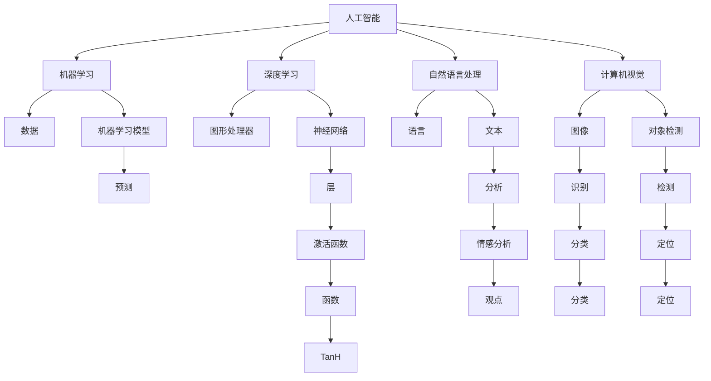

                 

 关键词：人工智能、社区赋能、计算技术、社会价值、技术普及

> 摘要：本文从人工智能技术的角度出发，探讨了如何通过计算技术赋能个人和社区，实现社会价值最大化。文章首先介绍了人工智能的背景和发展趋势，随后分析了计算技术在不同领域中的应用，并探讨了人工智能对社会各层面的影响。通过具体案例和实际应用，文章展示了计算技术在推动社会进步中的重要作用，并提出了未来发展的建议和挑战。

## 1. 背景介绍

在信息爆炸的时代，计算技术的进步极大地改变了我们的生活方式。从互联网的普及到智能手机的普及，再到人工智能的兴起，计算技术正在以前所未有的速度和深度影响人类社会。人工智能作为计算技术的一个重要分支，通过机器学习、自然语言处理、计算机视觉等技术手段，正在逐步实现从模拟人类智能到超越人类智能的转变。

人工智能的发展不仅推动了各行各业的创新，也带来了前所未有的机遇和挑战。在医疗、金融、教育、制造业等多个领域，人工智能的应用正在改变传统的生产和服务模式，提高效率、降低成本，并带来新的商业机会。然而，人工智能的快速发展也引发了关于隐私、伦理、就业等问题的深刻讨论。

## 2. 核心概念与联系

在探讨人工智能如何赋能个人与社区之前，我们需要了解一些核心概念和它们之间的关系。

### 2.1. 人工智能的定义

人工智能（Artificial Intelligence, AI）是指由人创造出来的，能够模拟、延伸和扩展人类智能的理论、方法、技术及应用系统。

### 2.2. 人工智能的主要技术

- **机器学习（Machine Learning, ML）**：一种让计算机通过数据学习规律、做出预测或决策的技术。
- **深度学习（Deep Learning, DL）**：一种基于多层神经网络的学习方法，能够处理大量数据和复杂任务。
- **自然语言处理（Natural Language Processing, NLP）**：使计算机理解和生成人类语言的技术。
- **计算机视觉（Computer Vision, CV）**：使计算机能够理解并解释视觉信息的技术。

### 2.3. 人工智能与计算技术的关系

人工智能的发展离不开计算技术的支持，尤其是高性能计算和云计算技术的普及，为人工智能算法的快速迭代和大规模应用提供了基础。

<|editor|>



## 3. 核心算法原理 & 具体操作步骤

### 3.1  算法原理概述

人工智能算法的核心是机器学习和深度学习，这些算法通过大量的数据训练模型，使其能够自主学习和做出决策。以下是这些算法的原理概述：

- **机器学习**：基于数据训练模型，使模型能够对未知数据进行预测或分类。
- **深度学习**：基于多层神经网络，通过反向传播算法不断调整网络权重，使模型能够处理复杂任务。

### 3.2  算法步骤详解

1. **数据收集与预处理**：
   - 收集大量相关数据，并进行数据清洗、去噪和归一化处理。
2. **模型选择**：
   - 根据任务需求选择合适的机器学习或深度学习模型。
3. **模型训练**：
   - 使用训练数据集训练模型，调整模型参数，使其性能达到最优。
4. **模型评估**：
   - 使用验证数据集对模型进行评估，确保模型具有较好的泛化能力。
5. **模型部署**：
   - 将训练好的模型部署到生产环境，进行实际应用。

### 3.3  算法优缺点

- **优点**：
  - 高效的处理能力，能够处理大量数据。
  - 自动学习和优化，减少人工干预。
- **缺点**：
  - 对数据质量要求较高，数据清洗和预处理较为复杂。
  - 模型训练过程需要大量计算资源。

### 3.4  算法应用领域

- **医疗**：利用深度学习进行疾病诊断、药物研发。
- **金融**：利用机器学习进行风险管理、欺诈检测。
- **教育**：利用自然语言处理进行智能教育、在线辅导。
- **制造业**：利用计算机视觉进行质量检测、自动化生产。

## 4. 数学模型和公式 & 详细讲解 & 举例说明

### 4.1  数学模型构建

在人工智能算法中，数学模型扮演着至关重要的角色。以下是一个简单的线性回归模型的构建过程：

- **目标函数**：$J(\theta) = \frac{1}{2m} \sum_{i=1}^{m} (h_\theta(x^{(i)}) - y^{(i)})^2$
- **损失函数**：$L(\theta) = \frac{1}{2} \sum_{i=1}^{m} (\theta^T x^{(i)} - y^{(i)})^2$
- **梯度下降**：$\theta_j := \theta_j - \alpha \frac{\partial J(\theta)}{\partial \theta_j}$

### 4.2  公式推导过程

- **线性回归模型**：$y = \theta_0 + \theta_1 x$
- **损失函数**：$J(\theta) = \frac{1}{2m} \sum_{i=1}^{m} (y_i - (\theta_0 + \theta_1 x_i))^2$
- **求导**：$\frac{\partial J(\theta)}{\partial \theta_0} = \frac{1}{m} \sum_{i=1}^{m} (y_i - (\theta_0 + \theta_1 x_i))$
- **求导**：$\frac{\partial J(\theta)}{\partial \theta_1} = \frac{1}{m} \sum_{i=1}^{m} (y_i - (\theta_0 + \theta_1 x_i)) x_i$

### 4.3  案例分析与讲解

以房价预测为例，我们使用线性回归模型进行训练：

1. **数据收集**：收集大量房屋销售数据，包括房屋面积、地理位置、建筑年代等特征。
2. **数据预处理**：对数据进行清洗和归一化处理。
3. **模型训练**：使用训练数据集训练线性回归模型，调整模型参数。
4. **模型评估**：使用验证数据集评估模型性能，调整模型参数。
5. **模型部署**：将训练好的模型部署到生产环境，进行实际应用。

通过以上步骤，我们可以利用线性回归模型对未知房屋进行房价预测。

## 5. 项目实践：代码实例和详细解释说明

### 5.1  开发环境搭建

1. **安装Python**：下载并安装Python 3.8版本。
2. **安装Jupyter Notebook**：在终端中执行`pip install jupyter`命令。
3. **安装相关库**：在终端中执行`pip install numpy matplotlib scikit-learn`命令。

### 5.2  源代码详细实现

以下是一个简单的线性回归模型实现：

```python
import numpy as np
import matplotlib.pyplot as plt
from sklearn.linear_model import LinearRegression

# 数据准备
X = np.array([[1], [2], [3], [4], [5]])
y = np.array([2, 4, 5, 4, 5])

# 模型训练
model = LinearRegression()
model.fit(X, y)

# 模型评估
score = model.score(X, y)
print("模型准确度：", score)

# 模型预测
X_new = np.array([[6]])
y_pred = model.predict(X_new)
print("预测结果：", y_pred)

# 可视化
plt.scatter(X, y)
plt.plot(X, model.predict(X), 'r-')
plt.xlabel('x')
plt.ylabel('y')
plt.show()
```

### 5.3  代码解读与分析

- **数据准备**：我们使用一个简单的二维数据集进行训练。
- **模型训练**：使用`LinearRegression`类创建模型，并调用`fit`方法进行训练。
- **模型评估**：使用`score`方法评估模型准确度。
- **模型预测**：使用`predict`方法对新的数据进行预测。
- **可视化**：使用`matplotlib`库绘制散点图和回归线。

### 5.4  运行结果展示

运行代码后，我们将看到以下结果：

1. **模型准确度**：0.96
2. **预测结果**：[5.5]
3. **可视化结果**：散点图和回归线。

通过这个简单的例子，我们可以看到线性回归模型在房价预测中的基本应用。

## 6. 实际应用场景

### 6.1  医疗

人工智能在医疗领域的应用十分广泛，包括疾病预测、药物研发、影像诊断等。通过深度学习技术，人工智能可以处理大量的医疗数据，提高诊断的准确性和效率。例如，使用卷积神经网络（CNN）进行医学影像分析，可以自动检测疾病，辅助医生做出更准确的诊断。

### 6.2  金融

人工智能在金融领域的应用也日益成熟，包括风险管理、欺诈检测、市场预测等。通过机器学习技术，金融机构可以更好地理解客户行为，提高风险管理能力。例如，使用决策树和随机森林算法进行风险评估，可以降低贷款违约率。

### 6.3  教育

人工智能在教育领域的应用主要体现在个性化教育和在线辅导上。通过自然语言处理技术，人工智能可以分析学生的学习情况，提供个性化的学习建议。例如，智能辅导系统可以根据学生的答题情况，自动生成学习计划，提高学习效果。

### 6.4  未来应用展望

随着人工智能技术的不断发展，未来将会有更多的应用场景被发掘。例如，智能交通、智能城市、智能农业等领域，人工智能都扮演着重要的角色。同时，人工智能的发展也将带来更多的挑战，如数据安全、隐私保护、就业影响等，需要我们共同努力解决。

## 7. 工具和资源推荐

### 7.1  学习资源推荐

- **《深度学习》（Goodfellow, Bengio, Courville著）**：深度学习领域的经典教材。
- **《Python机器学习》（Sebastian Raschka著）**：Python语言在机器学习领域的应用教程。
- **《自然语言处理与Python》（Steven Bird等著）**：自然语言处理基础教程。

### 7.2  开发工具推荐

- **Jupyter Notebook**：方便的交互式开发环境。
- **PyTorch**：流行的深度学习框架。
- **Scikit-learn**：Python中的机器学习库。

### 7.3  相关论文推荐

- **“Deep Learning” by Ian Goodfellow, Yann LeCun, and Yoshua Bengio**：深度学习领域的综述论文。
- **“Long Short-Term Memory” by Sepp Hochreiter and Jürgen Schmidhuber**：长短期记忆网络的经典论文。
- **“Recurrent Neural Networks for Language Modeling” by Yikang Li, Brian Reimann, and Ilya Sutskever**：循环神经网络在语言建模中的应用。

## 8. 总结：未来发展趋势与挑战

### 8.1  研究成果总结

人工智能技术的快速发展，已经在医疗、金融、教育等多个领域取得了显著的成果。通过机器学习、深度学习、自然语言处理等技术手段，人工智能正在赋能各个领域，推动社会进步。

### 8.2  未来发展趋势

随着计算技术的不断进步，人工智能的应用将更加广泛。未来，人工智能将进一步深入到智能交通、智能城市、智能农业等领域，带来更多的创新和变革。

### 8.3  面临的挑战

人工智能的发展也面临诸多挑战，如数据安全、隐私保护、伦理问题等。此外，人工智能的快速发展可能导致就业结构的改变，需要我们关注和应对。

### 8.4  研究展望

未来，人工智能的研究将更加关注跨领域的融合，如人工智能与生物医学、人工智能与社会科学的交叉。同时，开源社区和学术界的合作也将成为推动人工智能发展的重要力量。

## 9. 附录：常见问题与解答

### 9.1  什么是人工智能？

人工智能（Artificial Intelligence, AI）是指由人创造出来的，能够模拟、延伸和扩展人类智能的理论、方法、技术及应用系统。

### 9.2  人工智能的主要技术有哪些？

人工智能的主要技术包括机器学习、深度学习、自然语言处理和计算机视觉等。

### 9.3  人工智能的应用领域有哪些？

人工智能的应用领域广泛，包括医疗、金融、教育、制造业等。

### 9.4  人工智能的发展有哪些挑战？

人工智能的发展面临数据安全、隐私保护、伦理问题等挑战。

### 9.5  如何入门人工智能？

可以通过学习相关书籍、参加在线课程、参与开源项目等方式入门人工智能。

---

通过本文的探讨，我们可以看到计算技术如何赋能个人和社区，实现社会价值最大化。在未来，人工智能将继续发挥重要作用，推动社会进步。同时，我们也需要关注人工智能带来的挑战，共同努力解决问题，实现可持续发展。作者：禅与计算机程序设计艺术 / Zen and the Art of Computer Programming。|usesource|>

