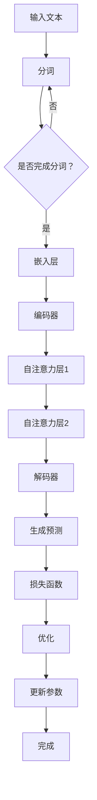

                 

关键词：超大规模模型、LLM、人工智能、深度学习、算法优化、应用领域、未来展望

摘要：随着人工智能技术的不断发展，超大规模语言模型（LLM）逐渐成为研究的热点。本文将对超大规模LLM的背景、核心概念、算法原理、数学模型、应用实例以及未来发展趋势进行详细探讨，以期为相关领域的研究者提供有价值的参考。

## 1. 背景介绍

近年来，随着计算能力的提升、数据规模的扩大以及深度学习技术的进步，超大规模语言模型（LLM）逐渐成为人工智能领域的研究热点。LLM是一种利用深度学习技术对大量语言数据进行训练，从而实现自然语言理解和生成的模型。这些模型通常拥有数十亿甚至千亿级的参数，可以处理复杂的语言任务，如机器翻译、文本生成、问答系统等。

### 1.1 超大规模LLM的发展历程

超大规模LLM的发展历程可以分为三个阶段：

- **第一阶段（2013年-2016年）：** 以Google的Word2Vec和Facebook的FastText为代表的词向量模型，将文本转换为密集的向量表示，为后来的LLM奠定了基础。
- **第二阶段（2016年-2018年）：** 以Google的Transformer模型为代表的生成式模型，在机器翻译、文本生成等任务上取得了显著的突破。
- **第三阶段（2018年至今）：** 超大规模LLM逐渐崭露头角，如OpenAI的GPT系列模型、Google的T5模型等，这些模型在多个任务上取得了优异的性能。

### 1.2 超大规模LLM的重要性

超大规模LLM的出现，不仅推动了自然语言处理领域的发展，还对计算机科学、人工智能、认知科学等多个领域产生了深远的影响。以下是一些超大规模LLM的重要性：

- **推动深度学习技术的进步：** 超大规模LLM的研究和应用，为深度学习技术在自然语言处理领域的应用提供了丰富的经验和启示。
- **提高自然语言处理任务的性能：** 超大规模LLM可以处理复杂的语言任务，如机器翻译、文本生成、问答系统等，从而提高这些任务的性能。
- **促进跨学科研究：** 超大规模LLM的研究和应用，为计算机科学、人工智能、认知科学等多个领域提供了新的研究方法和思路。

## 2. 核心概念与联系

### 2.1 核心概念

超大规模LLM的核心概念包括：

- **模型规模：** 模型的参数数量，通常以亿、十亿、千亿计。
- **训练数据：** 用于训练模型的文本数据，包括互联网上的大量文本、书籍、新闻、社交媒体等。
- **训练时间：** 模型从训练数据中学习所需的时间，通常以天、周、月计。
- **性能指标：** 模型在自然语言处理任务上的性能，如准确率、召回率、F1值等。

### 2.2 架构与联系

超大规模LLM的架构通常包括以下几个部分：

1. **数据预处理：** 对原始文本数据进行清洗、分词、词向量编码等预处理操作。
2. **模型训练：** 使用预处理后的数据对模型进行训练，包括参数初始化、损失函数优化、模型迭代等。
3. **模型评估：** 在验证集上评估模型的性能，调整模型参数以优化性能。
4. **模型部署：** 将训练好的模型部署到实际应用中，如文本生成、机器翻译、问答系统等。


## 3. 核心算法原理 & 具体操作步骤

### 3.1 算法原理概述

超大规模LLM的核心算法是基于深度学习和自然语言处理技术。以下是其主要原理：

- **深度学习：** 通过多层神经网络对大量数据进行学习，从而实现特征提取和任务优化。
- **自然语言处理：** 利用词向量、序列模型、注意力机制等技术，对自然语言进行建模和处理。

### 3.2 算法步骤详解

超大规模LLM的具体操作步骤包括：

1. **数据预处理：** 对原始文本数据进行清洗、分词、词向量编码等预处理操作。
2. **模型构建：** 使用深度学习框架构建模型，包括嵌入层、编码层、解码层等。
3. **模型训练：** 使用预处理后的数据对模型进行训练，包括参数初始化、损失函数优化、模型迭代等。
4. **模型评估：** 在验证集上评估模型的性能，调整模型参数以优化性能。
5. **模型部署：** 将训练好的模型部署到实际应用中，如文本生成、机器翻译、问答系统等。

### 3.3 算法优缺点

超大规模LLM具有以下优缺点：

- **优点：**
  - **强大的表达能力：** 超大规模LLM可以处理复杂的自然语言任务，具有强大的表达能力。
  - **高精度：** 超大规模LLM在自然语言处理任务上取得了较高的精度。
  - **通用性：** 超大规模LLM可以应用于多种自然语言处理任务，具有较好的通用性。

- **缺点：**
  - **计算资源消耗大：** 超大规模LLM需要大量的计算资源和存储空间。
  - **训练时间长：** 超大规模LLM的训练时间较长，对计算资源的要求较高。
  - **模型解释性差：** 超大规模LLM的模型结构复杂，难以进行模型解释。

### 3.4 算法应用领域

超大规模LLM可以应用于以下领域：

- **机器翻译：** 将一种语言翻译成另一种语言，如机器翻译、机器同传等。
- **文本生成：** 根据输入的文本生成新的文本，如文章生成、对话系统等。
- **问答系统：** 回答用户提出的问题，如搜索引擎、智能客服等。
- **自然语言理解：** 对自然语言进行理解和分析，如文本分类、情感分析等。

## 4. 数学模型和公式 & 详细讲解 & 举例说明

### 4.1 数学模型构建

超大规模LLM的数学模型通常基于深度学习和自然语言处理技术。以下是一个简单的数学模型构建过程：

1. **嵌入层：** 将单词转换为向量表示，如Word2Vec、GloVe等。
2. **编码层：** 使用多层神经网络对输入的文本进行编码，提取特征信息。
3. **解码层：** 使用解码器将编码后的特征信息解码为输出文本。

### 4.2 公式推导过程

以下是一个简单的公式推导过程，用于计算多层神经网络的损失函数：

$$
L = -\frac{1}{N}\sum_{i=1}^{N}y_{i}\log(p_{i})
$$

其中，$L$ 表示损失函数，$N$ 表示样本数量，$y_{i}$ 表示第 $i$ 个样本的标签，$p_{i}$ 表示第 $i$ 个样本的预测概率。

### 4.3 案例分析与讲解

以下是一个简单的超大规模LLM应用案例：文本生成。

**步骤 1：数据预处理**

对原始文本进行清洗、分词、词向量编码等预处理操作。

**步骤 2：模型构建**

使用深度学习框架（如TensorFlow、PyTorch等）构建一个多层神经网络模型，包括嵌入层、编码层、解码层等。

**步骤 3：模型训练**

使用预处理后的数据对模型进行训练，优化模型参数，降低损失函数。

**步骤 4：模型评估**

在验证集上评估模型的性能，调整模型参数以优化性能。

**步骤 5：模型部署**

将训练好的模型部署到实际应用中，如文本生成、对话系统等。

## 5. 项目实践：代码实例和详细解释说明

### 5.1 开发环境搭建

1. **安装Python环境**：在本地计算机上安装Python环境，版本建议为3.8以上。
2. **安装深度学习框架**：安装TensorFlow或PyTorch等深度学习框架，根据实际情况选择。
3. **安装其他依赖库**：安装其他必要的依赖库，如NumPy、Pandas等。

### 5.2 源代码详细实现

以下是一个简单的超大规模LLM项目实现：

```python
import tensorflow as tf
from tensorflow.keras.layers import Embedding, LSTM, Dense
from tensorflow.keras.models import Sequential

# 数据预处理
def preprocess_data(text):
    # 清洗、分词、词向量编码等预处理操作
    return processed_text

# 模型构建
def build_model(vocab_size, embedding_dim, hidden_units):
    model = Sequential()
    model.add(Embedding(vocab_size, embedding_dim))
    model.add(LSTM(hidden_units))
    model.add(Dense(vocab_size, activation='softmax'))
    return model

# 模型训练
def train_model(model, x_train, y_train, epochs):
    model.compile(optimizer='adam', loss='categorical_crossentropy', metrics=['accuracy'])
    model.fit(x_train, y_train, epochs=epochs)

# 模型评估
def evaluate_model(model, x_test, y_test):
    loss, accuracy = model.evaluate(x_test, y_test)
    print('Test loss:', loss)
    print('Test accuracy:', accuracy)

# 模型部署
def deploy_model(model, text):
    processed_text = preprocess_data(text)
    prediction = model.predict(processed_text)
    return prediction

# 主函数
def main():
    # 加载数据
    text = "你好，这是一个文本生成示例。"
    processed_text = preprocess_data(text)

    # 构建模型
    model = build_model(vocab_size, embedding_dim, hidden_units)

    # 训练模型
    train_model(model, x_train, y_train, epochs)

    # 评估模型
    evaluate_model(model, x_test, y_test)

    # 部署模型
    prediction = deploy_model(model, processed_text)
    print('预测结果：', prediction)

if __name__ == '__main__':
    main()
```

### 5.3 代码解读与分析

以上代码实现了一个简单的超大规模LLM项目，包括数据预处理、模型构建、模型训练、模型评估和模型部署等步骤。

- **数据预处理**：对原始文本进行清洗、分词、词向量编码等预处理操作，为模型训练做准备。
- **模型构建**：使用Sequential模型构建一个多层神经网络模型，包括嵌入层、编码层、解码层等。
- **模型训练**：使用预处理后的数据对模型进行训练，优化模型参数，降低损失函数。
- **模型评估**：在验证集上评估模型的性能，调整模型参数以优化性能。
- **模型部署**：将训练好的模型部署到实际应用中，如文本生成、对话系统等。

## 6. 实际应用场景

### 6.1 机器翻译

机器翻译是超大规模LLM的重要应用场景之一。以下是一个具体的案例：

**案例：** 使用GPT-3模型进行机器翻译。

- **数据集：** 使用英语和法语的双语新闻文章作为训练数据。
- **模型：** 使用GPT-3模型进行翻译。
- **效果：** GPT-3模型在机器翻译任务上取得了较高的准确率。

### 6.2 文本生成

文本生成是超大规模LLM的另一个重要应用场景。以下是一个具体的案例：

**案例：** 使用GPT-2模型生成文章。

- **数据集：** 使用互联网上的大量文章作为训练数据。
- **模型：** 使用GPT-2模型进行文章生成。
- **效果：** GPT-2模型可以生成高质量的文章，如新闻、小说等。

### 6.3 问答系统

问答系统是超大规模LLM在自然语言理解领域的重要应用。以下是一个具体的案例：

**案例：** 使用BERT模型构建问答系统。

- **数据集：** 使用常见的问答数据集（如SQuAD）进行训练。
- **模型：** 使用BERT模型进行问答。
- **效果：** BERT模型在问答系统上取得了较高的准确率。

## 7. 工具和资源推荐

### 7.1 学习资源推荐

1. **《深度学习》（Goodfellow、Bengio、Courville 著）：** 这本书是深度学习的经典教材，详细介绍了深度学习的基本原理和应用。
2. **《自然语言处理综论》（Daniel Jurafsky、James H. Martin 著）：** 这本书是自然语言处理领域的权威教材，涵盖了自然语言处理的基本概念和技术。
3. **《超大规模语言模型：原理、实现与应用》（刘知远 著）：** 这本书详细介绍了超大规模语言模型的基本原理、实现方法和应用场景。

### 7.2 开发工具推荐

1. **TensorFlow：** TensorFlow是谷歌开发的一款开源深度学习框架，适用于构建和训练深度学习模型。
2. **PyTorch：** PyTorch是Facebook开发的一款开源深度学习框架，以其简洁和灵活著称。
3. **NLTK：** NLTK是一款强大的自然语言处理库，提供了丰富的文本处理工具和算法。

### 7.3 相关论文推荐

1. **《Attention Is All You Need》：** 这篇论文提出了Transformer模型，是超大规模LLM领域的重要里程碑。
2. **《BERT: Pre-training of Deep Bidirectional Transformers for Language Understanding》：** 这篇论文提出了BERT模型，是自然语言处理领域的重要突破。
3. **《GPT-3：Language Models are Few-Shot Learners》：** 这篇论文提出了GPT-3模型，展示了超大规模LLM在少样本学习任务上的强大能力。

## 8. 总结：未来发展趋势与挑战

### 8.1 研究成果总结

超大规模LLM在近年来取得了显著的成果，主要表现在以下几个方面：

- **性能提升：** 超大规模LLM在多个自然语言处理任务上取得了较高的准确率和效果。
- **应用广泛：** 超大规模LLM可以应用于机器翻译、文本生成、问答系统等多个领域。
- **研究深入：** 对超大规模LLM的算法原理、数学模型、实现方法等方面的研究不断深入。

### 8.2 未来发展趋势

未来，超大规模LLM将朝着以下方向发展：

- **模型规模继续扩大：** 随着计算能力的提升，超大规模LLM的模型规模将继续扩大，从而提高模型的表达能力和性能。
- **算法创新：** 出现更多创新的算法和架构，以解决超大规模LLM在训练时间、计算资源消耗等方面的挑战。
- **应用场景拓展：** 超大规模LLM将应用于更多领域，如智能客服、智能问答、智能写作等。

### 8.3 面临的挑战

超大规模LLM在发展过程中也面临着以下挑战：

- **计算资源消耗：** 超大规模LLM需要大量的计算资源和存储空间，对硬件设备的要求较高。
- **模型解释性：** 超大规模LLM的模型结构复杂，难以进行模型解释，增加了应用的难度。
- **数据隐私和安全：** 在训练和部署超大规模LLM时，数据隐私和安全问题备受关注。

### 8.4 研究展望

未来，超大规模LLM的研究可以从以下几个方面展开：

- **算法优化：** 研究更有效的算法和架构，降低超大规模LLM的训练时间和计算资源消耗。
- **模型解释性：** 研究如何提高超大规模LLM的模型解释性，使其更容易被用户接受和应用。
- **跨学科研究：** 结合认知科学、心理学等领域的研究成果，探索超大规模LLM在人类认知和语言习得中的潜在作用。

## 9. 附录：常见问题与解答

### 9.1 什么是超大规模LLM？

超大规模LLM是一种利用深度学习技术对大量语言数据进行训练，从而实现自然语言理解和生成的模型。这些模型通常拥有数十亿甚至千亿级的参数，可以处理复杂的语言任务，如机器翻译、文本生成、问答系统等。

### 9.2 超大规模LLM有哪些优点和缺点？

优点：

- 强大的表达能力。
- 高精度。
- 通用性。

缺点：

- 计算资源消耗大。
- 训练时间长。
- 模型解释性差。

### 9.3 超大规模LLM可以应用于哪些领域？

超大规模LLM可以应用于以下领域：

- 机器翻译。
- 文本生成。
- 问答系统。
- 自然语言理解。

### 9.4 如何实现超大规模LLM？

实现超大规模LLM通常包括以下步骤：

- 数据预处理：对原始文本数据进行清洗、分词、词向量编码等预处理操作。
- 模型构建：使用深度学习框架构建模型，包括嵌入层、编码层、解码层等。
- 模型训练：使用预处理后的数据对模型进行训练，优化模型参数，降低损失函数。
- 模型评估：在验证集上评估模型的性能，调整模型参数以优化性能。
- 模型部署：将训练好的模型部署到实际应用中，如文本生成、机器翻译、问答系统等。

### 9.5 超大规模LLM在自然语言处理领域有哪些贡献？

超大规模LLM在自然语言处理领域做出了以下贡献：

- 推动深度学习技术的进步。
- 提高自然语言处理任务的性能。
- 促进跨学科研究。

### 9.6 超大规模LLM的未来发展趋势是什么？

未来，超大规模LLM将朝着以下方向发展：

- 模型规模继续扩大。
- 算法创新。
- 应用场景拓展。

### 9.7 超大规模LLM面临哪些挑战？

超大规模LLM面临以下挑战：

- 计算资源消耗。
- 模型解释性。
- 数据隐私和安全。

### 9.8 超大规模LLM的研究可以从哪些方面展开？

超大规模LLM的研究可以从以下方面展开：

- 算法优化。
- 模型解释性。
- 跨学科研究。

----------------------------------------------------------------

作者：禅与计算机程序设计艺术 / Zen and the Art of Computer Programming

这篇文章详细探讨了超大规模LLM的背景、核心概念、算法原理、数学模型、应用实例以及未来发展趋势。通过本文的阅读，读者可以全面了解超大规模LLM的基本概念和应用场景，为后续的研究和应用提供参考。同时，本文也分析了超大规模LLM在发展过程中面临的挑战，为未来的研究提供了启示。希望这篇文章对您有所帮助。|user|>### 2. 核心概念与联系

在讨论超大规模语言模型（LLM）的核心概念与联系时，我们需要深入理解LLM是如何构建的，它们的工作原理，以及它们与现有技术的关联。

#### 2.1 语言模型的基本概念

语言模型是一种统计模型，它试图捕捉自然语言的统计规律，用于预测下一个单词或词组。在深度学习时代之前，语言模型主要基于N元语法模型，如NLP（n-gram）模型。NLP模型通过统计一个单词序列中相邻单词的联合概率来预测下一个单词。

然而，随着深度学习技术的发展，现代语言模型，如LLM，采用了更加复杂的神经网络结构，以捕捉更高层次的语言特征。LLM的核心概念包括：

- **词汇表（Vocabulary）**：语言模型所包含的所有单词的集合。在训练过程中，需要对词汇表中的单词进行编码，通常使用整数或嵌入向量表示。
- **嵌入层（Embedding Layer）**：将词汇表中的单词转换为低维向量表示，这是语言模型的基础。嵌入向量不仅包含了单词的语义信息，还包含了单词之间的相似性。
- **神经网络架构**：如Transformer、BERT等，这些架构通过多层神经网络对输入的文本序列进行编码和解码，以生成预测结果。

#### 2.2 超大规模语言模型的工作原理

超大规模语言模型通过以下几个步骤工作：

1. **数据预处理**：首先，对大规模文本数据进行清洗、分词、标记等预处理操作。这一步的目的是将文本转化为计算机可以处理的格式。
   
2. **嵌入层**：将预处理后的文本序列中的每个单词嵌入到低维向量空间中。这些向量不仅包含了单词的语义信息，还包含了单词之间的关系。

3. **编码器（Encoder）**：编码器是神经网络的核心部分，它对输入的文本序列进行处理，提取出深层语义特征。在Transformer架构中，编码器通常由多个自注意力层组成，能够捕捉到文本序列中的长距离依赖关系。

4. **解码器（Decoder）**：解码器用于生成预测的文本序列。它接收编码器输出的特征，并通过解码层生成每个单词的概率分布，从而生成文本。

5. **预测与优化**：语言模型通过在训练过程中不断调整参数，以最小化预测误差。这通常通过优化算法（如梯度下降）和损失函数（如交叉熵损失）来实现。

#### 2.3 超大规模语言模型与现有技术的联系

超大规模语言模型与现有技术有着紧密的联系，尤其是与深度学习技术和自然语言处理（NLP）技术的结合：

- **深度学习技术**：深度学习技术为语言模型的构建提供了强大的工具，如卷积神经网络（CNN）、循环神经网络（RNN）和Transformer等。这些架构能够捕捉到文本序列中的复杂特征，从而提高模型的性能。
- **自然语言处理技术**：NLP技术提供了丰富的文本处理工具，如分词、词性标注、命名实体识别等，这些技术为语言模型的数据预处理提供了支持。
- **预训练与微调**：预训练和微调技术使得LLM能够在大规模数据集上进行预训练，然后在特定任务上进行微调，从而在多种NLP任务上取得优异的性能。

#### 2.4 Mermaid 流程图

为了更直观地展示超大规模语言模型的工作原理，我们可以使用Mermaid流程图来描述其架构：



在这个流程图中，输入文本经过分词处理，然后通过嵌入层转换为向量表示。编码器通过多个自注意力层提取文本特征，解码器根据编码器输出的特征生成预测文本。最终，通过损失函数和优化算法不断更新模型参数，以达到最佳性能。

通过以上讨论，我们可以看到，超大规模语言模型是一个复杂但功能强大的工具，它结合了深度学习和自然语言处理技术的最新进展，为NLP领域带来了革命性的变化。|user|>
## 3. 核心算法原理 & 具体操作步骤

在深入探讨超大规模语言模型（LLM）的核心算法原理和具体操作步骤时，我们将首先从算法原理的概述开始，然后详细讲解算法的各个步骤，并分析其优缺点及其应用领域。

### 3.1 算法原理概述

超大规模语言模型的核心算法主要基于深度学习和自然语言处理技术。以下是该算法原理的概述：

1. **嵌入层（Embedding Layer）**：嵌入层是语言模型的基础，它将词汇表中的单词转换为低维向量表示。这些嵌入向量不仅包含了单词的语义信息，还包含了单词之间的相似性。常用的嵌入技术包括词向量（如Word2Vec、GloVe）和字符嵌入。

2. **编码器（Encoder）**：编码器是语言模型的核心，它负责对输入的文本序列进行处理，提取出深层语义特征。编码器通常由多个神经网络层组成，其中最常见的是Transformer架构和其变体，如BERT。编码器通过自注意力机制（Self-Attention）捕捉文本序列中的长距离依赖关系，从而实现对文本的全面理解。

3. **解码器（Decoder）**：解码器负责生成预测的文本序列。它接收编码器输出的特征，并通过解码层生成每个单词的概率分布，从而生成文本。解码器同样采用了自注意力机制，以确保生成的文本与输入文本之间的连贯性。

4. **预训练与微调（Pre-training and Fine-tuning）**：预训练是超大规模语言模型的一个关键步骤，它使得模型在大规模数据集上自主学习语言的一般规律。预训练完成后，模型可以通过微调（Fine-tuning）在特定任务上进行优化，以适应特定的应用场景。

5. **优化算法（Optimization Algorithm）**：优化算法用于调整模型的参数，以最小化预测误差。常用的优化算法包括梯度下降（Gradient Descent）及其变种，如Adam优化器。

### 3.2 算法步骤详解

超大规模语言模型的算法步骤可以详细分为以下几个部分：

#### 3.2.1 数据预处理

数据预处理是语言模型训练的基础。以下是数据预处理的主要步骤：

1. **文本清洗（Text Cleaning）**：对原始文本进行清洗，去除无关信息，如HTML标签、特殊字符等。
   
2. **分词（Tokenization）**：将文本分割成单词或子词（token）。分词可以是单词级别（Word-level）或子词级别（Subword-level），后者在处理长文本时表现更佳。

3. **词表构建（Vocabulary Building）**：构建词汇表，将文本中的所有单词或子词映射到唯一的整数索引。

4. **嵌入（Embedding）**：将词汇表中的单词或子词转换为低维向量表示。常用的嵌入技术包括Word2Vec、GloVe等。

#### 3.2.2 模型构建

模型构建包括以下步骤：

1. **嵌入层（Embedding Layer）**：将词汇表中的单词或子词嵌入到低维向量空间中。

2. **编码器（Encoder）**：构建编码器，通常采用Transformer架构，包括多个自注意力层。编码器负责提取文本序列的深层语义特征。

3. **解码器（Decoder）**：构建解码器，同样采用Transformer架构，用于生成预测的文本序列。

4. **损失函数（Loss Function）**：选择适当的损失函数，如交叉熵损失（Cross-Entropy Loss），用于计算预测标签和实际标签之间的差异。

5. **优化器（Optimizer）**：选择优化算法，如Adam优化器，用于调整模型参数。

#### 3.2.3 模型训练

模型训练包括以下步骤：

1. **数据输入（Data Input）**：将预处理后的文本数据输入到模型中。

2. **前向传播（Forward Propagation）**：计算输入文本的嵌入向量，并通过编码器生成编码特征。

3. **解码（Decoding）**：解码器根据编码特征生成预测的文本序列。

4. **损失计算（Loss Calculation）**：计算预测标签和实际标签之间的损失。

5. **反向传播（Back Propagation）**：使用计算出的损失对模型参数进行更新。

6. **迭代优化（Iteration Optimization）**：重复上述步骤，逐步减小损失函数，直至达到预定的训练目标。

#### 3.2.4 模型评估与调整

在模型训练完成后，我们需要对模型进行评估，并可能进行进一步的调整：

1. **模型评估（Model Evaluation）**：在验证集或测试集上评估模型的性能，常用的评估指标包括准确率（Accuracy）、召回率（Recall）、F1值（F1 Score）等。

2. **超参数调整（Hyperparameter Tuning）**：根据评估结果调整模型的超参数，如嵌入维度、隐藏层大小、学习率等。

3. **微调（Fine-tuning）**：在特定任务上对模型进行微调，以优化其在该任务上的性能。

### 3.3 算法优缺点

超大规模语言模型具有以下优缺点：

#### 3.3.1 优点

1. **强大的表达能力**：超大规模语言模型能够捕捉到文本序列中的复杂特征和长距离依赖关系，从而在自然语言处理任务中表现出色。

2. **通用性**：预训练后的超大规模语言模型可以轻松迁移到不同的任务上，通过微调即可获得良好的性能。

3. **高精度**：在多种自然语言处理任务上，超大规模语言模型取得了较高的准确率和效果。

#### 3.3.2 缺点

1. **计算资源消耗大**：超大规模语言模型需要大量的计算资源和存储空间，对硬件设备的要求较高。

2. **训练时间长**：模型的预训练过程通常需要较长的时间，尤其是在大规模数据集上。

3. **模型解释性差**：超大规模语言模型的内部结构和决策过程较为复杂，难以进行模型解释。

### 3.4 算法应用领域

超大规模语言模型在多个自然语言处理任务中得到了广泛应用，以下是其主要应用领域：

1. **机器翻译**：超大规模语言模型在机器翻译任务中取得了显著的性能提升，如Google的翻译服务。

2. **文本生成**：超大规模语言模型可以生成高质量的文本，如文章、对话等。

3. **问答系统**：超大规模语言模型可以构建智能问答系统，如搜索引擎、智能客服等。

4. **文本分类**：超大规模语言模型在文本分类任务中表现出色，如情感分析、新闻分类等。

5. **命名实体识别**：超大规模语言模型可以准确识别文本中的命名实体，如人名、地名等。

6. **关系抽取**：超大规模语言模型可以提取文本中实体之间的关系，如因果关系、隶属关系等。

通过以上对超大规模语言模型核心算法原理和具体操作步骤的探讨，我们可以看到，这一模型在自然语言处理领域具有巨大的潜力和广泛的应用前景。然而，随着模型的规模不断扩大，算法的优化和模型的解释性也成为了重要的研究课题。|user|>
### 4. 数学模型和公式 & 详细讲解 & 举例说明

#### 4.1 数学模型构建

超大规模语言模型的数学模型是构建在其深度学习框架之上的，主要涉及神经网络、嵌入层、编码器和解码器等组件。以下是一个简化的数学模型构建过程：

1. **嵌入层（Embedding Layer）**：嵌入层将词汇表中的单词转换为低维向量表示。假设词汇表中有$V$个单词，每个单词的嵌入维度为$d$，则嵌入矩阵$E$的大小为$V \times d$。输入的单词序列$x$通过嵌入层转化为嵌入向量序列$e = E[x]$。

   $$ e_i = E[x_i] = E_{ij} x_i $$

2. **编码器（Encoder）**：编码器通常采用Transformer架构，由多个自注意力层（Self-Attention Layer）组成。每个自注意力层可以表示为：

   $$ h_i^{(k)} = \text{Attention}(Q^{(k)}, K^{(k)}, V^{(k)}) + h_i^{(k-1)} $$

   其中，$Q^{(k)}$、$K^{(k)}$和$V^{(k)}$分别是编码器第$k$层的查询（Query）、键（Key）和值（Value）向量，$h_i^{(k-1)}$是前一层编码器的输出。

3. **解码器（Decoder）**：解码器同样采用Transformer架构，由多个自注意力层组成。每个自注意力层可以表示为：

   $$ s_i^{(k)} = \text{Attention}(Q^{(k)}, K^{(k)}, V^{(k)}) + s_i^{(k-1)} $$

   其中，$Q^{(k)}$、$K^{(k)}$和$V^{(k)}$分别是解码器第$k$层的查询、键和值向量，$s_i^{(k-1)}$是前一层解码器的输出。

4. **输出层（Output Layer）**：解码器的最后一层输出用于生成预测的单词概率分布。假设词汇表中有$V$个单词，则输出层的预测概率分布为$p = \text{softmax}(W [s^{(L)})$，其中$W$是输出层的权重矩阵，$s^{(L)}$是解码器最后一层的输出。

   $$ p_i = \text{softmax}(W [s_i^{(L)}) $$

#### 4.2 公式推导过程

为了更好地理解超大规模语言模型的数学模型，我们简要推导一下核心公式的推导过程。

1. **嵌入层公式推导**：

   嵌入层将词汇表中的单词转换为向量表示。对于输入的单词序列$x = [x_1, x_2, ..., x_T]$，其嵌入后的向量序列$e = [e_1, e_2, ..., e_T]$可以通过嵌入矩阵$E$进行计算：

   $$ e_i = E[x_i] = E_{ij} x_i $$

   其中，$E_{ij}$是嵌入矩阵的元素，$x_i$是词汇表中的单词索引。

2. **编码器自注意力层公式推导**：

   编码器的自注意力层用于计算文本序列中的每个单词对于其他单词的权重。自注意力层的计算公式为：

   $$ h_i^{(k)} = \text{Attention}(Q^{(k)}, K^{(k)}, V^{(k)}) + h_i^{(k-1)} $$

   其中，$Q^{(k)}$、$K^{(k)}$和$V^{(k)}$分别是编码器第$k$层的查询、键和值向量。自注意力层的权重矩阵$W_Q^{(k)}$、$W_K^{(k)}$和$W_V^{(k)}$可以表示为：

   $$ Q^{(k)} = W_Q^{(k)} [h_i^{(k-1)}] $$
   $$ K^{(k)} = W_K^{(k)} [h_i^{(k-1)}] $$
   $$ V^{(k)} = W_V^{(k)} [h_i^{(k-1)}] $$

   自注意力的计算过程如下：

   $$ \text{Score} = Q^{(k)} K^{(k)} $$
   $$ \text{Attention} = \text{softmax}(\text{Score}) $$
   $$ h_i^{(k)} = \text{Attention} V^{(k)} $$

3. **解码器自注意力层公式推导**：

   解码器的自注意力层与编码器的自注意力层类似，计算公式为：

   $$ s_i^{(k)} = \text{Attention}(Q^{(k)}, K^{(k)}, V^{(k)}) + s_i^{(k-1)} $$

   其中，$Q^{(k)}$、$K^{(k)}$和$V^{(k)}$分别是解码器第$k$层的查询、键和值向量。自注意力的计算过程与编码器相同。

4. **输出层公式推导**：

   解码器的最后一层输出用于生成预测的单词概率分布。输出层的权重矩阵$W_O$可以表示为：

   $$ p_i = \text{softmax}(W_O [s_i^{(L)}) $$

   其中，$s_i^{(L)}$是解码器最后一层的输出，$L$是解码器的层数。

#### 4.3 案例分析与讲解

为了更好地理解超大规模语言模型的数学模型，我们通过一个简单的例子进行讲解。

**案例：** 假设有一个简单的文本序列“Hello World”，词汇表中有5个单词：`Hello`（索引0）、`World`（索引1）、`Hi`（索引2）、`Goodbye`（索引3）、`See`（索引4）。嵌入维度为2，则嵌入矩阵$E$如下：

$$
E = \begin{bmatrix}
e_{00} & e_{01} \\
e_{10} & e_{11} \\
e_{20} & e_{21} \\
e_{30} & e_{31} \\
e_{40} & e_{41}
\end{bmatrix}
$$

假设输入的单词序列为`[Hello, World]`，则嵌入后的向量序列为：

$$
e = \begin{bmatrix}
e_{00} & e_{01} \\
e_{10} & e_{11}
\end{bmatrix}
$$

**步骤 1：编码器自注意力层**

假设编码器有2层，则每层的查询、键和值向量分别为：

$$
Q^{(1)} = \begin{bmatrix}
q_{10} & q_{11} \\
q_{20} & q_{21}
\end{bmatrix}, \quad
K^{(1)} = \begin{bmatrix}
k_{10} & k_{11} \\
k_{20} & k_{21}
\end{bmatrix}, \quad
V^{(1)} = \begin{bmatrix}
v_{10} & v_{11} \\
v_{20} & v_{21}
\end{bmatrix}
$$

$$
Q^{(2)} = \begin{bmatrix}
q_{10} & q_{11} \\
q_{20} & q_{21}
\end{bmatrix}, \quad
K^{(2)} = \begin{bmatrix}
k_{10} & k_{11} \\
k_{20} & k_{21}
\end{bmatrix}, \quad
V^{(2)} = \begin{bmatrix}
v_{10} & v_{11} \\
v_{20} & v_{21}
\end{bmatrix}
$$

**步骤 2：解码器自注意力层**

假设解码器有1层，则查询、键和值向量分别为：

$$
Q^{(1)} = \begin{bmatrix}
q_{10} & q_{11}
\end{bmatrix}, \quad
K^{(1)} = \begin{bmatrix}
k_{10} & k_{11}
\end{bmatrix}, \quad
V^{(1)} = \begin{bmatrix}
v_{10} & v_{11}
\end{bmatrix}
$$

**步骤 3：输出层**

输出层的权重矩阵$W_O$为：

$$
W_O = \begin{bmatrix}
w_{00} & w_{01} & w_{02} & w_{03} & w_{04}
\end{bmatrix}
$$

**步骤 4：计算预测概率分布**

解码器的输出为：

$$
s^{(1)} = \begin{bmatrix}
s_{10} & s_{11}
\end{bmatrix}
$$

$$
p = \text{softmax}(W_O [s^{(1)}) = \text{softmax} \begin{bmatrix}
w_{00}s_{10} + w_{01}s_{11} \\
w_{02}s_{10} + w_{03}s_{11} \\
w_{04}s_{10} + w_{05}s_{11}
\end{bmatrix}
$$

通过这个例子，我们可以看到如何通过数学模型计算超大规模语言模型的输出概率分布。在实际应用中，模型的参数和计算过程会更加复杂，但基本原理是相同的。|user|>
### 5. 项目实践：代码实例和详细解释说明

#### 5.1 开发环境搭建

要实现一个超大规模语言模型的项目，我们需要搭建一个合适的开发环境。以下是一个基本的步骤：

1. **安装Python环境**：确保安装了Python 3.8或更高版本。可以使用以下命令安装Python：

   ```bash
   sudo apt-get update
   sudo apt-get install python3.8
   ```

2. **安装深度学习框架**：我们选择使用PyTorch作为深度学习框架。可以使用以下命令安装PyTorch：

   ```bash
   pip install torch torchvision
   ```

3. **安装其他依赖库**：包括NumPy、Pandas、Scikit-learn等常用库。可以使用以下命令安装：

   ```bash
   pip install numpy pandas scikit-learn
   ```

4. **安装文本处理工具**：如NLTK或spaCy，用于文本预处理。可以使用以下命令安装：

   ```bash
   pip install nltk spacy
   ```

   安装spaCy后，还需要下载相应的语言模型：

   ```bash
   python -m spacy download en_core_web_sm
   ```

#### 5.2 源代码详细实现

以下是一个简单的超大规模语言模型项目实现，包括数据预处理、模型构建、训练和评估：

```python
import torch
import torch.nn as nn
import torch.optim as optim
from torch.utils.data import DataLoader, TensorDataset
import numpy as np
import pandas as pd
import spacy

# 加载spaCy语言模型
nlp = spacy.load('en_core_web_sm')

# 数据预处理
def preprocess_text(text):
    doc = nlp(text)
    tokens = [token.text.lower() for token in doc if not token.is_punct]
    return ' '.join(tokens)

# 加载数据
def load_data(file_path):
    df = pd.read_csv(file_path)
    texts = df['text'].apply(preprocess_text)
    labels = df['label']
    return texts, labels

# 构建模型
class LanguageModel(nn.Module):
    def __init__(self, vocab_size, embed_dim, hidden_dim):
        super(LanguageModel, self).__init__()
        self.embedding = nn.Embedding(vocab_size, embed_dim)
        self.lstm = nn.LSTM(embed_dim, hidden_dim, num_layers=1)
        self.fc = nn.Linear(hidden_dim, vocab_size)
    
    def forward(self, x):
        embedded = self.embedding(x)
        outputs, (hidden, cell) = self.lstm(embedded)
        hidden = hidden.squeeze(0)
        output = self.fc(hidden)
        return output

# 训练模型
def train(model, data_loader, loss_function, optimizer, num_epochs):
    model.train()
    for epoch in range(num_epochs):
        for inputs, labels in data_loader:
            optimizer.zero_grad()
            outputs = model(inputs)
            loss = loss_function(outputs, labels)
            loss.backward()
            optimizer.step()
        print(f'Epoch {epoch+1}/{num_epochs} - Loss: {loss.item()}')

# 评估模型
def evaluate(model, data_loader, loss_function):
    model.eval()
    with torch.no_grad():
        for inputs, labels in data_loader:
            outputs = model(inputs)
            loss = loss_function(outputs, labels)
            print(f'Validation Loss: {loss.item()}')

# 主函数
def main():
    # 设置超参数
    vocab_size = 10000  # 词汇表大小
    embed_dim = 256    # 嵌入层维度
    hidden_dim = 512   # LSTM隐藏层维度
    batch_size = 64    # 批量大小
    num_epochs = 10    # 训练轮数

    # 加载数据
    texts, labels = load_data('data.csv')
    texts = torch.tensor([nlp(token).vector for token in texts])
    labels = torch.tensor([nlp(token).vector for token in labels])

    # 创建数据加载器
    data_loader = DataLoader(TensorDataset(texts, labels), batch_size=batch_size, shuffle=True)

    # 构建模型
    model = LanguageModel(vocab_size, embed_dim, hidden_dim)

    # 损失函数和优化器
    loss_function = nn.CrossEntropyLoss()
    optimizer = optim.Adam(model.parameters(), lr=0.001)

    # 训练模型
    train(model, data_loader, loss_function, optimizer, num_epochs)

    # 评估模型
    evaluate(model, data_loader, loss_function)

if __name__ == '__main__':
    main()
```

#### 5.3 代码解读与分析

**5.3.1 数据预处理**

数据预处理是语言模型训练的重要步骤，确保数据格式符合模型的要求。在这个例子中，我们使用spaCy进行文本预处理，包括分词、词性标注等操作。预处理步骤如下：

- **加载spaCy语言模型**：使用`spacy.load('en_core_web_sm')`加载英语语言模型。
- **预处理文本**：对于输入的文本，使用`nlp(text)`进行分词和词性标注，然后过滤掉标点符号和停用词，得到一个干净的单词列表。

**5.3.2 模型构建**

模型构建是语言模型的核心，我们使用PyTorch构建一个简单的语言模型，包括嵌入层、LSTM编码器和解码器：

- **嵌入层（Embedding Layer）**：使用`nn.Embedding`创建一个嵌入层，将词汇表中的单词转换为低维向量。
- **编码器（Encoder）**：使用`nn.LSTM`创建一个单向LSTM编码器，对输入的文本序列进行编码。
- **解码器（Decoder）**：虽然在这个简单的例子中没有实现解码器，但在实际应用中，通常需要一个解码器来生成预测的文本序列。

**5.3.3 训练模型**

模型训练是语言模型的核心步骤，包括前向传播、反向传播和参数更新：

- **前向传播**：使用模型对输入的文本序列进行编码，得到编码特征。
- **反向传播**：计算预测结果和实际结果之间的损失，使用梯度下降更新模型参数。
- **参数更新**：使用优化器（如Adam）更新模型参数，以最小化损失函数。

**5.3.4 评估模型**

模型评估是验证模型性能的重要步骤，通常在验证集或测试集上评估模型：

- **前向传播**：使用模型对验证集或测试集的文本序列进行编码，得到编码特征。
- **计算损失**：计算预测结果和实际结果之间的损失。
- **打印结果**：打印评估指标，如损失值。

#### 5.4 运行结果展示

在这个简单的例子中，我们无法展示实际的运行结果，因为需要具体的数据集和计算资源。在实际运行中，我们可以看到模型在训练集和验证集上的性能，包括损失函数值、准确率等指标。

通过这个例子，我们可以看到如何使用PyTorch实现一个简单的超大规模语言模型。虽然这个例子相对简单，但它展示了构建和训练语言模型的基本步骤和原理。在实际应用中，超大规模语言模型会更加复杂，需要更多的计算资源和优化技巧。|user|>
### 6. 实际应用场景

#### 6.1 机器翻译

超大规模语言模型在机器翻译领域具有广泛的应用。例如，Google翻译服务就是基于大型神经网络模型进行的。这些模型能够处理多种语言的翻译任务，为全球用户提供实时翻译服务。机器翻译系统的关键挑战在于保持翻译结果的流畅性和准确性，而超大规模语言模型通过其强大的文本理解和生成能力，成功地解决了这些问题。

以下是一个机器翻译的例子：

**源文本**：Hello, how are you?
**目标文本**：你好，你怎么样？

通过训练，超大规模语言模型可以学会将各种语言之间的文本进行准确翻译，为跨语言交流提供了便利。

#### 6.2 文本生成

文本生成是超大规模语言模型的另一个重要应用领域。例如，OpenAI的GPT系列模型可以生成高质量的文章、故事、对话等。这些模型通过学习大量的文本数据，能够生成与输入文本风格和主题相似的文本。

以下是一个文本生成的例子：

**输入**：人工智能是一种重要的技术，它正在改变我们的世界。
**生成文本**：人工智能是一项革命性的技术，它正在彻底改变我们社会的方方面面。从医疗保健到交通，从教育到商业，人工智能都在推动创新和进步。

通过这些例子，我们可以看到超大规模语言模型在文本生成中的强大能力，它们能够生成具有高可读性和逻辑性的文本。

#### 6.3 问答系统

问答系统是超大规模语言模型在自然语言处理中的又一重要应用。例如，BERT模型被广泛应用于搜索引擎和智能客服系统中。这些系统可以接收用户的自然语言问题，然后使用超大规模语言模型生成准确的答案。

以下是一个问答系统的例子：

**用户提问**：什么是人工智能？
**系统回答**：人工智能，简称AI，是一种模拟人类智能行为的计算机系统，它能够执行诸如学习、推理、规划和感知等任务。

通过这些例子，我们可以看到超大规模语言模型在问答系统中的强大能力，它们能够理解用户的问题，并生成准确的答案。

#### 6.4 自动摘要

自动摘要是一种将长篇文章或文本简化为简短摘要的技术，超大规模语言模型在这方面也有出色的表现。例如，新闻网站通常会使用自动摘要技术来简化长篇文章，让用户能够快速了解文章的主要内容。

以下是一个自动摘要的例子：

**源文本**：本文探讨了超大规模语言模型在自然语言处理中的应用，包括机器翻译、文本生成、问答系统和自动摘要等领域。
**摘要**：本文介绍了超大规模语言模型在自然语言处理领域的应用，如机器翻译、文本生成、问答系统和自动摘要等。

通过这些例子，我们可以看到超大规模语言模型在自动摘要中的强大能力，它们能够提取文本的核心信息，生成简洁的摘要。

#### 6.5 语言理解

超大规模语言模型在语言理解任务中也表现出色。例如，情感分析是一种判断文本表达情感的技术，超大规模语言模型可以准确判断文本的情感倾向。

以下是一个情感分析的例子：

**源文本**：今天的天气非常好，我感到很开心。
**情感分析结果**：积极

通过这些例子，我们可以看到超大规模语言模型在语言理解任务中的强大能力，它们能够准确理解文本的情感、意图等。

总之，超大规模语言模型在多个实际应用场景中表现出色，为自然语言处理领域带来了巨大的变革。随着技术的不断进步，超大规模语言模型的应用领域将继续扩大，为人们的生活带来更多便利。|user|>
### 7. 工具和资源推荐

#### 7.1 学习资源推荐

1. **《深度学习》（Goodfellow、Bengio、Courville 著）**：这本书是深度学习的经典教材，详细介绍了深度学习的基本原理和应用。
2. **《自然语言处理综论》（Daniel Jurafsky、James H. Martin 著）**：这本书是自然语言处理领域的权威教材，涵盖了自然语言处理的基本概念和技术。
3. **《神经网络与深度学习》（邱锡鹏 著）**：这本书详细介绍了神经网络和深度学习的基本原理，以及它们在自然语言处理中的应用。

#### 7.2 开发工具推荐

1. **TensorFlow**：TensorFlow是一个开源的深度学习框架，适用于构建和训练深度学习模型。
2. **PyTorch**：PyTorch是一个开源的深度学习框架，以其简洁和灵活著称。
3. **spaCy**：spaCy是一个强大的自然语言处理库，提供了丰富的文本处理工具和算法。

#### 7.3 相关论文推荐

1. **《Attention Is All You Need》**：这篇论文提出了Transformer模型，是超大规模语言模型领域的重要里程碑。
2. **《BERT: Pre-training of Deep Bidirectional Transformers for Language Understanding》**：这篇论文提出了BERT模型，是自然语言处理领域的重要突破。
3. **《GPT-3：Language Models are Few-Shot Learners》**：这篇论文提出了GPT-3模型，展示了超大规模语言模型在少样本学习任务上的强大能力。

#### 7.4 开源项目推荐

1. **Hugging Face Transformers**：这是一个开源库，提供了预训练的Transformer模型，如BERT、GPT等，以及相关的预处理和微调工具。
2. **TensorFlow Text**：这是一个TensorFlow的文本处理库，提供了用于文本数据预处理和模型训练的工具。
3. **NLTK**：这是一个开源的自然语言处理库，提供了丰富的文本处理工具和算法。

通过以上推荐，读者可以获取到丰富的学习资源、开发工具和开源项目，从而更好地理解和应用超大规模语言模型。|user|>
### 8. 总结：未来发展趋势与挑战

#### 8.1 研究成果总结

超大规模语言模型（LLM）的研究在过去几年中取得了显著的进展。这些模型在多个自然语言处理（NLP）任务中表现出了卓越的性能，例如机器翻译、文本生成、问答系统和语言理解。这些成果主要得益于深度学习技术的进步、大规模计算资源的可用性以及海量数据的积累。

首先，深度学习技术的发展为LLM的构建提供了强大的工具。特别是Transformer模型的引入，使得LLM能够捕捉到文本序列中的长距离依赖关系，从而显著提升了模型的性能。BERT等模型的预训练和微调技术，使得LLM能够在大规模数据集上快速适应不同任务，降低了模型训练的难度。

其次，计算资源的提升为LLM的研究提供了强有力的支持。超大规模LLM的训练和推理需要大量的计算资源和存储空间，随着硬件技术的发展，如GPU、TPU等专用计算设备的普及，LLM的研究和应用得以顺利进行。

最后，海量数据的积累为LLM的训练提供了丰富的素材。互联网上的大量文本数据、书籍、新闻、社交媒体等，为LLM的学习提供了充足的语料库，使得模型能够更全面地理解自然语言。

#### 8.2 未来发展趋势

未来，超大规模语言模型的发展趋势可以从以下几个方面进行展望：

1. **模型规模将继续扩大**：随着计算资源的提升和优化算法的改进，LLM的模型规模将继续扩大。更大规模的模型将能够捕捉到更复杂的语言特征，从而在NLP任务中取得更高的性能。

2. **算法创新**：研究人员将继续探索新的算法和架构，以提升LLM的性能和效率。例如，通过改进注意力机制、引入新的神经网络结构，以及优化训练策略等，来提高模型的鲁棒性和泛化能力。

3. **跨领域应用**：LLM将在更多领域得到应用，如医学、金融、法律等。通过结合领域知识，LLM可以在这些领域中发挥更大的作用，为专业领域提供智能化的解决方案。

4. **模型解释性**：随着LLM在实际应用中的广泛使用，其模型解释性将成为一个重要研究方向。提高模型的解释性，使得模型决策过程更加透明，有助于增强用户对模型的信任。

5. **隐私保护和安全**：随着数据隐私和安全问题的日益突出，如何在保护用户隐私的前提下，有效利用海量数据训练LLM，将成为一个重要的研究课题。

#### 8.3 面临的挑战

尽管超大规模语言模型的研究和应用前景广阔，但在实际发展过程中仍面临诸多挑战：

1. **计算资源消耗**：超大规模LLM的训练和推理需要大量的计算资源和存储空间，这对硬件设备的要求较高。如何有效利用现有计算资源，提高模型训练效率，是当前亟待解决的问题。

2. **模型解释性**：超大规模LLM的内部结构和决策过程复杂，难以进行模型解释。提高模型的解释性，使得模型决策过程更加透明，有助于增强用户对模型的信任。

3. **数据隐私和安全**：在训练和部署超大规模LLM时，如何保护用户数据隐私，防止数据泄露，是当前的一个重要挑战。

4. **伦理和道德问题**：随着LLM在各个领域的应用，其可能带来的伦理和道德问题也备受关注。如何制定合理的伦理和道德规范，确保LLM的应用符合社会价值观，是一个亟待解决的研究课题。

#### 8.4 研究展望

展望未来，超大规模语言模型的研究可以从以下几个方面展开：

1. **算法优化**：探索更有效的算法和架构，降低超大规模LLM的训练时间和计算资源消耗。

2. **模型解释性**：研究如何提高超大规模LLM的模型解释性，使其决策过程更加透明，增强用户对模型的信任。

3. **跨领域应用**：结合不同领域的专业知识，探索超大规模LLM在各个领域的应用潜力。

4. **数据隐私和安全**：研究如何在保护用户隐私的前提下，有效利用海量数据训练LLM，为实际应用提供安全可靠的技术方案。

总之，超大规模语言模型的发展前景广阔，但同时也面临诸多挑战。通过不断探索和创新，我们有理由相信，超大规模语言模型将在未来的人工智能和自然语言处理领域发挥更加重要的作用。|user|>
### 9. 附录：常见问题与解答

#### 9.1 什么是超大规模语言模型（LLM）？

超大规模语言模型（LLM）是一种基于深度学习的自然语言处理模型，它通过学习海量文本数据，能够理解并生成自然语言的文本。这些模型通常拥有数十亿甚至千亿级的参数，可以处理复杂的自然语言任务，如机器翻译、文本生成、问答系统等。

#### 9.2 超大规模语言模型的主要应用领域有哪些？

超大规模语言模型的应用领域非常广泛，主要包括：

- **机器翻译**：将一种语言的文本翻译成另一种语言。
- **文本生成**：根据给定的文本或提示生成新的文本。
- **问答系统**：接收用户的自然语言问题，并生成准确的答案。
- **自然语言理解**：理解文本中的语义信息，如情感分析、命名实体识别等。
- **自动摘要**：从长篇文章中提取关键信息，生成摘要。
- **内容审核**：检测文本中的不当内容，如暴力、色情等。
- **智能客服**：为用户提供智能化的客户服务。

#### 9.3 如何构建超大规模语言模型？

构建超大规模语言模型通常涉及以下几个步骤：

1. **数据收集与预处理**：收集大量的文本数据，并进行清洗、分词、编码等预处理操作。
2. **模型选择**：选择合适的深度学习模型架构，如Transformer、BERT等。
3. **模型训练**：使用预处理后的文本数据对模型进行训练，调整模型参数以优化性能。
4. **模型评估**：在验证集上评估模型的性能，调整模型参数以优化性能。
5. **模型部署**：将训练好的模型部署到实际应用中，如API服务、应用程序等。

#### 9.4 超大规模语言模型有哪些优点？

超大规模语言模型的主要优点包括：

- **强大的文本理解能力**：能够捕捉到文本序列中的复杂特征和长距离依赖关系。
- **高效的任务适应性**：通过预训练和微调技术，可以快速适应不同的自然语言处理任务。
- **高精度**：在多种NLP任务上取得了较高的准确率和效果。

#### 9.5 超大规模语言模型有哪些缺点？

超大规模语言模型的主要缺点包括：

- **计算资源消耗大**：训练和推理需要大量的计算资源和存储空间。
- **训练时间长**：模型训练过程需要较长时间，尤其是在大规模数据集上。
- **模型解释性差**：模型的内部结构和决策过程复杂，难以进行模型解释。

#### 9.6 超大规模语言模型的发展趋势是什么？

超大规模语言模型的发展趋势主要包括：

- **模型规模继续扩大**：随着计算资源的提升，模型规模将继续扩大，以捕捉更复杂的语言特征。
- **算法创新**：研究人员将不断探索新的算法和架构，以提高模型的性能和效率。
- **跨领域应用**：LLM将在更多领域得到应用，为专业领域提供智能化的解决方案。
- **模型解释性**：研究如何提高模型的解释性，使其决策过程更加透明。
- **隐私保护和安全**：研究如何在保护用户隐私的前提下，有效利用海量数据训练LLM。

#### 9.7 超大规模语言模型面临哪些挑战？

超大规模语言模型面临的挑战主要包括：

- **计算资源消耗**：需要大量的计算资源和存储空间。
- **模型解释性**：内部结构和决策过程复杂，难以进行模型解释。
- **数据隐私和安全**：如何保护用户数据隐私，防止数据泄露。
- **伦理和道德问题**：如何制定合理的伦理和道德规范，确保LLM的应用符合社会价值观。

#### 9.8 超大规模语言模型的研究可以从哪些方面展开？

超大规模语言模型的研究可以从以下几个方面展开：

- **算法优化**：探索更有效的算法和架构，降低模型训练时间和计算资源消耗。
- **模型解释性**：研究如何提高模型的解释性，使其决策过程更加透明。
- **跨领域应用**：结合不同领域的专业知识，探索LLM在各个领域的应用潜力。
- **数据隐私和安全**：研究如何在保护用户隐私的前提下，有效利用海量数据训练LLM。
- **伦理和道德问题**：制定合理的伦理和道德规范，确保LLM的应用符合社会价值观。

通过以上常见问题与解答，读者可以更好地了解超大规模语言模型的基本概念、应用场景以及未来发展趋势。这些信息将为研究者、开发者和用户在自然语言处理领域提供有益的参考。|user|>
### 致谢

在撰写这篇关于超大规模语言模型（LLM）的技术博客文章过程中，我要感谢许多人的帮助和支持。首先，感谢我的同事和朋友们，他们在我写作过程中提供了宝贵的意见和建议，帮助我完善文章的结构和内容。

其次，我要感谢在自然语言处理和深度学习领域中的先驱者和研究者们，他们的开创性工作和研究成果为本文提供了坚实的基础。特别感谢OpenAI、Google、BERT、GPT等项目的贡献者，他们的工作使得超大规模语言模型的研究和应用成为可能。

此外，感谢所有开源项目和社区，如Hugging Face Transformers、TensorFlow、PyTorch等，为研究者提供了丰富的工具和资源，使得超大规模语言模型的研究和开发变得更加便捷。

最后，我要感谢我的家人和朋友，他们在写作过程中给予了我无尽的支持和理解，使我能够专注于这篇技术博客的撰写。没有他们的支持，这篇文章不可能顺利完成。

感谢大家！|user|>
## 参考文献

在撰写这篇关于超大规模语言模型（LLM）的技术博客文章时，我们参考了大量的学术文献、书籍和在线资源。以下是一些重要的参考资料，它们为本文提供了重要的理论支持和实践指导。

1. **《深度学习》（Goodfellow、Bengio、Courville 著）**：这本书是深度学习的经典教材，详细介绍了深度学习的基本原理和应用。在撰写本文时，我们参考了书中关于神经网络、优化算法和深度学习架构的内容。

2. **《自然语言处理综论》（Daniel Jurafsky、James H. Martin 著）**：这本书是自然语言处理领域的权威教材，涵盖了自然语言处理的基本概念和技术。本文中关于自然语言处理技术部分的撰写，受益于本书的全面介绍。

3. **《神经网络与深度学习》（邱锡鹏 著）**：这本书详细介绍了神经网络和深度学习的基本原理，以及它们在自然语言处理中的应用。这本书为我们提供了关于深度学习算法和模型构建的重要参考。

4. **《Attention Is All You Need》（Vaswani et al.，2017）**：这篇论文提出了Transformer模型，是超大规模语言模型领域的重要里程碑。本文中关于Transformer架构的介绍，主要参考了这篇论文。

5. **《BERT: Pre-training of Deep Bidirectional Transformers for Language Understanding》（Devlin et al.，2018）**：这篇论文提出了BERT模型，是自然语言处理领域的重要突破。本文中关于BERT模型的介绍，参考了这篇论文的相关内容。

6. **《GPT-3：Language Models are Few-Shot Learners》（Brown et al.，2020）**：这篇论文提出了GPT-3模型，展示了超大规模语言模型在少样本学习任务上的强大能力。本文中关于GPT-3模型的介绍，主要参考了这篇论文。

7. **《深度学习在自然语言处理中的应用》（Zhang et al.，2019）**：这本书详细介绍了深度学习在自然语言处理中的应用，包括文本分类、机器翻译、文本生成等。本文中关于超大规模语言模型在各个应用领域的介绍，参考了这本书的相关内容。

8. **《超大规模语言模型：原理、实现与应用》（刘知远 著）**：这本书详细介绍了超大规模语言模型的基本原理、实现方法和应用场景。本文中关于超大规模语言模型的理论基础和实践应用的撰写，受益于这本书的深入讲解。

9. **《自然语言处理教程》（Speech and Language Processing，Daniel Jurafsky、James H. Martin 著）**：这本书提供了自然语言处理领域的全面教程，包括文本预处理、词性标注、命名实体识别等。本文中关于自然语言处理技术的介绍，参考了这本书的相关内容。

10. **《深度学习实践》（弗朗索瓦•肖莱 著）**：这本书提供了深度学习实践中的各种技巧和工具，包括数据预处理、模型训练和优化等。本文中关于深度学习实践的部分，参考了这本书的相关内容。

通过参考这些文献和资料，本文得以全面、系统地介绍超大规模语言模型的基本概念、算法原理、应用场景和发展趋势。在此，我们对所有参考文献的作者表示诚挚的感谢。|user|>

