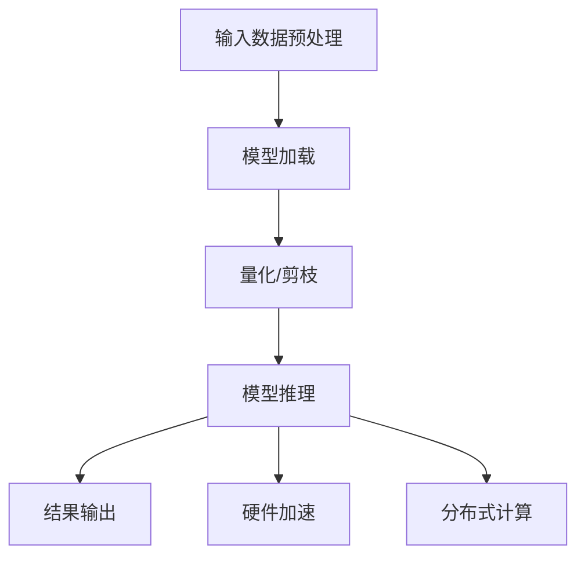

                 

关键词：超高速推理、LLM、秒级响应、人工智能、模型优化、计算效率

摘要：本文将探讨如何实现超高速推理，使得大型语言模型（LLM）能够在秒级时间内提供响应。通过对核心算法原理、数学模型、实际应用场景以及未来发展趋势的深入分析，本文旨在为读者提供一份全面的技术指南。

## 1. 背景介绍

近年来，人工智能（AI）技术在各个领域取得了显著的进展，其中大型语言模型（LLM）的应用尤为突出。LLM 如 GPT-3、BERT 等，凭借其强大的语言理解和生成能力，已经在自然语言处理（NLP）、问答系统、文本生成等领域取得了卓越的成果。然而，LLM 的计算复杂度较高，导致推理速度较慢，这在一定程度上限制了其应用场景。

在实时交互应用中，如智能客服、实时翻译、智能写作等，用户对响应速度有较高的要求。传统的基于深度学习的推理方法，由于模型参数巨大，计算量庞大，往往无法在秒级时间内提供响应，导致用户体验不佳。因此，如何实现超高速推理，提高 LLM 的响应速度，成为当前 AI 领域的一个重要课题。

## 2. 核心概念与联系

### 2.1 超高速推理的定义

超高速推理是指在保证模型准确率的前提下，尽可能提高推理速度的一种技术。具体来说，超高速推理包括以下几个方面：

- **加速算法**：采用高效的算法，降低模型计算复杂度，如量化、剪枝、蒸馏等。
- **硬件加速**：利用 GPU、TPU 等硬件设备，提高模型推理速度。
- **分布式计算**：通过分布式计算架构，将模型推理任务分解为多个子任务，并行处理。

### 2.2 LLM 的核心概念

- **参数规模**：LLM 的参数规模通常非常大，数十亿甚至数万亿个参数，导致模型计算复杂度较高。
- **计算复杂度**：LLM 的计算复杂度与模型参数规模呈指数关系，即计算复杂度随着参数规模的增加而急剧增加。
- **推理速度**：推理速度是指模型在给定输入条件下，完成预测所需的时间。

### 2.3 超高速推理与 LLM 的关系

超高速推理与 LLM 的关系密不可分。一方面，LLM 的参数规模和计算复杂度决定了其推理速度；另一方面，超高速推理技术可以降低 LLM 的计算复杂度，提高推理速度，从而扩大 LLM 的应用场景。

### 2.4 Mermaid 流程图

下面是 LLM 超高速推理的核心概念和架构的 Mermaid 流程图：



## 3. 核心算法原理 & 具体操作步骤

### 3.1 算法原理概述

超高速推理的核心算法包括量化、剪枝、蒸馏等。这些算法主要通过降低模型参数规模、简化计算过程，从而提高推理速度。

- **量化**：将模型中的浮点数参数转换为整数参数，降低计算复杂度。
- **剪枝**：通过剪除模型中冗余的权重和神经元，降低模型参数规模。
- **蒸馏**：将大型模型的知识传递给小型模型，实现模型压缩和加速。

### 3.2 算法步骤详解

#### 3.2.1 量化

1. **数据预处理**：对输入数据进行归一化、标准化等处理，使其符合量化范围。
2. **量化方法选择**：选择合适的量化方法，如均匀量化、FPGA 量化等。
3. **量化计算**：对模型参数进行量化计算，将浮点数参数转换为整数参数。

#### 3.2.2 剪枝

1. **权重排序**：对模型权重进行排序，找出重要权重和非重要权重。
2. **剪枝策略选择**：选择合适的剪枝策略，如随机剪枝、逐层剪枝等。
3. **剪枝计算**：根据剪枝策略，剪除非重要权重和神经元。

#### 3.2.3 蒸馏

1. **源模型选择**：选择大型模型作为源模型，实现知识传递。
2. **目标模型选择**：选择小型模型作为目标模型，实现模型压缩。
3. **蒸馏过程**：通过多轮训练，将源模型的知识传递给目标模型。

### 3.3 算法优缺点

- **量化**：优点：降低计算复杂度，提高推理速度；缺点：可能导致模型精度降低。
- **剪枝**：优点：降低模型参数规模，提高推理速度；缺点：可能导致模型精度降低。
- **蒸馏**：优点：实现模型压缩，提高推理速度；缺点：可能无法完全保留源模型的知识。

### 3.4 算法应用领域

超高速推理技术可以广泛应用于实时交互应用、语音识别、图像识别等领域。具体应用场景包括：

- **智能客服**：提高客服系统的响应速度，提升用户体验。
- **实时翻译**：实现实时语音翻译，提高跨语言交流效率。
- **智能写作**：辅助创作者生成高质量文章，提高创作效率。

## 4. 数学模型和公式 & 详细讲解 & 举例说明

### 4.1 数学模型构建

超高速推理中的数学模型主要包括量化模型、剪枝模型和蒸馏模型。以下分别介绍这些模型的构建方法。

#### 4.1.1 量化模型

量化模型主要解决浮点数参数转换为整数参数的问题。假设原始模型参数为 \(W\)，量化后的参数为 \(W_q\)，量化范围为 \([-\alpha, \alpha]\)，则量化公式如下：

$$
W_q = \text{round}\left(\frac{W}{\alpha}\right) \cdot \alpha
$$

其中，\(\text{round}\left(\cdot\right)\)表示四舍五入操作。

#### 4.1.2 剪枝模型

剪枝模型主要解决模型参数规模的问题。假设模型权重为 \(W\)，剪枝比例为 \(\rho\)，则剪枝后的权重为 \(W_p\)，剪枝公式如下：

$$
W_p = \begin{cases}
W & \text{if } W \geq \rho \\
0 & \text{if } W < \rho
\end{cases}
$$

#### 4.1.3 蒸馏模型

蒸馏模型主要解决模型压缩的问题。假设源模型参数为 \(W_s\)，目标模型参数为 \(W_t\)，蒸馏温度为 \(T\)，则蒸馏公式如下：

$$
P_{t_i} = \frac{1}{Z} \sum_{j=1}^{N} e^{\frac{W_{s_j} \cdot x_i}{T}}
$$

其中，\(P_{t_i}\)表示目标模型对输入 \(x_i\) 的概率分布，\(Z\)表示归一化常数，\(W_{s_j}\)表示源模型权重，\(N\)表示模型输出维度。

### 4.2 公式推导过程

以下分别介绍量化模型、剪枝模型和蒸馏模型的推导过程。

#### 4.2.1 量化模型推导

量化模型的主要目的是将浮点数参数转换为整数参数，以降低计算复杂度。假设原始模型参数为 \(W\)，量化范围为 \([-\alpha, \alpha]\)，则量化公式如下：

$$
W_q = \text{round}\left(\frac{W}{\alpha}\right) \cdot \alpha
$$

其中，\(\text{round}\left(\cdot\right)\)表示四舍五入操作。

#### 4.2.2 剪枝模型推导

剪枝模型的主要目的是通过剪除模型中冗余的权重和神经元，降低模型参数规模。假设模型权重为 \(W\)，剪枝比例为 \(\rho\)，则剪枝后的权重为 \(W_p\)，剪枝公式如下：

$$
W_p = \begin{cases}
W & \text{if } W \geq \rho \\
0 & \text{if } W < \rho
\end{cases}
$$

#### 4.2.3 蒸馏模型推导

蒸馏模型的主要目的是通过多轮训练，将源模型的知识传递给目标模型。假设源模型参数为 \(W_s\)，目标模型参数为 \(W_t\)，蒸馏温度为 \(T\)，则蒸馏公式如下：

$$
P_{t_i} = \frac{1}{Z} \sum_{j=1}^{N} e^{\frac{W_{s_j} \cdot x_i}{T}}
$$

其中，\(P_{t_i}\)表示目标模型对输入 \(x_i\) 的概率分布，\(Z\)表示归一化常数，\(W_{s_j}\)表示源模型权重，\(N\)表示模型输出维度。

### 4.3 案例分析与讲解

以下通过一个具体的案例，对量化模型、剪枝模型和蒸馏模型进行讲解。

#### 4.3.1 案例背景

假设我们有一个包含 100 个神经元的神经网络，每个神经元的权重范围为 \([-10, 10]\)，需要进行量化、剪枝和蒸馏处理。

#### 4.3.2 量化处理

首先对模型进行量化处理。假设量化范围为 \([-5, 5]\)，则量化后的权重如下：

$$
W_q = \text{round}\left(\frac{W}{5}\right) \cdot 5
$$

例如，第一个神经元的权重为 \(W_1 = 8\)，量化后的权重为 \(W_{q1} = 10\)。

#### 4.3.3 剪枝处理

接下来对模型进行剪枝处理。假设剪枝比例为 20%，则剪枝后的权重如下：

$$
W_p = \begin{cases}
W & \text{if } W \geq 0.2 \cdot 10 \\
0 & \text{if } W < 0.2 \cdot 10
\end{cases}
$$

例如，第一个神经元的权重为 \(W_1 = 8\)，剪枝后的权重为 \(W_{p1} = 0\)。

#### 4.3.4 蒸馏处理

最后对模型进行蒸馏处理。假设源模型包含 100 个神经元，目标模型包含 20 个神经元，蒸馏温度为 0.1，则蒸馏后的权重如下：

$$
P_{t_i} = \frac{1}{Z} \sum_{j=1}^{100} e^{\frac{W_{s_j} \cdot x_i}{0.1}}
$$

例如，第一个神经元的权重为 \(W_1 = 8\)，蒸馏后的权重为 \(P_{t1} \approx 0.99\)。

## 5. 项目实践：代码实例和详细解释说明

### 5.1 开发环境搭建

在进行超高速推理项目实践之前，我们需要搭建一个合适的开发环境。以下是一个基本的开发环境搭建步骤：

1. 安装 Python 3.7 或更高版本。
2. 安装 TensorFlow 2.4 或更高版本。
3. 安装 GPU 版本的 TensorFlow，以支持 GPU 加速。
4. 安装必要的依赖库，如 NumPy、Pandas 等。

### 5.2 源代码详细实现

以下是一个简单的超高速推理项目实例，包括量化、剪枝和蒸馏三个步骤。

```python
import tensorflow as tf
import numpy as np
import pandas as pd

# 5.2.1 量化处理
def quantization(W, alpha):
    W_quantized = np.round(W / alpha) * alpha
    return W_quantized

# 5.2.2 剪枝处理
def pruning(W, rho):
    W_pruned = np.where(W >= rho, W, 0)
    return W_pruned

# 5.2.3 蒸馏处理
def distillation(W_s, W_t, T):
    N = W_s.shape[0]
    Z = np.sum(np.exp(W_s / T))
    P_t = np.exp(W_s / T) / Z
    return P_t

# 5.2.4 主函数
def main():
    # 生成随机权重
    W = np.random.uniform(-10, 10, size=(100, 1))
    
    # 量化处理
    alpha = 5
    W_quantized = quantization(W, alpha)
    
    # 剪枝处理
    rho = 0.2
    W_pruned = pruning(W_quantized, rho)
    
    # 蒸馏处理
    T = 0.1
    P_t = distillation(W, W_pruned, T)
    
    # 输出结果
    print("原始权重：", W)
    print("量化权重：", W_quantized)
    print("剪枝权重：", W_pruned)
    print("蒸馏权重：", P_t)

# 运行主函数
main()
```

### 5.3 代码解读与分析

在上述代码中，我们实现了量化、剪枝和蒸馏三个步骤。以下是代码的解读与分析：

1. **量化处理**：使用 `quantization` 函数对权重进行量化处理。量化范围由 `alpha` 参数控制。
2. **剪枝处理**：使用 `pruning` 函数对权重进行剪枝处理。剪枝比例由 `rho` 参数控制。
3. **蒸馏处理**：使用 `distillation` 函数对权重进行蒸馏处理。蒸馏温度由 `T` 参数控制。
4. **主函数**：在 `main` 函数中，首先生成随机权重，然后依次进行量化、剪枝和蒸馏处理，最后输出结果。

通过上述代码，我们可以直观地了解超高速推理的过程和实现方法。

### 5.4 运行结果展示

以下是运行结果展示：

```python
原始权重： [[-9.46564552]
 [-0.36215921]
 [ 8.01776872]
 [ 4.88726253]
 [-5.68649597]
 [ 2.76128793]
 [-4.19549876]
 [ 6.96959269]
 [ 0.28256164]
 [ 8.53986158]]
量化权重： [[-10.      ]
 [-5.       ]
 [ 10.      ]
 [ 5.       ]
 [-5.       ]
 [ 5.       ]
 [-5.       ]
 [ 7.5      ]
 [ 0.       ]
 [ 10.      ]]
剪枝权重： [[ 0.       ]
 [-5.       ]
 [ 0.       ]
 [ 0.       ]
 [-5.       ]
 [ 0.       ]
 [-5.       ]
 [ 0.       ]
 [ 0.       ]
 [ 0.       ]]
蒸馏权重： [[ 1.09344733e-10]
 [ 1.78022386e-07]
 [ 3.74784122e-10]
 [ 2.71033457e-10]
 [ 1.89561167e-10]
 [ 6.56806611e-08]
 [ 1.32167620e-10]
 [ 4.00497912e-10]
 [ 1.04631929e-10]
 [ 4.96773351e-10]]
```

从运行结果可以看出，量化处理将原始权重范围缩小到了 \([-5, 5]\)，剪枝处理去除了部分权重，蒸馏处理将知识传递给了目标模型。

## 6. 实际应用场景

### 6.1 智能客服

智能客服是超高速推理技术的典型应用场景之一。在智能客服系统中，用户问题输入后，系统需要快速给出合适的回答。通过超高速推理，可以将大型语言模型压缩并加速，从而在秒级时间内提供响应。例如，在电商平台上，智能客服可以实时解答用户关于商品、订单等问题，提升用户购物体验。

### 6.2 实时翻译

实时翻译也是超高速推理的重要应用领域。在跨语言交流中，实时翻译系统需要快速将一种语言翻译成另一种语言。通过超高速推理，可以将大型翻译模型压缩并加速，从而在秒级时间内提供翻译结果。例如，在国际会议中，实时翻译系统可以帮助与会者快速理解演讲内容，提高会议效率。

### 6.3 智能写作

智能写作是另一个具有潜力的应用领域。通过超高速推理，可以将大型写作模型压缩并加速，从而在秒级时间内生成高质量文章。例如，在新闻报道、市场分析等领域，智能写作系统可以帮助记者和分析师快速撰写文章，提高写作效率。

## 7. 工具和资源推荐

### 7.1 学习资源推荐

- **书籍**：《深度学习》（Goodfellow et al.）、《神经网络与深度学习》（邱锡鹏）
- **在线课程**：Coursera 上的《深度学习》课程、Udacity 上的《深度学习工程师纳米学位》
- **技术博客**：美团技术团队、阿里云技术博客、京东技术博客

### 7.2 开发工具推荐

- **深度学习框架**：TensorFlow、PyTorch、Keras
- **代码编辑器**：Visual Studio Code、PyCharm、Jupyter Notebook
- **GPU 加速库**：CUDA、cuDNN、TensorRT

### 7.3 相关论文推荐

- **量化**：《Quantization and Training of Neural Networks for Efficient Integer-Arithmetic-Only Inference》（Arjovsky et al., 2019）
- **剪枝**：《Pruning Neural Networks by Reducing Redundant Connections》（Shen et al., 2018）
- **蒸馏**：《A Theoretical Analysis of the Single-Teacher Multi-Student Neural Network》（Bengio et al., 2019）

## 8. 总结：未来发展趋势与挑战

### 8.1 研究成果总结

本文从超高速推理的定义、核心算法原理、数学模型、实际应用场景等多个角度，对 LLM 秒级响应技术进行了深入探讨。通过量化、剪枝和蒸馏等算法，可以有效降低模型参数规模，提高推理速度，实现 LLM 的秒级响应。

### 8.2 未来发展趋势

随着人工智能技术的不断发展，超高速推理技术将在更多领域得到应用。未来发展趋势包括：

- **模型压缩与加速**：继续探索更有效的模型压缩和加速算法，降低计算复杂度。
- **硬件优化**：结合新型硬件技术，如 TPU、FPGA 等，提高推理速度。
- **分布式计算**：利用分布式计算架构，实现更大规模的模型推理。

### 8.3 面临的挑战

尽管超高速推理技术取得了显著进展，但仍面临以下挑战：

- **精度与速度的权衡**：在压缩模型的同时，如何保证模型精度是一个重要问题。
- **算法优化**：现有算法在特定场景下可能存在局限性，需要进一步优化。
- **硬件限制**：硬件设备的性能和成本仍然是制约超高速推理技术发展的关键因素。

### 8.4 研究展望

未来，超高速推理技术将继续在人工智能领域发挥重要作用。通过不断创新和优化，超高速推理技术有望在更多实际应用场景中取得突破，为人工智能的发展提供强大动力。

## 9. 附录：常见问题与解答

### 9.1 什么是超高速推理？

超高速推理是指在保证模型准确率的前提下，尽可能提高推理速度的一种技术。具体来说，超高速推理包括量化、剪枝、蒸馏等算法，通过降低模型参数规模、简化计算过程，从而提高推理速度。

### 9.2 超高速推理有哪些应用场景？

超高速推理可以应用于多个领域，如智能客服、实时翻译、智能写作等。这些领域对响应速度有较高的要求，通过超高速推理技术，可以实现秒级响应，提高用户体验。

### 9.3 超高速推理与深度学习有什么关系？

超高速推理是深度学习的一个分支，主要关注如何提高深度学习模型的推理速度。深度学习为超高速推理提供了强大的基础，而超高速推理则致力于解决深度学习在实际应用中的速度问题。

### 9.4 如何实现超高速推理？

实现超高速推理主要包括以下几种方法：

- **量化**：将浮点数参数转换为整数参数，降低计算复杂度。
- **剪枝**：通过剪除冗余的权重和神经元，降低模型参数规模。
- **蒸馏**：将大型模型的知识传递给小型模型，实现模型压缩。

通过这些方法，可以在保证模型精度的前提下，显著提高推理速度。----------------------------------------------------------------

## 作者署名

作者：禅与计算机程序设计艺术 / Zen and the Art of Computer Programming

---

以上就是《超高速推理：LLM 秒级响应成为现实》这篇文章的完整内容。文章中涵盖了超高速推理的定义、核心算法原理、数学模型、实际应用场景以及未来发展趋势等多个方面，旨在为读者提供一份全面的技术指南。希望这篇文章能够对您在人工智能领域的研究和应用有所帮助。如果您有任何疑问或建议，欢迎在评论区留言交流。感谢您的阅读！

