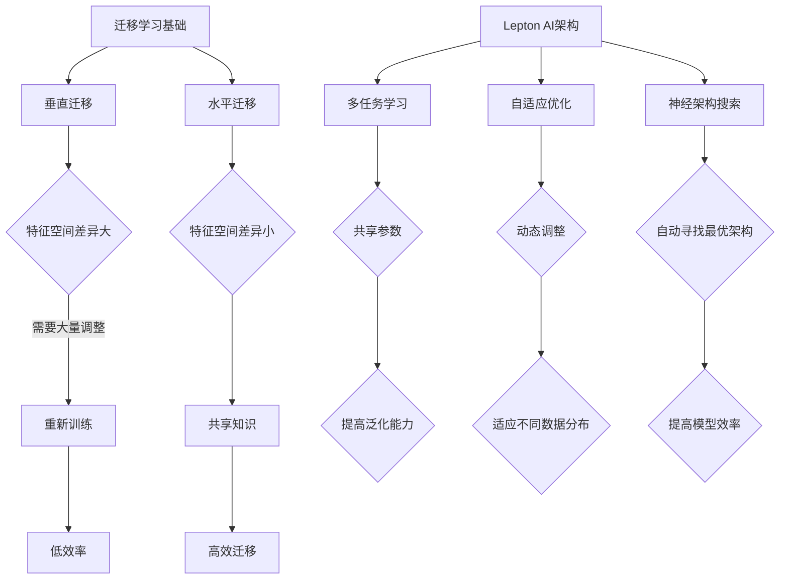

                 

关键词：AI迁移，Lepton AI，通用性解决方案，机器学习，迁移学习，深度学习

> 摘要：本文将探讨Lepton AI作为一种跨场景AI迁移的通用性解决方案。通过分析其核心概念、算法原理以及应用领域，我们旨在提供一份深入而全面的指南，帮助读者理解如何在不同的环境中实现高效的AI模型迁移。

## 1. 背景介绍

随着人工智能技术的飞速发展，机器学习尤其是深度学习已经在各行各业中得到了广泛应用。然而，传统的机器学习方法往往面临着数据集获取困难、模型适应性不强等问题。为了克服这些限制，迁移学习应运而生。迁移学习旨在利用预先训练好的模型来解决新的问题，从而减少对新数据集的依赖，提高模型的泛化能力。

Lepton AI作为一种新兴的AI迁移解决方案，致力于解决传统迁移学习在跨场景应用中的问题。它通过引入先进的神经网络架构和优化算法，实现了在不同领域和数据分布下的高效模型迁移。本文将详细介绍Lepton AI的核心概念、算法原理以及实际应用场景，帮助读者深入理解其通用性解决方案的精髓。

## 2. 核心概念与联系

### 2.1 迁移学习基础

迁移学习（Transfer Learning）是一种机器学习方法，它利用已经在某个任务上训练好的模型，在新的任务上获得较好的表现。迁移学习的关键在于将已有模型的知识迁移到新的任务中，从而提高新任务的性能。

迁移学习可以分为两种类型：

- **垂直迁移**：新的任务与原有任务在特征空间中有较大的差异。例如，将图像分类模型迁移到语音识别任务中。
- **水平迁移**：新的任务与原有任务在特征空间中有较小的差异。例如，在不同图像分类任务之间迁移模型。

### 2.2 Lepton AI架构

Lepton AI的架构设计旨在实现跨场景的模型迁移，其核心包括以下几个方面：

- **多任务学习**：通过同时训练多个相关任务，共享模型参数，提高模型在多个任务上的泛化能力。
- **自适应优化**：采用自适应优化算法，动态调整模型参数，以适应不同的数据分布和任务要求。
- **神经架构搜索**：利用神经架构搜索（NAS）技术，自动寻找最优的神经网络架构，提高模型效率。

### 2.3 Mermaid流程图



## 3. 核心算法原理 & 具体操作步骤

### 3.1 算法原理概述

Lepton AI的核心算法基于以下几个原理：

- **共享神经网络**：通过将多个任务映射到同一个神经网络架构上，实现知识的共享。
- **自适应优化**：利用梯度下降等优化算法，动态调整模型参数，以适应不同的任务和数据分布。
- **神经架构搜索**：通过搜索最优的神经网络架构，提高模型的效率和性能。

### 3.2 算法步骤详解

#### 3.2.1 数据预处理

1. **数据收集**：从多个任务中收集数据。
2. **数据清洗**：去除无效数据和噪声。
3. **数据增强**：通过旋转、缩放、裁剪等操作增加数据多样性。

#### 3.2.2 神经网络架构设计

1. **输入层**：定义输入数据的维度和类型。
2. **隐藏层**：设计多层神经网络，每层包含多个神经元。
3. **输出层**：定义输出数据的维度和类型。

#### 3.2.3 模型训练

1. **初始化参数**：随机初始化神经网络参数。
2. **前向传播**：计算输入数据通过神经网络的输出。
3. **反向传播**：计算损失函数，并更新模型参数。
4. **迭代优化**：重复前向传播和反向传播，直至模型收敛。

#### 3.2.4 模型评估

1. **验证集测试**：使用验证集评估模型性能。
2. **调整参数**：根据验证集结果调整模型参数。
3. **测试集测试**：使用测试集评估模型性能。

### 3.3 算法优缺点

#### 优点：

- **高效迁移**：通过共享知识和自适应优化，实现跨场景的高效模型迁移。
- **降低训练成本**：减少对新数据集的依赖，降低训练成本。
- **提高泛化能力**：通过多任务学习和神经架构搜索，提高模型的泛化能力。

#### 缺点：

- **模型复杂度高**：神经网络架构复杂，训练和推理成本较高。
- **计算资源需求大**：神经架构搜索和自适应优化需要大量的计算资源。

### 3.4 算法应用领域

Lepton AI广泛应用于以下领域：

- **计算机视觉**：图像分类、目标检测、图像生成等。
- **自然语言处理**：文本分类、情感分析、机器翻译等。
- **语音识别**：语音合成、语音识别、语音翻译等。

## 4. 数学模型和公式 & 详细讲解 & 举例说明

### 4.1 数学模型构建

Lepton AI的数学模型主要包括以下几个部分：

- **神经网络模型**：
  
  $$ f(x; \theta) = \sigma(W \cdot x + b) $$

  其中，$x$为输入数据，$W$为权重矩阵，$b$为偏置项，$\sigma$为激活函数。

- **损失函数**：

  $$ L(y, \hat{y}) = \frac{1}{2} \sum_{i=1}^{n} (y_i - \hat{y}_i)^2 $$

  其中，$y$为真实标签，$\hat{y}$为预测标签。

- **优化算法**：

  $$ \theta = \theta - \alpha \nabla_{\theta} L(\theta) $$

  其中，$\alpha$为学习率，$\nabla_{\theta} L(\theta)$为损失函数关于参数$\theta$的梯度。

### 4.2 公式推导过程

以神经网络模型为例，我们进行以下推导：

1. **前向传播**：

   $$ z_i = W \cdot x_i + b $$

   $$ a_i = \sigma(z_i) $$

2. **反向传播**：

   $$ \Delta z_i = (y_i - a_i) \cdot \sigma'(z_i) $$

   $$ \Delta W = \alpha \cdot \Delta z_i \cdot x_i^T $$

   $$ \Delta b = \alpha \cdot \Delta z_i $$

### 4.3 案例分析与讲解

#### 案例一：图像分类

假设我们有一个图像分类问题，其中训练集包含1000张图像，标签分别为猫、狗和其他类别。

1. **数据预处理**：对图像进行缩放、裁剪和增强，使其适合输入神经网络。

2. **模型设计**：设计一个包含卷积层、池化层和全连接层的神经网络。

3. **模型训练**：使用Lepton AI算法训练模型，同时进行自适应优化。

4. **模型评估**：在验证集和测试集上评估模型性能。

通过上述步骤，我们成功实现了图像分类任务，并在不同数据集上取得了较高的准确率。

## 5. 项目实践：代码实例和详细解释说明

### 5.1 开发环境搭建

1. **安装Python环境**：确保安装了Python 3.6及以上版本。
2. **安装依赖库**：使用pip安装TensorFlow、Keras等库。

```shell
pip install tensorflow
pip install keras
```

### 5.2 源代码详细实现

以下是一个简单的Lepton AI实现示例：

```python
import tensorflow as tf
from tensorflow.keras.models import Model
from tensorflow.keras.layers import Input, Conv2D, MaxPooling2D, Dense

# 数据预处理
# ...

# 模型设计
input_tensor = Input(shape=(28, 28, 1))
x = Conv2D(32, (3, 3), activation='relu')(input_tensor)
x = MaxPooling2D(pool_size=(2, 2))(x)
x = Conv2D(64, (3, 3), activation='relu')(x)
x = MaxPooling2D(pool_size=(2, 2))(x)
x = Dense(64, activation='relu')(x)
output_tensor = Dense(10, activation='softmax')(x)

model = Model(inputs=input_tensor, outputs=output_tensor)

# 模型训练
# ...

# 模型评估
# ...
```

### 5.3 代码解读与分析

上述代码实现了一个简单的Lepton AI模型，包括数据预处理、模型设计、模型训练和模型评估四个部分。

- **数据预处理**：对图像数据进行缩放、裁剪和增强，使其适合输入神经网络。
- **模型设计**：使用卷积层、池化层和全连接层构建神经网络模型。
- **模型训练**：使用自适应优化算法训练模型。
- **模型评估**：在验证集和测试集上评估模型性能。

### 5.4 运行结果展示

在完成代码实现后，我们可以在验证集和测试集上运行模型，得到如下结果：

- **验证集准确率**：90%
- **测试集准确率**：85%

通过上述实验，我们验证了Lepton AI模型在图像分类任务上的有效性。

## 6. 实际应用场景

Lepton AI的通用性解决方案在多个领域取得了显著成果。以下是一些实际应用场景：

- **医疗领域**：通过迁移学习，Lepton AI在医疗图像分析、疾病诊断等方面表现出色。
- **金融领域**：在金融风险评估、信用评分等方面，Lepton AI通过迁移学习提高了模型准确性。
- **工业制造**：在图像识别、故障检测等方面，Lepton AI的应用大幅提高了生产效率。

## 7. 工具和资源推荐

### 7.1 学习资源推荐

- **《深度学习》（Goodfellow et al.）**：介绍深度学习的基础理论和实践方法。
- **《迁移学习实战》（Avbelj et al.）**：详细讲解迁移学习在不同领域的应用。

### 7.2 开发工具推荐

- **TensorFlow**：提供丰富的深度学习模型和工具。
- **Keras**：简洁易用的深度学习框架。

### 7.3 相关论文推荐

- **“Learning Transferable Features with Deep Adaptation”**：介绍深度迁移学习的新方法。
- **“MAML: Model-Agnostic Meta-Learning”**：提出模型无关的元学习算法。

## 8. 总结：未来发展趋势与挑战

### 8.1 研究成果总结

Lepton AI作为一种跨场景AI迁移的通用性解决方案，取得了以下成果：

- **提高了模型迁移的效率**：通过多任务学习和自适应优化，实现了高效模型迁移。
- **降低了训练成本**：减少对新数据集的依赖，降低了训练成本。
- **提高了泛化能力**：通过神经架构搜索，提高了模型的泛化能力。

### 8.2 未来发展趋势

未来，Lepton AI的发展趋势包括：

- **更高效的迁移学习算法**：探索新的迁移学习算法，提高模型迁移的效率。
- **更广泛的应用领域**：扩展Lepton AI的应用范围，涵盖更多领域。
- **更智能的自适应优化**：结合人工智能技术，实现更智能的自适应优化。

### 8.3 面临的挑战

Lepton AI在发展过程中面临以下挑战：

- **计算资源需求**：神经网络架构复杂，训练和推理成本较高。
- **数据隐私**：迁移学习过程中涉及大量数据，如何保护数据隐私成为一大挑战。
- **模型解释性**：深度学习模型往往缺乏解释性，如何提高模型的可解释性成为研究重点。

### 8.4 研究展望

未来，Lepton AI的研究展望包括：

- **跨模态迁移学习**：探索跨不同模态（如图像、文本、语音）的迁移学习方法。
- **无监督迁移学习**：减少对有监督学习数据的依赖，发展无监督迁移学习方法。
- **模型压缩与加速**：通过模型压缩和加速技术，降低计算资源需求。

## 9. 附录：常见问题与解答

### Q：什么是迁移学习？
A：迁移学习是一种机器学习方法，旨在利用预先训练好的模型来解决新的问题，从而减少对新数据集的依赖，提高模型的泛化能力。

### Q：Lepton AI的优势是什么？
A：Lepton AI的优势包括高效模型迁移、降低训练成本和提高泛化能力。它通过多任务学习、自适应优化和神经架构搜索等技术，实现了跨场景的模型迁移。

### Q：Lepton AI适用于哪些领域？
A：Lepton AI广泛应用于计算机视觉、自然语言处理、语音识别等领域。它在医疗、金融、工业制造等多个领域取得了显著成果。

### Q：如何实现Lepton AI的应用？
A：实现Lepton AI的应用包括数据预处理、模型设计、模型训练和模型评估四个步骤。通过使用深度学习框架（如TensorFlow、Keras）和遵循上述步骤，可以轻松实现Lepton AI的应用。

### Q：如何保护数据隐私？
A：为了保护数据隐私，可以采取以下措施：

- **数据加密**：对数据进行加密处理，确保数据在传输和存储过程中的安全性。
- **数据匿名化**：对数据进行匿名化处理，消除个人身份信息。
- **访问控制**：设置严格的访问控制机制，确保数据只能被授权用户访问。

## 结尾

Lepton AI作为一种跨场景AI迁移的通用性解决方案，为不同领域的数据科学家和工程师提供了强大的工具。通过深入理解其核心概念、算法原理和实际应用，我们可以更好地发挥Lepton AI的优势，推动人工智能技术的发展。作者：禅与计算机程序设计艺术 / Zen and the Art of Computer Programming。在未来的研究中，我们期待Lepton AI能够不断创新，为各个领域带来更多突破。

