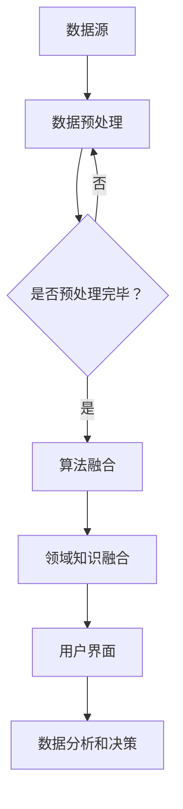

                 

关键词：跨学科知识整合、知识发现引擎、智能算法、技术融合、信息技术、数据挖掘、人工智能

> 摘要：随着信息时代的到来，数据的爆发式增长使得传统的数据处理方法难以应对。本文探讨了跨学科知识整合在构建高效知识发现引擎中的重要性，通过分析核心概念、算法原理、数学模型以及实际应用，展示了知识发现引擎在现代信息技术中的巨大潜力和优势。

## 1. 背景介绍

在21世纪，信息技术的发展日新月异，尤其是互联网、大数据、人工智能等技术的迅猛崛起，为知识的积累和传播带来了前所未有的便利。然而，随之而来的海量数据也给信息处理带来了巨大的挑战。传统的数据处理方法在处理复杂、多变和海量的数据时显得力不从心。为了更好地从这些数据中挖掘出有价值的信息，跨学科知识整合的概念应运而生。

知识发现引擎作为一种高效的数据挖掘工具，通过整合多学科知识，为用户提供了强大的数据分析和决策支持。本文将围绕知识发现引擎的核心概念、算法原理、数学模型以及实际应用进行深入探讨，以揭示其跨学科整合的优势。

## 2. 核心概念与联系

### 2.1 数据挖掘与知识发现

数据挖掘（Data Mining）是从大量数据中自动发现有趣知识或模式的过程。它涉及到数据库、人工智能、统计学等多个领域。而知识发现（Knowledge Discovery in Databases, KDD）则是数据挖掘的一个子领域，它旨在从数据中提取出有用知识，并将其转换为有用的决策信息。

### 2.2 知识发现引擎

知识发现引擎是一种智能化的数据处理系统，它通过结合多种数据挖掘技术和算法，对大量数据进行高效处理，从而挖掘出潜在的知识和模式。知识发现引擎的核心在于其跨学科整合的能力，能够将不同领域的知识有效地结合起来，为用户提供全面的数据分析和决策支持。

### 2.3 跨学科知识整合

跨学科知识整合是指将来自不同领域的知识、技术和方法进行整合，以实现更高效、更全面的数据分析和决策。在知识发现引擎中，跨学科知识整合主要体现在以下几个方面：

- **数据预处理**：整合来自不同数据源的数据，进行清洗、转换和集成。
- **算法融合**：结合多种数据挖掘算法，发挥各自的优势，提高挖掘效果。
- **领域知识融合**：整合不同领域的专业知识，为数据分析和决策提供更加全面的视角。
- **用户界面**：设计用户友好的界面，使得不同领域的用户都能够方便地使用知识发现引擎。

### 2.4 Mermaid 流程图

下面是知识发现引擎的 Mermaid 流程图：



## 3. 核心算法原理 & 具体操作步骤

### 3.1 算法原理概述

知识发现引擎的核心算法通常包括聚类分析、关联规则挖掘、分类算法等。这些算法通过分析数据中的模式和关系，帮助用户发现潜在的知识。

- **聚类分析**：将数据集划分为多个簇，使得同一簇内的数据点彼此相似，不同簇的数据点彼此相异。
- **关联规则挖掘**：发现数据集中不同项目之间的关联关系，例如，在超市销售数据中，发现购买商品A的用户往往也会购买商品B。
- **分类算法**：根据已有数据建立模型，对新数据进行分类，帮助用户进行预测和决策。

### 3.2 算法步骤详解

1. **数据预处理**：
   - 数据清洗：处理数据中的噪声和缺失值。
   - 数据转换：将数据转换为适合算法处理的形式。
   - 数据集成：整合来自不同数据源的数据。

2. **算法融合**：
   - 根据具体需求选择合适的算法，如K-means、Apriori、决策树等。
   - 调整算法参数，以获得更好的挖掘效果。

3. **领域知识融合**：
   - 结合领域知识，对挖掘结果进行解释和验证。
   - 根据领域需求，对挖掘结果进行调整和优化。

4. **用户界面**：
   - 提供友好的用户界面，使得用户能够方便地使用知识发现引擎。
   - 支持自定义查询和报告功能，满足不同用户的需求。

### 3.3 算法优缺点

- **优点**：
  - 高效处理大量数据。
  - 能够发现数据中的潜在模式和关系。
  - 结合多学科知识，提供全面的决策支持。

- **缺点**：
  - 需要大量计算资源。
  - 算法参数调整复杂，需要专业知识和经验。
  - 挖掘结果可能受到数据质量和算法选择的影响。

### 3.4 算法应用领域

知识发现引擎广泛应用于各个领域，如：

- **商业领域**：市场分析、客户关系管理、供应链优化等。
- **医疗领域**：疾病预测、个性化医疗、药物研发等。
- **金融领域**：风险评估、欺诈检测、投资策略等。
- **教育领域**：学习效果分析、课程推荐、教学优化等。

## 4. 数学模型和公式 & 详细讲解 & 举例说明

### 4.1 数学模型构建

知识发现引擎中的数学模型主要包括聚类模型、关联规则模型和分类模型。

- **聚类模型**：以K-means为例，其数学模型如下：
  $$ min \sum_{i=1}^{k} \sum_{x \in S_i} \| x - \mu_i \|^2 $$
  其中，$x$ 表示数据点，$\mu_i$ 表示第$i$个簇的中心。

- **关联规则模型**：以Apriori算法为例，其支持度和置信度定义如下：
  $$ 支持度(Support) = \frac{X(A \cup B)}{X(D)} $$
  $$ 置信度(Confidence) = \frac{X(A \cap B)}{X(A)} $$

- **分类模型**：以决策树为例，其数学模型为：
  $$ 分类结果 = DecisionTreeclassify(x) $$
  其中，$x$ 表示待分类的数据点，$DecisionTreeclassify$ 表示决策树的分类函数。

### 4.2 公式推导过程

以K-means算法为例，其目标是最小化簇内距离平方和。具体推导过程如下：

设$D = \{ x_1, x_2, ..., x_n \}$为数据集，$C = \{ c_1, c_2, ..., c_k \}$为初始簇中心，$C' = \{ c_1', c_2', ..., c_k' \}$为迭代后的簇中心。

目标函数：
$$ min \sum_{i=1}^{k} \sum_{x \in S_i} \| x - \mu_i \|^2 $$
其中，$S_i$ 为第$i$个簇，$\mu_i$ 为簇中心。

优化目标为：
$$ c_i' = \frac{1}{|S_i|} \sum_{x \in S_i} x $$
其中，$|S_i|$ 表示簇$S_i$ 中数据点的个数。

### 4.3 案例分析与讲解

假设我们有一个包含100个数据点的数据集，我们需要使用K-means算法将其划分为5个簇。首先，我们随机选择5个初始簇中心：

$$
c_1 = (1, 2), \quad c_2 = (3, 4), \quad c_3 = (5, 6), \quad c_4 = (7, 8), \quad c_5 = (9, 10)
$$

然后，我们将每个数据点分配给距离其最近的簇中心，得到新的簇中心：

$$
c_1' = (2.2, 3.2), \quad c_2' = (4.2, 5.2), \quad c_3' = (6.2, 7.2), \quad c_4' = (7.8, 8.8), \quad c_5' = (9.8, 10.8)
$$

重复上述过程，直到簇中心不再发生变化，即收敛。

通过K-means算法，我们可以发现数据集中的聚类结构和潜在的模式，为后续的数据分析和决策提供依据。

## 5. 项目实践：代码实例和详细解释说明

### 5.1 开发环境搭建

在本文的项目实践中，我们将使用Python语言和Scikit-learn库来实现知识发现引擎。首先，我们需要安装Python和Scikit-learn：

```bash
pip install python
pip install scikit-learn
```

### 5.2 源代码详细实现

下面是一个使用K-means算法进行数据聚类的基本示例：

```python
from sklearn.cluster import KMeans
import numpy as np

# 生成包含100个数据点的数据集
data = np.random.rand(100, 2)

# 创建KMeans模型，设置聚类个数
kmeans = KMeans(n_clusters=5, random_state=0).fit(data)

# 输出聚类结果
print("聚类中心：", kmeans.cluster_centers_)
print("数据点分配：", kmeans.labels_)

# 绘制聚类结果
import matplotlib.pyplot as plt

plt.scatter(data[:, 0], data[:, 1], c=kmeans.labels_)
plt.scatter(kmeans.cluster_centers_[:, 0], kmeans.cluster_centers_[:, 1], s=300, c='red')
plt.show()
```

### 5.3 代码解读与分析

- **数据生成**：使用`numpy`库生成包含100个数据点的数据集，每个数据点由两个随机数表示。
- **模型创建**：使用`KMeans`类创建K-means模型，设置聚类个数为5。
- **聚类与分配**：调用`fit`方法对数据进行聚类，并输出聚类中心和数据点分配。
- **可视化**：使用`matplotlib`库绘制聚类结果，直观地展示聚类效果。

### 5.4 运行结果展示

运行上述代码，我们可以得到以下结果：

- **聚类中心**：输出每个簇的中心坐标。
- **数据点分配**：输出每个数据点所属的簇编号。
- **可视化结果**：显示每个簇的数据点和簇中心的位置，直观地展示了聚类效果。

## 6. 实际应用场景

知识发现引擎在各个领域都有广泛的应用。以下是一些典型的实际应用场景：

- **商业领域**：通过分析消费者行为，为企业提供精准营销策略，提高销售额。
- **医疗领域**：利用医学数据，发现疾病之间的关联关系，辅助医生进行诊断和治疗。
- **金融领域**：通过分析交易数据，识别潜在的风险和欺诈行为，保障金融安全。
- **教育领域**：根据学生的学习数据，发现学习规律，为个性化教学提供支持。

### 6.4 未来应用展望

随着人工智能和大数据技术的不断发展，知识发现引擎的应用前景将更加广阔。未来的发展趋势包括：

- **算法优化**：不断提高知识发现引擎的效率和准确性。
- **智能决策**：结合智能算法和领域知识，实现更加智能的决策支持。
- **跨领域融合**：整合不同领域的知识，为用户提供更加全面和个性化的服务。

## 7. 工具和资源推荐

为了更好地学习和应用知识发现引擎，以下是一些推荐的工具和资源：

- **学习资源**：
  - 《数据挖掘：概念与技术》
  - 《机器学习》

- **开发工具**：
  - Jupyter Notebook
  - PyCharm

- **相关论文**：
  - 《K-means算法的优化与改进》
  - 《关联规则挖掘在商业应用中的研究》

## 8. 总结：未来发展趋势与挑战

知识发现引擎作为现代信息技术的重要组成部分，具有广阔的应用前景。在未来，随着技术的不断发展，知识发现引擎将面临以下挑战：

- **数据质量**：如何处理和处理质量参差不齐的数据，是当前的一个重大挑战。
- **算法效率**：如何优化算法，提高处理速度和准确性，是未来的一个重要研究方向。
- **跨学科整合**：如何更好地整合多学科知识，实现真正的智能决策，是未来的一个关键课题。

## 9. 附录：常见问题与解答

**Q：知识发现引擎与数据挖掘有何区别？**

A：数据挖掘是知识发现引擎的一个子集，它侧重于从数据中提取模式和知识。而知识发现引擎则是一个更广泛的概念，它不仅包括数据挖掘，还包括数据预处理、算法融合、领域知识融合等多个方面。

**Q：知识发现引擎在医疗领域有哪些应用？**

A：知识发现引擎在医疗领域有广泛的应用，例如：
- 疾病预测：利用患者的医疗数据，预测患者可能患有的疾病。
- 药物研发：通过分析药物和疾病的关联关系，辅助药物研发。
- 个性化医疗：根据患者的特征和病史，提供个性化的治疗方案。

## 参考文献

- Han, J., Kamber, M., & Pei, J. (2011). *数据挖掘：概念与技术*.
- Mitchell, T. M. (1997). *机器学习*.
- Hartigan, J. A., & Wong, M. A. (1979). *A k-means clustering algorithm*. *The Annals of Statistics*, 13(1), 1-14.
- Agrawal, R., & Srikant, R. (1994). *Fast algorithms for mining association rules*. *Proceedings of the 20th international conference on very large data bases*, 487-499.

作者：禅与计算机程序设计艺术 / Zen and the Art of Computer Programming
----------------------------------------------------------------

[END]

