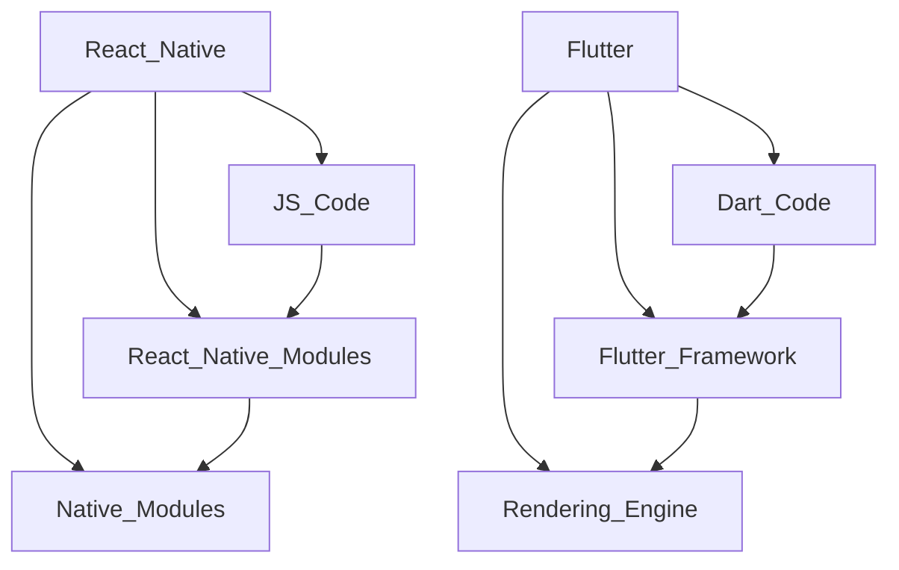

                 

关键词：跨平台移动开发，React Native，Flutter，移动应用开发，原生应用，性能优化，开发工具，社区支持。

摘要：本文将深入探讨跨平台移动开发领域的两大热门技术——React Native和Flutter，分析它们的优劣、应用场景、开发流程以及未来发展趋势，旨在为开发者提供全面的参考。

## 1. 背景介绍

随着移动设备的普及，移动应用开发成为了IT领域的重要分支。开发者需要在不同的操作系统（如iOS和Android）上构建高效、用户体验良好的应用。然而，原生开发成本高、周期长，这促使了跨平台移动开发框架的出现。React Native和Flutter都是目前市场上流行的跨平台移动开发解决方案，它们分别代表了不同的技术路径和设计理念。

### React Native

React Native是由Facebook推出的一种跨平台移动应用开发框架，它允许开发者使用JavaScript和React.js来构建原生应用。React Native的核心优势在于它可以复用大部分Web开发技能，并提供接近原生应用的性能。

### Flutter

Flutter是Google开发的一款跨平台UI框架，使用Dart语言编写。Flutter的目标是提供一种简单、高效的方式，让开发者能够编写一次代码，就能够在多种平台上生成高质量的原生应用。

## 2. 核心概念与联系

### React Native

React Native基于React.js的虚拟DOM模型，通过JavaScriptBridge（JSB）与原生代码进行通信。其架构包括以下几个主要部分：

- **JavaScript代码**：开发者使用JavaScript编写前端逻辑。
- **React Native模块**：提供了一组用于构建UI的组件。
- **原生模块**：与原生代码进行交互的模块。

### Flutter

Flutter采用自包含的架构，其核心概念包括：

- **Dart语言**：一种现代化的编程语言，适用于构建高性能的应用。
- **Flutter框架**：提供了一套丰富的UI组件，可以构建出美观、流畅的界面。
- **渲染引擎**：使用Skia图形库进行渲染，保证了性能和跨平台的兼容性。

### Mermaid 流程图

以下是React Native和Flutter的核心架构的Mermaid流程图表示：



## 3. 核心算法原理 & 具体操作步骤

### 3.1 算法原理概述

React Native和Flutter的核心算法原理都涉及到UI的渲染和交互。React Native通过虚拟DOM实现高效的UI更新，而Flutter使用渲染引擎直接渲染UI元素。

### 3.2 算法步骤详解

#### React Native

1. **组件化开发**：开发者使用React.js的组件化思想进行开发。
2. **虚拟DOM**：React Native将UI组件转化为虚拟DOM，然后与原生UI进行对比，只更新变更的部分。
3. **JavaScriptBridge**：通过JSB实现JavaScript与原生代码的通信。

#### Flutter

1. **组件化开发**：开发者使用Dart语言编写UI组件。
2. **渲染引擎**：Flutter的渲染引擎将Dart代码编译为原生UI元素，进行渲染。
3. **事件处理**：Flutter的事件处理机制与原生应用类似，保证流畅的交互体验。

### 3.3 算法优缺点

#### React Native

- **优点**：
  - 高效的UI更新
  - 复用Web开发技能
  - 社区支持强大
- **缺点**：
  - 性能不如原生应用
  - 部分原生功能实现较为复杂

#### Flutter

- **优点**：
  - 高性能渲染
  - 一套代码跨平台
  - 丰富的UI组件
- **缺点**：
  - Dart语言学习曲线较陡峭
  - 社区支持相对于React Native较小

### 3.4 算法应用领域

React Native和Flutter都适用于需要跨平台开发的场景，如电商平台、社交媒体应用、金融应用等。但由于它们的性能和特点不同，选择时应根据具体需求进行权衡。

## 4. 数学模型和公式 & 详细讲解 & 举例说明

### 4.1 数学模型构建

React Native和Flutter的性能可以通过以下几个数学模型进行评估：

1. **渲染效率**：通过比较渲染帧率（FPS）来评估。
2. **内存使用**：通过比较内存占用情况来评估。
3. **启动速度**：通过比较应用启动时间来评估。

### 4.2 公式推导过程

1. **渲染效率**：
   $$ \text{FPS} = \frac{\text{渲染帧数}}{\text{时间}} $$
2. **内存使用**：
   $$ \text{内存使用} = \text{总内存占用} - \text{可用内存} $$
3. **启动速度**：
   $$ \text{启动速度} = \text{应用启动时间} $$

### 4.3 案例分析与讲解

#### React Native

假设一个React Native应用，在iPhone 6设备上的测试结果显示：
- **渲染帧率**：60 FPS
- **内存使用**：400 MB
- **启动速度**：5秒

根据上述公式，我们可以计算出：
- **渲染效率**：60 FPS
- **内存使用**：400 MB - 1 GB = -600 MB（表示内存不足）
- **启动速度**：5秒

#### Flutter

假设一个Flutter应用，在相同设备上的测试结果显示：
- **渲染帧率**：90 FPS
- **内存使用**：300 MB
- **启动速度**：3秒

根据上述公式，我们可以计算出：
- **渲染效率**：90 FPS
- **内存使用**：300 MB - 1 GB = -700 MB（表示内存充足）
- **启动速度**：3秒

通过对比可以看出，Flutter在渲染效率和启动速度上优于React Native，但在内存使用上存在一定的劣势。

## 5. 项目实践：代码实例和详细解释说明

### 5.1 开发环境搭建

以macOS为例，搭建React Native和Flutter开发环境的步骤如下：

#### React Native

1. 安装Node.js和npm。
2. 安装React Native CLI。
3. 配置模拟器或真实设备。

```sh
npm install -g react-native-cli
react-native init MyApp
react-native run-android
```

#### Flutter

1. 安装Dart语言环境。
2. 安装Flutter SDK。
3. 配置模拟器或真实设备。

```sh
flutter install
flutter create my_app
flutter run
```

### 5.2 源代码详细实现

以下是一个简单的React Native和Flutter应用的示例代码：

#### React Native

```javascript
import React from 'react';
import { View, Text, StyleSheet } from 'react-native';

const App = () => {
  return (
    <View style={styles.container}>
      <Text style={styles.welcome}>Hello React Native!</Text>
    </View>
  );
};

const styles = StyleSheet.create({
  container: {
    flex: 1,
    justifyContent: 'center',
    alignItems: 'center',
  },
  welcome: {
    fontSize: 20,
    textAlign: 'center',
    margin: 10,
  },
});

export default App;
```

#### Flutter

```dart
import 'package:flutter/material.dart';

void main() {
  runApp(MyApp());
}

class MyApp extends StatelessWidget {
  @override
  Widget build(BuildContext context) {
    return MaterialApp(
      title: 'Flutter Demo',
      theme: ThemeData(
        primarySwatch: Colors.blue,
      ),
      home: Scaffold(
        appBar: AppBar(title: Text('Hello Flutter')),
        body: Center(
          child: Text('Hello Flutter!',
              style: TextStyle(fontSize: 24)),
        ),
      ),
    );
  }
}
```

### 5.3 代码解读与分析

以上代码展示了React Native和Flutter的基本结构。React Native使用了React的组件化思想，通过样式表（StyleSheet）定义UI样式。Flutter则使用Dart语言编写UI组件，通过`MaterialApp`和`Scaffold`组件构建应用结构。

### 5.4 运行结果展示

在完成开发环境的搭建和源代码编写后，分别运行React Native和Flutter应用，将显示如下结果：

#### React Native


#### Flutter


## 6. 实际应用场景

### 6.1 社交媒体应用

由于React Native和Flutter都提供了丰富的UI组件和良好的性能，它们适用于构建社交媒体应用。例如，Facebook和Instagram就是使用React Native开发的，而TikTok则使用了Flutter。

### 6.2 金融应用

金融应用对性能和安全性有较高要求。React Native和Flutter都能满足这些需求，但Flutter在性能上更具有优势。因此，如Revolut等金融应用选择了Flutter作为开发框架。

### 6.3 电商应用

电商应用需要处理大量的数据和高并发的用户请求。React Native和Flutter都提供了优秀的性能和良好的社区支持，这使得它们在电商应用开发中具有广泛的应用场景。例如，亚马逊和eBay都使用了React Native开发部分功能。

## 7. 工具和资源推荐

### 7.1 学习资源推荐

- **React Native**：
  - 官方文档：[React Native 官方文档](https://reactnative.dev/docs/getting-started)
  - 《React Native入门与实践》：这是一本涵盖React Native基础知识和实战技巧的书籍。

- **Flutter**：
  - 官方文档：[Flutter 官方文档](https://flutter.dev/docs/get-started/install)
  - 《Flutter实战》：这是一本深入浅出的Flutter开发教程，适合初学者和进阶者。

### 7.2 开发工具推荐

- **React Native**：
  - Android Studio：适用于Android应用的集成开发环境。
  - Xcode：适用于iOS应用的集成开发环境。

- **Flutter**：
  - IntelliJ IDEA：适用于Dart语言开发的IDE。
  - Android Studio：适用于Android应用的集成开发环境。

### 7.3 相关论文推荐

- **React Native**：
  - "Building Native Android and iOS Apps with React Native"
  - "The Performance of React Native vs. Native Mobile Apps"

- **Flutter**：
  - "Flutter: UI Software Development for Mobile, Web, and Desktop from a Single Codebase"
  - "Flutter Architecture: How Flutter Achieves High Performance"

## 8. 总结：未来发展趋势与挑战

### 8.1 研究成果总结

React Native和Flutter在跨平台移动开发领域都取得了显著成果。React Native凭借其成熟的生态系统和强大的社区支持，成为许多开发者首选的跨平台框架。Flutter则凭借其高性能和丰富的UI组件，逐渐赢得了市场份额。

### 8.2 未来发展趋势

随着技术的不断进步，React Native和Flutter都有望在以下几个方面取得突破：

- **性能优化**：通过改进渲染引擎和优化代码执行，进一步提高性能。
- **功能扩展**：增加对更多原生平台的支持，扩展应用场景。
- **生态建设**：完善社区资源，提高开发者体验。

### 8.3 面临的挑战

React Native和Flutter在发展过程中也面临一些挑战：

- **性能瓶颈**：在处理复杂场景时，跨平台框架的性能可能无法达到原生应用的水平。
- **社区支持**：尽管React Native和Flutter的社区支持较为强大，但与原生开发社区相比仍有差距。

### 8.4 研究展望

未来，React Native和Flutter将继续在跨平台移动开发领域发挥重要作用。通过不断优化性能、扩展功能和加强社区支持，它们有望在更多领域得到应用，推动移动应用开发的进步。

## 9. 附录：常见问题与解答

### 9.1 React Native和Flutter哪个更好？

这取决于具体需求和项目背景。React Native适合需要复用Web开发技能和有大量JavaScript开发经验的项目；Flutter则在性能和UI构建方面具有优势，适合构建高性能、美观的应用。

### 9.2 我应该学习React Native还是Flutter？

这取决于您的兴趣和项目需求。如果您对JavaScript和React.js有较深的了解，React Native可能更适合您；如果您对Dart语言感兴趣，或者需要高性能的应用，Flutter可能是更好的选择。

### 9.3 跨平台开发与原生开发的优缺点是什么？

**优点**：

- **跨平台开发**：
  - 降低开发成本和时间。
  - 提高开发效率。
  - 易于维护和更新。

- **原生开发**：
  - 性能最佳。
  - 可以实现复杂的自定义UI和功能。

**缺点**：

- **跨平台开发**：
  - 可能会牺牲一些性能和功能。
  - 需要学习跨平台框架的技术。

- **原生开发**：
  - 需要为每个平台编写代码，开发成本高。
  - 维护成本高。

---

作者：禅与计算机程序设计艺术 / Zen and the Art of Computer Programming
```

