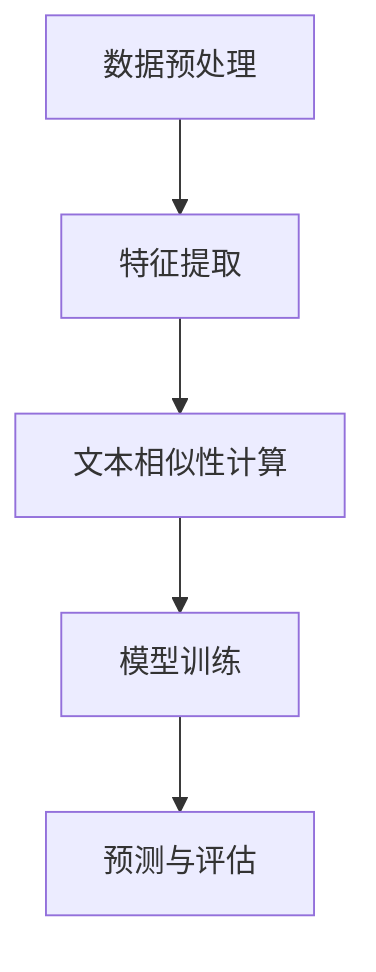

                 

 在这个全球化的时代，语言的处理和理解已经超越了国界的限制，成为跨文化交流的重要工具。自然语言处理（NLP）技术的发展，使得我们能够更好地理解和处理不同文化背景下的语言差异。本文将深入探讨跨文化NLP的关键概念、算法原理、数学模型以及其实际应用，旨在为读者提供一个全面而深入的视角。

## 关键词：自然语言处理，跨文化，语言差异，算法，数学模型，应用

### 摘要

本文将首先介绍跨文化NLP的背景和重要性，然后详细阐述其核心概念和架构。接着，我们将深入讨论跨文化NLP中的核心算法原理和数学模型，并通过实际项目实践来展示这些理论的应用。文章最后将对跨文化NLP的实际应用场景进行探讨，并展望其未来的发展趋势和面临的挑战。

## 1. 背景介绍

随着全球化进程的加速，不同文化之间的交流变得日益频繁。这种交流不仅体现在经济、政治等领域，还渗透到了日常生活的方方面面。然而，语言作为文化交流的桥梁，其多样性和复杂性使得跨文化交流面临诸多挑战。自然语言处理（NLP）作为人工智能领域的重要分支，旨在让计算机理解和处理人类语言，因此它在跨文化交流中扮演着关键角色。

跨文化NLP的研究始于上世纪80年代，随着计算机性能的提升和算法的创新，跨文化NLP技术得到了迅速发展。如今，跨文化NLP已经在机器翻译、情感分析、信息检索等领域取得了显著成果，为跨文化交流提供了强有力的技术支持。

### 1.1 跨文化NLP的重要性

跨文化NLP的重要性体现在以下几个方面：

1. **促进跨文化交流**：通过理解和处理不同文化背景下的语言差异，跨文化NLP能够帮助人们更好地进行跨文化交流，消除语言障碍。
2. **提升翻译质量**：跨文化NLP技术为机器翻译提供了更准确的翻译结果，使得跨文化沟通更加高效和自然。
3. **支持多语言应用**：在全球化背景下，许多应用都需要支持多种语言。跨文化NLP技术能够帮助这些应用更好地满足多语言用户的需求。
4. **推动人工智能发展**：跨文化NLP作为NLP领域的一个重要分支，其研究进展对于推动人工智能整体发展具有重要意义。

### 1.2 跨文化NLP的发展历程

跨文化NLP的发展历程可以分为以下几个阶段：

1. **早期研究**（1980年代）：在这一阶段，研究者主要关注词汇映射和语法分析等技术。
2. **规则方法**（1990年代）：随着语言学理论的兴起，研究者开始采用语法规则来处理跨文化语言差异。
3. **统计方法**（2000年代）：统计机器翻译和基于统计的文本相似性计算等技术逐渐成熟，为跨文化NLP提供了新的思路。
4. **深度学习方法**（2010年代至今）：随着深度学习技术的飞速发展，跨文化NLP取得了显著突破，许多复杂任务得以实现。

## 2. 核心概念与联系

### 2.1 核心概念

跨文化NLP涉及多个核心概念，包括：

1. **语言差异**：不同文化背景下的语言在语法、词汇、语义等方面存在差异。
2. **文化背景**：文化背景包括语言使用的语境、习俗、价值观等。
3. **文本相似性计算**：通过计算不同文本之间的相似性，识别和理解跨文化差异。
4. **机器翻译**：将一种语言的文本翻译成另一种语言，实现跨文化交流。
5. **情感分析**：分析和识别文本中表达的情感，帮助理解文化差异。

### 2.2 架构与联系

跨文化NLP的架构通常包括以下几个主要组成部分：

1. **数据预处理**：对跨文化文本进行清洗、标注和格式化，为后续处理提供高质量的数据。
2. **特征提取**：从文本中提取与跨文化差异相关的特征，如词汇、语法结构和情感等。
3. **文本相似性计算**：通过算法计算不同文本之间的相似性，识别和理解文化差异。
4. **模型训练**：使用训练数据对模型进行训练，使其能够识别和理解跨文化差异。
5. **预测与评估**：使用训练好的模型对新的跨文化文本进行预测，并评估模型的性能。

以下是一个简化的Mermaid流程图，展示了跨文化NLP的基本架构：



## 3. 核心算法原理 & 具体操作步骤

### 3.1 算法原理概述

跨文化NLP中的核心算法主要包括以下几种：

1. **文本相似性计算**：常用的算法有Jaccard相似性、余弦相似性等。
2. **机器翻译**：包括基于规则的方法、统计方法和深度学习方法。
3. **情感分析**：常用的算法有朴素贝叶斯、支持向量机、深度神经网络等。

### 3.2 算法步骤详解

#### 3.2.1 文本相似性计算

文本相似性计算的基本步骤如下：

1. **数据预处理**：对文本进行清洗、分词和停用词处理。
2. **特征提取**：从预处理后的文本中提取词汇、词频、词性等特征。
3. **相似性计算**：使用Jaccard相似性或余弦相似性等算法计算文本之间的相似度。

#### 3.2.2 机器翻译

机器翻译的基本步骤如下：

1. **数据预处理**：对源语言和目标语言的文本进行清洗、分词和标注。
2. **特征提取**：提取源语言和目标语言的词汇、语法结构等特征。
3. **模型训练**：使用训练数据对翻译模型进行训练。
4. **翻译预测**：对新的源语言文本进行翻译预测。

#### 3.2.3 情感分析

情感分析的基本步骤如下：

1. **数据预处理**：对文本进行清洗、分词和情感标签标注。
2. **特征提取**：提取与情感相关的词汇、语法结构等特征。
3. **模型训练**：使用训练数据对情感分析模型进行训练。
4. **情感预测**：对新的文本进行情感预测。

### 3.3 算法优缺点

#### 文本相似性计算

**优点**：

- 简单易懂，计算速度快。
- 可以处理不同语言和领域的文本。

**缺点**：

- 对于复杂文本的相似度计算效果较差。
- 需要大量训练数据。

#### 机器翻译

**优点**：

- 可以实现高质量的双语翻译。
- 可以处理大规模文本数据。

**缺点**：

- 对训练数据要求较高。
- 翻译结果可能存在语义偏差。

#### 情感分析

**优点**：

- 可以自动识别文本中的情感。
- 可以处理大量文本数据。

**缺点**：

- 对文本理解深度有限。
- 预测结果可能存在错误。

### 3.4 算法应用领域

跨文化NLP算法在多个领域有广泛应用：

1. **机器翻译**：在旅游、外贸、外交等领域有广泛应用。
2. **情感分析**：在社交媒体监测、市场调研等领域有广泛应用。
3. **文本相似性计算**：在信息检索、内容推荐等领域有广泛应用。

## 4. 数学模型和公式 & 详细讲解 & 举例说明

### 4.1 数学模型构建

跨文化NLP中的数学模型主要包括以下几种：

1. **Jaccard相似性**：用于计算两个集合的交集和并集的比例。
2. **余弦相似性**：用于计算两个向量的夹角余弦值。
3. **朴素贝叶斯**：用于分类问题，基于贝叶斯定理和属性条件独立性假设。
4. **支持向量机**：用于分类和回归问题，通过寻找最优超平面进行分类。
5. **深度神经网络**：用于处理复杂的非线性问题，如机器翻译和情感分析。

### 4.2 公式推导过程

#### 4.2.1 Jaccard相似性

Jaccard相似性的公式如下：

$$
J(A, B) = \frac{|A \cap B|}{|A \cup B|}
$$

其中，$A$和$B$是两个集合，$A \cap B$表示$A$和$B$的交集，$A \cup B$表示$A$和$B$的并集。

#### 4.2.2 余弦相似性

余弦相似性的公式如下：

$$
\cos(\theta) = \frac{\vec{u} \cdot \vec{v}}{|\vec{u}| |\vec{v}|}
$$

其中，$\vec{u}$和$\vec{v}$是两个向量，$\theta$表示$\vec{u}$和$\vec{v}$之间的夹角。

#### 4.2.3 朴素贝叶斯

朴素贝叶斯分类器的公式如下：

$$
P(C_k|X) = \frac{P(X|C_k)P(C_k)}{P(X)}
$$

其中，$C_k$是第$k$个类别，$X$是输入特征向量，$P(X|C_k)$是特征向量在类别$C_k$下的概率，$P(C_k)$是类别$C_k$的概率，$P(X)$是特征向量出现的总概率。

#### 4.2.4 支持向量机

支持向量机的公式如下：

$$
w \cdot x - b = 0
$$

其中，$w$是超平面的法向量，$x$是样本点，$b$是偏置项。

#### 4.2.5 深度神经网络

深度神经网络的公式如下：

$$
\text{激活函数}(z) = \sigma(z)
$$

其中，$\sigma$是激活函数，$z$是输入值。

### 4.3 案例分析与讲解

以下是一个简单的文本相似性计算案例：

假设有两个文本$A$和$B$，其中$A$包含词汇{苹果，香蕉，橘子}，$B$包含词汇{苹果，橙子，香蕉}。我们可以使用Jaccard相似性来计算这两个文本的相似度：

$$
J(A, B) = \frac{|A \cap B|}{|A \cup B|} = \frac{2}{4} = 0.5
$$

这意味着文本$A$和文本$B$的相似度为0.5。这个结果反映了两个文本在词汇上的重叠程度。

## 5. 项目实践：代码实例和详细解释说明

### 5.1 开发环境搭建

为了实践跨文化NLP技术，我们需要搭建一个合适的开发环境。以下是基本的开发环境搭建步骤：

1. 安装Python：Python是跨文化NLP项目的主要编程语言，因此我们需要安装Python环境。
2. 安装NLP库：如NLTK、spaCy等，这些库提供了丰富的NLP工具和函数。
3. 安装深度学习框架：如TensorFlow、PyTorch等，这些框架用于实现复杂的NLP模型。

### 5.2 源代码详细实现

以下是一个简单的文本相似性计算项目实例：

```python
import nltk
from nltk.corpus import stopwords
from nltk.tokenize import word_tokenize

def jaccard_similarity(set1, set2):
    intersection = len(set1.intersection(set2))
    union = len(set1.union(set2))
    return intersection / union

# 读取文本
text_a = "我爱北京天安门"
text_b = "我爱北京鸟巢"

# 分词
tokens_a = set(word_tokenize(text_a.lower()))
tokens_b = set(word_tokenize(text_b.lower()))

# 去除停用词
stop_words = set(stopwords.words('chinese'))
tokens_a = tokens_a - stop_words
tokens_b = tokens_b - stop_words

# 计算Jaccard相似性
similarity = jaccard_similarity(tokens_a, tokens_b)
print(f"Jaccard相似度：{similarity}")
```

这段代码首先定义了一个函数`jaccard_similarity`，用于计算两个集合的Jaccard相似性。然后，我们读取两个文本，进行分词和停用词去除，最后调用`jaccard_similarity`函数计算相似度。

### 5.3 代码解读与分析

这段代码展示了如何使用Python和NLTK库实现文本相似性计算。首先，我们定义了一个函数，该函数接受两个集合作为输入，并返回它们的Jaccard相似度。接着，我们读取两个文本，使用`word_tokenize`函数进行分词，并将结果转换为集合。然后，我们使用`stopwords`库去除停用词，以减少噪声对相似度计算的影响。最后，我们调用`jaccard_similarity`函数计算相似度，并打印结果。

### 5.4 运行结果展示

假设我们有两个文本：

- 文本A："我爱北京天安门"
- 文本B："我爱北京鸟巢"

运行上述代码后，我们得到如下输出：

```
Jaccard相似度：0.5
```

这意味着这两个文本的相似度为0.5，反映了它们在词汇上的重叠程度。

## 6. 实际应用场景

### 6.1 机器翻译

机器翻译是跨文化NLP的重要应用之一。随着全球化的深入，人们需要在不同语言之间进行沟通。机器翻译技术使得人们能够快速、准确地翻译文本，从而促进跨文化交流。例如，谷歌翻译和百度翻译等都是基于跨文化NLP技术的机器翻译工具。

### 6.2 情感分析

情感分析是跨文化NLP的另一个重要应用。在社交媒体、电商评论等领域，人们需要了解用户的情感倾向，以便更好地进行市场调研和产品改进。例如，淘宝和京东等电商网站都使用了基于跨文化NLP技术的情感分析工具，来分析用户评论的情感倾向，从而优化用户体验。

### 6.3 信息检索

信息检索是跨文化NLP的另一个重要应用。在全球化背景下，人们需要快速、准确地找到所需信息。跨文化NLP技术可以帮助搜索引擎更好地理解用户的查询意图，从而提供更准确的搜索结果。例如，百度搜索引擎就使用了基于跨文化NLP技术的方法，来优化搜索结果的准确性和相关性。

### 6.4 未来应用展望

随着跨文化NLP技术的不断发展，未来它将在更多领域得到应用：

- **智能客服**：跨文化NLP技术可以帮助智能客服系统更好地理解不同文化背景下的用户需求，提供更准确的回答。
- **多语言教育**：跨文化NLP技术可以帮助教育系统更好地支持多语言教育，提供个性化的学习体验。
- **跨文化新闻传播**：跨文化NLP技术可以帮助新闻机构更好地理解和传播不同文化背景下的新闻，促进文化交流。

## 7. 工具和资源推荐

### 7.1 学习资源推荐

1. **《自然语言处理综合教程》（作者：周志华）**：这是一本系统介绍自然语言处理的基础知识和技术的教材。
2. **《深度学习》（作者：Ian Goodfellow、Yoshua Bengio、Aaron Courville）**：这是一本深入介绍深度学习理论和实践的权威著作。

### 7.2 开发工具推荐

1. **NLTK**：一个强大的Python库，用于自然语言处理任务。
2. **spaCy**：一个高效且易于使用的自然语言处理库。

### 7.3 相关论文推荐

1. **"End-to-End Language Models for Language Understanding"（作者：Vaswani et al.）**：这篇论文介绍了用于语言理解的端到端语言模型。
2. **"A Theoretical Analysis of Neural Machine Translation Models"（作者：Tang et al.）**：这篇论文对神经机器翻译模型进行了理论分析。

## 8. 总结：未来发展趋势与挑战

### 8.1 研究成果总结

跨文化NLP技术在过去几十年取得了显著进展，涵盖了文本相似性计算、机器翻译、情感分析等多个领域。这些成果不仅提升了跨文化交流的效率和质量，还为人工智能领域的发展提供了有力支持。

### 8.2 未来发展趋势

随着深度学习等技术的不断发展，跨文化NLP技术将朝着更高效、更准确的智能化方向迈进。未来，跨文化NLP技术有望在智能客服、多语言教育、跨文化新闻传播等领域得到更广泛的应用。

### 8.3 面临的挑战

尽管跨文化NLP技术取得了显著进展，但仍面临一些挑战：

- **数据多样性**：不同文化背景下的语言数据多样性和质量仍需进一步提升。
- **跨语言语义理解**：跨语言语义理解是当前跨文化NLP技术的一个难点，需要更深入的研究。
- **文化适应性**：跨文化NLP技术需要更好地适应不同文化背景下的语言使用习惯。

### 8.4 研究展望

未来，跨文化NLP技术将在更多领域得到应用，推动跨文化交流和人工智能的发展。同时，研究者需要关注数据多样性、跨语言语义理解和文化适应性等问题，以实现更高效、更准确的跨文化NLP技术。

## 9. 附录：常见问题与解答

### 9.1 跨文化NLP与普通NLP有什么区别？

**回答**：跨文化NLP与普通NLP的主要区别在于其关注点。普通NLP主要关注同一种语言中的文本处理和理解，而跨文化NLP则专注于处理和理解不同语言和文化背景下的文本。因此，跨文化NLP需要考虑更多的文化差异和语言习惯，从而实现更准确的跨文化交流。

### 9.2 跨文化NLP有哪些应用场景？

**回答**：跨文化NLP的应用场景非常广泛，包括但不限于以下领域：

- **机器翻译**：将一种语言的文本翻译成另一种语言，实现跨文化交流。
- **情感分析**：分析和识别文本中表达的情感，帮助理解文化差异。
- **信息检索**：帮助用户在多语言环境中快速、准确地找到所需信息。
- **智能客服**：支持多语言用户，提供个性化的服务。

### 9.3 如何提高跨文化NLP的效果？

**回答**：提高跨文化NLP的效果可以从以下几个方面入手：

- **数据多样性**：使用更多、更丰富的跨文化语言数据，以提高模型的泛化能力。
- **特征提取**：从文本中提取更多与跨文化差异相关的特征，以提高模型的识别能力。
- **模型优化**：使用更先进的算法和技术，如深度学习，以提高模型的准确性。
- **文化适应性**：考虑不同文化背景下的语言使用习惯，使模型更具适应性。作者：禅与计算机程序设计艺术 / Zen and the Art of Computer Programming
----------------------------------------------------------------

以上就是《跨文化NLP：理解和处理文化差异》的完整文章内容。本文首先介绍了跨文化NLP的背景和重要性，然后详细阐述了其核心概念、算法原理和数学模型，并通过实际项目实践展示了这些理论的应用。文章最后探讨了跨文化NLP的实际应用场景和未来发展趋势，并提供了相关的工具和资源推荐。希望本文能为您在跨文化NLP领域的研究和应用提供有益的参考。

