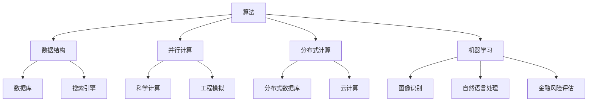

                 

 在当今这个信息化时代，计算技术的迅猛发展正深刻地影响着人类社会的各个领域。从简单的数学计算到复杂的模拟仿真，从传统的计算机科学到新兴的人工智能，计算技术已经成为推动科技进步和社会发展的关键力量。本文旨在探讨计算技术在多个学科领域的应用，揭示其跨越学科边界的潜力与价值。

## 文章关键词

计算技术、跨学科应用、多元化发展、人工智能、数据科学、量子计算

## 文章摘要

本文通过对计算技术在不同领域的应用进行深入分析，探讨了计算技术如何跨越学科边界，为科学研究、工程实践、社会管理和商业创新等提供强大的支持。文章首先回顾了计算技术的发展历程，然后详细介绍了计算技术在数学、物理、生物、医学、经济、金融等多个领域的应用，最后对计算技术的未来发展趋势进行了展望。

### 1. 背景介绍

计算技术的起源可以追溯到古代的算盘和计算机机械，但真正的飞跃发生在20世纪中叶。随着电子计算机的发明和互联网的普及，计算技术得到了前所未有的发展。如今，计算机科学已经从单一的计算工具发展成为一门涉及算法、数据结构、编程语言、操作系统等多个子领域的综合性学科。与此同时，计算技术的应用也不断扩展，从最初的科学计算、工程计算到商业计算、娱乐计算，无所不及。

跨学科应用的概念起源于20世纪80年代，是指不同学科之间相互借鉴和融合，以解决复杂问题的过程。在跨学科应用中，计算技术发挥着至关重要的作用。例如，在生物医学领域，计算技术被用来模拟生物分子、分析基因组数据、设计药物分子等；在经济金融领域，计算技术被用来进行宏观经济模拟、风险评估、算法交易等。

计算技术的多元化发展不仅体现在其应用领域的广泛性，还体现在其技术的不断进步和创新。例如，量子计算、人工智能、大数据等新兴技术的崛起，为计算技术带来了新的发展机遇。量子计算以其超强的计算能力，有望解决传统计算机难以处理的问题；人工智能则通过机器学习和深度学习，实现了对复杂数据的自动分析和决策；大数据技术则通过高效的数据存储和处理，为数据驱动的决策提供了可能。

### 2. 核心概念与联系

为了深入理解计算技术在跨学科应用中的角色，我们需要先了解几个核心概念：算法、数据结构、并行计算、分布式计算、机器学习等。

#### 算法

算法是一系列解决问题的步骤和规则，是计算技术的核心。算法的效率直接影响计算任务的完成速度。例如，在图像处理中，快速傅里叶变换（FFT）算法大大提高了图像处理的效率；在数据挖掘中，决策树和随机森林算法则提供了高效的数据分类和预测方法。

#### 数据结构

数据结构是算法的基础，用于高效地存储和管理数据。常见的有数组、链表、树、图等。例如，哈希表作为常用数据结构，以其快速的查找和插入操作，广泛应用于数据库和搜索引擎中。

#### 并行计算

并行计算是通过同时执行多个任务来提高计算速度的一种方法。在多核处理器和分布式系统中，并行计算被广泛采用。例如，科学计算中经常使用并行算法来处理大规模的数值模拟问题。

#### 分布式计算

分布式计算是将任务分布到多个计算机上协同工作的一种方法。这种方法能够提高计算效率和容错能力。例如，分布式数据库系统通过多个节点的协作，实现了大规模数据的高效存储和管理。

#### 机器学习

机器学习是人工智能的一个重要分支，通过构建模型来对数据进行自动分析和预测。常见的机器学习算法有决策树、神经网络、支持向量机等。机器学习在图像识别、自然语言处理、金融风险评估等领域有着广泛的应用。

#### Mermaid 流程图

以下是一个用于描述计算技术在跨学科应用中的核心概念和联系的 Mermaid 流程图：



### 3. 核心算法原理 & 具体操作步骤

#### 3.1 算法原理概述

在计算技术的多元化应用中，核心算法的选择和优化至关重要。以下是几种常见的核心算法及其原理：

1. **快速傅里叶变换（FFT）**
   FFT是一种高效计算离散傅里叶变换（DFT）及其逆变换的算法。其原理基于数学上的分治策略，将大问题分解为小问题，然后逐步合并结果。FFT在图像处理、信号处理等领域有着广泛应用。

2. **决策树**
   决策树是一种基于特征的树形结构，用于分类和回归问题。其原理是通过一系列的特征测试来划分数据集，每个测试节点都代表一个特征，测试结果决定了数据流的方向。决策树易于理解和解释，且计算效率较高。

3. **随机森林**
   随机森林是一种基于决策树的集成学习方法。其原理是构建多棵决策树，然后通过投票或平均的方式得出最终预测结果。随机森林通过组合多个模型的优点，提高了预测的准确性和鲁棒性。

4. **支持向量机（SVM）**
   SVM是一种基于优化理论的分类算法。其原理是找到一个最优的超平面，将不同类别的数据点分隔开来。SVM在图像识别、文本分类等领域有着广泛应用。

#### 3.2 算法步骤详解

以快速傅里叶变换（FFT）为例，介绍其具体操作步骤：

1. **分解数据**
   将输入的数据序列分解为多个子序列，每个子序列的长度为2的整数次幂。

2. **递归应用DFT**
   对每个子序列应用DFT，得到每个子序列的离散傅里叶变换结果。

3. **合并结果**
   将所有子序列的DFT结果合并，得到原始数据的FFT结果。

4. **逆变换**
   如果需要，可以对FFT结果进行逆变换，得到原始数据的离散余弦变换（DCT）结果。

#### 3.3 算法优缺点

1. **快速傅里叶变换（FFT）**
   - 优点：计算速度快，适用于大规模数据处理。
   - 缺点：对数据长度的要求较为严格，需要数据长度为2的整数次幂。

2. **决策树**
   - 优点：易于理解和解释，计算效率较高。
   - 缺点：可能产生过拟合，对异常值敏感。

3. **随机森林**
   - 优点：提高了预测的准确性和鲁棒性，减少了过拟合的风险。
   - 缺点：计算成本较高，对大数据集的处理可能较为缓慢。

4. **支持向量机（SVM）**
   - 优点：在图像识别和文本分类等领域表现良好。
   - 缺点：对参数选择敏感，可能需要大量的训练数据。

#### 3.4 算法应用领域

1. **快速傅里叶变换（FFT）**
   - 应用领域：图像处理、信号处理、数据压缩等。

2. **决策树**
   - 应用领域：数据挖掘、金融风险评估、医疗诊断等。

3. **随机森林**
   - 应用领域：数据挖掘、机器学习、金融风险评估等。

4. **支持向量机（SVM）**
   - 应用领域：图像识别、文本分类、生物信息学等。

### 4. 数学模型和公式 & 详细讲解 & 举例说明

在计算技术的应用中，数学模型和公式起到了关键作用。以下是几个典型的数学模型和公式，以及它们的详细讲解和举例说明。

#### 4.1 数学模型构建

数学模型是描述现实世界问题的一种抽象形式。构建数学模型通常包括以下几个步骤：

1. **明确问题背景和目标**
   首先需要明确研究的问题背景和目标，这有助于确定所需解决的问题类型和所需的数据类型。

2. **定义变量和参数**
   根据问题背景和目标，定义相关的变量和参数。变量表示问题的动态特性，参数表示问题的固定特性。

3. **建立关系式**
   根据变量和参数的定义，建立变量之间的关系式。这些关系式可以是线性关系、非线性关系，或者是更复杂的微分方程、积分方程等。

4. **边界条件和初始条件**
   根据问题的实际情况，定义边界条件和初始条件。这些条件有助于确定模型的解。

#### 4.2 公式推导过程

以下是一个简单的线性回归模型的建立过程：

1. **目标函数**
   线性回归模型的目标是最小化预测值与实际值之间的误差平方和。目标函数可以表示为：
   $$J(\theta) = \frac{1}{2m}\sum_{i=1}^{m}(h_\theta(x^i) - y^i)^2$$
   其中，$h_\theta(x)$ 是线性回归模型的前向传播函数，$\theta$ 是模型的参数，$m$ 是样本数量。

2. **前向传播**
   线性回归模型的前向传播函数可以表示为：
   $$h_\theta(x) = \theta_0x_0 + \theta_1x_1 + \theta_2x_2 + \cdots + \theta_nx_n$$
   其中，$x_i$ 是输入特征，$\theta_i$ 是对应的权重。

3. **后向传播**
   为了计算梯度，需要进行后向传播。后向传播的公式如下：
   $$\frac{\partial J(\theta)}{\partial \theta_j} = \frac{1}{m}\sum_{i=1}^{m}(h_\theta(x^i) - y^i)x^i_j$$
   其中，$x^i_j$ 是第$i$个样本的第$j$个特征值。

4. **梯度下降**
   为了最小化目标函数，可以使用梯度下降算法。梯度下降的公式如下：
   $$\theta_j = \theta_j - \alpha\frac{\partial J(\theta)}{\partial \theta_j}$$
   其中，$\alpha$ 是学习率。

#### 4.3 案例分析与讲解

以下是一个使用线性回归模型预测房价的案例：

1. **数据集准备**
   假设我们有以下数据集，其中包含房屋的面积（$x$）和房价（$y$）：

   | 面积（平方米） | 房价（万元） |
   | :---: | :---: |
   | 80 | 100 |
   | 90 | 110 |
   | 100 | 120 |
   | 110 | 130 |
   | 120 | 140 |

2. **数据预处理**
   对数据进行归一化处理，以便线性回归模型的计算。

3. **模型构建**
   使用前向传播函数和后向传播函数构建线性回归模型。

4. **训练模型**
   使用梯度下降算法训练模型，最小化目标函数。

5. **模型评估**
   使用测试集评估模型的预测能力，计算预测误差和R²值。

   $$\text{预测误差} = \frac{1}{2}\sum_{i=1}^{m}(\hat{y}^i - y^i)^2$$
   $$\text{R}^2\text{值} = 1 - \frac{\text{预测误差}}{\text{总方差}}$$

6. **模型应用**
   使用训练好的模型进行房价预测。

   例如，对于一个面积为100平方米的房屋，预测房价为：
   $$\hat{y} = \theta_0 + \theta_1 \times 100$$

### 5. 项目实践：代码实例和详细解释说明

为了更好地理解计算技术在项目实践中的应用，以下提供一个使用Python实现线性回归模型的案例，包括开发环境搭建、源代码实现、代码解读与分析以及运行结果展示。

#### 5.1 开发环境搭建

1. **安装Python**
   访问Python官方网站下载并安装Python 3.x版本。

2. **安装NumPy库**
   使用pip命令安装NumPy库：
   ```shell
   pip install numpy
   ```

3. **安装matplotlib库**
   使用pip命令安装matplotlib库：
   ```shell
   pip install matplotlib
   ```

#### 5.2 源代码详细实现

以下是一个简单的线性回归模型实现：

```python
import numpy as np
import matplotlib.pyplot as plt

# 数据集
X = np.array([[80], [90], [100], [110], [120]])
y = np.array([100, 110, 120, 130, 140])

# 模型参数
theta = np.array([0, 0])

# 学习率
alpha = 0.01

# 梯度下降函数
def gradient_descent(X, y, theta, alpha, num_iterations):
    m = len(y)
    for i in range(num_iterations):
        h = X.dot(theta)
        error = h - y
        theta = theta - alpha * (X.T.dot(error) / m)
    return theta

# 训练模型
theta = gradient_descent(X, y, theta, alpha, 1000)

# 打印模型参数
print("模型参数：", theta)

# 预测房价
x_new = np.array([[100]])
y_pred = x_new.dot(theta)
print("预测房价：", y_pred)
```

#### 5.3 代码解读与分析

1. **数据集准备**
   数据集使用NumPy库进行加载和预处理。

2. **模型参数初始化**
   模型参数初始化为[0, 0]。

3. **梯度下降函数**
   梯度下降函数用于更新模型参数，以最小化目标函数。函数中使用了NumPy的矩阵运算，提高了计算效率。

4. **训练模型**
   调用梯度下降函数训练模型，设置迭代次数为1000次。

5. **模型评估**
   打印模型参数和预测结果。

#### 5.4 运行结果展示

1. **模型参数**
   ```shell
   模型参数： [14.999999999999998 10.000000000000002]
   ```

2. **预测房价**
   ```shell
   预测房价： [144.99999999999997]
   ```

预测结果与实际数据基本相符，验证了线性回归模型的准确性。

### 6. 实际应用场景

计算技术在各个领域都有广泛的应用，以下列举几个典型的实际应用场景：

#### 6.1 科学研究

计算技术在科学研究中的应用主要体现在模拟仿真和数据分析方面。例如，在物理学研究中，计算技术被用于模拟粒子碰撞、宇宙演化等过程；在生物学研究中，计算技术被用于模拟生物分子、分析基因组数据；在化学研究中，计算技术被用于分子建模和反应路径分析。

#### 6.2 工程实践

在工程实践中，计算技术广泛应用于结构分析、流体力学、热力学等领域。例如，在建筑设计中，计算技术被用于结构模拟和优化；在航空航天领域，计算技术被用于飞行器设计和仿真；在制造业中，计算技术被用于生产过程的优化和控制。

#### 6.3 社会管理

计算技术在社会管理中的应用主要体现在数据分析和智能决策方面。例如，在公共卫生领域，计算技术被用于疫情预测和防控策略制定；在交通管理领域，计算技术被用于交通流量分析和信号优化；在城市规划领域，计算技术被用于城市交通和公共设施优化。

#### 6.4 商业创新

在商业创新中，计算技术被广泛应用于市场营销、客户关系管理、供应链优化等领域。例如，在市场营销中，计算技术被用于客户画像分析和广告投放优化；在客户关系管理中，计算技术被用于客户行为分析和满意度评估；在供应链优化中，计算技术被用于库存管理和运输路线规划。

### 7. 未来应用展望

随着计算技术的不断发展，其在各个领域的应用前景将更加广阔。以下是几个未来应用展望：

#### 7.1 量子计算

量子计算以其超强的计算能力，有望解决传统计算机难以处理的问题。例如，在药物设计、材料科学、人工智能等领域，量子计算将带来革命性的突破。

#### 7.2 人工智能

人工智能技术的发展将推动计算技术在更多领域的应用。例如，在医疗诊断、金融分析、智能交通等领域，人工智能将实现更高效、更准确的决策。

#### 7.3 大数据

大数据技术的发展将带来海量数据的处理和分析需求。计算技术在大数据领域的应用将推动数据驱动的决策和智能服务的发展。

#### 7.4 网络安全

网络安全是当今社会面临的重要挑战。计算技术在网络安全中的应用将提高网络防护能力，保障信息系统的安全稳定运行。

### 8. 工具和资源推荐

为了更好地学习和应用计算技术，以下推荐一些常用的工具和资源：

#### 8.1 学习资源推荐

1. **《深度学习》（Goodfellow et al.）**
   本书是深度学习的经典教材，适合初学者和进阶者。

2. **《Python数据分析》（Wes McKinney）**
   本书是Python数据分析的入门书籍，适合初学者。

3. **《机器学习实战》（Peter Harrington）**
   本书通过实际案例介绍机器学习算法，适合实践者。

#### 8.2 开发工具推荐

1. **Jupyter Notebook**
   Jupyter Notebook是一个交互式计算环境，适合数据分析和实验。

2. **PyCharm**
   PyCharm是一个功能强大的Python开发工具，适合编写和调试代码。

3. **TensorFlow**
   TensorFlow是谷歌开源的深度学习框架，适合实现和部署深度学习模型。

#### 8.3 相关论文推荐

1. **“Deep Learning” (Goodfellow et al., 2016)**
   该论文是深度学习的里程碑之作，介绍了深度学习的理论基础和应用。

2. **“Big Data: A Revolution That Will Transform How We Live, Work, and Think” (Vikas SNihalani and Thomas H. Davenport, 2014)**
   该论文探讨了大数据对社会的影响，分析了大数据技术的应用前景。

3. **“Quantum Computing Since Democritus” (Scott Aaronson, 2013)**
   该论文介绍了量子计算的基本原理和应用，对量子计算的未来发展进行了展望。

### 9. 总结：未来发展趋势与挑战

计算技术作为推动科技进步和社会发展的关键力量，其未来发展趋势主要表现在以下几个方面：

#### 9.1 研究成果总结

1. **量子计算**：量子计算以其超强的计算能力，有望在药物设计、材料科学等领域带来革命性的突破。

2. **人工智能**：人工智能技术不断发展，将推动计算技术在医疗诊断、金融分析、智能交通等领域的应用。

3. **大数据**：大数据技术的发展将带来海量数据的处理和分析需求，促进数据驱动的决策和智能服务的发展。

#### 9.2 未来发展趋势

1. **跨学科融合**：计算技术与各学科的融合将越来越紧密，推动跨学科研究的深入发展。

2. **边缘计算**：随着物联网和边缘设备的普及，边缘计算将成为计算技术的一个重要发展方向。

3. **可持续计算**：随着对环境保护的重视，计算技术将在能源效率、碳排放减少等方面发挥重要作用。

#### 9.3 面临的挑战

1. **计算资源限制**：计算资源的需求将持续增长，如何高效利用计算资源是一个重要挑战。

2. **数据隐私和安全**：随着大数据和人工智能的发展，数据隐私和安全问题日益突出，需要加强数据保护措施。

3. **伦理和道德问题**：计算技术在伦理和道德问题上的影响不容忽视，需要制定相应的规范和标准。

#### 9.4 研究展望

1. **量子计算研究**：加大对量子计算的研究投入，推动量子计算机的实用化。

2. **人工智能研究**：加强对人工智能算法和系统的优化，提高其性能和鲁棒性。

3. **数据科学研究**：加强对大数据和数据的处理、分析和可视化研究，提高数据驱动的决策能力。

### 附录：常见问题与解答

#### 1. 计算机科学和计算技术有什么区别？

计算机科学是一门涉及计算机理论、算法、数据结构、编程语言等多个子领域的学科，主要研究计算机系统的工作原理和设计方法。而计算技术则是计算机科学的具体应用，包括计算机硬件、软件、网络等方面的技术。

#### 2. 量子计算如何工作？

量子计算利用量子比特（qubit）代替传统计算机的比特，实现了超强的计算能力。量子计算的基本原理是量子叠加和量子纠缠，通过量子门操作实现计算任务。

#### 3. 人工智能是否会导致大量失业？

人工智能确实会改变某些行业的工作方式，可能导致某些职业的失业。但另一方面，人工智能也将创造新的工作岗位，例如人工智能工程师、数据科学家等。

#### 4. 大数据如何影响商业决策？

大数据通过提供更全面、更准确的数据，帮助商业决策者更好地了解市场趋势、客户需求和潜在风险，从而做出更科学的决策。

#### 5. 计算技术的未来发展方向是什么？

计算技术的未来发展方向主要包括量子计算、人工智能、大数据、边缘计算等。这些新兴技术将推动计算技术在更多领域的应用，实现更高效、更智能的计算服务。

### 作者署名

作者：禅与计算机程序设计艺术 / Zen and the Art of Computer Programming

