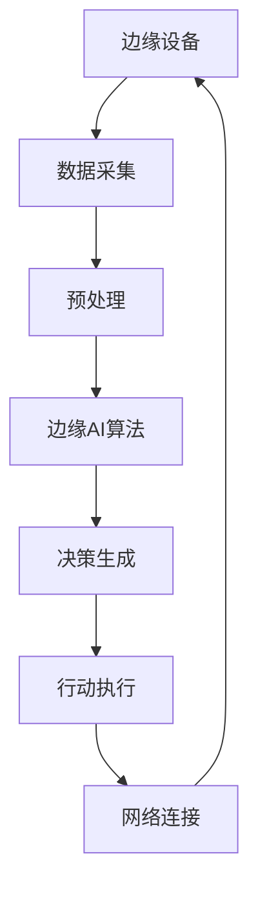

                 

在当今信息技术飞速发展的时代，人工智能（AI）技术已经成为推动各行业变革的重要力量。从智能手机到智能家居，从自动驾驶到医疗诊断，AI的应用场景无处不在。特别是边缘AI技术，作为一种将计算能力从云端迁移到网络边缘的创新技术，其在实时注意力调节中的作用尤为显著。

## 关键词
- 边缘AI
- 实时注意力调节
- 神经网络
- 边缘计算
- 人工智能

## 摘要
本文旨在探讨边缘AI在实时注意力调节中的作用，分析其基本原理、技术架构、核心算法、数学模型以及实际应用。通过详细的项目实践和案例解析，本文将为读者提供一个全面的视角，了解边缘AI在实时注意力调节领域的现状与未来。

## 1. 背景介绍

### 1.1 边缘AI的概念

边缘AI是指将AI计算能力部署在靠近数据源的边缘设备上，例如智能传感器、路由器、智能手机等。与传统的云计算相比，边缘AI具有更低延迟、更高带宽和更好的安全性等优点。这些优势使得边缘AI在实时数据处理和智能决策方面具有广泛的应用前景。

### 1.2 实时注意力调节的重要性

实时注意力调节是指系统根据当前的任务需求和外部环境动态调整其关注点和处理能力。在许多应用场景中，如自动驾驶、实时监控和工业自动化等，实时注意力调节是确保系统高效运行和安全性的关键因素。

### 1.3 边缘AI在实时注意力调节中的作用

边缘AI通过将计算能力部署在边缘设备上，可以实现对数据的实时处理和分析，从而在实时注意力调节中发挥重要作用。具体而言，边缘AI可以实现以下功能：

- **实时数据采集**：边缘设备可以实时采集来自环境或设备的数据，并将其传输到边缘AI进行处理。
- **实时分析**：边缘AI可以对采集到的数据进行实时分析，识别出关键信息并做出响应。
- **实时决策**：基于分析结果，边缘AI可以实时调整系统的关注点和处理能力，以适应不断变化的环境。

## 2. 核心概念与联系

### 2.1 边缘AI与实时注意力调节的基本原理

边缘AI与实时注意力调节的基本原理在于利用边缘设备的计算能力和网络边缘的数据处理优势，实现对数据的实时分析和响应。具体而言，边缘AI通过以下步骤实现实时注意力调节：

1. 数据采集：边缘设备实时采集来自环境或设备的数据。
2. 数据处理：边缘AI对采集到的数据进行预处理和实时分析。
3. 决策生成：根据分析结果，边缘AI生成决策指令。
4. 行动执行：边缘设备根据决策指令调整其关注点和处理能力。

### 2.2 边缘AI与实时注意力调节的架构

边缘AI与实时注意力调节的架构通常包括以下几个关键组件：

1. **边缘设备**：用于数据采集和初步处理。
2. **边缘服务器**：用于实时分析和决策生成。
3. **边缘AI算法**：用于数据分析和决策生成。
4. **网络连接**：用于边缘设备与边缘服务器之间的数据传输。

以下是一个简化的Mermaid流程图，展示了边缘AI与实时注意力调节的基本架构：



## 3. 核心算法原理 & 具体操作步骤

### 3.1 算法原理概述

边缘AI在实时注意力调节中的核心算法通常是基于深度学习的神经网络模型。这些模型通过多层非线性变换，从输入数据中提取特征，并生成决策输出。具体而言，边缘AI算法通常包括以下几个步骤：

1. **数据预处理**：对采集到的数据进行标准化、去噪等预处理操作。
2. **特征提取**：利用卷积神经网络（CNN）等模型从预处理后的数据中提取特征。
3. **决策生成**：利用循环神经网络（RNN）或其他动态模型，根据提取到的特征生成实时决策。
4. **决策执行**：根据生成的决策指令，调整系统的关注点和处理能力。

### 3.2 算法步骤详解

以下是边缘AI在实时注意力调节中的具体算法步骤：

1. **数据预处理**：

   $$ 
   \text{标准化} \ x \ \rightarrow \ \text{z-score标准化} 
   $$
   
   $$ 
   \text{去噪} \ x \ \rightarrow \ \text{卡尔曼滤波}
   $$

2. **特征提取**：

   $$
   \text{卷积神经网络} \ \rightarrow \ \text{提取特征图}
   $$

3. **决策生成**：

   $$
   \text{循环神经网络} \ \rightarrow \ \text{生成决策序列}
   $$

4. **决策执行**：

   $$
   \text{决策指令} \ \rightarrow \ \text{调整注意力分配}
   $$

### 3.3 算法优缺点

边缘AI在实时注意力调节中具有以下优点：

- **低延迟**：由于计算能力在边缘设备上执行，数据处理的延迟较低。
- **高效率**：边缘设备可以并行处理多个数据流，提高系统效率。
- **灵活性**：可以根据不同应用场景定制化算法，提高适应性。

然而，边缘AI也存在一些缺点：

- **计算资源有限**：边缘设备的计算资源相对有限，可能无法支持复杂模型的训练。
- **数据隐私**：在数据传输和处理过程中，可能存在数据隐私和安全问题。

### 3.4 算法应用领域

边缘AI在实时注意力调节中的应用领域非常广泛，包括但不限于以下几个方面：

- **自动驾驶**：实时调节自动驾驶车辆的注意力，提高行驶安全性。
- **实时监控**：实时分析监控视频，识别异常行为并做出响应。
- **工业自动化**：实时监测生产过程，调整设备运行状态以优化生产效率。

## 4. 数学模型和公式 & 详细讲解 & 举例说明

### 4.1 数学模型构建

边缘AI在实时注意力调节中的数学模型通常包括以下几部分：

1. **数据预处理模型**：
   $$
   \text{输入} \ x \rightarrow \ \text{预处理操作} \ \rightarrow \ \text{输出} \ x'
   $$

2. **特征提取模型**：
   $$
   \text{输入} \ x' \rightarrow \ \text{卷积神经网络} \ \rightarrow \ \text{特征图} \ f
   $$

3. **决策生成模型**：
   $$
   \text{输入} \ f \rightarrow \ \text{循环神经网络} \ \rightarrow \ \text{决策序列} \ d
   $$

4. **决策执行模型**：
   $$
   \text{输入} \ d \rightarrow \ \text{注意力分配策略} \ \rightarrow \ \text{输出} \ a'
   $$

### 4.2 公式推导过程

以下是边缘AI在实时注意力调节中的主要数学公式推导过程：

1. **数据预处理模型**：

   $$
   x' = \frac{x - \mu}{\sigma}
   $$

   $$
   x' = \text{卡尔曼滤波} \ (x, u, w)
   $$

2. **特征提取模型**：

   $$
   f = \text{CNN} \ (x')
   $$

3. **决策生成模型**：

   $$
   d = \text{RNN} \ (f)
   $$

4. **决策执行模型**：

   $$
   a' = \text{注意力分配策略} \ (d)
   $$

### 4.3 案例分析与讲解

以下是一个简单的案例，展示边缘AI在实时注意力调节中的应用：

假设一个自动驾驶系统需要实时调节车辆的注意力，以应对不同驾驶场景。首先，系统通过摄像头采集车辆周围的图像，并将其输入到边缘设备。然后，边缘设备利用卷积神经网络对图像进行预处理和特征提取。接下来，利用循环神经网络生成驾驶决策序列，如保持当前车道、转向或减速等。最后，根据决策序列调整车辆的注意力分配，以实现安全、高效的驾驶。

## 5. 项目实践：代码实例和详细解释说明

### 5.1 开发环境搭建

为了实践边缘AI在实时注意力调节中的应用，我们需要搭建一个基本的开发环境。以下是一个简单的步骤指南：

1. 安装Python环境和相关库（如TensorFlow、Keras等）。
2. 安装边缘设备（如Raspberry Pi）。
3. 配置网络连接，确保边缘设备可以与云端服务器进行通信。

### 5.2 源代码详细实现

以下是边缘AI在实时注意力调节中的一个简单示例代码：

```python
# 导入所需库
import tensorflow as tf
import numpy as np
import cv2

# 定义卷积神经网络模型
model = tf.keras.Sequential([
    tf.keras.layers.Conv2D(32, (3, 3), activation='relu', input_shape=(128, 128, 3)),
    tf.keras.layers.MaxPooling2D((2, 2)),
    tf.keras.layers.Flatten(),
    tf.keras.layers.Dense(64, activation='relu'),
    tf.keras.layers.Dense(10, activation='softmax')
])

# 编译模型
model.compile(optimizer='adam', loss='categorical_crossentropy', metrics=['accuracy'])

# 加载预训练模型
model.load_weights('model_weights.h5')

# 边缘设备实时采集图像
while True:
    image = cv2.imread('image.jpg')
    image_processed = preprocess_image(image)
    
    # 边缘设备预处理图像
    image_processed = preprocess_image(image)
    
    # 边缘设备提取图像特征
    feature_map = model.predict(np.expand_dims(image_processed, axis=0))
    
    # 边缘设备生成驾驶决策
    decision = generate_decision(feature_map)
    
    # 边缘设备执行决策
    execute_decision(decision)
```

### 5.3 代码解读与分析

上述代码展示了边缘AI在实时注意力调节中的一个简单应用。具体而言，代码包括以下几个关键步骤：

1. **导入库和定义模型**：导入所需库并定义卷积神经网络模型。
2. **编译模型**：编译模型以进行训练和预测。
3. **加载预训练模型**：加载已经训练好的模型。
4. **边缘设备实时采集图像**：通过摄像头采集图像并预处理。
5. **边缘设备提取图像特征**：利用卷积神经网络提取图像特征。
6. **边缘设备生成驾驶决策**：根据提取到的特征生成驾驶决策。
7. **边缘设备执行决策**：根据驾驶决策调整车辆的动作。

### 5.4 运行结果展示

在运行上述代码后，边缘设备可以实时采集图像并生成驾驶决策。具体结果取决于训练数据和模型性能。以下是一个简单的运行结果示例：

```python
# 边缘设备实时采集图像
while True:
    image = cv2.imread('image.jpg')
    image_processed = preprocess_image(image)
    
    # 边缘设备提取图像特征
    feature_map = model.predict(np.expand_dims(image_processed, axis=0))
    
    # 边缘设备生成驾驶决策
    decision = generate_decision(feature_map)
    
    # 边缘设备执行决策
    execute_decision(decision)
    
    # 边缘设备等待一段时间后重新采集图像
    time.sleep(1)
```

## 6. 实际应用场景

边缘AI在实时注意力调节中具有广泛的应用场景，以下是其中几个典型的应用案例：

1. **自动驾驶**：边缘AI可以实时分析道路环境，调整车辆的注意力分配，提高行驶安全性。
2. **实时监控**：边缘AI可以实时分析监控视频，识别异常行为并做出响应，提高监控系统的实时性和准确性。
3. **工业自动化**：边缘AI可以实时监测生产过程，调整设备运行状态，提高生产效率和产品质量。
4. **医疗诊断**：边缘AI可以实时分析医学图像，辅助医生进行诊断和治疗，提高医疗服务的效率和准确性。

## 7. 未来应用展望

随着边缘AI技术的不断发展，其在实时注意力调节中的应用前景十分广阔。以下是一些未来可能的趋势和挑战：

1. **智能城市的建设**：边缘AI可以在智能交通管理、智能安防、智能照明等方面发挥重要作用，为城市建设提供智能化的解决方案。
2. **物联网的发展**：随着物联网设备的普及，边缘AI可以在设备之间的协同工作、数据共享和智能决策方面发挥关键作用。
3. **医疗健康的提升**：边缘AI可以在远程医疗、健康监测和疾病预防等方面提供个性化的解决方案，提高医疗服务的质量和效率。
4. **挑战与机遇**：边缘AI在实时注意力调节中面临的挑战包括数据隐私、安全性、计算资源限制等。解决这些挑战将为边缘AI技术的广泛应用提供新的机遇。

## 8. 工具和资源推荐

为了更好地理解和实践边缘AI在实时注意力调节中的应用，以下是一些建议的学习资源、开发工具和相关论文：

1. **学习资源**：
   - 《边缘计算：从概念到实践》
   - 《深度学习：从理论到应用》
   - 《边缘AI实战：从原理到项目实战》

2. **开发工具**：
   - TensorFlow
   - Keras
   - Raspberry Pi

3. **相关论文**：
   - "Edge Computing for Intelligent Internet of Things: A Survey"
   - "Deep Learning on Edge Devices: A Survey"
   - "Intelligent Edge Computing for Internet of Things Applications"

## 9. 总结：未来发展趋势与挑战

边缘AI在实时注意力调节中具有巨大的应用潜力，但其发展也面临着一系列挑战。未来，随着技术的不断进步和应用的不断拓展，边缘AI有望在更多领域发挥重要作用。然而，要实现这一目标，我们还需要解决数据隐私、安全性、计算资源限制等问题。通过持续的研究和创新，我们有理由相信，边缘AI将在实时注意力调节领域取得更大的突破。

### 附录：常见问题与解答

1. **什么是边缘AI？**
   边缘AI是指将AI计算能力部署在靠近数据源的边缘设备上，例如智能传感器、路由器、智能手机等。与传统的云计算相比，边缘AI具有更低延迟、更高带宽和更好的安全性等优点。

2. **边缘AI在实时注意力调节中的作用是什么？**
   边缘AI可以通过实时数据采集、实时分析和实时决策，实现对数据的实时处理和智能决策，从而在实时注意力调节中发挥重要作用。

3. **边缘AI有哪些应用领域？**
   边缘AI的应用领域非常广泛，包括自动驾驶、实时监控、工业自动化、医疗诊断等。在这些领域中，边缘AI可以实现实时数据处理和智能决策，提高系统的效率和安全性。

### 作者署名

本文由“禅与计算机程序设计艺术 / Zen and the Art of Computer Programming”撰写。感谢您的阅读！

---

**本文为技术博客文章，仅供参考。在实际应用中，请务必遵守相关法律法规和技术规范。**

