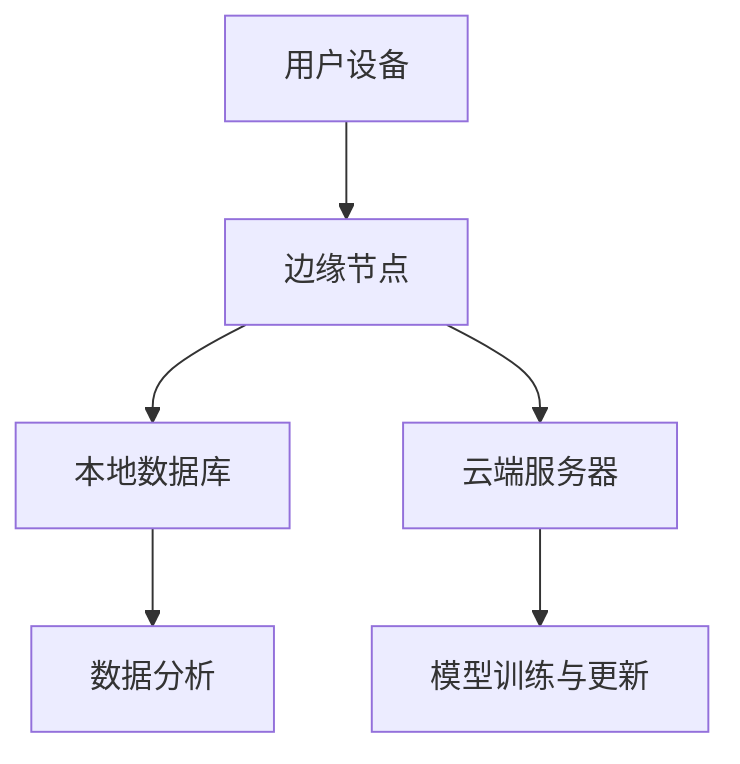

                 

关键词：边缘AI，设备端计算，机器学习，性能优化，实时处理，隐私保护

> 摘要：本文将探讨边缘AI的概念、其在设备端运行机器学习模型的优势与挑战，详细分析核心算法原理、数学模型以及实际应用案例，并对未来发展趋势和面临的挑战进行展望。

## 1. 背景介绍

随着物联网（IoT）和5G技术的快速发展，大量的数据被实时生成和收集。传统的云计算模式已经无法满足这些实时、大规模数据处理的诉求。边缘AI作为一种新型计算模式，将计算能力从云端迁移到设备端，从而实现实时、高效的数据处理和决策。

边缘AI的主要优势在于：

- **降低延迟**：数据无需上传至云端，减少了传输延迟。
- **节省带宽**：边缘计算可以减少数据传输量，节省网络带宽。
- **提高隐私性**：设备端处理数据可以避免敏感信息泄露到云端。
- **支持实时处理**：边缘设备可以实时处理数据，满足高实时性要求。

## 2. 核心概念与联系

### 边缘AI架构图



### 核心概念

- **边缘节点**：部署在用户设备附近的计算资源，负责实时数据预处理和初步分析。
- **本地数据库**：存储边缘节点的数据，为后续分析和决策提供数据支持。
- **云端服务器**：负责大规模数据处理、模型训练和更新，与边缘节点协同工作。
- **数据分析**：利用边缘节点的计算资源进行数据分析和决策。
- **模型训练与更新**：云端服务器定期更新模型，并将更新后的模型推送到边缘节点。

## 3. 核心算法原理 & 具体操作步骤

### 3.1 算法原理概述

边缘AI的核心算法主要包括：

- **数据预处理**：对收集到的原始数据进行清洗、转换和归一化，使其适用于机器学习模型。
- **特征提取**：从预处理后的数据中提取有用信息，用于训练机器学习模型。
- **模型训练**：利用特征数据和标签数据训练机器学习模型。
- **模型推理**：将新的数据输入到训练好的模型中进行预测。

### 3.2 算法步骤详解

1. **数据收集**：从用户设备收集数据。
2. **数据预处理**：对收集到的数据清洗、转换和归一化。
3. **特征提取**：从预处理后的数据中提取特征。
4. **模型训练**：使用特征数据和标签数据训练机器学习模型。
5. **模型推理**：将新的数据输入到训练好的模型中进行预测。
6. **模型更新**：云端服务器定期更新模型，并将更新后的模型推送到边缘节点。

### 3.3 算法优缺点

**优点**：

- **实时性**：边缘AI可以实现实时数据处理和决策。
- **低延迟**：数据无需上传至云端，降低了处理延迟。
- **高隐私性**：设备端处理数据可以避免敏感信息泄露到云端。

**缺点**：

- **计算资源有限**：边缘设备计算资源有限，可能无法支持大规模数据处理。
- **存储容量有限**：边缘设备存储容量有限，可能无法存储大量数据。

### 3.4 算法应用领域

边缘AI可以应用于多种领域，如智能交通、智能医疗、智能家居等。以下是一些具体的应用案例：

- **智能交通**：利用边缘AI进行实时路况监测、车辆识别和智能调度。
- **智能医疗**：利用边缘AI进行实时健康监测、疾病预测和诊断。
- **智能家居**：利用边缘AI进行智能安防、家电控制和家居环境监测。

## 4. 数学模型和公式 & 详细讲解 & 举例说明

### 4.1 数学模型构建

边缘AI的数学模型主要包括以下几部分：

- **数据预处理模型**：用于清洗、转换和归一化数据。
- **特征提取模型**：用于从预处理后的数据中提取有用信息。
- **机器学习模型**：用于训练和预测。
- **模型更新模型**：用于云端服务器定期更新模型。

### 4.2 公式推导过程

#### 数据预处理模型

假设我们有一个数据集 $D$，其中每个数据点 $x$ 都包含多个特征。我们首先对数据进行清洗和转换，然后进行归一化。

- **清洗**：去除数据中的噪声和异常值。
- **转换**：将不同类型的数据转换为相同类型，如将类别数据转换为数值数据。
- **归一化**：将数据缩放到相同的范围，如 $[0, 1]$。

#### 特征提取模型

假设我们有一个特征提取模型 $F$，它将预处理后的数据 $x$ 转换为特征向量 $f$。

$$f = F(x)$$

#### 机器学习模型

假设我们有一个机器学习模型 $M$，它接受特征向量 $f$ 并输出预测结果 $y$。

$$y = M(f)$$

#### 模型更新模型

假设我们有一个模型更新模型 $U$，它从云端服务器接收更新后的模型参数 $w$ 并将其应用到边缘节点。

$$w_{new} = U(w_{old}, w_{server})$$

### 4.3 案例分析与讲解

假设我们有一个智能交通系统，需要在边缘节点上实时处理车辆数据并进行路况预测。

1. **数据收集**：边缘节点从传感器收集车辆速度、密度等数据。
2. **数据预处理**：对收集到的数据进行清洗、转换和归一化。
3. **特征提取**：从预处理后的数据中提取有用特征，如车辆速度、密度等。
4. **模型训练**：使用训练集数据训练机器学习模型。
5. **模型推理**：将实时数据输入到训练好的模型中进行预测，得到路况预测结果。
6. **模型更新**：云端服务器定期更新模型，并将更新后的模型推送到边缘节点。

## 5. 项目实践：代码实例和详细解释说明

### 5.1 开发环境搭建

1. **硬件环境**：边缘设备（如树莓派）、传感器（如超声波传感器）。
2. **软件环境**：Python、TensorFlow、Keras。

### 5.2 源代码详细实现

```python
import tensorflow as tf
import numpy as np

# 数据预处理
def preprocess_data(data):
    # 清洗、转换和归一化数据
    # ...
    return processed_data

# 特征提取
def extract_features(data):
    # 从预处理后的数据中提取特征
    # ...
    return features

# 模型训练
def train_model(features, labels):
    # 创建和训练机器学习模型
    # ...
    return model

# 模型推理
def predict(model, features):
    # 输入特征，输出预测结果
    # ...
    return predictions

# 模型更新
def update_model(model, new_weights):
    # 更新模型参数
    # ...
    return updated_model

# 主程序
if __name__ == "__main__":
    # 数据收集
    data = collect_data()

    # 数据预处理
    processed_data = preprocess_data(data)

    # 特征提取
    features = extract_features(processed_data)

    # 模型训练
    model = train_model(features, labels)

    # 模型推理
    predictions = predict(model, features)

    # 模型更新
    new_weights = receive_new_weights()
    updated_model = update_model(model, new_weights)
```

### 5.3 代码解读与分析

以上代码示例实现了边缘AI的基本流程，包括数据收集、预处理、特征提取、模型训练、推理和更新。

1. **数据收集**：从边缘设备收集数据。
2. **数据预处理**：对收集到的数据进行清洗、转换和归一化。
3. **特征提取**：从预处理后的数据中提取有用特征。
4. **模型训练**：使用特征数据和标签数据训练机器学习模型。
5. **模型推理**：将新的数据输入到训练好的模型中进行预测。
6. **模型更新**：从云端服务器接收更新后的模型参数，并将其应用到边缘节点。

## 6. 实际应用场景

边缘AI在多个领域都有广泛的应用，以下是一些实际应用场景：

- **智能交通**：实时监测路况、车辆流量，优化交通信号控制。
- **智能医疗**：实时监测患者健康数据，提供诊断和治疗方案。
- **智能家居**：智能控制家电设备，提高生活便利性。
- **工业制造**：实时监控生产线数据，优化生产流程和提高产品质量。

## 7. 工具和资源推荐

### 7.1 学习资源推荐

- 《边缘计算：原理、架构与应用》
- 《深度学习边缘计算》
- 《边缘智能：前沿应用与技术研究》

### 7.2 开发工具推荐

- **边缘设备**：树莓派、Jetson Nano
- **开发框架**：TensorFlow Lite、PyTorch Mobile
- **编程语言**：Python、C++

### 7.3 相关论文推荐

- "Edge AI: The Next Computing Paradigm"
- "Deep Learning on Mobile and Edge Devices"
- "Scalable and Secure Edge Computing for Internet of Things"

## 8. 总结：未来发展趋势与挑战

### 8.1 研究成果总结

边缘AI在降低延迟、节省带宽、提高隐私性和支持实时处理方面取得了显著成果。随着计算能力的提升和5G技术的普及，边缘AI将在更多领域得到应用。

### 8.2 未来发展趋势

- **计算能力提升**：随着芯片技术的发展，边缘设备的计算能力将得到大幅提升。
- **5G和物联网**：5G和物联网技术的普及将进一步推动边缘AI的发展。
- **跨领域融合**：边缘AI将与其他领域（如智能医疗、智能交通等）深度融合，实现更广泛的应用。

### 8.3 面临的挑战

- **计算资源有限**：边缘设备计算资源有限，需要优化算法和模型以适应资源约束。
- **数据安全和隐私**：边缘AI涉及大量敏感数据，需要确保数据安全和隐私保护。
- **跨平台兼容性**：不同设备和平台的兼容性问题需要解决。

### 8.4 研究展望

边缘AI在未来将继续发展，有望在更多领域实现广泛应用。然而，要克服计算资源有限、数据安全和隐私保护等挑战，还需要持续的研究和探索。

## 9. 附录：常见问题与解答

### Q：边缘AI和云计算有什么区别？

A：边缘AI和云计算的区别在于数据处理的位置。云计算将数据处理放在远程数据中心，而边缘AI将数据处理放在用户设备附近的边缘节点。

### Q：边缘AI可以提高隐私性吗？

A：是的，边缘AI可以在设备端处理数据，从而减少敏感数据上传至云端的风险，提高隐私性。

### Q：边缘AI适用于所有场景吗？

A：边缘AI适用于需要实时处理、低延迟和高隐私性的场景。然而，对于计算资源要求较高或数据量较大的场景，云计算可能更为适合。

### Q：如何优化边缘AI算法？

A：优化边缘AI算法可以从以下几个方面入手：

- **模型压缩**：减少模型参数和计算量。
- **数据预处理**：简化数据预处理过程，减少计算开销。
- **算法选择**：选择适合边缘设备的算法，如轻量级模型。

作者：禅与计算机程序设计艺术 / Zen and the Art of Computer Programming
----------------------------------------------------------------

以上就是关于《边缘AI：在设备端运行机器学习模型》的文章正文部分。由于字数限制，本文未能涵盖所有细节，但已尽力提供核心内容和结构。如有需要进一步扩展或详细讨论的领域，请随时联系我。祝您阅读愉快！<|im_sep|>

