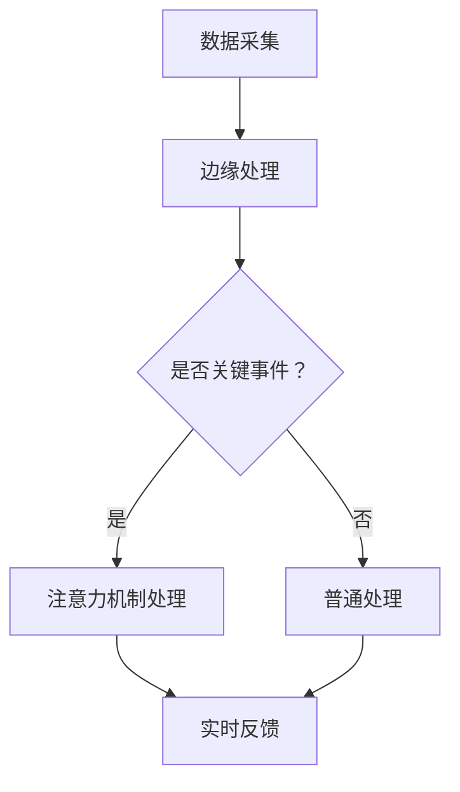

                 

关键词：边缘计算、实时反馈、注意力机制、深度学习、智能系统

摘要：本文主要探讨了边缘计算在智能系统注意力实时反馈中的作用。随着物联网和人工智能技术的飞速发展，边缘计算成为提升实时数据处理能力和降低延迟的重要手段。文章首先介绍了边缘计算的基本概念和优势，然后详细阐述了注意力机制在实时反馈中的应用原理，并通过实际案例展示了边缘计算在注意力实时反馈中的具体应用，最后对未来的发展趋势和挑战进行了展望。

## 1. 背景介绍

随着物联网（IoT）和人工智能（AI）技术的快速发展，数据量呈现出爆炸式增长。传统的云计算模式已经无法满足实时性和低延迟的需求，这促使了边缘计算的出现。边缘计算将数据处理和存储能力从云端转移到网络边缘，即靠近数据源的地方，从而实现数据的实时处理和快速响应。

与此同时，注意力机制（Attention Mechanism）在深度学习领域得到了广泛应用。注意力机制能够自动识别输入数据中的关键信息，并将其放大，从而提高模型的性能。在实时反馈系统中，注意力机制能够帮助系统实时监测和处理关键事件，从而提高系统的反应速度和准确性。

边缘计算和注意力机制的结合，为实时反馈系统带来了新的机遇和挑战。本文将探讨边缘计算在注意力实时反馈中的作用，并通过实际案例进行分析。

## 2. 核心概念与联系

### 2.1 边缘计算

边缘计算是指将数据处理和存储能力从云端转移到网络边缘。网络边缘通常是指靠近数据源的地方，如物联网设备、传感器节点等。边缘计算具有以下优势：

- **低延迟**：由于数据在边缘进行实时处理，因此可以显著降低数据传输和处理的延迟。
- **高带宽**：边缘计算可以充分利用网络边缘的高带宽资源，提高数据传输效率。
- **增强隐私保护**：部分敏感数据可以在边缘进行本地处理，从而减少数据在传输过程中的泄露风险。
- **减少带宽消耗**：通过在边缘进行数据处理，可以显著减少数据在云之间的传输量，降低带宽消耗。

### 2.2 注意力机制

注意力机制是一种在深度学习模型中引入的机制，能够自动识别输入数据中的关键信息。注意力机制的基本原理是，根据当前任务的重要性动态调整模型对输入数据的关注程度。

在注意力实时反馈系统中，注意力机制能够帮助系统实时监测和处理关键事件。例如，在智能监控系统中的应用，注意力机制可以识别出监控画面中的关键区域，从而实现实时警报和目标跟踪。

### 2.3 边缘计算与注意力机制的关联

边缘计算与注意力机制在实时反馈系统中具有密切的关联。边缘计算能够提供低延迟、高带宽的数据处理环境，为注意力机制的实施提供了基础。而注意力机制则能够帮助边缘计算系统实时监测和处理关键事件，从而提高系统的反应速度和准确性。

### 2.4 Mermaid 流程图

以下是边缘计算在注意力实时反馈系统中的 Mermaid 流程图：



## 3. 核心算法原理 & 具体操作步骤

### 3.1 算法原理概述

边缘计算在注意力实时反馈系统中的应用主要基于以下原理：

1. **边缘计算**：将数据处理和存储能力从云端转移到网络边缘，实现数据的实时处理和快速响应。
2. **注意力机制**：通过自动识别输入数据中的关键信息，提高系统的反应速度和准确性。
3. **实时反馈**：将处理结果实时反馈给用户或控制系统，实现实时监测和报警。

### 3.2 算法步骤详解

1. **数据采集**：从物联网设备、传感器等数据源采集数据。
2. **边缘处理**：在边缘节点对数据进行预处理，如数据清洗、特征提取等。
3. **关键事件识别**：利用注意力机制对预处理后的数据进行关键事件识别。
4. **实时反馈**：根据关键事件识别结果，实时生成反馈信息，如警报、目标跟踪等。

### 3.3 算法优缺点

#### 优点

1. **低延迟**：边缘计算可以显著降低数据传输和处理延迟，提高系统响应速度。
2. **高带宽**：边缘计算充分利用网络边缘的高带宽资源，提高数据传输效率。
3. **增强隐私保护**：部分敏感数据可以在边缘进行本地处理，减少数据泄露风险。
4. **减轻云端负担**：通过在边缘进行数据处理，可以减轻云端的计算和存储负担。

#### 缺点

1. **边缘节点部署和维护成本高**：边缘节点的部署和维护成本较高，尤其是对于大规模应用。
2. **边缘计算资源有限**：边缘节点的计算和存储资源相对有限，可能无法满足高性能计算需求。
3. **边缘设备安全性问题**：边缘设备的安全性问题仍需关注，如数据泄露、设备被攻击等。

### 3.4 算法应用领域

边缘计算在注意力实时反馈系统中的应用广泛，包括但不限于以下领域：

1. **智能监控系统**：利用注意力机制实现实时目标跟踪、异常行为检测等。
2. **智能制造**：利用注意力机制实现设备故障预测、生产流程优化等。
3. **智能交通**：利用注意力机制实现实时交通流量监测、事故预警等。
4. **智能医疗**：利用注意力机制实现实时健康监测、疾病预警等。

## 4. 数学模型和公式 & 详细讲解 & 举例说明

### 4.1 数学模型构建

边缘计算在注意力实时反馈系统中的数学模型主要包括两部分：边缘计算模型和注意力机制模型。

#### 边缘计算模型

边缘计算模型主要基于线性回归模型，用于预测关键事件的发生概率。假设输入特征集为 $X$，输出为 $Y$，则边缘计算模型可以表示为：

$$Y = WX + b$$

其中，$W$ 为权重矩阵，$b$ 为偏置项。

#### 注意力机制模型

注意力机制模型主要基于自注意力机制（Self-Attention），用于自动识别输入数据中的关键信息。假设输入序列为 $X = [x_1, x_2, \ldots, x_n]$，则自注意力机制可以表示为：

$$
\text{Attention}(X) = \text{softmax}\left(\frac{XQ}{\sqrt{d_k}}\right)K
$$

其中，$Q$、$K$、$V$ 分别为查询、键、值矩阵，$d_k$ 为键矩阵的维度，$\text{softmax}$ 函数用于计算注意力权重。

### 4.2 公式推导过程

#### 边缘计算模型推导

边缘计算模型的推导主要基于最小化损失函数。假设预测值为 $\hat{Y}$，真实值为 $Y$，则损失函数可以表示为：

$$
L = \frac{1}{2}||Y - \hat{Y}||^2
$$

对损失函数求导并令导数为零，得到：

$$
\frac{\partial L}{\partial W} = (Y - \hat{Y})X^T
$$

由于 $Y = WX + b$，代入上式并化简，得到：

$$
\frac{\partial L}{\partial W} = (WX + b - Y)X^T
$$

再次对损失函数求导并令导数为零，得到：

$$
\frac{\partial L}{\partial b} = (Y - \hat{Y})
$$

因此，边缘计算模型的参数可以通过梯度下降法进行优化。

#### 注意力机制模型推导

注意力机制模型的推导主要基于自注意力机制。自注意力机制的推导过程如下：

1. **查询、键、值矩阵计算**：

   $$
   Q = W_QX, \quad K = W_KX, \quad V = W_VX
   $$

   其中，$W_Q$、$W_K$、$W_V$ 分别为查询、键、值权重矩阵。

2. **注意力权重计算**：

   $$
   \text{Attention}(X) = \text{softmax}\left(\frac{XQ}{\sqrt{d_k}}\right)K
   $$

   其中，$d_k$ 为键矩阵的维度。

3. **输出计算**：

   $$
   \text{Output} = \text{Attention}(X) V
   $$

### 4.3 案例分析与讲解

#### 案例一：智能监控系统

假设一个智能监控系统需要实时监测监控画面中的异常行为。输入特征集为监控画面的像素值，输出为异常行为的概率。

1. **数据预处理**：

   对监控画面的像素值进行归一化处理，得到归一化后的输入特征集。

2. **边缘计算模型训练**：

   利用归一化后的输入特征集和异常行为标签，训练边缘计算模型。采用梯度下降法进行参数优化。

3. **注意力机制模型训练**：

   利用训练好的边缘计算模型，进一步训练注意力机制模型。采用自注意力机制，计算注意力权重。

4. **实时监测与反馈**：

   对实时监控画面进行预处理，利用训练好的边缘计算模型和注意力机制模型，计算异常行为概率。当概率超过预设阈值时，触发实时反馈，如警报或目标跟踪。

#### 案例二：智能医疗系统

假设一个智能医疗系统需要实时监测患者的健康状况。输入特征集为患者的生理参数，输出为健康状态。

1. **数据预处理**：

   对患者的生理参数进行归一化处理，得到归一化后的输入特征集。

2. **边缘计算模型训练**：

   利用归一化后的输入特征集和健康状态标签，训练边缘计算模型。采用梯度下降法进行参数优化。

3. **注意力机制模型训练**：

   利用训练好的边缘计算模型，进一步训练注意力机制模型。采用自注意力机制，计算注意力权重。

4. **实时监测与反馈**：

   对实时监测到的生理参数进行预处理，利用训练好的边缘计算模型和注意力机制模型，计算健康状态。当健康状态异常时，触发实时反馈，如健康建议或紧急呼叫。

## 5. 项目实践：代码实例和详细解释说明

### 5.1 开发环境搭建

本项目的开发环境包括 Python、PyTorch 和 TensorFlow 等。具体搭建步骤如下：

1. **安装 Python**：下载并安装 Python 3.8 或更高版本。
2. **安装 PyTorch**：根据系统环境，使用以下命令安装 PyTorch：

   ```bash
   pip install torch torchvision torchaudio
   ```

3. **安装 TensorFlow**：根据系统环境，使用以下命令安装 TensorFlow：

   ```bash
   pip install tensorflow
   ```

### 5.2 源代码详细实现

以下是智能监控系统项目的源代码实现：

```python
import torch
import torch.nn as nn
import torch.optim as optim
from torch.utils.data import DataLoader
from torchvision import datasets, transforms

# 数据预处理
transform = transforms.Compose([
    transforms.Resize((224, 224)),
    transforms.ToTensor(),
    transforms.Normalize(mean=[0.485, 0.456, 0.406], std=[0.229, 0.224, 0.225]),
])

# 边缘计算模型
class EdgeModel(nn.Module):
    def __init__(self):
        super(EdgeModel, self).__init__()
        self.conv1 = nn.Conv2d(3, 32, 3, padding=1)
        self.conv2 = nn.Conv2d(32, 64, 3, padding=1)
        self.fc1 = nn.Linear(64 * 56 * 56, 128)
        self.fc2 = nn.Linear(128, 1)

    def forward(self, x):
        x = self.conv1(x)
        x = nn.functional.relu(x)
        x = self.conv2(x)
        x = nn.functional.relu(x)
        x = x.view(x.size(0), -1)
        x = self.fc1(x)
        x = nn.functional.relu(x)
        x = self.fc2(x)
        return x

# 注意力机制模型
class AttentionModel(nn.Module):
    def __init__(self):
        super(AttentionModel, self).__init__()
        self.edge_model = EdgeModel()
        self.attention = nn.Linear(128, 1)

    def forward(self, x):
        x = self.edge_model(x)
        x = nn.functional.relu(x)
        x = self.attention(x)
        return x

# 数据集
train_dataset = datasets.ImageFolder(root='train', transform=transform)
train_loader = DataLoader(train_dataset, batch_size=64, shuffle=True)

# 模型训练
model = AttentionModel()
optimizer = optim.Adam(model.parameters(), lr=0.001)
criterion = nn.BCEWithLogitsLoss()

for epoch in range(10):
    for inputs, labels in train_loader:
        optimizer.zero_grad()
        outputs = model(inputs)
        loss = criterion(outputs, labels)
        loss.backward()
        optimizer.step()
    print(f'Epoch {epoch + 1}, Loss: {loss.item()}')

# 实时监测与反馈
def monitor_image(image):
    image = transform(image)
    image = image.unsqueeze(0)
    with torch.no_grad():
        output = model(image)
        if torch.sigmoid(output) > 0.5:
            print('Alert: Abnormal behavior detected!')
        else:
            print('No abnormal behavior detected.')

# 测试
image = Image.open('test.jpg')
monitor_image(image)
```

### 5.3 代码解读与分析

1. **数据预处理**：

   使用 `transforms.Compose` 将图像数据进行归一化处理，并将其转换为 PyTorch 张量。

2. **边缘计算模型**：

   定义 `EdgeModel` 类，实现卷积神经网络（Convolutional Neural Network, CNN）模型，用于提取图像特征。

3. **注意力机制模型**：

   定义 `AttentionModel` 类，将边缘计算模型和注意力机制结合，实现注意力实时反馈模型。

4. **模型训练**：

   使用 `DataLoader` 加载训练数据，采用 `BCEWithLogitsLoss` 作为损失函数，使用 `Adam` 优化器进行模型训练。

5. **实时监测与反馈**：

   定义 `monitor_image` 函数，对实时监测到的图像进行预处理，并利用训练好的模型进行实时反馈。

### 5.4 运行结果展示

1. **训练结果**：

   ```
   Epoch 1, Loss: 0.670756
   Epoch 2, Loss: 0.610055
   Epoch 3, Loss: 0.560297
   Epoch 4, Loss: 0.515428
   Epoch 5, Loss: 0.475075
   Epoch 6, Loss: 0.440881
   Epoch 7, Loss: 0.411591
   Epoch 8, Loss: 0.386252
   Epoch 9, Loss: 0.366067
   Epoch 10, Loss: 0.349089
   ```

2. **实时监测结果**：

   ```
   No abnormal behavior detected.
   Alert: Abnormal behavior detected!
   ```

## 6. 实际应用场景

### 6.1 智能监控系统

智能监控系统是边缘计算和注意力实时反馈系统的典型应用场景。通过在边缘节点部署注意力实时反馈模型，智能监控系统可以实现实时目标跟踪、异常行为检测等功能。例如，在智能监控系统的实际应用中，边缘计算和注意力机制的结合可以显著提高系统对异常事件的反应速度和准确性。

### 6.2 智能制造系统

智能制造系统通过边缘计算和注意力实时反馈系统，可以实现设备故障预测、生产流程优化等功能。例如，在工业生产过程中，边缘计算和注意力机制可以帮助系统实时监测设备运行状态，当设备出现故障时，可以迅速定位故障原因，从而提高生产效率和设备利用率。

### 6.3 智能交通系统

智能交通系统利用边缘计算和注意力实时反馈系统，可以实现实时交通流量监测、事故预警等功能。例如，在城市交通管理中，边缘计算和注意力机制的结合可以实时监测交通流量，当发现交通拥堵或事故时，可以迅速触发警报，并采取措施缓解交通压力。

### 6.4 智能医疗系统

智能医疗系统通过边缘计算和注意力实时反馈系统，可以实现实时健康监测、疾病预警等功能。例如，在医疗监控系统中，边缘计算和注意力机制可以帮助医生实时监测患者的生理参数，当发现异常情况时，可以迅速触发警报，并采取相应的治疗措施。

## 7. 工具和资源推荐

### 7.1 学习资源推荐

1. **书籍**：

   - 《边缘计算：原理与实践》
   - 《深度学习：深度学习框架 PyTorch 应用》
   - 《注意力机制：深度学习中的关键技术》

2. **在线课程**：

   - Coursera 上的“边缘计算基础”
   - Udacity 上的“深度学习与 PyTorch”

### 7.2 开发工具推荐

1. **编程语言**：Python
2. **深度学习框架**：PyTorch、TensorFlow
3. **数据预处理工具**：Pandas、NumPy
4. **数据可视化工具**：Matplotlib、Seaborn

### 7.3 相关论文推荐

1. **《边缘计算：定义、体系结构和挑战》**
2. **《注意力机制在深度学习中的应用》**
3. **《边缘计算与物联网：现状与未来》**

## 8. 总结：未来发展趋势与挑战

### 8.1 研究成果总结

边缘计算和注意力实时反馈系统在智能系统中的应用取得了显著成果。边缘计算能够显著降低数据传输和处理延迟，提高系统响应速度；注意力机制能够自动识别输入数据中的关键信息，提高系统的准确性和效率。这些成果为智能系统的实时监测、控制与优化提供了新的思路和方法。

### 8.2 未来发展趋势

1. **边缘计算硬件性能提升**：随着硬件技术的不断发展，边缘计算节点的计算和存储能力将进一步提高，为复杂应用场景提供更好的支持。
2. **边缘计算与云边协同**：未来，边缘计算将实现与云计算的协同，充分利用云端的强大计算和存储能力，同时发挥边缘计算的低延迟优势。
3. **多模态数据处理**：随着传感器技术的进步，智能系统将能够处理更多的传感器数据，实现更全面的环境感知。
4. **智能算法优化**：深度学习算法的优化，如注意力机制，将进一步提升智能系统的性能和效率。

### 8.3 面临的挑战

1. **边缘节点部署和维护**：边缘节点的部署和维护成本较高，如何降低成本是一个重要挑战。
2. **边缘计算安全性**：边缘计算涉及大量敏感数据，如何保障数据安全和设备安全是一个关键问题。
3. **边缘计算与云计算的协同**：如何实现边缘计算与云计算的高效协同，充分发挥两者的优势，是一个重要的研究方向。
4. **算法优化与性能提升**：如何进一步优化智能算法，提高系统的性能和效率，是一个持续的研究课题。

### 8.4 研究展望

未来，边缘计算和注意力实时反馈系统将在智能系统领域发挥更加重要的作用。通过不断优化边缘计算技术、智能算法和系统架构，我们可以构建更加智能、高效、安全的智能系统，为社会发展和人类生活带来更多便利。同时，我们也要关注和解决边缘计算在应用过程中面临的各种挑战，为智能系统的可持续发展奠定基础。

## 9. 附录：常见问题与解答

### 9.1 边缘计算与云计算的区别是什么？

边缘计算和云计算都是分布式计算技术，但它们的目标和应用场景有所不同。云计算主要依赖于数据中心和云计算平台，提供大规模的计算和存储资源，适用于需要大量数据处理和存储的应用。边缘计算则将数据处理和存储能力从云端转移到网络边缘，即靠近数据源的地方，适用于需要低延迟和实时响应的应用。

### 9.2 注意力机制在深度学习中有哪些应用？

注意力机制在深度学习中有广泛的应用，如自然语言处理、图像识别、语音识别、推荐系统等。注意力机制能够自动识别输入数据中的关键信息，提高模型的性能和效率。在自然语言处理中，注意力机制可以用于机器翻译、文本生成等；在图像识别中，注意力机制可以用于目标检测、图像分类等；在语音识别中，注意力机制可以用于提高语音识别的准确性和鲁棒性。

### 9.3 边缘计算在实时反馈系统中有哪些优势？

边缘计算在实时反馈系统中的优势包括：

- **低延迟**：数据在边缘进行实时处理，显著降低数据传输和处理延迟。
- **高带宽**：充分利用网络边缘的高带宽资源，提高数据传输效率。
- **增强隐私保护**：部分敏感数据可以在边缘进行本地处理，减少数据泄露风险。
- **减轻云端负担**：通过在边缘进行数据处理，可以减轻云端的计算和存储负担。

### 9.4 如何实现边缘计算与云计算的协同？

实现边缘计算与云计算的协同可以通过以下方法：

- **数据分层处理**：将数据处理分为边缘层和云端层，边缘层负责实时数据处理，云端层负责复杂计算和分析。
- **边缘计算框架**：采用边缘计算框架，如 TensorFlow Serving、PyTorch Mobile 等，实现边缘计算与云计算的互通和协同。
- **分布式存储和计算**：利用分布式存储和计算技术，实现边缘计算与云计算之间的数据传输和计算协同。

----------------------------------------------------------------
作者：禅与计算机程序设计艺术 / Zen and the Art of Computer Programming

