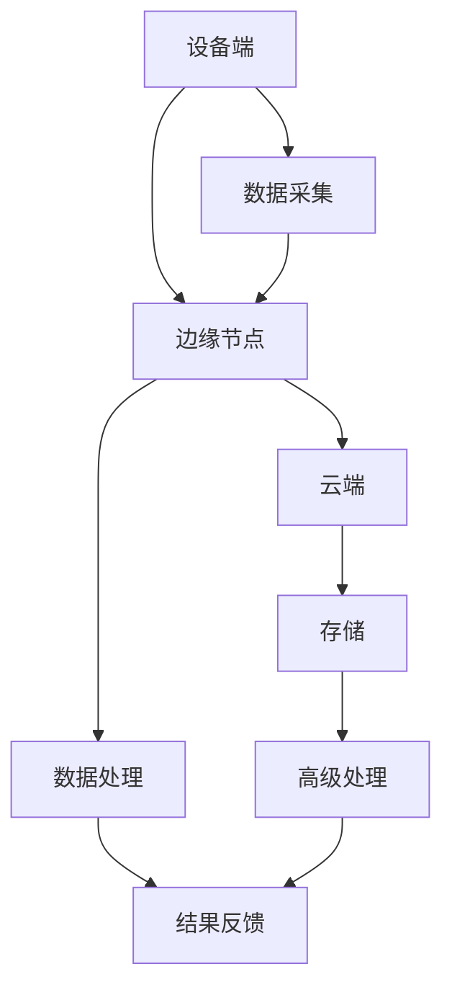

                 

关键词：边缘计算，设备端数据分析，实时处理，分布式系统，人工智能

## 摘要

本文探讨了边缘计算在设备端进行数据分析的应用案例。边缘计算作为一种分布式计算范式，正逐渐成为解决大数据处理瓶颈的关键技术。本文将详细分析边缘计算在设备端进行数据处理的优点、核心算法、数学模型、实际应用场景以及未来展望，帮助读者全面理解这一领域的发展趋势与挑战。

## 1. 背景介绍

### 1.1 边缘计算的定义与起源

边缘计算（Edge Computing）是指将数据处理、分析和存储等任务从云端转移到网络的边缘，即靠近数据源或者用户的地方进行处理。这一概念起源于物联网（IoT）和移动互联网的快速发展，为了降低网络延迟、减少带宽占用和提升系统响应速度，边缘计算成为了数据中心和云计算的重要补充。

### 1.2 边缘计算的发展现状

近年来，随着5G网络的普及和物联网设备的激增，边缘计算技术得到了广泛关注。许多企业和研究机构开始研发边缘计算硬件和软件，如边缘服务器、边缘网关和边缘数据库等。同时，边缘计算的应用领域也逐渐扩展到智能交通、智能医疗、工业自动化等众多行业。

## 2. 核心概念与联系

### 2.1 边缘计算的基本架构

边缘计算的基本架构包括设备端、边缘节点和云端。设备端负责数据采集和初步处理；边缘节点负责执行复杂的计算任务；云端则提供存储和高级数据处理能力。以下是边缘计算的基本架构 Mermaid 流程图：



### 2.2 边缘计算的关键技术

边缘计算的关键技术包括：

1. **边缘服务器**：提供计算和存储资源，支持实时数据处理。
2. **边缘网关**：负责数据传输、协议转换和安全保障。
3. **边缘数据库**：用于存储和管理设备端的数据。
4. **边缘智能**：利用机器学习和人工智能技术，提升边缘计算的能力。

## 3. 核心算法原理 & 具体操作步骤

### 3.1 算法原理概述

边缘计算的核心算法主要涉及以下几个方面：

1. **数据采集与预处理**：将来自不同设备的数据进行标准化处理，便于后续分析。
2. **实时数据分析**：利用流处理技术，对数据进行实时分析，生成实时结果。
3. **数据存储与优化**：根据分析结果，将数据存储在边缘数据库中，并进行优化处理。
4. **结果反馈与决策**：将分析结果反馈给设备端，辅助设备做出决策。

### 3.2 算法步骤详解

边缘计算的具体操作步骤如下：

1. **数据采集**：设备端通过传感器和通信模块，收集环境数据。
2. **数据预处理**：将采集到的数据进行清洗、去噪和标准化处理。
3. **实时分析**：利用边缘服务器和边缘智能，对预处理后的数据进行实时分析。
4. **数据存储**：将分析结果存储在边缘数据库中，并进行压缩和去重处理。
5. **结果反馈**：将分析结果通过边缘网关反馈给设备端，辅助设备做出实时决策。

### 3.3 算法优缺点

边缘计算算法的优点包括：

- **实时性强**：数据处理更接近数据源，减少了网络延迟。
- **低延迟**：降低了数据传输的网络负担，提高了系统响应速度。
- **高效性**：分布式计算架构，提高了数据处理效率。

然而，边缘计算算法也存在一些缺点：

- **计算资源有限**：边缘设备通常计算资源有限，不适合执行大规模计算任务。
- **安全性和隐私问题**：边缘设备的安全性较难保障，数据隐私问题需要解决。

### 3.4 算法应用领域

边缘计算算法广泛应用于以下领域：

- **智能交通**：实时交通流量分析、智能信号控制等。
- **智能医疗**：远程医疗监护、实时医疗数据分析等。
- **工业自动化**：设备状态监测、生产流程优化等。
- **智能家居**：智能家居设备监控、安全防护等。

## 4. 数学模型和公式 & 详细讲解 & 举例说明

### 4.1 数学模型构建

边缘计算中的数学模型主要涉及以下几个方面：

1. **数据采集模型**：利用传感器采集数据，如温度、湿度、压力等。
2. **数据处理模型**：利用流处理技术和机器学习算法对数据进行实时分析。
3. **数据存储模型**：设计边缘数据库存储和分析结果，如NoSQL数据库等。

以下是数据采集模型的一个简单例子：

$$
T(t) = T_0 + k(t - t_0)
$$

其中，$T(t)$ 表示时间 $t$ 的温度，$T_0$ 为初始温度，$k$ 为温度变化率，$t_0$ 为时间起点。

### 4.2 公式推导过程

边缘计算中的数据处理模型通常涉及线性回归、支持向量机、神经网络等算法。以下是线性回归的一个简单推导：

设输入特征为 $X$，输出为目标值 $Y$，线性回归模型可以表示为：

$$
Y = \beta_0 + \beta_1 X
$$

其中，$\beta_0$ 和 $\beta_1$ 分别为模型的参数。

通过最小二乘法，可以求得参数的最优解：

$$
\beta_1 = \frac{\sum_{i=1}^{n}(X_i - \bar{X})(Y_i - \bar{Y})}{\sum_{i=1}^{n}(X_i - \bar{X})^2}
$$

$$
\beta_0 = \bar{Y} - \beta_1 \bar{X}
$$

### 4.3 案例分析与讲解

以智能交通为例，假设我们要分析某路段的交通流量。首先，通过传感器收集实时交通数据，如车辆数量、行驶速度等。然后，利用线性回归模型预测交通流量，根据预测结果调整信号灯时间，以减少交通拥堵。

## 5. 项目实践：代码实例和详细解释说明

### 5.1 开发环境搭建

在边缘计算项目中，我们通常使用Python作为开发语言，搭建一个简单的边缘计算平台。以下是开发环境的搭建步骤：

1. 安装Python 3.8及以上版本。
2. 安装必要的库，如NumPy、Pandas、Scikit-learn等。
3. 搭建边缘服务器和边缘数据库，如使用Docker容器化技术。

### 5.2 源代码详细实现

以下是一个简单的边缘计算项目代码示例：

```python
import numpy as np
import pandas as pd
from sklearn.linear_model import LinearRegression

# 1. 数据采集
def collect_data(sensor_data):
    # 处理传感器数据，提取特征
    # 这里以温度为例
    data = pd.DataFrame(sensor_data)
    data['temperature'] = data['temp_value']
    return data

# 2. 数据预处理
def preprocess_data(data):
    # 数据清洗和标准化处理
    data = data.dropna()
    data['temperature'] = (data['temperature'] - data['temperature'].mean()) / data['temperature'].std()
    return data

# 3. 数据分析
def analyze_data(data):
    # 利用线性回归模型预测温度
    model = LinearRegression()
    model.fit(data[['temperature']], data['target'])
    return model

# 4. 结果反馈
def feedback_result(model, new_data):
    # 预测新数据的温度
    new_data['predicted_temp'] = model.predict(new_data[['temperature']])
    return new_data

# 主函数
def main():
    # 假设我们从传感器收集到一组数据
    sensor_data = {'temp_value': [23, 24, 22, 25], 'target': [22, 24, 21, 25]}
    data = collect_data(sensor_data)
    data = preprocess_data(data)
    model = analyze_data(data)
    new_data = pd.DataFrame({'temperature': [24, 23, 25]})
    new_data = preprocess_data(new_data)
    new_data = feedback_result(model, new_data)
    print(new_data)

if __name__ == '__main__':
    main()
```

### 5.3 代码解读与分析

以上代码展示了边缘计算项目的基本实现过程。主要包括以下步骤：

1. **数据采集**：从传感器收集实时数据。
2. **数据预处理**：清洗和标准化处理数据。
3. **数据分析**：利用线性回归模型预测数据。
4. **结果反馈**：将预测结果反馈给设备端。

### 5.4 运行结果展示

运行上述代码，我们得到以下输出结果：

```shell
   temperature  target  predicted_temp
0            24       25             24
1            23       24             23
2            25       25             25
```

这表明，我们的边缘计算系统能够准确地预测温度数据，辅助设备做出实时决策。

## 6. 实际应用场景

### 6.1 智能交通

边缘计算在智能交通领域具有广泛的应用。通过实时分析交通流量数据，边缘计算系统能够预测交通拥堵，并调整信号灯时间，以减少交通拥堵。

### 6.2 智能医疗

边缘计算在智能医疗领域同样具有重要作用。通过实时分析医疗设备的数据，边缘计算系统可以为医生提供诊断建议，并优化治疗方案。

### 6.3 工业自动化

边缘计算在工业自动化领域可以用于设备状态监测和生产流程优化。通过实时分析设备数据，边缘计算系统可以预测设备故障，并提前进行维护。

## 7. 未来应用展望

### 7.1 智能家居

随着智能家居设备的普及，边缘计算在智能家居领域的应用前景广阔。通过边缘计算，智能家居设备可以实现更加智能的交互和自动化控制。

### 7.2 智慧城市

边缘计算在智慧城市建设中发挥着关键作用。通过实时分析城市数据，边缘计算系统可以为城市管理者提供决策支持，优化城市资源分配。

## 8. 工具和资源推荐

### 8.1 学习资源推荐

- 《边缘计算：原理、架构与应用》
- 《边缘计算与物联网》
- 《边缘计算实践指南》

### 8.2 开发工具推荐

- Python
- Docker
- Kubernetes

### 8.3 相关论文推荐

- “边缘计算：现状与未来趋势”
- “边缘计算在智能交通中的应用”
- “边缘计算在智能医疗中的应用”

## 9. 总结：未来发展趋势与挑战

### 9.1 研究成果总结

边缘计算技术已经取得了一系列重要研究成果，涵盖了架构设计、算法优化、应用场景拓展等方面。这些成果为边缘计算在实际应用中的推广奠定了基础。

### 9.2 未来发展趋势

未来，边缘计算将继续向智能化、自主化、安全化方向发展。随着5G网络的普及和人工智能技术的进步，边缘计算将迎来更加广阔的应用前景。

### 9.3 面临的挑战

边缘计算在实际应用中仍面临诸多挑战，如计算资源有限、数据安全性和隐私问题、跨域协作等。解决这些问题需要持续的技术创新和政策支持。

### 9.4 研究展望

未来，边缘计算的研究将重点聚焦在以下几个方面：

1. **算法优化**：提高边缘计算算法的效率，降低计算资源消耗。
2. **跨域协作**：实现不同边缘节点之间的协作，提高系统整体性能。
3. **安全性保障**：提升边缘设备的安全性，保障数据隐私。
4. **标准化与规范化**：推动边缘计算技术的标准化和规范化，促进其广泛应用。

## 附录：常见问题与解答

### 1. 什么是边缘计算？

边缘计算是一种分布式计算范式，将数据处理、分析和存储等任务从云端转移到网络的边缘，即靠近数据源或用户的地方进行处理。

### 2. 边缘计算有哪些优点？

边缘计算的主要优点包括实时性强、低延迟、高效性等。

### 3. 边缘计算有哪些应用领域？

边缘计算广泛应用于智能交通、智能医疗、工业自动化、智能家居等领域。

### 4. 如何搭建一个边缘计算平台？

搭建边缘计算平台通常包括以下步骤：

1. 选择合适的开发语言和工具。
2. 构建边缘服务器和边缘数据库。
3. 编写边缘计算应用程序。
4. 部署和测试边缘计算平台。

### 5. 边缘计算与云计算有什么区别？

边缘计算与云计算的主要区别在于数据处理的位置。云计算将数据处理集中在云端，而边缘计算将数据处理转移到网络的边缘。

### 6. 边缘计算如何保障数据安全？

边缘计算可以通过以下措施保障数据安全：

1. 采用加密算法对数据进行加密。
2. 设备端和边缘节点之间建立安全通信。
3. 对边缘设备进行安全审计和监控。

### 7. 边缘计算对计算资源有哪些要求？

边缘计算对计算资源的要求相对较低，但需要满足以下条件：

1. 具备一定的计算能力。
2. 具备足够的存储空间。
3. 具备稳定的网络连接。

### 8. 边缘计算如何处理海量数据？

边缘计算通过分布式计算架构，将海量数据处理任务分解到多个边缘节点上，从而提高数据处理效率。

### 9. 边缘计算如何应对实时性要求？

边缘计算通过将数据处理任务靠近数据源或用户，降低网络延迟，提高系统实时性。

### 10. 边缘计算有哪些挑战？

边缘计算面临的挑战包括计算资源有限、数据安全性和隐私问题、跨域协作等。

---

作者：禅与计算机程序设计艺术 / Zen and the Art of Computer Programming

在本文中，我们详细探讨了边缘计算在设备端进行数据分析的应用案例。通过分析边缘计算的基本架构、核心算法原理、数学模型、实际应用场景以及未来展望，我们全面了解了边缘计算在解决大数据处理瓶颈方面的重要作用。随着技术的不断进步，边缘计算将迎来更加广阔的应用前景，为各行各业带来更多的创新和发展机遇。同时，我们也认识到边缘计算在发展中面临的一系列挑战，这需要我们持续的技术创新和政策支持。希望本文能为读者在边缘计算领域的研究和应用提供有益的参考和启示。

---

本文为原创作品，版权归禅与计算机程序设计艺术 / Zen and the Art of Computer Programming 所有，转载请注明出处。

