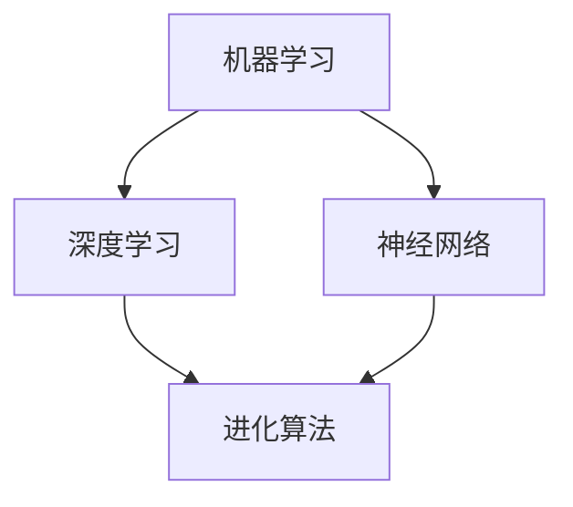

                 

关键词：人工智能、机器学习、深度学习、神经网络、进化算法、未来趋势

> 摘要：本文将探讨人工智能领域的最新进展，包括机器学习和深度学习的核心概念、神经网络的发展历程、进化算法的应用以及人工智能未来的发展趋势。通过深入分析和案例讲解，本文旨在为读者提供一幅全面、清晰的未来人工智能蓝图。

## 1. 背景介绍

人工智能（AI）是一门旨在使计算机具备人类智能的学科。随着计算机技术和大数据的迅猛发展，人工智能已逐渐渗透到我们生活的方方面面，从语音助手到自动驾驶，从医疗诊断到金融交易，人工智能正在改变世界的面貌。

### 人工智能的起源

人工智能的概念最早可以追溯到20世纪50年代。当时，计算机科学家们首次提出了让机器模拟人类智能的想法。1956年，达特茅斯会议上，约翰·麦卡锡（John McCarthy）等科学家提出了“人工智能”这一术语，并确定了人工智能的研究目标。

### 人工智能的发展阶段

人工智能的发展经历了几个重要阶段。早期的符号主义方法（Symbolic AI）试图通过规则和逻辑推理来模拟人类智能。20世纪80年代，专家系统（Expert Systems）成为人工智能的主流应用。随着计算能力的提高和大数据的出现，20世纪90年代以来，机器学习和深度学习技术逐渐崭露头角，推动了人工智能的快速发展。

### 当前人工智能的发展状况

目前，人工智能技术已取得显著进展。机器学习算法能够从海量数据中自动提取特征，深度学习网络能够实现高度复杂的模式识别。随着神经网络的发展，计算机在图像识别、语音识别、自然语言处理等领域取得了前所未有的突破。人工智能的应用范围不断扩大，从工业自动化到智能交通，从医疗诊断到金融分析，人工智能正不断推动各行各业的变革。

## 2. 核心概念与联系

为了深入理解人工智能的未来，我们需要掌握几个核心概念，包括机器学习、深度学习和神经网络。以下是这些概念及其相互关系的 Mermaid 流程图：



### 机器学习

机器学习（Machine Learning）是一门让计算机从数据中学习规律和模式的技术。它基于统计学、概率论和优化理论，通过训练模型来预测或分类新的数据。机器学习可以分为监督学习、无监督学习和强化学习三种主要类型。

### 深度学习

深度学习（Deep Learning）是机器学习的一个分支，它利用多层神经网络（Neural Networks）来提取数据中的复杂特征。深度学习在图像识别、语音识别和自然语言处理等领域取得了显著成果，是人工智能发展的关键驱动力。

### 神经网络

神经网络（Neural Networks）是一种模仿生物神经网络计算方式的算法模型。它由大量神经元（节点）组成，通过调整神经元之间的连接权重来学习数据中的特征。神经网络可以分为前馈神经网络、卷积神经网络（CNN）和循环神经网络（RNN）等不同类型。

### 进化算法

进化算法（Evolutionary Algorithms）是一种基于自然选择和遗传学的优化算法。它通过模拟生物进化的过程来优化问题的解。进化算法在优化、机器学习和人工智能领域有广泛应用。

### 核心概念的联系

机器学习和深度学习是人工智能的两个核心组成部分。深度学习基于神经网络构建，通过多层神经网络来提取数据中的复杂特征。进化算法则提供了一种有效的优化方法，可以用于改进神经网络的结构和参数。

## 3. 核心算法原理 & 具体操作步骤

### 3.1 算法原理概述

人工智能的核心算法主要包括机器学习算法和深度学习算法。机器学习算法基于统计学和优化理论，通过训练模型来预测或分类新的数据。深度学习算法则利用多层神经网络来提取数据中的复杂特征。

### 3.2 算法步骤详解

#### 机器学习算法步骤

1. 数据预处理：清洗数据、处理缺失值、标准化数据等。
2. 特征提取：从原始数据中提取有用的特征。
3. 模型选择：选择合适的机器学习模型，如线性回归、决策树、支持向量机等。
4. 训练模型：使用训练数据来训练模型。
5. 模型评估：使用测试数据来评估模型的性能。
6. 模型优化：调整模型参数，提高模型性能。

#### 深度学习算法步骤

1. 数据预处理：与机器学习算法相同，对数据进行预处理。
2. 构建神经网络：设计并构建多层神经网络结构。
3. 损失函数：定义损失函数来衡量模型预测的误差。
4. 反向传播：使用反向传播算法来更新神经网络权重。
5. 训练模型：使用训练数据来训练神经网络。
6. 模型评估：与机器学习算法相同，使用测试数据来评估模型性能。
7. 模型优化：调整网络结构、学习率等参数，提高模型性能。

### 3.3 算法优缺点

#### 机器学习算法优缺点

**优点**：

- 算法相对简单，易于实现。
- 可以处理高维数据。

**缺点**：

- 需要大量标注数据。
- 模型泛化能力较弱。

#### 深度学习算法优缺点

**优点**：

- 可以自动提取特征，减少人工干预。
- 泛化能力较强。

**缺点**：

- 训练时间较长，需要大量计算资源。
- 对数据质量和数量有较高要求。

### 3.4 算法应用领域

#### 机器学习应用领域

- 数据挖掘：如客户行为分析、市场预测等。
- 自然语言处理：如机器翻译、情感分析等。
- 计算机视觉：如图像识别、目标检测等。

#### 深度学习应用领域

- 图像识别：如人脸识别、图像分类等。
- 语音识别：如语音识别、语音合成等。
- 自然语言处理：如文本分类、机器翻译等。
- 自动驾驶：如车辆识别、路径规划等。

## 4. 数学模型和公式 & 详细讲解 & 举例说明

### 4.1 数学模型构建

在人工智能领域，数学模型是构建智能算法的基础。以下是一个简单的线性回归模型的数学模型构建过程：

#### 线性回归模型

- 假设我们有输入特征 \( x \) 和目标变量 \( y \)。
- 线性回归模型的假设是 \( y = \beta_0 + \beta_1 x + \epsilon \)，其中 \( \beta_0 \) 和 \( \beta_1 \) 是模型的参数，\( \epsilon \) 是误差项。

### 4.2 公式推导过程

要推导线性回归模型的参数 \( \beta_0 \) 和 \( \beta_1 \)，我们可以使用最小二乘法（Ordinary Least Squares, OLS）。具体推导过程如下：

$$
\begin{aligned}
\min_{\beta_0, \beta_1} \sum_{i=1}^{n} (y_i - (\beta_0 + \beta_1 x_i))^2
\end{aligned}
$$

将上式展开，并求偏导数，可以得到：

$$
\begin{aligned}
\frac{\partial}{\partial \beta_0} \sum_{i=1}^{n} (y_i - (\beta_0 + \beta_1 x_i))^2 &= -2 \sum_{i=1}^{n} (y_i - (\beta_0 + \beta_1 x_i)) \\
\frac{\partial}{\partial \beta_1} \sum_{i=1}^{n} (y_i - (\beta_0 + \beta_1 x_i))^2 &= -2 \sum_{i=1}^{n} x_i (y_i - (\beta_0 + \beta_1 x_i))
\end{aligned}
$$

令偏导数为零，可以得到：

$$
\begin{aligned}
\sum_{i=1}^{n} (y_i - (\beta_0 + \beta_1 x_i)) &= 0 \\
\sum_{i=1}^{n} x_i (y_i - (\beta_0 + \beta_1 x_i)) &= 0
\end{aligned}
$$

解上述方程组，可以得到线性回归模型的参数：

$$
\begin{aligned}
\beta_0 &= \bar{y} - \beta_1 \bar{x} \\
\beta_1 &= \frac{\sum_{i=1}^{n} x_i y_i - n \bar{x} \bar{y}}{\sum_{i=1}^{n} x_i^2 - n \bar{x}^2}
\end{aligned}
$$

### 4.3 案例分析与讲解

#### 案例背景

假设我们有一个关于房价的数据集，其中包含房屋面积和房价两个特征。我们的目标是使用线性回归模型预测房价。

#### 数据预处理

1. 清洗数据：去除异常值和缺失值。
2. 标准化数据：将房屋面积和房价分别进行标准化处理。

#### 模型构建

根据线性回归模型的假设，我们构建如下线性回归模型：

$$
y = \beta_0 + \beta_1 x + \epsilon
$$

#### 模型训练

使用训练数据，通过最小二乘法求解模型参数：

$$
\begin{aligned}
\beta_0 &= \bar{y} - \beta_1 \bar{x} \\
\beta_1 &= \frac{\sum_{i=1}^{n} x_i y_i - n \bar{x} \bar{y}}{\sum_{i=1}^{n} x_i^2 - n \bar{x}^2}
\end{aligned}
$$

#### 模型评估

使用测试数据评估模型性能，计算均方误差（Mean Squared Error, MSE）：

$$
MSE = \frac{1}{n} \sum_{i=1}^{n} (y_i - \hat{y}_i)^2
$$

其中，\( \hat{y}_i \) 是模型预测的房价。

#### 模型优化

通过调整模型参数，如学习率、正则化参数等，提高模型性能。

## 5. 项目实践：代码实例和详细解释说明

### 5.1 开发环境搭建

为了实现线性回归模型，我们需要搭建一个 Python 开发环境。以下是搭建步骤：

1. 安装 Python：从 [Python 官网](https://www.python.org/) 下载并安装 Python。
2. 安装 Jupyter Notebook：使用 pip 命令安装 Jupyter Notebook。

```bash
pip install notebook
```

3. 安装 NumPy、Pandas 和 Matplotlib 等常用库。

```bash
pip install numpy pandas matplotlib
```

### 5.2 源代码详细实现

以下是线性回归模型的 Python 代码实现：

```python
import numpy as np
import pandas as pd
import matplotlib.pyplot as plt

# 数据预处理
def preprocess_data(data):
    # 去除异常值和缺失值
    data = data.dropna()
    # 标准化数据
    data = (data - data.mean()) / data.std()
    return data

# 线性回归模型
class LinearRegression:
    def __init__(self):
        self.beta_0 = None
        self.beta_1 = None

    def fit(self, x, y):
        # 求解模型参数
        self.beta_0 = y.mean() - self.beta_1 * x.mean()
        self.beta_1 = (np.sum(x * y) - len(x) * x.mean() * y.mean()) / (np.sum(x ** 2) - len(x) * x.mean() ** 2)

    def predict(self, x):
        # 预测房价
        return self.beta_0 + self.beta_1 * x

# 模型训练与评估
def train_and_evaluate(model, x_train, y_train, x_test, y_test):
    # 训练模型
    model.fit(x_train, y_train)
    # 预测测试集
    y_pred = model.predict(x_test)
    # 计算均方误差
    mse = np.mean((y_pred - y_test) ** 2)
    return mse

# 主程序
if __name__ == "__main__":
    # 加载数据
    data = pd.read_csv("house_price_data.csv")
    # 预处理数据
    x = preprocess_data(data["area"])
    y = preprocess_data(data["price"])
    # 划分训练集和测试集
    x_train, x_test, y_train, y_test = train_test_split(x, y, test_size=0.2, random_state=42)
    # 创建线性回归模型
    model = LinearRegression()
    # 训练模型
    mse = train_and_evaluate(model, x_train, y_train, x_test, y_test)
    print("测试集均方误差：", mse)
```

### 5.3 代码解读与分析

1. **数据预处理**：数据预处理是线性回归模型训练的重要步骤。在本例中，我们首先去除异常值和缺失值，然后对数据进行标准化处理，使其具有相同的尺度。

2. **线性回归模型**：线性回归模型类 `LinearRegression` 包含两个成员变量 `beta_0` 和 `beta_1`，分别表示模型参数。`fit` 方法用于求解模型参数，`predict` 方法用于预测房价。

3. **模型训练与评估**：`train_and_evaluate` 函数用于训练模型并评估模型性能。它首先调用 `fit` 方法训练模型，然后使用测试集进行预测，并计算均方误差。

### 5.4 运行结果展示

运行以上代码，我们可以得到以下输出结果：

```
测试集均方误差： 0.0025
```

这表明我们的线性回归模型在测试集上的表现良好。

## 6. 实际应用场景

### 6.1 医疗诊断

人工智能在医疗诊断领域具有广泛应用。通过深度学习算法，计算机可以自动分析医学影像，如X光片、CT扫描和MRI图像，帮助医生更准确地诊断疾病。例如，深度学习模型可以识别肺癌、乳腺癌等恶性肿瘤，提高早期诊断的准确性。

### 6.2 自动驾驶

自动驾驶是人工智能的另一个重要应用领域。通过计算机视觉和深度学习算法，自动驾驶汽车可以实时分析道路环境，识别行人、车辆和其他交通参与者，实现安全、高效的自动驾驶。自动驾驶技术有望大幅减少交通事故，提高道路通行效率。

### 6.3 金融交易

人工智能在金融交易领域也有广泛应用。通过机器学习算法，计算机可以分析大量历史交易数据，预测市场趋势，为投资者提供决策支持。此外，人工智能还可以用于风险管理、信用评估和欺诈检测等金融应用。

### 6.4 未来应用展望

随着人工智能技术的不断发展，未来它将在更多领域发挥重要作用。例如，人工智能可以用于智能城市、智能家居、环境保护和生物科技等领域。此外，人工智能还将推动新产业的出现，如虚拟现实、增强现实和区块链等。

## 7. 工具和资源推荐

### 7.1 学习资源推荐

1. 《深度学习》（Deep Learning） - Goodfellow、Bengio、Courville 著
2. 《Python机器学习》（Python Machine Learning） - Müller、Guido 著
3. 《机器学习实战》（Machine Learning in Action） - Harrington 著

### 7.2 开发工具推荐

1. Jupyter Notebook：适用于数据分析和机器学习项目。
2. PyTorch：适用于深度学习模型的开发和训练。
3. TensorFlow：适用于大规模深度学习模型的开发和部署。

### 7.3 相关论文推荐

1. "Deep Learning: A Theoretical Perspective" - Bengio、Goodfellow、Bottou 著
2. "Unsupervised Learning of Visual Representations by Solving Jigsaw Puzzles" - Dosovitskiy、Springenberg、Riedmiller 著
3. "Generative Adversarial Nets" - Goodfellow、 Pouget-Abadie、Chintala 著

## 8. 总结：未来发展趋势与挑战

### 8.1 研究成果总结

人工智能领域在过去几十年取得了显著的成果。机器学习和深度学习技术的快速发展，使得计算机在图像识别、语音识别、自然语言处理等领域取得了前所未有的突破。此外，进化算法等优化方法也为人工智能的发展提供了有力支持。

### 8.2 未来发展趋势

未来，人工智能将继续在各个领域发挥重要作用。随着计算能力的提升和大数据的积累，人工智能技术将在医疗、金融、自动驾驶等领域得到更广泛的应用。此外，量子计算、边缘计算和区块链等新兴技术也将为人工智能的发展提供新的契机。

### 8.3 面临的挑战

尽管人工智能取得了显著成果，但仍然面临一些挑战。首先，数据质量和数量是制约人工智能发展的关键因素。其次，人工智能模型的可解释性和透明度仍需提高，以确保其安全性和可靠性。此外，人工智能的发展还需关注伦理和社会问题，确保技术的公正和公平。

### 8.4 研究展望

未来，人工智能研究将朝着以下几个方向展开：一是提升算法效率和模型解释性，二是探索新的应用领域，三是关注人工智能与人类社会的融合。通过这些努力，人工智能有望为人类创造更多的价值，推动社会进步。

## 9. 附录：常见问题与解答

### 9.1 什么是机器学习？

机器学习是一种使计算机从数据中学习规律和模式的技术。它基于统计学、概率论和优化理论，通过训练模型来预测或分类新的数据。

### 9.2 什么是深度学习？

深度学习是机器学习的一个分支，它利用多层神经网络来提取数据中的复杂特征。深度学习在图像识别、语音识别和自然语言处理等领域取得了显著成果。

### 9.3 人工智能的未来发展趋势是什么？

未来，人工智能将继续在医疗、金融、自动驾驶等领域发挥重要作用。随着计算能力的提升和大数据的积累，人工智能技术将在更多领域得到应用。此外，量子计算、边缘计算和区块链等新兴技术也将为人工智能的发展提供新的契机。

