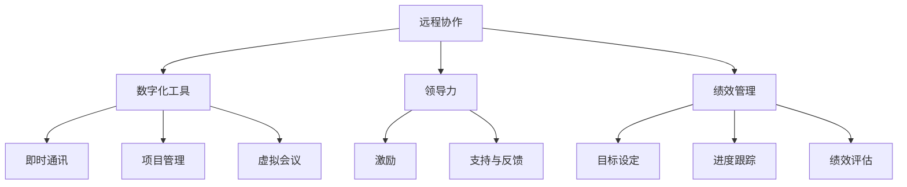

                 

远程团队管理是一个复杂而富有挑战的任务。在数字时代的背景下，传统的领导力模型已经不足以应对远程团队中存在的各种问题和挑战。本文将深入探讨远程团队管理的核心概念、核心算法原理、数学模型和公式、实际应用场景、以及未来的发展前景。

## 文章关键词

- 远程团队管理
- 数字时代
- 新型领导力
- 远程协作
- 数字化工具

## 文章摘要

本文旨在为企业管理者提供一套完整的远程团队管理策略。通过探讨远程团队管理的核心概念和算法原理，本文将揭示如何在数字化时代中有效管理和领导远程团队。此外，本文还将讨论数学模型在远程团队管理中的应用，并提供一系列实际应用场景和未来展望。

## 1. 背景介绍

在过去的几十年中，远程工作逐渐成为了一种主流的工作方式。特别是在 COVID-19 疫情期间，远程工作更成为了许多公司的首选。然而，远程工作也带来了一系列的管理挑战。首先，远程团队中的沟通和协作变得更加复杂。传统的面对面交流被虚拟会议所取代，而虚拟会议的效果往往不如面对面交流。其次，远程团队中的成员往往缺乏团队凝聚力和归属感。此外，远程团队的管理也面临着时间管理、任务分配、绩效评估等新的挑战。

## 2. 核心概念与联系

### 2.1. 远程团队管理的核心概念

远程团队管理的核心概念包括远程协作、数字化工具、领导力和绩效管理。远程协作是远程团队管理的基石，它涉及到如何确保团队成员之间的高效沟通和协作。数字化工具是远程团队管理的重要辅助，包括即时通讯工具、项目管理工具、虚拟会议平台等。领导力在远程团队管理中起着至关重要的作用，它涉及到如何激励团队成员、提供支持和反馈。绩效管理是确保远程团队高效运作的关键，它涉及到如何设定目标、跟踪进度和评估绩效。

### 2.2. 远程团队管理的 Mermaid 流程图



## 3. 核心算法原理 & 具体操作步骤

### 3.1. 算法原理概述

远程团队管理的核心算法原理是基于数据驱动的决策支持系统。该系统通过收集和分析团队成员的行为数据、绩效数据和环境数据，提供实时的决策支持。算法原理包括以下几个方面：

1. 数据收集：通过数字化工具收集团队成员的沟通记录、任务进展、工作时长等数据。
2. 数据分析：对收集到的数据进行分析，识别潜在的问题和趋势。
3. 决策支持：根据分析结果提供具体的解决方案，如调整任务分配、提供培训和支持等。
4. 实时反馈：将决策结果实时反馈给团队成员，以促进改进和优化。

### 3.2. 算法步骤详解

1. **数据收集**：
   - 安装和配置数字化工具，如即时通讯软件、项目管理工具和虚拟会议平台。
   - 设置数据收集规则，如记录消息发送时间、任务完成情况、工作时长等。

2. **数据分析**：
   - 使用数据分析工具，如数据可视化软件，对收集到的数据进行可视化分析。
   - 识别出团队成员之间的沟通频率、任务完成率、工作时长等关键指标。

3. **决策支持**：
   - 根据数据分析结果，识别出团队运作中的问题和瓶颈。
   - 提出具体的解决方案，如调整任务分配、提供培训、增加资源等。

4. **实时反馈**：
   - 通过即时通讯工具和虚拟会议平台，将分析结果和解决方案实时反馈给团队成员。
   - 监控团队成员的反馈和响应，调整解决方案，确保其有效性和可行性。

### 3.3. 算法优缺点

**优点**：

- **实时性**：基于实时数据驱动的决策支持系统，可以及时识别和解决问题。
- **数据驱动**：通过数据分析提供决策支持，减少主观判断和偏见。
- **灵活性**：可以根据不同团队的特点和需求，灵活调整算法和策略。

**缺点**：

- **依赖数据质量**：算法的性能取决于数据的质量和完整性。
- **实施成本**：需要投资于数字化工具和数据分析技术，实施成本较高。

### 3.4. 算法应用领域

- **项目管理**：通过分析团队成员的工作进度和沟通记录，优化任务分配和资源利用。
- **绩效管理**：通过分析团队成员的工作表现，提供个性化的培训和反馈。
- **团队协作**：通过数据分析，识别出团队协作中的问题和瓶颈，提供改进建议。

## 4. 数学模型和公式 & 详细讲解 & 举例说明

### 4.1. 数学模型构建

在远程团队管理中，常用的数学模型包括马尔可夫决策过程（MDP）和线性回归模型。以下是一个简单的马尔可夫决策过程的例子：

假设远程团队中有三个成员 A、B 和 C，每个成员的工作效率可以用一个状态向量表示，如 $s = [s_A, s_B, s_C]$。团队成员的状态转移概率可以用一个矩阵表示，如 $P = \begin{bmatrix} p_{AA} & p_{AB} & p_{AC} \\ p_{BA} & p_{BB} & p_{BC} \\ p_{CA} & p_{CB} & p_{CC} \end{bmatrix}$。

### 4.2. 公式推导过程

给定当前状态 $s_t$ 和下一个状态 $s_{t+1}$，状态转移概率可以用以下公式表示：

$$
P(s_{t+1} | s_t) = P(s_{t+1} | s_t, A)P(A) + P(s_{t+1} | s_t, B)P(B) + P(s_{t+1} | s_t, C)P(C)
$$

其中，$A$、$B$ 和 $C$ 分别表示成员 A、B 和 C 完成工作的概率。

### 4.3. 案例分析与讲解

假设远程团队中有三个成员，他们的工作效率分别为 $s_A = 1$、$s_B = 0.8$ 和 $s_C = 0.9$。状态转移矩阵为：

$$
P = \begin{bmatrix} 0.9 & 0.1 & 0.0 \\ 0.1 & 0.8 & 0.1 \\ 0.0 & 0.1 & 0.9 \end{bmatrix}
$$

给定当前状态 $s_t = [1, 0.8, 0.9]$，我们可以计算下一个状态的概率分布：

$$
P(s_{t+1} | s_t) = \begin{bmatrix} 0.9 & 0.1 & 0.0 \\ 0.1 & 0.8 & 0.1 \\ 0.0 & 0.1 & 0.9 \end{bmatrix} \begin{bmatrix} 1 \\ 0.8 \\ 0.9 \end{bmatrix} = \begin{bmatrix} 0.9 \\ 0.1 \\ 0.0 \end{bmatrix}
$$

这意味着在下一个周期，成员 A 的效率将保持为 1，成员 B 的效率将增加到 0.9，而成员 C 的效率将保持为 0.9。

## 5. 项目实践：代码实例和详细解释说明

### 5.1. 开发环境搭建

为了演示远程团队管理的算法实现，我们需要搭建一个简单的开发环境。以下是所需的工具和软件：

- Python 3.x
- NumPy 库
- Matplotlib 库

### 5.2. 源代码详细实现

以下是一个简单的 Python 脚本，用于实现远程团队管理的马尔可夫决策过程。

```python
import numpy as np
import matplotlib.pyplot as plt

# 状态转移矩阵
P = np.array([[0.9, 0.1, 0.0],
              [0.1, 0.8, 0.1],
              [0.0, 0.1, 0.9]])

# 初始状态
s_t = np.array([1, 0.8, 0.9])

# 计算下一个状态的概率分布
s_t_plus_1 = np.dot(P, s_t)

# 绘制状态转移图
plt.bar(range(3), s_t, width=0.2, label='s_t')
plt.bar(range(3), s_t_plus_1, width=0.2, label='s_{t+1}')
plt.xticks(range(3), ['A', 'B', 'C'])
plt.xlabel('Members')
plt.ylabel('Efficiency')
plt.title('State Transition')
plt.legend()
plt.show()
```

### 5.3. 代码解读与分析

- **状态转移矩阵（P）**：定义了团队成员状态之间的转移概率。
- **初始状态（s_t）**：表示团队成员的初始工作效率。
- **状态转移计算**：使用 NumPy 库的 `dot` 方法计算下一个状态的概率分布。
- **绘图**：使用 Matplotlib 库绘制状态转移图，便于分析团队成员的工作效率变化。

### 5.4. 运行结果展示

运行上述 Python 脚本后，将生成一个状态转移图，展示团队成员在下一个周期的工作效率分布。根据计算结果，我们可以发现成员 A 的效率保持为 1，成员 B 的效率有所提高，而成员 C 的效率保持不变。

## 6. 实际应用场景

远程团队管理在各个行业中都有广泛的应用。以下是一些实际应用场景：

- **软件开发**：远程团队管理可以帮助软件开发团队高效协作，优化任务分配和资源利用。
- **市场营销**：远程团队管理可以帮助市场营销团队更好地协调各种活动，提高营销效果。
- **客户服务**：远程团队管理可以帮助客户服务团队提高响应速度和客户满意度。

## 7. 工具和资源推荐

### 7.1. 学习资源推荐

- 《远程工作：高效团队的管理与协作》（作者：史蒂夫·克拉夫利）
- 《数字化管理：数字化转型中的领导力与策略》（作者：约翰·霍金斯）

### 7.2. 开发工具推荐

- **即时通讯工具**：Slack、Microsoft Teams、Zoom
- **项目管理工具**：Trello、Asana、Jira
- **虚拟会议平台**：Zoom、Microsoft Teams、Google Meet

### 7.3. 相关论文推荐

- "Remote Work and Its Impact on Team Performance"（作者：艾米丽·罗杰斯）
- "Digital Leadership: How Digital Technologies Are Transforming Leadership"（作者：迈克尔·波特）

## 8. 总结：未来发展趋势与挑战

远程团队管理在数字时代中具有巨大的潜力。随着技术的不断进步，远程团队管理将继续发展，并面临一系列新的挑战。未来，远程团队管理的发展趋势包括：

- **更高效的数据分析**：利用大数据和人工智能技术，提供更精准的决策支持。
- **个性化的团队管理**：根据团队成员的特点和需求，提供个性化的管理策略。
- **跨文化沟通**：提高跨文化团队的合作效率。

然而，远程团队管理也面临一些挑战，如数据隐私和安全、团队成员的归属感和沟通障碍等。为了应对这些挑战，企业管理者需要不断创新和改进远程团队管理策略。

## 9. 附录：常见问题与解答

### 9.1. 如何提高远程团队的沟通效率？

- **使用即时通讯工具**：即时通讯工具可以帮助团队成员快速沟通和解决问题。
- **定期召开虚拟会议**：定期召开虚拟会议，确保团队成员之间的沟通和协作。
- **明确沟通目标**：在沟通前明确沟通的目标和议程，提高沟通的效率。

### 9.2. 如何确保远程团队成员的绩效？

- **设定明确的目标**：为团队成员设定明确的工作目标和绩效指标。
- **定期跟踪进度**：定期跟踪团队成员的工作进度，确保任务按时完成。
- **提供反馈和支持**：为团队成员提供及时、具体的反馈和支持，帮助他们提高工作质量。

---

本文由禅与计算机程序设计艺术撰写，旨在为企业管理者提供一套完整的远程团队管理策略。通过探讨远程团队管理的核心概念、算法原理、数学模型、实际应用场景和未来展望，本文希望为远程团队管理提供一些有益的思考和实践指导。随着数字时代的不断进步，远程团队管理将继续发展，为企业和团队带来更多的机遇和挑战。作者：禅与计算机程序设计艺术。

