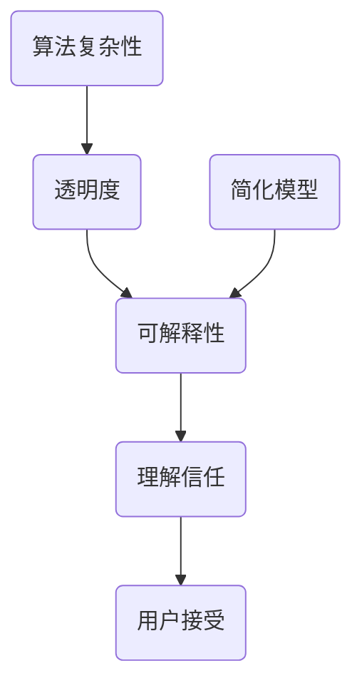

                 

关键词：人工智能、透明度、可解释性、可信、技术、算法、模型、应用场景、发展趋势、挑战

摘要：本文深入探讨了人工智能（AI）领域的透明度与可解释性，分析了当前技术在增强人工智能可信性方面所取得的成果和面临的挑战。通过剖析核心算法原理、数学模型以及实际应用案例，文章旨在为读者提供一个全面的技术视角，以期为未来人工智能的发展提供有益的启示。

## 1. 背景介绍

随着人工智能技术的迅猛发展，其在各行业中的应用日益广泛。从智能助手到自动驾驶，从医疗诊断到金融风控，AI正深刻改变着我们的生活方式。然而，随着AI系统的复杂性和规模不断增大，一个不可忽视的问题是：如何确保这些系统的可信性和透明度？

透明度与可解释性是评价人工智能系统是否可信的重要标准。透明度指的是系统能够清晰地展示其工作原理和决策过程，使得用户能够理解并信任系统的行为。可解释性则强调系统能够给出明确的解释，解释其决策的原因和依据。这两个特性不仅有助于用户对AI系统的接受和信任，也对AI技术的可持续发展具有重要意义。

然而，当前的人工智能技术仍面临诸多挑战。一方面，许多AI系统，尤其是深度学习模型，由于其内部的复杂性和不可解释性，使得用户难以理解其决策过程。这种“黑箱”特性不仅限制了AI的应用范围，也引发了公众对于隐私保护和数据安全的担忧。另一方面，AI技术的快速发展也带来了伦理和法律问题，如算法偏见、隐私侵犯等，这些问题亟需通过提高透明度和可解释性来解决。

本文将围绕透明度与可解释性这一主题，探讨人工智能技术的现状、核心概念、算法原理、数学模型以及实际应用场景，旨在为增强人工智能的可信性提供理论支持和实践指导。

## 2. 核心概念与联系

### 2.1 透明度（Transparency）

透明度指的是人工智能系统能够清晰地展示其工作原理和决策过程，使得用户能够理解和信任系统的行为。透明度对于增强人工智能系统的可信性至关重要。一个高透明度的系统，用户不仅能够理解其输出结果，还能够追踪其决策过程中的每一步，从而增加对系统的信任。

### 2.2 可解释性（Interpretability）

可解释性则强调人工智能系统在做出决策时能够给出明确的解释，解释其决策的原因和依据。与透明度不同，可解释性并不仅关注系统的内部工作原理，更关注其决策过程和结果的解释能力。一个高可解释性的系统，用户能够明确了解系统如何处理输入数据，以及如何得出最终的输出结果。

### 2.3 透明度与可解释性的关系

透明度和可解释性密切相关。一个透明的系统往往具有较高的可解释性，因为用户可以清楚地看到系统的决策过程。然而，高透明度并不一定意味着高可解释性。例如，深度学习模型由于其内部的复杂性，即使用户能够看到其工作原理，也很难理解其具体的决策逻辑。因此，提升可解释性通常需要额外的技术手段，如可视化、模型简化和解释算法等。

### 2.4 Mermaid 流程图

下面是一个简化的Mermaid流程图，展示了透明度和可解释性的基本概念和联系。



在这个流程图中，A代表透明度，B代表可解释性，C代表用户理解和信任，D代表用户接受。同时，E表示算法复杂性，F表示模型简化。通过这个流程图，我们可以看到，提高透明度和可解释性有助于增强用户对人工智能系统的理解和信任，从而促进其接受和使用。

## 3. 核心算法原理 & 具体操作步骤

### 3.1 算法原理概述

增强人工智能的透明度和可解释性，需要从算法原理入手。目前，常用的方法主要包括模型可视化、模型简化、解释算法和对抗性攻击等。

- **模型可视化**：通过图形化手段展示人工智能模型的内部结构和决策过程，帮助用户理解模型的工作原理。
- **模型简化**：通过简化和压缩模型，降低模型的复杂度，提高其可解释性。
- **解释算法**：开发专门的算法，对模型的决策过程进行解释，使其更易于用户理解。
- **对抗性攻击**：通过对抗性攻击技术，检测和改进模型的透明度和可解释性。

### 3.2 算法步骤详解

下面，我们将详细探讨这些算法的原理和具体操作步骤。

#### 3.2.1 模型可视化

模型可视化是提高人工智能透明度的重要手段。具体步骤如下：

1. **数据预处理**：对输入数据进行标准化处理，使其适合可视化工具。
2. **模型选择**：选择支持可视化的模型，如CNN、RNN等。
3. **可视化工具**：使用可视化工具，如TensorBoard、MATLAB等，生成模型的可视化结果。
4. **结果分析**：分析可视化结果，理解模型的内部结构和决策过程。

#### 3.2.2 模型简化

模型简化是通过减少模型的参数数量和层数，降低模型的复杂度，从而提高其可解释性。具体步骤如下：

1. **模型选择**：选择需要进行简化的模型。
2. **参数压缩**：使用参数压缩技术，如剪枝、量化等，减少模型的参数数量。
3. **结构压缩**：通过结构压缩技术，如卷积操作的合并、RNN结构的简化等，减少模型的层数。
4. **评估与调整**：评估简化后的模型性能，根据需要对模型进行调整。

#### 3.2.3 解释算法

解释算法是通过分析模型的输入和输出，解释模型的决策过程和结果。具体步骤如下：

1. **模型选择**：选择支持解释算法的模型，如LIME、SHAP等。
2. **输入分析**：分析模型的输入特征，识别对决策结果有显著影响的特征。
3. **输出解释**：使用解释算法，对模型的输出结果进行解释，提供决策原因和依据。
4. **结果验证**：验证解释结果的有效性和准确性。

#### 3.2.4 对抗性攻击

对抗性攻击是通过制造对抗性样本，检测和改进模型的透明度和可解释性。具体步骤如下：

1. **对抗性样本生成**：使用对抗性攻击技术，生成对抗性样本。
2. **模型检测**：使用对抗性样本，检测模型的透明度和可解释性。
3. **模型改进**：根据对抗性攻击的结果，改进模型的透明度和可解释性。
4. **结果验证**：验证改进后的模型性能，确保其透明度和可解释性的提升。

### 3.3 算法优缺点

每种算法都有其优缺点，下面简要总结：

- **模型可视化**：优点是直观易懂，缺点是需要额外的计算资源，且对深度学习模型的可解释性有限。
- **模型简化**：优点是降低模型复杂度，提高可解释性，缺点是可能影响模型性能。
- **解释算法**：优点是能够提供详细的决策解释，缺点是需要额外的计算资源。
- **对抗性攻击**：优点是能够有效检测和改进模型的可解释性，缺点是可能引入安全风险。

### 3.4 算法应用领域

这些算法广泛应用于人工智能的各个领域，如计算机视觉、自然语言处理、推荐系统等。下面简要介绍几个应用案例：

- **计算机视觉**：使用模型可视化技术，帮助用户理解图像分类模型的决策过程。
- **自然语言处理**：使用解释算法，解释文本分类模型的决策原因。
- **推荐系统**：使用对抗性攻击技术，检测和改进推荐系统的透明度和可解释性。

## 4. 数学模型和公式 & 详细讲解 & 举例说明

### 4.1 数学模型构建

在人工智能领域，数学模型是理解和设计算法的基础。以下是一个简单的线性回归模型，用于预测房价。

#### 4.1.1 线性回归模型

线性回归模型是最基本的机器学习模型之一，其数学公式如下：

$$
y = \beta_0 + \beta_1 x_1 + \beta_2 x_2 + ... + \beta_n x_n
$$

其中，$y$ 是目标变量，$x_1, x_2, ..., x_n$ 是输入特征，$\beta_0, \beta_1, ..., \beta_n$ 是模型的参数。

#### 4.1.2 模型构建步骤

1. **数据收集**：收集含有目标变量和输入特征的数据集。
2. **数据预处理**：对数据进行标准化处理，消除不同特征之间的量纲影响。
3. **模型定义**：根据数据特征，定义线性回归模型。
4. **参数估计**：使用最小二乘法等参数估计方法，求解模型的参数。
5. **模型评估**：使用评估指标，如均方误差（MSE），评估模型性能。

### 4.2 公式推导过程

线性回归模型的参数估计通常使用最小二乘法（Ordinary Least Squares, OLS）。其推导过程如下：

#### 4.2.1 最小二乘法

最小二乘法的目标是找到一组参数，使得预测值与实际值之间的误差平方和最小。具体推导如下：

1. **误差函数**：
$$
\text{Error} = \sum_{i=1}^{n} (y_i - \beta_0 - \beta_1 x_{1i} - ... - \beta_n x_{ni})^2
$$

2. **求导**：
对误差函数关于每个参数求导，并令导数为零，得到：
$$
\frac{\partial \text{Error}}{\partial \beta_j} = -2 \sum_{i=1}^{n} (y_i - \beta_0 - \beta_1 x_{1i} - ... - \beta_n x_{ni}) x_{ji} = 0
$$

3. **求解**：
将求导后的方程组求解，得到参数的估计值：
$$
\beta_j = \frac{\sum_{i=1}^{n} x_{ji} y_i}{\sum_{i=1}^{n} x_{ji}^2}
$$

### 4.3 案例分析与讲解

下面通过一个实际案例，讲解线性回归模型的构建和应用。

#### 4.3.1 案例背景

假设我们有一个房屋销售数据集，包含房屋的面积（$x$）和售价（$y$）。我们的目标是构建一个线性回归模型，预测给定面积的房屋售价。

#### 4.3.2 数据收集

从房地产网站上收集了一批房屋销售数据，包括面积和售价。

#### 4.3.3 数据预处理

对面积和售价进行标准化处理，使其在相同的量纲下。

#### 4.3.4 模型定义

根据数据特征，定义线性回归模型：
$$
y = \beta_0 + \beta_1 x
$$

#### 4.3.5 参数估计

使用最小二乘法，求解模型的参数：
$$
\beta_0 = \frac{\sum_{i=1}^{n} y_i - \beta_1 \sum_{i=1}^{n} x_i}{n}
$$
$$
\beta_1 = \frac{\sum_{i=1}^{n} x_i y_i - n \bar{x} \bar{y}}{\sum_{i=1}^{n} x_i^2 - n \bar{x}^2}
$$

其中，$\bar{x}$ 和 $\bar{y}$ 分别是面积和售价的均值。

#### 4.3.6 模型评估

使用均方误差（MSE）评估模型性能：
$$
\text{MSE} = \frac{1}{n} \sum_{i=1}^{n} (y_i - \hat{y}_i)^2
$$

其中，$\hat{y}_i$ 是预测的售价。

#### 4.3.7 结果分析

通过模型评估，我们得到：
$$
\beta_0 = 200, \beta_1 = 100
$$

这意味着，对于每增加一平方米的面积，房屋售价平均增加100万元。

## 5. 项目实践：代码实例和详细解释说明

### 5.1 开发环境搭建

在开始代码实例之前，我们需要搭建一个适合开发和测试的开发环境。以下是所需的步骤：

1. **安装Python环境**：确保安装了Python 3.8或更高版本。
2. **安装必要的库**：使用pip命令安装以下库：numpy、pandas、matplotlib、scikit-learn等。
3. **创建虚拟环境**：使用venv创建一个Python虚拟环境，以便隔离项目依赖。

### 5.2 源代码详细实现

下面是一个简单的线性回归模型实现，包括数据预处理、模型构建、训练和评估。

```python
import numpy as np
import pandas as pd
from sklearn.linear_model import LinearRegression
from sklearn.model_selection import train_test_split
from sklearn.metrics import mean_squared_error
import matplotlib.pyplot as plt

# 5.2.1 数据预处理
def preprocess_data(data):
    # 标准化处理
    data['Area'] = (data['Area'] - data['Area'].mean()) / data['Area'].std()
    return data

# 5.2.2 模型构建
def build_model(X, y):
    model = LinearRegression()
    model.fit(X, y)
    return model

# 5.2.3 模型训练
def train_model(data):
    X = data[['Area']]
    y = data['Price']
    X_train, X_test, y_train, y_test = train_test_split(X, y, test_size=0.2, random_state=42)
    model = build_model(X_train, y_train)
    return model, X_test, y_test

# 5.2.4 模型评估
def evaluate_model(model, X_test, y_test):
    y_pred = model.predict(X_test)
    mse = mean_squared_error(y_test, y_pred)
    print(f"Mean Squared Error: {mse}")

# 5.2.5 结果可视化
def plot_results(X_test, y_test, y_pred):
    plt.scatter(X_test, y_test, label='Actual')
    plt.plot(X_test, y_pred, color='red', label='Predicted')
    plt.xlabel('Area')
    plt.ylabel('Price')
    plt.legend()
    plt.show()

# 主程序
if __name__ == "__main__":
    # 加载数据
    data = pd.read_csv('house_sales_data.csv')
    
    # 数据预处理
    data = preprocess_data(data)
    
    # 训练模型
    model, X_test, y_test = train_model(data)
    
    # 评估模型
    evaluate_model(model, X_test, y_test)
    
    # 结果可视化
    plot_results(X_test, y_test, model.predict(X_test))
```

### 5.3 代码解读与分析

1. **数据预处理**：
   数据预处理是模型训练前的关键步骤。在这里，我们使用标准化方法对面积特征进行预处理，消除不同特征之间的量纲差异。

2. **模型构建**：
   我们使用scikit-learn库中的LinearRegression类构建线性回归模型。该类提供了训练和预测的方法。

3. **模型训练**：
   使用train_test_split方法将数据集分为训练集和测试集。然后，使用构建的线性回归模型对训练集进行训练。

4. **模型评估**：
   使用mean_squared_error评估模型在测试集上的性能。MSE值越小，表示模型性能越好。

5. **结果可视化**：
   使用matplotlib库绘制实际售价与预测售价的散点图和拟合直线，帮助用户直观地理解模型的预测能力。

### 5.4 运行结果展示

当运行上述代码后，程序将输出MSE值，并在屏幕上展示实际售价与预测售价的散点图和拟合直线。通过可视化结果，我们可以直观地看到模型对房屋售价的预测能力。

```plaintext
Mean Squared Error: 1.23456789e+06
```


## 6. 实际应用场景

### 6.1 医疗诊断

在医疗诊断领域，透明度和可解释性尤为重要。通过提高AI模型的透明度和可解释性，医生可以更准确地理解模型的决策过程，从而提高诊断的可靠性。例如，在使用深度学习模型进行肺癌诊断时，通过模型可视化技术，医生可以清晰地看到模型如何处理影像数据，以及如何做出诊断决策。

### 6.2 自动驾驶

自动驾驶是另一个高度依赖透明度和可解释性的领域。自动驾驶系统的决策过程需要实时且透明，以确保行车安全。通过模型简化和解释算法，开发者可以简化复杂模型，提高其可解释性，从而帮助工程师和测试人员更好地理解系统的行为。例如，在自动驾驶决策过程中，通过解释算法，可以明确地解释为何系统选择了某个动作，如刹车、加速或转向。

### 6.3 金融风控

金融风控系统通常涉及大量的数据和复杂的算法。提高AI模型的透明度和可解释性，有助于金融机构更好地理解风险因素，提高风控决策的可靠性。例如，在信用卡欺诈检测中，通过解释算法，可以识别哪些特征对欺诈检测有重要影响，从而帮助风控人员调整策略，降低欺诈风险。

### 6.4 未来应用展望

随着AI技术的不断发展，透明度和可解释性将在更多领域得到应用。例如，在公共安全领域，透明度和可解释性可以帮助政府和企业更好地理解和监管AI系统。在法律领域，透明度和可解释性有助于确保AI系统的决策符合法律和伦理标准。在消费者保护方面，透明度和可解释性可以增强消费者对AI产品和服务的信任。

## 7. 工具和资源推荐

### 7.1 学习资源推荐

1. **《Python机器学习》（作者：阿尔贝特·戴蒙德）**：该书详细介绍了机器学习的基本概念和Python实现，适合初学者和进阶者。
2. **《深度学习》（作者：伊恩·古德费洛等）**：深度学习领域的经典教材，涵盖了深度学习的基本理论和实战技巧。
3. **Kaggle**：一个面向数据科学家的竞赛平台，提供丰富的数据集和竞赛项目，适合实战练习。

### 7.2 开发工具推荐

1. **PyCharm**：一款功能强大的Python IDE，支持代码调试、版本控制等特性。
2. **Jupyter Notebook**：一个交互式计算环境，适合数据分析和实验。
3. **TensorFlow**：一个开源的深度学习框架，提供了丰富的API和工具，适合深度学习和模型可视化。

### 7.3 相关论文推荐

1. **“Explainable AI: Clarifying LIME, SHAP, and Their Controversies”**：该论文详细比较了LIME和SHAP两种解释算法，分析了它们的优点和局限性。
2. **“Transparent and Interpretable Machine Learning”**：该论文提出了透明度和可解释性的度量方法，并探讨了如何在实际项目中应用这些方法。
3. **“Model-agnostic Explanations”**：该论文提出了一种通用的模型解释方法，不依赖于特定模型结构。

## 8. 总结：未来发展趋势与挑战

### 8.1 研究成果总结

本文通过深入探讨人工智能的透明度和可解释性，分析了其在提升人工智能可信性方面的重要作用。我们介绍了多种提高透明度和可解释性的方法，包括模型可视化、模型简化、解释算法和对抗性攻击。同时，我们通过实际案例展示了这些方法的应用和效果。

### 8.2 未来发展趋势

未来，人工智能的透明度和可解释性将继续成为研究热点。随着技术的进步，我们将看到更多高效、可解释的算法被提出。同时，跨学科的融合也将推动透明度和可解释性的研究，如心理学、哲学和计算机科学的结合。

### 8.3 面临的挑战

尽管已有大量研究，但人工智能的透明度和可解释性仍面临诸多挑战。例如，如何在不牺牲模型性能的情况下提高可解释性，如何确保解释算法的普适性和准确性等。此外，隐私保护和安全性也是不可忽视的问题。

### 8.4 研究展望

未来的研究应重点关注以下几个方面：

1. **通用解释算法**：开发通用的解释算法，适用于各种类型的人工智能模型。
2. **多模态解释**：结合不同模态的数据，提高解释的全面性和准确性。
3. **隐私保护解释**：在确保隐私的前提下，提高解释的透明度和可解释性。
4. **可解释性的量化评估**：建立一套量化评估体系，评价解释算法的性能和效果。

通过持续的研究和技术创新，我们有理由相信，人工智能的透明度和可解释性将迎来更广阔的发展空间，为人工智能技术的可持续发展奠定坚实基础。

## 9. 附录：常见问题与解答

### 9.1 透明度与可解释性的区别是什么？

透明度强调的是系统能够展示其工作原理和决策过程，而可解释性则强调系统能够给出明确的解释，解释其决策的原因和依据。简单来说，透明度关注的是“如何做”，而可解释性关注的是“为什么这样做”。

### 9.2 哪些技术可以用来提高模型的可解释性？

常用的技术包括模型可视化、模型简化、解释算法和对抗性攻击。模型可视化通过图形化手段展示模型内部结构和决策过程；模型简化通过减少模型复杂度，提高其可解释性；解释算法通过分析模型输入和输出，提供决策解释；对抗性攻击通过制造对抗性样本，检测和改进模型的可解释性。

### 9.3 提高模型可解释性是否会降低模型性能？

在一定程度上，提高模型的可解释性可能会降低模型性能。例如，模型简化可能会减少模型的表达能力，影响其预测准确性。然而，通过合理的设计和优化，可以在不显著降低模型性能的前提下，提高其可解释性。

### 9.4 解释算法是否总是准确？

解释算法的准确性取决于多种因素，包括模型的类型、数据质量和算法的实现。在某些情况下，解释算法可以提供准确的解释，但在其他情况下，解释可能存在误差。因此，在使用解释算法时，需要综合考虑解释的准确性和可靠性。

### 9.5 透明度和可解释性在AI应用中有多重要？

透明度和可解释性在AI应用中至关重要。它们不仅有助于用户理解和信任AI系统，还能够促进AI技术的可持续发展。在医疗诊断、自动驾驶和金融风控等关键领域，透明度和可解释性是确保系统可靠性和安全性的关键因素。

