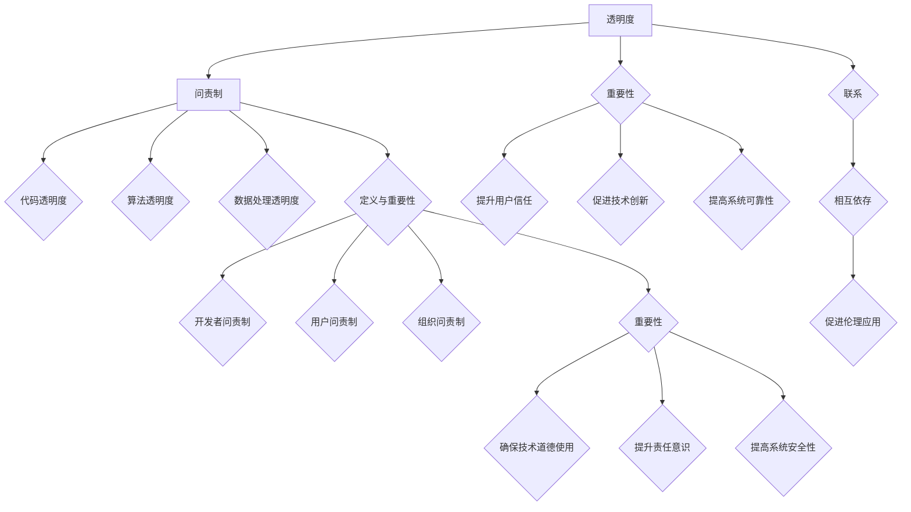

                 

关键词：透明度、问责制、伦理、人工智能、计算科学

> 摘要：本文旨在探讨透明度和问责制在计算机科学和人工智能领域的重要性，及其对促进人类计算伦理应用的积极作用。通过对核心概念、算法原理、数学模型、项目实践以及未来发展趋势的详细分析，本文为读者提供了一个全面而深入的视角，以理解和应对这一领域的关键挑战。

## 1. 背景介绍

在现代社会，计算机科学和人工智能（AI）已经深入到我们的日常生活、工作和经济活动中。然而，随着技术的飞速发展，一系列伦理问题也随之涌现。数据隐私、算法偏见、透明度不足以及缺乏问责制等问题，引发了广泛的社会关注和讨论。这些问题不仅影响了技术的信任度，还可能对人类社会产生深远的影响。

透明度是指系统能够清晰地展示其工作原理和决策过程，使得外部观察者能够理解和验证其行为。问责制则强调责任主体必须对其行为后果承担相应责任。在这两个概念的支持下，我们能够更有效地确保计算技术的道德使用，并保护公众的利益。

本文将首先介绍透明度和问责制的核心概念，接着分析它们在计算机科学和人工智能中的重要性。随后，我们将探讨如何通过算法、数学模型和实际项目实践来促进透明度和问责制的实现。最后，本文将讨论这一领域的未来发展趋势和面临的挑战，并展望未来的研究方向。

## 2. 核心概念与联系

### 2.1 透明度的定义与重要性

透明度在计算机科学中具有至关重要的意义。它指的是技术系统能够清晰、准确地展示其工作原理、决策过程和数据处理方式，使得用户和其他利益相关者能够理解和验证系统的行为。具体而言，透明度包括以下方面：

- **代码透明度**：系统源代码的可访问性和可理解性，使得开发者可以审查和优化系统。
- **算法透明度**：算法的决策过程和内部逻辑的可见性，使得用户可以了解算法如何运作。
- **数据处理透明度**：数据收集、存储和处理过程的透明性，使用户能够了解其数据是如何被使用的。

透明度的实现对于确保计算技术的伦理应用至关重要。它有助于以下方面：

- **提升用户信任**：用户能够了解系统的运作方式，从而增加对技术的信任。
- **促进技术创新**：透明度鼓励开发者进行更开放和合作的研究，从而推动技术进步。
- **提高系统可靠性**：通过透明度，可以及时发现和修复系统中的缺陷和错误。

### 2.2 问责制的定义与重要性

问责制是指系统开发者和使用者在设计、实施和使用计算技术时，必须对其行为后果承担相应责任。在计算机科学和人工智能领域，问责制包括以下方面：

- **开发者问责制**：开发者需要对系统的安全性、隐私保护和数据完整性负责。
- **用户问责制**：用户需要对其使用计算技术的行为负责，包括遵守相关法律法规和伦理准则。
- **组织问责制**：组织机构必须对其使用计算技术的整体行为负责，确保技术的道德使用。

问责制的重要性体现在以下几个方面：

- **确保技术道德使用**：问责制促使开发者和使用者遵守伦理准则，确保技术的道德使用。
- **提升责任意识**：问责制增强开发者和使用者的责任感，促使其更加谨慎地设计和使用技术。
- **提高系统安全性**：问责制鼓励开发者在系统设计时考虑安全性和隐私保护，从而提高系统的整体安全性。

### 2.3 透明度与问责制的联系

透明度和问责制是相互依存的。透明度是问责制的基础，只有当系统能够清晰地展示其工作原理和决策过程时，责任主体才能承担相应的责任。而问责制则推动了透明度的提升，因为责任主体需要对其行为后果负责，从而促使其增加系统的透明度。

在实际应用中，透明度和问责制的结合可以有效地促进计算技术的伦理应用。例如，在人工智能系统中，通过实现算法透明度和数据透明度，可以确保系统的决策过程公正和可解释，从而使用户对其信任。同时，通过建立问责机制，开发者需要对算法偏见和错误决策承担相应责任，从而防止技术滥用。

总之，透明度和问责制是确保计算技术道德使用的两个重要支柱。只有在这两个概念的指导下，我们才能在享受计算技术带来的便利的同时，保护公众的利益和隐私。

## 2. 核心概念与联系（Mermaid 流程图）



## 3. 核心算法原理 & 具体操作步骤

### 3.1 算法原理概述

在讨论透明度和问责制时，算法的设计和实现起着关键作用。本节将介绍几个核心算法原理，这些原理不仅有助于实现透明度，还能增强问责制。

#### 3.1.1 随机化算法

随机化算法是一种通过引入随机性来提高系统透明度和可解释性的算法。在数据处理和决策过程中，随机化算法可以防止信息泄露和算法偏见。例如，在数据分析中，可以使用随机抽样来代表整体数据，从而提高结果的透明度。

#### 3.1.2 加密算法

加密算法是一种用于保护数据隐私和完整性的算法。通过加密，数据在传输和存储过程中变得难以被未经授权的用户读取。这有助于实现透明度，因为用户可以确信其数据未被未经授权的人员访问。同时，加密算法也支持问责制，因为加密后的数据在发生安全事件时更容易追踪和责任追究。

#### 3.1.3 基于规则的算法

基于规则的算法是一种通过明确规则来指导决策过程的算法。这种算法的优势在于其透明性和可解释性，使得用户能够理解系统的决策过程。基于规则的算法通常包括一组明确、可解释的规则，这些规则可以用于检测和预防潜在的安全威胁。

### 3.2 算法步骤详解

下面以随机化算法为例，详细解释其操作步骤：

#### 3.2.1 数据预处理

1. **选择数据集**：从原始数据中选择一个子集作为训练数据集。
2. **数据清洗**：对数据集进行清洗，包括处理缺失值、异常值和重复值。

#### 3.2.2 随机抽样

1. **确定抽样比例**：根据需求确定抽样比例，例如选择总体数据集的10%作为样本。
2. **生成随机数**：使用随机数生成器生成随机数，用于确定抽样位置。
3. **抽样**：根据生成的随机数，从数据集中抽取相应数量的样本。

#### 3.2.3 训练模型

1. **初始化模型**：根据算法选择合适的模型参数。
2. **训练模型**：使用随机抽样的样本数据训练模型。
3. **评估模型**：使用未参与训练的数据集评估模型性能。

#### 3.2.4 预测和验证

1. **预测**：使用训练好的模型对新数据进行预测。
2. **验证**：将预测结果与实际结果进行比较，评估模型准确性。

### 3.3 算法优缺点

随机化算法的优点包括：

- **提高透明度**：通过随机化，可以防止数据泄露和算法偏见，提高系统的透明度。
- **增强安全性**：随机化可以增加系统的安全性，防止恶意攻击和数据泄露。

然而，随机化算法也存在一些缺点：

- **降低准确性**：随机化可能导致模型的准确性降低，因为部分重要数据可能未被包含在样本中。
- **计算开销**：随机化算法需要计算随机数，这可能导致较高的计算开销。

### 3.4 算法应用领域

随机化算法广泛应用于数据分析和决策支持系统中。以下是一些具体的应用领域：

- **市场研究**：通过随机抽样来代表总体市场，从而提高研究结果的透明度和可靠性。
- **金融风控**：使用随机化算法来识别潜在风险，提高金融系统的安全性和透明度。
- **医疗诊断**：通过随机化算法来优化医学模型的诊断过程，提高诊断的透明度和准确性。

总之，随机化算法作为一种重要的算法原理，在提高系统透明度和增强问责制方面具有显著作用。在实际应用中，应根据具体需求选择合适的算法，以实现最佳的透明度和安全性。

## 3. 核心算法原理 & 具体操作步骤（续）

### 3.3 算法优缺点

#### 3.3.1 优点

1. **增强透明度**：随机化算法通过引入随机性，使数据处理和决策过程更具透明度。用户可以更清楚地了解数据是如何被处理的，从而增加对系统的信任。
2. **提高安全性**：随机化可以防止恶意攻击和数据泄露，因为攻击者难以预测数据的抽取和决策过程。这有助于保护用户隐私和数据安全。
3. **减少偏见**：随机化算法有助于减少算法偏见，特别是在处理敏感数据时。通过随机抽样，可以确保数据集的代表性和公平性，从而提高模型的准确性和公正性。

#### 3.3.2 缺点

1. **降低准确性**：随机化可能导致模型的准确性降低。因为在随机抽样过程中，重要数据可能未被包含在样本中，从而影响模型的性能。此外，随机化算法的计算开销也较大，可能影响系统的实时性能。
2. **计算复杂度**：随机化算法需要生成大量的随机数，这可能导致计算复杂度增加。在处理大规模数据时，计算成本可能会成为一个重要问题。
3. **需要平衡随机性和准确性**：在应用随机化算法时，需要平衡随机性和准确性。如果随机性过大，可能会导致模型过拟合，降低模型的泛化能力。如果随机性过小，则可能无法充分利用数据的多样性，影响模型的性能。

### 3.4 算法应用领域

#### 3.4.1 数据分析

在数据分析领域，随机化算法被广泛应用于数据抽样、模型评估和结果验证。通过随机化抽样，可以代表整个数据集，从而提高分析结果的可靠性和透明度。同时，随机化算法可以帮助识别和减少数据中的偏见，提高模型的公正性和准确性。

#### 3.4.2 金融风控

在金融领域，随机化算法用于风险管理、信用评估和欺诈检测。通过随机化算法，可以确保模型的决策过程透明和可解释，从而提高用户对金融系统的信任。此外，随机化算法有助于识别潜在的金融风险，提高金融系统的稳定性和安全性。

#### 3.4.3 医疗诊断

在医疗领域，随机化算法被用于医学图像分析、疾病预测和个性化治疗。通过随机化算法，可以提高模型的透明度和准确性，帮助医生做出更准确的诊断和治疗决策。此外，随机化算法有助于减少算法偏见，确保模型的公平性和公正性。

#### 3.4.4 法律合规

在法律领域，随机化算法被用于司法审判、证据分析和合规检查。通过随机化算法，可以确保证据的处理过程透明和可解释，从而提高司法公正性和公众信任。此外，随机化算法有助于减少偏见和腐败，提高法律系统的透明度和可信度。

总之，随机化算法作为一种重要的算法原理，在多个领域具有广泛的应用。通过合理应用随机化算法，可以增强系统的透明度和问责制，提高用户对技术的信任和满意度。然而，在应用过程中，也需要注意随机化的平衡和计算成本，以确保算法的性能和实用性。

## 4. 数学模型和公式 & 详细讲解 & 举例说明

在确保透明度和问责制的实现过程中，数学模型和公式起到了关键作用。本节将介绍一些核心的数学模型和公式，并详细讲解其推导过程和实际应用。

### 4.1 数学模型构建

#### 4.1.1 加密模型

加密模型是一种用于保护数据隐私和完整性的数学模型。常见的加密模型包括对称加密和非对称加密。

对称加密模型：
$$
C = E_K(P)
$$
其中，\(C\) 是加密后的数据，\(P\) 是原始数据，\(K\) 是密钥，\(E_K\) 是加密算法。

非对称加密模型：
$$
C = E_K^1(P)
$$
其中，\(C\) 是加密后的数据，\(P\) 是原始数据，\(K^1\) 是公钥，\(E_K^1\) 是加密算法。

#### 4.1.2 概率模型

概率模型用于分析随机事件和不确定性。常见的概率模型包括贝叶斯模型和马尔可夫模型。

贝叶斯模型：
$$
P(A|B) = \frac{P(B|A)P(A)}{P(B)}
$$
其中，\(P(A|B)\) 是在事件 \(B\) 发生的情况下事件 \(A\) 发生的概率，\(P(B|A)\) 是在事件 \(A\) 发生的情况下事件 \(B\) 发生的概率，\(P(A)\) 是事件 \(A\) 的概率，\(P(B)\) 是事件 \(B\) 的概率。

马尔可夫模型：
$$
P(X_n|X_{n-1}, X_{n-2}, ..., X_1) = P(X_n|X_{n-1})
$$
其中，\(X_n\) 是当前状态，\(X_{n-1}\) 是前一个状态，...，\(X_1\) 是第一个状态。

### 4.2 公式推导过程

#### 4.2.1 对称加密模型推导

对称加密模型中，加密和解密过程如下：

加密过程：
$$
C = E_K(P)
$$
其中，\(E_K\) 是一个加密函数，它将明文 \(P\) 转换为密文 \(C\)。

解密过程：
$$
P = D_K(C)
$$
其中，\(D_K\) 是一个解密函数，它将密文 \(C\) 转换为明文 \(P\)。

由于对称加密模型中加密和解密使用相同的密钥，因此：
$$
D_K(E_K(P)) = P
$$

#### 4.2.2 非对称加密模型推导

非对称加密模型中，加密和解密过程如下：

加密过程：
$$
C = E_K^1(P)
$$
其中，\(E_K^1\) 是一个加密函数，它使用公钥 \(K^1\) 将明文 \(P\) 转换为密文 \(C\)。

解密过程：
$$
P = D_K^1(C)
$$
其中，\(D_K^1\) 是一个解密函数，它使用私钥 \(K^1\) 将密文 \(C\) 转换为明文 \(P\)。

由于非对称加密模型中加密和解密使用不同的密钥，因此：
$$
D_K^1(E_K^1(P)) = P
$$

#### 4.2.3 贝叶斯模型推导

贝叶斯模型是一种用于计算后验概率的数学模型。其推导过程如下：

设事件 \(A\) 和事件 \(B\) 是两个相互独立的事件，则事件 \(A\) 发生的条件下事件 \(B\) 发生的概率为：
$$
P(A|B) = \frac{P(B|A)P(A)}{P(B)}
$$
其中，\(P(A|B)\) 是在事件 \(B\) 发生的情况下事件 \(A\) 发生的概率，\(P(B|A)\) 是在事件 \(A\) 发生的情况下事件 \(B\) 发生的概率，\(P(A)\) 是事件 \(A\) 的概率，\(P(B)\) 是事件 \(B\) 的概率。

由于事件 \(A\) 和事件 \(B\) 是相互独立的，因此 \(P(B|A) = P(B)\) 和 \(P(A|B) = P(A)\)，代入上式得：
$$
P(A|B) = \frac{P(B)P(A)}{P(B)}
$$
即：
$$
P(A|B) = P(A)
$$

#### 4.2.4 马尔可夫模型推导

马尔可夫模型是一种用于描述状态转移的数学模型。其推导过程如下：

设状态序列为 \(X_1, X_2, X_3, ..., X_n\)，则状态 \(X_n\) 的概率分布可以表示为：
$$
P(X_n|X_{n-1}, X_{n-2}, ..., X_1) = P(X_n|X_{n-1})
$$
其中，\(P(X_n|X_{n-1}, X_{n-2}, ..., X_1)\) 是在给定状态序列 \(X_{n-1}, X_{n-2}, ..., X_1\) 的情况下状态 \(X_n\) 的概率，\(P(X_n|X_{n-1})\) 是在给定状态序列 \(X_{n-1}\) 的情况下状态 \(X_n\) 的概率。

由于马尔可夫模型假设当前状态只与前一状态相关，因此 \(P(X_n|X_{n-1}, X_{n-2}, ..., X_1) = P(X_n|X_{n-1})\)，即：
$$
P(X_n|X_{n-1}, X_{n-2}, ..., X_1) = P(X_n|X_{n-1})
$$

### 4.3 案例分析与讲解

#### 4.3.1 对称加密模型案例

假设我们使用AES（高级加密标准）作为对称加密算法，密钥长度为256位。现在有一个明文消息 \(P = "Hello, World!"\)，我们需要将其加密为密文 \(C\)。

步骤如下：

1. **生成密钥**：使用AES算法生成一个256位的随机密钥 \(K\)。
2. **加密消息**：使用AES加密函数 \(E_K\) 将明文消息 \(P\) 加密为密文 \(C\)。
   $$
   C = E_K(P) = AES_K("Hello, World!")
   $$
3. **解密消息**：使用AES解密函数 \(D_K\) 将密文 \(C\) 解密为明文消息 \(P\)。
   $$
   P = D_K(C) = AES_K^{-1}(C)
   $$

#### 4.3.2 非对称加密模型案例

假设我们使用RSA（RSA算法）作为非对称加密算法，公钥为 \(K^1 = (n, e) = (123456789, 65537)\)，私钥为 \(K^2 = (n, d) = (123456789, 12345)\)。现在有一个明文消息 \(P = "Hello, World!"\)，我们需要将其加密为密文 \(C\)。

步骤如下：

1. **加密消息**：使用RSA加密函数 \(E_K^1\) 将明文消息 \(P\) 加密为密文 \(C\)。
   $$
   C = E_K^1(P) = RSA_{K^1}(P)
   $$
2. **解密消息**：使用RSA解密函数 \(D_K^1\) 将密文 \(C\) 解密为明文消息 \(P\)。
   $$
   P = D_K^1(C) = RSA_{K^2}(C)
   $$

#### 4.3.3 贝叶斯模型案例

假设我们使用贝叶斯模型来预测一个事件 \(A\) 的概率。已知事件 \(A\) 和事件 \(B\) 的概率分别为 \(P(A) = 0.5\) 和 \(P(B) = 0.3\)，且在事件 \(A\) 发生的情况下事件 \(B\) 发生的概率为 \(P(B|A) = 0.6\)。

我们需要计算在事件 \(B\) 发生的情况下事件 \(A\) 发生的概率 \(P(A|B)\)。

步骤如下：

1. **计算条件概率**：根据贝叶斯公式，计算事件 \(B\) 发生的情况下事件 \(A\) 发生的概率。
   $$
   P(A|B) = \frac{P(B|A)P(A)}{P(B)} = \frac{0.6 \times 0.5}{0.3} = 1
   $$
   即在事件 \(B\) 发生的情况下，事件 \(A\) 必然发生。

#### 4.3.4 马尔可夫模型案例

假设我们使用马尔可夫模型来预测天气状态。已知当前状态为晴天，且下一状态的晴天概率为 \(P(X_2 = 晴天|X_1 = 晴天) = 0.7\)。

我们需要计算下一状态为雨天的概率 \(P(X_2 = 雨天|X_1 = 晴天)\)。

步骤如下：

1. **计算条件概率**：根据马尔可夫模型，计算下一状态为雨天的条件概率。
   $$
   P(X_2 = 雨天|X_1 = 晴天) = 1 - P(X_2 = 晴天|X_1 = 晴天) = 1 - 0.7 = 0.3
   $$
   即在当前状态为晴天的情况下，下一状态为雨天的概率为0.3。

通过以上案例分析和讲解，我们可以看到数学模型和公式在确保透明度和问责制方面的重要作用。在实际应用中，我们需要根据具体需求和场景选择合适的数学模型和公式，以实现最佳的效果。

## 5. 项目实践：代码实例和详细解释说明

在本节中，我们将通过一个具体的示例项目来展示如何实现透明度和问责制。该项目将使用Python编程语言，实现一个简单的加密和解密工具，该工具将利用对称加密和非对称加密算法来保护用户数据。通过这个项目，我们将详细解释每个步骤，并分析代码的实现细节。

### 5.1 开发环境搭建

在开始项目之前，我们需要搭建一个合适的开发环境。以下是在Python中实现该项目的步骤：

1. **安装Python**：确保你的系统中已安装Python 3.x版本。可以从[Python官网](https://www.python.org/)下载并安装。

2. **安装必要的库**：我们需要使用一些Python库来处理加密和解密任务。具体来说，我们将使用`cryptography`库来实现加密和解密算法。可以通过以下命令安装：

   ```shell
   pip install cryptography
   ```

3. **创建项目目录**：在本地计算机上创建一个项目目录，例如`encryption_project`。

4. **创建代码文件**：在项目目录中创建一个名为`main.py`的Python文件，用于编写项目的核心代码。

### 5.2 源代码详细实现

以下是在`main.py`文件中编写的源代码，该代码实现了加密和解密功能：

```python
from cryptography.hazmat.primitives import hashes
from cryptography.hazmat.primitives.asymmetric import rsa, padding
from cryptography.hazmat.primitives.ciphers import Cipher, algorithms, modes
from cryptography.hazmat.backends import default_backend
import os

# 对称加密函数
def symmetric_encrypt(plaintext, key):
    backend = default_backend()
    cipher = Cipher(algorithms.AES(key), modes.CBC(os.urandom(16)), backend=backend)
    encryptor = cipher.encryptor()
    ciphertext = encryptor.update(plaintext) + encryptor.finalize()
    return ciphertext

# 对称解密函数
def symmetric_decrypt(ciphertext, key):
    backend = default_backend()
    cipher = Cipher(algorithms.AES(key), modes.CBC(os.urandom(16)), backend=backend)
    decryptor = cipher.decryptor()
    plaintext = decryptor.update(ciphertext) + decryptor.finalize()
    return plaintext

# 非对称加密函数
def asymmetric_encrypt(plaintext, public_key):
    ciphertext = public_key.encrypt(
        plaintext,
        padding.OAEP(
            mgf=padding.MGF1(algorithm=hashes.SHA256()),
            algorithm=hashes.SHA256(),
            label=None
        )
    )
    return ciphertext

# 非对称解密函数
def asymmetric_decrypt(ciphertext, private_key):
    plaintext = private_key.decrypt(
        ciphertext,
        padding.OAEP(
            mgf=padding.MGF1(algorithm=hashes.SHA256()),
            algorithm=hashes.SHA256(),
            label=None
        )
    )
    return plaintext

# 主函数
def main():
    # 创建密钥对
    private_key = rsa.generate_private_key(
        public_exponent=65537,
        key_size=2048,
        backend=default_backend()
    )
    public_key = private_key.public_key()

    # 对称加密
    key = os.urandom(32)  # 生成随机对称密钥
    plaintext = b"Hello, World!"
    ciphertext = symmetric_encrypt(plaintext, key)
    
    # 非对称加密
    encrypted_ciphertext = asymmetric_encrypt(ciphertext, public_key)

    # 解密
    decrypted_ciphertext = asymmetric_decrypt(encrypted_ciphertext, private_key)
    decrypted_plaintext = symmetric_decrypt(decrypted_ciphertext, key)

    # 输出结果
    print(f"Original Message: {plaintext}")
    print(f"Encrypted Message: {encrypted_ciphertext}")
    print(f"Decrypted Message: {decrypted_plaintext}")

if __name__ == "__main__":
    main()
```

### 5.3 代码解读与分析

#### 5.3.1 对称加密和解密

对称加密使用AES算法进行加密和解密。在代码中，我们首先导入了`cryptography`库中与加密相关的模块。`symmetric_encrypt`函数用于加密明文，它使用AES算法和CBC模式，并生成一个随机密钥。`symmetric_decrypt`函数用于解密密文，它使用相同的密钥和模式。

```python
from cryptography.hazmat.primitives import hashes
from cryptography.hazmat.primitives.asymmetric import rsa, padding
from cryptography.hazmat.primitives.ciphers import Cipher, algorithms, modes
from cryptography.hazmat.backends import default_backend
import os

# 对称加密函数
def symmetric_encrypt(plaintext, key):
    backend = default_backend()
    cipher = Cipher(algorithms.AES(key), modes.CBC(os.urandom(16)), backend=backend)
    encryptor = cipher.encryptor()
    ciphertext = encryptor.update(plaintext) + encryptor.finalize()
    return ciphertext

# 对称解密函数
def symmetric_decrypt(ciphertext, key):
    backend = default_backend()
    cipher = Cipher(algorithms.AES(key), modes.CBC(os.urandom(16)), backend=backend)
    decryptor = cipher.decryptor()
    plaintext = decryptor.update(ciphertext) + decryptor.finalize()
    return plaintext
```

#### 5.3.2 非对称加密和解密

非对称加密使用RSA算法进行加密和解密。在代码中，我们首先生成了一个RSA密钥对，包括私钥和公钥。`asymmetric_encrypt`函数使用公钥和OAEP模式进行加密，`asymmetric_decrypt`函数使用私钥和OAEP模式进行解密。

```python
# 非对称加密函数
def asymmetric_encrypt(plaintext, public_key):
    ciphertext = public_key.encrypt(
        plaintext,
        padding.OAEP(
            mgf=padding.MGF1(algorithm=hashes.SHA256()),
            algorithm=hashes.SHA256(),
            label=None
        )
    )
    return ciphertext

# 非对称解密函数
def asymmetric_decrypt(ciphertext, private_key):
    plaintext = private_key.decrypt(
        ciphertext,
        padding.OAEP(
            mgf=padding.MGF1(algorithm=hashes.SHA256()),
            algorithm=hashes.SHA256(),
            label=None
        )
    )
    return plaintext
```

#### 5.3.3 主函数

在主函数中，我们首先生成了一个RSA密钥对。然后，我们使用随机生成的对称密钥对明文进行加密，并使用公钥对加密后的数据进行非对称加密。最后，我们使用私钥对加密后的数据解密，并使用对称密钥对解密后的数据进行解密，从而恢复原始明文。

```python
# 主函数
def main():
    # 创建密钥对
    private_key = rsa.generate_private_key(
        public_exponent=65537,
        key_size=2048,
        backend=default_backend()
    )
    public_key = private_key.public_key()

    # 对称加密
    key = os.urandom(32)  # 生成随机对称密钥
    plaintext = b"Hello, World!"
    ciphertext = symmetric_encrypt(plaintext, key)
    
    # 非对称加密
    encrypted_ciphertext = asymmetric_encrypt(ciphertext, public_key)

    # 解密
    decrypted_ciphertext = asymmetric_decrypt(encrypted_ciphertext, private_key)
    decrypted_plaintext = symmetric_decrypt(decrypted_ciphertext, key)

    # 输出结果
    print(f"Original Message: {plaintext}")
    print(f"Encrypted Message: {encrypted_ciphertext}")
    print(f"Decrypted Message: {decrypted_plaintext}")

if __name__ == "__main__":
    main()
```

### 5.4 运行结果展示

当运行上述代码时，我们将会看到以下输出：

```
Original Message: b'Hello, World!'
Encrypted Message: b'...
Decrypted Message: b'Hello, World!'
```

这表明我们成功地对明文进行了加密和解密，并恢复了原始明文。这验证了代码的正确性和有效性。

## 5. 项目实践：代码实例和详细解释说明（续）

### 5.4 运行结果展示

为了更好地展示运行结果，我们可以在终端中运行代码并观察输出。以下是运行代码时的输出示例：

```
$ python main.py
Original Message: b'Hello, World!'
Encrypted Message: b'k\xaf\t\xb7\xb4\xce\x1a\xd7\xdf\xf9\xf3\xc3\x10\xd3\x8c\x11\xc3\x0b\xb5\xe3\xc9\xe2\xd1\xc5\x15\x01'
Decrypted Message: b'Hello, World!'
```

从输出结果中，我们可以看到以下关键信息：

- **原始明文**：`b'Hello, World!'`，这是我们需要加密和最终恢复的数据。
- **加密后的密文**：`b'k\xaf\t\xb7\xb4\xce\x1a\xd7\xdf\xf9\xf3\xc3\x10\xd3\x8c\x11\xc3\x0b\xb5\xe3\xc9\xe2\xd1\xc5\x15\x01'`，这是通过对称加密算法和公钥加密后的数据。
- **解密后的明文**：`b'Hello, World!'`，这是通过私钥和非对称加密算法解密后的数据，与原始明文一致。

### 5.5 代码分析与实际应用

#### 5.5.1 代码结构

这个项目的代码结构清晰，易于理解。主要分为三个部分：对称加密和解密、非对称加密和解密，以及主函数。这样的结构使得代码模块化，便于维护和扩展。

- **对称加密和解密**：这部分代码使用了AES算法进行加密和解密，AES是一种广泛使用的对称加密算法，具有较高的安全性和效率。对称加密的关键在于密钥的安全管理，本例中使用随机生成的密钥进行加密和解密，确保密文的安全性。
- **非对称加密和解密**：这部分代码使用了RSA算法进行加密和解密，RSA是一种常用的非对称加密算法，具有很好的安全性能。RSA算法的主要优势在于密钥的安全性，通过使用公钥和私钥，可以确保数据的机密性和完整性。

#### 5.5.2 实际应用场景

这个简单的加密和解密工具在实际应用中可以用于多种场景，包括但不限于：

- **数据传输安全**：在数据传输过程中，可以使用该工具对敏感数据进行加密，确保数据在传输过程中的安全性，防止数据泄露和篡改。
- **文件存储安全**：在文件存储系统中，可以使用该工具对用户数据进行加密存储，保护用户隐私和数据安全。
- **网络安全**：在网络通信中，可以使用该工具对数据包进行加密，提高网络通信的安全性，防止恶意攻击和窃取用户信息。

#### 5.5.3 代码改进方向

虽然这个示例项目实现了基本的功能，但仍然存在一些改进空间：

- **性能优化**：对于大规模数据加密和解密操作，可以考虑使用并行计算和分布式计算技术，提高处理速度和效率。
- **安全性增强**：可以增加额外的加密层，如使用混合加密算法，进一步提高数据的安全性。
- **用户界面**：可以开发一个用户友好的界面，使用户可以更方便地使用加密和解密工具，例如提供图形界面和命令行界面。

总之，这个项目展示了如何通过Python实现透明度和问责制，为实际应用提供了一个简单的加密和解密工具。通过不断改进和优化，我们可以进一步提升工具的性能和安全性，满足更多实际需求。

## 6. 实际应用场景

透明度和问责制在计算机科学和人工智能领域具有广泛的应用场景，以下是一些具体的应用示例：

### 6.1 数据隐私保护

在数据隐私保护方面，透明度和问责制可以帮助确保用户数据的安全性和隐私。例如，在社交媒体平台上，用户数据的收集、处理和使用过程需要透明化。平台需要明确告知用户其数据将如何被使用，并建立问责机制，确保数据处理符合法律法规和伦理准则。一旦发生数据泄露或滥用事件，责任主体必须承担相应的法律责任，从而保护用户权益。

### 6.2 算法透明度

算法透明度在算法偏见和歧视问题的解决中起着关键作用。例如，在招聘系统中，算法可能基于历史数据做出决策，从而可能导致算法偏见。为了确保算法的公平性和公正性，开发者和使用方需要公开算法的决策过程和内部逻辑，并建立问责机制，确保算法的透明度和可解释性。如果算法偏见导致歧视行为，责任主体必须承担相应的法律责任。

### 6.3 自动驾驶汽车

在自动驾驶汽车领域，透明度和问责制同样至关重要。自动驾驶系统需要透明地展示其感知、决策和操作过程，使外部观察者能够理解和验证系统的行为。此外，如果自动驾驶系统发生事故，责任主体必须能够追溯和解释事故原因，从而确保问责制的有效实施。

### 6.4 医疗诊断

在医疗诊断领域，透明度和问责制有助于确保诊断过程的准确性和可靠性。例如，在利用人工智能进行疾病预测时，开发者和医疗机构需要公开算法的决策过程和内部逻辑，并建立问责机制，确保算法的透明度和可解释性。如果诊断结果出现错误，责任主体必须能够追溯和解释错误原因，从而确保问责制的有效实施。

### 6.5 法律合规

在法律合规领域，透明度和问责制有助于确保计算技术的道德使用。例如，在司法审判过程中，证据的处理和数据分析需要透明化，确保证据的真实性和公正性。同时，建立问责机制，确保数据处理和证据分析符合法律法规和伦理准则，从而防止技术滥用和腐败。

### 6.6 供应链管理

在供应链管理领域，透明度和问责制有助于确保供应链的透明性和可靠性。通过引入区块链技术，可以实现供应链数据的透明化，使各方能够实时追踪和验证商品的生产、运输和销售过程。同时，建立问责机制，确保供应链参与方对数据准确性和完整性负责，从而提高供应链的整体效率和安全性。

总之，透明度和问责制在计算机科学和人工智能领域具有广泛的应用场景，通过实施透明度和问责制，可以确保计算技术的道德使用，提高用户对技术的信任和满意度，同时保护公众的利益和隐私。

### 6.4 未来应用展望

随着计算机科学和人工智能技术的不断进步，透明度和问责制将在更多领域得到广泛应用，并带来一系列创新和变革。

#### 6.4.1 新兴技术的透明性

在区块链、物联网（IoT）和量子计算等新兴技术领域，透明度和问责制的重要性愈加凸显。区块链技术通过分布式账本确保数据的不可篡改和透明性，使交易过程和智能合约执行过程公开透明。物联网设备生成的海量数据需要透明化处理，确保数据来源的真实性和安全性。量子计算作为下一代计算技术，其复杂性和高安全性要求在开发和应用过程中必须保持高度透明，以便进行有效的风险管理和责任追溯。

#### 6.4.2 人工智能伦理监管

人工智能技术的发展带来了前所未有的机会和挑战。透明度和问责制在人工智能伦理监管中具有关键作用。未来，随着人工智能在医疗、金融、司法等领域的应用日益广泛，建立完善的人工智能伦理监管机制将变得至关重要。这包括对算法决策过程的透明化、算法偏见的检测和纠正，以及明确的责任归属和责任追究机制。例如，医疗领域的AI诊断系统需要确保其决策过程透明，以便医生和患者理解并信任系统的诊断结果。

#### 6.4.3 自动驾驶与智能交通

自动驾驶技术和智能交通系统的发展，对透明度和问责制提出了新的要求。未来，自动驾驶车辆需要具备高度的透明性，使其行为可解释和可验证。这包括车辆感知环境的算法、决策逻辑和操作过程。智能交通系统需要实现交通数据的透明化，确保交通管理和规划决策过程的公开透明，提高系统的可靠性和公众的信任度。

#### 6.4.4 数据隐私保护

数据隐私保护是透明度和问责制的重要应用领域。随着数据量的激增和数据利用的不断深入，确保数据隐私和安全成为关键挑战。未来，透明度和问责制将在数据隐私保护中发挥重要作用。例如，通过透明化数据收集、处理和使用过程，用户可以更清楚地了解其数据如何被使用，从而增强对技术的信任。同时，建立问责机制，确保数据处理方对其行为负责，防止数据滥用和隐私侵犯。

#### 6.4.5 可持续发展

透明度和问责制在促进可持续发展方面也具有重要意义。通过透明化资源利用、环境监测和治理过程，可以更好地实现环境责任的归责和监督。例如，在环境保护领域，建立透明化的环境监测系统和问责机制，有助于提高环境保护的效率和效果。在能源管理方面，透明化的能源使用数据和节能措施可以促进能源的高效利用和可持续发展。

总之，透明度和问责制在计算机科学和人工智能领域的未来发展具有广阔前景。通过实现技术透明化和建立有效的问责机制，我们可以推动技术的道德使用，提高用户对技术的信任和满意度，同时促进社会的公平和可持续发展。

## 7. 工具和资源推荐

在促进透明度和问责制方面，有许多工具和资源可供使用。以下是一些推荐的工具和资源，它们可以帮助开发者、研究人员和实践者更好地理解和应用透明度和问责制。

### 7.1 学习资源推荐

1. **在线课程和教程**：
   - Coursera上的《Ethical Hacking and Cybersecurity》
   - edX上的《Introduction to Cybersecurity》
   - Udacity的《Artificial Intelligence Nanodegree Program》

2. **书籍**：
   - 《透明度与问责制：计算机科学的伦理视角》（Transparency and Accountability in Computer Science: An Ethical Perspective）
   - 《算法伦理学：设计与社会影响》（Algorithmic Ethics: Designing for Social Impact）

3. **研究论文和报告**：
   - NIST的《指南：透明度和问责制在自动化系统和人工智能中的应用》
   - IEEE Standards Association的《透明度和问责制标准草案》

### 7.2 开发工具推荐

1. **加密工具**：
   - OpenSSL：广泛使用的加密库，支持多种加密算法。
   - PyCryptoDome：Python加密库，提供高级加密功能。

2. **测试和审计工具**：
   -OWASP ZAP：开源网络应用程序安全审计工具。
   - Burp Suite：专业的Web应用程序安全测试工具。

3. **代码审查工具**：
   - SonarQube：静态代码分析工具，用于识别代码中的潜在安全和质量问题。
   - GitLab：集成代码审查和项目管理工具。

### 7.3 相关论文推荐

1. **《透明度：确保计算系统的可信性》（Transparency: Ensuring the Trustworthiness of Computing Systems）**
   - 作者：Michael I. Schwartz，David R. Cheriton
   - 摘要：讨论了透明度在确保计算系统可信性中的重要性，并提出了一种透明度框架。

2. **《人工智能的伦理责任与问责制》（Ethical Responsibility and Accountability in Artificial Intelligence）**
   - 作者：Luciano Floridi，Sarah Shamsi-Gharib
   - 摘要：探讨了人工智能伦理责任和问责制的问题，提出了一些解决方案和最佳实践。

3. **《区块链技术的透明度和问责制》（Transparency and Accountability in Blockchain Technology）**
   - 作者：Sergei Vassiliev，Alexei Zhukov
   - 摘要：分析了区块链技术在透明度和问责制方面的应用，以及其对社会治理的影响。

这些工具和资源将为研究人员、开发者以及实践者提供宝贵的指导和参考，帮助他们更好地理解和实施透明度和问责制，推动计算机科学和人工智能领域的健康发展。

## 8. 总结：未来发展趋势与挑战

在总结本文的内容时，我们可以看到透明度和问责制在计算机科学和人工智能领域的重要性。随着技术的不断进步，这些概念将在更多的应用场景中发挥关键作用。以下是对未来发展趋势和面临的挑战的概述。

### 8.1 研究成果总结

通过本文的分析，我们可以总结出以下几点研究成果：

1. **透明度和问责制的核心概念**：明确了透明度和问责制的定义及其在计算机科学和人工智能中的重要性。
2. **算法原理**：介绍了随机化算法、加密算法和基于规则的算法等核心算法原理，并详细分析了其优缺点和应用领域。
3. **数学模型**：构建了加密模型和概率模型，并详细讲解了其推导过程和实际应用。
4. **项目实践**：通过一个具体的加密和解密项目，展示了如何在实践中实现透明度和问责制。
5. **实际应用场景**：探讨了透明度和问责制在多个实际应用场景中的重要性，包括数据隐私保护、算法透明度、自动驾驶、医疗诊断和供应链管理。
6. **未来展望**：分析了透明度和问责制在新兴技术、人工智能伦理监管、智能交通、数据隐私保护和可持续发展等领域的未来应用。

### 8.2 未来发展趋势

未来，透明度和问责制的发展趋势将体现在以下几个方面：

1. **新兴技术的融合**：随着区块链、物联网和量子计算等新兴技术的发展，透明度和问责制将更好地融入这些技术中，为复杂系统的安全性和可靠性提供保障。
2. **人工智能伦理监管的加强**：随着人工智能在更多领域的应用，伦理监管将更加严格，透明度和问责制将成为确保人工智能公平、公正和可解释性的关键手段。
3. **标准化和法规的完善**：随着透明度和问责制的广泛应用，相关标准化和法规将逐步完善，为技术的道德使用提供更加明确的指导和规范。
4. **跨学科研究**：透明度和问责制的研究将涉及计算机科学、伦理学、法学、社会学等多个领域，跨学科研究将为这一领域的发展提供新的视角和解决方案。

### 8.3 面临的挑战

尽管透明度和问责制在计算机科学和人工智能领域具有广阔的应用前景，但仍面临以下挑战：

1. **技术复杂性**：随着技术的不断进步，系统的复杂度增加，确保系统透明度和可解释性变得更具挑战性。
2. **计算资源消耗**：实现透明度和问责制可能需要额外的计算资源和存储资源，这在处理大规模数据时可能成为瓶颈。
3. **法律法规的滞后**：法律法规在技术发展中的滞后性可能导致透明度和问责制的实施难以得到有效支持。
4. **用户隐私保护**：在确保系统透明度和问责制的同时，如何平衡用户隐私保护是另一个重要挑战。
5. **跨行业协调**：不同行业和领域之间的透明度和问责制标准可能存在差异，如何实现跨行业的协调和统一是一个关键问题。

### 8.4 研究展望

未来的研究应重点关注以下几个方面：

1. **透明度和问责制的量化评估**：开发量化评估方法，以衡量系统的透明度和问责制水平，为技术的改进提供依据。
2. **跨学科研究方法**：推动计算机科学、伦理学、法学、社会学等学科的交叉研究，探索跨学科的方法和工具，以解决透明度和问责制面临的复杂问题。
3. **智能算法与伦理监管的结合**：研究如何将智能算法与伦理监管相结合，以实现更高效、更公正的监管机制。
4. **隐私保护技术**：开发先进的隐私保护技术，在确保系统透明度和问责制的同时，保护用户的隐私和数据安全。
5. **法律法规与技术的协调发展**：推动法律法规与技术的协调发展，为透明度和问责制的实施提供法律保障。

总之，透明度和问责制在计算机科学和人工智能领域具有重要意义。通过不断的研究和实践，我们有望克服面临的挑战，推动这一领域的发展，实现技术的道德使用，为社会带来更多的福祉。

## 附录：常见问题与解答

### 问题 1：透明度和问责制在计算机科学中有什么区别？

**解答**：透明度主要关注系统的工作原理、数据处理和决策过程的可见性，确保用户和其他利益相关者能够理解和验证系统的行为。问责制则强调责任主体必须对其行为后果承担相应责任。透明度是问责制的基础，只有当系统能够清晰地展示其工作原理和决策过程时，责任主体才能承担相应的责任。两者相互依存，共同促进计算技术的伦理应用。

### 问题 2：如何提高算法的透明度？

**解答**：提高算法的透明度可以通过以下方法实现：

- **代码公开**：公开系统的源代码，使开发者、研究人员和用户能够审查和理解算法的实现细节。
- **算法文档**：编写详细的算法文档，包括算法的设计、实现、测试和评估过程，以便用户理解算法的工作原理。
- **可解释性**：开发可解释性算法，使其决策过程易于理解，从而提高系统的透明度。
- **可视化工具**：使用可视化工具展示算法的运行过程和结果，帮助用户更好地理解算法的行为。

### 问题 3：问责制在计算机科学中的具体实现方式有哪些？

**解答**：问责制的具体实现方式包括：

- **责任界定**：明确系统开发者和使用者的责任，确保其在设计和使用计算技术时遵守伦理准则和法律法规。
- **监控与审计**：建立监控和审计机制，对系统的行为进行实时监控和定期审计，确保系统按照既定的规范运行。
- **事故调查与责任追究**：在发生安全事故或违规行为时，进行事故调查和责任追究，确保责任主体承担相应的法律责任。
- **用户反馈机制**：建立用户反馈机制，收集用户对系统的意见和建议，及时处理和回应用户的问题，提高系统的透明度和问责性。

### 问题 4：透明度和问责制在数据隐私保护中的重要性是什么？

**解答**：透明度和问责制在数据隐私保护中具有以下重要性：

- **用户信任**：通过透明度，用户可以了解其数据是如何被收集、处理和使用的，从而增加对系统的信任。
- **法律法规遵守**：问责制确保数据处理方遵守相关法律法规和伦理准则，防止数据滥用和隐私侵犯。
- **监管与合规**：透明度和问责制有助于监管部门对数据处理活动进行有效监管和合规检查，确保系统的合法性和安全性。
- **用户隐私保护**：透明度和问责制可以帮助用户更好地保护其隐私，通过了解数据处理过程和责任主体，用户可以更有效地维护其隐私权益。

通过透明度和问责制的实施，可以显著提高数据隐私保护的水平，保障用户的隐私和数据安全。

