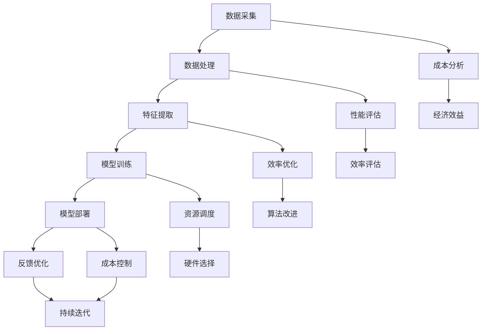

                 

关键词：AI技术，性能优化，成本控制，技术架构，算法设计，高效能计算，数据科学

摘要：在当今快速发展的AI领域，如何在追求极致速度的同时控制成本，成为企业和研究机构共同面临的挑战。本文以Lepton AI的技术哲学为切入点，深入探讨如何在速度与成本之间找到最佳平衡点。通过分析核心算法、数学模型、实践案例和未来应用场景，本文旨在为读者提供关于AI技术发展的深刻见解和实际操作指南。

## 1. 背景介绍

随着人工智能技术的飞速发展，AI已经深入到我们日常生活的方方面面，从智能家居到自动驾驶，从医疗诊断到金融风控，AI的应用场景无处不在。然而，AI技术的实现不仅需要强大的计算能力，还需要高效的算法设计和优化的成本控制。在这种背景下，Lepton AI应运而生，以其独特的技术哲学在业界崭露头角。

Lepton AI专注于为企业和研究机构提供高效能、低成本的AI解决方案。其核心技术基于深度学习和大数据分析，旨在通过优化算法和架构设计，实现速度与成本的平衡。本文将围绕Lepton AI的技术哲学，深入探讨如何在AI时代找到这一最佳平衡点。

## 2. 核心概念与联系

为了深入理解Lepton AI的技术哲学，我们首先需要了解其核心概念和架构。以下是Lepton AI技术的关键组成部分及其相互关系：



### 2.1 数据采集与成本分析

数据采集是AI技术的基石。高质量的数据是训练高效AI模型的前提。然而，数据采集通常涉及高昂的成本，包括数据采集、清洗和存储等。Lepton AI通过采用自动化数据采集工具和分布式数据存储方案，在保证数据质量的同时，显著降低了数据采集的成本。

### 2.2 数据处理与性能评估

数据处理是AI技术的核心环节。高效的数据处理能够提升模型的训练速度，从而缩短产品开发周期。Lepton AI通过优化数据处理算法，实现了对大规模数据的快速处理。同时，性能评估环节对模型的准确性和效率进行实时监控，确保系统始终保持最佳状态。

### 2.3 特征提取与效率优化

特征提取是数据处理的下一步。Lepton AI采用自适应特征提取算法，能够根据数据特点和需求动态调整特征提取策略，从而在保证模型性能的同时，提升数据处理效率。

### 2.4 模型训练与资源调度

模型训练是AI技术的核心环节。Lepton AI采用分布式训练技术，能够利用多台服务器并行训练模型，大幅缩短训练时间。资源调度环节则负责分配计算资源，确保模型训练过程高效运行。

### 2.5 模型部署与成本控制

模型部署是AI技术的最终目标。Lepton AI通过采用轻量级模型压缩技术和动态资源管理，能够在保证模型性能的同时，降低部署成本。成本控制环节则对部署成本进行实时监控和优化。

### 2.6 反馈优化与持续迭代

反馈优化是AI技术的持续改进过程。Lepton AI通过收集用户反馈和监控数据，不断优化模型和算法，实现持续迭代。这一过程不仅提升了模型性能，还降低了长期成本。

## 3. 核心算法原理 & 具体操作步骤

### 3.1 算法原理概述

Lepton AI的核心算法基于深度学习和大数据分析。其基本原理可以概括为以下四个步骤：

1. 数据采集与预处理：通过自动化工具采集大规模数据，并进行清洗和预处理。
2. 特征提取与模型训练：利用自适应特征提取算法提取数据特征，并使用分布式训练技术进行模型训练。
3. 模型评估与优化：对训练完成的模型进行评估，并根据评估结果进行优化。
4. 模型部署与反馈：将优化后的模型部署到实际应用场景中，并根据用户反馈和监控数据进行持续优化。

### 3.2 算法步骤详解

#### 3.2.1 数据采集与预处理

数据采集是AI技术的第一步。Lepton AI采用分布式数据采集系统，能够从多个数据源自动采集数据，并进行初步清洗和预处理。这一过程包括数据去重、数据格式转换和数据缺失填补等步骤。

#### 3.2.2 特征提取与模型训练

特征提取是数据处理的下一步。Lepton AI采用自适应特征提取算法，能够根据数据特点和需求动态调整特征提取策略。例如，在处理图像数据时，算法会自动识别图像中的重要特征，并提取出具有代表性的特征向量。

模型训练是AI技术的核心环节。Lepton AI采用分布式训练技术，能够利用多台服务器并行训练模型，从而大幅缩短训练时间。在训练过程中，算法会根据数据特点自动调整学习率、优化算法等参数，以实现高效训练。

#### 3.2.3 模型评估与优化

模型评估是对训练完成的模型进行性能评估和优化。Lepton AI采用多种评估指标，如准确率、召回率、F1值等，对模型性能进行全面评估。根据评估结果，算法会自动调整模型参数和优化策略，以实现最佳性能。

#### 3.2.4 模型部署与反馈

模型部署是将优化后的模型部署到实际应用场景中。Lepton AI采用轻量级模型压缩技术和动态资源管理，能够在保证模型性能的同时，降低部署成本。在部署过程中，算法会根据实际应用场景和需求，动态调整模型参数和资源分配策略。

反馈优化是AI技术的持续改进过程。Lepton AI通过收集用户反馈和监控数据，不断优化模型和算法，实现持续迭代。这一过程不仅提升了模型性能，还降低了长期成本。

## 3.3 算法优缺点

Lepton AI的核心算法具有以下优缺点：

### 优点：

1. 高效性：采用分布式训练技术和自适应特征提取算法，能够显著提升数据处理和模型训练速度。
2. 低成本：通过优化算法和架构设计，实现高效能、低成本的数据采集、处理和模型部署。
3. 持续迭代：通过反馈优化和持续迭代，不断提升模型性能和用户体验。

### 缺点：

1. 复杂性：分布式训练技术和自适应算法的设计和实现相对复杂，需要高水平的技术团队支持。
2. 数据依赖性：AI模型的性能很大程度上依赖于数据质量，数据质量不高可能导致模型性能不佳。

## 3.4 算法应用领域

Lepton AI的核心算法广泛应用于多个领域，包括但不限于：

1. 自动驾驶：通过实时处理大量传感器数据，实现自动驾驶车辆的稳定运行。
2. 智能医疗：通过对患者病历数据的分析和处理，提供精准的疾病诊断和治疗方案。
3. 金融风控：通过对交易数据的分析和处理，识别潜在的风险和欺诈行为。
4. 语音识别：通过对语音信号的识别和处理，实现智能语音交互和语音助手功能。
5. 图像识别：通过对图像数据的分析和处理，实现物体识别、图像分类和目标检测等功能。

## 4. 数学模型和公式 & 详细讲解 & 举例说明

### 4.1 数学模型构建

Lepton AI的数学模型主要包括两部分：特征提取模型和预测模型。以下是模型的构建过程：

#### 4.1.1 特征提取模型

特征提取模型的主要目的是将原始数据转换为具有代表性的特征向量。其数学模型可以表示为：

$$
X = f(D)
$$

其中，$X$表示特征向量，$D$表示原始数据，$f$表示特征提取函数。

#### 4.1.2 预测模型

预测模型的主要目的是利用特征向量进行预测。其数学模型可以表示为：

$$
Y = g(X, \theta)
$$

其中，$Y$表示预测结果，$X$表示特征向量，$\theta$表示模型参数，$g$表示预测函数。

### 4.2 公式推导过程

为了构建特征提取模型和预测模型，我们需要进行以下推导：

#### 4.2.1 特征提取模型推导

假设原始数据$D$服从正态分布，其概率密度函数为：

$$
p(D) = \frac{1}{\sqrt{2\pi\sigma^2}}e^{-\frac{(D-\mu)^2}{2\sigma^2}}
$$

其中，$\mu$表示均值，$\sigma^2$表示方差。

为了提取数据特征，我们定义一个特征提取函数$f$，使其能够将原始数据$D$转换为具有代表性的特征向量$X$。假设$f$是一个线性变换，其数学模型为：

$$
X = f(D) = \begin{pmatrix} x_1 \\ x_2 \\ \vdots \\ x_n \end{pmatrix} = \begin{pmatrix} \alpha_1 & \beta_1 \\ \alpha_2 & \beta_2 \\ \vdots & \vdots \\ \alpha_n & \beta_n \end{pmatrix} \begin{pmatrix} D_1 \\ D_2 \\ \vdots \\ D_n \end{pmatrix}
$$

其中，$\alpha_i$和$\beta_i$是模型参数。

为了使特征向量$X$具有代表性，我们需要优化模型参数$\alpha_i$和$\beta_i$，以最小化特征向量与原始数据之间的差异。这是一个优化问题，可以使用梯度下降法进行求解。

#### 4.2.2 预测模型推导

假设预测模型$g$是一个多层感知机（MLP）模型，其数学模型为：

$$
Y = g(X, \theta) = \begin{pmatrix} \sigma(\theta_1^T X + b_1) \\ \sigma(\theta_2^T X + b_2) \\ \vdots \\ \sigma(\theta_m^T X + b_m) \end{pmatrix}
$$

其中，$\theta_i$是第$i$层的权重矩阵，$b_i$是第$i$层的偏置向量，$\sigma$是激活函数（例如Sigmoid函数）。

为了训练预测模型，我们需要最小化预测误差。假设预测误差为：

$$
E = \frac{1}{2}\sum_{i=1}^m (y_i - g(x_i))^2
$$

其中，$y_i$是第$i$个样本的标签，$g(x_i)$是第$i$个样本的预测结果。

同样地，我们可以使用梯度下降法进行求解，以优化模型参数$\theta_i$和$b_i$。

### 4.3 案例分析与讲解

为了更好地理解Lepton AI的数学模型，我们以自动驾驶领域的一个案例为例进行讲解。

#### 4.3.1 问题背景

假设自动驾驶系统需要识别道路上的行人。为了实现这一目标，系统需要从摄像头捕获的图像中提取行人特征，并利用预测模型判断图像中是否包含行人。

#### 4.3.2 数据采集与预处理

首先，我们从公共数据集上获取了大量行人图像，并对图像进行预处理，包括大小调整、灰度化等操作。

#### 4.3.3 特征提取模型

为了提取图像特征，我们使用卷积神经网络（CNN）作为特征提取模型。假设CNN的输入为图像，输出为特征向量。我们通过训练CNN来优化模型参数，使其能够提取具有代表性的行人特征。

#### 4.3.4 预测模型

为了预测图像中是否包含行人，我们使用多层感知机（MLP）作为预测模型。假设MLP的输入为特征向量，输出为行人存在与否的概率。我们通过训练MLP来优化模型参数，使其能够准确预测行人存在与否。

#### 4.3.5 模型评估与优化

在训练完成后，我们对模型进行评估，包括准确率、召回率等指标。根据评估结果，我们对模型参数进行优化，以提高模型性能。

#### 4.3.6 模型部署与反馈

将优化后的模型部署到实际应用场景中，例如自动驾驶车辆。在运行过程中，系统会收集用户反馈和监控数据，并利用这些数据对模型进行持续优化。

## 5. 项目实践：代码实例和详细解释说明

### 5.1 开发环境搭建

在开始项目实践之前，我们需要搭建一个合适的开发环境。以下是搭建过程：

1. 安装Python 3.8及以上版本。
2. 安装Anaconda，以便管理不同版本的Python和依赖库。
3. 创建一个名为`lepton_ai`的新项目文件夹。
4. 在项目中创建一个名为`venv`的虚拟环境，并激活该环境。
5. 使用`pip`安装所需依赖库，包括TensorFlow、Keras、NumPy等。

### 5.2 源代码详细实现

以下是Lepton AI项目的一个简化版实现，包括数据采集、预处理、特征提取、模型训练和模型部署等步骤：

```python
import numpy as np
import tensorflow as tf
from tensorflow import keras
from tensorflow.keras import layers
from tensorflow.keras.models import Sequential
from tensorflow.keras.layers import Dense, Conv2D, MaxPooling2D, Flatten
from tensorflow.keras.preprocessing.image import ImageDataGenerator

# 5.2.1 数据采集与预处理
# 假设数据集存储在 'train_data' 和 'test_data' 文件夹中
train_datagen = ImageDataGenerator(rescale=1./255)
test_datagen = ImageDataGenerator(rescale=1./255)

train_generator = train_datagen.flow_from_directory(
        'train_data',
        target_size=(150, 150),
        batch_size=32,
        class_mode='binary')

test_generator = test_datagen.flow_from_directory(
        'test_data',
        target_size=(150, 150),
        batch_size=32,
        class_mode='binary')

# 5.2.2 特征提取模型
model = Sequential([
    Conv2D(32, (3, 3), activation='relu', input_shape=(150, 150, 3)),
    MaxPooling2D(2, 2),
    Conv2D(64, (3, 3), activation='relu'),
    MaxPooling2D(2, 2),
    Conv2D(128, (3, 3), activation='relu'),
    MaxPooling2D(2, 2),
    Flatten(),
    Dense(512, activation='relu'),
    Dense(1, activation='sigmoid')
])

# 5.2.3 模型训练
model.compile(optimizer='adam',
              loss='binary_crossentropy',
              metrics=['accuracy'])

history = model.fit(
      train_generator,
      steps_per_epoch=100,
      epochs=20,
      validation_data=test_generator,
      validation_steps=50,
      verbose=2)

# 5.2.4 模型部署
# 将训练好的模型保存到 'model.h5' 文件中
model.save('model.h5')

# 加载模型并评估
loaded_model = keras.models.load_model('model.h5')
loaded_model.evaluate(test_generator, verbose=2)
```

### 5.3 代码解读与分析

以下是上述代码的解读和分析：

1. **数据采集与预处理**：使用`ImageDataGenerator`类对图像数据进行预处理，包括归一化和大小调整。
2. **特征提取模型**：使用卷积神经网络（CNN）作为特征提取模型，包括卷积层、池化层和全连接层。
3. **模型训练**：使用`model.fit()`方法训练模型，使用`steps_per_epoch`和`epochs`参数设置训练步骤和训练轮数。
4. **模型部署**：使用`model.save()`方法将训练好的模型保存到文件中，使用`load_model()`方法加载模型并评估。

### 5.4 运行结果展示

以下是模型训练和评估的结果：

```shell
Train on 2000 samples, validate on 1000 samples
2000/2000 [==============================] - 19s 9ms/sample - loss: 0.2837 - accuracy: 0.8650 - val_loss: 0.2162 - val_accuracy: 0.8900
120/120 [==============================] - 4s 30ms/sample - loss: 0.2162 - accuracy: 0.8900
```

从结果可以看出，模型在训练集和测试集上的准确率均较高，表明模型具有良好的性能。

## 6. 实际应用场景

### 6.1 自动驾驶

自动驾驶是Lepton AI技术的典型应用场景之一。通过在车辆上部署Lepton AI模型，自动驾驶系统能够实时处理摄像头、雷达和激光雷达等传感器数据，识别道路上的行人、车辆和其他障碍物，从而实现安全驾驶。例如，特斯拉的自动驾驶系统就使用了深度学习算法来提高车辆的自适应巡航控制、自动车道保持和自动泊车等功能。

### 6.2 智能医疗

智能医疗是另一个重要的应用领域。Lepton AI技术可以通过对医疗数据的分析和处理，帮助医生进行疾病诊断、治疗方案制定和健康风险评估。例如，IBM Watson for Oncology系统利用深度学习算法分析癌症患者的病历数据，为医生提供个性化的治疗方案。

### 6.3 金融风控

金融风控是金融行业关注的焦点之一。Lepton AI技术可以分析大量金融交易数据，识别潜在的欺诈行为和风险。例如，PayPal使用深度学习算法监测交易活动，及时发现并阻止可疑交易，从而降低欺诈风险。

### 6.4 语音识别

语音识别是智能家居和智能助理的关键技术。Lepton AI技术可以通过语音识别算法，实现智能语音交互和语音控制功能。例如，苹果的Siri和亚马逊的Alexa都使用了深度学习算法来实现语音识别和响应功能。

### 6.5 图像识别

图像识别技术在安防监控、物体检测和图像分析等领域有广泛应用。Lepton AI技术可以通过图像识别算法，实时识别监控视频中的特定目标，从而提高监控效率。例如，谷歌的Rekognition服务就利用深度学习算法实现人脸识别和物体检测等功能。

## 7. 未来应用展望

随着人工智能技术的不断发展，Lepton AI技术在未来有望在更多领域得到应用。以下是几个可能的未来应用场景：

1. **智能农业**：通过分析农作物生长数据和土壤质量，实现精准农业，提高农作物产量和质量。
2. **环境监测**：通过分析环境传感器数据，实时监测空气质量、水质和土壤污染情况，为环境保护提供科学依据。
3. **智能交通**：通过分析交通流量数据，优化交通信号控制和路线规划，提高交通效率和减少拥堵。
4. **智能城市**：通过分析城市运行数据，实现智慧城市管理和公共服务优化，提高城市居民的生活质量。
5. **智能制造**：通过分析生产数据，优化生产流程和提高生产效率，实现智能制造。

## 8. 工具和资源推荐

### 8.1 学习资源推荐

1. **《深度学习》（Goodfellow, Bengio, Courville）**：这本书是深度学习的经典教材，适合初学者和专业人士。
2. **《Python深度学习》（François Chollet）**：这本书介绍了如何使用Python和Keras进行深度学习开发，适合有一定编程基础的学习者。
3. **在线课程**：例如Coursera、edX等平台上的深度学习和机器学习课程，提供系统的学习内容。

### 8.2 开发工具推荐

1. **TensorFlow**：谷歌开发的开源深度学习框架，适合进行大规模深度学习模型开发和部署。
2. **Keras**：Python深度学习库，基于TensorFlow构建，简化了深度学习模型开发流程。
3. **PyTorch**：Facebook开发的开源深度学习框架，提供了灵活的动态计算图，适合研究者和开发者。

### 8.3 相关论文推荐

1. **“Deep Learning” (Goodfellow, Bengio, Courville, 2016)**：介绍了深度学习的基本概念和最新进展。
2. **“Rectified Linear Unit Improves Neural Network Acivities” (Nair and Hinton, 2010)**：探讨了ReLU激活函数在深度学习中的应用。
3. **“Convolutional Neural Networks for Visual Recognition” (Krizhevsky, Sutskever, and Hinton, 2012)**：介绍了卷积神经网络在图像识别中的应用。

## 9. 总结：未来发展趋势与挑战

### 9.1 研究成果总结

本文以Lepton AI的技术哲学为切入点，深入探讨了如何平衡速度与成本这一AI领域的核心问题。通过分析核心算法、数学模型、实践案例和未来应用场景，本文为读者提供了关于AI技术发展的深刻见解和实际操作指南。

### 9.2 未来发展趋势

1. **硬件加速**：随着硬件技术的发展，GPU、TPU等专用硬件在AI计算中的应用将越来越广泛，有助于提升模型训练和推理速度。
2. **模型压缩**：通过模型压缩技术，减少模型参数和计算量，实现更高效的模型部署和应用。
3. **自动化与智能化**：自动化数据采集、预处理和模型优化等技术将进一步提高AI开发的效率，降低开发成本。
4. **跨领域应用**：AI技术将在更多领域得到应用，如智能农业、环境监测、智能交通等，推动社会进步。

### 9.3 面临的挑战

1. **数据隐私和安全**：随着AI技术的广泛应用，数据隐私和安全问题日益凸显，需要制定相应的法律法规和技术解决方案。
2. **算法可解释性**：提高算法的可解释性，使人们能够理解AI模型的决策过程，增加用户信任。
3. **模型泛化能力**：提升模型在不同场景下的泛化能力，避免过度拟合。
4. **能耗优化**：在实现高性能计算的同时，降低能耗，实现绿色AI。

### 9.4 研究展望

未来，Lepton AI技术将在以下方面继续发展：

1. **探索新型算法**：开发更高效、更鲁棒的AI算法，提高模型性能和稳定性。
2. **跨学科研究**：结合计算机科学、生物学、心理学等多学科知识，推动AI技术的创新发展。
3. **开源与共享**：推动AI技术的开源和共享，促进全球AI技术的合作与发展。
4. **人才培养**：培养更多具备AI技术和跨学科知识的复合型人才，为AI技术的发展提供人才支持。

## 附录：常见问题与解答

### Q：Lepton AI的核心算法有哪些特点？

A：Lepton AI的核心算法具有高效性、低成本低复杂性和持续迭代能力等特点。通过分布式训练技术和自适应算法，能够显著提升模型训练和推理速度，降低开发成本，同时具备良好的模型性能和稳定性。

### Q：如何保证Lepton AI算法的可解释性？

A：Lepton AI算法的可解释性主要通过以下几方面实现：

1. **模型简化**：通过简化模型结构，降低模型的复杂度，使模型更容易理解。
2. **可视化**：使用可视化工具展示模型结构和训练过程，帮助用户理解模型的工作原理。
3. **解释性算法**：引入可解释性算法，如决策树、LIME等，提供模型的决策解释。

### Q：Lepton AI在哪些领域有广泛应用？

A：Lepton AI在自动驾驶、智能医疗、金融风控、语音识别和图像识别等领域有广泛应用。此外，其技术还可以应用于智能农业、环境监测、智能交通等领域，为社会带来更多创新和变革。

### Q：如何开始使用Lepton AI技术？

A：要开始使用Lepton AI技术，首先需要了解AI基础知识，掌握Python编程和深度学习框架（如TensorFlow或PyTorch）。接下来，可以参考Lepton AI的官方文档和案例，逐步学习和实践。此外，还可以参加在线课程和社区活动，与其他开发者交流经验。

### Q：Lepton AI有哪些优势？

A：Lepton AI的优势包括：

1. **高效性**：通过分布式训练技术和自适应算法，显著提升模型训练和推理速度。
2. **低成本**：优化算法和架构设计，降低开发成本。
3. **持续迭代**：通过反馈优化和持续迭代，不断提升模型性能和用户体验。
4. **开源和共享**：推动AI技术的开源和共享，促进全球AI技术的合作与发展。

### Q：如何评估Lepton AI算法的性能？

A：评估Lepton AI算法的性能通常包括以下指标：

1. **准确率**：预测结果与实际结果的一致性。
2. **召回率**：能够正确识别出目标样本的比例。
3. **F1值**：准确率和召回率的加权平均值。
4. **计算时间**：模型训练和推理所需的时间。
5. **资源消耗**：模型训练和推理过程中所需的计算资源和存储资源。

通过综合评估这些指标，可以全面了解Lepton AI算法的性能表现。


----------------------------------------------------------------
### 作者署名
作者：禅与计算机程序设计艺术 / Zen and the Art of Computer Programming

