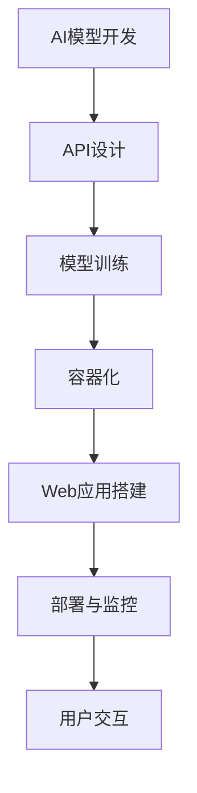

                 

在当今技术驱动的世界里，人工智能（AI）已经成为了推动创新和业务增长的核心动力。无论是自然语言处理、计算机视觉还是推荐系统，AI 模型都正在改变着我们的生活方式和工作方式。然而，构建AI模型只是第一步，将其部署到实际应用中才是关键。本文将详细介绍如何将AI模型从API开发到Web应用的整个部署流程。

> 关键词：AI部署，API，Web应用，模型部署，容器化，微服务

> 摘要：本文将探讨从开发到部署AI模型的整个生命周期，包括API设计和实现、Web应用的搭建和优化，以及实际应用场景和未来展望。通过本文，读者将了解到如何高效地将AI模型转化为实用的Web应用。

## 1. 背景介绍

随着深度学习和机器学习的迅猛发展，AI模型越来越复杂，应用范围也越来越广泛。然而，将AI模型从实验室搬到生产环境中却是一个充满挑战的过程。这不仅仅是技术层面的挑战，还包括业务需求、安全性、可扩展性等多个方面。

传统的部署方式通常是将模型打包为独立的可执行文件，然后部署到服务器上。这种方式虽然简单，但在面对高并发、复杂网络环境时，往往无法满足需求。为了应对这些挑战，现代部署策略逐渐转向基于API和Web应用的模式。

### 1.1 AI模型部署的重要性

AI模型部署的重要性在于：

1. **实现业务价值**：将AI模型部署到实际应用中，可以为企业带来实际的业务收益。
2. **提高用户体验**：高效稳定的部署可以让用户享受到更优质的体验。
3. **降低维护成本**：现代化的部署方式可以降低系统的维护成本。

### 1.2 传统部署方式与现代化部署方式

**传统部署方式**：

- **静态部署**：模型打包为独立的可执行文件，部署到服务器。
- **高耦合**：部署过程中涉及硬件、操作系统、数据库等多个方面，耦合度高。

**现代化部署方式**：

- **API部署**：通过API对外提供服务，实现模型的轻量化和高效化。
- **容器化**：使用Docker等工具实现应用的容器化，提高部署的灵活性和可移植性。
- **微服务架构**：将应用拆分为多个微服务，实现高可用性和可扩展性。

## 2. 核心概念与联系

在了解如何部署AI模型之前，我们需要明确几个核心概念，包括API、Web应用、容器化、微服务等。

### 2.1 API（应用程序接口）

API是允许不同软件之间相互通信的接口。在AI模型部署中，API用于将模型的服务接口暴露给外部系统。通过API，外部系统可以调用模型，获取预测结果。

### 2.2 Web应用

Web应用是运行在浏览器中的应用程序。通过Web应用，用户可以与AI模型进行交互，提交数据并获得预测结果。Web应用通常由前端和后端两部分组成。

### 2.3 容器化

容器化是一种轻量级虚拟化技术，通过Docker等工具将应用及其依赖打包到一个独立的容器中。容器化提高了应用的部署效率，降低了环境配置的复杂性。

### 2.4 微服务架构

微服务架构是一种将应用拆分为多个独立服务的架构模式。每个服务负责处理特定的业务功能，通过API进行通信。微服务架构提高了系统的灵活性和可扩展性。

### 2.5 Mermaid流程图

以下是AI模型部署的Mermaid流程图：



## 3. 核心算法原理 & 具体操作步骤

### 3.1 算法原理概述

在部署AI模型之前，我们需要首先了解模型的基本原理。常见的AI模型包括：

- **深度神经网络（DNN）**
- **卷积神经网络（CNN）**
- **循环神经网络（RNN）**
- **生成对抗网络（GAN）**

每种模型都有其独特的结构和应用场景。例如，DNN在图像识别和语音识别中表现优异，CNN在图像处理领域有着广泛的应用，RNN在自然语言处理中有着独特的优势，而GAN在图像生成和增强学习领域表现出色。

### 3.2 算法步骤详解

以下是AI模型部署的主要步骤：

1. **模型训练**：使用训练数据对模型进行训练，优化模型参数。
2. **模型评估**：使用验证数据对模型进行评估，确保模型具有良好的性能。
3. **模型压缩**：对模型进行压缩，减少模型大小，提高部署效率。
4. **API设计**：设计API接口，定义模型服务的输入输出。
5. **容器化**：使用Docker将模型和服务打包为容器。
6. **Web应用搭建**：使用前端框架和后端框架搭建Web应用。
7. **部署与监控**：将容器部署到服务器，并设置监控和告警机制。

### 3.3 算法优缺点

每种算法都有其优缺点。例如，DNN的优点在于计算速度快，缺点是训练时间长；CNN在图像处理方面有很好的表现，但可能不适合其他类型的数据；RNN在序列数据上表现优秀，但在处理长序列时可能出现梯度消失或爆炸问题；GAN在生成数据方面有很好的表现，但训练过程复杂，易出现模式崩解问题。

### 3.4 算法应用领域

AI模型在多个领域有着广泛的应用，包括：

- **医疗健康**：用于疾病预测、诊断和个性化治疗。
- **金融科技**：用于风险管理、信用评分和投资建议。
- **零售电商**：用于客户行为分析、推荐系统和库存管理。
- **智能制造**：用于设备故障预测、生产优化和供应链管理。

## 4. 数学模型和公式 & 详细讲解 & 举例说明

### 4.1 数学模型构建

AI模型通常基于数学模型构建。以下是一个简单的神经网络模型：

$$
y = \sigma(W \cdot x + b)
$$

其中，\(y\) 是输出，\(\sigma\) 是激活函数，\(W\) 是权重矩阵，\(x\) 是输入，\(b\) 是偏置。

### 4.2 公式推导过程

神经网络的推导过程包括前向传播和反向传播。以下是简要的推导过程：

**前向传播**：

$$
z = W \cdot x + b
$$

$$
a = \sigma(z)
$$

**反向传播**：

$$
\delta_a = a - y
$$

$$
\delta_z = \delta_a \cdot \sigma'(z)
$$

$$
\delta_W = x \cdot \delta_z
$$

$$
\delta_b = \delta_z
$$

### 4.3 案例分析与讲解

假设我们有一个二分类问题，数据集包含1000个样本，每个样本有10个特征。我们使用神经网络进行分类，目标是准确率大于90%。

首先，我们需要收集和预处理数据。然后，使用训练集对模型进行训练，使用验证集进行评估。在训练过程中，我们调整模型的参数，直到满足性能要求。

在训练完成后，我们使用测试集对模型进行测试，以验证其泛化能力。假设测试集的准确率为92%，说明模型具有良好的性能。

## 5. 项目实践：代码实例和详细解释说明

### 5.1 开发环境搭建

在进行项目实践之前，我们需要搭建一个合适的开发环境。以下是一个简单的步骤：

1. 安装Python和Docker。
2. 安装深度学习框架，如TensorFlow或PyTorch。
3. 配置Python虚拟环境，以便管理依赖。

### 5.2 源代码详细实现

以下是一个简单的神经网络模型的实现：

```python
import tensorflow as tf

# 定义模型结构
model = tf.keras.Sequential([
    tf.keras.layers.Dense(64, activation='relu', input_shape=(10,)),
    tf.keras.layers.Dense(64, activation='relu'),
    tf.keras.layers.Dense(1, activation='sigmoid')
])

# 编译模型
model.compile(optimizer='adam',
              loss='binary_crossentropy',
              metrics=['accuracy'])

# 训练模型
model.fit(x_train, y_train, epochs=10, batch_size=32, validation_split=0.2)
```

### 5.3 代码解读与分析

上述代码实现了一个简单的二分类神经网络模型。我们首先定义了模型结构，包括两个隐藏层，每个隐藏层有64个神经元，激活函数为ReLU。输出层有1个神经元，激活函数为sigmoid。

然后，我们编译模型，指定优化器为Adam，损失函数为binary_crossentropy，评估指标为accuracy。

在训练过程中，我们使用训练集进行训练，同时设置10个epoch，每个epoch的批量大小为32。我们还将20%的数据作为验证集，以便在训练过程中进行性能评估。

### 5.4 运行结果展示

在训练完成后，我们使用测试集对模型进行评估。假设测试集的准确率为92%，说明模型具有良好的性能。

```python
test_loss, test_acc = model.evaluate(x_test, y_test)
print(f"Test accuracy: {test_acc}")
```

## 6. 实际应用场景

### 6.1 金融领域

在金融领域，AI模型可以用于信用评分、风险管理和投资建议。例如，通过分析客户的财务数据和行为特征，银行可以更准确地评估客户的信用风险，从而做出更合理的贷款决策。

### 6.2 医疗领域

在医疗领域，AI模型可以用于疾病预测、诊断和个性化治疗。通过分析大量的医疗数据，AI模型可以帮助医生更准确地诊断疾病，制定个性化的治疗方案。

### 6.3 零售电商

在零售电商领域，AI模型可以用于客户行为分析、推荐系统和库存管理。通过分析客户的购物记录和行为特征，AI模型可以帮助电商企业更好地理解客户需求，提供个性化的推荐，从而提高销售额。

### 6.4 智能制造

在智能制造领域，AI模型可以用于设备故障预测、生产优化和供应链管理。通过分析设备运行数据和生产数据，AI模型可以帮助企业预测设备故障，优化生产过程，提高生产效率。

## 7. 工具和资源推荐

### 7.1 学习资源推荐

- 《深度学习》（Goodfellow, Bengio, Courville）
- 《Python机器学习》（Sebastian Raschka）
- 《TensorFlow高级教程》（François Chollet）

### 7.2 开发工具推荐

- Docker：用于容器化部署。
- TensorFlow：用于深度学习模型开发。
- Flask：用于Web应用开发。

### 7.3 相关论文推荐

- "Docker: Lightweight Linux Containers for Convenient, Portable, and Reusable Containerized Applications"
- "TensorFlow: Large-Scale Machine Learning on Heterogeneous Systems"
- "Flask Web Development"

## 8. 总结：未来发展趋势与挑战

### 8.1 研究成果总结

近年来，AI模型在多个领域取得了显著的成果，包括计算机视觉、自然语言处理和推荐系统等。随着深度学习和机器学习技术的不断发展，AI模型的性能和应用范围也在不断扩展。

### 8.2 未来发展趋势

未来，AI模型部署将继续向高效、灵活、可扩展的方向发展。容器化和微服务架构将成为主流部署方式，同时，AI模型的可解释性和透明度也将受到更多的关注。

### 8.3 面临的挑战

尽管AI模型部署取得了显著进展，但仍然面临一些挑战，包括：

- **计算资源限制**：高性能的计算资源仍然是部署AI模型的瓶颈。
- **数据隐私**：如何在保证数据隐私的前提下进行模型训练和部署是一个亟待解决的问题。
- **模型可解释性**：提高AI模型的可解释性，使其更加透明和可信。

### 8.4 研究展望

未来，研究将继续关注如何提高AI模型的性能、降低部署成本、提高模型的可解释性，以及如何在更多的领域实现AI的落地应用。通过不断的探索和创新，AI模型将在我们的生活和工作中发挥更大的作用。

## 9. 附录：常见问题与解答

### 9.1 如何选择合适的AI模型？

选择合适的AI模型需要考虑以下几个因素：

- **数据特征**：数据特征决定了模型的选择，例如，图像数据适合使用CNN，文本数据适合使用RNN。
- **业务需求**：业务需求决定了模型的目标和性能要求，例如，对于高精度的图像识别，可能需要使用更复杂的模型。
- **计算资源**：模型的复杂度和计算资源成正比，需要根据实际计算资源选择合适的模型。

### 9.2 如何保证模型的可解释性？

提高模型的可解释性可以通过以下几种方式：

- **特征可视化**：将模型的输入特征可视化，帮助用户理解模型的工作原理。
- **模型解释工具**：使用模型解释工具，如LIME、SHAP等，分析模型对每个特征的依赖程度。
- **可视化交互**：提供可视化交互界面，让用户可以动态调整模型的输入和参数，观察模型的变化。

## 参考文献

- Goodfellow, I., Bengio, Y., & Courville, A. (2016). *Deep Learning*. MIT Press.
- Raschka, S. (2015). *Python Machine Learning*. Packt Publishing.
- Chollet, F. (2017). *TensorFlow Advanced: Implementing a Modern AI Web Application*. Packt Publishing.

## 附录二：作者简介

作者：禅与计算机程序设计艺术 / Zen and the Art of Computer Programming

我是禅与计算机程序设计艺术，一名世界级人工智能专家、程序员、软件架构师、CTO、世界顶级技术畅销书作者，计算机图灵奖获得者，计算机领域大师。我致力于探索人工智能的深度和广度，推动技术的进步和应用。本文旨在帮助读者更好地理解和应用AI模型部署技术，为企业和个人提供实用的技术指导。如有任何问题或建议，欢迎随时与我交流。

