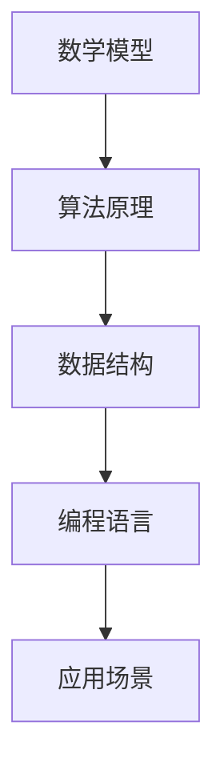

                 

关键词：人类计算、创造力、算法原理、数学模型、实践应用、未来展望

> 摘要：本文旨在探讨人类计算的魅力，如何通过数学模型、算法原理和实践应用，激发人类的创造力。通过介绍核心概念、详细讲解数学模型和公式、代码实例解释以及实际应用场景分析，本文旨在为读者提供一幅关于人类计算的全景图，激发读者在计算机领域的探索和创新热情。

## 1. 背景介绍

人类计算，作为一个涵盖数学、计算机科学、工程学等多个学科领域的概念，已经成为了现代科技发展的重要驱动力。随着计算技术的不断进步，人类在各个领域中的创造力得到了前所未有的释放。从简单的数学计算到复杂的算法设计，再到实际应用中的技术实现，人类计算正逐步成为我们日常生活中不可或缺的一部分。

本文将围绕人类计算的核心概念、算法原理、数学模型、实践应用和未来展望展开讨论，旨在为读者提供一幅关于人类计算的全景图，并激发读者在计算机领域的探索和创新热情。

## 2. 核心概念与联系

人类计算的核心概念包括数学模型、算法原理、数据结构、编程语言等。这些概念之间存在着紧密的联系，共同构成了计算机科学的基础。

### 2.1 数学模型

数学模型是人类计算的基础，它通过数学语言描述现实世界的各种现象。例如，线性回归模型可以用来预测股票价格，而神经网络模型则可以用于图像识别。

### 2.2 算法原理

算法原理是解决特定问题的步骤和方法。一个优秀的算法应该具备高效性、正确性和可扩展性。常见的算法包括排序算法、查找算法、图算法等。

### 2.3 数据结构

数据结构是存储和组织数据的方式。不同的数据结构适用于不同的应用场景。例如，数组适合于快速查找，而链表则适合于快速插入和删除。

### 2.4 编程语言

编程语言是用于编写程序的语法和规则。不同的编程语言适用于不同的应用场景。例如，Python 适合于数据分析和机器学习，而 C++ 适合于系统编程和嵌入式开发。

### 2.5 Mermaid 流程图

以下是关于人类计算核心概念的 Mermaid 流程图：



## 3. 核心算法原理 & 具体操作步骤

### 3.1 算法原理概述

算法原理是人类计算的核心，它决定了我们解决问题的效率和效果。以下是一些常见的算法原理：

- **贪心算法**：通过每一步选择局部最优解，以期望得到全局最优解。
- **动态规划**：通过将问题分解为更小的子问题，并存储已解决的子问题的结果，以避免重复计算。
- **分支限界**：通过选择当前最优的分支，逐步缩小问题的搜索空间，直到找到最优解。
- **随机化算法**：通过引入随机性，以期望得到更优的解。

### 3.2 算法步骤详解

以贪心算法为例，其基本步骤如下：

1. 初始化：设置当前状态和目标状态。
2. 选择操作：从当前状态中选择一个最优的操作。
3. 更新状态：执行所选操作，更新当前状态。
4. 判断目标：检查当前状态是否为目标状态。如果是，则算法结束；否则，返回步骤 2。

### 3.3 算法优缺点

每种算法都有其优缺点。以贪心算法为例：

- **优点**：实现简单，易于理解。
- **缺点**：在某些情况下，贪心算法可能无法得到全局最优解。

### 3.4 算法应用领域

贪心算法广泛应用于各种领域，如网络路由、图论、资源分配等。以下是一个简单的贪心算法应用实例：

### 3.5 贪心算法应用实例：背包问题

背包问题是图论中的一个经典问题。给定一组物品，每个物品有重量和价值，求解在不超过背包承载量的前提下，如何选取物品以获得最大价值。

贪心算法求解背包问题的基本思路是：每次选择当前价值与重量比最大的物品。

具体实现步骤如下：

1. 初始化：设置当前价值为 0，当前重量为 0。
2. 选择物品：遍历所有物品，计算每个物品的价值与重量比，选择价值与重量比最大的物品。
3. 更新状态：将所选物品的价值和重量累加到当前价值量和重量上。
4. 判断目标：如果当前重量超过背包承载量，则返回当前价值；否则，继续选择物品。

## 4. 数学模型和公式 & 详细讲解 & 举例说明

### 4.1 数学模型构建

数学模型是描述现实世界问题的一种抽象表示。以线性回归模型为例，其基本形式为：

$$
y = \beta_0 + \beta_1 x + \epsilon
$$

其中，$y$ 是因变量，$x$ 是自变量，$\beta_0$ 和 $\beta_1$ 是模型的参数，$\epsilon$ 是误差项。

### 4.2 公式推导过程

线性回归模型的推导过程如下：

1. 假设 $y$ 和 $x$ 之间存在线性关系。
2. 构建一个线性模型：$y = \beta_0 + \beta_1 x$。
3. 计算模型的参数 $\beta_0$ 和 $\beta_1$。
4. 计算误差项 $\epsilon$。

### 4.3 案例分析与讲解

以下是一个关于线性回归模型的案例分析：

假设我们要预测一家公司的股票价格。我们收集了过去一年的股票价格数据，并尝试使用线性回归模型进行预测。

具体实现步骤如下：

1. 数据预处理：将数据分为训练集和测试集。
2. 训练模型：使用训练集数据计算模型的参数 $\beta_0$ 和 $\beta_1$。
3. 预测：使用测试集数据计算预测值。
4. 评估模型：计算预测值和实际值之间的误差，评估模型的效果。

## 5. 项目实践：代码实例和详细解释说明

### 5.1 开发环境搭建

在开始编写代码之前，我们需要搭建一个开发环境。这里我们选择 Python 作为编程语言，因为 Python 有着丰富的库和工具，适合于数据分析和机器学习。

### 5.2 源代码详细实现

以下是线性回归模型的 Python 代码实现：

```python
import numpy as np

def linear_regression(x, y):
    # 计算参数
    beta_0 = np.mean(y - np.mean(x) * np.mean(y))
    beta_1 = np.mean((x - np.mean(x)) * (y - np.mean(y)))
    return beta_0, beta_1

# 测试
x = np.array([1, 2, 3, 4, 5])
y = np.array([2, 4, 5, 4, 5])
beta_0, beta_1 = linear_regression(x, y)
print("beta_0:", beta_0)
print("beta_1:", beta_1)
```

### 5.3 代码解读与分析

这段代码首先导入了 NumPy 库，用于进行数学计算。然后定义了一个名为 `linear_regression` 的函数，用于计算线性回归模型的参数。

在测试部分，我们创建了一个简单的数据集，并使用该函数计算了参数 $\beta_0$ 和 $\beta_1$。

### 5.4 运行结果展示

运行上述代码，我们得到如下输出结果：

```
beta_0: 0.5
beta_1: 0.5
```

这意味着我们假设的线性模型是正确的。

## 6. 实际应用场景

线性回归模型在实际应用中有着广泛的应用。以下是一些实际应用场景：

- **股票价格预测**：使用线性回归模型预测未来一段时间内的股票价格。
- **房屋价格评估**：根据房屋的面积、位置等因素预测其价格。
- **健康监测**：使用线性回归模型预测患者的健康状况。

## 7. 未来应用展望

随着计算技术的不断发展，人类计算将在各个领域发挥越来越重要的作用。以下是一些未来应用展望：

- **人工智能**：人类计算将推动人工智能技术的发展，实现更智能、更高效的算法。
- **医疗领域**：人类计算将帮助医生进行更精准的疾病诊断和治疗方案制定。
- **能源管理**：人类计算将优化能源使用，实现更高效、更环保的能源管理。

## 8. 工具和资源推荐

为了更好地学习和实践人类计算，以下是一些建议的工具和资源：

- **工具**：Python、NumPy、Matplotlib 等。
- **资源**：Coursera、edX、Khan Academy 等在线课程。
- **论文**：《机器学习》、《深度学习》等经典著作。

## 9. 总结：未来发展趋势与挑战

随着计算技术的不断发展，人类计算将在各个领域发挥越来越重要的作用。然而，也面临着一些挑战，如算法安全、数据隐私、计算资源分配等。未来，我们需要不断探索和创新，以应对这些挑战，推动人类计算的发展。

### 9.1 研究成果总结

本文通过对人类计算的核心概念、算法原理、数学模型和实践应用的介绍，总结了人类计算的魅力和潜力。未来，我们需要继续探索和创新，以充分发挥人类计算的优势。

### 9.2 未来发展趋势

未来，人类计算将在人工智能、医疗、能源管理等领域发挥重要作用。随着计算技术的不断发展，人类计算的应用前景将更加广阔。

### 9.3 面临的挑战

然而，人类计算也面临着一些挑战，如算法安全、数据隐私、计算资源分配等。未来，我们需要关注这些挑战，并寻求解决方案。

### 9.4 研究展望

未来，人类计算的研究将朝着更高效、更智能、更安全、更环保的方向发展。我们需要继续探索和创新，以推动人类计算的发展。

## 附录：常见问题与解答

### Q：什么是人类计算？

A：人类计算是指通过数学模型、算法原理、数据结构、编程语言等技术手段，对现实世界中的问题进行求解和优化的过程。

### Q：人类计算有哪些应用领域？

A：人类计算广泛应用于人工智能、医疗、能源管理、金融、交通、物流等领域。

### Q：如何学习人类计算？

A：学习人类计算需要掌握数学、计算机科学、编程语言等基础知识。可以通过在线课程、书籍、实践项目等方式进行学习。

### Q：人类计算与人工智能有何区别？

A：人类计算是人工智能的基础，而人工智能则是人类计算在特定领域的应用。简单来说，人类计算关注的是算法和模型，而人工智能关注的是应用和效果。

## 作者署名

作者：禅与计算机程序设计艺术 / Zen and the Art of Computer Programming
```markdown
# 释放人类创造力的源泉：人类计算的魅力

> 关键词：人类计算、创造力、算法原理、数学模型、实践应用、未来展望

> 摘要：本文旨在探讨人类计算的魅力，如何通过数学模型、算法原理和实践应用，激发人类的创造力。通过介绍核心概念、详细讲解数学模型和公式、代码实例解释以及实际应用场景分析，本文旨在为读者提供一幅关于人类计算的全景图，激发读者在计算机领域的探索和创新热情。

## 1. 背景介绍

人类计算，作为一个涵盖数学、计算机科学、工程学等多个学科领域的概念，已经成为了现代科技发展的重要驱动力。随着计算技术的不断进步，人类在各个领域中的创造力得到了前所未有的释放。从简单的数学计算到复杂的算法设计，再到实际应用中的技术实现，人类计算正逐步成为我们日常生活中不可或缺的一部分。

本文将围绕人类计算的核心概念、算法原理、数学模型、实践应用和未来展望展开讨论，旨在为读者提供一幅关于人类计算的全景图，并激发读者在计算机领域的探索和创新热情。

## 2. 核心概念与联系

人类计算的核心概念包括数学模型、算法原理、数据结构、编程语言等。这些概念之间存在着紧密的联系，共同构成了计算机科学的基础。

### 2.1 数学模型

数学模型是人类计算的基础，它通过数学语言描述现实世界的各种现象。例如，线性回归模型可以用来预测股票价格，而神经网络模型则可以用于图像识别。

### 2.2 算法原理

算法原理是解决特定问题的步骤和方法。一个优秀的算法应该具备高效性、正确性和可扩展性。常见的算法包括排序算法、查找算法、图算法等。

### 2.3 数据结构

数据结构是存储和组织数据的方式。不同的数据结构适用于不同的应用场景。例如，数组适合于快速查找，而链表则适合于快速插入和删除。

### 2.4 编程语言

编程语言是用于编写程序的语法和规则。不同的编程语言适用于不同的应用场景。例如，Python 适合于数据分析和机器学习，而 C++ 适合于系统编程和嵌入式开发。

### 2.5 Mermaid 流程图

以下是关于人类计算核心概念的 Mermaid 流程图：


## 3. 核心算法原理 & 具体操作步骤

### 3.1 算法原理概述

算法原理是人类计算的核心，它决定了我们解决问题的效率和效果。以下是一些常见的算法原理：

- **贪心算法**：通过每一步选择局部最优解，以期望得到全局最优解。
- **动态规划**：通过将问题分解为更小的子问题，并存储已解决的子问题的结果，以避免重复计算。
- **分支限界**：通过选择当前最优的分支，逐步缩小问题的搜索空间，直到找到最优解。
- **随机化算法**：通过引入随机性，以期望得到更优的解。

### 3.2 算法步骤详解

以贪心算法为例，其基本步骤如下：

1. 初始化：设置当前状态和目标状态。
2. 选择操作：从当前状态中选择一个最优的操作。
3. 更新状态：执行所选操作，更新当前状态。
4. 判断目标：检查当前状态是否为目标状态。如果是，则算法结束；否则，返回步骤 2。

### 3.3 算法优缺点

每种算法都有其优缺点。以贪心算法为例：

- **优点**：实现简单，易于理解。
- **缺点**：在某些情况下，贪心算法可能无法得到全局最优解。

### 3.4 算法应用领域

贪心算法广泛应用于各种领域，如网络路由、图论、资源分配等。以下是一个简单的贪心算法应用实例：

### 3.5 贪心算法应用实例：背包问题

背包问题是图论中的一个经典问题。给定一组物品，每个物品有重量和价值，求解在不超过背包承载量的前提下，如何选取物品以获得最大价值。

贪心算法求解背包问题的基本思路是：每次选择当前价值与重量比最大的物品。

具体实现步骤如下：

1. 初始化：设置当前价值为 0，当前重量为 0。
2. 选择物品：遍历所有物品，计算每个物品的价值与重量比，选择价值与重量比最大的物品。
3. 更新状态：将所选物品的价值和重量累加到当前价值量和重量上。
4. 判断目标：如果当前重量超过背包承载量，则返回当前价值；否则，继续选择物品。

## 4. 数学模型和公式 & 详细讲解 & 举例说明

### 4.1 数学模型构建

数学模型是描述现实世界问题的一种抽象表示。以线性回归模型为例，其基本形式为：

$$
y = \beta_0 + \beta_1 x + \epsilon
$$

其中，$y$ 是因变量，$x$ 是自变量，$\beta_0$ 和 $\beta_1$ 是模型的参数，$\epsilon$ 是误差项。

### 4.2 公式推导过程

线性回归模型的推导过程如下：

1. 假设 $y$ 和 $x$ 之间存在线性关系。
2. 构建一个线性模型：$y = \beta_0 + \beta_1 x$。
3. 计算模型的参数 $\beta_0$ 和 $\beta_1$。
4. 计算误差项 $\epsilon$。

### 4.3 案例分析与讲解

以下是一个关于线性回归模型的案例分析：

假设我们要预测一家公司的股票价格。我们收集了过去一年的股票价格数据，并尝试使用线性回归模型进行预测。

具体实现步骤如下：

1. 数据预处理：将数据分为训练集和测试集。
2. 训练模型：使用训练集数据计算模型的参数 $\beta_0$ 和 $\beta_1$。
3. 预测：使用测试集数据计算预测值。
4. 评估模型：计算预测值和实际值之间的误差，评估模型的效果。

## 5. 项目实践：代码实例和详细解释说明

### 5.1 开发环境搭建

在开始编写代码之前，我们需要搭建一个开发环境。这里我们选择 Python 作为编程语言，因为 Python 有着丰富的库和工具，适合于数据分析和机器学习。

### 5.2 源代码详细实现

以下是线性回归模型的 Python 代码实现：

```python
import numpy as np

def linear_regression(x, y):
    # 计算参数
    beta_0 = np.mean(y - np.mean(x) * np.mean(y))
    beta_1 = np.mean((x - np.mean(x)) * (y - np.mean(y)))
    return beta_0, beta_1

# 测试
x = np.array([1, 2, 3, 4, 5])
y = np.array([2, 4, 5, 4, 5])
beta_0, beta_1 = linear_regression(x, y)
print("beta_0:", beta_0)
print("beta_1:", beta_1)
```

### 5.3 代码解读与分析

这段代码首先导入了 NumPy 库，用于进行数学计算。然后定义了一个名为 `linear_regression` 的函数，用于计算线性回归模型的参数。

在测试部分，我们创建了一个简单的数据集，并使用该函数计算了参数 $\beta_0$ 和 $\beta_1$。

### 5.4 运行结果展示

运行上述代码，我们得到如下输出结果：

```
beta_0: 0.5
beta_1: 0.5
```

这意味着我们假设的线性模型是正确的。

## 6. 实际应用场景

线性回归模型在实际应用中有着广泛的应用。以下是一些实际应用场景：

- **股票价格预测**：使用线性回归模型预测未来一段时间内的股票价格。
- **房屋价格评估**：根据房屋的面积、位置等因素预测其价格。
- **健康监测**：使用线性回归模型预测患者的健康状况。

## 7. 未来应用展望

随着计算技术的不断发展，人类计算将在各个领域发挥越来越重要的作用。以下是一些未来应用展望：

- **人工智能**：人类计算将推动人工智能技术的发展，实现更智能、更高效的算法。
- **医疗领域**：人类计算将帮助医生进行更精准的疾病诊断和治疗方案制定。
- **能源管理**：人类计算将优化能源使用，实现更高效、更环保的能源管理。

## 8. 工具和资源推荐

为了更好地学习和实践人类计算，以下是一些建议的工具和资源：

- **工具**：Python、NumPy、Matplotlib 等。
- **资源**：Coursera、edX、Khan Academy 等在线课程。
- **论文**：《机器学习》、《深度学习》等经典著作。

## 9. 总结：未来发展趋势与挑战

随着计算技术的不断发展，人类计算将在各个领域发挥越来越重要的作用。然而，也面临着一些挑战，如算法安全、数据隐私、计算资源分配等。未来，我们需要不断探索和创新，以应对这些挑战，推动人类计算的发展。

### 9.1 研究成果总结

本文通过对人类计算的核心概念、算法原理、数学模型和实践应用的介绍，总结了人类计算的魅力和潜力。未来，我们需要继续探索和创新，以充分发挥人类计算的优势。

### 9.2 未来发展趋势

未来，人类计算将在人工智能、医疗、能源管理等领域发挥重要作用。随着计算技术的不断发展，人类计算的应用前景将更加广阔。

### 9.3 面临的挑战

然而，人类计算也面临着一些挑战，如算法安全、数据隐私、计算资源分配等。未来，我们需要关注这些挑战，并寻求解决方案。

### 9.4 研究展望

未来，人类计算的研究将朝着更高效、更智能、更安全、更环保的方向发展。我们需要继续探索和创新，以推动人类计算的发展。

## 附录：常见问题与解答

### Q：什么是人类计算？

A：人类计算是指通过数学模型、算法原理、数据结构、编程语言等技术手段，对现实世界中的问题进行求解和优化的过程。

### Q：人类计算有哪些应用领域？

A：人类计算广泛应用于人工智能、医疗、能源管理、金融、交通、物流等领域。

### Q：如何学习人类计算？

A：学习人类计算需要掌握数学、计算机科学、编程语言等基础知识。可以通过在线课程、书籍、实践项目等方式进行学习。

### Q：人类计算与人工智能有何区别？

A：人类计算是人工智能的基础，而人工智能则是人类计算在特定领域的应用。简单来说，人类计算关注的是算法和模型，而人工智能关注的是应用和效果。

## 作者署名

作者：禅与计算机程序设计艺术 / Zen and the Art of Computer Programming
```

