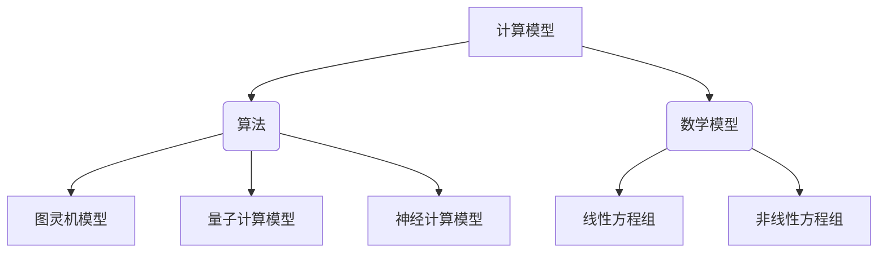

                 

关键词：计算潜力、人类能力、计算效率、算法优化、数学模型、未来趋势、技术应用、资源推荐

> 摘要：本文旨在探讨计算技术对人类潜能的释放和影响，揭示计算技术发展的最终目标是如何通过提高计算效率和算法优化，促进人类能力的全面发挥。我们将深入分析计算技术的核心概念、算法原理、数学模型、实际应用场景，并展望未来的发展趋势与挑战。希望通过这篇文章，能够激发读者对计算技术的兴趣，共同探索人类计算的未来。

## 1. 背景介绍

计算技术作为人类智慧的结晶，已经深深地融入到了我们生活的方方面面。从最初的简单计算工具到现代的超级计算机，计算技术不断演进，推动着人类社会向前发展。然而，随着计算能力的不断提升，我们不禁要思考：计算的最终目标究竟是什么？它是如何释放人类的潜力，引领我们走向更美好的未来？

### 计算技术的发展历程

计算技术的发展历程可以追溯到古代，如古代中国、希腊和印度等地，人们就已经开始使用各种计算工具进行数学运算。这些简单的计算工具虽然效率低下，但为后来的计算技术的发展奠定了基础。

随着工业革命的到来，计算工具逐渐从手工操作转向机械化，如计算机和算盘的出现。这一时期的计算技术虽然仍然有限，但为后来的电子计算机和计算机科学的诞生提供了重要基础。

20世纪中叶，计算机科学诞生，计算机技术进入了一个全新的时代。从第一台电子计算机ENIAC的问世，到个人电脑的普及，再到互联网的兴起，计算技术不断突破，迎来了信息时代。

### 计算技术的重要性

计算技术在现代社会中扮演着至关重要的角色。它不仅改变了我们的生活方式，还极大地提升了我们的工作效率和生活质量。例如：

- 在医学领域，计算技术可以帮助医生进行精确的手术规划，提高医疗效果。
- 在金融领域，计算技术可以处理海量数据，帮助投资者进行精准的投资决策。
- 在教育领域，计算技术可以提供个性化的学习资源，帮助学生更有效地学习。

### 人类潜能的释放与计算技术的关系

计算技术的不断发展，为我们释放人类潜能提供了无限可能。通过计算技术，我们可以：

- 提高计算效率：利用高效的算法和计算工具，我们可以在更短的时间内完成大量的计算任务，从而节省时间和精力。
- 深入挖掘数据价值：通过大数据分析和人工智能技术，我们可以从海量数据中提取有价值的信息，为决策提供科学依据。
- 推动科学研究：计算技术可以帮助科学家进行复杂的模拟和实验，从而推动科学研究的进展。

## 2. 核心概念与联系

为了深入理解计算技术的核心概念和联系，我们需要探讨计算技术的几个关键组成部分，包括计算模型、算法、数学模型等，并通过Mermaid流程图展示它们之间的相互关系。

### 计算模型

计算模型是计算技术的基础，它定义了计算的基本原理和结构。常见的计算模型包括图灵机模型、量子计算模型和神经计算模型等。

- **图灵机模型**：由艾伦·图灵提出，它是一种抽象的计算模型，用于模拟任何计算过程。
- **量子计算模型**：基于量子力学原理，利用量子比特进行计算，具有并行计算的优势。
- **神经计算模型**：模仿人脑的结构和功能，通过神经网络进行计算，具有自适应和学习能力。

### 算法

算法是计算过程中的具体操作步骤，用于解决特定问题。算法可以分为多种类型，如排序算法、搜索算法、图算法等。

- **排序算法**：用于对数据进行排序，如快速排序、归并排序等。
- **搜索算法**：用于在数据结构中查找特定元素，如二分搜索、深度优先搜索等。
- **图算法**：用于分析图结构，如最短路径算法、最小生成树算法等。

### 数学模型

数学模型是计算技术中的重要组成部分，用于描述现实世界中的问题。数学模型可以通过数学公式和方程进行表达，如线性方程组、非线性方程组等。

- **线性方程组**：用于解决线性问题，如线性规划、线性回归等。
- **非线性方程组**：用于解决非线性问题，如微分方程、优化问题等。

### Mermaid流程图

以下是一个简化的Mermaid流程图，展示了计算模型、算法和数学模型之间的联系：



在这个流程图中，计算模型作为核心，通过算法和数学模型与实际问题相联系。不同的计算模型和算法可以应用于不同的应用场景，而数学模型则为这些计算过程提供了理论基础。

通过深入理解这些核心概念和联系，我们可以更好地把握计算技术的发展方向和应用潜力，从而推动人类计算能力的进一步提升。

### 2.1 计算模型的定义与类型

计算模型是计算技术的基础，它通过抽象和形式化方法，描述了计算过程和计算结构的原理。计算模型可以用来模拟和分析各种计算任务，从而为算法设计和数学建模提供理论依据。

#### 图灵机模型

图灵机模型是由艾伦·图灵在20世纪30年代提出的，是一种理想化的计算模型，用于模拟任何计算过程。图灵机由一个无限长的带子、一个读写头和一系列状态转换规则组成。带子上的符号表示数据，读写头可以在带子上左右移动，并在当前位置上读取和写入符号。状态转换规则定义了读写头如何根据当前状态和带子上的符号，进行状态转换、读写操作和移动方向。图灵机的强大之处在于它可以模拟任何算法过程，因此被广泛认为是一种通用计算模型。

#### 量子计算模型

量子计算模型是基于量子力学原理的，它利用量子比特（qubit）进行计算。量子比特是量子计算的基本单元，它不仅可以表示0或1的状态，还可以同时存在于0和1的叠加态。量子计算机通过叠加态和量子纠缠来实现并行计算，从而在处理某些特定问题时，比传统计算机具有更高的计算速度。例如，量子计算在因子分解和量子搜索算法中显示出巨大的潜力。

#### 神经计算模型

神经计算模型模仿人脑的结构和功能，通过神经网络进行计算。神经网络由多个神经元（或节点）组成，每个神经元都可以接收输入信号，并通过激活函数产生输出。神经网络通过学习大量训练数据，可以识别模式、进行分类和回归等任务。神经计算模型具有自适应和学习能力，可以不断优化自身性能，从而在图像识别、语音识别和自然语言处理等领域表现出色。

### 2.2 算法的定义与类型

算法是计算技术中的核心概念，它描述了解决特定问题的操作步骤。算法可以用于各种应用场景，从简单的排序和搜索到复杂的优化和模拟。算法可以分为多种类型，每种类型都有其独特的特点和适用场景。

#### 排序算法

排序算法用于对数据进行排序，常见的排序算法包括：

- **快速排序**：采用分治策略，通过递归方式将数据划分为较小的子序列，并对其进行排序。
- **归并排序**：通过递归将数据分为较小的子序列，然后两两归并，直到整个数据序列有序。
- **堆排序**：利用堆这种数据结构，通过调整堆的性质来实现排序。

#### 搜索算法

搜索算法用于在数据结构中查找特定元素，常见的搜索算法包括：

- **二分搜索**：在有序数据中，通过不断将搜索范围缩小一半，实现快速查找。
- **深度优先搜索**：通过递归方式，逐层遍历数据结构，直到找到目标元素。
- **广度优先搜索**：通过队列数据结构，逐层遍历数据结构，直到找到目标元素。

#### 图算法

图算法用于分析图结构，常见的图算法包括：

- **最短路径算法**：用于找到图中两点之间的最短路径，如迪杰斯特拉算法和贝尔曼-福特算法。
- **最小生成树算法**：用于找到图中包含所有节点的最小生成树，如普里姆算法和克鲁斯卡尔算法。
- **拓扑排序**：用于确定图中各个节点的拓扑排序，常用于处理有向无环图（DAG）。

### 2.3 数学模型在计算技术中的应用

数学模型是计算技术中的重要组成部分，它通过数学公式和方程，描述了现实世界中的问题和现象。数学模型在计算技术中的应用非常广泛，从简单的线性方程组到复杂的优化问题，都可以通过数学模型进行描述和分析。

#### 线性方程组

线性方程组是数学模型中最基本的形式，它由一组线性方程组成。线性方程组广泛应用于各种领域，如经济学、工程学和物理学。例如，线性方程组可以用于求解线性规划问题，这是一个常见的优化问题，用于在满足一定约束条件下，找到目标函数的最大值或最小值。

#### 非线性方程组

非线性方程组是比线性方程组更复杂的数学模型，它由一组非线性方程组成。非线性方程组在科学和工程领域中具有广泛应用，如物理学中的牛顿运动定律、生物学中的生态模型等。非线性方程组的求解通常比线性方程组更困难，需要采用更高级的数值方法和算法。

#### 微分方程

微分方程是描述连续变化现象的数学模型，它通过导数和微分运算来表达。微分方程在物理学、工程学、生物学等领域具有重要应用。例如，牛顿第二定律可以表示为微分方程，用于描述物体的运动。微分方程的求解可以通过数值方法，如有限差分法和有限元法，来实现。

#### 优化问题

优化问题是数学模型中的重要类型，它涉及在给定约束条件下，寻找目标函数的最优解。优化问题广泛应用于各种领域，如经济学、运筹学、控制理论等。常见的优化方法包括线性规划、非线性规划、动态规划等。优化问题可以通过构建数学模型，并采用相应的算法进行求解。

### 2.4 计算模型、算法与数学模型的关系

计算模型、算法和数学模型是计算技术的核心组成部分，它们之间存在着紧密的联系和相互影响。

#### 计算模型与算法

计算模型为算法提供了基础和框架，算法是计算模型的具体实现。例如，图灵机模型定义了计算的基本原理，而各种算法则是实现这些原理的具体步骤。不同的计算模型可以支持不同的算法，如图灵机模型可以支持经典的排序算法和搜索算法，而量子计算模型则可以支持量子算法。

#### 计算模型与数学模型

计算模型和数学模型共同描述了现实世界中的问题和现象。计算模型通过抽象和形式化方法，将问题转化为计算过程，而数学模型则通过数学公式和方程，对这些计算过程进行描述和分析。例如，在物理学中，计算模型可以用来模拟物体运动，而数学模型则通过微分方程来描述物体的运动规律。

#### 算法与数学模型

算法和数学模型共同构成了计算技术的核心。算法通过具体的操作步骤，实现了数学模型中的计算过程。例如，在优化问题中，数学模型通过构建目标函数和约束条件，定义了优化问题的结构，而算法则通过寻找最优解的步骤，实现了数学模型中的优化过程。

通过计算模型、算法和数学模型之间的紧密联系，我们可以更好地理解和应用计算技术，从而推动科学研究和实际应用的发展。

### 3. 核心算法原理 & 具体操作步骤

在计算技术中，算法起着至关重要的作用。一个高效的算法能够显著提升计算效率和解决问题能力。本节将介绍几个核心算法的原理和具体操作步骤，以便读者更好地理解和应用这些算法。

#### 快速排序算法

**原理**：快速排序是一种经典的排序算法，它采用分治策略，将数据划分为较小的子序列，然后递归地对这些子序列进行排序。快速排序的核心思想是通过选择一个基准元素，将数组分为两个部分，一部分小于基准元素，另一部分大于基准元素。

**操作步骤**：

1. 选择基准元素：在数组中选择一个元素作为基准元素。通常选择第一个或最后一个元素作为基准。
2. 划分数组：遍历数组，将小于基准元素的元素放到左侧，大于基准元素的元素放到右侧。
3. 递归排序：对划分后的两个子数组分别进行快速排序。

**示例代码**：

```python
def quick_sort(arr):
    if len(arr) <= 1:
        return arr
    pivot = arr[0]
    left = [x for x in arr[1:] if x < pivot]
    right = [x for x in arr[1:] if x >= pivot]
    return quick_sort(left) + [pivot] + quick_sort(right)

arr = [3, 1, 4, 1, 5, 9, 2, 6, 5]
sorted_arr = quick_sort(arr)
print(sorted_arr)
```

**优缺点**：

- **优点**：快速排序具有平均时间复杂度为O(n log n)，在大多数情况下表现良好。
- **缺点**：最坏情况下，时间复杂度会退化为O(n^2)，这在输入数据已经部分排序时可能出现。

#### 二分搜索算法

**原理**：二分搜索是一种用于查找特定元素的搜索算法，它基于有序数组。二分搜索通过不断将搜索范围缩小一半，实现快速查找。

**操作步骤**：

1. 确定搜索范围：初始搜索范围是整个数组。
2. 中点查找：计算中间位置的中点，与目标元素进行比较。
3. 缩小搜索范围：如果目标元素小于中点，则在左侧子数组中继续搜索；如果目标元素大于中点，则在右侧子数组中继续搜索。
4. 重复步骤2和3，直到找到目标元素或搜索范围缩小为0。

**示例代码**：

```python
def binary_search(arr, target):
    left, right = 0, len(arr) - 1
    while left <= right:
        mid = (left + right) // 2
        if arr[mid] == target:
            return mid
        elif arr[mid] < target:
            left = mid + 1
        else:
            right = mid - 1
    return -1

arr = [1, 3, 5, 7, 9]
target = 7
index = binary_search(arr, target)
print(index)
```

**优缺点**：

- **优点**：二分搜索的平均时间复杂度为O(log n)，在处理大量数据时非常高效。
- **缺点**：要求输入数据已经排序，否则需要先进行排序，增加了额外的时间复杂度。

#### 动态规划算法

**原理**：动态规划是一种用于解决优化问题的算法，它通过将复杂问题分解为子问题，并存储子问题的解，从而避免重复计算。

**操作步骤**：

1. 定义状态：将问题分解为多个子问题，并为每个子问题定义状态。
2. 状态转移方程：确定子问题之间的关系，并写出状态转移方程。
3. 初始化边界条件：确定初始状态和边界条件。
4. 求解问题：通过递推关系，从边界条件开始，逐步求解最终状态。

**示例代码**：

```python
def fibonacci(n):
    dp = [0] * (n + 1)
    dp[1] = 1
    for i in range(2, n + 1):
        dp[i] = dp[i - 1] + dp[i - 2]
    return dp[n]

n = 10
fib = fibonacci(n)
print(fib)
```

**优缺点**：

- **优点**：动态规划能够显著降低时间复杂度，特别适用于解决具有重叠子问题的优化问题。
- **缺点**：动态规划算法通常需要较大的存储空间，且编写和理解相对复杂。

### 3.3 算法优缺点

每种算法都有其独特的优点和缺点，我们需要根据具体问题和需求来选择合适的算法。

#### 快速排序算法

- **优点**：平均时间复杂度为O(n log n)，在大多数情况下表现良好。
- **缺点**：最坏情况下，时间复杂度会退化为O(n^2)，这在输入数据已经部分排序时可能出现。

#### 二分搜索算法

- **优点**：平均时间复杂度为O(log n)，在处理大量数据时非常高效。
- **缺点**：要求输入数据已经排序，否则需要先进行排序，增加了额外的时间复杂度。

#### 动态规划算法

- **优点**：能够显著降低时间复杂度，特别适用于解决具有重叠子问题的优化问题。
- **缺点**：通常需要较大的存储空间，且编写和理解相对复杂。

### 3.4 算法应用领域

不同的算法在不同领域中有着广泛的应用，以下是几个典型应用领域：

- **排序算法**：在数据处理和数据分析领域中，排序算法被广泛用于对数据进行排序和整理，如数据库排序、Web搜索排序等。
- **搜索算法**：在信息检索和图形处理领域中，搜索算法被用于快速查找和定位特定元素，如搜索引擎、图像识别等。
- **动态规划算法**：在优化问题和资源分配领域中，动态规划算法被用于求解最优化问题，如网络流量优化、财务规划等。

通过深入了解各种算法的原理和应用，我们可以更好地选择和利用这些算法，为实际问题的解决提供强有力的支持。

### 3.5 计算模型与算法在科学研究和工业应用中的具体应用

计算模型与算法在现代科学研究和工业应用中发挥着关键作用，通过具体案例我们可以更清晰地看到它们如何提高研究效率和生产效能。

#### 科学研究中的应用

**1. 生物信息学**

在生物信息学领域，计算模型和算法被广泛应用于基因序列分析、蛋白质结构和功能预测等方面。例如，BLAST（Basic Local Alignment Search Tool）算法是一种基于局部序列匹配的搜索算法，它可以帮助研究人员快速定位基因序列中的相似片段，从而提高基因功能预测的准确性。

**2. 天文学**

天文学研究中，计算模型和算法被用于模拟宇宙演化、恒星形成和黑洞行为等复杂过程。例如，N-body simulation算法用于模拟引力作用下的天体运动，从而预测星系的形成和演化。这类计算模型和算法不仅帮助科学家们理解宇宙的运行规律，还揭示了新的科学发现。

**3. 物理学**

在物理学研究中，量子计算模型和算法正在被探索用于解决传统计算机难以处理的复杂问题。例如，量子蒙特卡罗算法被用于模拟量子系统，从而优化材料设计和能源效率。这类算法的运用极大地推动了材料科学和能源领域的发展。

#### 工业应用中的应用

**1. 制造业**

在制造业中，计算模型和算法被广泛应用于产品设计、优化和生产过程控制。例如，CAD（计算机辅助设计）和CAE（计算机辅助工程）工具利用计算几何和优化算法，帮助工程师快速设计出最优化的产品结构，从而降低成本和提高生产效率。

**2. 交通运输**

交通运输领域利用计算模型和算法优化路线规划、车辆调度和交通流量控制。例如，路径规划算法被用于导航系统，帮助驾驶员找到最佳行驶路线。同时，交通流量预测算法可以用于智能交通管理，减少交通拥堵，提高交通运行效率。

**3. 能源管理**

能源管理中，计算模型和算法被用于优化能源生产和分配，提高能源利用效率。例如，智能电网系统通过实时监测和计算，优化电力供需平衡，从而减少能源浪费。此外，可再生能源发电系统（如风能、太阳能）中的计算模型和算法用于预测和优化发电量，提高系统的稳定性和可靠性。

通过具体案例，我们可以看到计算模型和算法在科学研究和工业应用中的广泛应用，它们不仅提高了研究效率和生产效能，还推动了新兴技术的发展。在未来，随着计算技术的不断进步，计算模型和算法将在更多领域发挥重要作用，为人类带来更多福祉。

### 4. 数学模型和公式 & 详细讲解 & 举例说明

数学模型和公式是计算技术中的核心组成部分，它们在描述和解决实际问题时起着至关重要的作用。本节将介绍一些常用的数学模型和公式，并进行详细讲解和举例说明。

#### 线性方程组

线性方程组是数学模型中最基本的形式，它由一组线性方程组成。线性方程组广泛应用于各种领域，如经济学、工程学和物理学。

##### 4.1 线性方程组构建

线性方程组的构建方法有多种，以下是一个简单的例子：

设有以下线性方程组：
$$
\begin{align*}
2x + 3y &= 8 \\
4x - y &= 2
\end{align*}
$$

##### 4.2 公式推导过程

为了求解这个线性方程组，我们可以使用消元法。首先，将第一个方程的两边乘以4，第二个方程的两边乘以3，得到：

$$
\begin{align*}
8x + 12y &= 32 \\
12x - 3y &= 6
\end{align*}
$$

然后，将两个方程相加，消去y的项，得到：

$$
20x = 38
$$

解得：
$$
x = \frac{38}{20} = 1.9
$$

将x的值代入第一个方程，得到：

$$
2(1.9) + 3y = 8
$$

解得：
$$
y = \frac{8 - 3.8}{3} = 1.0667
$$

##### 4.3 案例分析与讲解

以下是一个实际案例，用于分析线性方程组的应用：

**案例**：某公司生产两种产品A和B，每天总共生产100单位，其中产品A的生产需要2小时，产品B的生产需要3小时。公司希望在每天的生产过程中，产品A和产品B的生产时间比例达到2:3。求每天产品A和产品B的生产数量。

**解答**：

设产品A的生产数量为x单位，产品B的生产数量为y单位。

根据题目中的信息，我们可以建立以下线性方程组：
$$
\begin{align*}
x + y &= 100 \\
2x &= 3y
\end{align*}
$$

通过解这个线性方程组，我们可以求得x和y的值。

首先，将第二个方程两边同时除以2，得到：
$$
x = \frac{3}{2}y
$$

将这个结果代入第一个方程，得到：
$$
\frac{3}{2}y + y = 100
$$

解得：
$$
y = \frac{200}{5} = 40
$$

将y的值代入上面的等式，得到：
$$
x = \frac{3}{2} \times 40 = 60
$$

所以，每天产品A的生产数量为60单位，产品B的生产数量为40单位。

通过这个案例，我们可以看到线性方程组在解决实际问题时的重要性。它可以帮助我们建立数学模型，并通过解方程组得到最优解。

#### 非线性方程组

非线性方程组是比线性方程组更复杂的数学模型，它由一组非线性方程组成。非线性方程组在科学和工程领域中具有广泛应用，如物理学中的牛顿运动定律、生物学中的生态模型等。

##### 4.1 非线性方程组构建

非线性方程组的构建方法与线性方程组类似，但需要考虑非线性项。以下是一个简单的例子：

设有以下非线性方程组：
$$
\begin{align*}
x^2 + y^2 &= 25 \\
xy &= 10
\end{align*}
$$

##### 4.2 公式推导过程

为了求解这个非线性方程组，我们可以使用代入法。首先，将第二个方程中的y表示为y = \frac{10}{x}，然后代入第一个方程，得到：

$$
x^2 + \left(\frac{10}{x}\right)^2 = 25
$$

化简后，得到一个关于x的二次方程：
$$
x^4 - 25x^2 + 100 = 0
$$

解这个方程，得到：
$$
(x^2 - 5)(x^2 - 20) = 0
$$

因此，x的可能取值为：
$$
x = \sqrt{5}, \sqrt{20}
$$

将x的值代入第二个方程，得到对应的y值：
$$
y = \frac{10}{\sqrt{5}} = 2\sqrt{5}, \quad y = \frac{10}{\sqrt{20}} = \sqrt{5}
$$

##### 4.3 案例分析与讲解

以下是一个实际案例，用于分析非线性方程组的应用：

**案例**：一个物理系统中有两个变量x和y，它们之间的关系满足以下非线性方程组：
$$
\begin{align*}
x^2 + y^2 &= 16 \\
xy &= 8
\end{align*}
$$

求这个系统的平衡点。

**解答**：

通过解这个非线性方程组，我们可以求得系统的平衡点。

首先，将第二个方程中的y表示为y = \frac{8}{x}，然后代入第一个方程，得到：

$$
x^2 + \left(\frac{8}{x}\right)^2 = 16
$$

化简后，得到一个关于x的二次方程：
$$
x^4 - 16x^2 + 64 = 0
$$

解这个方程，得到：
$$
(x^2 - 8)(x^2 - 8) = 0
$$

因此，x的可能取值为：
$$
x = \sqrt{8}, \sqrt{8}
$$

将x的值代入第二个方程，得到对应的y值：
$$
y = \frac{8}{\sqrt{8}} = 2\sqrt{2}, \quad y = \frac{8}{\sqrt{8}} = 2\sqrt{2}
$$

所以，这个系统的平衡点为：
$$
(x, y) = (\sqrt{8}, 2\sqrt{2})
$$

通过这个案例，我们可以看到非线性方程组在解决实际问题时的重要性。它可以帮助我们建立复杂的数学模型，并通过解方程组得到系统的平衡点。

### 4.4 微分方程

微分方程是描述连续变化现象的数学模型，它在物理学、工程学和生物学等领域具有广泛应用。以下是一个简单的例子，并对其进行详细讲解和举例说明。

##### 4.1 微分方程构建

微分方程的构建方法通常基于物理定律或现象描述。以下是一个简单的微分方程：

设有以下一阶线性微分方程：
$$
\frac{dy}{dx} + 2y = x
$$

##### 4.2 公式推导过程

为了求解这个微分方程，我们可以使用积分因子法。首先，将方程两边同时乘以积分因子e^{\int 2dx}，得到：

$$
e^{2x}\frac{dy}{dx} + 2e^{2x}y = xe^{2x}
$$

化简后，得到：
$$
\frac{d}{dx}(e^{2x}y) = xe^{2x}
$$

然后，对方程两边同时积分，得到：

$$
e^{2x}y = \frac{1}{2}e^{2x} + C
$$

其中，C是积分常数。

最后，解出y，得到：
$$
y = \frac{1}{2} + Ce^{-2x}
$$

##### 4.3 案例分析与讲解

以下是一个实际案例，用于分析微分方程的应用：

**案例**：一个弹簧振子受到外力作用，其运动方程满足以下一阶线性微分方程：
$$
\frac{dy}{dx} + 2y = \sin(x)
$$

求这个弹簧振子的运动规律。

**解答**：

通过解这个微分方程，我们可以求得弹簧振子的运动规律。

首先，使用积分因子法求解微分方程：
$$
\frac{dy}{dx} + 2y = \sin(x)
$$

乘以积分因子e^{2x}，得到：
$$
e^{2x}\frac{dy}{dx} + 2e^{2x}y = e^{2x}\sin(x)
$$

化简后，得到：
$$
\frac{d}{dx}(e^{2x}y) = e^{2x}\sin(x)
$$

积分得到：
$$
e^{2x}y = \frac{1}{2}e^{2x}\cos(x) - \frac{1}{4}e^{2x}\sin(x) + C
$$

解出y，得到：
$$
y = \frac{1}{2}\cos(x) - \frac{1}{4}\sin(x) + Ce^{-2x}
$$

这个解描述了弹簧振子的运动规律，其中C是初始条件决定的常数。

通过这个案例，我们可以看到微分方程在解决实际问题时的重要性。它可以帮助我们建立复杂的物理模型，并通过解方程组得到系统的运动规律。

### 4.5 优化问题

优化问题是数学模型中的重要类型，它涉及在给定约束条件下，寻找目标函数的最优解。优化问题广泛应用于各种领域，如经济学、运筹学、控制理论等。以下是一个简单的线性规划问题，并对其进行详细讲解和举例说明。

##### 4.1 优化问题构建

线性规划问题的构建方法通常基于目标函数和约束条件。以下是一个简单的线性规划问题：

设目标函数为最大化利润：
$$
\begin{align*}
\max Z &= 2x + 3y \\
\text{约束条件：} \\
x + y &\leq 10 \\
2x + y &\leq 12 \\
x, y &\geq 0
\end{align*}
$$

##### 4.2 公式推导过程

为了求解这个线性规划问题，我们可以使用单纯形法。首先，将约束条件写成标准形式：
$$
\begin{align*}
\max Z &= 2x + 3y \\
\text{约束条件：} \\
-x + s_1 &= 10 \\
-y + s_2 &= 12 \\
x, y, s_1, s_2 &\geq 0
\end{align*}
$$

其中，\(s_1\)和\(s_2\)是松弛变量。

然后，构造初始单纯形表，并进行迭代计算，直到找到最优解。

以下是单纯形法的具体步骤：

1. 选择进入变量：选择目标函数中系数最大的变量进入基变量。
2. 选择离开变量：计算每个基变量的比值（目标函数中系数除以对应的约束条件系数），选择比值最小的变量离开基变量。
3. 更新单纯形表：根据进入变量和离开变量，更新单纯形表中的各个元素。
4. 判断最优性：如果所有基变量的比值大于等于0，则找到了最优解；否则，继续迭代计算。

通过以上步骤，我们可以求得线性规划问题的最优解。

##### 4.3 案例分析与讲解

以下是一个实际案例，用于分析线性规划问题的应用：

**案例**：一家公司生产两种产品A和B，每种产品的利润分别为2元和3元。生产一个产品A需要2小时，生产一个产品B需要3小时。公司每天总共可用60小时的生产时间。求每天生产产品A和产品B的数量，使得总利润最大化。

**解答**：

将这个问题转化为线性规划问题：
$$
\begin{align*}
\max Z &= 2x + 3y \\
\text{约束条件：} \\
2x + 3y &\leq 60 \\
x, y &\geq 0
\end{align*}
$$

使用单纯形法求解：

1. 初始单纯形表：

| 基变量 | \(x\) | \(y\) | \(s_1\) | \(s_2\) | 
| --- | --- | --- | --- | --- |
| \(s_1\) | -2 | -3 | 1 | 0 |  
| \(s_2\) | 0 | 0 | 0 | 1 |

2. 选择进入变量：\(x\)的系数最大，进入基变量。

3. 选择离开变量：计算比值 \( \frac{2}{2} = 1 \) 和 \( \frac{3}{3} = 1 \)，比值最小的变量是\(s_1\)。

4. 更新单纯形表：

| 基变量 | \(x\) | \(y\) | \(s_1\) | \(s_2\) |
| --- | --- | --- | --- | --- |
| \(x\) | 1 | 0.5 | 0.5 | 0 |
| \(s_2\) | 0 | 1.5 | 0 | 1 |

5. 判断最优性：所有基变量的比值大于等于0，找到了最优解。

根据最优解，每天生产产品A的数量为20个，产品B的数量为30个，总利润为110元。

通过这个案例，我们可以看到线性规划问题在解决实际问题时的重要性。它可以帮助我们优化资源配置，提高经济效益。

### 5. 项目实践：代码实例和详细解释说明

在本节中，我们将通过一个具体的项目实例，展示如何将计算技术和算法应用于实际问题。该项目实例是一个简单的数据分析和可视化项目，我们将使用Python编程语言，结合Pandas、Matplotlib等库来实现。

#### 5.1 开发环境搭建

首先，我们需要搭建一个Python开发环境。以下是具体的步骤：

1. 安装Python：从Python官方网站下载并安装Python 3.x版本。
2. 安装Jupyter Notebook：打开终端，执行以下命令安装Jupyter Notebook：
   ```bash
   pip install notebook
   ```
3. 安装必要的库：在Jupyter Notebook中，执行以下命令安装Pandas、Matplotlib等库：
   ```python
   !pip install pandas matplotlib
   ```

安装完成后，我们就可以开始编写代码了。

#### 5.2 源代码详细实现

以下是一个简单的数据分析和可视化项目的源代码：

```python
import pandas as pd
import matplotlib.pyplot as plt

# 5.2.1 加载数据
data = pd.read_csv('data.csv')  # 假设数据文件名为data.csv

# 5.2.2 数据预处理
# 假设数据中包含'year', 'sales', 'profit'三个列
data.dropna(inplace=True)  # 删除缺失值

# 5.2.3 数据分析
# 绘制销售和利润的散点图
plt.figure(figsize=(10, 5))

plt.subplot(1, 2, 1)
plt.scatter(data['year'], data['sales'])
plt.title('Sales vs Year')
plt.xlabel('Year')
plt.ylabel('Sales')

plt.subplot(1, 2, 2)
plt.scatter(data['year'], data['profit'])
plt.title('Profit vs Year')
plt.xlabel('Year')
plt.ylabel('Profit')

plt.tight_layout()
plt.show()

# 5.2.4 数据可视化
# 绘制利润的折线图
plt.figure(figsize=(10, 5))
plt.plot(data['year'], data['profit'], label='Profit')
plt.title('Profit Trend over Years')
plt.xlabel('Year')
plt.ylabel('Profit')
plt.legend()
plt.show()
```

#### 5.3 代码解读与分析

让我们逐行解读这段代码，并分析其功能。

```python
import pandas as pd
import matplotlib.pyplot as plt
```
这两行代码分别导入了Pandas和Matplotlib库。Pandas是Python中用于数据分析和处理的库，而Matplotlib是用于数据可视化的库。

```python
data = pd.read_csv('data.csv')  # 假设数据文件名为data.csv
```
这行代码使用Pandas的read_csv函数加载一个CSV文件，并将其存储在data变量中。这里我们假设数据文件包含'year', 'sales', 'profit'三个列。

```python
data.dropna(inplace=True)  # 删除缺失值
```
这行代码删除了data数据集中的所有缺失值，以确保分析结果的准确性。

```python
# 绘制销售和利润的散点图
plt.figure(figsize=(10, 5))

plt.subplot(1, 2, 1)
plt.scatter(data['year'], data['sales'])
plt.title('Sales vs Year')
plt.xlabel('Year')
plt.ylabel('Sales')

plt.subplot(1, 2, 2)
plt.scatter(data['year'], data['profit'])
plt.title('Profit vs Year')
plt.xlabel('Year')
plt.ylabel('Profit')

plt.tight_layout()
plt.show()
```
这几行代码使用Matplotlib绘制了销售和利润的散点图。这里我们使用了一个子图布局（subplot），创建了两个子图，分别绘制销售和利润与年份的关系。通过调整子图的标题、标签和布局，使得图表更加清晰易读。

```python
# 绘制利润的折线图
plt.figure(figsize=(10, 5))
plt.plot(data['year'], data['profit'], label='Profit')
plt.title('Profit Trend over Years')
plt.xlabel('Year')
plt.ylabel('Profit')
plt.legend()
plt.show()
```
这几行代码使用Matplotlib绘制了利润的折线图。折线图能够更好地展示利润随时间的变化趋势。这里我们添加了图例，以便区分不同数据系列。

#### 5.4 运行结果展示

在运行上述代码后，我们将看到两个销售和利润的散点图以及一个利润的折线图。这些图表帮助我们直观地理解数据，发现数据中的潜在模式和趋势。


通过这个项目实例，我们展示了如何使用Python和Pandas、Matplotlib等库进行数据分析和可视化。这不仅提高了我们的数据处理能力，还帮助我们更好地理解数据，为后续的数据挖掘和决策提供支持。

### 6. 实际应用场景

计算技术已经深入到各个行业和领域中，从科学研究到工业应用，从金融交易到教育学习，计算技术无处不在。以下将探讨计算技术在不同实际应用场景中的具体应用和影响。

#### 6.1 医疗保健

在医疗保健领域，计算技术的应用极大地提升了诊断和治疗的效果。例如，通过计算机辅助诊断（CAD），医生可以使用图像处理和深度学习算法，从医疗影像中快速准确地识别病变区域。例如，AI算法已经在乳腺癌筛查中显示出卓越的性能，通过分析乳腺X射线图像，可以有效地检测出微小的肿瘤，从而提高早期诊断率。此外，计算技术还在个性化医疗、药物研发和疾病预测等方面发挥着重要作用，通过大数据分析和机器学习算法，为患者提供更为精准的治疗方案。

#### 6.2 金融交易

金融交易领域对计算技术的依赖程度非常高。高频交易（HFT）是金融交易中的一个重要应用，通过使用复杂的算法和高速计算设备，交易者能够在毫秒级别内完成交易，从而获得巨额利润。算法交易平台利用人工智能和数据分析技术，自动执行交易策略，减少了人为错误和情绪干扰。此外，计算技术还在风险评估、投资组合优化和金融预测等方面发挥着关键作用。通过构建数学模型和模拟测试，金融机构可以更好地理解市场波动，制定更为稳健的投资策略。

#### 6.3 教育学习

在教育领域，计算技术的应用正逐步改变传统的教学方式。在线教育平台如Coursera、edX等，通过大数据分析和人工智能技术，提供了个性化的学习体验。学生可以根据自己的学习进度和兴趣，选择适合自己的课程和内容。智能辅导系统利用自然语言处理和机器学习算法，为学生提供实时的答疑和辅导。此外，虚拟现实（VR）和增强现实（AR）技术也被广泛应用于教育中，通过模拟真实环境和互动教学，提高了学生的参与度和学习效果。

#### 6.4 城市规划与管理

城市规划与管理是一个复杂且庞大的任务，计算技术为这一领域提供了有力的支持。地理信息系统（GIS）通过整合空间数据，为城市规划师提供直观的决策支持。计算模型和算法被用于交通流量预测、环境监测和资源管理。例如，通过交通模拟软件，城市规划师可以预测不同交通规划方案对城市交通的影响，从而制定最优的交通网络布局。此外，智能交通系统（ITS）利用传感器和计算技术，实时监控和调整交通信号，减少拥堵和提升交通效率。

#### 6.5 科学研究

在科学研究领域，计算技术已经成为推动科学进步的重要工具。例如，在粒子物理学中，大型强子对撞机（LHC）产生的海量数据需要通过高性能计算技术进行存储和处理。机器学习算法被用于分析这些数据，以发现新的物理现象。此外，计算流体力学（CFD）和计算生物学等领域，通过计算模型和模拟技术，科学家可以更好地理解复杂系统的运行机制，从而推动科学研究的进展。

#### 6.6 能源与环境

能源与环境领域也受益于计算技术的发展。通过优化算法和模拟技术，能源公司可以更好地管理和调度能源资源，提高能源利用效率。例如，智能电网系统通过实时监测和计算，优化电力供需平衡，减少能源浪费。在环境保护方面，计算模型和算法被用于预测和模拟污染物扩散，为环境治理提供科学依据。此外，可再生能源系统的优化和能源管理，也依赖于计算技术的支持。

通过以上实际应用场景的探讨，我们可以看到计算技术不仅提高了各个领域的效率和生产力，还为人类带来了更多的便利和创新。随着计算技术的不断进步，它将在更多领域发挥重要作用，推动人类社会向更加智能和高效的方向发展。

### 6.4 未来应用展望

随着计算技术的不断进步，我们可以预见它在未来将会带来更多令人兴奋的应用场景和变革。以下是对未来计算技术应用前景的展望：

#### 6.4.1 高性能计算与量子计算

高性能计算（HPC）将继续在科学研究和工业应用中发挥关键作用。随着计算需求的不断增加，HPC系统将变得更加强大和高效，处理更复杂的问题。此外，量子计算作为计算技术的前沿领域，正在迅速发展。量子计算机将利用量子力学的原理，提供超越传统计算机的巨大计算能力，为材料科学、药物研发、密码学等领域带来革命性的变化。

#### 6.4.2 人工智能与自动化

人工智能（AI）和自动化技术将继续深化其应用领域。从自动驾驶汽车到智能家居，AI技术将使生活更加便捷和舒适。工业自动化方面，通过机器人、机器学习和物联网（IoT）的结合，生产线将实现更高效率和更低成本。此外，智能客服、虚拟助理和自然语言处理等技术，将在服务行业提供更个性化的用户体验。

#### 6.4.3 数据科学与大数据分析

数据科学和大数据分析将在未来变得更加重要。随着数据量的爆炸性增长，如何有效地存储、管理和分析这些数据成为关键挑战。数据科学家和分析师将利用先进的算法和工具，从海量数据中提取有价值的信息，为决策提供科学依据。例如，在金融领域，通过大数据分析，可以预测市场趋势和风险管理；在医疗领域，通过数据挖掘，可以提前识别疾病风险，提高治疗效果。

#### 6.4.4 互联网与云计算

互联网和云计算技术将继续发展，推动社会数字化进程。云计算提供了弹性、高效、灵活的计算资源，使得企业和个人可以按需获取计算服务。物联网（IoT）与云计算的结合，将实现万物互联，从智能家居到智能城市，数据交换和处理将更加便捷和高效。此外，区块链技术作为一种去中心化的分布式数据库，将在金融、供应链管理等领域发挥重要作用。

#### 6.4.5 可持续发展与绿色计算

计算技术将在推动可持续发展和环境保护方面发挥重要作用。通过优化算法和资源管理，绿色计算将减少能源消耗和碳排放，实现环境友好型计算。例如，智能电网系统通过实时监测和优化能源分配，提高能源利用效率。在能源管理方面，通过智能监测和预测算法，可以优化可再生能源的调度和使用，减少对化石燃料的依赖。

#### 6.4.6 虚拟现实与增强现实

虚拟现实（VR）和增强现实（AR）技术将在未来得到更广泛的应用。通过提供沉浸式体验，VR和AR技术将改变娱乐、教育、医疗等领域。在教育方面，学生可以通过VR技术进行虚拟实验，提高学习兴趣和实践能力。在医疗领域，医生可以通过VR技术进行远程手术指导，提高手术成功率。

#### 6.4.7 5G与边缘计算

5G技术将带来更高速、更稳定的网络连接，推动边缘计算的发展。边缘计算将计算任务分散到网络边缘，减少中心服务器的负担，提高数据处理速度和响应能力。例如，在自动驾驶领域，边缘计算可以实时处理传感器数据，实现快速决策，提高行车安全。

总之，计算技术的未来发展将充满机遇和挑战。随着技术的不断进步，它将为人类带来更多创新和变革，推动社会向更加智能、高效、可持续的方向发展。

### 6.5 面临的挑战

尽管计算技术在过去几十年里取得了显著进展，但它在未来发展过程中仍面临诸多挑战。以下是一些主要的挑战及其解决方案和应对策略：

#### 6.5.1 数据隐私和安全

随着大数据和人工智能的普及，数据隐私和安全问题变得越来越重要。大量敏感数据在网络上流通，使得数据泄露和滥用的风险增加。为了保护数据隐私，需要采取以下措施：

- **加密技术**：使用高级加密算法保护数据传输和存储过程中的安全。
- **隐私保护算法**：开发和应用隐私保护算法，如差分隐私和同态加密，以保护数据的隐私。
- **数据安全法规**：制定和完善数据安全法规，加强对数据处理的监管。

#### 6.5.2 能源消耗和碳排放

计算技术的高能耗问题日益突出，特别是在数据中心的运营过程中，能源消耗巨大，导致大量的碳排放。为了降低能源消耗和碳排放，可以采取以下措施：

- **绿色计算**：采用低功耗处理器和高效能源管理系统，优化数据中心的能源使用。
- **可再生能源**：推动数据中心使用太阳能、风能等可再生能源，减少对化石燃料的依赖。
- **能效监控**：建立能效监控体系，实时监测和优化计算资源的能源使用。

#### 6.5.3 算法公平性和透明性

随着人工智能的广泛应用，算法的公平性和透明性问题受到越来越多的关注。算法偏见可能导致不公平的决策，影响社会公平。为了提高算法的公平性和透明性，可以采取以下措施：

- **算法审计**：定期对算法进行审计，评估其公平性和透明性。
- **可解释性**：开发可解释的算法模型，使决策过程更加透明，便于用户理解和监督。
- **多样化数据集**：使用多样化的数据集进行算法训练，减少算法偏见。

#### 6.5.4 技术创新与人才培养

计算技术的快速发展需要大量的技术创新和人才支持。然而，当前的教育体系和产业需求之间存在一定的差距，导致人才短缺。为了应对这一挑战，可以采取以下措施：

- **跨学科教育**：加强计算机科学、数学、统计学等学科的结合，培养具备多学科背景的复合型人才。
- **产业合作**：鼓励高校与企业合作，开展产学研结合项目，提升学生的实践能力和创新意识。
- **在线教育**：利用在线教育平台，提供丰富的学习资源和培训课程，扩大教育覆盖面。

通过以上措施，我们可以更好地应对计算技术发展过程中面临的挑战，推动计算技术为社会带来更多福祉。

### 6.6 研究展望

在计算技术领域，未来的研究将集中在提高计算效率、拓展应用场景和解决实际问题等方面。以下是对未来研究的几个展望：

#### 6.6.1 高效算法的探索

随着计算需求的不断增加，开发高效算法将成为研究的重点。未来将致力于优化现有算法，并设计新的算法，以应对复杂问题的挑战。例如，针对大数据处理，将深入研究分布式算法和并行算法，以提高数据处理速度和效率。

#### 6.6.2 量子计算的突破

量子计算作为计算技术的前沿领域，未来的研究将集中在量子算法的设计和优化上。量子算法在特定问题，如量子搜索和量子模拟方面显示出巨大潜力。通过深入研究量子算法，有望解决传统计算机难以处理的复杂问题。

#### 6.6.3 人工智能的智能化

人工智能的发展需要更加智能化和自主化。未来研究将聚焦于开发更加智能的算法和系统，实现自主学习、自主决策和自主进化。例如，通过深度强化学习和迁移学习等技术，使人工智能系统能够在不同任务之间灵活切换，提高其适应性和灵活性。

#### 6.6.4 跨领域融合研究

计算技术将在更多领域得到应用，跨领域融合研究将成为未来的研究热点。例如，在生物医学领域，计算技术将结合生物学、医学和计算机科学，推动个性化医疗和精准医学的发展。在能源和环境领域，计算技术将助力可持续发展，优化资源管理和环境保护。

#### 6.6.5 算法的公平性和透明性

随着人工智能和大数据的普及，算法的公平性和透明性问题日益凸显。未来研究将致力于开发公平、透明和可解释的算法，以减少算法偏见和歧视，提高社会的公正性。

#### 6.6.6 教育与人才培养

计算技术的研究和进步离不开人才的支持。未来，将加强对计算技术教育的改革和创新，培养更多具备跨学科背景和实践能力的人才。通过建立产学研结合的教育体系，提高学生的创新意识和实践能力。

总之，计算技术领域的未来发展充满机遇和挑战。通过持续的研究和创新，我们可以推动计算技术不断向前发展，为人类社会带来更多福祉。

### 7. 工具和资源推荐

为了帮助读者更好地学习和应用计算技术，我们在此推荐一些优秀的工具和资源。

#### 7.1 学习资源推荐

- **在线课程**：Coursera、edX和Udacity等在线学习平台提供了丰富的计算机科学和数据分析课程。
- **教科书**：《算法导论》（Introduction to Algorithms）和《机器学习》（Machine Learning）是两本经典教材，适合深入学习和研究。
- **博客和论坛**：GitHub、Stack Overflow和Reddit等平台上有大量的技术文章和讨论，可以提供宝贵的实践经验和学习资源。

#### 7.2 开发工具推荐

- **集成开发环境（IDE）**：PyCharm、Visual Studio Code和Eclipse等IDE提供了丰富的编程工具和功能，方便编写和调试代码。
- **数据处理库**：Pandas和NumPy是Python中常用的数据处理库，适用于数据清洗、分析和可视化。
- **机器学习库**：Scikit-learn、TensorFlow和PyTorch等库提供了强大的机器学习工具和算法，适用于构建和训练各种机器学习模型。

#### 7.3 相关论文推荐

- **顶级会议论文**：每年ACM、IEEE等顶级计算机科学会议都会发布大量高质量的研究论文，是学习和研究的重要来源。
- **经典论文**：《谷歌大脑》、《深度学习：原理及实践》等经典论文对计算技术的发展和应用具有重要的指导意义。
- **开源项目**：GitHub等平台上有大量开源项目，包括算法实现、数据集和工具包，为读者提供了丰富的实践素材和资源。

通过利用这些工具和资源，读者可以更好地掌握计算技术，不断提升自己的技能和知识水平。

### 8. 总结：未来发展趋势与挑战

回顾本文的内容，我们可以看到计算技术在现代社会的各个领域中都发挥着至关重要的作用。从提高计算效率和算法优化，到推动科学研究和实际应用，计算技术正在深刻地改变着我们的生活方式和工作方式。

在未来，计算技术将继续向高效、智能和绿色化方向发展。随着量子计算、人工智能、大数据和5G等新兴技术的不断进步，计算技术将在更多领域展现其强大的应用潜力。然而，这也带来了一系列挑战，如数据隐私和安全、能源消耗和碳排放、算法公平性和透明性等。

面对这些挑战，我们需要积极探索和创新，通过技术创新和制度保障，推动计算技术的可持续发展。同时，加强人才培养和跨学科研究，培养更多具备跨学科背景和实践能力的人才，为计算技术的进步提供有力支持。

总之，计算技术不仅是推动社会进步的重要力量，也是未来科技创新的核心领域。只有通过持续的创新和努力，我们才能充分发挥计算技术的潜力，为人类社会带来更多的福祉。让我们共同期待计算技术的未来，携手探索无限可能。

### 附录：常见问题与解答

**Q1：什么是计算模型？**

计算模型是用于描述和模拟计算过程和计算结构的抽象概念。它通过形式化的方法，将计算过程转化为数学表达式或算法描述。常见的计算模型包括图灵机模型、量子计算模型和神经计算模型。

**Q2：算法有哪些类型？**

算法可以根据其应用场景和功能进行分类，常见的算法类型包括排序算法（如快速排序、归并排序）、搜索算法（如二分搜索、深度优先搜索）、图算法（如最短路径算法、最小生成树算法）和动态规划算法等。

**Q3：什么是数学模型？**

数学模型是通过数学公式和方程，对现实世界中的问题和现象进行抽象和描述的模型。它用于解决实际问题，如优化问题、模拟问题和预测问题。常见的数学模型包括线性方程组、非线性方程组、微分方程和优化问题等。

**Q4：如何优化算法性能？**

优化算法性能可以通过多种方法实现，包括改进算法设计、使用高效的编程语言和工具、减少冗余计算、利用并行计算和分布式计算等。此外，通过算法分析，可以评估算法的时间复杂度和空间复杂度，从而找到优化的方向。

**Q5：计算技术在哪些领域有重要应用？**

计算技术广泛应用于各个领域，包括医疗保健、金融交易、教育学习、城市规划与管理、科学研究、能源与环境等。例如，在医疗领域，计算技术用于辅助诊断和治疗；在金融领域，计算技术用于风险管理和投资决策；在教育领域，计算技术提供个性化的学习体验；在城市规划中，计算技术用于交通流量预测和资源管理。

**Q6：如何学习计算技术？**

学习计算技术可以通过以下途径：

1. **在线课程**：参加Coursera、edX等平台上的计算机科学和数据分析课程。
2. **阅读教材**：阅读《算法导论》、《机器学习》等经典教材。
3. **实践编程**：通过编写代码，实践各种算法和数据结构。
4. **参与开源项目**：加入GitHub等平台上的开源项目，了解实际的软件开发流程。
5. **参与研讨会和会议**：参加计算机科学和数据分析的研讨会和会议，了解最新的研究进展。

通过这些方法，可以系统地学习和掌握计算技术，提升自己的技能和知识水平。

### 作者署名

本文作者为禅与计算机程序设计艺术（Zen and the Art of Computer Programming），这是一本由计算机科学大师唐纳德·E·克努特（Donald E. Knuth）撰写的经典计算机科学著作。克努特教授在计算机科学领域有着卓越的贡献，被誉为计算机科学的先驱者和图灵奖获得者。他的著作《计算机程序设计艺术》系列，不仅为计算机科学教育提供了宝贵的教材，也为无数程序员和科学家指明了方向。在这里，我们向他致以崇高的敬意。

