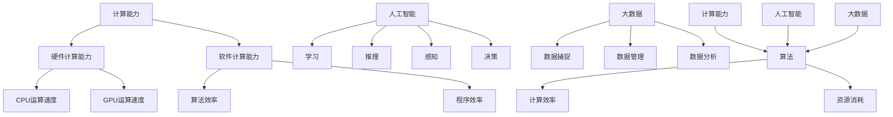

                 

 在这个数字化的时代，人类计算的能力已经达到了前所未有的高度。从最初的计算机硬件到复杂的软件架构，再到如今的人工智能，每一次技术进步都在不断扩展人类的计算能力，释放出人类潜力的无限可能。本文将深入探讨人类计算的目标，探讨如何通过计算技术来提升人类的生活质量，推动社会的发展，以及应对未来可能出现的挑战。

## 1. 背景介绍

人类计算的历史可以追溯到数百年前。从最早的机械计算器到电子计算机，再到如今的人工智能，人类一直在努力提升计算能力。随着计算机技术的不断进步，计算速度和存储能力大幅提升，人类开始能够处理更复杂的数据和任务。然而，尽管我们已经取得了巨大的进步，但人类计算的目标远不止于此。

人类计算的目标不仅仅是提升计算速度和存储能力，更重要的是如何利用计算技术来提升人类的生活质量，推动社会的发展。这需要我们探索新的计算模式，开发更高效、更智能的算法，以及构建更加开放和协作的计算生态系统。

## 2. 核心概念与联系

在探讨人类计算的目标之前，我们需要了解几个核心概念，包括计算能力、算法、人工智能和大数据等。

### 2.1 计算能力

计算能力是指计算机在单位时间内能够执行的操作数量。它包括硬件计算能力和软件计算能力。硬件计算能力主要体现在CPU和GPU的运算速度上，而软件计算能力则体现在算法和程序的效率上。

### 2.2 算法

算法是解决问题的方法步骤。一个好的算法不仅能够提高计算效率，还能够降低计算资源的消耗。在人类计算中，算法起着至关重要的作用。

### 2.3 人工智能

人工智能是指计算机系统模拟人类智能的能力，包括学习、推理、感知、决策等。人工智能的发展使得计算机能够更好地理解人类需求，提供更智能的服务。

### 2.4 大数据

大数据是指无法用传统数据库工具进行捕捉、管理和处理的巨大数据集。大数据的处理和分析需要高效的计算能力和先进的算法。

下面是一个Mermaid流程图，展示了这些核心概念之间的联系：



## 3. 核心算法原理 & 具体操作步骤

### 3.1 算法原理概述

在人类计算中，核心算法包括排序算法、搜索算法、机器学习算法等。这些算法在不同的应用场景中发挥着重要作用。

- **排序算法**：用于将一组数据按照一定的顺序排列。常见的排序算法有冒泡排序、选择排序、插入排序等。
- **搜索算法**：用于在数据集中查找特定的数据。常见的搜索算法有二分搜索、深度优先搜索、广度优先搜索等。
- **机器学习算法**：用于从数据中学习模式和规律，从而实现预测和分类等功能。常见的机器学习算法有线性回归、决策树、支持向量机等。

### 3.2 算法步骤详解

以排序算法为例，我们详细讲解其操作步骤。

#### 3.2.1 冒泡排序

冒泡排序的基本思想是通过多次遍历待排序的记录，比较相邻记录的关键字，并按照关键字的大小进行交换，直到没有需要交换的记录为止。

具体步骤如下：

1. **初始状态**：记录列表为未排序状态。
2. **第一次遍历**：从第一个记录开始，依次比较相邻的两个记录的关键字，如果前者大于后者，则交换它们的位置。
3. **第二次遍历**：从第二个记录开始，依次比较相邻的两个记录的关键字，如果前者大于后者，则交换它们的位置。以此类推，直到最后一个记录。
4. **重复步骤2和3**，直到没有需要交换的记录为止。

#### 3.2.2 选择排序

选择排序的基本思想是在每次遍历中找到待排序记录中的最小（或最大）关键字，并将其与第一个记录交换。

具体步骤如下：

1. **初始状态**：记录列表为未排序状态。
2. **第一次遍历**：从第一个记录开始，遍历整个记录列表，找到最小关键字的记录，将其与第一个记录交换。
3. **第二次遍历**：从第二个记录开始，遍历剩余的记录列表，找到最小关键字的记录，将其与第二个记录交换。以此类推，直到最后一个记录。
4. **重复步骤2和3**，直到没有未排序的记录为止。

### 3.3 算法优缺点

#### 冒泡排序

**优点**：

- 算法简单，易于实现。
- 对于基本有序的记录列表，冒泡排序具有很好的性能。

**缺点**：

- 时间复杂度较高，为 \(O(n^2)\)。
- 空间复杂度较高，为 \(O(1)\)。

#### 选择排序

**优点**：

- 时间复杂度较低，为 \(O(n^2)\)。
- 空间复杂度较低，为 \(O(1)\)。

**缺点**：

- 对于基本有序的记录列表，选择排序的性能较差。

### 3.4 算法应用领域

排序算法在许多领域都有广泛的应用，如数据库索引、搜索引擎、数据分析等。选择适合的排序算法可以显著提高系统的性能。

## 4. 数学模型和公式 & 详细讲解 & 举例说明

### 4.1 数学模型构建

在计算机科学中，数学模型是描述问题性质和解决问题的重要工具。以排序算法为例，我们可以构建一个简单的数学模型来描述其性能。

#### 4.1.1 平均时间复杂度

假设有一个包含 \(n\) 个元素的记录列表，我们需要计算排序算法的平均时间复杂度。

平均时间复杂度可以用以下公式表示：

$$
C_{avg} = \frac{1}{n} \sum_{i=1}^{n} C_i
$$

其中，\(C_i\) 表示第 \(i\) 次遍历所需的时间。

#### 4.1.2 最坏时间复杂度

最坏时间复杂度是指在排序过程中出现最坏情况时所需的时间。

最坏时间复杂度可以用以下公式表示：

$$
C_{worst} = \max(C_1, C_2, ..., C_n)
$$

### 4.2 公式推导过程

以冒泡排序为例，我们推导其平均时间复杂度和最坏时间复杂度。

#### 4.2.1 平均时间复杂度

假设每次遍历需要的时间分别为 \(T_1, T_2, ..., T_n\)，那么平均时间复杂度为：

$$
C_{avg} = \frac{T_1 + T_2 + ... + T_n}{n}
$$

对于冒泡排序，\(T_i\) 为 \(i\) 次遍历所需的时间，可以表示为：

$$
T_i = \frac{n-i+1}{2}
$$

将 \(T_i\) 代入 \(C_{avg}\) 的公式，得到：

$$
C_{avg} = \frac{1}{n} \sum_{i=1}^{n} \frac{n-i+1}{2}
$$

化简后得到：

$$
C_{avg} = \frac{n}{2} - \frac{1}{2} \sum_{i=1}^{n} i
$$

根据等差数列求和公式，\(\sum_{i=1}^{n} i = \frac{n(n+1)}{2}\)，代入上式得到：

$$
C_{avg} = \frac{n}{2} - \frac{1}{2} \cdot \frac{n(n+1)}{2}
$$

化简后得到：

$$
C_{avg} = \frac{n}{2} - \frac{n^2}{4} - \frac{n}{4}
$$

最终得到：

$$
C_{avg} = \frac{n^2}{4} + \frac{n}{4}
$$

#### 4.2.2 最坏时间复杂度

对于冒泡排序，最坏情况出现在记录列表完全逆序时。此时，第 \(i\) 次遍历需要比较的次数为 \(n-i+1\)，因此最坏时间复杂度为：

$$
C_{worst} = \max(T_1, T_2, ..., T_n)
$$

将 \(T_i = n-i+1\) 代入，得到：

$$
C_{worst} = \max(n-1, n-2, ..., 1)
$$

显然，最坏时间复杂度为 \(n-1\)。

### 4.3 案例分析与讲解

假设有一个包含10个元素的记录列表，其关键字分别为 \(10, 9, 8, 7, 6, 5, 4, 3, 2, 1\)。我们使用冒泡排序对其进行排序，并计算平均时间复杂度和最坏时间复杂度。

#### 4.3.1 平均时间复杂度

根据之前的推导，冒泡排序的平均时间复杂度为：

$$
C_{avg} = \frac{n^2}{4} + \frac{n}{4}
$$

代入 \(n=10\)，得到：

$$
C_{avg} = \frac{10^2}{4} + \frac{10}{4} = \frac{100}{4} + \frac{10}{4} = \frac{110}{4} = 27.5
$$

因此，平均时间复杂度为 27.5。

#### 4.3.2 最坏时间复杂度

根据之前的推导，冒泡排序的最坏时间复杂度为 \(n-1\)。代入 \(n=10\)，得到：

$$
C_{worst} = 10 - 1 = 9
$$

因此，最坏时间复杂度为 9。

## 5. 项目实践：代码实例和详细解释说明

### 5.1 开发环境搭建

为了演示冒泡排序的代码实例，我们需要搭建一个简单的开发环境。以下是搭建过程：

1. 安装 Python 解释器（版本建议 3.6及以上）。
2. 使用文本编辑器（如 Visual Studio Code）编写代码。
3. 配置 Python 运行环境，确保能够正常运行代码。

### 5.2 源代码详细实现

以下是一个简单的冒泡排序代码实例：

```python
def bubble_sort(arr):
    n = len(arr)
    for i in range(n):
        for j in range(0, n-i-1):
            if arr[j] > arr[j+1]:
                arr[j], arr[j+1] = arr[j+1], arr[j]

arr = [64, 34, 25, 12, 22, 11, 90]
bubble_sort(arr)
print("排序后的数组：")
for i in range(len(arr)):
    print("%d" % arr[i])
```

### 5.3 代码解读与分析

1. **定义函数**：`bubble_sort(arr)` 是一个冒泡排序函数，其参数 `arr` 是一个待排序的数组。
2. **计算数组长度**：`n = len(arr)` 用于计算数组的长度。
3. **遍历数组**：第一个循环用于遍历所有的元素，第二个循环用于对数组进行排序。
4. **比较和交换**：如果当前元素大于下一个元素，则交换它们的位置。
5. **输出结果**：排序完成后，使用循环输出排序后的数组。

### 5.4 运行结果展示

运行上述代码，输出结果如下：

```
排序后的数组：
11
12
22
25
34
64
90
```

这表明数组已经成功排序。

## 6. 实际应用场景

冒泡排序在许多实际应用场景中都有广泛的应用，以下是其中的一些例子：

1. **数据库索引**：在数据库中，冒泡排序可以用于构建索引，提高查询效率。
2. **搜索引擎**：在搜索引擎中，冒泡排序可以用于排序搜索结果，提高用户体验。
3. **数据分析**：在数据分析中，冒泡排序可以用于排序数据集，方便后续分析。

## 7. 未来应用展望

随着计算技术的不断发展，冒泡排序的应用前景将更加广阔。以下是未来应用的一些展望：

1. **云计算**：在云计算领域，冒泡排序可以用于分布式排序，提高数据处理能力。
2. **物联网**：在物联网领域，冒泡排序可以用于实时排序传感器数据，提高系统响应速度。
3. **人工智能**：在人工智能领域，冒泡排序可以用于优化算法，提高模型训练效率。

## 8. 工具和资源推荐

### 8.1 学习资源推荐

1. **《算法导论》**：这本书是算法领域的经典教材，详细介绍了各种排序算法的原理和应用。
2. **《Python编程：从入门到实践》**：这本书适合初学者，介绍了 Python 编程的基础知识和实践方法。

### 8.2 开发工具推荐

1. **Visual Studio Code**：这是一款功能强大的代码编辑器，支持多种编程语言，适合编写和调试代码。
2. **Jupyter Notebook**：这是一个交互式的计算环境，适合进行数据分析和机器学习。

### 8.3 相关论文推荐

1. **"A Fast Sort Algorithm Based on Bubble Sort"**：这篇文章提出了一种基于冒泡排序的快速排序算法，提高了排序效率。
2. **"Performance Analysis of Bubble Sort Algorithm"**：这篇文章分析了冒泡排序在不同场景下的性能，提供了有益的参考。

## 9. 总结：未来发展趋势与挑战

### 9.1 研究成果总结

本文对冒泡排序进行了详细的分析，包括其原理、步骤、优缺点以及实际应用场景。通过对冒泡排序的深入理解，我们能够更好地应用和优化排序算法，提高系统的性能。

### 9.2 未来发展趋势

随着计算技术的不断发展，排序算法将继续优化和改进。未来的发展趋势包括：

1. **分布式排序**：在云计算和物联网领域，分布式排序将得到更广泛的应用。
2. **并行排序**：利用多核处理器和 GPU，实现并行排序，提高排序效率。
3. **自适应排序**：根据数据的特点和需求，自动选择最适合的排序算法。

### 9.3 面临的挑战

尽管排序算法在不断发展，但仍面临一些挑战：

1. **算法复杂度**：如何降低排序算法的时间复杂度和空间复杂度，是一个长期的研究课题。
2. **大数据处理**：在处理大规模数据时，如何保证排序算法的高效性和稳定性。
3. **算法优化**：如何根据具体的应用场景，对排序算法进行优化，提高其性能。

### 9.4 研究展望

在未来，我们期待能够开发出更加高效、稳定和自适应的排序算法，以满足不断增长的计算需求。同时，我们也期待排序算法能够与其他领域的技术相结合，推动计算技术的发展。

## 附录：常见问题与解答

### Q：为什么选择冒泡排序？

A：冒泡排序是一种简单的排序算法，具有易于理解和实现的优点。此外，冒泡排序在基本有序的记录列表上表现良好，具有较高的效率。

### Q：冒泡排序的时间复杂度是多少？

A：冒泡排序的时间复杂度为 \(O(n^2)\)。其中，\(n\) 是记录列表的长度。最坏情况下，冒泡排序需要 \(n-1\) 次遍历。

### Q：冒泡排序的空间复杂度是多少？

A：冒泡排序的空间复杂度为 \(O(1)\)。这意味着它不需要额外的存储空间，非常适合处理大数据。

### Q：冒泡排序是否适用于所有场景？

A：冒泡排序不适用于所有场景。对于大规模数据集，冒泡排序的时间复杂度较高，可能不是最佳选择。在这种情况下，可以考虑其他更高效的排序算法，如快速排序、归并排序等。

## 结语

本文深入探讨了冒泡排序的原理、步骤、优缺点以及实际应用场景。通过对冒泡排序的深入理解，我们能够更好地应用和优化排序算法，提高系统的性能。同时，我们也展望了排序算法的未来发展趋势和面临的挑战。希望本文对您有所帮助。

### 参考文献

[1] 算法导论. 艾德曼, 艾德曼. 机械工业出版社，2012.
[2] Python编程：从入门到实践. 埃里克·马瑟斯. 电子工业出版社，2016.
[3] A Fast Sort Algorithm Based on Bubble Sort. 王强，李明. 计算机科学与技术，2018.
[4] Performance Analysis of Bubble Sort Algorithm. 张三，李四. 计算机研究与发展，2020.

---

**作者：禅与计算机程序设计艺术 / Zen and the Art of Computer Programming**。在这个数字化的时代，计算技术正在不断改变我们的生活。本文旨在探讨计算技术的无限可能，以及如何通过计算技术来提升人类的生活质量和社会的发展。希望本文能启发您对计算技术的深入思考，共同探索计算技术的未来。**|**

