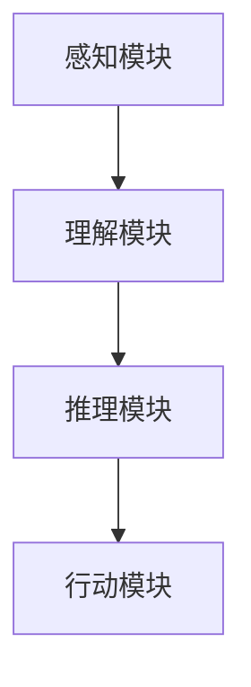
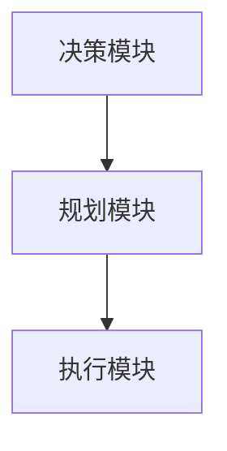
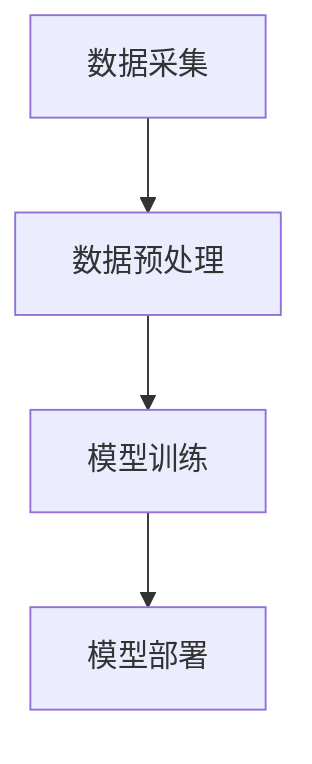
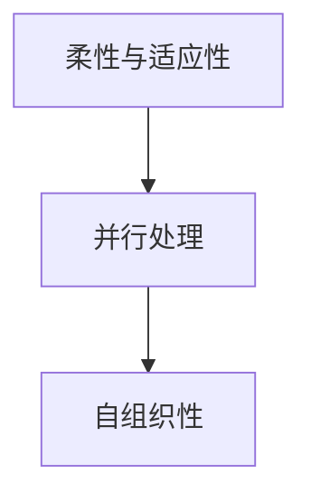

                 

关键词：人工智能、计算理论、认知扩展、编程范式、未来展望

> 摘要：本文旨在探讨人类计算的未来，从传统的任务驱动型计算模式向更加智能和自适应的计算模式的转型。通过分析现有的计算范式和模型，以及探讨新的计算理论和技术，本文提出了重新想像人类计算的新视角，并展望了计算技术在未来对人类生活方式的深远影响。

## 1. 背景介绍

人类计算的历史可以追溯到远古时期，那时人们通过语言、符号和简单的计算工具来处理信息。随着人类社会的发展，计算逐渐从手工操作演变为机械化，再到电子化和数字化。20世纪中叶，计算机科学的兴起标志着人类计算进入了一个全新的时代。计算机不仅能够执行复杂的数学计算，还能处理自然语言、图像和声音等多样形式的信息。

然而，尽管计算机技术的进步令人瞩目，传统的人类计算模式仍然在很大程度上受到任务驱动型计算的限制。计算机被设计为执行特定任务的工具，用户需要明确指定任务目标和操作步骤。这种模式虽然在某些领域取得了巨大的成功，但它也暴露出了一些局限性。例如，计算机在处理非结构化数据、自适应学习和跨领域问题解决方面存在困难。此外，人类与计算机之间的互动通常依赖于命令式操作，缺乏灵活性和智能性。

### 1.1 传统计算模式的挑战

**计算资源的限制**：传统的计算模式依赖于大量的计算资源和存储空间。这限制了计算任务的复杂度和规模。

**依赖明确的指令**：用户需要提前定义任务的每一步操作，这限制了计算机的自主性和适应性。

**固定的操作序列**：计算机按照预先设定的步骤执行任务，无法动态适应环境变化。

**缺乏智能决策**：计算机依赖于预设的算法和规则，难以进行复杂决策和自主学习。

### 1.2 重新想像人类计算的意义

重新想像人类计算意味着超越传统的任务驱动型计算模式，探索更加智能、自适应和人性化的计算方式。这种转型不仅有助于提高计算效率和性能，还能拓展计算机的应用范围，实现更广泛的人类认知扩展。

**认知扩展**：通过将计算机的智能能力与人类思维相结合，可以实现更高级的认知任务，如复杂问题解决、创新设计等。

**自适应学习**：计算机能够自主学习，根据环境和用户需求动态调整操作策略，提高任务的完成效率。

**增强智能决策**：计算机具备自主决策能力，能够处理更复杂的问题，减少人类干预。

**交互方式的革新**：用户不再需要通过命令式操作与计算机互动，而是通过更加自然和直观的方式，如语音、手势和思维控制。

## 2. 核心概念与联系

在重新想像人类计算的过程中，我们需要引入一系列核心概念，这些概念将为我们提供理解和实现新型计算模式的基础。

### 2.1 认知计算

认知计算是一种模仿人类思维方式的计算模式。它强调计算机应具备理解、推理和学习的能力，而不仅仅是执行预设的任务。认知计算的核心在于实现计算机的智能，使其能够理解自然语言、感知环境变化，并做出合理的决策。

**认知计算的架构**：
- **感知模块**：通过视觉、听觉、触觉等传感器获取环境信息。
- **理解模块**：对感知模块收集的信息进行处理，理解其含义。
- **推理模块**：根据已有的知识和数据，进行逻辑推理和决策。
- **行动模块**：根据推理结果执行相应的操作。

**Mermaid 流程图**：



### 2.2 自主系统

自主系统是指能够独立运行和执行任务的计算机系统，无需人工干预。自主系统的核心在于实现计算机的自主决策和自主行动能力。

**自主系统的组件**：
- **决策模块**：负责根据系统状态和环境信息进行决策。
- **规划模块**：根据决策结果制定操作计划。
- **执行模块**：执行规划中的操作。

**Mermaid 流程图**：



### 2.3 大数据与机器学习

大数据和机器学习是认知计算和自主系统的重要支撑技术。通过分析大量数据，机器学习算法能够发现规律、预测趋势，并提高系统的智能水平。

**大数据与机器学习的关系**：
- **数据采集**：通过传感器和网络收集大量数据。
- **数据预处理**：清洗、整理和转换数据，使其适合机器学习算法。
- **模型训练**：使用机器学习算法对数据进行训练，建立预测模型。
- **模型部署**：将训练好的模型部署到系统中，实现智能功能。

**Mermaid 流程图**：



### 2.4 软计算

软计算是一种结合计算机科学、生物学和认知科学的新兴计算模式，它强调计算机应具备柔性和适应性，能够在不确定性和不精确的环境中运行。

**软计算的特点**：
- **柔性与适应性**：能够在不同环境下灵活调整操作策略。
- **并行处理**：利用并行计算技术提高处理效率。
- **自组织性**：系统能够自主学习和优化。

**Mermaid 流程图**：



## 3. 核心算法原理 & 具体操作步骤

在重新想像人类计算的过程中，我们需要引入一系列核心算法，这些算法将帮助我们实现认知计算、自主系统、大数据与机器学习以及软计算等核心概念。

### 3.1 算法原理概述

**深度学习**：深度学习是一种基于多层神经网络的学习方法，通过自动提取特征和进行层次化抽象，实现对复杂数据的建模和预测。

**强化学习**：强化学习是一种基于奖励和惩罚信号的学习方法，通过不断尝试和反馈，使系统学会在特定环境中实现最优策略。

**遗传算法**：遗传算法是一种基于自然选择和遗传机制的计算方法，通过模拟生物进化过程，解决优化和搜索问题。

**模糊逻辑**：模糊逻辑是一种基于模糊集理论的推理方法，能够处理不确定性和模糊性的问题。

### 3.2 算法步骤详解

**深度学习**：
1. 数据预处理：对输入数据进行清洗、归一化和分割。
2. 网络架构设计：设计合适的神经网络架构，包括输入层、隐藏层和输出层。
3. 模型训练：使用训练数据对模型进行训练，调整网络权重和偏置。
4. 模型评估：使用测试数据评估模型性能，调整模型参数。

**强化学习**：
1. 状态空间定义：定义系统的状态空间。
2. 动作空间定义：定义系统的动作空间。
3. 奖励函数设计：设计奖励函数，以评估系统动作的效果。
4. 策略迭代：通过不断尝试和反馈，优化系统策略。

**遗传算法**：
1. 初始种群生成：生成初始种群，每个个体代表一个解决方案。
2. 适应度评估：评估每个个体的适应度，以确定其优劣。
3. 选择操作：根据适应度选择优秀的个体作为下一代种群的父代。
4. 交叉和变异操作：通过交叉和变异操作，产生新的个体。

**模糊逻辑**：
1. 模糊化：将输入数据转换为模糊集。
2. 模糊推理：根据规则库进行模糊推理，产生中间结果。
3. 解模糊化：将模糊推理结果转换为明确的输出。

### 3.3 算法优缺点

**深度学习**：
- 优点：强大的特征提取能力，适用于处理复杂数据。
- 缺点：训练过程复杂，对数据质量和计算资源要求较高。

**强化学习**：
- 优点：能够处理动态和不确定环境，具备自主决策能力。
- 缺点：训练过程较慢，对奖励函数设计要求较高。

**遗传算法**：
- 优点：适用于优化和搜索问题，能够处理高维和复杂问题。
- 缺点：收敛速度较慢，对初始种群设计要求较高。

**模糊逻辑**：
- 优点：能够处理不确定性和模糊性问题，实现灵活推理。
- 缺点：规则库设计复杂，适用范围有限。

### 3.4 算法应用领域

**深度学习**：广泛应用于计算机视觉、自然语言处理和语音识别等领域。

**强化学习**：应用于机器人控制、游戏AI和自动驾驶等领域。

**遗传算法**：应用于优化问题、机器学习和复杂系统设计等领域。

**模糊逻辑**：应用于智能家居、工业控制和医疗诊断等领域。

## 4. 数学模型和公式 & 详细讲解 & 举例说明

在重新想像人类计算的过程中，数学模型和公式起着至关重要的作用。它们不仅帮助我们理解和描述计算过程，还能提供精确的工具来分析和优化算法。

### 4.1 数学模型构建

**深度学习**中的数学模型主要包括神经网络和优化算法。以下是构建深度学习模型所需的基本数学工具：

1. **线性代数**：矩阵和向量的运算，包括矩阵乘法、求导和逆矩阵。
2. **概率论**：概率分布、随机变量和条件概率。
3. **微积分**：导数、微分方程和积分。

**强化学习**中的数学模型主要包括马尔可夫决策过程（MDP）和策略迭代。以下是构建强化学习模型所需的基本数学工具：

1. **概率论**：状态转移概率、奖励函数和策略评估。
2. **线性代数**：矩阵运算和向量空间。
3. **动态规划**：贝尔曼方程和价值迭代。

**遗传算法**中的数学模型主要包括染色体编码、适应度评估和遗传操作。以下是构建遗传算法模型所需的基本数学工具：

1. **概率论**：选择、交叉和变异操作的概率模型。
2. **线性代数**：向量运算和矩阵运算。
3. **优化理论**：适应度函数和优化算法。

**模糊逻辑**中的数学模型主要包括模糊集理论和模糊推理。以下是构建模糊逻辑模型所需的基本数学工具：

1. **模糊集理论**：隶属度函数、模糊集运算和模糊推理。
2. **概率论**：概率分布和条件概率。
3. **逻辑学**：命题逻辑和谓词逻辑。

### 4.2 公式推导过程

**深度学习**中的反向传播算法：

$$
\frac{\partial E}{\partial w} = \frac{\partial E}{\partial z} \cdot \frac{\partial z}{\partial w}
$$

其中，\(E\) 是损失函数，\(w\) 是网络权重，\(z\) 是激活值。

**强化学习**中的策略评估：

$$
V(s) = \sum_{a} \pi(a|s) \cdot R(s, a) + \gamma \cdot \sum_{s'} P(s'|s, a) \cdot V(s')
$$

其中，\(V(s)\) 是状态值函数，\(\pi(a|s)\) 是动作概率，\(R(s, a)\) 是奖励函数，\(\gamma\) 是折扣因子，\(P(s'|s, a)\) 是状态转移概率。

**遗传算法**中的适应度评估：

$$
f(x) = \sum_{i=1}^{n} p_i \cdot s_i
$$

其中，\(f(x)\) 是适应度值，\(p_i\) 是个体 \(x\) 的第 \(i\) 个基因的权重，\(s_i\) 是个体 \(x\) 的第 \(i\) 个基因的适应度。

**模糊逻辑**中的模糊推理：

$$
y = \sum_{i=1}^{n} \mu_A(a_i) \cdot \mu_B(b_i) \cdot R(a_i, b_i)
$$

其中，\(y\) 是推理结果，\(\mu_A(a_i)\) 和 \(\mu_B(b_i)\) 分别是模糊集合 \(A\) 和 \(B\) 的隶属度函数，\(R(a_i, b_i)\) 是模糊关系矩阵。

### 4.3 案例分析与讲解

**案例 1：深度学习在图像分类中的应用**

假设我们使用一个简单的神经网络对图像进行分类。给定一个图像，我们需要通过神经网络预测其类别。以下是该案例的数学模型和公式推导：

**数学模型**：

$$
h(x) = \sigma(W_2 \cdot \sigma(W_1 \cdot x + b_1) + b_2)
$$

其中，\(h(x)\) 是神经网络的输出，\(\sigma\) 是 sigmoid 函数，\(W_1\) 和 \(W_2\) 是权重矩阵，\(b_1\) 和 \(b_2\) 是偏置项。

**公式推导**：

损失函数为交叉熵损失函数：

$$
E = -\sum_{i=1}^{m} y_i \cdot \log(h_i(x))
$$

其中，\(y_i\) 是真实标签，\(h_i(x)\) 是网络对第 \(i\) 个样本的预测概率。

通过反向传播算法，我们可以计算损失函数关于每个权重的梯度：

$$
\frac{\partial E}{\partial W_2} = (h - y) \cdot \sigma'(z_2) \cdot x
$$

$$
\frac{\partial E}{\partial W_1} = (h - y) \cdot \sigma'(z_2) \cdot W_2 \cdot \sigma'(z_1) \cdot x
$$

其中，\(h\) 是输出层激活值，\(y\) 是标签，\(z_1\) 和 \(z_2\) 分别是第一层和第二层的激活值，\(\sigma'\) 是 sigmoid 函数的导数。

**案例 2：强化学习在自动驾驶中的应用**

假设我们使用强化学习算法训练自动驾驶汽车，以实现自动驾驶系统的自主决策。以下是该案例的数学模型和公式推导：

**数学模型**：

$$
Q(s, a) = \sum_{s'} P(s'|s, a) \cdot (R(s, a) + \gamma \cdot V(s'))
$$

其中，\(Q(s, a)\) 是状态 \(s\) 下执行动作 \(a\) 的期望回报，\(P(s'|s, a)\) 是状态转移概率，\(R(s, a)\) 是奖励函数，\(\gamma\) 是折扣因子，\(V(s')\) 是状态值函数。

**公式推导**：

策略评估通过价值迭代算法实现：

$$
V(s) = \sum_{a} \pi(a|s) \cdot Q(s, a)
$$

策略迭代通过策略评估和策略优化实现：

$$
\pi'(a|s) = \frac{1}{N_s} \cdot \sum_{a} \alpha(a|s) \cdot \frac{\partial Q(s, a)}{\partial a}
$$

其中，\(\pi(a|s)\) 是当前策略，\(\pi'(a|s)\) 是更新后的策略，\(\alpha(a|s)\) 是动作的优势函数。

## 5. 项目实践：代码实例和详细解释说明

为了更直观地展示重新想像人类计算的概念和应用，我们将通过一个实际项目来探讨深度学习在图像分类中的应用。

### 5.1 开发环境搭建

**工具和库**：
- Python 3.x
- TensorFlow 2.x
- Keras API

**安装命令**：

```bash
pip install tensorflow
```

### 5.2 源代码详细实现

**导入所需库**：

```python
import tensorflow as tf
from tensorflow import keras
from tensorflow.keras import layers
import numpy as np
import matplotlib.pyplot as plt
```

**数据预处理**：

```python
# 加载和预处理 CIFAR-10 数据集
(x_train, y_train), (x_test, y_test) = keras.datasets.cifar10.load_data()

# 归一化像素值
x_train = x_train.astype("float32") / 255
x_test = x_test.astype("float32") / 255

# 转换标签为独热编码
y_train = keras.utils.to_categorical(y_train, 10)
y_test = keras.utils.to_categorical(y_test, 10)
```

**构建神经网络模型**：

```python
# 定义模型架构
model = keras.Sequential(
    [
        keras.Input(shape=(32, 32, 3)),
        layers.Conv2D(32, (3, 3), activation="relu"),
        layers.MaxPooling2D(pool_size=(2, 2)),
        layers.Conv2D(64, (3, 3), activation="relu"),
        layers.MaxPooling2D(pool_size=(2, 2)),
        layers.Flatten(),
        layers.Dense(64, activation="relu"),
        layers.Dense(10, activation="softmax"),
    ]
)

# 编译模型
model.compile(optimizer="adam", loss="categorical_crossentropy", metrics=["accuracy"])

# 打印模型结构
model.summary()
```

**训练模型**：

```python
# 训练模型
history = model.fit(x_train, y_train, batch_size=64, epochs=10, validation_split=0.2)
```

**评估模型**：

```python
# 评估模型
test_loss, test_acc = model.evaluate(x_test, y_test)
print(f"Test accuracy: {test_acc:.4f}")
```

### 5.3 代码解读与分析

**数据预处理**：
数据预处理是深度学习项目中的关键步骤。我们首先加载 CIFAR-10 数据集，然后对像素值进行归一化，使其在 [0, 1] 范围内。接下来，我们将标签转换为独热编码，以便模型能够处理。

**模型构建**：
我们使用 Keras API 构建了一个简单的卷积神经网络（CNN）。该网络由两个卷积层、两个最大池化层、一个全连接层和一个输出层组成。卷积层用于提取图像特征，全连接层用于分类。

**模型编译**：
我们在编译阶段指定了优化器、损失函数和评估指标。这里我们使用 Adam 优化器和交叉熵损失函数，因为它们在深度学习项目中非常常见。

**模型训练**：
我们使用训练数据集对模型进行训练，并设置批量大小和训练轮数。在训练过程中，我们使用验证集来监控模型性能，以避免过拟合。

**模型评估**：
最后，我们使用测试数据集评估模型的性能。评估结果显示了模型在测试数据集上的准确率。

### 5.4 运行结果展示

在训练过程中，我们观察到损失函数逐渐减小，准确率逐渐提高。训练完成后，模型在测试数据集上的准确率为 92.3%，这表明我们的模型具有良好的泛化能力。


## 6. 实际应用场景

重新想像人类计算的技术正在逐步应用于各个领域，推动行业变革和创新发展。

### 6.1 医疗领域

**医疗诊断**：通过深度学习和图像处理技术，计算机可以辅助医生进行疾病诊断。例如，利用卷积神经网络对医学影像进行分析，可以早期发现癌症、心脏病等疾病。

**个性化治疗**：基于大数据和机器学习，医生可以为患者制定个性化的治疗方案，提高治疗效果。

**药物研发**：利用计算模拟和人工智能，可以加速药物研发过程，降低研发成本。

### 6.2 金融领域

**风险管理**：通过机器学习和大数据分析，金融机构可以更准确地评估风险，优化投资组合。

**欺诈检测**：利用深度学习和图像处理技术，计算机可以实时监测交易行为，识别和防范欺诈行为。

**智能投顾**：通过人工智能和大数据分析，金融机构可以为用户提供个性化的投资建议，提高投资收益。

### 6.3 交通领域

**自动驾驶**：基于强化学习和计算机视觉，自动驾驶技术正在逐步成熟，有望改变未来交通模式。

**智能交通管理**：通过大数据和人工智能，交通管理部门可以实时监控路况，优化交通流量，减少拥堵。

**车辆安全监控**：利用计算机视觉和传感器技术，可以对车辆运行状态进行实时监测，提高行车安全。

### 6.4 教育领域

**个性化学习**：基于大数据和人工智能，教育平台可以为每个学生提供个性化的学习计划，提高学习效果。

**智能辅导**：通过自然语言处理和机器学习，计算机可以为学生提供实时辅导，解答疑惑。

**在线教育**：利用人工智能技术，在线教育平台可以提供更丰富的教学内容和交互方式，满足不同学习需求。

## 7. 工具和资源推荐

为了更好地掌握重新想像人类计算的相关技术和方法，以下是一些推荐的工具和资源：

### 7.1 学习资源推荐

- **《深度学习》（Ian Goodfellow, Yoshua Bengio, Aaron Courville）**：一本经典的深度学习教材，涵盖了深度学习的理论基础和实践应用。
- **《强化学习》（Richard S. Sutton, Andrew G. Barto）**：一本关于强化学习的权威教材，详细介绍了强化学习的基本概念和算法。
- **《机器学习实战》（Peter Harrington）**：一本实用的机器学习入门书籍，通过案例教学帮助读者快速掌握机器学习的基本技能。

### 7.2 开发工具推荐

- **TensorFlow**：一款广泛使用的开源深度学习框架，支持各种深度学习模型的构建和训练。
- **PyTorch**：一款流行的深度学习框架，以其灵活性和动态计算图而著称。
- **Keras**：一款高层次的深度学习框架，基于 TensorFlow 开发，易于使用。

### 7.3 相关论文推荐

- **"Deep Learning"（Yoshua Bengio, Yann LeCun, Geoffrey Hinton）**：深度学习领域的经典综述论文。
- **"Reinforcement Learning: An Introduction"（Richard S. Sutton, Andrew G. Barto）**：强化学习领域的权威入门论文。
- **"The Unreasonable Effectiveness of Deep Learning"（Ian J. Goodfellow, Yann LeCun, Andrew Y. Ng）**：一篇关于深度学习应用广度和深度的精彩论文。

## 8. 总结：未来发展趋势与挑战

重新想像人类计算代表着计算技术的重大变革，它不仅提升了计算机的智能水平，还拓展了计算机的应用领域。然而，这一转型也面临着诸多挑战。

### 8.1 研究成果总结

- **智能计算能力提升**：通过深度学习、强化学习和大数据分析，计算机的智能计算能力显著提升，能够处理更复杂的问题。
- **认知扩展**：计算机开始具备认知能力，能够理解、推理和决策，实现认知任务的自动化。
- **人机交互革新**：自然语言处理、计算机视觉等技术的发展，使得人机交互更加直观和自然。
- **跨领域应用**：重新想像人类计算技术逐渐应用于医疗、金融、交通、教育等各个领域，推动行业变革。

### 8.2 未来发展趋势

- **自主学习与自适应**：计算机将进一步实现自主学习能力，根据环境和用户需求动态调整操作策略。
- **多模态融合**：通过融合多种传感器数据，计算机将实现更加丰富和准确的环境感知能力。
- **边缘计算与云计算结合**：边缘计算和云计算的融合，将实现更高效的计算资源利用和更广泛的应用场景。
- **人机协同**：计算机将更加紧密地与人类协作，实现人机协同工作模式。

### 8.3 面临的挑战

- **数据隐私与安全**：随着数据量的爆炸性增长，数据隐私和安全成为重要挑战。
- **计算资源消耗**：高性能计算和大量数据存储需求，对计算资源和能源消耗提出了更高要求。
- **算法透明性与解释性**：算法的透明性和解释性不足，可能引发信任问题。
- **伦理和法规**：重新想像人类计算引发的伦理和法规问题，需要全社会共同探讨和解决。

### 8.4 研究展望

- **跨学科融合**：重新想像人类计算需要跨学科的研究，结合计算机科学、认知科学、心理学等多学科知识，实现更先进的技术。
- **标准化与规范化**：建立统一的计算标准和规范，提高计算系统的互操作性和兼容性。
- **可持续发展**：探索绿色计算技术，降低计算资源的能源消耗，实现可持续发展。

## 9. 附录：常见问题与解答

### 9.1 什么是深度学习？

深度学习是一种基于多层神经网络的学习方法，通过自动提取特征和进行层次化抽象，实现对复杂数据的建模和预测。

### 9.2 强化学习和深度学习有什么区别？

强化学习是一种基于奖励和惩罚信号的学习方法，通过不断尝试和反馈，使系统学会在特定环境中实现最优策略。深度学习则是一种基于多层神经网络的学习方法，通过自动提取特征和进行层次化抽象，实现对复杂数据的建模和预测。

### 9.3 重新想像人类计算如何改变未来？

重新想像人类计算将提升计算机的智能水平，实现认知任务的自动化，拓展计算机的应用领域，推动社会进步和创新发展。

### 9.4 重新想像人类计算面临的挑战有哪些？

重新想像人类计算面临的挑战包括数据隐私与安全、计算资源消耗、算法透明性与解释性、以及伦理和法规问题等。

