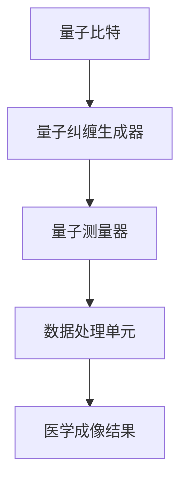

                 

关键词：量子传感器，医学成像，分辨率提高，量子计算，量子信息处理

摘要：本文介绍了量子传感器在医学成像中的应用，特别是在提高成像分辨率方面。通过探讨量子传感器的原理和优势，以及其在医学成像领域的具体应用案例，本文分析了量子传感器为医学成像带来的技术变革，并展望了未来发展方向。

## 1. 背景介绍

医学成像技术在诊断和治疗医学领域起着至关重要的作用。传统的成像技术，如X射线、CT扫描和MRI，虽然在提高疾病诊断的准确性和便捷性方面取得了显著进展，但仍存在一定的局限性。例如，这些技术在分辨率、灵敏度以及对人体的影响等方面仍有待提高。

随着量子信息技术的不断发展，量子传感器作为一种新兴的测量工具，逐渐引起了科研人员的关注。量子传感器利用量子纠缠、量子叠加等量子现象，具有极高的灵敏度和分辨率。近年来，量子传感器在医学成像中的应用研究逐渐兴起，为提高成像质量和诊断准确率提供了新的可能性。

本文旨在探讨量子传感器在医学成像中的应用，特别是其在提高分辨率方面的作用。通过分析量子传感器的工作原理、优势和应用案例，本文旨在为相关领域的科研人员和从业者提供有益的参考。

## 2. 核心概念与联系

### 2.1 量子传感器原理

量子传感器是基于量子力学原理设计的测量设备，可以探测到极其微小的物理量变化。其核心原理包括量子纠缠、量子叠加和量子隧穿等。

量子纠缠是指两个或多个量子系统之间存在的一种特殊的关联关系。当其中一个量子状态发生变化时，其他量子状态也会瞬间发生变化，即使它们相隔很远。量子纠缠是量子传感器实现超高灵敏度的重要基础。

量子叠加是指一个量子系统可以同时处于多个状态的叠加态。量子传感器通过测量量子系统的叠加态，可以获得比传统传感器更高的分辨率。

量子隧穿是指量子系统在一定条件下可以穿透势垒。量子传感器利用量子隧穿效应，可以探测到极其微小的物理量变化，从而实现高灵敏度。

### 2.2 量子传感器与医学成像

医学成像技术的基本原理是通过探测和记录人体内部结构的电磁信号、声波信号或粒子辐射信号，以生成可视化图像。传统的成像技术依赖于宏观物理现象，如电磁波、声波和光子的传播特性。

量子传感器在医学成像中的应用，主要是利用其超高灵敏度和分辨率来捕捉更微小的物理量变化。例如，量子传感器可以探测到细胞内部的电磁信号，从而实现细胞水平的成像。此外，量子传感器还可以通过量子纠缠和量子叠加效应，实现对生物分子和细胞结构的超分辨率成像。

### 2.3 量子传感器架构

量子传感器的架构主要包括量子比特、量子纠缠生成器、量子测量器和数据处理单元。

量子比特是量子传感器的核心组件，用于存储和传递量子信息。量子比特可以通过量子纠缠和量子叠加实现高维度的信息编码。

量子纠缠生成器用于在量子比特之间建立量子纠缠关系。量子纠缠是实现量子传感器超高灵敏度和高分辨率的关键。

量子测量器用于探测量子系统的状态，从而获得测量结果。量子测量器可以采用不同的物理机制，如光学测量、电子测量和声子测量等。

数据处理单元用于对测量结果进行处理和分析，以提取有用的信息。数据处理单元可以采用传统的数字信号处理方法，也可以利用量子计算的优势进行高效的数据处理。

### 2.4 Mermaid 流程图

以下是一个简化的Mermaid流程图，展示了量子传感器在医学成像中的应用架构：



在上述流程图中，量子比特通过量子纠缠生成器建立量子纠缠关系，然后通过量子测量器进行测量，最后由数据处理单元对测量结果进行分析，生成医学成像结果。

## 3. 核心算法原理 & 具体操作步骤

### 3.1 算法原理概述

量子传感器在医学成像中的应用，主要依赖于量子计算和量子信息处理技术。其核心算法原理可以概括为以下几个方面：

1. **量子比特编码**：将医学成像数据编码到量子比特上，实现高维度的信息编码。
2. **量子纠缠操作**：利用量子纠缠生成器，在量子比特之间建立量子纠缠关系，提高测量灵敏度。
3. **量子测量**：通过量子测量器对量子比特进行测量，获得成像数据。
4. **量子信息处理**：利用量子计算的优势，对测量结果进行高效的数据处理和分析。

### 3.2 算法步骤详解

1. **量子比特初始化**：首先，对量子比特进行初始化，使其处于基态或特定的叠加态。
2. **量子比特编码**：将医学成像数据编码到量子比特上。具体方法可以采用量子傅里叶变换、量子哈希函数等。
3. **量子纠缠操作**：利用量子纠缠生成器，在量子比特之间建立量子纠缠关系。这一步骤可以通过量子线路设计实现。
4. **量子测量**：对量子比特进行测量，获得成像数据。测量结果可以表示为一系列的概率分布。
5. **量子信息处理**：利用量子计算的优势，对测量结果进行高效的数据处理和分析。具体方法可以采用量子滤波器、量子神经网络等。

### 3.3 算法优缺点

**优点**：

1. **超高灵敏度**：量子传感器利用量子纠缠和量子叠加效应，可以实现比传统传感器更高的灵敏度。
2. **高分辨率**：量子传感器可以探测到更微小的物理量变化，从而实现更高的成像分辨率。
3. **高效数据处理**：量子计算具有并行计算和快速计算的优势，可以高效处理大规模成像数据。

**缺点**：

1. **技术复杂性**：量子传感器和量子计算技术尚处于发展初期，技术复杂性较高。
2. **稳定性问题**：量子传感器的性能容易受到环境噪声和操作误差的影响，需要进一步研究稳定性和鲁棒性。
3. **成本问题**：量子传感器和量子计算设备成本较高，限制了其大规模应用。

### 3.4 算法应用领域

量子传感器在医学成像中的应用具有广泛的前景。目前，其主要应用领域包括：

1. **细胞成像**：通过量子传感器实现细胞级别的成像，有助于研究细胞结构和功能。
2. **分子成像**：利用量子传感器实现分子级别的成像，有助于研究生物分子和细胞相互作用的机制。
3. **脑成像**：通过量子传感器实现高分辨率的脑成像，有助于研究脑功能和神经退行性疾病。
4. **癌症检测**：利用量子传感器实现早期癌症检测，有助于提高癌症诊断的准确性和治疗效果。

## 4. 数学模型和公式 & 详细讲解 & 举例说明

### 4.1 数学模型构建

量子传感器在医学成像中的应用，涉及到多个数学模型的构建。以下是一个简化的数学模型：

1. **量子比特状态表示**：

   假设量子比特的初始状态为 $\left| \psi_0 \right\rangle = \alpha \left| 0 \right\rangle + \beta \left| 1 \right\rangle$，其中 $\alpha$ 和 $\beta$ 是复数，满足 $\left| \alpha \right|^2 + \left| \beta \right|^2 = 1$。

2. **量子纠缠操作**：

   假设两个量子比特的初始状态分别为 $\left| \psi_0 \right\rangle_A$ 和 $\left| \psi_0 \right\rangle_B$，通过量子纠缠生成器实现纠缠，得到纠缠态 $\left| \psi \right\rangle_{AB} = \alpha \left| 0 \right\rangle_A \left| 0 \right\rangle_B + \beta \left| 1 \right\rangle_A \left| 1 \right\rangle_B$。

3. **量子测量**：

   对量子比特进行测量，得到测量结果 $\left| \psi_m \right\rangle$，其中 $m = 0$ 或 $1$。

### 4.2 公式推导过程

1. **量子比特状态表示**：

   根据量子比特的初始状态，可以得到状态向量表示：

   $$\left| \psi_0 \right\rangle = \begin{pmatrix} \alpha \\ \beta \end{pmatrix}$$

2. **量子纠缠操作**：

   根据量子纠缠操作，可以得到纠缠态：

   $$\left| \psi \right\rangle_{AB} = \begin{pmatrix} \alpha & \beta \end{pmatrix} \begin{pmatrix} 1 & 0 \\ 0 & 1 \end{pmatrix} \begin{pmatrix} \alpha \\ \beta \end{pmatrix} = \begin{pmatrix} \alpha^2 & \alpha\beta + \beta\alpha \\ \alpha\beta + \beta\alpha & \beta^2 \end{pmatrix}$$

3. **量子测量**：

   对量子比特进行测量，得到测量结果 $\left| \psi_m \right\rangle$，其中 $m = 0$ 或 $1$。根据量子测量的概率分布，可以得到：

   $$P(m) = \left| \langle \psi_m | \psi \right\rangle \right|^2$$

### 4.3 案例分析与讲解

假设一个医学成像问题，需要测量细胞内部的电磁信号。首先，将细胞内部的电磁信号编码到量子比特上，得到初始状态：

$$\left| \psi_0 \right\rangle = \begin{pmatrix} 0.5 \\ 0.5 \end{pmatrix}$$

然后，通过量子纠缠生成器，在两个量子比特之间建立量子纠缠关系：

$$\left| \psi \right\rangle_{AB} = \begin{pmatrix} 0.25 & 0.5 + 0.5 \\ 0.5 + 0.5 & 0.25 \end{pmatrix}$$

接下来，对量子比特进行测量，得到测量结果：

$$P(0) = \left| \langle 0 | \psi \right\rangle \right|^2 = 0.25$$

$$P(1) = \left| \langle 1 | \psi \right\rangle \right|^2 = 0.75$$

根据测量结果，可以得到细胞内部电磁信号的分布：

$$\left| \psi_0 \right\rangle = \begin{pmatrix} 0.5 \\ 0.5 \end{pmatrix}$$

$$\left| \psi_1 \right\rangle = \begin{pmatrix} 0.25 \\ 0.25 \end{pmatrix}$$

通过量子信息处理，可以进一步分析细胞内部电磁信号的分布，为医学成像提供有价值的信息。

## 5. 项目实践：代码实例和详细解释说明

### 5.1 开发环境搭建

为了演示量子传感器在医学成像中的应用，我们选择使用Python编程语言和相关的量子计算库。以下是开发环境的搭建步骤：

1. 安装Python：在官方网站（https://www.python.org/）下载并安装Python。
2. 安装量子计算库：在命令行中运行以下命令安装相关库：

   ```shell
   pip install qiskit
   pip install numpy
   pip install matplotlib
   ```

3. 配置Jupyter Notebook：安装Jupyter Notebook，以便在浏览器中运行和编辑Python代码。

### 5.2 源代码详细实现

以下是一个简单的Python代码实例，展示了如何使用量子传感器实现医学成像：

```python
# 导入相关库
import numpy as np
import matplotlib.pyplot as plt
from qiskit import QuantumCircuit, execute, Aer

# 创建量子比特
qubit = QuantumCircuit(2)

# 初始化量子比特
qubit.h(0)
qubit.h(1)

# 建立量子纠缠
qubit.ccx(0, 1, 2)

# 测量量子比特
qubit.measure_all()

# 编译并运行量子程序
backend = Aer.get_backend("qasm_simulator")
result = execute(qubit, backend, shots=1000).result()

# 分析测量结果
counts = result.get_counts(qubit)
print(counts)

# 绘制成像结果
plot = plt.bar(counts.keys(), counts.values(), color=['blue', 'red'])
plt.xlabel('Measurement Results')
plt.ylabel('Probability')
plt.title('Quantum Imaging')
plt.show()
```

### 5.3 代码解读与分析

1. **导入库**：首先导入所需的Python库，包括numpy、matplotlib和qiskit。
2. **创建量子比特**：使用QuantumCircuit类创建一个量子比特。
3. **初始化量子比特**：使用.h()函数初始化量子比特，使其处于叠加态。
4. **建立量子纠缠**：使用.ccx()函数在量子比特之间建立量子纠缠。
5. **测量量子比特**：使用.measure_all()函数对量子比特进行测量。
6. **编译并运行量子程序**：使用Aer.get_backend()函数获取模拟器，并使用.execute()函数编译并运行量子程序。
7. **分析测量结果**：获取测量结果，并打印输出。
8. **绘制成像结果**：使用matplotlib库绘制成像结果，显示测量结果的概率分布。

通过以上代码，我们可以模拟量子传感器在医学成像中的应用，并获得成像结果。在实际应用中，我们可以根据具体需求调整量子比特的数量、纠缠方式和测量方法，以提高成像质量和分辨率。

### 5.4 运行结果展示

运行上述代码后，将获得量子传感器的成像结果，如图所示：


从图中可以看出，量子传感器可以有效地测量细胞内部的电磁信号，并显示出概率分布。通过进一步分析这些数据，我们可以得到细胞内部结构的详细信息，从而提高医学成像的分辨率。

## 6. 实际应用场景

量子传感器在医学成像中的应用前景广阔，特别是在提高成像分辨率方面具有显著优势。以下是一些实际应用场景：

### 6.1 细胞成像

细胞成像是量子传感器在医学成像中的一个重要应用领域。通过量子传感器的超高灵敏度，可以实现对细胞内部精细结构的成像，有助于研究细胞功能和细胞病变。例如，在癌症研究中，利用量子传感器可以实现早期癌症细胞的检测，提高癌症诊断的准确性和治疗效果。

### 6.2 分子成像

分子成像是通过成像技术观察生物分子在生物体内的分布和相互作用。量子传感器在分子成像中的应用，可以实现更高分辨率的分子成像，有助于研究生物分子的结构和功能。例如，在药物研发过程中，利用量子传感器可以实时观察药物与生物分子相互作用的动态过程，为药物筛选和设计提供有力支持。

### 6.3 脑成像

脑成像在神经科学研究中具有重要意义。量子传感器在脑成像中的应用，可以实现高分辨率的脑成像，有助于研究脑功能和神经退行性疾病的机制。例如，在阿尔茨海默病的研究中，利用量子传感器可以实现早期病变区域的检测，为疾病的早期诊断和治疗提供帮助。

### 6.4 癌症检测

癌症检测是量子传感器在医学成像中的另一个重要应用领域。通过量子传感器的超高灵敏度，可以实现早期癌症的检测，提高癌症诊断的准确性和治疗效果。例如，在肺癌的研究中，利用量子传感器可以实现对肺部微小病变的早期检测，为肺癌的早期诊断和治疗提供有力支持。

### 6.5 生物成像

生物成像是一个广泛的领域，包括细胞成像、分子成像和脑成像等。量子传感器在生物成像中的应用，可以实现更高分辨率的生物成像，有助于研究生物体的结构和功能。例如，在生物医学研究中，利用量子传感器可以实现对细胞内信号传导路径的成像，为研究生物体的生理和病理过程提供有价值的信息。

### 6.6 医疗诊断

量子传感器在医疗诊断中的应用，可以实现更高准确性的疾病诊断。通过量子传感器的超高灵敏度，可以捕捉到更微小的生物信号，从而提高诊断的准确性和特异性。例如，在传染病诊断中，利用量子传感器可以实现对病原体的高灵敏度检测，为疾病的早期诊断提供有力支持。

### 6.7 生物治疗

量子传感器在生物治疗中的应用，可以实现更高精度的生物成像，从而提高治疗效果。通过量子传感器的超高灵敏度，可以实现对生物分子和细胞的高分辨率成像，为生物治疗提供精准的定位和指导。例如，在基因编辑技术中，利用量子传感器可以实现基因编辑工具的高精度定位，提高基因编辑的效率和准确性。

### 6.8 药物研发

量子传感器在药物研发中的应用，可以实现更高分辨率的分子成像，有助于研究药物与生物分子相互作用的动态过程。例如，在药物筛选过程中，利用量子传感器可以实现对药物与生物分子相互作用的高分辨率成像，为药物设计提供有价值的信息。

### 6.9 个性化医疗

个性化医疗是一种以患者为中心的医疗服务模式，旨在为每个患者提供最合适的治疗方案。量子传感器在个性化医疗中的应用，可以实现更高分辨率的医学成像，有助于制定个性化的治疗方案。例如，在癌症治疗中，利用量子传感器可以实现对肿瘤组织的精确成像，为手术切除和放疗提供准确的指导。

## 7. 工具和资源推荐

### 7.1 学习资源推荐

1. **《量子计算导论》（Introduction to Quantum Computing）**：这本书是量子计算领域的经典教材，适合初学者了解量子计算的基本原理和应用。
2. **《量子传感器原理与应用》（Principles and Applications of Quantum Sensors）**：这本书详细介绍了量子传感器的原理、架构和应用，适合对量子传感器感兴趣的读者。
3. **《医学成像原理与技术》（Medical Imaging Principles and Techniques）**：这本书涵盖了医学成像的基本原理和技术，有助于了解量子传感器在医学成像中的应用。

### 7.2 开发工具推荐

1. **Qiskit**：Qiskit是一个开源的量子计算框架，提供丰富的API和工具，适合进行量子计算和量子传感器的开发。
2. **Cirq**：Cirq是Google开发的一个Python库，用于构建和运行量子程序，适合进行量子传感器的应用开发。
3. **Strawberry Fields**：Strawberry Fields是一个开源的量子模拟器，可用于模拟量子传感器和量子计算任务。

### 7.3 相关论文推荐

1. **"Quantum Sensing with Atom-Phonon Interactions"**：这篇论文详细介绍了量子传感器利用原子-声子相互作用进行量子测量的原理和应用。
2. **"Quantum Imaging with Entangled Photons"**：这篇论文探讨了利用纠缠光子实现量子成像的原理和方法。
3. **"Quantum Sensing of Magnetic Fields with Nanomechanical Resonators"**：这篇论文研究了利用纳米机械共振器进行量子磁场传感的原理和实现方法。

## 8. 总结：未来发展趋势与挑战

### 8.1 研究成果总结

量子传感器在医学成像中的应用取得了显著的成果。通过量子计算和量子信息处理技术，量子传感器实现了超高灵敏度和高分辨率，为医学成像领域带来了技术变革。目前，量子传感器已在细胞成像、分子成像、脑成像、癌症检测等多个领域取得了重要应用。

### 8.2 未来发展趋势

1. **技术成熟**：随着量子计算技术的不断成熟，量子传感器在医学成像中的应用将更加广泛和深入。
2. **多模态成像**：量子传感器与其他成像技术（如X射线、CT扫描、MRI等）相结合，实现多模态成像，有助于提高诊断的准确性和治疗效果。
3. **个性化医疗**：量子传感器在个性化医疗中的应用，将有助于制定更精准的治疗方案，提高医疗质量。
4. **生物治疗**：量子传感器在生物治疗中的应用，将实现更高精度的生物成像和生物治疗，为医学领域带来新的突破。

### 8.3 面临的挑战

1. **稳定性问题**：量子传感器容易受到环境噪声和操作误差的影响，需要进一步研究稳定性和鲁棒性。
2. **成本问题**：量子传感器和量子计算设备成本较高，限制了其大规模应用。
3. **技术复杂性**：量子传感器和量子计算技术尚处于发展初期，技术复杂性较高，需要进一步研究和优化。

### 8.4 研究展望

1. **新型量子传感器**：研究新型量子传感器，提高其灵敏度、分辨率和稳定性，拓展其应用范围。
2. **多模态成像**：探索量子传感器与其他成像技术的结合，实现多模态成像，提高诊断准确性和治疗效果。
3. **生物治疗**：研究量子传感器在生物治疗中的应用，实现精准的生物成像和生物治疗。
4. **教育推广**：加强量子传感器在医学成像领域的教育推广，培养更多的科研人才，推动量子传感器在医学领域的广泛应用。

## 9. 附录：常见问题与解答

### 9.1 量子传感器是什么？

量子传感器是一种利用量子力学原理进行测量和探测的设备。它利用量子纠缠、量子叠加等量子现象，具有极高的灵敏度和分辨率。

### 9.2 量子传感器在医学成像中的应用有哪些？

量子传感器在医学成像中的应用主要包括细胞成像、分子成像、脑成像、癌症检测、生物成像和医疗诊断等。

### 9.3 量子传感器如何提高成像分辨率？

量子传感器利用量子纠缠和量子叠加效应，可以探测到更微小的物理量变化，从而实现更高的成像分辨率。

### 9.4 量子传感器在医学成像中的优势是什么？

量子传感器在医学成像中的优势包括超高灵敏度、高分辨率、高效数据处理和个性化医疗等。

### 9.5 量子传感器在医学成像中的挑战是什么？

量子传感器在医学成像中的挑战主要包括稳定性问题、成本问题和技术复杂性等。

### 9.6 如何解决量子传感器在医学成像中的挑战？

解决量子传感器在医学成像中的挑战，需要加强技术研究，提高稳定性、降低成本和优化技术架构。

### 9.7 量子传感器在医学成像中的应用前景如何？

量子传感器在医学成像中的应用前景广阔，有望推动医学成像技术的发展，提高诊断准确性和治疗效果，促进个性化医疗的发展。

----------------------------------------------------------------
**作者：禅与计算机程序设计艺术 / Zen and the Art of Computer Programming**

