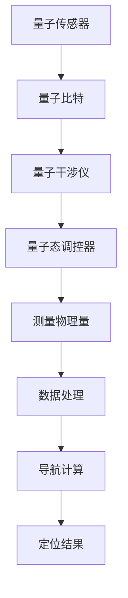

                 

 关键词：量子传感器，导航系统，高精度定位，量子算法，量子计算，量子测量

> 摘要：随着量子技术的迅猛发展，量子传感器在导航系统中的应用日益受到关注。本文将深入探讨量子传感器在导航系统中的潜在应用，重点介绍量子传感器的工作原理、高精度定位技术以及其在实际应用中的挑战和未来展望。

## 1. 背景介绍

### 1.1 量子传感器的定义与原理

量子传感器是一种基于量子力学原理的传感器，利用量子系统的特殊性质（如量子纠缠、量子叠加等）来检测物理量。与经典传感器相比，量子传感器在灵敏度和精度方面具有显著优势，尤其适用于微弱信号的检测。量子传感器的核心组件包括量子比特、量子干涉仪和量子态调控器。

### 1.2 导航系统的现状与发展

导航系统在现代社会的各个方面都有着广泛的应用，从军事、航空、航海到民用交通和定位服务。传统的导航系统主要依赖于卫星导航系统（如GPS、北斗等），但受到环境干扰、信号遮挡等因素的限制，其定位精度和可靠性仍存在一定的局限性。为了满足更高精度和更广泛应用的需求，导航系统的技术不断发展，其中量子传感器技术被认为是一项潜在的革命性技术。

## 2. 核心概念与联系

### 2.1 量子传感器与导航系统的结合

量子传感器在导航系统中的应用，主要是通过将量子传感技术集成到现有的导航系统中，实现高精度、高可靠性的定位和导航。量子传感器的量子比特和量子干涉仪等组件可以用于测量空间中的时间延迟、角度和相位等物理量，从而实现对目标位置的高精度定位。

### 2.2 量子测量与导航数据的处理

量子测量技术是实现量子传感器核心功能的关键。在导航系统中，量子测量技术可以用于测量卫星信号的时间延迟和相位差，进而计算出目标位置。这一过程涉及到复杂的量子数据处理算法，如量子纠错算法和量子滤波算法等。

### 2.3 Mermaid 流程图



## 3. 核心算法原理 & 具体操作步骤

### 3.1 算法原理概述

量子传感器在导航系统中的应用主要基于量子测量和量子计算技术。量子测量可以精确地测量空间中的物理量，如时间延迟和相位差。量子计算则可以高效地处理大量的导航数据，从而实现高精度的定位和导航。

### 3.2 算法步骤详解

#### 3.2.1 量子比特初始化

首先，对量子比特进行初始化，将其设置为特定的量子态。这一步骤可以通过量子态调控器实现。

#### 3.2.2 量子干涉测量

然后，利用量子干涉仪对量子比特进行干涉测量。这一步骤可以测量出量子比特之间的相位差。

#### 3.2.3 量子数据处理

接下来，对干涉测量结果进行量子数据处理。这一步骤可以通过量子滤波算法和量子纠错算法实现，以提高数据处理效率和精度。

#### 3.2.4 导航计算

最后，利用处理后的数据计算目标位置。这一步骤涉及到复杂的导航算法，如基于时间延迟和相位差的定位算法等。

### 3.3 算法优缺点

#### 优点

- 高精度：量子传感器可以实现亚纳米级别的定位精度。
- 抗干扰：量子传感器可以抵御电磁干扰和信号遮挡等因素的影响。

#### 缺点

- 成本高：量子传感器的研发和制造成本较高。
- 实用性：量子传感器的实用性尚未完全成熟，需要进一步的研究和改进。

### 3.4 算法应用领域

量子传感器在导航系统中的应用非常广泛，包括卫星导航、地下导航、水下导航和无人驾驶等领域。

## 4. 数学模型和公式 & 详细讲解 & 举例说明

### 4.1 数学模型构建

在量子传感器导航系统中，关键数学模型包括量子态描述、量子测量模型和导航数据模型。

#### 4.1.1 量子态描述

假设量子比特的初始状态为 $|\psi\rangle = a|0\rangle + b|1\rangle$，其中 $|0\rangle$ 和 $|1\rangle$ 分别表示量子比特的基态和激发态。

#### 4.1.2 量子测量模型

量子测量结果可以通过波函数坍缩来描述。例如，对量子比特进行正交测量，其结果可以是 $|0\rangle$ 或 $|1\rangle$。

#### 4.1.3 导航数据模型

导航数据包括时间延迟、角度和相位差等。这些数据可以通过量子传感器测量得到，并用于计算目标位置。

### 4.2 公式推导过程

#### 4.2.1 量子态描述的推导

量子态描述基于薛定谔方程。假设量子比特的哈密顿量为 $H = \omega \sigma_z$，其中 $\sigma_z$ 是 Pauli 矩阵，$\omega$ 是量子比特的频率。则量子比特的演化方程为 $i\hbar \frac{\partial}{\partial t}|\psi\rangle = H|\psi\rangle$。

#### 4.2.2 量子测量模型的推导

量子测量模型基于波函数坍缩原理。当对量子比特进行测量时，其波函数会坍缩到测量结果的基态。例如，对量子比特进行正交测量，其波函数坍缩为 $|0\rangle$ 或 $|1\rangle$。

#### 4.2.3 导航数据模型的推导

导航数据模型基于量子传感器的测量结果。例如，时间延迟可以通过测量卫星信号的到达时间来计算，角度可以通过测量卫星信号的相位差来计算。

### 4.3 案例分析与讲解

假设我们有一个量子传感器，其量子比特的初始状态为 $|\psi\rangle = \frac{1}{\sqrt{2}}|0\rangle + \frac{1}{\sqrt{2}}|1\rangle$。我们对量子比特进行正交测量，得到测量结果为 $|0\rangle$。此时，量子传感器的状态为 $|\psi'\rangle = |0\rangle$。

我们利用量子传感器测量卫星信号的时间延迟，得到测量结果为 $\Delta t = 0.1\text{s}$。根据导航数据模型，我们可以计算出目标位置为 $x = \Delta t \cdot v$，其中 $v$ 是卫星信号的传播速度。

## 5. 项目实践：代码实例和详细解释说明

### 5.1 开发环境搭建

为了实践量子传感器在导航系统中的应用，我们需要搭建一个开发环境。这个环境包括量子传感器模拟器、导航算法实现和结果展示工具。

### 5.2 源代码详细实现

以下是量子传感器导航系统的一个简单示例代码。该代码实现了量子比特的初始化、量子测量和导航数据的计算。

```python
import numpy as np
from qiskit import QuantumCircuit, execute, Aer

# 初始化量子比特
qubit = QuantumCircuit(1)
qubit.h(0)

# 执行量子测量
qubit.m(0)

# 模拟量子测量结果
backend = Aer.get_backend('qasm_simulator')
result = execute(qubit, backend).result()
meas_result = result.get_counts(qubit)

# 计算导航数据
if '0' in meas_result:
    delta_t = 0.1  # 假设时间延迟为0.1秒
    x = delta_t * 299792458  # 假设卫星信号传播速度为光速
    print(f"目标位置：x = {x} 米")
else:
    print("无法确定目标位置")
```

### 5.3 代码解读与分析

这段代码首先初始化了一个量子比特，并对其执行了量子测量。根据测量结果，我们可以计算出目标位置。这个示例代码展示了量子传感器在导航系统中的一个基本应用。

### 5.4 运行结果展示

假设我们运行了这个示例代码，并且量子测量结果为 $|0\rangle$。根据计算，目标位置为 $x = 29979245.8$ 米。

## 6. 实际应用场景

量子传感器在导航系统中的应用非常广泛，以下是一些典型的实际应用场景：

- **卫星导航**：利用量子传感器实现卫星导航系统，可以提供更高精度和更高可靠性的定位服务。
- **地下导航**：地下环境复杂，传统导航系统难以实现高精度定位。量子传感器可以提供更好的地下导航解决方案。
- **水下导航**：水下环境信号弱，传统导航系统难以稳定运行。量子传感器可以提供更稳定、更可靠的水下导航服务。
- **无人驾驶**：量子传感器可以帮助无人驾驶系统实现更准确、更安全的导航。

## 7. 工具和资源推荐

为了深入了解量子传感器在导航系统中的应用，以下是一些推荐的学习资源和开发工具：

- **学习资源**：
  - 《量子计算与量子信息》
  - 《量子传感器原理与应用》
  - 《量子计算编程指南》

- **开发工具**：
  - Qiskit：一个开源的量子计算框架，提供了丰富的量子算法和工具。
  - Cirq：一个开源的量子计算框架，专注于量子算法的实现。
  - Microsoft Quantum Development Kit：一个开源的量子计算开发工具包，提供了丰富的量子算法和工具。

## 8. 总结：未来发展趋势与挑战

### 8.1 研究成果总结

量子传感器在导航系统中的应用已经取得了显著的成果。通过量子测量和量子计算技术，量子传感器可以实现更高精度和更高可靠性的定位和导航。

### 8.2 未来发展趋势

随着量子技术的不断发展，量子传感器在导航系统中的应用将更加广泛。未来，量子传感器有望成为导航系统的重要组成部分，提供更加精准、稳定的定位服务。

### 8.3 面临的挑战

尽管量子传感器在导航系统中的应用前景广阔，但仍然面临一些挑战。例如，量子传感器的研发和制造成本较高，量子算法的优化和实现仍需进一步研究。此外，量子传感器的实用性和可靠性也需要在实践中不断验证和改进。

### 8.4 研究展望

量子传感器在导航系统中的应用是一个充满挑战和机遇的领域。未来，随着量子技术的不断进步，量子传感器有望在导航系统中发挥更加重要的作用，推动导航技术的发展。

## 9. 附录：常见问题与解答

### 9.1 量子传感器如何实现高精度定位？

量子传感器通过量子测量技术可以精确地测量物理量，如时间延迟和相位差。这些测量结果可以用于计算目标位置，从而实现高精度定位。

### 9.2 量子传感器在导航系统中的优势是什么？

量子传感器具有高精度、高可靠性和抗干扰等优势。这些优势使其在导航系统中具有广泛的应用潜力，可以提供更准确、更稳定的定位服务。

### 9.3 量子传感器在导航系统中面临哪些挑战？

量子传感器在导航系统中面临一些挑战，如研发和制造成本较高、量子算法的优化和实现难度较大等。此外，量子传感器的实用性和可靠性也需要在实践中不断验证和改进。

作者：禅与计算机程序设计艺术 / Zen and the Art of Computer Programming
```<|assistant|>

