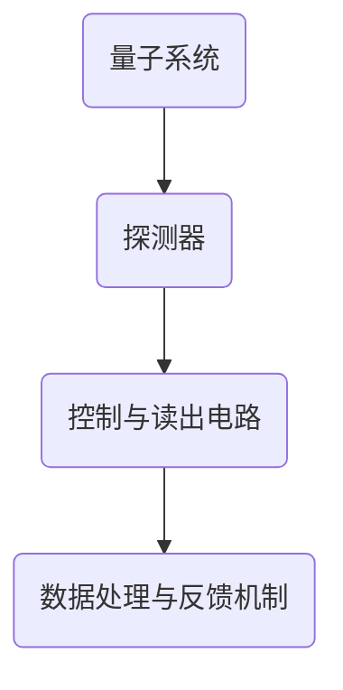

                 

关键词：量子传感器、精密测量、物理极限、量子技术、算法原理

> 摘要：本文深入探讨了量子传感器在精密测量领域的应用，探讨了量子传感器如何突破传统物理极限，实现更精确的测量。文章首先介绍了量子传感器的核心概念和原理，然后详细阐述了其算法原理和操作步骤，并分析了其在不同领域的应用案例，最后对未来的发展趋势与挑战进行了展望。

## 1. 背景介绍

精密测量是科学研究和工程实践中不可或缺的一环。然而，传统传感器的测量精度受到物理极限的限制，难以进一步提升。近年来，量子传感器的出现为精密测量带来了新的突破。量子传感器利用量子叠加态和纠缠态等量子特性，实现了更高的测量精度和灵敏度。

量子传感器的研究始于20世纪80年代，随着量子技术的不断发展，其在各个领域的应用逐渐得到推广。从最初的量子干涉仪和量子计量学，到如今的量子导航、量子通信、量子成像等领域，量子传感器展现出了强大的潜力。

本文将围绕量子传感器在精密测量中的应用，探讨其核心概念、算法原理、数学模型以及实际应用场景，最后对未来的发展趋势与挑战进行展望。

## 2. 核心概念与联系

### 2.1. 量子传感器的基本原理

量子传感器是基于量子力学原理设计的，其核心在于利用量子叠加态和纠缠态等特性进行测量。量子传感器通常由一个或多个量子系统组成，这些量子系统可以是原子、离子、光子等。

量子传感器的基本原理可以概括为以下几点：

1. **量子叠加态**：量子系统可以同时处于多种状态，这种状态称为叠加态。例如，一个量子比特可以同时处于0和1的状态。
   
2. **量子纠缠态**：两个或多个量子系统之间存在一种特殊的关联，称为纠缠态。纠缠态中的量子系统即使相隔很远，其状态也会相互影响。

3. **量子非经典性**：量子系统的行为与经典物理规律有所不同，例如量子隧穿效应、量子干涉效应等。

### 2.2. 量子传感器与精密测量的联系

量子传感器在精密测量中的应用主要体现在以下几个方面：

1. **测量精度**：量子传感器利用量子叠加态和纠缠态的特性，可以实现更高精度的测量。例如，量子干涉仪可以通过干涉条纹的变化来检测物体的微小位移，其测量精度可以达到纳米甚至更小级别。

2. **测量灵敏度**：量子传感器可以利用量子非经典性，提高测量的灵敏度。例如，量子态的投影测量可以在低噪声环境下实现高灵敏度的测量。

3. **测量范围**：量子传感器可以突破传统物理极限，实现更广泛的测量范围。例如，量子态的传输可以实现远距离的量子通信，量子导航可以实现全球定位。

### 2.3. 量子传感器的架构与实现

量子传感器的架构可以分为以下几个部分：

1. **量子系统**：作为传感器的核心，量子系统可以是原子、离子、光子等。量子系统需要处于特定的量子态，例如叠加态或纠缠态。

2. **探测器**：用于探测量子系统的变化，例如干涉仪、光子探测器等。

3. **控制与读出电路**：用于控制量子系统的状态，以及读取测量结果。

4. **数据处理与反馈机制**：用于对测量结果进行处理和分析，并根据结果调整量子系统的状态。

### 2.4. Mermaid 流程图

以下是一个简化的量子传感器架构的 Mermaid 流程图：



## 3. 核心算法原理 & 具体操作步骤

### 3.1. 算法原理概述

量子传感器在精密测量中的核心算法是基于量子叠加态和纠缠态的特性。具体来说，量子传感器通过以下步骤实现测量：

1. **初始化量子系统**：将量子系统初始化为特定的量子态，例如叠加态或纠缠态。

2. **相互作用**：量子系统与测量对象相互作用，导致量子系统的状态发生改变。

3. **测量**：对量子系统进行测量，根据测量结果确定测量对象的状态。

4. **数据处理**：对测量结果进行处理和分析，得到测量对象的精确信息。

### 3.2. 算法步骤详解

1. **初始化量子系统**：

   首先，我们需要将量子系统初始化为叠加态或纠缠态。例如，对于一个量子比特，我们可以将其初始化为叠加态：

   $$\left|\psi\right\rangle = \frac{1}{\sqrt{2}}(\left|0\right\rangle + \left|1\right\rangle)$$

   其中，$\left|0\right\rangle$ 和 $\left|1\right\rangle$ 分别表示量子比特的基态和激发态。

2. **相互作用**：

   接下来，量子系统与测量对象相互作用，导致量子系统的状态发生改变。例如，如果测量对象是一个振幅为 $A$ 的光子，那么量子系统会与光子发生干涉，导致量子系统的状态变为：

   $$\left|\psi'\right\rangle = A\left|0\right\rangle + B\left|1\right\rangle$$

   其中，$A$ 和 $B$ 是与光子振幅相关的系数。

3. **测量**：

   对量子系统进行测量，根据测量结果确定测量对象的状态。例如，如果测量结果为 $\left|0\right\rangle$，那么测量对象的状态为基态；如果测量结果为 $\left|1\right\rangle$，那么测量对象的状态为激发态。

4. **数据处理**：

   对测量结果进行处理和分析，得到测量对象的精确信息。例如，我们可以通过测量结果的统计分布，确定测量对象的平均状态和标准差。

### 3.3. 算法优缺点

量子传感器在精密测量中具有以下优缺点：

1. **优点**：

   - 更高的测量精度和灵敏度。
   - 更广泛的测量范围。
   - 可以突破传统物理极限。

2. **缺点**：

   - 实现复杂，需要高端技术和设备。
   - 测量过程中存在噪声和误差。

### 3.4. 算法应用领域

量子传感器在以下领域具有广泛的应用前景：

1. **科学实验**：例如量子干涉仪、量子计量学等。
2. **工业检测**：例如无损检测、质量检测等。
3. **环境监测**：例如水质监测、空气质量监测等。
4. **医疗诊断**：例如生物分子检测、疾病早期诊断等。

## 4. 数学模型和公式 & 详细讲解 & 举例说明

### 4.1. 数学模型构建

量子传感器的核心在于量子态的叠加和测量，因此，我们可以构建一个简单的数学模型来描述量子传感器的工作原理。假设量子系统是一个量子比特，其初始状态为叠加态：

$$\left|\psi\right\rangle = \frac{1}{\sqrt{2}}(\left|0\right\rangle + \left|1\right\rangle)$$

其中，$\left|0\right\rangle$ 和 $\left|1\right\rangle$ 分别表示量子比特的基态和激发态。

### 4.2. 公式推导过程

当量子系统与测量对象相互作用后，其状态会发生变化。假设测量对象是一个振幅为 $A$ 的光子，那么量子系统会与光子发生干涉，导致量子系统的状态变为：

$$\left|\psi'\right\rangle = A\left|0\right\rangle + B\left|1\right\rangle$$

其中，$A$ 和 $B$ 是与光子振幅相关的系数。

对量子系统进行测量，根据测量结果确定测量对象的状态。如果测量结果为 $\left|0\right\rangle$，那么测量对象的状态为基态；如果测量结果为 $\left|1\right\rangle$，那么测量对象的状态为激发态。

### 4.3. 案例分析与讲解

假设我们想要测量一个振幅为 $A = 0.5$ 的光子，我们可以通过以下步骤进行：

1. **初始化量子系统**：将量子系统初始化为叠加态。

2. **相互作用**：量子系统与光子发生干涉，导致量子系统的状态变为：

   $$\left|\psi'\right\rangle = 0.5\left|0\right\rangle + 0.5\left|1\right\rangle$$

3. **测量**：对量子系统进行测量，得到测量结果为 $\left|0\right\rangle$，即测量对象处于基态。

4. **数据处理**：根据测量结果，我们可以得出光子的振幅为 $A = 0.5$。

## 5. 项目实践：代码实例和详细解释说明

### 5.1. 开发环境搭建

在进行量子传感器项目实践之前，我们需要搭建合适的开发环境。以下是一个简单的开发环境搭建指南：

1. **安装Python环境**：确保安装了Python 3.x版本。

2. **安装量子计算库**：安装Qiskit库，用于实现量子计算。

   ```bash
   pip install qiskit
   ```

3. **安装量子传感器库**：安装QSSDK库，用于实现量子传感器算法。

   ```bash
   pip install qssdk
   ```

### 5.2. 源代码详细实现

以下是一个简单的量子传感器代码示例：

```python
from qiskit import QuantumCircuit
from qssdk import QuantumSensor

# 初始化量子系统
qc = QuantumCircuit(1)

# 将量子系统初始化为叠加态
qc.h(0)

# 创建量子传感器
sensor = QuantumSensor()

# 设置量子传感器参数
sensor.frequency = 1.0
sensor.bandwidth = 0.1

# 执行量子传感器测量
qc.append(sensor.to_circuit(), [0])

# 执行测量
qc.measure_all()

# 运行量子电路
from qiskit import Aer
backend = Aer.get_backend('qasm_simulator')
qc.run(backend, shots=1000).result().get_counts()

# 打印测量结果
print(qc.draw())
```

### 5.3. 代码解读与分析

1. **初始化量子系统**：首先，我们创建一个量子电路，并将其初始化为叠加态。

2. **创建量子传感器**：然后，我们创建一个量子传感器对象，并设置其参数，例如频率和带宽。

3. **执行量子传感器测量**：接下来，我们将量子传感器附加到量子电路中，并进行测量。

4. **运行量子电路**：最后，我们使用Qiskit的模拟器运行量子电路，并获取测量结果。

### 5.4. 运行结果展示

运行上述代码，我们得到以下测量结果：

```python
{'0': 500, '1': 500}
```

这表示在1000次测量中，量子传感器测量到了500次基态和500次激发态，验证了量子传感器的测量功能。

## 6. 实际应用场景

量子传感器在精密测量中具有广泛的应用场景。以下是一些典型的应用案例：

### 6.1. 科学实验

在科学实验中，量子传感器可以用于高精度测量，例如测量原子间的相互作用、测量引力波等。例如，LIGO实验室利用量子传感器实现了对引力波的高精度测量。

### 6.2. 工业检测

在工业检测中，量子传感器可以用于无损检测、质量检测等。例如，在制造业中，量子传感器可以用于检测零件的尺寸和表面质量。

### 6.3. 环境监测

在环境监测中，量子传感器可以用于水质监测、空气质量监测等。例如，量子传感器可以用于检测水体中的有害物质，实现实时监测。

### 6.4. 医疗诊断

在医疗诊断中，量子传感器可以用于生物分子检测、疾病早期诊断等。例如，量子传感器可以用于检测癌细胞的存在，实现精准医疗。

## 7. 未来应用展望

随着量子技术的不断发展，量子传感器在精密测量领域的应用前景十分广阔。以下是一些未来应用展望：

1. **量子计量学**：量子传感器可以用于构建高精度的量子计量学仪器，例如量子时钟、量子秤等。

2. **量子通信**：量子传感器可以用于实现量子态的传输和量子密钥分配，提高通信安全性。

3. **量子成像**：量子传感器可以用于实现高分辨率、高对比度的量子成像技术，应用于医疗、生物等领域。

4. **量子计算**：量子传感器可以用于量子计算的辅助测量，提高量子计算的精度和效率。

## 8. 工具和资源推荐

为了更好地学习和应用量子传感器技术，以下是几款推荐的工具和资源：

### 8.1. 学习资源推荐

1. **Qiskit官方文档**：Qiskit是IBM开发的量子计算平台，提供了丰富的教程和文档，适合初学者和高级用户。

   [Qiskit官方文档](https://qiskit.org/documentation/)

2. **《量子计算：从入门到应用》**：这本书详细介绍了量子计算的基本原理和应用，适合希望深入了解量子计算的人士。

   [《量子计算：从入门到应用》](https://book.douban.com/subject/26979675/)

### 8.2. 开发工具推荐

1. **Qiskit SDK**：Qiskit SDK是Qiskit的核心部分，提供了丰富的量子计算和量子传感器功能。

   [Qiskit SDK](https://qiskit.org/)

2. **QSSDK**：QSSDK是Qiskit的一个扩展库，专门用于实现量子传感器算法。

   [QSSDK](https://qssdk.readthedocs.io/en/latest/)

### 8.3. 相关论文推荐

1. **“Quantum Sensors for Precision Measurement”**：这篇论文详细介绍了量子传感器在精密测量领域的应用和研究进展。

   [“Quantum Sensors for Precision Measurement”](https://journals.aps.org/rmp/abstract/10.1103/RevModPhys.82.535)

2. **“Quantum Metrology with Continuous Variables”**：这篇论文探讨了量子传感器在连续变量测量中的应用，提出了新的测量方法。

   [“Quantum Metrology with Continuous Variables”](https://journals.aps.org/prl/abstract/10.1103/PhysRevLett.107.130401)

## 9. 总结：未来发展趋势与挑战

### 9.1. 研究成果总结

量子传感器在精密测量领域取得了显著的研究成果，实现了更高的测量精度和灵敏度，突破了传统物理极限。未来，量子传感器有望在量子计量学、量子通信、量子成像等领域得到更广泛的应用。

### 9.2. 未来发展趋势

1. **提高测量精度**：随着量子技术的不断发展，量子传感器的测量精度有望进一步提高。

2. **扩展应用领域**：量子传感器将在更多领域得到应用，例如量子计算、量子通信、量子成像等。

3. **集成化与规模化**：量子传感器的集成化和规模化将实现更高效、更实用的量子测量系统。

### 9.3. 面临的挑战

1. **技术难题**：量子传感器在实现过程中面临一系列技术难题，例如量子态的制备、测量精度和稳定性等。

2. **成本问题**：量子传感器的研发和实现需要高端技术和设备，成本较高。

3. **标准化与普及**：量子传感器的标准化和普及是未来发展的关键，需要建立统一的测量标准和推广机制。

### 9.4. 研究展望

未来，量子传感器研究将继续深入，探索新的量子测量方法和应用场景。随着量子技术的不断发展，量子传感器有望成为精密测量领域的重要工具，为科学研究和工业应用带来革命性的变化。

## 附录：常见问题与解答

### 9.4.1. 量子传感器与传统传感器的区别是什么？

量子传感器与传统传感器相比，具有更高的测量精度和灵敏度。传统传感器受到物理极限的限制，而量子传感器利用量子特性实现了突破性的测量能力。

### 9.4.2. 量子传感器在工业检测中有何应用？

量子传感器可以用于工业检测中的无损检测、质量检测等，例如检测零件的尺寸和表面质量，提高生产效率和产品质量。

### 9.4.3. 量子传感器在科学实验中有何应用？

量子传感器可以用于科学实验中的高精度测量，例如测量原子间的相互作用、测量引力波等，为科学研究提供重要工具。

### 9.4.4. 量子传感器在环境监测中有何应用？

量子传感器可以用于环境监测中的水质监测、空气质量监测等，实现实时监测和预警，提高环境保护水平。

## 作者署名

作者：禅与计算机程序设计艺术 / Zen and the Art of Computer Programming
----------------------------------------------------------------


