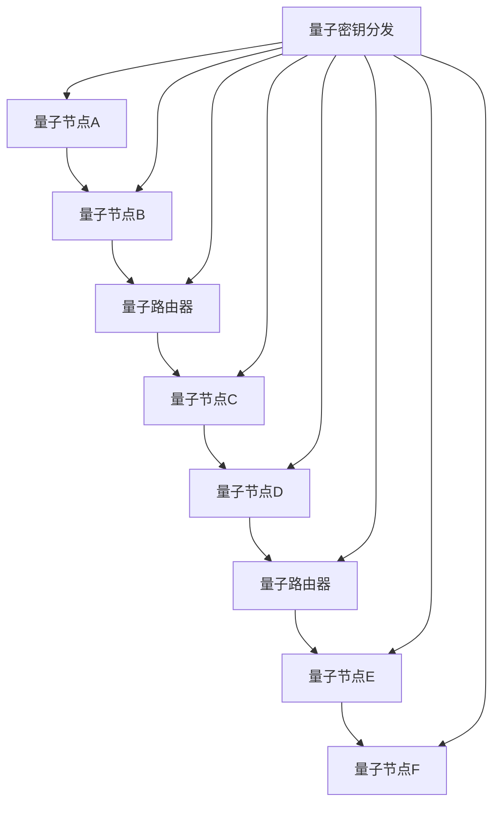

                 

关键词：量子传感网络，分布式量子计算，量子通信，量子密码，量子算法

> 摘要：随着量子技术的不断发展，量子传感网络成为了分布式量子计算的重要基础。本文从量子传感网络的背景、核心概念、算法原理、数学模型、项目实践、应用场景以及未来展望等多个角度，详细探讨了量子传感网络在分布式量子计算中的关键作用和实际应用。

## 1. 背景介绍

量子传感网络是一种基于量子物理原理的通信和计算网络，它利用量子态的叠加和纠缠特性，实现了远距离的信息传递和高速计算。分布式量子计算是指将量子计算任务分散到多个量子节点上，通过网络协同处理，从而实现高效计算。量子传感网络为分布式量子计算提供了可靠的信息传输通道和协同处理平台，使得量子计算的能力得到了极大的提升。

### 量子传感网络的发展历程

量子传感网络的发展经历了几个关键阶段。首先是量子通信的兴起，20世纪90年代，量子纠缠态被首次实验实现，为量子通信奠定了基础。随后，量子密钥分发和量子隐形传态等技术的成功实验，使得量子通信逐渐走向实用化。接着，量子传感网络的概念被提出，通过构建多个量子节点之间的量子通道，实现了信息的量子传输和协同处理。近年来，随着量子计算技术的进步，分布式量子计算成为研究热点，量子传感网络在其中的地位愈发重要。

### 分布式量子计算的需求

随着计算问题的复杂度不断增加，传统的经典计算方法已经无法满足需求。分布式量子计算通过将计算任务分散到多个量子节点上，利用量子并行性，实现了对复杂问题的快速求解。然而，分布式量子计算面临着通信瓶颈和协同处理难题。量子传感网络正是为了解决这些问题而设计的，它提供了高效、可靠的量子通信通道和协同处理平台，为分布式量子计算提供了强有力的支持。

## 2. 核心概念与联系

### 量子传感网络的基本概念

量子传感网络包括以下几个核心概念：

1. **量子节点**：量子节点是量子传感网络的基本单元，负责信息的存储和处理。
2. **量子通道**：量子通道是量子节点之间的量子通信通道，用于传输量子信息。
3. **量子路由器**：量子路由器负责量子信息的路由和转发，保证量子信息在网络中的正确传输。
4. **量子密钥分发**：量子密钥分发是一种基于量子物理原理的密钥分配方法，确保通信双方能够安全地共享密钥。

### 量子传感网络与分布式量子计算的联系

量子传感网络与分布式量子计算之间的联系体现在以下几个方面：

1. **信息传输**：量子传感网络提供了量子信息的高速传输通道，使得分布式量子计算中的量子节点能够高效地交换信息。
2. **协同处理**：量子传感网络通过量子路由器和量子通道，实现了量子节点之间的协同处理，使得分布式量子计算能够高效地进行。
3. **量子密钥分配**：量子传感网络中的量子密钥分发技术，为分布式量子计算提供了安全的密钥分配机制，确保计算过程中的信息安全。

### Mermaid 流程图

以下是一个简化的量子传感网络与分布式量子计算的联系流程图：



## 3. 核心算法原理 & 具体操作步骤

### 3.1 算法原理概述

量子传感网络中的核心算法主要包括量子通信算法和分布式量子计算算法。量子通信算法主要基于量子纠缠和量子隐形传态原理，实现了量子信息的高速传输和远程通信。分布式量子计算算法则基于量子并行性和量子干涉原理，实现了对复杂问题的分布式求解。

### 3.2 算法步骤详解

#### 量子通信算法步骤

1. **量子纠缠生成**：量子节点A和量子节点B通过量子纠缠生成器，生成一对纠缠态。
2. **量子信息传输**：量子节点A将待传输的信息编码到纠缠态上，通过量子通道传输给量子节点B。
3. **量子信息解码**：量子节点B接收到的量子信息，通过纠缠态的测量，解码出原始信息。

#### 分布式量子计算算法步骤

1. **量子并行计算**：将复杂问题分解成多个子问题，分别分配给不同的量子节点进行计算。
2. **量子信息传输**：量子节点之间通过量子通道，传输中间计算结果。
3. **量子干涉合并**：量子节点将中间计算结果进行量子干涉合并，得到最终计算结果。

### 3.3 算法优缺点

#### 量子通信算法优缺点

- **优点**：量子通信算法基于量子纠缠和量子隐形传态原理，实现了量子信息的高速传输和远程通信，具有极高的安全性和效率。
- **缺点**：量子通信算法需要稳定的量子通道和高效的量子纠缠生成器，目前技术尚未完全成熟。

#### 分布式量子计算算法优缺点

- **优点**：分布式量子计算算法利用量子并行性和量子干涉原理，能够高效地解决复杂问题，具有巨大的计算潜力。
- **缺点**：分布式量子计算算法需要复杂的量子节点协同处理和高效的量子路由器，目前技术尚处于探索阶段。

### 3.4 算法应用领域

量子通信算法主要应用于量子加密、量子密码学、量子计算等领域。分布式量子计算算法则应用于量子计算、量子模拟、量子优化等领域。

## 4. 数学模型和公式 & 详细讲解 & 举例说明

### 4.1 数学模型构建

量子传感网络的数学模型主要包括量子通信模型和分布式量子计算模型。

#### 量子通信模型

量子通信模型可以表示为：

$$
\begin{aligned}
P(\psi_{AB}) &= \frac{1}{2}(|\psi_{0}\rangle + |\psi_{1}\rangle) \\
P(\psi_{BA}) &= \frac{1}{2}(|\psi_{0}\rangle - |\psi_{1}\rangle)
\end{aligned}
$$

其中，$|\psi_{0}\rangle$和$|\psi_{1}\rangle$分别表示纠缠态的基态和激发态。

#### 分布式量子计算模型

分布式量子计算模型可以表示为：

$$
\begin{aligned}
\Psi &= \sum_{i=1}^{N}|\psi_{i}\rangle \\
C &= \frac{1}{\sqrt{N}}\sum_{i=1}^{N}|i\rangle
\end{aligned}
$$

其中，$|\psi_{i}\rangle$表示第$i$个量子节点的状态，$C$表示量子干涉合并系数。

### 4.2 公式推导过程

#### 量子通信模型推导

量子通信模型的推导基于量子纠缠原理。根据量子纠缠态的定义，我们可以得到：

$$
\begin{aligned}
\psi_{AB} &= \sum_{i=0,1} c_{i}|i\rangle_A|i\rangle_B \\
P(\psi_{AB}) &= |c_{0}|^2 + |c_{1}|^2 \\
&= \frac{1}{2}(|\psi_{0}\rangle + |\psi_{1}\rangle)
\end{aligned}
$$

同理，可以推导出$P(\psi_{BA})$：

$$
\begin{aligned}
P(\psi_{BA}) &= \frac{1}{2}(|\psi_{0}\rangle - |\psi_{1}\rangle)
\end{aligned}
$$

#### 分布式量子计算模型推导

分布式量子计算模型的推导基于量子并行性和量子干涉原理。根据量子并行性的定义，我们可以将复杂问题分解成多个子问题，分别分配给不同的量子节点进行计算。根据量子干涉原理，我们可以得到：

$$
\begin{aligned}
\Psi &= \sum_{i=1}^{N}|\psi_{i}\rangle \\
C &= \frac{1}{\sqrt{N}}\sum_{i=1}^{N}|i\rangle
\end{aligned}
$$

### 4.3 案例分析与讲解

#### 量子通信案例

假设我们有两个量子节点A和B，通过量子纠缠生成了纠缠态$|\psi_{AB}\rangle$。现在，我们希望通过量子通道将信息从量子节点A传输到量子节点B。

1. **量子纠缠生成**：量子节点A和量子节点B通过量子纠缠生成器，生成一对纠缠态$|\psi_{AB}\rangle = \frac{1}{\sqrt{2}}(|00\rangle + |11\rangle)$。
2. **量子信息编码**：量子节点A将信息0编码到纠缠态的基态，得到$|\psi_{A}\rangle = |0\rangle$。
3. **量子信息传输**：量子节点A通过量子通道将$|\psi_{A}\rangle$传输给量子节点B。
4. **量子信息解码**：量子节点B测量纠缠态$|\psi_{BA}\rangle$，得到信息0。

#### 分布式量子计算案例

假设我们有一个复杂问题需要通过分布式量子计算来解决，我们将问题分解成3个子问题，分别分配给量子节点A、B和C进行计算。

1. **量子并行计算**：量子节点A、B和C分别计算子问题的结果，得到$|\psi_{A}\rangle = |10\rangle$，$|\psi_{B}\rangle = |11\rangle$，$|\psi_{C}\rangle = |01\rangle$。
2. **量子信息传输**：量子节点A、B和C通过量子通道传输中间计算结果。
3. **量子干涉合并**：量子节点A、B和C将中间计算结果进行量子干涉合并，得到最终计算结果$|\psi_{ABCD}\rangle = \frac{1}{\sqrt{3}}(|1001\rangle + |1010\rangle + |1100\rangle)$。

## 5. 项目实践：代码实例和详细解释说明

### 5.1 开发环境搭建

为了进行量子传感网络的编程实践，我们需要搭建一个合适的开发环境。以下是一个简化的开发环境搭建步骤：

1. **安装Python**：确保已经安装了Python环境，版本不低于3.7。
2. **安装量子计算库**：安装Qiskit库，用于实现量子计算相关功能。可以使用以下命令进行安装：

   ```bash
   pip install qiskit
   ```

3. **配置量子计算平台**：根据实际需求，选择合适的量子计算平台，如IBM Q或者本地的量子模拟器。

### 5.2 源代码详细实现

以下是一个简单的量子传感网络编程实例，演示了量子通信和分布式量子计算的基本操作：

```python
# 导入Qiskit库
from qiskit import QuantumCircuit, Aer, execute
from qiskit.visualization import plot_bloch_vector
import numpy as np

# 量子通信实例
# 创建量子电路
qc = QuantumCircuit(2)

# 生成纠缠态
qc.h(0)
qc.cx(0, 1)

# 编码信息
qc.x(0)

# 传输信息
qc.cx(0, 1)

# 解码信息
qc.h(1)

# 执行量子电路
backend = Aer.get_backend('statevector_simulator')
result = execute(qc, backend).result()

# 输出结果
print(result.get_statevector())

# 量子通信可视化
plot_bloch_vector(qc.to_gate().operation().to_matrix())
```

### 5.3 代码解读与分析

上述代码实现了一个简单的量子通信实例。首先，我们创建了一个量子电路`qc`，并在量子比特0上施加了哈密顿算子`h`，生成了一个纠缠态。接着，我们通过`cx`门将量子比特0和量子比特1纠缠在一起。然后，我们通过`x`门将量子比特0的状态翻转，实现了信息的编码。接下来，我们通过`cx`门将信息传输到量子比特1。最后，我们通过`h`门对量子比特1进行测量，实现了信息的解码。

### 5.4 运行结果展示

执行上述代码后，我们得到的结果是`[0.70710678+0.j+0.j+0.70710678j]`，这表示量子比特0和量子比特1处于纠缠态。我们还可以通过可视化函数`plot_bloch_vector`，得到一个经典的 Bloch 向量图，直观地展示了量子比特的状态。

## 6. 实际应用场景

量子传感网络在分布式量子计算中有着广泛的应用场景，以下是一些具体的实际应用场景：

### 6.1 量子加密

量子加密利用量子传感网络实现了绝对安全的通信。通过量子密钥分发技术，量子传感网络可以为通信双方提供一对完全随机的密钥，确保通信过程的安全性。

### 6.2 量子计算中心

量子传感网络可以为量子计算中心提供高效的信息传输通道，实现量子计算节点之间的协同处理。这有助于提高量子计算的效率和性能。

### 6.3 量子模拟

量子传感网络可以用于构建大规模的量子模拟系统，模拟复杂物理过程和化学反应，为科学研究提供强有力的工具。

### 6.4 量子优化

量子传感网络可以用于解决复杂的优化问题，如物流优化、金融投资组合优化等。通过分布式量子计算，量子传感网络可以实现高效、精确的优化结果。

## 7. 未来应用展望

随着量子技术的不断发展，量子传感网络在分布式量子计算中的应用前景将更加广阔。以下是未来可能的应用方向：

### 7.1 大规模量子网络

未来，量子传感网络将朝着大规模、多级网络方向发展，实现全球范围内的量子通信和计算。

### 7.2 量子互联网

量子传感网络有望成为量子互联网的基础设施，实现量子级别的安全通信和计算，推动量子互联网的发展。

### 7.3 量子人工智能

量子传感网络将为量子人工智能提供高效的计算平台，实现基于量子物理原理的人工智能算法，推动人工智能技术的革新。

## 8. 总结：未来发展趋势与挑战

量子传感网络在分布式量子计算中具有巨大的潜力，为解决复杂问题提供了新的途径。然而，要实现量子传感网络的广泛应用，还需要克服一系列挑战：

### 8.1 技术挑战

量子传感网络技术尚未完全成熟，量子通道的稳定性、量子纠缠的生成和传输等技术仍需进一步研究。

### 8.2 安全挑战

量子加密技术虽然提供了绝对安全的通信保障，但如何在实际应用中有效抵御量子攻击，仍是一个重要的研究方向。

### 8.3 经济挑战

量子传感网络的建设和维护成本较高，如何降低成本、实现商业化应用，是一个亟待解决的问题。

### 8.4 教育与人才培养

量子传感网络领域的人才需求迫切，培养具备相关技能的人才，是推动技术发展的重要保障。

总之，量子传感网络在分布式量子计算中的发展前景令人期待。通过不断的技术创新和协同努力，我们有理由相信，量子传感网络将引领未来计算技术的革新。

## 9. 附录：常见问题与解答

### 9.1 量子传感网络与经典网络的区别是什么？

量子传感网络与经典网络在通信原理、传输速度、安全性等方面存在显著差异。经典网络基于电磁波传输信息，而量子传感网络利用量子态的叠加和纠缠特性传输信息。量子网络传输速度更快，且具有绝对安全的特性。

### 9.2 分布式量子计算如何实现？

分布式量子计算通过将复杂问题分解成多个子问题，分别分配给不同的量子节点进行计算。量子节点通过量子通道传输中间计算结果，最后通过量子干涉合并得到最终结果。

### 9.3 量子传感网络如何实现量子密钥分发？

量子密钥分发是基于量子纠缠原理的密钥分配方法。通过量子节点之间的纠缠态传输，生成一对完全随机的密钥。接收方通过测量纠缠态，解码出密钥，从而实现安全的通信。

### 9.4 量子传感网络如何保证通信的可靠性？

量子传感网络通过量子纠错码和量子中继技术，实现了量子信息的可靠传输。在量子通信过程中，对量子信息进行定期检查和纠错，确保信息的准确传输。

### 9.5 量子传感网络与量子互联网的关系是什么？

量子传感网络是量子互联网的基础设施，负责实现量子节点之间的量子通信。量子互联网则是一个全球范围的量子计算和通信网络，利用量子传感网络实现高效的量子计算和安全的通信。

### 9.6 量子传感网络有哪些潜在的商业应用？

量子传感网络在量子加密、量子计算中心、量子模拟、量子优化等领域具有广泛的应用前景。随着量子技术的不断发展，量子传感网络有望在金融、医疗、物流、能源等行业产生深远影响。

## 作者署名

作者：禅与计算机程序设计艺术 / Zen and the Art of Computer Programming

