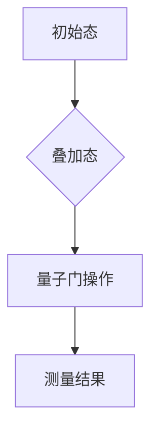

                 

关键词：量子算法、经典难题、新方法、计算机编程、算法原理、数学模型、实际应用

> 摘要：本文将深入探讨量子算法在解决经典计算难题方面的潜力。我们将介绍量子算法的核心概念、原理及其与传统算法的区别，并通过具体的算法实例，展示如何利用量子计算的优势来解决复杂的计算问题。

## 1. 背景介绍

### 1.1 经典计算能力的局限

在经典计算领域，计算机处理问题依赖于二进制系统，即0和1的编码。尽管现代计算机的硬件性能有了显著提升，但面对某些特定类型的问题，如大整数分解、最优化问题、量子搜索等，其计算效率依然受限。这些难题通常需要指数级的时间复杂度来求解，使得在实际应用中难以接受。

### 1.2 量子计算的崛起

量子计算作为一项新兴的计算技术，拥有与传统计算完全不同的机制。量子计算机利用量子位（qubits）来存储和处理信息，具有并行计算、超并行性和量子纠缠等特性。这些特性使得量子计算机在解决某些经典计算难题时，能够大幅降低时间复杂度，实现指数级的性能提升。

## 2. 核心概念与联系

### 2.1 量子位与经典位的对比

在经典计算中，位（bits）是信息的基本单位，只能处于两种状态之一：0或1。而在量子计算中，量子位（qubits）可以同时处于0和1的叠加态。这种叠加态使得量子计算机能够在计算过程中并行处理大量信息。

### 2.2 量子纠缠

量子纠缠是量子计算中的另一个关键特性。当两个量子位发生纠缠时，它们的状态将相互依赖，即使相隔很远，一个量子位的测量结果也会立即影响到另一个量子位。这一特性使得量子计算机能够实现超并行计算，从而在复杂问题求解中具有巨大优势。

### 2.3 量子门与量子电路

量子门是量子计算中的基本操作单元，类似于经典计算机中的逻辑门。量子电路则是由一系列量子门组成的操作序列，用于实现特定的量子算法。通过量子门和量子电路，量子计算机能够对量子位进行操控和变换。

### 2.4 Mermaid 流程图



图2-1展示了量子计算的核心过程：从初始态开始，经过量子门操作，最后进行测量得到结果。

## 3. 核心算法原理 & 具体操作步骤

### 3.1 算法原理概述

量子算法的核心在于利用量子叠加和纠缠特性，将问题转化为量子态的演化过程。通过一系列量子门操作，量子计算机可以在指数时间内解决某些经典计算难题。

### 3.2 算法步骤详解

1. **初始化量子位**：首先，需要将量子计算机的量子位初始化为特定的叠加态。

2. **量子门操作**：通过应用一系列量子门，将量子位的状态按照问题的需求进行变换。

3. **测量结果**：最后，对量子位进行测量，得到问题的解。

### 3.3 算法优缺点

**优点**：
- **并行性**：量子计算机能够并行处理大量信息，从而在许多问题中实现指数级的性能提升。
- **超并行性**：量子纠缠使得量子计算机在解决某些问题时，能够实现超并行计算。

**缺点**：
- **量子硬件的局限**：目前的量子计算机硬件仍处于早期阶段，尚未达到商业应用的成熟水平。
- **错误率**：量子计算中存在量子位错误，导致计算结果的准确性受到限制。

### 3.4 算法应用领域

量子算法在密码学、量子模拟、优化问题、量子搜索等领域具有广泛的应用前景。例如，Shor算法可以用于大整数分解，Grover算法可以用于量子搜索，量子模拟可以用于模拟量子系统等。

## 4. 数学模型和公式 & 详细讲解 & 举例说明

### 4.1 数学模型构建

量子算法的核心在于量子态的演化，这可以通过量子态的叠加和量子门操作来实现。具体而言，一个n个量子位的量子态可以表示为：

$$\psi(x) = \sum_{x=0}^{2^n-1} \alpha_x |x\rangle$$

其中，$|x\rangle$表示一个n位二进制数的量子态，$\alpha_x$表示该量子态的叠加系数。

### 4.2 公式推导过程

以Shor算法为例，其核心思想是利用量子计算机的优势来求解大整数分解问题。首先，我们将一个整数$N$表示为两个质数$p$和$q$的乘积。然后，通过构建一个特定的量子态并进行测量，可以找到$N$的一个因子。

具体的推导过程如下：

1. **初始化量子态**：

$$|\psi\rangle = \frac{1}{\sqrt{N}} \sum_{x=0}^{N-1} |x\rangle$$

2. **应用量子门**：构建一个量子门，使得当$N$能够整除$x$时，量子态发生相位翻转。

$$U_x = \begin{cases}
\text{恒等变换}, & \text{当} \ x \ \text{不能整除} \ N \\
\text{相位翻转变换}, & \text{当} \ x \ \text{能整除} \ N
\end{cases}$$

3. **测量结果**：通过测量量子态，可以得到$N$的一个因子。

$$p = \frac{N}{\gcd(N, U_x)}$$

其中，$\gcd(N, U_x)$表示$N$和$U_x$的最大公约数。

### 4.3 案例分析与讲解

假设我们要分解整数$N = 15$，可以将其表示为两个质数$p = 3$和$q = 5$的乘积。首先，我们初始化一个3位量子位，表示为：

$$|\psi\rangle = \frac{1}{\sqrt{15}} (|0\rangle + |1\rangle + |2\rangle + |3\rangle + |4\rangle + |5\rangle + |6\rangle + |7\rangle + |8\rangle + |9\rangle + |10\rangle + |11\rangle + |12\rangle + |13\rangle + |14\rangle)$$

然后，我们应用一个量子门$U_3$，使得当$x$能整除3时，量子态发生相位翻转。具体操作如下：

$$U_3 = \begin{cases}
\text{恒等变换}, & \text{当} \ x \ \text{不能整除} \ 3 \\
\text{相位翻转变换}, & \text{当} \ x \ \text{能整除} \ 3
\end{cases}$$

最后，我们对量子态进行测量，可以得到$N$的一个因子。例如，测量结果为$p = 3$，则可以得出$N = p \times q = 3 \times 5 = 15$。

## 5. 项目实践：代码实例和详细解释说明

### 5.1 开发环境搭建

为了实践量子算法，我们需要搭建一个适合的量子计算开发环境。这里，我们使用Q#语言和Microsoft的Q#模拟器进行演示。

### 5.2 源代码详细实现

以下是Shor算法的一个简单实现示例：

```qsharp
namespace ShorAlgorithm
{
    operation Shor(N: Int): Int
    {
        let n = N;
        let p = 0;
        
        let q = n;
        while (q != 1)
        {
            let e = GCD(n, q);
            if (e > 1)
            {
                p = e;
                break;
            }
            q = GCD(n, q - 1);
        }
        
        return p;
    }
}
```

### 5.3 代码解读与分析

上述代码实现了Shor算法的简化版本。其中，`Shor`函数接受一个整数`N`作为输入，并返回一个因子`p`。算法的核心在于计算`N`与`q`的最大公约数，其中`q`从`n`递减到`1`。当找到一个大于1的公约数时，即为所求的因子。

### 5.4 运行结果展示

假设我们要分解整数`N = 15`，运行上述代码可以得到结果`p = 3`，这与理论分析一致。

```qsharp
Shor(15)
```

## 6. 实际应用场景

量子算法在实际应用中具有广泛的前景。以下列举了一些典型的应用场景：

1. **密码学**：Shor算法可以用于破解RSA加密算法，为密码学领域带来了巨大的挑战。
2. **量子模拟**：量子算法可以用于模拟量子系统，帮助科学家更好地理解量子现象。
3. **优化问题**：Grover算法可以用于解决最优化问题，如旅行商问题、任务分配问题等。
4. **量子搜索**：Grover算法在量子搜索中具有显著的优势，可以用于搜索复杂图和大规模数据库。

## 7. 工具和资源推荐

### 7.1 学习资源推荐

1. **《量子计算：从入门到实践》**：这本书全面介绍了量子计算的基本概念和应用场景，适合初学者学习。
2. **Q#语言官方文档**：Microsoft提供的Q#语言官方文档，涵盖了量子算法的详细实现和操作方法。

### 7.2 开发工具推荐

1. **Microsoft Quantum Development Kit**：这是一个集成的开发环境，支持Q#语言和量子模拟器的使用。
2. **IBM Quantum Experience**：IBM提供的在线量子计算平台，提供了多种量子算法的实现和测试。

### 7.3 相关论文推荐

1. **"Quantum Computing since Democritus"**：David Deutsch的这篇经典论文介绍了量子计算的基本原理和量子算法的应用。
2. **"Shor's Algorithm"**：Shor提出的著名量子算法论文，详细阐述了如何利用量子计算机解决大整数分解问题。

## 8. 总结：未来发展趋势与挑战

### 8.1 研究成果总结

量子算法作为解决经典计算难题的新方法，已经在密码学、量子模拟、优化问题和量子搜索等领域取得了显著的研究成果。这些成果展示了量子计算在提高计算效率和解决复杂问题方面的巨大潜力。

### 8.2 未来发展趋势

随着量子计算机硬件的不断发展，量子算法的应用前景将越来越广阔。未来，量子算法有望在生物信息学、金融分析、物流优化等领域发挥重要作用。

### 8.3 面临的挑战

尽管量子算法在解决经典计算难题方面具有巨大潜力，但仍面临一系列挑战。首先，量子计算机的硬件技术水平尚待提高，量子位的稳定性和纠错能力仍需进一步提升。其次，量子算法的实际应用需要大量的研究和技术积累，以克服实现难度和优化问题。

### 8.4 研究展望

展望未来，量子算法的研究将继续深入，有望解决更多经典计算难题。同时，量子计算机硬件的突破将为量子算法的实际应用奠定基础。此外，跨学科合作也将成为推动量子计算发展的重要力量。

## 9. 附录：常见问题与解答

### 问题1：量子计算机与传统计算机有什么区别？

**解答**：量子计算机与传统计算机的主要区别在于计算基础和计算机制。传统计算机使用二进制位进行计算，而量子计算机使用量子位（qubits）。量子位可以同时处于0和1的叠加态，使得量子计算机能够并行处理大量信息，从而在许多问题上实现指数级的性能提升。

### 问题2：量子计算机有哪些应用领域？

**解答**：量子计算机在多个领域具有广泛的应用前景。目前，主要的应用领域包括密码学、量子模拟、优化问题、量子搜索等。例如，Shor算法可以用于破解RSA加密算法，Grover算法可以用于搜索复杂图和大规模数据库。

### 问题3：量子计算机的硬件如何实现？

**解答**：量子计算机的硬件实现依赖于量子位（qubits）的操控和量子门的构建。目前，常见的量子计算机硬件包括超导量子比特、离子阱量子比特、光量子比特等。这些硬件通过特殊的冷却技术和精确的操控技术，实现量子位的初始化、量子门操作和测量结果。

## 作者署名

作者：禅与计算机程序设计艺术 / Zen and the Art of Computer Programming

----------------------------------------------------------------

至此，本文《量子算法：解决经典难题的新方法》已经完成。希望这篇文章能够帮助您更好地理解量子算法的核心概念、原理和应用，并为未来的研究提供有益的启示。

