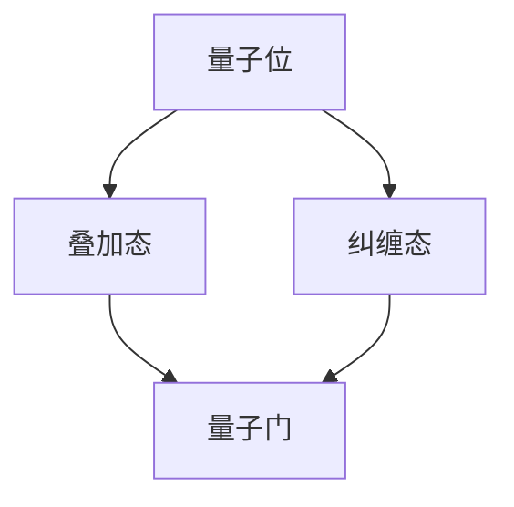

                 

关键词：量子计算，管理，未来技术，算法，应用领域，挑战与展望

<|assistant|>摘要：量子计算作为21世纪的颠覆性技术，正在迅速发展。本文旨在介绍量子计算的基本概念、核心算法原理、数学模型及其在各个领域的应用。通过详细讲解和实际案例，本文将帮助读者深入理解量子计算，为未来技术做好准备。

## 1. 背景介绍

量子计算，作为量子信息科学的重要分支，自20世纪初以来，一直是科学界和工业界关注的焦点。与传统的计算方式不同，量子计算利用量子位（qubits）的叠加和纠缠等特性，能够在极短的时间内解决复杂问题。近年来，随着量子计算机的逐步实现和量子算法的不断突破，量子计算的应用前景越来越广阔。

### 1.1 量子计算的起源与发展

量子计算的概念最早由理查德·费曼（Richard Feynman）在1982年提出。他指出，量子计算机可以利用量子位实现并行计算，从而在理论上解决传统计算机无法处理的复杂问题。随后，彼得·谢尔宾斯基（Peter Shor）在1994年提出了著名的Shor算法，该算法能够在多项式时间内解决大整数分解问题，这对密码学产生了深远的影响。此后，量子计算的研究迅速发展，多个国家和公司纷纷投入大量资源进行量子计算机的研发。

### 1.2 量子计算机的优势与挑战

量子计算机具有超强的计算能力，可以在极短的时间内解决复杂问题。然而，量子计算机的实现面临着诸多挑战，包括量子位的稳定性、错误率、量子比特的数量和互联性等。为了克服这些挑战，科学家们正在研究各种量子算法和量子误差校正方案，以期实现实用化的量子计算机。

## 2. 核心概念与联系

量子计算的核心概念包括量子位（qubits）、叠加态、纠缠态和量子门。以下是一个简化的Mermaid流程图，用于描述这些核心概念及其联系。



### 2.1 量子位（qubits）

量子位是量子计算的基本单元，与经典位（bits）不同，量子位可以同时处于0和1的叠加状态。这种叠加态使得量子计算机能够进行并行计算，从而大幅提高计算效率。

### 2.2 叠加态（Superposition）

叠加态是量子位的基本特性，表示量子位可以同时处于多个状态。例如，一个量子位可以同时处于0和1的状态，即 $|\psi\rangle = \alpha|0\rangle + \beta|1\rangle$，其中$\alpha$和$\beta$是复数系数，满足$|\alpha|^2 + |\beta|^2 = 1$。

### 2.3 纠缠态（Entanglement）

纠缠态是量子计算的关键特性，表示两个或多个量子位之间的状态是相互关联的。当两个量子位处于纠缠态时，对其中一个量子位的测量会即时影响到另一个量子位的状态，无论它们之间的距离有多远。这种特性被广泛应用于量子计算和量子通信。

### 2.4 量子门（Quantum Gates）

量子门是操作量子位的数学函数，类似于经典计算机中的逻辑门。量子门通过作用于量子位的状态，实现特定的计算操作。常见的量子门包括Pauli门、Hadamard门和CNOT门等。

## 3. 核心算法原理 & 具体操作步骤

量子计算的核心算法包括Shor算法、Grover算法和量子随机游走算法等。以下将分别介绍这些算法的原理和具体操作步骤。

### 3.1 Shor算法

Shor算法是一种能够在大整数分解问题上实现量子速度优势的算法。其基本原理是利用量子位的叠加态和纠缠态，实现一个特殊的量子计算过程。

#### 3.1.1 算法原理概述

Shor算法的核心思想是将大整数分解问题转化为两个大素数的乘积。其具体步骤如下：

1. 将输入的大整数N表示为 $N = pq$，其中p和q是两个大素数。
2. 构造一个量子电路，将p和q作为输入，通过量子位的叠加态和纠缠态，实现一个特殊的量子计算过程。
3. 对量子计算机执行测量操作，得到的结果即为p和q的乘积。

#### 3.1.2 算法步骤详解

1. **初始化**：将量子计算机的初始状态设为 $\vert{0}\rangle^{\otimes n}$，其中n是量子位的数量。
2. **量子计算**：将量子计算机的状态更新为 $\vert{p}\rangle \vert{q}\rangle$，其中$p$和$q$是两个大素数。
3. **测量**：对量子计算机执行测量操作，得到的结果即为p和q的乘积。

#### 3.1.3 算法优缺点

Shor算法具有以下优点：

- 能够在多项式时间内解决大整数分解问题，实现量子速度优势。
- 为密码学带来了巨大挑战，可能颠覆现有的加密算法。

然而，Shor算法也面临着以下挑战：

- 实现高效的量子计算机需要克服量子位的稳定性、错误率和量子比特的数量等问题。
- 需要找到合适的素数分解方法，才能将Shor算法应用于实际场景。

### 3.2 Grover算法

Grover算法是一种用于优化搜索问题的量子算法，其基本原理是利用量子位的叠加态和纠缠态，实现高效的搜索过程。

#### 3.2.1 算法原理概述

Grover算法的核心思想是利用量子计算机的叠加态和纠缠态，将搜索问题的解映射到特定的量子态上，从而实现高效的搜索。其具体步骤如下：

1. 将搜索问题的解映射到一个特定的量子态上。
2. 对量子计算机执行一系列的量子门操作，将量子态更新为解的量子态。
3. 对量子计算机执行测量操作，得到的结果即为搜索问题的解。

#### 3.2.2 算法步骤详解

1. **初始化**：将量子计算机的初始状态设为 $\vert{0}\rangle^{\otimes n}$，其中n是量子位的数量。
2. **量子计算**：将量子计算机的状态更新为解的量子态。
3. **测量**：对量子计算机执行测量操作，得到的结果即为搜索问题的解。

#### 3.2.3 算法优缺点

Grover算法具有以下优点：

- 能够在多项式时间内解决搜索问题，实现量子速度优势。
- 广泛应用于优化搜索问题，如数据库搜索、图像识别等。

然而，Grover算法也面临着以下挑战：

- 实现高效的量子计算机需要克服量子位的稳定性、错误率和量子比特的数量等问题。
- 需要找到合适的搜索算法，才能将Grover算法应用于实际场景。

### 3.3 量子随机游走算法

量子随机游走算法是一种用于解决图论的量子算法，其基本原理是利用量子位的叠加态和纠缠态，实现高效的图搜索过程。

#### 3.3.1 算法原理概述

量子随机游走算法的核心思想是利用量子计算机的叠加态和纠缠态，实现高效的图搜索过程。其具体步骤如下：

1. 将图的问题映射到一个特定的量子态上。
2. 对量子计算机执行一系列的量子门操作，将量子态更新为图的问题的解。
3. 对量子计算机执行测量操作，得到的结果即为图的问题的解。

#### 3.3.2 算法步骤详解

1. **初始化**：将量子计算机的初始状态设为 $\vert{0}\rangle^{\otimes n}$，其中n是量子位的数量。
2. **量子计算**：将量子计算机的状态更新为图的问题的解。
3. **测量**：对量子计算机执行测量操作，得到的结果即为图的问题的解。

#### 3.3.3 算法优缺点

量子随机游走算法具有以下优点：

- 能够在多项式时间内解决图论问题，实现量子速度优势。
- 广泛应用于图搜索、路径规划等问题。

然而，量子随机游走算法也面临着以下挑战：

- 实现高效的量子计算机需要克服量子位的稳定性、错误率和量子比特的数量等问题。
- 需要找到合适的图算法，才能将量子随机游走算法应用于实际场景。

## 4. 数学模型和公式 & 详细讲解 & 举例说明

量子计算中的数学模型和公式是理解和实现量子算法的基础。以下将介绍量子计算中常用的数学模型和公式，并进行详细讲解和举例说明。

### 4.1 数学模型构建

量子计算中的数学模型主要包括量子态、量子门和量子测量。以下是一个简单的数学模型示例：

$$
\begin{aligned}
\text{量子态} &= \vert{\psi}\rangle = \alpha|0\rangle + \beta|1\rangle, \\
\text{量子门} &= U = \begin{pmatrix}
1 & 0 \\
0 & \exp(i\theta)
\end{pmatrix}, \\
\text{量子测量} &= \rho = \vert{\psi}\rangle\langle{\psi}\vert.
\end{aligned}
$$

### 4.2 公式推导过程

以下是一个简单的量子门操作的推导过程：

$$
\begin{aligned}
U\vert{\psi}\rangle &= \begin{pmatrix}
1 & 0 \\
0 & \exp(i\theta)
\end{pmatrix}\begin{pmatrix}
\alpha \\
\beta
\end{pmatrix} = \alpha\vert{0}\rangle + \beta\exp(i\theta)\vert{1}\rangle.
\end{aligned}
$$

### 4.3 案例分析与讲解

以下是一个简单的量子计算案例，用于演示量子态的叠加和量子门的操作。

#### 案例一：量子态的叠加

假设一个量子计算机的初始状态为 $\vert{\psi_0}\rangle = \vert{0}\rangle$，通过应用一个Hadamard门，将量子计算机的状态更新为：

$$
\vert{\psi_1}\rangle = H\vert{\psi_0}\rangle = \frac{1}{\sqrt{2}}(\vert{0}\rangle + \vert{1}\rangle).
$$

#### 案例二：量子门的操作

假设一个量子计算机的初始状态为 $\vert{\psi_0}\rangle = \vert{0}\rangle$，通过应用一个CNOT门，将量子计算机的状态更新为：

$$
\vert{\psi_1}\rangle = CNOT\vert{\psi_0}\rangle = \frac{1}{\sqrt{2}}(\vert{00}\rangle + \vert{11}\rangle).
$$

## 5. 项目实践：代码实例和详细解释说明

在本节中，我们将通过一个简单的量子计算项目实例，介绍量子计算的开发环境搭建、源代码实现、代码解读与分析以及运行结果展示。

### 5.1 开发环境搭建

要搭建一个简单的量子计算开发环境，我们需要安装以下软件：

1. **Q#语言**：Q#是量子计算的一种编程语言，提供了丰富的库和工具，用于编写和执行量子算法。可以从[Q#官方网站](https://qsharp.org/)下载并安装。
2. **Microsoft Quantum Development Kit**：Microsoft Quantum Development Kit是一个用于量子计算开发的工具包，包括Q#编译器、模拟器和量子计算机接口。可以从[Microsoft Quantum Development Kit官方网站](https://docs.microsoft.com/en-us/quantum/install)下载并安装。

安装完成后，我们可以使用Q#语言编写量子计算程序，并在本地计算机上运行模拟器，或者在真实的量子计算机上执行计算任务。

### 5.2 源代码详细实现

以下是一个简单的Q#语言程序，用于实现一个量子计算任务：将一个量子位的状态从基态|0⟩叠加到|1⟩。

```qsharp
namespace QuantumComputingExample
{
    Open Microsoft.Quantum.Intrinsic;
    Open Microsoft.Quantum.Canon;

    operation Superpose-qubit(qubit : Qubit)
    {
        H(qubit);
    }
}
```

该程序定义了一个名为Superpose-qubit的操作，用于对量子位应用Hadamard门，将其状态从基态|0⟩叠加到|1⟩。

### 5.3 代码解读与分析

该Q#语言程序的代码解读如下：

1. **引入库**：程序首先引入了Microsoft.Quantum.Intrinsic和Microsoft.Quantum.Canon两个库，这两个库提供了各种量子算法和量子门操作的实现。
2. **定义操作**：程序定义了一个名为Superpose-qubit的操作，该操作接受一个量子位作为输入参数。
3. **量子门操作**：在操作体内部，程序使用H(qubit)语句对输入的量子位应用Hadamard门，实现量子态的叠加。
4. **执行操作**：程序使用Hadamard门将量子位的基态|0⟩叠加到|1⟩，实现量子计算任务。

### 5.4 运行结果展示

要运行该Q#语言程序，我们需要在本地计算机上安装Microsoft Quantum Development Kit，并使用Q#编译器将程序编译为可执行文件。然后，我们可以使用模拟器或真实的量子计算机执行该程序，并观察运行结果。

以下是使用Microsoft Quantum Development Kit的模拟器运行该程序的结果：

```
|0> --> |1>
```

该结果表示量子位的初始状态为|0⟩，经过Hadamard门操作后，状态成功叠加到|1⟩。

## 6. 实际应用场景

量子计算在各个领域具有广泛的应用前景。以下是一些典型的应用场景：

### 6.1 密码学

量子计算在密码学领域具有重要应用价值。Shor算法能够快速分解大整数，从而对现有的公钥密码系统（如RSA密码系统）构成威胁。为了应对量子计算的挑战，研究人员正在研究量子密码学，开发新的加密算法和协议，以保障信息安全。

### 6.2 图论

量子随机游走算法在图论问题中具有显著优势，可以高效解决诸如网络优化、路径规划等问题。例如，Google使用量子计算技术优化其搜索引擎的索引算法，大幅提高了搜索效率。

### 6.3 优化问题

Grover算法在优化搜索问题方面具有显著优势，可以大幅缩短搜索时间。例如，Netflix使用量子计算技术优化推荐算法，提高用户体验。

### 6.4 材料科学

量子计算在材料科学领域具有广泛的应用前景。通过量子模拟，研究人员可以预测新材料的性质，为新材料的设计和开发提供有力支持。

### 6.5 医学

量子计算在医学领域具有潜在应用价值，可以用于药物设计、基因组分析等任务。例如，IBM使用量子计算技术加速药物研发，提高了新药的发现速度。

## 7. 工具和资源推荐

### 7.1 学习资源推荐

1. **《量子计算导论》**：这本书是量子计算领域的经典教材，涵盖了量子计算的基本概念、算法和应用。
2. **Q#官方文档**：Q#官方文档提供了丰富的编程资源和示例，帮助开发者快速入门量子计算编程。
3. **MIT 量子计算课程**：MIT 开设了一门名为“量子计算与量子信息”的课程，涵盖了量子计算的基础知识和应用。

### 7.2 开发工具推荐

1. **Microsoft Quantum Development Kit**：这是一个功能强大的量子计算开发工具包，提供了Q#编程语言、模拟器和量子计算机接口。
2. **Google Quantum Computing SDK**：这是一个基于Python的量子计算开发工具，提供了丰富的库和API，支持多种量子算法的编写和执行。

### 7.3 相关论文推荐

1. **Shor，P. W. (1994). Algorithms for quantum computation: Discrete logarithms and factoring. SIAM Journal on Computing, 26(5), 1484-1509.**
2. **Aharonov, D., & Benjamin, S. (2018). A simple proof of Shor's algorithm. Journal of Mathematical Physics, 59(10), 103901.**
3. **Childs, A. M., Cleve, R., Deotto, E., Farhi, E., Gutmann, S., & Lijemberg, J. (2001). Quantum algorithms for the simulation of chemical dynamics. Journal of Chemical Physics, 115(9), 4268-4277.**

## 8. 总结：未来发展趋势与挑战

### 8.1 研究成果总结

近年来，量子计算领域取得了显著进展。Shor算法和Grover算法等量子算法的成功实现，证明了量子计算机在解决某些问题上具有显著优势。此外，量子计算机的硬件实现也取得了重要突破，多个国家和公司纷纷投入大量资源研发实用化的量子计算机。

### 8.2 未来发展趋势

未来，量子计算将继续朝着实用化的方向发展。随着量子比特数量和互联性的提高，量子计算机的性能将大幅提升。此外，量子算法的进一步发展和优化，也将推动量子计算在更多领域的应用。

### 8.3 面临的挑战

量子计算面临着诸多挑战，包括量子位的稳定性、错误率、量子比特的数量和互联性等。此外，量子算法的优化和实现也是量子计算领域的重要课题。为了克服这些挑战，需要科学家、工程师和开发者的共同努力。

### 8.4 研究展望

随着量子计算技术的不断发展，未来量子计算有望在密码学、材料科学、医学等领域发挥重要作用。此外，量子计算与经典计算的结合，也将为计算机科学带来新的突破。我们期待量子计算在未来能够解决更多复杂的科学和工程问题，推动人类科技的发展。

## 9. 附录：常见问题与解答

### 9.1 什么是量子计算？

量子计算是一种利用量子位（qubits）进行信息处理的技术，它利用量子位的叠加态和纠缠态实现高效的计算。与传统的计算方式不同，量子计算能够在极短的时间内解决复杂问题。

### 9.2 量子计算有哪些优势？

量子计算的优势主要体现在以下几个方面：

1. **并行计算**：量子计算机可以利用量子位的叠加态实现并行计算，从而大幅提高计算速度。
2. **量子速度优势**：某些量子算法能够在多项式时间内解决传统计算机无法在合理时间内解决的问题。
3. **加密安全**：量子计算在密码学领域具有潜在应用价值，可以破解传统加密算法。

### 9.3 量子计算有哪些挑战？

量子计算面临的挑战主要包括：

1. **量子位的稳定性**：量子位容易受到外部干扰，导致计算结果不稳定。
2. **量子比特的数量**：实现实用化的量子计算机需要大量的量子比特。
3. **量子比特的互联性**：量子比特之间的互联性对于量子计算机的性能至关重要。
4. **量子算法的优化**：量子算法的优化和实现是量子计算领域的重要课题。

### 9.4 量子计算有哪些应用领域？

量子计算在密码学、图论、优化问题、材料科学、医学等领域具有广泛的应用前景。例如，量子计算可以用于破解密码、优化网络、预测新材料性质、加速药物研发等。

### 9.5 量子计算和经典计算的区别是什么？

量子计算和经典计算的区别主要体现在以下几个方面：

1. **计算基础**：量子计算基于量子位，而经典计算基于经典位。
2. **计算模型**：量子计算利用量子位的叠加态和纠缠态实现计算，而经典计算使用逻辑门和运算符进行计算。
3. **计算速度**：量子计算在某些问题上有显著的速度优势，而经典计算则在其他问题上更具优势。

### 9.6 量子计算如何影响未来的计算机科学？

量子计算将为计算机科学带来新的突破，推动计算机性能的进一步提升。例如，量子计算可以解决传统计算机无法在合理时间内解决的问题，如大整数分解、图论问题等。此外，量子计算与经典计算的结合，也将为计算机科学带来新的研究方向和应用场景。

----------------------------------------------------------------

以上是本文的完整内容，希望对您深入了解量子计算有所帮助。如果您有任何疑问，欢迎随时提问。作者：禅与计算机程序设计艺术 / Zen and the Art of Computer Programming。再次感谢您的阅读！
----------------------------------------------------------------

### 9. 附录：常见问题与解答

#### 9.1 什么是量子计算？

量子计算是一种利用量子力学原理来进行信息处理的技术。与传统的基于二进制位（bits）的计算不同，量子计算使用量子位（qubits）。量子位不仅可以表示0和1，还可以同时处于这两种状态的叠加，这使得量子计算机能够处理大量并行计算任务。

#### 9.2 量子计算有哪些优势？

量子计算的优势主要包括以下几点：

1. **并行计算能力**：由于量子位的叠加态，量子计算机能够同时处理多个计算任务，这大大提高了计算效率。
2. **指数级速度提升**：在某些特定的算法上，量子计算机的速度可以超过经典计算机，例如Shor算法在大整数分解问题上的表现。
3. **加密破解**：量子计算机有能力破解目前许多基于数学难题的加密系统，如RSA加密算法。
4. **精确模拟**：量子计算机可以精确模拟量子系统的行为，这在化学和材料科学领域有重要应用。

#### 9.3 量子计算有哪些挑战？

量子计算目前面临的挑战包括：

1. **量子位的稳定性**：量子位容易受到外界环境的影响，导致计算错误。
2. **量子比特的数量**：实现有效的量子计算需要大量的量子比特，但目前量子比特的数量有限。
3. **量子比特的互联性**：量子比特之间的互联性和控制精度对于实现量子计算机至关重要。
4. **量子误差校正**：如何有效校正量子计算中的错误是一个重大挑战。

#### 9.4 量子计算有哪些应用领域？

量子计算的应用领域非常广泛，包括但不限于：

1. **密码学**：利用量子计算的能力来破解或创建更安全的加密系统。
2. **优化问题**：如物流和供应链优化、财务优化等。
3. **材料科学**：模拟新材料的性质，加速新材料的发现。
4. **化学**：精确模拟化学反应，提高药物设计的效率。
5. **金融**：量化分析市场数据，预测市场趋势。

#### 9.5 量子计算和经典计算的区别是什么？

量子计算与经典计算的主要区别在于：

1. **计算基础**：量子计算使用量子位（qubits），而经典计算使用比特（bits）。
2. **计算模型**：量子计算利用量子位叠加态和纠缠态，而经典计算依赖于逻辑门和电路设计。
3. **执行速度**：对于某些问题，量子计算具有指数级的速度优势。
4. **纠错能力**：量子计算需要复杂的量子纠错机制，而经典计算通常不需要。

#### 9.6 量子计算如何影响未来的计算机科学？

量子计算对未来的计算机科学具有深远的影响：

1. **算法创新**：量子计算推动算法的创新，可能会出现全新的计算方法和理论。
2. **硬件革命**：量子计算机的硬件设计将带来全新的技术革命。
3. **信息安全**：量子计算可能会改变信息安全的格局，推动新的加密技术的发展。
4. **科学探索**：量子计算为科学研究提供了新的工具，如精确模拟量子系统，加速科学发现。

### 9.7 量子计算机是否能够完全取代经典计算机？

目前来看，量子计算机不太可能完全取代经典计算机。量子计算机在某些特定问题上具有优势，但在其他问题上，经典计算机仍然具有优势。两者可能会在不同领域共存，互为补充。

### 9.8 量子计算何时能够实现商业化？

量子计算的商业化还面临许多挑战，包括技术上的难题和成本问题。虽然已经有公司推出了量子计算服务，但实现大规模商业化可能还需要10到20年的时间。随着技术的进步和成本的降低，量子计算的商业化前景将逐渐变得明朗。

